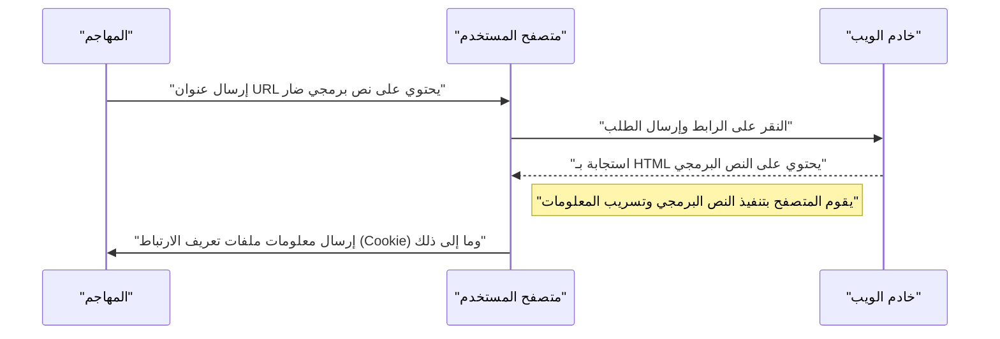
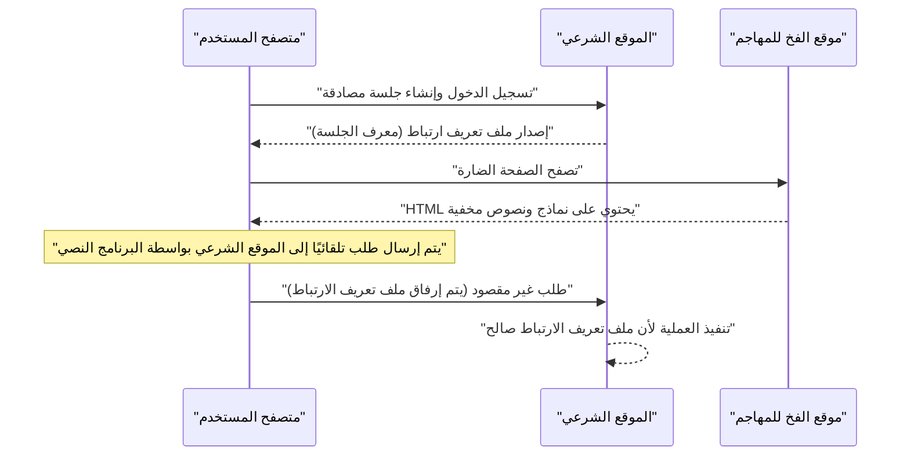

# الثغرات الأمنية في تطبيقات الويب والتدابير المضادة (أهم 10 مخاطر حسب OWASP والبرمجة الآمنة)

في تطبيقات الويب الحديثة، تعد التدابير الأمنية عنصرًا أساسيًا لا غنى عنه. أساليب الهجوم تتطور يوميًا، ويجب على المطورين اكتساب المعرفة باستمرار حول أحدث التهديدات وتقنيات **البرمجة الآمنة** لمنعها. في هذا المقال، سنشرح بالتفصيل آليات الثغرات الرئيسية، وتأثير الهجمات، وأساليب الدفاع المحددة، بناءً على "أهم 10 مخاطر حسب OWASP"، وهو المعيار الفعلي لأمن تطبيقات الويب.

## ما هو OWASP Top 10

OWASP (مشروع أمان تطبيقات الويب المفتوح عالميًا) هي منظمة دولية غير ربحية تهدف إلى تحسين أمان البرمجيات. "أهم 10 مخاطر حسب OWASP"، الذي يتم إصداره بانتظام، هو تقرير يلخص أهم 10 مخاطر أمنية في تطبيقات الويب، وتتبناه العديد من الشركات والمطورين كمعيار للأمان.

في هذا المقال، سنسلط الضوء بشكل خاص على الثغرات ذات التأثير الكبير والتي تحدث بشكل متكرر، مثل "الحقن" و "البرمجة عبر المواقع (XSS)" و "تزوير الطلبات عبر المواقع (CSRF)" و "تزوير الطلبات من جانب الخادم (SSRF)" و "نقص التحكم في الوصول"، وسنتعمق فيها.

---

## 1. الحقن (Injection)

الحقن هو ثغرة تحدث عندما يتم إرسال بيانات غير موثوقة إلى المترجم كجزء من أمر أو استعلام. قد يتم تنفيذ البيانات الضارة للمهاجم بواسطة المترجم كأمر غير مقصود، أو قد يتم الوصول إلى البيانات دون الصلاحيات المناسبة.

### 1.1. حقن SQL

يحدث حقن SQL في التطبيقات التي تتفاعل مع قواعد البيانات عندما يتم دمج قيم الإدخال الخارجية بشكل غير صحيح في استعلامات SQL. هذا يسمح للمهاجمين بقراءة المعلومات الحساسة في قاعدة البيانات، والتلاعب بالبيانات، وحتى السيطرة على خادم قاعدة البيانات.

#### آلية الهجوم

كمثال نموذجي، دعونا نفكر في عملية تسجيل الدخول باستخدام اسم المستخدم وكلمة المرور.

**مثال على كود ضعيف (PHP):**

```php
$username = $_POST['username'];
$password = $_POST['password'];

// خطر: يتم دمج قيم الإدخال مباشرة في استعلام SQL
$query = "SELECT * FROM users WHERE username = '" . $username . "' AND password = '" . $password . "'";
$result = $mysqli->query($query);
```

لنفترض أن المهاجم أدخل السلسلة التالية في حقل `username` مقابل هذا الكود.

`admin' OR '1'='1`

عندئذٍ، سيكون استعلام SQL الذي يتم تنفيذه كالتالي:

```sql
SELECT * FROM users WHERE username = 'admin' OR '1'='1' AND password = ''
```

نظرًا لأن `'1'='1'` صحيح (True) دائمًا، يتم تجاوز التحقق من كلمة المرور ويمكن للمهاجم تسجيل الدخول كمستخدم `admin`.

#### أساليب الدفاع ضد حقن SQL

الطريقة الأكثر موثوقية لمنع حقن SQL هي استخدام **العبارات المحضرة (Prepared Statements)** (الاستعلامات ذات المعلمات). يفصل هذا بنية استعلام SQL عن البيانات ويمنع تفسير قيم الإدخال كأوامر SQL.

**مثال على كود محمي (PHP / PDO):**

```php
$username = $_POST['username'];
$password = $_POST['password'];

// آمن: استخدام العبارات المحضرة
$stmt = $pdo->prepare("SELECT * FROM users WHERE username = :username AND password = :password");
$stmt->bindParam(':username', $username);
$stmt->bindParam(':password', $password);
$stmt->execute();
$result = $stmt->fetchAll();
```

### 1.2. حقن [NoSQL](https://kenji.blog/ar/p/nosql-database-selection-kvs-document-graph-wide-column/)

حتى في قواعد بيانات NoSQL (مثل [MongoDB](https://kenji.blog/ar/p/nosql-database-selection-kvs-document-graph-wide-column/)) التي أصبحت شائعة في السنوات الأخيرة، تحدث هجمات الحقن. تستخدم NoSQL لغات استعلام مختلفة عن SQL (مثل المستندة إلى JSON)، ولكن إذا لم يكن التحقق من قيمة الإدخال كافيًا، فقد يتسبب ذلك في تغييرات غير مقصودة في بنية الاستعلام.

**مثال على كود ضعيف (JavaScript / Node.js + MongoDB):**

```javascript
const username = req.body.username;
const password = req.body.password;

// خطر: يتم دمج قيم الإدخال مباشرة في الكائن
db.collection('users').find({
    username: username,
    password: password
});
```

إذا أرسل المهاجم الكائن `{"$gt": ""}` إلى `password`، فسيصبح الاستعلام كالتالي.

```json
{
    "username": "admin",
    "password": {"$gt": ""}
}
```

هذا الشرط يعني "كلمة المرور أكبر من سلسلة فارغة (أي أي سلسلة)"، وسيتم تجاوز المصادقة.

#### أساليب الدفاع ضد حقن [NoSQL](https://kenji.blog/ar/p/nosql-database-selection-kvs-document-graph-wide-column/)

لمنع حقن NoSQL، من المهم التحقق الصارم من نوع قيم الإدخال والتأكد من عدم تمرير الكائنات إلى الأماكن التي يُتوقع فيها وجود سلاسل.

### 1.3. حقن أوامر نظام التشغيل

حقن أوامر نظام التشغيل هو ثغرة حيث يتم تفسير قيم الإدخال الخارجية كجزء من أمر الصدفة (shell) عندما ينفذ التطبيق أوامر النظام عبر الصدفة.

**مثال على كود ضعيف (Python):**

```python
import os

domain = request.args.get('domain')
# خطر: يتم دمج قيم الإدخال مباشرة في أمر نظام التشغيل
os.system(f"ping -c 4 {domain}")
```

إذا أدخل المهاجم `example.com; rm -rf /` في `domain`، فسيتم تنفيذ أمر مدمر بعد أمر `ping`.

#### أساليب الدفاع ضد حقن أوامر نظام التشغيل

يجب تجنب استدعاء أوامر نظام التشغيل قدر الإمكان واستخدام واجهات برمجة التطبيقات (المكتبات) المضمنة في اللغة. إذا كان من الضروري تنفيذ أمر نظام التشغيل، فقم بتمرير الوسائط كقائمة دون المرور عبر الصدفة.

**مثال على كود محمي (Python):**

```python
import subprocess

domain = request.args.get('domain')
# آمن: تمرير الوسائط كقائمة دون المرور عبر الصدفة
subprocess.run(["ping", "-c", "4", domain])
```

---

## 2. البرمجة عبر المواقع (XSS)

البرمجة عبر المواقع (XSS) هو هجوم حيث يقوم المهاجم بحقن نصوص برمجية ضارة (عادةً JavaScript) في صفحة ويب لتنفيذها على متصفحات المستخدمين الآخرين. يؤدي ذلك إلى سرقة رموز الجلسة، والعمليات غير المصرح بها بصلاحيات المستخدم، وإعادة التوجيه إلى مواقع التصيد، وما إلى ذلك.

### نموذج احتمالية نجاح الهجوم

في الهجمات من جانب العميل مثل XSS، تعتمد احتمالية نجاح الهجوم على احتمالية وقوع المستخدم في فخ (مثل النقر على رابط ضار). عند نمذجة هذا كصيغة رياضية، يكون كالتالي.

احتمالية نجاح الهجوم مرة واحدة على الأقل $\text{P(success)}$، بافتراض أن احتمالية الفشل في محاولة واحدة هي $\text{p}$، وعدد المحاولات (مثل عدد الروابط المرسلة) هو $\text{n}$، يمكن التعبير عنها على النحو التالي.

$ \text{P(success)} = 1 - (1 - \text{p})^\text{n} $

من هذه المعادلة، يمكننا أن نرى أنه إذا كانت الثغرة موجودة وزاد عدد محاولات الهجوم، فإن احتمالية نجاح الهجوم تقترب أسيًا من 1. لذلك، فإن القضاء التام على الثغرة أمر ضروري.

### أنواع XSS

ينقسم XSS بشكل أساسي إلى الأنواع الثلاثة التالية.

#### 2.1. XSS المنعكس (Reflected XSS)

يتم تنفيذه عندما يتم حث المستخدم على النقر فوق عنوان URL يحتوي على برنامج نصي ضار، وينعكس هذا البرنامج النصي (Reflect) كما هو في استجابة الخادم (مثل رسائل الخطأ أو نتائج البحث).



#### 2.2. XSS المخزن (Stored XSS)

يتم تخزين (Store) البرنامج النصي الضار في قاعدة بيانات أو لوحة رسائل، وما إلى ذلك، ويتم تنفيذه عندما يعرض المستخدمون الآخرون تلك البيانات. إنه XSS خطير يميل إلى أن يكون له نطاق واسع من الضرر.

#### 2.3. DOM-based XSS

هذه ثغرة حيث تقوم JavaScript من جانب العميل (في المتصفح) بتنفيذ برنامج نصي غير صالح في عملية معالجة DOM (نموذج كائن المستند) دون المرور عبر الخادم.

### أساليب الدفاع ضد XSS

المبدأ الأساسي لمنع XSS هو **الهروب (التعقيم)**. عند إخراج قيم الإدخال من المستخدم إلى صفحة الويب، قم بتحويل الأحرف التي لها معنى خاص في HTML (مثل `<` و `>` و `&` و `"` و `'`) إلى سلاسل غير ضارة.

**مثال على كود ضعيف (JavaScript / معالجة DOM):**

```html
<div id="greeting"></div>
<script>
    // الحصول على الاسم من معلمات URL
    const params = new URLSearchParams(window.location.search);
    const name = params.get('name');
    
    // خطر: تخصيص قيمة الإدخال لـ innerHTML دون الهروب
    document.getElementById('greeting').innerHTML = "مرحبًا، " + name + "!";
</script>
```

**مثال على كود محمي (JavaScript):**

```html
<div id="greeting"></div>
<script>
    const params = new URLSearchParams(window.location.search);
    const name = params.get('name');
    
    // آمن: استخدم textContent للتعامل كنص
    document.getElementById('greeting').textContent = "مرحبًا، " + name + "!";
</script>
```

عند الإخراج في الخلفية (مثل PHP)، استخدم وظيفة الهروب المناسبة (مثل `htmlspecialchars`) بنفس الطريقة. بالإضافة إلى ذلك، من خلال إدخال سياسة أمان المحتوى (CSP)، يمكن توفير دفاع متعدد الطبقات يمنع تنفيذ البرنامج النصي حتى لو تم حقنه.

---

## 3. تزوير الطلبات عبر المواقع (CSRF)

CSRF هو هجوم يجبر المستخدم على إرسال طلب غير مقصود إلى تطبيق ويب تمت المصادقة عليه من قبل المستخدم. هذا يؤدي إلى تغييرات غير مقصودة في كلمة المرور للمستخدم، وشراء المنتجات، وإلغاء العضوية، وما إلى ذلك.

### تدفق هجوم CSRF



### أساليب الدفاع ضد CSRF

لمنع CSRF، نحتاج إلى آلية للتحقق مما إذا كان الطلب مقصودًا حقًا من قبل المستخدم.

#### 3.1. رمز CSRF

الإجراء الأكثر شيوعًا هو إنشاء رمز عشوائي على جانب الخادم وتضمينه عند إرسال النموذج. يتحقق الخادم من الرمز المرسل ويرفض الطلب إذا لم يتطابق.

**مثال على كود محمي (نموذج HTML):**

```html
<form action="/update_profile" method="POST">
    <!-- تضمين رمز CSRF المُنشأ على الخادم -->
    <input type="hidden" name="csrf_token" value="abc123xyz456...">
    <input type="text" name="email">
    <button type="submit">تحديث</button>
</form>
```

#### 3.2. SameSite Cookie

كإجراء أكثر حداثة، هناك طريقة لاستخدام السمة `SameSite` لملف تعريف الارتباط (Cookie). من خلال تعيين `SameSite=Lax` أو `SameSite=Strict`، لن يتم إرسال ملفات تعريف الارتباط للطلبات من نطاقات مختلفة، مما يمنع هجمات CSRF بشكل أساسي.

**مثال على رأس HTTP المحمي:**

```http
Set-Cookie: session_id=12345; Secure; HttpOnly; SameSite=Lax
```

---

## 4. تزوير الطلبات من جانب الخادم (SSRF)

SSRF هو هجوم يجعل الخادم يرسل طلبًا إلى أي عنوان URL يحدده المهاجم، عندما يكون لتطبيق الويب وظيفة لجلب البيانات من عنوان URL خارجي. هذا يسمح بالوصول إلى الأنظمة داخل الشبكة الداخلية (مثل واجهات برمجة تطبيقات البيانات الوصفية السحابية وقواعد البيانات الداخلية) التي لا يمكن الوصول إليها عادةً من الخارج.

### تهديدات وتأثيرات SSRF

في البيئات السحابية (AWS، GCP، Azure، إلخ)، قد يكون من الممكن الحصول على بيانات وصفية مثل بيانات الاعتماد عن طريق الوصول إلى عنوان IP محدد (مثل `169.254.169.254`) من داخل المثيل. إذا تم الوصول إلى واجهة برمجة التطبيقات هذه باستخدام SSRF، فسيؤدي ذلك إلى تسرب قاتل للمعلومات.

### أساليب الدفاع ضد SSRF

- **تقييد عناوين URL بالقائمة البيضاء**: إدارة النطاقات وعناوين IP التي يمكن للتطبيق الوصول إليها بقائمة بيضاء صارمة.
- **حظر الوصول إلى IP الداخلي**: حظر الطلبات إلى عناوين IP الخاصة وعناوين الاسترجاع (loopback) وعناوين الارتباط المحلي (link-local) مثل `127.0.0.1` و `10.0.0.0/8` و `169.254.169.254`.
- **التحقق من تحليل DNS**: التحقق مما إذا كان عنوان IP الناتج عن تحليل نطاق URL يقع ضمن النطاق المسموح به قبل إرسال الطلب.

---

## 5. نقص التحكم في الوصول (Broken Access Control)

نقص التحكم في الوصول (التفويض) هو ثغرة تسمح للمستخدمين بتنفيذ عمليات تتجاوز صلاحياتهم. يتم تصنيفه كأكبر خطر (المرتبة الأولى) في OWASP Top 10 2021.

### سيناريوهات محددة

- **IDOR (Insecure Direct Object References)**: التمكن من الوصول إلى المعلومات الشخصية للمستخدمين الآخرين عن طريق إعادة كتابة معلمة URL (مثل `user_id=123`).
- **تصعيد الامتيازات**: التمكن من إجراء عمليات بصلاحيات المسؤول عن طريق وصول مستخدم عادي مباشرةً إلى عنوان URL لشاشة الإدارة (مثل `/admin/dashboard`).

### أساليب الدفاع عن التحكم في الوصول

- **الرفض الافتراضي**: رفض كافة الوصول افتراضيًا، والسماح بالوصول فقط للمستخدمين والأدوار المسموح لهم صراحة (إدخال RBAC/ABAC).
- **التحقق الصارم من الأذونات من جانب الخادم**: لا تتحقق فقط من جانب العميل (مثل إخفاء واجهة المستخدم في المتصفح)، ولكن تأكد دائمًا من التحقق من الأذونات قبل تنفيذ معالجة الخلفية مباشرة.
- **استخدام معرفات يصعب تخمينها**: استخدم معرفات عشوائية يصعب تخمينها مثل UUID بدلاً من المعرفات التسلسلية للإشارة إلى الكائنات.

---

## 6. نحو تطوير تطبيقات ويب آمنة

غالبًا ما تنشأ الثغرات الأمنية في تطبيقات الويب من نقص الوعي بـ **الأمان** أو نقص المعرفة أثناء مرحلة التطوير. من المهم دمج الممارسات التالية في عملية التطوير.

1. **الأمان حسب التصميم**: تحديد متطلبات الأمان من مرحلة التخطيط والتصميم ودمجها في البنية.
2. **الاستفادة من أدوات التحليل الثابت والديناميكي**: دمج SAST (اختبار أمان التطبيقات الثابت) و DAST (اختبار أمان التطبيقات الديناميكي) في خط أنابيب CI/CD لاكتشاف الثغرات في وقت مبكر.
3. **إدارة التبعيات**: المراقبة المستمرة لمعلومات الثغرات الأمنية (CVE) للمكتبات وأطر العمل التابعة لجهات خارجية وتطبيق التحديثات بسرعة.
4. **التعلم المستمر**: التعلم المستمر لأحدث اتجاهات التهديد وأساليب الدفاع من مجتمعات مثل OWASP.

### نموذج حساب نطاق التأثير

يمكن تحديد نطاق التأثير (الخطر) كمياً إذا تُركت الثغرة دون معالجة باستخدام المعادلة التالية.

$ \text{Risk} = \text{Threat} \times \text{Vulnerability} \times \text{Impact} $

- **Threat (التهديد)**: احتمالية وجود مهاجمين وتكرار الهجمات
- **Vulnerability (الثغرة)**: مدى ضعف النظام وسهولة استغلاله
- **Impact (التأثير)**: الأضرار التجارية (الخسارة المالية أو المتعلقة بالسمعة) الناجمة عن تسرب المعلومات أو توقف النظام

توضح هذه المعادلة أنه إذا أمكن تقريب أي من هذه العناصر إلى الصفر، فيمكن تقليل المخاطر الإجمالية بشكل كبير. كمطور، من مسؤوليتك القصوى تقليل "الثغرة (Vulnerability)".

---

## الخاتمة

في هذا المقال، شرحنا الآليات وأساليب **البرمجة الآمنة** المحددة لثغرات تطبيقات الويب الرئيسية (الحقن، XSS، CSRF، SSRF، نقص التحكم في الوصول) استنادًا إلى OWASP Top 10.

الأمان ليس شيئًا ينتهي بمجرد اتخاذ الإجراءات مرة واحدة. في عملية التطوير اليومية، يُطلب بناء تطبيقات ويب آمنة وقوية من خلال كتابة التعليمات البرمجية دائمًا مع وضع الأمان في الاعتبار، وإجراء المراجعات والاختبارات المستمرة.

## 7. بنية الدفاع التفصيلية والعمليات (Part 1)

في تطبيقات الويب على مستوى المؤسسة، بالإضافة إلى الإجراءات على مستوى البرمجة المذكورة أعلاه، يعد الدفاع متعدد الطبقات على مستوى البنية التحتية أمرًا ضروريًا.

### 7.1 مقدمة عن WAF (Web Application Firewall)

جدار حماية تطبيقات الويب (WAF) هو نظام يراقب ويفلتر حركة المرور إلى تطبيقات الويب ويحظر الهجمات مثل حقن SQL والبرمجة عبر المواقع (XSS) قبل وصولها إلى التطبيق. يزيد WAF من القدرة على الاستجابة لهجمات يوم الصفر (Zero-day) من خلال الجمع بين اكتشاف السلوك (اكتشاف الشذوذ) والاكتشاف المستند إلى التوقيع.

### 7.2 بناء خط أنابيب CI/CD آمن

بناءً على مفهوم DevSecOps، من المهم أتمتة ودمج اختبار الأمان في خط أنابيب التكامل المستمر/التسليم المستمر (CI/CD).

* **SAST (Static Application Security Testing):** يحلل شفرة المصدر بشكل ثابت ويكتشف أنماط البرمجة التي تحتوي على ثغرات أمنية.
* **DAST (Dynamic Application Security Testing):** يرسل طلبات هجوم محاكاة إلى التطبيق قيد التشغيل ويكتشف الثغرات الأمنية في وقت التشغيل.
* **SCA (Software Composition Analysis):** يكتشف الثغرات المعروفة (CVEs) المضمنة في المكتبات مفتوحة المصدر والمكونات المستخدمة ويطالب بالتحديثات.

### 7.3 إجراء اختبارات الاختراق المنتظمة

من خلال إجراء اختبارات الاختراق (Penetration testing) اليدوية بانتظام بواسطة خبراء الأمان بالإضافة إلى الفحص باستخدام الأدوات الآلية، من الممكن تحديد عيوب منطق الأعمال التي يصعب اكتشافها بواسطة الأدوات وثغرات التحكم في الوصول المعقدة.

## 8. بنية الدفاع التفصيلية والعمليات (Part 2)

في تطبيقات الويب على مستوى المؤسسة، بالإضافة إلى الإجراءات على مستوى البرمجة المذكورة أعلاه، يعد الدفاع متعدد الطبقات على مستوى البنية التحتية أمرًا ضروريًا.

### 8.1 مقدمة عن WAF (Web Application Firewall)

جدار حماية تطبيقات الويب (WAF) هو نظام يراقب ويفلتر حركة المرور إلى تطبيقات الويب ويحظر الهجمات مثل حقن SQL والبرمجة عبر المواقع (XSS) قبل وصولها إلى التطبيق. يزيد WAF من القدرة على الاستجابة لهجمات يوم الصفر (Zero-day) من خلال الجمع بين اكتشاف السلوك (اكتشاف الشذوذ) والاكتشاف المستند إلى التوقيع.

### 8.2 بناء خط أنابيب CI/CD آمن

بناءً على مفهوم DevSecOps، من المهم أتمتة ودمج اختبار الأمان في خط أنابيب التكامل المستمر/التسليم المستمر (CI/CD).

* **SAST (Static Application Security Testing):** يحلل شفرة المصدر بشكل ثابت ويكتشف أنماط البرمجة التي تحتوي على ثغرات أمنية.
* **DAST (Dynamic Application Security Testing):** يرسل طلبات هجوم محاكاة إلى التطبيق قيد التشغيل ويكتشف الثغرات الأمنية في وقت التشغيل.
* **SCA (Software Composition Analysis):** يكتشف الثغرات المعروفة (CVEs) المضمنة في المكتبات مفتوحة المصدر والمكونات المستخدمة ويطالب بالتحديثات.

### 8.3 إجراء اختبارات الاختراق المنتظمة

من خلال إجراء اختبارات الاختراق (Penetration testing) اليدوية بانتظام بواسطة خبراء الأمان بالإضافة إلى الفحص باستخدام الأدوات الآلية، من الممكن تحديد عيوب منطق الأعمال التي يصعب اكتشافها بواسطة الأدوات وثغرات التحكم في الوصول المعقدة.

## 9. بنية الدفاع التفصيلية والعمليات (Part 3)

في تطبيقات الويب على مستوى المؤسسة، بالإضافة إلى الإجراءات على مستوى البرمجة المذكورة أعلاه، يعد الدفاع متعدد الطبقات على مستوى البنية التحتية أمرًا ضروريًا.

### 9.1 مقدمة عن WAF (Web Application Firewall)

جدار حماية تطبيقات الويب (WAF) هو نظام يراقب ويفلتر حركة المرور إلى تطبيقات الويب ويحظر الهجمات مثل حقن SQL والبرمجة عبر المواقع (XSS) قبل وصولها إلى التطبيق. يزيد WAF من القدرة على الاستجابة لهجمات يوم الصفر (Zero-day) من خلال الجمع بين اكتشاف السلوك (اكتشاف الشذوذ) والاكتشاف المستند إلى التوقيع.

### 9.2 بناء خط أنابيب CI/CD آمن

بناءً على مفهوم DevSecOps، من المهم أتمتة ودمج اختبار الأمان في خط أنابيب التكامل المستمر/التسليم المستمر (CI/CD).

* **SAST (Static Application Security Testing):** يحلل شفرة المصدر بشكل ثابت ويكتشف أنماط البرمجة التي تحتوي على ثغرات أمنية.
* **DAST (Dynamic Application Security Testing):** يرسل طلبات هجوم محاكاة إلى التطبيق قيد التشغيل ويكتشف الثغرات الأمنية في وقت التشغيل.
* **SCA (Software Composition Analysis):** يكتشف الثغرات المعروفة (CVEs) المضمنة في المكتبات مفتوحة المصدر والمكونات المستخدمة ويطالب بالتحديثات.

### 9.3 إجراء اختبارات الاختراق المنتظمة

من خلال إجراء اختبارات الاختراق (Penetration testing) اليدوية بانتظام بواسطة خبراء الأمان بالإضافة إلى الفحص باستخدام الأدوات الآلية، من الممكن تحديد عيوب منطق الأعمال التي يصعب اكتشافها بواسطة الأدوات وثغرات التحكم في الوصول المعقدة.

## 10. بنية الدفاع التفصيلية والعمليات (Part 4)

في تطبيقات الويب على مستوى المؤسسة، بالإضافة إلى الإجراءات على مستوى البرمجة المذكورة أعلاه، يعد الدفاع متعدد الطبقات على مستوى البنية التحتية أمرًا ضروريًا.

### 10.1 مقدمة عن WAF (Web Application Firewall)

جدار حماية تطبيقات الويب (WAF) هو نظام يراقب ويفلتر حركة المرور إلى تطبيقات الويب ويحظر الهجمات مثل حقن SQL والبرمجة عبر المواقع (XSS) قبل وصولها إلى التطبيق. يزيد WAF من القدرة على الاستجابة لهجمات يوم الصفر (Zero-day) من خلال الجمع بين اكتشاف السلوك (اكتشاف الشذوذ) والاكتشاف المستند إلى التوقيع.

### 10.2 بناء خط أنابيب CI/CD آمن

بناءً على مفهوم DevSecOps، من المهم أتمتة ودمج اختبار الأمان في خط أنابيب التكامل المستمر/التسليم المستمر (CI/CD).

* **SAST (Static Application Security Testing):** يحلل شفرة المصدر بشكل ثابت ويكتشف أنماط البرمجة التي تحتوي على ثغرات أمنية.
* **DAST (Dynamic Application Security Testing):** يرسل طلبات هجوم محاكاة إلى التطبيق قيد التشغيل ويكتشف الثغرات الأمنية في وقت التشغيل.
* **SCA (Software Composition Analysis):** يكتشف الثغرات المعروفة (CVEs) المضمنة في المكتبات مفتوحة المصدر والمكونات المستخدمة ويطالب بالتحديثات.

### 10.3 إجراء اختبارات الاختراق المنتظمة

من خلال إجراء اختبارات الاختراق (Penetration testing) اليدوية بانتظام بواسطة خبراء الأمان بالإضافة إلى الفحص باستخدام الأدوات الآلية، من الممكن تحديد عيوب منطق الأعمال التي يصعب اكتشافها بواسطة الأدوات وثغرات التحكم في الوصول المعقدة.

## 11. بنية الدفاع التفصيلية والعمليات (Part 5)

في تطبيقات الويب على مستوى المؤسسة، بالإضافة إلى الإجراءات على مستوى البرمجة المذكورة أعلاه، يعد الدفاع متعدد الطبقات على مستوى البنية التحتية أمرًا ضروريًا.

### 11.1 مقدمة عن WAF (Web Application Firewall)

جدار حماية تطبيقات الويب (WAF) هو نظام يراقب ويفلتر حركة المرور إلى تطبيقات الويب ويحظر الهجمات مثل حقن SQL والبرمجة عبر المواقع (XSS) قبل وصولها إلى التطبيق. يزيد WAF من القدرة على الاستجابة لهجمات يوم الصفر (Zero-day) من خلال الجمع بين اكتشاف السلوك (اكتشاف الشذوذ) والاكتشاف المستند إلى التوقيع.

### 11.2 بناء خط أنابيب CI/CD آمن

بناءً على مفهوم DevSecOps، من المهم أتمتة ودمج اختبار الأمان في خط أنابيب التكامل المستمر/التسليم المستمر (CI/CD).

* **SAST (Static Application Security Testing):** يحلل شفرة المصدر بشكل ثابت ويكتشف أنماط البرمجة التي تحتوي على ثغرات أمنية.
* **DAST (Dynamic Application Security Testing):** يرسل طلبات هجوم محاكاة إلى التطبيق قيد التشغيل ويكتشف الثغرات الأمنية في وقت التشغيل.
* **SCA (Software Composition Analysis):** يكتشف الثغرات المعروفة (CVEs) المضمنة في المكتبات مفتوحة المصدر والمكونات المستخدمة ويطالب بالتحديثات.

### 11.3 إجراء اختبارات الاختراق المنتظمة

من خلال إجراء اختبارات الاختراق (Penetration testing) اليدوية بانتظام بواسطة خبراء الأمان بالإضافة إلى الفحص باستخدام الأدوات الآلية، من الممكن تحديد عيوب منطق الأعمال التي يصعب اكتشافها بواسطة الأدوات وثغرات التحكم في الوصول المعقدة.

## 12. بنية الدفاع التفصيلية والعمليات (Part 6)

في تطبيقات الويب على مستوى المؤسسة، بالإضافة إلى الإجراءات على مستوى البرمجة المذكورة أعلاه، يعد الدفاع متعدد الطبقات على مستوى البنية التحتية أمرًا ضروريًا.

### 12.1 مقدمة عن WAF (Web Application Firewall)

جدار حماية تطبيقات الويب (WAF) هو نظام يراقب ويفلتر حركة المرور إلى تطبيقات الويب ويحظر الهجمات مثل حقن SQL والبرمجة عبر المواقع (XSS) قبل وصولها إلى التطبيق. يزيد WAF من القدرة على الاستجابة لهجمات يوم الصفر (Zero-day) من خلال الجمع بين اكتشاف السلوك (اكتشاف الشذوذ) والاكتشاف المستند إلى التوقيع.

### 12.2 بناء خط أنابيب CI/CD آمن

بناءً على مفهوم DevSecOps، من المهم أتمتة ودمج اختبار الأمان في خط أنابيب التكامل المستمر/التسليم المستمر (CI/CD).

* **SAST (Static Application Security Testing):** يحلل شفرة المصدر بشكل ثابت ويكتشف أنماط البرمجة التي تحتوي على ثغرات أمنية.
* **DAST (Dynamic Application Security Testing):** يرسل طلبات هجوم محاكاة إلى التطبيق قيد التشغيل ويكتشف الثغرات الأمنية في وقت التشغيل.
* **SCA (Software Composition Analysis):** يكتشف الثغرات المعروفة (CVEs) المضمنة في المكتبات مفتوحة المصدر والمكونات المستخدمة ويطالب بالتحديثات.

### 12.3 إجراء اختبارات الاختراق المنتظمة

من خلال إجراء اختبارات الاختراق (Penetration testing) اليدوية بانتظام بواسطة خبراء الأمان بالإضافة إلى الفحص باستخدام الأدوات الآلية، من الممكن تحديد عيوب منطق الأعمال التي يصعب اكتشافها بواسطة الأدوات وثغرات التحكم في الوصول المعقدة.

## 13. بنية الدفاع التفصيلية والعمليات (Part 7)

في تطبيقات الويب على مستوى المؤسسة، بالإضافة إلى الإجراءات على مستوى البرمجة المذكورة أعلاه، يعد الدفاع متعدد الطبقات على مستوى البنية التحتية أمرًا ضروريًا.

### 13.1 مقدمة عن WAF (Web Application Firewall)

جدار حماية تطبيقات الويب (WAF) هو نظام يراقب ويفلتر حركة المرور إلى تطبيقات الويب ويحظر الهجمات مثل حقن SQL والبرمجة عبر المواقع (XSS) قبل وصولها إلى التطبيق. يزيد WAF من القدرة على الاستجابة لهجمات يوم الصفر (Zero-day) من خلال الجمع بين اكتشاف السلوك (اكتشاف الشذوذ) والاكتشاف المستند إلى التوقيع.

### 13.2 بناء خط أنابيب CI/CD آمن

بناءً على مفهوم DevSecOps، من المهم أتمتة ودمج اختبار الأمان في خط أنابيب التكامل المستمر/التسليم المستمر (CI/CD).

* **SAST (Static Application Security Testing):** يحلل شفرة المصدر بشكل ثابت ويكتشف أنماط البرمجة التي تحتوي على ثغرات أمنية.
* **DAST (Dynamic Application Security Testing):** يرسل طلبات هجوم محاكاة إلى التطبيق قيد التشغيل ويكتشف الثغرات الأمنية في وقت التشغيل.
* **SCA (Software Composition Analysis):** يكتشف الثغرات المعروفة (CVEs) المضمنة في المكتبات مفتوحة المصدر والمكونات المستخدمة ويطالب بالتحديثات.

### 13.3 إجراء اختبارات الاختراق المنتظمة

من خلال إجراء اختبارات الاختراق (Penetration testing) اليدوية بانتظام بواسطة خبراء الأمان بالإضافة إلى الفحص باستخدام الأدوات الآلية، من الممكن تحديد عيوب منطق الأعمال التي يصعب اكتشافها بواسطة الأدوات وثغرات التحكم في الوصول المعقدة.

## 14. بنية الدفاع التفصيلية والعمليات (Part 8)

في تطبيقات الويب على مستوى المؤسسة، بالإضافة إلى الإجراءات على مستوى البرمجة المذكورة أعلاه، يعد الدفاع متعدد الطبقات على مستوى البنية التحتية أمرًا ضروريًا.

### 14.1 مقدمة عن WAF (Web Application Firewall)

جدار حماية تطبيقات الويب (WAF) هو نظام يراقب ويفلتر حركة المرور إلى تطبيقات الويب ويحظر الهجمات مثل حقن SQL والبرمجة عبر المواقع (XSS) قبل وصولها إلى التطبيق. يزيد WAF من القدرة على الاستجابة لهجمات يوم الصفر (Zero-day) من خلال الجمع بين اكتشاف السلوك (اكتشاف الشذوذ) والاكتشاف المستند إلى التوقيع.

### 14.2 بناء خط أنابيب CI/CD آمن

بناءً على مفهوم DevSecOps، من المهم أتمتة ودمج اختبار الأمان في خط أنابيب التكامل المستمر/التسليم المستمر (CI/CD).

* **SAST (Static Application Security Testing):** يحلل شفرة المصدر بشكل ثابت ويكتشف أنماط البرمجة التي تحتوي على ثغرات أمنية.
* **DAST (Dynamic Application Security Testing):** يرسل طلبات هجوم محاكاة إلى التطبيق قيد التشغيل ويكتشف الثغرات الأمنية في وقت التشغيل.
* **SCA (Software Composition Analysis):** يكتشف الثغرات المعروفة (CVEs) المضمنة في المكتبات مفتوحة المصدر والمكونات المستخدمة ويطالب بالتحديثات.

### 14.3 إجراء اختبارات الاختراق المنتظمة

من خلال إجراء اختبارات الاختراق (Penetration testing) اليدوية بانتظام بواسطة خبراء الأمان بالإضافة إلى الفحص باستخدام الأدوات الآلية، من الممكن تحديد عيوب منطق الأعمال التي يصعب اكتشافها بواسطة الأدوات وثغرات التحكم في الوصول المعقدة.

## 15. بنية الدفاع التفصيلية والعمليات (Part 9)

في تطبيقات الويب على مستوى المؤسسة، بالإضافة إلى الإجراءات على مستوى البرمجة المذكورة أعلاه، يعد الدفاع متعدد الطبقات على مستوى البنية التحتية أمرًا ضروريًا.

### 15.1 مقدمة عن WAF (Web Application Firewall)

جدار حماية تطبيقات الويب (WAF) هو نظام يراقب ويفلتر حركة المرور إلى تطبيقات الويب ويحظر الهجمات مثل حقن SQL والبرمجة عبر المواقع (XSS) قبل وصولها إلى التطبيق. يزيد WAF من القدرة على الاستجابة لهجمات يوم الصفر (Zero-day) من خلال الجمع بين اكتشاف السلوك (اكتشاف الشذوذ) والاكتشاف المستند إلى التوقيع.

### 15.2 بناء خط أنابيب CI/CD آمن

بناءً على مفهوم DevSecOps، من المهم أتمتة ودمج اختبار الأمان في خط أنابيب التكامل المستمر/التسليم المستمر (CI/CD).

* **SAST (Static Application Security Testing):** يحلل شفرة المصدر بشكل ثابت ويكتشف أنماط البرمجة التي تحتوي على ثغرات أمنية.
* **DAST (Dynamic Application Security Testing):** يرسل طلبات هجوم محاكاة إلى التطبيق قيد التشغيل ويكتشف الثغرات الأمنية في وقت التشغيل.
* **SCA (Software Composition Analysis):** يكتشف الثغرات المعروفة (CVEs) المضمنة في المكتبات مفتوحة المصدر والمكونات المستخدمة ويطالب بالتحديثات.

### 15.3 إجراء اختبارات الاختراق المنتظمة

من خلال إجراء اختبارات الاختراق (Penetration testing) اليدوية بانتظام بواسطة خبراء الأمان بالإضافة إلى الفحص باستخدام الأدوات الآلية، من الممكن تحديد عيوب منطق الأعمال التي يصعب اكتشافها بواسطة الأدوات وثغرات التحكم في الوصول المعقدة.

## 16. بنية الدفاع التفصيلية والعمليات (Part 10)

في تطبيقات الويب على مستوى المؤسسة، بالإضافة إلى الإجراءات على مستوى البرمجة المذكورة أعلاه، يعد الدفاع متعدد الطبقات على مستوى البنية التحتية أمرًا ضروريًا.

### 16.1 مقدمة عن WAF (Web Application Firewall)

جدار حماية تطبيقات الويب (WAF) هو نظام يراقب ويفلتر حركة المرور إلى تطبيقات الويب ويحظر الهجمات مثل حقن SQL والبرمجة عبر المواقع (XSS) قبل وصولها إلى التطبيق. يزيد WAF من القدرة على الاستجابة لهجمات يوم الصفر (Zero-day) من خلال الجمع بين اكتشاف السلوك (اكتشاف الشذوذ) والاكتشاف المستند إلى التوقيع.

### 16.2 بناء خط أنابيب CI/CD آمن

بناءً على مفهوم DevSecOps، من المهم أتمتة ودمج اختبار الأمان في خط أنابيب التكامل المستمر/التسليم المستمر (CI/CD).

* **SAST (Static Application Security Testing):** يحلل شفرة المصدر بشكل ثابت ويكتشف أنماط البرمجة التي تحتوي على ثغرات أمنية.
* **DAST (Dynamic Application Security Testing):** يرسل طلبات هجوم محاكاة إلى التطبيق قيد التشغيل ويكتشف الثغرات الأمنية في وقت التشغيل.
* **SCA (Software Composition Analysis):** يكتشف الثغرات المعروفة (CVEs) المضمنة في المكتبات مفتوحة المصدر والمكونات المستخدمة ويطالب بالتحديثات.

### 16.3 إجراء اختبارات الاختراق المنتظمة

من خلال إجراء اختبارات الاختراق (Penetration testing) اليدوية بانتظام بواسطة خبراء الأمان بالإضافة إلى الفحص باستخدام الأدوات الآلية، من الممكن تحديد عيوب منطق الأعمال التي يصعب اكتشافها بواسطة الأدوات وثغرات التحكم في الوصول المعقدة.

## 17. بنية الدفاع التفصيلية والعمليات (Part 11)

في تطبيقات الويب على مستوى المؤسسة، بالإضافة إلى الإجراءات على مستوى البرمجة المذكورة أعلاه، يعد الدفاع متعدد الطبقات على مستوى البنية التحتية أمرًا ضروريًا.

### 17.1 مقدمة عن WAF (Web Application Firewall)

جدار حماية تطبيقات الويب (WAF) هو نظام يراقب ويفلتر حركة المرور إلى تطبيقات الويب ويحظر الهجمات مثل حقن SQL والبرمجة عبر المواقع (XSS) قبل وصولها إلى التطبيق. يزيد WAF من القدرة على الاستجابة لهجمات يوم الصفر (Zero-day) من خلال الجمع بين اكتشاف السلوك (اكتشاف الشذوذ) والاكتشاف المستند إلى التوقيع.

### 17.2 بناء خط أنابيب CI/CD آمن

بناءً على مفهوم DevSecOps، من المهم أتمتة ودمج اختبار الأمان في خط أنابيب التكامل المستمر/التسليم المستمر (CI/CD).

* **SAST (Static Application Security Testing):** يحلل شفرة المصدر بشكل ثابت ويكتشف أنماط البرمجة التي تحتوي على ثغرات أمنية.
* **DAST (Dynamic Application Security Testing):** يرسل طلبات هجوم محاكاة إلى التطبيق قيد التشغيل ويكتشف الثغرات الأمنية في وقت التشغيل.
* **SCA (Software Composition Analysis):** يكتشف الثغرات المعروفة (CVEs) المضمنة في المكتبات مفتوحة المصدر والمكونات المستخدمة ويطالب بالتحديثات.

### 17.3 إجراء اختبارات الاختراق المنتظمة

من خلال إجراء اختبارات الاختراق (Penetration testing) اليدوية بانتظام بواسطة خبراء الأمان بالإضافة إلى الفحص باستخدام الأدوات الآلية، من الممكن تحديد عيوب منطق الأعمال التي يصعب اكتشافها بواسطة الأدوات وثغرات التحكم في الوصول المعقدة.

## 18. بنية الدفاع التفصيلية والعمليات (Part 12)

في تطبيقات الويب على مستوى المؤسسة، بالإضافة إلى الإجراءات على مستوى البرمجة المذكورة أعلاه، يعد الدفاع متعدد الطبقات على مستوى البنية التحتية أمرًا ضروريًا.

### 18.1 مقدمة عن WAF (Web Application Firewall)

جدار حماية تطبيقات الويب (WAF) هو نظام يراقب ويفلتر حركة المرور إلى تطبيقات الويب ويحظر الهجمات مثل حقن SQL والبرمجة عبر المواقع (XSS) قبل وصولها إلى التطبيق. يزيد WAF من القدرة على الاستجابة لهجمات يوم الصفر (Zero-day) من خلال الجمع بين اكتشاف السلوك (اكتشاف الشذوذ) والاكتشاف المستند إلى التوقيع.

### 18.2 بناء خط أنابيب CI/CD آمن

بناءً على مفهوم DevSecOps، من المهم أتمتة ودمج اختبار الأمان في خط أنابيب التكامل المستمر/التسليم المستمر (CI/CD).

* **SAST (Static Application Security Testing):** يحلل شفرة المصدر بشكل ثابت ويكتشف أنماط البرمجة التي تحتوي على ثغرات أمنية.
* **DAST (Dynamic Application Security Testing):** يرسل طلبات هجوم محاكاة إلى التطبيق قيد التشغيل ويكتشف الثغرات الأمنية في وقت التشغيل.
* **SCA (Software Composition Analysis):** يكتشف الثغرات المعروفة (CVEs) المضمنة في المكتبات مفتوحة المصدر والمكونات المستخدمة ويطالب بالتحديثات.

### 18.3 إجراء اختبارات الاختراق المنتظمة

من خلال إجراء اختبارات الاختراق (Penetration testing) اليدوية بانتظام بواسطة خبراء الأمان بالإضافة إلى الفحص باستخدام الأدوات الآلية، من الممكن تحديد عيوب منطق الأعمال التي يصعب اكتشافها بواسطة الأدوات وثغرات التحكم في الوصول المعقدة.

## 19. بنية الدفاع التفصيلية والعمليات (Part 13)

في تطبيقات الويب على مستوى المؤسسة، بالإضافة إلى الإجراءات على مستوى البرمجة المذكورة أعلاه، يعد الدفاع متعدد الطبقات على مستوى البنية التحتية أمرًا ضروريًا.

### 19.1 مقدمة عن WAF (Web Application Firewall)

جدار حماية تطبيقات الويب (WAF) هو نظام يراقب ويفلتر حركة المرور إلى تطبيقات الويب ويحظر الهجمات مثل حقن SQL والبرمجة عبر المواقع (XSS) قبل وصولها إلى التطبيق. يزيد WAF من القدرة على الاستجابة لهجمات يوم الصفر (Zero-day) من خلال الجمع بين اكتشاف السلوك (اكتشاف الشذوذ) والاكتشاف المستند إلى التوقيع.

### 19.2 بناء خط أنابيب CI/CD آمن

بناءً على مفهوم DevSecOps، من المهم أتمتة ودمج اختبار الأمان في خط أنابيب التكامل المستمر/التسليم المستمر (CI/CD).

* **SAST (Static Application Security Testing):** يحلل شفرة المصدر بشكل ثابت ويكتشف أنماط البرمجة التي تحتوي على ثغرات أمنية.
* **DAST (Dynamic Application Security Testing):** يرسل طلبات هجوم محاكاة إلى التطبيق قيد التشغيل ويكتشف الثغرات الأمنية في وقت التشغيل.
* **SCA (Software Composition Analysis):** يكتشف الثغرات المعروفة (CVEs) المضمنة في المكتبات مفتوحة المصدر والمكونات المستخدمة ويطالب بالتحديثات.

### 19.3 إجراء اختبارات الاختراق المنتظمة

من خلال إجراء اختبارات الاختراق (Penetration testing) اليدوية بانتظام بواسطة خبراء الأمان بالإضافة إلى الفحص باستخدام الأدوات الآلية، من الممكن تحديد عيوب منطق الأعمال التي يصعب اكتشافها بواسطة الأدوات وثغرات التحكم في الوصول المعقدة.

## 20. بنية الدفاع التفصيلية والعمليات (Part 14)

في تطبيقات الويب على مستوى المؤسسة، بالإضافة إلى الإجراءات على مستوى البرمجة المذكورة أعلاه، يعد الدفاع متعدد الطبقات على مستوى البنية التحتية أمرًا ضروريًا.

### 20.1 مقدمة عن WAF (Web Application Firewall)

جدار حماية تطبيقات الويب (WAF) هو نظام يراقب ويفلتر حركة المرور إلى تطبيقات الويب ويحظر الهجمات مثل حقن SQL والبرمجة عبر المواقع (XSS) قبل وصولها إلى التطبيق. يزيد WAF من القدرة على الاستجابة لهجمات يوم الصفر (Zero-day) من خلال الجمع بين اكتشاف السلوك (اكتشاف الشذوذ) والاكتشاف المستند إلى التوقيع.

### 20.2 بناء خط أنابيب CI/CD آمن

بناءً على مفهوم DevSecOps، من المهم أتمتة ودمج اختبار الأمان في خط أنابيب التكامل المستمر/التسليم المستمر (CI/CD).

* **SAST (Static Application Security Testing):** يحلل شفرة المصدر بشكل ثابت ويكتشف أنماط البرمجة التي تحتوي على ثغرات أمنية.
* **DAST (Dynamic Application Security Testing):** يرسل طلبات هجوم محاكاة إلى التطبيق قيد التشغيل ويكتشف الثغرات الأمنية في وقت التشغيل.
* **SCA (Software Composition Analysis):** يكتشف الثغرات المعروفة (CVEs) المضمنة في المكتبات مفتوحة المصدر والمكونات المستخدمة ويطالب بالتحديثات.

### 20.3 إجراء اختبارات الاختراق المنتظمة

من خلال إجراء اختبارات الاختراق (Penetration testing) اليدوية بانتظام بواسطة خبراء الأمان بالإضافة إلى الفحص باستخدام الأدوات الآلية، من الممكن تحديد عيوب منطق الأعمال التي يصعب اكتشافها بواسطة الأدوات وثغرات التحكم في الوصول المعقدة.
