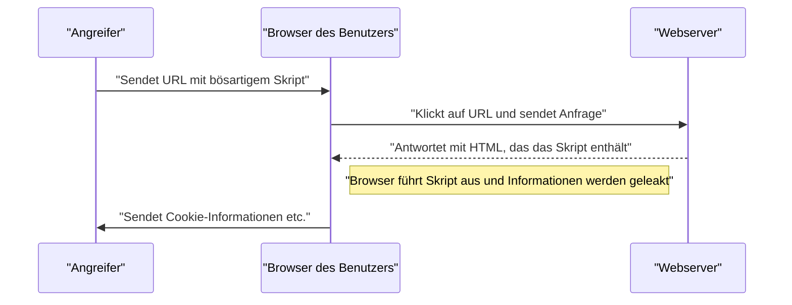
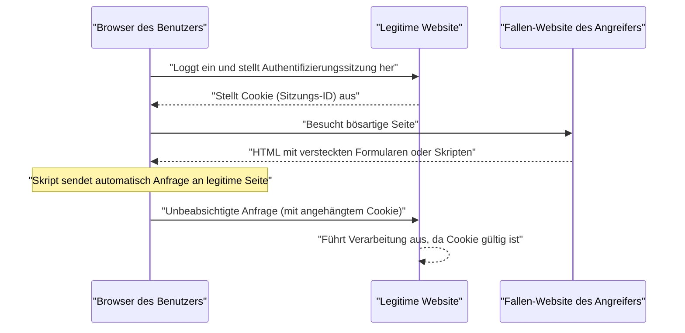

# Web-Anwendungs-Schwachstellen und Gegenmaßnahmen (OWASP Top 10 und Secure Coding)

Sicherheitsmaßnahmen sind in modernen Webanwendungen ein unverzichtbares Element. Da Angriffsmethoden täglich ausgefeilter werden, müssen Entwickler ständig Wissen über die neuesten Bedrohungen und Techniken für **Secure Coding** erwerben, um diese zu verhindern. In diesem Artikel werden wir basierend auf den „OWASP Top 10“, dem De-facto-Standard für Webanwendungssicherheit, die Mechanismen, Auswirkungen von Angriffen und konkrete Abwehrmethoden für die wichtigsten Schwachstellen sehr detailliert erläutern.

## Was sind die OWASP Top 10?

OWASP (Open Worldwide Application Security Project) ist eine internationale, gemeinnützige Organisation, die sich die Verbesserung der Softwaresicherheit zum Ziel gesetzt hat. Die von OWASP regelmäßig veröffentlichten „OWASP Top 10“ sind ein Bericht, der die 10 kritischsten Sicherheitsrisiken in Webanwendungen zusammenfasst und von vielen Unternehmen und Entwicklern als Sicherheitsstandard übernommen wird.

In diesem Artikel werden wir uns besonders auf Schwachstellen konzentrieren, die große Auswirkungen haben und häufig auftreten, wie z.B. „Injection“, „Cross-Site Scripting (XSS)“, „Cross-Site Request Forgery (CSRF)“, „Server-Side Request Forgery (SSRF)“ und „Fehlende Zugriffskontrolle“ (Broken Access Control), und diese genauer untersuchen.

---

## 1. Injection

Injection ist eine Schwachstelle, die auftritt, wenn nicht vertrauenswürdige Daten als Teil eines Befehls oder einer Abfrage an einen Interpreter gesendet werden. Die bösartigen Daten des Angreifers können vom Interpreter als unbeabsichtigter Befehl ausgeführt oder es kann ohne angemessene Berechtigung auf Daten zugegriffen werden.

### 1.1. SQL-Injection

SQL-Injection tritt in Anwendungen, die mit Datenbanken interagieren, auf, wenn externe Eingabewerte illegal in SQL-Abfragen eingebettet werden. Dadurch können Angreifer vertrauliche Informationen in der Datenbank lesen, Daten manipulieren oder sogar die Kontrolle über den Datenbankserver übernehmen.

#### Angriffsmechanismus

Betrachten wir als typisches Beispiel einen Login-Prozess mit Benutzername und Passwort.

**Verwundbares Code-Beispiel (PHP):**

```php
$username = $_POST['username'];
$password = $_POST['password'];

// Gefahr: Eingabewerte werden direkt in die SQL-Abfrage eingebunden
$query = "SELECT * FROM users WHERE username = '" . $username . "' AND password = '" . $password . "'";
$result = $mysqli->query($query);
```

Angenommen, ein Angreifer gibt die folgende Zeichenfolge in das Feld `username` ein:

`admin' OR '1'='1`

Dann sieht die ausgeführte SQL-Abfrage wie folgt aus:

```sql
SELECT * FROM users WHERE username = 'admin' OR '1'='1' AND password = ''
```

Da `'1'='1'` immer wahr (True) ist, wird die Passwortprüfung umgangen, und der Angreifer kann sich als `admin`-Benutzer anmelden.

#### Abwehrmethoden gegen SQL-Injection

Die sicherste Methode zur Verhinderung von SQL-Injection ist die Verwendung von **Prepared Statements** (parametrisierten Abfragen). Dadurch werden die Struktur der SQL-Abfrage und die Daten getrennt, was verhindert, dass Eingabewerte als SQL-Befehle interpretiert werden.

**Behobenes Code-Beispiel (PHP / PDO):**

```php
$username = $_POST['username'];
$password = $_POST['password'];

// Sicher: Prepared Statements verwenden
$stmt = $pdo->prepare("SELECT * FROM users WHERE username = :username AND password = :password");
$stmt->bindParam(':username', $username);
$stmt->bindParam(':password', $password);
$stmt->execute();
$result = $stmt->fetchAll();
```

### 1.2. [NoSQL](https://kenji.blog/de/p/nosql-database-selection-kvs-document-graph-wide-column/)-Injection

Auch in den in den letzten Jahren immer beliebter werdenden NoSQL-Datenbanken (wie [MongoDB](https://kenji.blog/de/p/nosql-database-selection-kvs-document-graph-wide-column/)) können Injection-Angriffe auftreten. Obwohl NoSQL eine andere Abfragesprache (oft JSON-basiert) als SQL verwendet, kann eine unzureichende Validierung von Eingabewerten zu unbeabsichtigten Änderungen an der Abfragestruktur führen.

**Verwundbares Code-Beispiel (JavaScript / Node.js + MongoDB):**

```javascript
const username = req.body.username;
const password = req.body.password;

// Gefahr: Eingabewerte werden direkt in das Objekt eingebettet
db.collection('users').find({
    username: username,
    password: password
});
```

Wenn ein Angreifer ein Objekt wie `{"$gt": ""}` als `password` sendet, sieht die Abfrage wie folgt aus:

```json
{
    "username": "admin",
    "password": {"$gt": ""}
}
```

Dies bedeutet „Passwort ist größer als ein leerer String (also eine beliebige Zeichenfolge)“, wodurch die Authentifizierung durchbrochen wird.

#### Abwehrmethoden gegen [NoSQL](https://kenji.blog/de/p/nosql-database-selection-kvs-document-graph-wide-column/)-Injection

Um NoSQL-Injection zu verhindern, ist es wichtig, eine strikte Typüberprüfung der Eingabewerte durchzuführen und sicherzustellen, dass keine Objekte an Stellen übergeben werden, an denen Strings erwartet werden.

### 1.3. OS Command Injection

OS Command Injection ist eine Schwachstelle, bei der externe Eingabewerte als Teil von Shell-Befehlen interpretiert werden, wenn eine Anwendung Systembefehle über eine Shell ausführt.

**Verwundbares Code-Beispiel (Python):**

```python
import os

domain = request.args.get('domain')
# Gefahr: Eingabewerte werden direkt an den OS-Befehl angehängt
os.system(f"ping -c 4 {domain}")
```

Wenn ein Angreifer `example.com; rm -rf /` als `domain` eingibt, wird nach dem `ping`-Befehl ein zerstörerischer Befehl ausgeführt.

#### Abwehrmethoden gegen OS Command Injection

Wann immer möglich, sollten OS-Befehlsaufrufe vermieden und in die Sprache integrierte APIs (Bibliotheken) verwendet werden. Wenn das Ausführen von OS-Befehlen unvermeidlich ist, sollten Argumente als Liste übergeben werden, ohne eine Shell zu verwenden.

**Behobenes Code-Beispiel (Python):**

```python
import subprocess

domain = request.args.get('domain')
# Sicher: Argumente als Liste übergeben, ohne eine Shell zu verwenden
subprocess.run(["ping", "-c", "4", domain])
```

---

## 2. Cross-Site Scripting (XSS)

Cross-Site Scripting (XSS) ist ein Angriff, bei dem ein Angreifer ein bösartiges Skript (normalerweise JavaScript) in eine Webseite injiziert und es im Browser anderer Benutzer ausführen lässt. Dies kann zum Diebstahl von Sitzungstokens, zu unautorisierten Aktionen mit den Berechtigungen des Benutzers oder zur Umleitung auf Phishing-Websites führen.

### Modell der Erfolgswahrscheinlichkeit eines Angriffs

Bei clientseitigen Angriffen wie XSS hängt die Erfolgswahrscheinlichkeit davon ab, ob der Benutzer in eine Falle tappt (z.B. auf einen bösartigen Link klickt). Wenn wir dies mathematisch modellieren, sieht es wie folgt aus:

Die Wahrscheinlichkeit, dass ein Angriff mindestens einmal erfolgreich ist, $ P(\text{success}) $, kann wie folgt ausgedrückt werden, wobei $ p $ die Wahrscheinlichkeit des Scheiterns bei einem einzelnen Versuch und $ n $ die Anzahl der Versuche (z.B. die Anzahl der gesendeten Links) ist:

$ P(\text{success}) = 1 - (1 - p)^n $

Aus dieser Formel wird ersichtlich, dass sich die Erfolgswahrscheinlichkeit bei Vorhandensein einer Schwachstelle exponentiell an 1 annähert, je mehr Angriffsversuche unternommen werden. Daher ist die grundlegende Beseitigung der Schwachstelle unerlässlich.

### Arten von XSS

XSS wird hauptsächlich in die folgenden drei Kategorien unterteilt.

#### 2.1. Reflected XSS (Reflektiertes XSS)

Wird ausgeführt, wenn ein Benutzer dazu verleitet wird, auf eine URL zu klicken, die ein bösartiges Skript enthält, und dieses Skript vom Server in der Antwort (z.B. Fehlermeldungen oder Suchergebnisse) direkt reflektiert und ausgegeben wird.



#### 2.2. Stored XSS (Gespeichertes XSS)

Ein bösartiges Skript wird in einer Datenbank oder auf einem Message Board gespeichert (Store) und ausgeführt, wenn ein anderer Benutzer diese Daten anzeigt. Dies ist ein gefährliches XSS, da der Schadensumfang leicht sehr groß werden kann.

#### 2.3. DOM-based XSS

Eine Schwachstelle, bei der clientseitiges JavaScript (im Browser) während des Manipulierens des DOM (Document Object Model) ein unzulässiges Skript ausführt, ohne den Server zu passieren.

### Abwehrmethoden gegen XSS

Das Grundprinzip zur Verhinderung von XSS ist das **Escaping (Sanitizing)**. Wenn Eingabewerte von Benutzern auf einer Webseite ausgegeben werden, werden Zeichen mit einer besonderen Bedeutung in HTML (wie `<`, `>`, `&`, `"`, `'` etc.) in harmlose Zeichenfolgen konvertiert.

**Verwundbares Code-Beispiel (JavaScript / DOM-Manipulation):**

```html
<div id="greeting"></div>
<script>
    // Namen aus den URL-Parametern abrufen
    const params = new URLSearchParams(window.location.search);
    const name = params.get('name');
    
    // Gefahr: Eingabewert wird ohne Escaping an innerHTML zugewiesen
    document.getElementById('greeting').innerHTML = "Hallo, " + name + "!";
</script>
```

**Behobenes Code-Beispiel (JavaScript):**

```html
<div id="greeting"></div>
<script>
    const params = new URLSearchParams(window.location.search);
    const name = params.get('name');
    
    // Sicher: textContent verwenden, um es als Text zu behandeln
    document.getElementById('greeting').textContent = "Hallo, " + name + "!";
</script>
```

Beim Ausgeben im Backend (wie PHP) wird ebenfalls eine geeignete Escaping-Funktion (wie `htmlspecialchars`) verwendet. Durch die Einführung einer Content Security Policy (CSP) ist auch eine mehrschichtige Verteidigung möglich, die die Ausführung verhindert, selbst wenn ein Skript injiziert wird.

---

## 3. Cross-Site Request Forgery (CSRF)

CSRF ist ein Angriff, bei dem ein Angreifer einen Benutzer dazu zwingt, unbeabsichtigte Anfragen an eine authentifizierte Webanwendung zu senden. Dies kann zu unbeabsichtigten Passwortänderungen, Produktkäufen oder Abmeldungen durch den Benutzer führen.

### CSRF-Angriffsablauf



### Abwehrmethoden gegen CSRF

Um CSRF zu verhindern, wird ein Mechanismus benötigt, um zu überprüfen, ob die Anfrage wirklich vom Benutzer beabsichtigt war.

#### 3.1. CSRF-Token

Die häufigste Gegenmaßnahme besteht darin, dass der Server ein zufälliges Token generiert und dieses beim Absenden eines Formulars mitsendet. Der Server validiert das gesendete Token und lehnt die Anfrage ab, wenn es nicht übereinstimmt.

**Behobenes Code-Beispiel (HTML-Formular):**

```html
<form action="/update_profile" method="POST">
    <!-- Serverseitig generiertes CSRF-Token einbetten -->
    <input type="hidden" name="csrf_token" value="abc123xyz456...">
    <input type="text" name="email">
    <button type="submit">Aktualisieren</button>
</form>
```

#### 3.2. SameSite-Cookie

Eine modernere Gegenmaßnahme ist die Nutzung des `SameSite`-Attributs von Cookies. Durch das Festlegen von `SameSite=Lax` oder `SameSite=Strict` werden Cookies für Anfragen von anderen Domains nicht mehr gesendet, was CSRF-Angriffe grundlegend verhindert.

**Beispiel für behobenen HTTP-Header:**

```http
Set-Cookie: session_id=12345; Secure; HttpOnly; SameSite=Lax
```

---

## 4. Server-Side Request Forgery (SSRF)

SSRF ist ein Angriff, bei dem eine Webanwendung, die über eine Funktion zum Abrufen von Daten von einer externen URL verfügt, gezwungen wird, eine Anfrage vom Server an eine vom Angreifer angegebene beliebige URL zu senden. Dies ermöglicht den Zugriff auf Systeme im internen Netzwerk (wie Cloud-Metadaten-APIs, interne Datenbanken usw.), die normalerweise von außen nicht zugänglich sind.

### Bedrohungen und Auswirkungen von SSRF

In Cloud-Umgebungen (wie AWS, GCP, Azure) ist es durch den Zugriff auf bestimmte IP-Adressen (z.B. `169.254.169.254`) aus dem Inneren der Instanz möglich, Metadaten wie Anmeldeinformationen abzurufen. Wenn diese API mittels SSRF aufgerufen wird, kann dies zu fatalen Informationslecks führen.

### Abwehrmethoden gegen SSRF

- **Beschränkung von URLs durch Whitelisting**: Verwalten Sie die Domains oder IP-Adressen, auf die die Anwendung zugreifen darf, über eine strikte Whitelist.
- **Verbot des Zugriffs auf interne IPs**: Blockieren Sie Anfragen an private IP-Adressen wie `127.0.0.1` oder `10.0.0.0/8`, Loopback-Adressen und Link-Local-Adressen wie `169.254.169.254`.
- **Überprüfung der DNS-Auflösung**: Überprüfen Sie, ob die durch Auflösung der URL-Domain erhaltene IP-Adresse im zulässigen Bereich liegt, bevor Sie die Anfrage senden.

---

## 5. Fehlende Zugriffskontrolle (Broken Access Control)

Fehlende Zugriffskontrolle (Autorisierung) ist eine Schwachstelle, die es Benutzern ermöglicht, Operationen über ihre eigenen Berechtigungen hinaus auszuführen. Sie wird in den OWASP Top 10 von 2021 als das kritischste Risiko (Platz 1) eingestuft.

### Konkrete Szenarien

- **IDOR (Insecure Direct Object References)**: Durch Umschreiben von URL-Parametern (z.B. `user_id=123`) ist es möglich, auf die persönlichen Daten anderer Benutzer zuzugreifen.
- **Privilegienerweiterung**: Ein normaler Benutzer kann durch direkten Zugriff auf die URL des Admin-Panels (z.B. `/admin/dashboard`) Aktionen mit Administratorrechten ausführen.

### Abwehrmethoden gegen fehlende Zugriffskontrolle

- **Deny by Default**: Alle Zugriffe standardmäßig verweigern und den Zugriff nur explizit autorisierten Benutzern oder Rollen gestatten (Einführung von RBAC/ABAC).
- **Strikte Berechtigungsprüfungen auf Serverseite**: Berechtigungen müssen nicht nur auf der Client-Seite (z.B. durch Ausblenden von UI-Elementen im Browser) geprüft werden, sondern immer auch unmittelbar vor der Ausführung der Backend-Verarbeitung.
- **Verwendung schwer erratbarer Bezeichner**: Für die Referenzierung von Objekten sollten statt fortlaufender IDs zufällige Bezeichner wie schwer erratbare UUIDs verwendet werden.

---

## 6. Auf dem Weg zur sicheren Webanwendungsentwicklung

Schwachstellen in Webanwendungen entstehen meist durch mangelndes **Sicherheitsbewusstsein** oder fehlendes Wissen in der Entwicklungsphase. Es ist wichtig, die folgenden Praktiken in den Entwicklungsprozess zu integrieren.

1. **Security by Design**: Sicherheitsanforderungen bereits in der Planungs- und Entwurfsphase definieren und in die Architektur integrieren.
2. **Nutzung von Werkzeugen zur statischen und dynamischen Analyse**: Integrieren Sie SAST (Static Application Security Testing) und DAST (Dynamic Application Security Testing) in die CI/CD-Pipeline, um Schwachstellen frühzeitig zu erkennen.
3. **Abhängigkeitsmanagement**: Überwachen Sie kontinuierlich Schwachstelleninformationen (CVE) von Drittanbieter-Bibliotheken und Frameworks und wenden Sie Updates schnell an.
4. **Kontinuierliches Lernen**: Lernen Sie kontinuierlich aktuelle Bedrohungstrends und Abwehrmethoden von Communities wie OWASP.

### Berechnungsmodell für den Schadensumfang

Das Risiko (Schadensumfang), wenn eine Schwachstelle ungepatcht bleibt, kann mit der folgenden Formel quantifiziert werden:

$ Risk = Threat \times Vulnerability \times Impact $

- **Threat (Bedrohung)**: Die Wahrscheinlichkeit, dass Angreifer existieren, oder die Häufigkeit von Angriffen.
- **Vulnerability (Schwachstelle)**: Der Schweregrad der Systemschwachstelle oder wie leicht sie ausgenutzt werden kann.
- **Impact (Auswirkung)**: Geschäftlicher Schaden (finanzielle Verluste oder Reputationsverlust) durch Informationslecks oder Systemausfälle.

Diese Formel zeigt, dass das Gesamtrisiko erheblich reduziert werden kann, wenn auch nur einer dieser Faktoren gegen Null geht. Die größte Verantwortung von Entwicklern liegt darin, die "Vulnerability (Schwachstelle)" zu minimieren.

---

## Fazit

In diesem Artikel haben wir die wesentlichen Webanwendungs-Schwachstellen (Injection, XSS, CSRF, SSRF, Fehlende Zugriffskontrolle) basierend auf den OWASP Top 10 sowie deren Mechanismen und konkrete Techniken für **Secure Coding** erläutert.

Sicherheit ist nicht etwas, das man einmal implementiert und dann vergisst. Im täglichen Entwicklungsprozess ist es erforderlich, kontinuierlich sicherheitsbewussten Code zu schreiben und regelmäßige Reviews und Tests durchzuführen, um sichere und robuste Webanwendungen zu erstellen.

## 7. Detaillierte Verteidigungsarchitektur und Betrieb (Part 1)

In unternehmensweiten Webanwendungen ist neben den zuvor genannten Gegenmaßnahmen auf Code-Ebene eine mehrschichtige Verteidigung auf Infrastrukturebene unerlässlich.

### 7.1 Einführung einer WAF (Web Application Firewall)

Eine Web Application Firewall (WAF) überwacht und filtert den Datenverkehr zur Webanwendung und blockiert Angriffe wie SQL-Injection oder Cross-Site Scripting (XSS), bevor sie die Anwendung erreichen. WAFs kombinieren signaturbasierte Erkennung mit Verhaltenserkennung (Anomalieerkennung), um auch gegen Zero-Day-Angriffe effektiver zu sein.

### 7.2 Aufbau einer sicheren CI/CD-Pipeline

Basierend auf dem DevSecOps-Konzept ist es wichtig, Sicherheitstests automatisiert in die Pipeline der kontinuierlichen Integration/kontinuierlichen Bereitstellung (CI/CD) zu integrieren.

* **SAST (Static Application Security Testing):** Analysiert den Quellcode statisch, um Codierungsmuster zu erkennen, die Schwachstellen enthalten.
* **DAST (Dynamic Application Security Testing):** Sendet simulierte Angriffsanfragen an die laufende Anwendung, um Schwachstellen zur Laufzeit zu erkennen.
* **SCA (Software Composition Analysis):** Erkennt bekannte Schwachstellen (CVE) in den verwendeten Open-Source-Bibliotheken oder Komponenten und fordert zu Updates auf.

### 7.3 Durchführung regelmäßiger Penetrationstests

Neben automatisierten Werkzeug-Scans ermöglicht die regelmäßige Durchführung von manuellen Penetrationstests (Eindringungstests) durch Sicherheitsexperten, Fehler in der Geschäftslogik und Schwachstellen in komplexen Zugriffskontrollen aufzudecken, die mit Tools schwer zu finden sind.

## 8. Detaillierte Verteidigungsarchitektur und Betrieb (Part 2)

In unternehmensweiten Webanwendungen ist neben den zuvor genannten Gegenmaßnahmen auf Code-Ebene eine mehrschichtige Verteidigung auf Infrastrukturebene unerlässlich.

### 8.1 Einführung einer WAF (Web Application Firewall)

Eine Web Application Firewall (WAF) überwacht und filtert den Datenverkehr zur Webanwendung und blockiert Angriffe wie SQL-Injection oder Cross-Site Scripting (XSS), bevor sie die Anwendung erreichen. WAFs kombinieren signaturbasierte Erkennung mit Verhaltenserkennung (Anomalieerkennung), um auch gegen Zero-Day-Angriffe effektiver zu sein.

### 8.2 Aufbau einer sicheren CI/CD-Pipeline

Basierend auf dem DevSecOps-Konzept ist es wichtig, Sicherheitstests automatisiert in die Pipeline der kontinuierlichen Integration/kontinuierlichen Bereitstellung (CI/CD) zu integrieren.

* **SAST (Static Application Security Testing):** Analysiert den Quellcode statisch, um Codierungsmuster zu erkennen, die Schwachstellen enthalten.
* **DAST (Dynamic Application Security Testing):** Sendet simulierte Angriffsanfragen an die laufende Anwendung, um Schwachstellen zur Laufzeit zu erkennen.
* **SCA (Software Composition Analysis):** Erkennt bekannte Schwachstellen (CVE) in den verwendeten Open-Source-Bibliotheken oder Komponenten und fordert zu Updates auf.

### 8.3 Durchführung regelmäßiger Penetrationstests

Neben automatisierten Werkzeug-Scans ermöglicht die regelmäßige Durchführung von manuellen Penetrationstests (Eindringungstests) durch Sicherheitsexperten, Fehler in der Geschäftslogik und Schwachstellen in komplexen Zugriffskontrollen aufzudecken, die mit Tools schwer zu finden sind.

## 9. Detaillierte Verteidigungsarchitektur und Betrieb (Part 3)

In unternehmensweiten Webanwendungen ist neben den zuvor genannten Gegenmaßnahmen auf Code-Ebene eine mehrschichtige Verteidigung auf Infrastrukturebene unerlässlich.

### 9.1 Einführung einer WAF (Web Application Firewall)

Eine Web Application Firewall (WAF) überwacht und filtert den Datenverkehr zur Webanwendung und blockiert Angriffe wie SQL-Injection oder Cross-Site Scripting (XSS), bevor sie die Anwendung erreichen. WAFs kombinieren signaturbasierte Erkennung mit Verhaltenserkennung (Anomalieerkennung), um auch gegen Zero-Day-Angriffe effektiver zu sein.

### 9.2 Aufbau einer sicheren CI/CD-Pipeline

Basierend auf dem DevSecOps-Konzept ist es wichtig, Sicherheitstests automatisiert in die Pipeline der kontinuierlichen Integration/kontinuierlichen Bereitstellung (CI/CD) zu integrieren.

* **SAST (Static Application Security Testing):** Analysiert den Quellcode statisch, um Codierungsmuster zu erkennen, die Schwachstellen enthalten.
* **DAST (Dynamic Application Security Testing):** Sendet simulierte Angriffsanfragen an die laufende Anwendung, um Schwachstellen zur Laufzeit zu erkennen.
* **SCA (Software Composition Analysis):** Erkennt bekannte Schwachstellen (CVE) in den verwendeten Open-Source-Bibliotheken oder Komponenten und fordert zu Updates auf.

### 9.3 Durchführung regelmäßiger Penetrationstests

Neben automatisierten Werkzeug-Scans ermöglicht die regelmäßige Durchführung von manuellen Penetrationstests (Eindringungstests) durch Sicherheitsexperten, Fehler in der Geschäftslogik und Schwachstellen in komplexen Zugriffskontrollen aufzudecken, die mit Tools schwer zu finden sind.

## 10. Detaillierte Verteidigungsarchitektur und Betrieb (Part 4)

In unternehmensweiten Webanwendungen ist neben den zuvor genannten Gegenmaßnahmen auf Code-Ebene eine mehrschichtige Verteidigung auf Infrastrukturebene unerlässlich.

### 10.1 Einführung einer WAF (Web Application Firewall)

Eine Web Application Firewall (WAF) überwacht und filtert den Datenverkehr zur Webanwendung und blockiert Angriffe wie SQL-Injection oder Cross-Site Scripting (XSS), bevor sie die Anwendung erreichen. WAFs kombinieren signaturbasierte Erkennung mit Verhaltenserkennung (Anomalieerkennung), um auch gegen Zero-Day-Angriffe effektiver zu sein.

### 10.2 Aufbau einer sicheren CI/CD-Pipeline

Basierend auf dem DevSecOps-Konzept ist es wichtig, Sicherheitstests automatisiert in die Pipeline der kontinuierlichen Integration/kontinuierlichen Bereitstellung (CI/CD) zu integrieren.

* **SAST (Static Application Security Testing):** Analysiert den Quellcode statisch, um Codierungsmuster zu erkennen, die Schwachstellen enthalten.
* **DAST (Dynamic Application Security Testing):** Sendet simulierte Angriffsanfragen an die laufende Anwendung, um Schwachstellen zur Laufzeit zu erkennen.
* **SCA (Software Composition Analysis):** Erkennt bekannte Schwachstellen (CVE) in den verwendeten Open-Source-Bibliotheken oder Komponenten und fordert zu Updates auf.

### 10.3 Durchführung regelmäßiger Penetrationstests

Neben automatisierten Werkzeug-Scans ermöglicht die regelmäßige Durchführung von manuellen Penetrationstests (Eindringungstests) durch Sicherheitsexperten, Fehler in der Geschäftslogik und Schwachstellen in komplexen Zugriffskontrollen aufzudecken, die mit Tools schwer zu finden sind.

## 11. Detaillierte Verteidigungsarchitektur und Betrieb (Part 5)

In unternehmensweiten Webanwendungen ist neben den zuvor genannten Gegenmaßnahmen auf Code-Ebene eine mehrschichtige Verteidigung auf Infrastrukturebene unerlässlich.

### 11.1 Einführung einer WAF (Web Application Firewall)

Eine Web Application Firewall (WAF) überwacht und filtert den Datenverkehr zur Webanwendung und blockiert Angriffe wie SQL-Injection oder Cross-Site Scripting (XSS), bevor sie die Anwendung erreichen. WAFs kombinieren signaturbasierte Erkennung mit Verhaltenserkennung (Anomalieerkennung), um auch gegen Zero-Day-Angriffe effektiver zu sein.

### 11.2 Aufbau einer sicheren CI/CD-Pipeline

Basierend auf dem DevSecOps-Konzept ist es wichtig, Sicherheitstests automatisiert in die Pipeline der kontinuierlichen Integration/kontinuierlichen Bereitstellung (CI/CD) zu integrieren.

* **SAST (Static Application Security Testing):** Analysiert den Quellcode statisch, um Codierungsmuster zu erkennen, die Schwachstellen enthalten.
* **DAST (Dynamic Application Security Testing):** Sendet simulierte Angriffsanfragen an die laufende Anwendung, um Schwachstellen zur Laufzeit zu erkennen.
* **SCA (Software Composition Analysis):** Erkennt bekannte Schwachstellen (CVE) in den verwendeten Open-Source-Bibliotheken oder Komponenten und fordert zu Updates auf.

### 11.3 Durchführung regelmäßiger Penetrationstests

Neben automatisierten Werkzeug-Scans ermöglicht die regelmäßige Durchführung von manuellen Penetrationstests (Eindringungstests) durch Sicherheitsexperten, Fehler in der Geschäftslogik und Schwachstellen in komplexen Zugriffskontrollen aufzudecken, die mit Tools schwer zu finden sind.

## 12. Detaillierte Verteidigungsarchitektur und Betrieb (Part 6)

In unternehmensweiten Webanwendungen ist neben den zuvor genannten Gegenmaßnahmen auf Code-Ebene eine mehrschichtige Verteidigung auf Infrastrukturebene unerlässlich.

### 12.1 Einführung einer WAF (Web Application Firewall)

Eine Web Application Firewall (WAF) überwacht und filtert den Datenverkehr zur Webanwendung und blockiert Angriffe wie SQL-Injection oder Cross-Site Scripting (XSS), bevor sie die Anwendung erreichen. WAFs kombinieren signaturbasierte Erkennung mit Verhaltenserkennung (Anomalieerkennung), um auch gegen Zero-Day-Angriffe effektiver zu sein.

### 12.2 Aufbau einer sicheren CI/CD-Pipeline

Basierend auf dem DevSecOps-Konzept ist es wichtig, Sicherheitstests automatisiert in die Pipeline der kontinuierlichen Integration/kontinuierlichen Bereitstellung (CI/CD) zu integrieren.

* **SAST (Static Application Security Testing):** Analysiert den Quellcode statisch, um Codierungsmuster zu erkennen, die Schwachstellen enthalten.
* **DAST (Dynamic Application Security Testing):** Sendet simulierte Angriffsanfragen an die laufende Anwendung, um Schwachstellen zur Laufzeit zu erkennen.
* **SCA (Software Composition Analysis):** Erkennt bekannte Schwachstellen (CVE) in den verwendeten Open-Source-Bibliotheken oder Komponenten und fordert zu Updates auf.

### 12.3 Durchführung regelmäßiger Penetrationstests

Neben automatisierten Werkzeug-Scans ermöglicht die regelmäßige Durchführung von manuellen Penetrationstests (Eindringungstests) durch Sicherheitsexperten, Fehler in der Geschäftslogik und Schwachstellen in komplexen Zugriffskontrollen aufzudecken, die mit Tools schwer zu finden sind.

## 13. Detaillierte Verteidigungsarchitektur und Betrieb (Part 7)

In unternehmensweiten Webanwendungen ist neben den zuvor genannten Gegenmaßnahmen auf Code-Ebene eine mehrschichtige Verteidigung auf Infrastrukturebene unerlässlich.

### 13.1 Einführung einer WAF (Web Application Firewall)

Eine Web Application Firewall (WAF) überwacht und filtert den Datenverkehr zur Webanwendung und blockiert Angriffe wie SQL-Injection oder Cross-Site Scripting (XSS), bevor sie die Anwendung erreichen. WAFs kombinieren signaturbasierte Erkennung mit Verhaltenserkennung (Anomalieerkennung), um auch gegen Zero-Day-Angriffe effektiver zu sein.

### 13.2 Aufbau einer sicheren CI/CD-Pipeline

Basierend auf dem DevSecOps-Konzept ist es wichtig, Sicherheitstests automatisiert in die Pipeline der kontinuierlichen Integration/kontinuierlichen Bereitstellung (CI/CD) zu integrieren.

* **SAST (Static Application Security Testing):** Analysiert den Quellcode statisch, um Codierungsmuster zu erkennen, die Schwachstellen enthalten.
* **DAST (Dynamic Application Security Testing):** Sendet simulierte Angriffsanfragen an die laufende Anwendung, um Schwachstellen zur Laufzeit zu erkennen.
* **SCA (Software Composition Analysis):** Erkennt bekannte Schwachstellen (CVE) in den verwendeten Open-Source-Bibliotheken oder Komponenten und fordert zu Updates auf.

### 13.3 Durchführung regelmäßiger Penetrationstests

Neben automatisierten Werkzeug-Scans ermöglicht die regelmäßige Durchführung von manuellen Penetrationstests (Eindringungstests) durch Sicherheitsexperten, Fehler in der Geschäftslogik und Schwachstellen in komplexen Zugriffskontrollen aufzudecken, die mit Tools schwer zu finden sind.

## 14. Detaillierte Verteidigungsarchitektur und Betrieb (Part 8)

In unternehmensweiten Webanwendungen ist neben den zuvor genannten Gegenmaßnahmen auf Code-Ebene eine mehrschichtige Verteidigung auf Infrastrukturebene unerlässlich.

### 14.1 Einführung einer WAF (Web Application Firewall)

Eine Web Application Firewall (WAF) überwacht und filtert den Datenverkehr zur Webanwendung und blockiert Angriffe wie SQL-Injection oder Cross-Site Scripting (XSS), bevor sie die Anwendung erreichen. WAFs kombinieren signaturbasierte Erkennung mit Verhaltenserkennung (Anomalieerkennung), um auch gegen Zero-Day-Angriffe effektiver zu sein.

### 14.2 Aufbau einer sicheren CI/CD-Pipeline

Basierend auf dem DevSecOps-Konzept ist es wichtig, Sicherheitstests automatisiert in die Pipeline der kontinuierlichen Integration/kontinuierlichen Bereitstellung (CI/CD) zu integrieren.

* **SAST (Static Application Security Testing):** Analysiert den Quellcode statisch, um Codierungsmuster zu erkennen, die Schwachstellen enthalten.
* **DAST (Dynamic Application Security Testing):** Sendet simulierte Angriffsanfragen an die laufende Anwendung, um Schwachstellen zur Laufzeit zu erkennen.
* **SCA (Software Composition Analysis):** Erkennt bekannte Schwachstellen (CVE) in den verwendeten Open-Source-Bibliotheken oder Komponenten und fordert zu Updates auf.

### 14.3 Durchführung regelmäßiger Penetrationstests

Neben automatisierten Werkzeug-Scans ermöglicht die regelmäßige Durchführung von manuellen Penetrationstests (Eindringungstests) durch Sicherheitsexperten, Fehler in der Geschäftslogik und Schwachstellen in komplexen Zugriffskontrollen aufzudecken, die mit Tools schwer zu finden sind.

## 15. Detaillierte Verteidigungsarchitektur und Betrieb (Part 9)

In unternehmensweiten Webanwendungen ist neben den zuvor genannten Gegenmaßnahmen auf Code-Ebene eine mehrschichtige Verteidigung auf Infrastrukturebene unerlässlich.

### 15.1 Einführung einer WAF (Web Application Firewall)

Eine Web Application Firewall (WAF) überwacht und filtert den Datenverkehr zur Webanwendung und blockiert Angriffe wie SQL-Injection oder Cross-Site Scripting (XSS), bevor sie die Anwendung erreichen. WAFs kombinieren signaturbasierte Erkennung mit Verhaltenserkennung (Anomalieerkennung), um auch gegen Zero-Day-Angriffe effektiver zu sein.

### 15.2 Aufbau einer sicheren CI/CD-Pipeline

Basierend auf dem DevSecOps-Konzept ist es wichtig, Sicherheitstests automatisiert in die Pipeline der kontinuierlichen Integration/kontinuierlichen Bereitstellung (CI/CD) zu integrieren.

* **SAST (Static Application Security Testing):** Analysiert den Quellcode statisch, um Codierungsmuster zu erkennen, die Schwachstellen enthalten.
* **DAST (Dynamic Application Security Testing):** Sendet simulierte Angriffsanfragen an die laufende Anwendung, um Schwachstellen zur Laufzeit zu erkennen.
* **SCA (Software Composition Analysis):** Erkennt bekannte Schwachstellen (CVE) in den verwendeten Open-Source-Bibliotheken oder Komponenten und fordert zu Updates auf.

### 15.3 Durchführung regelmäßiger Penetrationstests

Neben automatisierten Werkzeug-Scans ermöglicht die regelmäßige Durchführung von manuellen Penetrationstests (Eindringungstests) durch Sicherheitsexperten, Fehler in der Geschäftslogik und Schwachstellen in komplexen Zugriffskontrollen aufzudecken, die mit Tools schwer zu finden sind.

## 16. Detaillierte Verteidigungsarchitektur und Betrieb (Part 10)

In unternehmensweiten Webanwendungen ist neben den zuvor genannten Gegenmaßnahmen auf Code-Ebene eine mehrschichtige Verteidigung auf Infrastrukturebene unerlässlich.

### 16.1 Einführung einer WAF (Web Application Firewall)

Eine Web Application Firewall (WAF) überwacht und filtert den Datenverkehr zur Webanwendung und blockiert Angriffe wie SQL-Injection oder Cross-Site Scripting (XSS), bevor sie die Anwendung erreichen. WAFs kombinieren signaturbasierte Erkennung mit Verhaltenserkennung (Anomalieerkennung), um auch gegen Zero-Day-Angriffe effektiver zu sein.

### 16.2 Aufbau einer sicheren CI/CD-Pipeline

Basierend auf dem DevSecOps-Konzept ist es wichtig, Sicherheitstests automatisiert in die Pipeline der kontinuierlichen Integration/kontinuierlichen Bereitstellung (CI/CD) zu integrieren.

* **SAST (Static Application Security Testing):** Analysiert den Quellcode statisch, um Codierungsmuster zu erkennen, die Schwachstellen enthalten.
* **DAST (Dynamic Application Security Testing):** Sendet simulierte Angriffsanfragen an die laufende Anwendung, um Schwachstellen zur Laufzeit zu erkennen.
* **SCA (Software Composition Analysis):** Erkennt bekannte Schwachstellen (CVE) in den verwendeten Open-Source-Bibliotheken oder Komponenten und fordert zu Updates auf.

### 16.3 Durchführung regelmäßiger Penetrationstests

Neben automatisierten Werkzeug-Scans ermöglicht die regelmäßige Durchführung von manuellen Penetrationstests (Eindringungstests) durch Sicherheitsexperten, Fehler in der Geschäftslogik und Schwachstellen in komplexen Zugriffskontrollen aufzudecken, die mit Tools schwer zu finden sind.

## 17. Detaillierte Verteidigungsarchitektur und Betrieb (Part 11)

In unternehmensweiten Webanwendungen ist neben den zuvor genannten Gegenmaßnahmen auf Code-Ebene eine mehrschichtige Verteidigung auf Infrastrukturebene unerlässlich.

### 17.1 Einführung einer WAF (Web Application Firewall)

Eine Web Application Firewall (WAF) überwacht und filtert den Datenverkehr zur Webanwendung und blockiert Angriffe wie SQL-Injection oder Cross-Site Scripting (XSS), bevor sie die Anwendung erreichen. WAFs kombinieren signaturbasierte Erkennung mit Verhaltenserkennung (Anomalieerkennung), um auch gegen Zero-Day-Angriffe effektiver zu sein.

### 17.2 Aufbau einer sicheren CI/CD-Pipeline

Basierend auf dem DevSecOps-Konzept ist es wichtig, Sicherheitstests automatisiert in die Pipeline der kontinuierlichen Integration/kontinuierlichen Bereitstellung (CI/CD) zu integrieren.

* **SAST (Static Application Security Testing):** Analysiert den Quellcode statisch, um Codierungsmuster zu erkennen, die Schwachstellen enthalten.
* **DAST (Dynamic Application Security Testing):** Sendet simulierte Angriffsanfragen an die laufende Anwendung, um Schwachstellen zur Laufzeit zu erkennen.
* **SCA (Software Composition Analysis):** Erkennt bekannte Schwachstellen (CVE) in den verwendeten Open-Source-Bibliotheken oder Komponenten und fordert zu Updates auf.

### 17.3 Durchführung regelmäßiger Penetrationstests

Neben automatisierten Werkzeug-Scans ermöglicht die regelmäßige Durchführung von manuellen Penetrationstests (Eindringungstests) durch Sicherheitsexperten, Fehler in der Geschäftslogik und Schwachstellen in komplexen Zugriffskontrollen aufzudecken, die mit Tools schwer zu finden sind.

## 18. Detaillierte Verteidigungsarchitektur und Betrieb (Part 12)

In unternehmensweiten Webanwendungen ist neben den zuvor genannten Gegenmaßnahmen auf Code-Ebene eine mehrschichtige Verteidigung auf Infrastrukturebene unerlässlich.

### 18.1 Einführung einer WAF (Web Application Firewall)

Eine Web Application Firewall (WAF) überwacht und filtert den Datenverkehr zur Webanwendung und blockiert Angriffe wie SQL-Injection oder Cross-Site Scripting (XSS), bevor sie die Anwendung erreichen. WAFs kombinieren signaturbasierte Erkennung mit Verhaltenserkennung (Anomalieerkennung), um auch gegen Zero-Day-Angriffe effektiver zu sein.

### 18.2 Aufbau einer sicheren CI/CD-Pipeline

Basierend auf dem DevSecOps-Konzept ist es wichtig, Sicherheitstests automatisiert in die Pipeline der kontinuierlichen Integration/kontinuierlichen Bereitstellung (CI/CD) zu integrieren.

* **SAST (Static Application Security Testing):** Analysiert den Quellcode statisch, um Codierungsmuster zu erkennen, die Schwachstellen enthalten.
* **DAST (Dynamic Application Security Testing):** Sendet simulierte Angriffsanfragen an die laufende Anwendung, um Schwachstellen zur Laufzeit zu erkennen.
* **SCA (Software Composition Analysis):** Erkennt bekannte Schwachstellen (CVE) in den verwendeten Open-Source-Bibliotheken oder Komponenten und fordert zu Updates auf.

### 18.3 Durchführung regelmäßiger Penetrationstests

Neben automatisierten Werkzeug-Scans ermöglicht die regelmäßige Durchführung von manuellen Penetrationstests (Eindringungstests) durch Sicherheitsexperten, Fehler in der Geschäftslogik und Schwachstellen in komplexen Zugriffskontrollen aufzudecken, die mit Tools schwer zu finden sind.

## 19. Detaillierte Verteidigungsarchitektur und Betrieb (Part 13)

In unternehmensweiten Webanwendungen ist neben den zuvor genannten Gegenmaßnahmen auf Code-Ebene eine mehrschichtige Verteidigung auf Infrastrukturebene unerlässlich.

### 19.1 Einführung einer WAF (Web Application Firewall)

Eine Web Application Firewall (WAF) überwacht und filtert den Datenverkehr zur Webanwendung und blockiert Angriffe wie SQL-Injection oder Cross-Site Scripting (XSS), bevor sie die Anwendung erreichen. WAFs kombinieren signaturbasierte Erkennung mit Verhaltenserkennung (Anomalieerkennung), um auch gegen Zero-Day-Angriffe effektiver zu sein.

### 19.2 Aufbau einer sicheren CI/CD-Pipeline

Basierend auf dem DevSecOps-Konzept ist es wichtig, Sicherheitstests automatisiert in die Pipeline der kontinuierlichen Integration/kontinuierlichen Bereitstellung (CI/CD) zu integrieren.

* **SAST (Static Application Security Testing):** Analysiert den Quellcode statisch, um Codierungsmuster zu erkennen, die Schwachstellen enthalten.
* **DAST (Dynamic Application Security Testing):** Sendet simulierte Angriffsanfragen an die laufende Anwendung, um Schwachstellen zur Laufzeit zu erkennen.
* **SCA (Software Composition Analysis):** Erkennt bekannte Schwachstellen (CVE) in den verwendeten Open-Source-Bibliotheken oder Komponenten und fordert zu Updates auf.

### 19.3 Durchführung regelmäßiger Penetrationstests

Neben automatisierten Werkzeug-Scans ermöglicht die regelmäßige Durchführung von manuellen Penetrationstests (Eindringungstests) durch Sicherheitsexperten, Fehler in der Geschäftslogik und Schwachstellen in komplexen Zugriffskontrollen aufzudecken, die mit Tools schwer zu finden sind.

## 20. Detaillierte Verteidigungsarchitektur und Betrieb (Part 14)

In unternehmensweiten Webanwendungen ist neben den zuvor genannten Gegenmaßnahmen auf Code-Ebene eine mehrschichtige Verteidigung auf Infrastrukturebene unerlässlich.

### 20.1 Einführung einer WAF (Web Application Firewall)

Eine Web Application Firewall (WAF) überwacht und filtert den Datenverkehr zur Webanwendung und blockiert Angriffe wie SQL-Injection oder Cross-Site Scripting (XSS), bevor sie die Anwendung erreichen. WAFs kombinieren signaturbasierte Erkennung mit Verhaltenserkennung (Anomalieerkennung), um auch gegen Zero-Day-Angriffe effektiver zu sein.

### 20.2 Aufbau einer sicheren CI/CD-Pipeline

Basierend auf dem DevSecOps-Konzept ist es wichtig, Sicherheitstests automatisiert in die Pipeline der kontinuierlichen Integration/kontinuierlichen Bereitstellung (CI/CD) zu integrieren.

* **SAST (Static Application Security Testing):** Analysiert den Quellcode statisch, um Codierungsmuster zu erkennen, die Schwachstellen enthalten.
* **DAST (Dynamic Application Security Testing):** Sendet simulierte Angriffsanfragen an die laufende Anwendung, um Schwachstellen zur Laufzeit zu erkennen.
* **SCA (Software Composition Analysis):** Erkennt bekannte Schwachstellen (CVE) in den verwendeten Open-Source-Bibliotheken oder Komponenten und fordert zu Updates auf.

### 20.3 Durchführung regelmäßiger Penetrationstests

Neben automatisierten Werkzeug-Scans ermöglicht die regelmäßige Durchführung von manuellen Penetrationstests (Eindringungstests) durch Sicherheitsexperten, Fehler in der Geschäftslogik und Schwachstellen in komplexen Zugriffskontrollen aufzudecken, die mit Tools schwer zu finden sind.
