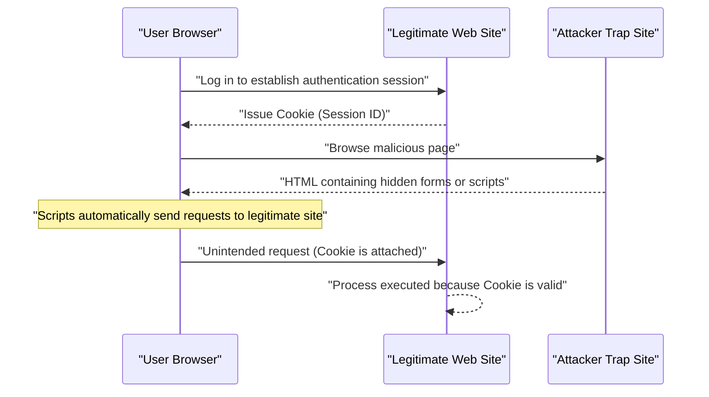

# Web Application Vulnerabilities and Countermeasures (OWASP Top 10 and Secure Coding)

In modern web applications, security measures are an indispensable element. Attack methods are becoming more sophisticated day by day, and developers must always acquire knowledge of the latest threats and the techniques of **secure coding** to prevent them. This article will provide a very detailed explanation of the mechanisms of major vulnerabilities, the impact of attacks, and specific defense methods based on the "OWASP Top 10," which is the de facto standard for web application security.

## What is OWASP Top 10?

OWASP (Open Worldwide Application Security Project) is an international non-profit organization aimed at improving software security. The "OWASP Top 10" published regularly by OWASP is a report summarizing the top 10 most critical security risks in web applications, and many companies and developers adopt it as a security standard.

In this article, we will focus on and delve into vulnerabilities that have a particularly large impact and occur frequently, such as "Injection," "Cross-Site Scripting (XSS)," "Cross-Site Request Forgery (CSRF)," "Server-Side Request Forgery (SSRF)," and "Broken Access Control."

---

## 1. Injection

Injection is a vulnerability that occurs when untrusted data is sent to an interpreter as part of a command or query. An attacker's malicious data may be executed by the interpreter as an unintended command, or data may be accessed without proper authorization.

### 1.1. SQL Injection

SQL injection occurs in applications that interact with a database when external input values are improperly incorporated into a SQL query. This allows an attacker to read sensitive information in the database, tamper with data, and even take control of the database server.

#### Attack Mechanism

As a typical example, let's consider a login process using a username and password.

**Vulnerable code example (PHP):**

```php
$username = $_POST['username'];
$password = $_POST['password'];

// Danger: Concatenating input values directly into the SQL query
$query = "SELECT * FROM users WHERE username = '" . $username . "' AND password = '" . $password . "'";
$result = $mysqli->query($query);
```

Suppose an attacker enters the following string into the `username` field for this code.

`admin' OR '1'='1`

Then, the executed SQL query becomes as follows.

```sql
SELECT * FROM users WHERE username = 'admin' OR '1'='1' AND password = ''
```

Since `'1'='1'` is always true, the password check is bypassed, and the attacker can log in as the `admin` user.

#### SQL Injection Defense Techniques

The most reliable way to prevent SQL injection is to use **prepared statements** (parameterized queries). This separates the structure of the SQL query from the data, preventing input values from being interpreted as SQL commands.

**Secured code example (PHP / PDO):**

```php
$username = $_POST['username'];
$password = $_POST['password'];

// Safe: Using prepared statements
$stmt = $pdo->prepare("SELECT * FROM users WHERE username = :username AND password = :password");
$stmt->bindParam(':username', $username);
$stmt->bindParam(':password', $password);
$stmt->execute();
$result = $stmt->fetchAll();
```

### 1.2. [NoSQL](https://kenji.blog/en/p/nosql-database-selection-kvs-document-graph-wide-column/) Injection

Injection attacks also occur in NoSQL databases (such as [MongoDB](https://kenji.blog/en/p/nosql-database-selection-kvs-document-graph-wide-column/)) that have become popular in recent years. NoSQL uses a different query language (such as JSON-based) than SQL, but if input value validation is insufficient, unintended changes to the query structure can be caused.

**Vulnerable code example (JavaScript / Node.js + MongoDB):**

```javascript
const username = req.body.username;
const password = req.body.password;

// Danger: Incorporating input values directly into the object
db.collection('users').find({
    username: username,
    password: password
});
```

If an attacker sends the object `{"$gt": ""}` to `password`, the query will look like this:

```json
{
    "username": "admin",
    "password": {"$gt": ""}
}
```

This becomes the condition "password is greater than an empty string (i.e., any string)", and authentication is bypassed.

#### [NoSQL](https://kenji.blog/en/p/nosql-database-selection-kvs-document-graph-wide-column/) Injection Defense Techniques

To prevent NoSQL injection, it is important to strictly type-check input values and verify that objects are not passed where strings are expected.

### 1.3. OS Command Injection

OS command injection is a vulnerability where external input values are interpreted as part of a shell command when an application executes system commands via a shell.

**Vulnerable code example (Python):**

```python
import os

domain = request.args.get('domain')
# Danger: Concatenating input values directly into the OS command
os.system(f"ping -c 4 {domain}")
```

If an attacker enters `example.com; rm -rf /` for `domain`, a destructive command will be executed after the `ping` command.

#### OS Command Injection Defense Techniques

Whenever possible, avoid calling OS commands and use APIs (libraries) built into the language. If you must execute OS commands, pass the arguments as a list without going through the shell.

**Secured code example (Python):**

```python
import subprocess

domain = request.args.get('domain')
# Safe: Passing arguments as a list without going through a shell
subprocess.run(["ping", "-c", "4", domain])
```

---

## 2. Cross-Site Scripting (XSS)

Cross-Site Scripting (XSS) is an attack where an attacker injects malicious scripts (usually JavaScript) into a web page and executes them on the browsers of other users. This is used to steal session tokens, perform unauthorized operations under the user's privileges, and redirect to phishing sites.

### Attack Success Probability Model

In client-side attacks such as XSS, the probability of an attack succeeding depends on the probability of a user falling into a trap (such as a malicious link). Modeling this with a formula gives the following.

The probability $ 	ext{P(success)} $ that an attack succeeds at least once can be expressed as follows, where $ p $ is the probability of failing in a single attempt and $ n $ is the number of attempts (such as the number of sent links).

$ 	ext{P(success)} = 1 - (1 - p)^n $

From this formula, we can see that if a vulnerability exists, the more attack attempts there are, the closer the probability of a successful attack gets exponentially to 1. Therefore, fundamental elimination of vulnerabilities is essential.

### Types of XSS

XSS is mainly classified into the following three types.

#### 2.1. Reflected XSS

This is executed when a user is made to click a URL containing a malicious script, and the script is reflected directly in the response from the server (such as error messages or search results) and output.


#### 2.2. Stored XSS

Malicious scripts are stored in databases or bulletin boards, and the scripts are executed when other users view that data. This is a dangerous type of XSS that tends to have a large impact scope.

#### 2.3. DOM-based XSS

This is a vulnerability where client-side (browser) JavaScript executes unauthorized scripts during the process of manipulating the DOM (Document Object Model) without going through a server.

### XSS Defense Techniques

The basic principle for preventing XSS is **escaping (sanitization)**. When outputting user input values to a web page, characters that have special meaning in HTML (such as `<`, `>`, `&`, `"`, `'`) are converted into harmless strings.

**Vulnerable code example (JavaScript / DOM manipulation):**

```html
<div id="greeting"></div>
<script>
    // Get name from URL parameter
    const params = new URLSearchParams(window.location.search);
    const name = params.get('name');
    
    // Danger: Assigning to innerHTML without escaping input values
    document.getElementById('greeting').innerHTML = "Hello, " + name + "!";
</script>
```

**Secured code example (JavaScript):**

```html
<div id="greeting"></div>
<script>
    const params = new URLSearchParams(window.location.search);
    const name = params.get('name');
    
    // Safe: Treating as text using textContent
    document.getElementById('greeting').textContent = "Hello, " + name + "!";
</script>
```

When outputting on the backend (such as PHP), use appropriate escaping functions (such as `htmlspecialchars`) in the same way. In addition, by introducing a Content Security Policy (CSP), it is possible to provide defense in depth that prevents execution even if a script is injected.

---

## 3. Cross-Site Request Forgery (CSRF)

CSRF is an attack that forces a user to send an unintended request to a web application where they are authenticated. As a result, unintended password changes, product purchases, account deletions, etc., are performed.

### CSRF Attack Flow



### CSRF Defense Techniques

To prevent CSRF, a mechanism is required to verify whether the request is truly intended by the user.

#### 3.1. CSRF Token

The most common countermeasure is to generate a random token on the server side and include that token when submitting a form. The server verifies the submitted token and rejects the request if they do not match.

**Secured code example (HTML form):**

```html
<form action="/update_profile" method="POST">
    <!-- Embed CSRF token generated on the server -->
    <input type="hidden" name="csrf_token" value="abc123xyz456...">
    <input type="text" name="email">
    <button type="submit">Update</button>
</form>
```

#### 3.2. SameSite Cookie

A more modern countermeasure is to utilize the `SameSite` attribute of Cookies. By setting `SameSite=Lax` or `SameSite=Strict`, Cookies are not sent for requests from different domains, fundamentally preventing CSRF attacks.

**Secured HTTP header example:**

```http
Set-Cookie: session_id=12345; Secure; HttpOnly; SameSite=Lax
```

---

## 4. Server-Side Request Forgery (SSRF)

SSRF is an attack where, if a web application has a feature to fetch data from an external URL, the server is forced to send a request to any URL specified by the attacker. This allows access to internal network systems (such as cloud metadata APIs or internal databases) that are normally inaccessible from the outside.

### SSRF Threats and Impacts

In cloud environments (such as AWS, GCP, Azure), it may be possible to obtain metadata such as credentials by accessing a specific IP address (e.g., `169.254.169.254`) from within the instance. If this API is accessed using SSRF, it can lead to fatal information leaks.

### SSRF Defense Techniques

- **Restricting URLs via Whitelist**: Manage domains and IP addresses that the application is allowed to access with a strict whitelist.
- **Prohibiting Access to Internal IPs**: Block requests to private IP addresses such as `127.0.0.1` and `10.0.0.0/8`, loopback addresses, and link-local addresses like `169.254.169.254`.
- **Verifying DNS Resolution**: Verify that the IP address resulting from resolving the URL's domain is within the allowed range before sending the request.

---

## 5. Broken Access Control

Broken access control (authorization) is a vulnerability that allows users to perform operations beyond their own privileges. In the OWASP Top 10 2021, it is positioned as the most critical risk (ranked 1st).

### Specific Scenarios

- **IDOR (Insecure Direct Object References)**: By modifying URL parameters (e.g., `user_id=123`), one can access the personal information of other users.
- **Privilege Escalation**: A general user can perform administrative operations by directly accessing admin panel URLs (e.g., `/admin/dashboard`).

### Access Control Defense Techniques

- **Default Deny**: Deny all access by default, and only allow access to explicitly authorized users and roles (implementing RBAC/ABAC).
- **Strict Permission Checks on the Server Side**: Be sure to check permissions right before executing backend processes, not just on the client side (such as hiding UI elements in the browser).
- **Using Hard-to-Guess Identifiers**: For object references, use random identifiers like UUIDs that are difficult to guess, instead of sequential IDs.

---

## 6. Toward Secure Web Application Development

Vulnerabilities in web applications mostly arise from a lack of **security** awareness or lack of knowledge during the development phase. It is important to incorporate the following practices into the development process.

1. **Security by Design**: Define security requirements from the planning and design stages, and incorporate them into the architecture.
2. **Utilizing Static/Dynamic Analysis Tools**: Integrate SAST (Static Application Security Testing) and DAST (Dynamic Application Security Testing) into the CI/CD pipeline to discover vulnerabilities early.
3. **Dependency Management**: Constantly monitor vulnerability information (CVEs) for third-party libraries and frameworks, and apply updates promptly.
4. **Continuous Learning**: Continuously learn the latest threat trends and defense techniques from communities like OWASP.

### Impact Scope Calculation Model

The scope of impact (risk) when a vulnerability is left unaddressed can be quantified by the following formula.

$ 	ext{Risk} = 	ext{Threat} 	imes 	ext{Vulnerability} 	imes 	ext{Impact} $

- **Threat**: The possibility of an attacker existing and the frequency of attacks
- **Vulnerability**: The degree of weakness in the system and the ease of exploitation
- **Impact**: Damage to business caused by information leaks or system downtime (financial or reputational loss)

This formula shows that if any one of these can be brought closer to zero, the overall risk can be significantly reduced. As a developer, minimizing "Vulnerability" is your greatest responsibility.

---

## Conclusion

In this article, we explained the mechanisms and specific **secure coding** techniques for major web application vulnerabilities (Injection, XSS, CSRF, SSRF, Broken Access Control) based on the OWASP Top 10.

Security is not something that is finished once countermeasures are taken. In the daily development process, it is required to build safe and robust web applications by constantly writing code with security in mind and conducting continuous reviews and tests.

## 7. Detailed Defense Architecture and Operations (Part 1)

In enterprise-scale web applications, multi-layered defense at the infrastructure level is essential in addition to the coding-level countermeasures mentioned above.

### 7.1 Introduction of WAF (Web Application Firewall)

A Web Application Firewall (WAF) is a system that monitors and filters traffic to a web application, blocking attacks such as SQL injection and Cross-Site Scripting (XSS) before they reach the application. By combining signature-based detection with behavior-based detection (anomaly detection), WAF also enhances its ability to respond to zero-day attacks.

### 7.2 Building a Secure CI/CD Pipeline

Based on the concept of DevSecOps, it is important to automate and integrate security testing into the Continuous Integration/Continuous Delivery (CI/CD) pipeline.

* **SAST (Static Application Security Testing):** Statically analyzes the source code to detect coding patterns that contain vulnerabilities.
* **DAST (Dynamic Application Security Testing):** Sends simulated attack requests to the running application to detect runtime vulnerabilities.
* **SCA (Software Composition Analysis):** Detects known vulnerabilities (CVEs) contained in the open source libraries and components being used, prompting updates.

### 7.3 Regular Execution of Penetration Testing

By regularly conducting manual penetration testing (intrusion testing) by security experts, in addition to scanning by automated tools, it is possible to uncover business logic flaws and complex access control vulnerabilities that are difficult for tools to find.

## 8. Detailed Defense Architecture and Operations (Part 2)

In enterprise-scale web applications, multi-layered defense at the infrastructure level is essential in addition to the coding-level countermeasures mentioned above.

### 8.1 Introduction of WAF (Web Application Firewall)

A Web Application Firewall (WAF) is a system that monitors and filters traffic to a web application, blocking attacks such as SQL injection and Cross-Site Scripting (XSS) before they reach the application. By combining signature-based detection with behavior-based detection (anomaly detection), WAF also enhances its ability to respond to zero-day attacks.

### 8.2 Building a Secure CI/CD Pipeline

Based on the concept of DevSecOps, it is important to automate and integrate security testing into the Continuous Integration/Continuous Delivery (CI/CD) pipeline.

* **SAST (Static Application Security Testing):** Statically analyzes the source code to detect coding patterns that contain vulnerabilities.
* **DAST (Dynamic Application Security Testing):** Sends simulated attack requests to the running application to detect runtime vulnerabilities.
* **SCA (Software Composition Analysis):** Detects known vulnerabilities (CVEs) contained in the open source libraries and components being used, prompting updates.

### 8.3 Regular Execution of Penetration Testing

By regularly conducting manual penetration testing (intrusion testing) by security experts, in addition to scanning by automated tools, it is possible to uncover business logic flaws and complex access control vulnerabilities that are difficult for tools to find.

## 9. Detailed Defense Architecture and Operations (Part 3)

In enterprise-scale web applications, multi-layered defense at the infrastructure level is essential in addition to the coding-level countermeasures mentioned above.

### 9.1 Introduction of WAF (Web Application Firewall)

A Web Application Firewall (WAF) is a system that monitors and filters traffic to a web application, blocking attacks such as SQL injection and Cross-Site Scripting (XSS) before they reach the application. By combining signature-based detection with behavior-based detection (anomaly detection), WAF also enhances its ability to respond to zero-day attacks.

### 9.2 Building a Secure CI/CD Pipeline

Based on the concept of DevSecOps, it is important to automate and integrate security testing into the Continuous Integration/Continuous Delivery (CI/CD) pipeline.

* **SAST (Static Application Security Testing):** Statically analyzes the source code to detect coding patterns that contain vulnerabilities.
* **DAST (Dynamic Application Security Testing):** Sends simulated attack requests to the running application to detect runtime vulnerabilities.
* **SCA (Software Composition Analysis):** Detects known vulnerabilities (CVEs) contained in the open source libraries and components being used, prompting updates.

### 9.3 Regular Execution of Penetration Testing

By regularly conducting manual penetration testing (intrusion testing) by security experts, in addition to scanning by automated tools, it is possible to uncover business logic flaws and complex access control vulnerabilities that are difficult for tools to find.

## 10. Detailed Defense Architecture and Operations (Part 4)

In enterprise-scale web applications, multi-layered defense at the infrastructure level is essential in addition to the coding-level countermeasures mentioned above.

### 10.1 Introduction of WAF (Web Application Firewall)

A Web Application Firewall (WAF) is a system that monitors and filters traffic to a web application, blocking attacks such as SQL injection and Cross-Site Scripting (XSS) before they reach the application. By combining signature-based detection with behavior-based detection (anomaly detection), WAF also enhances its ability to respond to zero-day attacks.

### 10.2 Building a Secure CI/CD Pipeline

Based on the concept of DevSecOps, it is important to automate and integrate security testing into the Continuous Integration/Continuous Delivery (CI/CD) pipeline.

* **SAST (Static Application Security Testing):** Statically analyzes the source code to detect coding patterns that contain vulnerabilities.
* **DAST (Dynamic Application Security Testing):** Sends simulated attack requests to the running application to detect runtime vulnerabilities.
* **SCA (Software Composition Analysis):** Detects known vulnerabilities (CVEs) contained in the open source libraries and components being used, prompting updates.

### 10.3 Regular Execution of Penetration Testing

By regularly conducting manual penetration testing (intrusion testing) by security experts, in addition to scanning by automated tools, it is possible to uncover business logic flaws and complex access control vulnerabilities that are difficult for tools to find.

## 11. Detailed Defense Architecture and Operations (Part 5)

In enterprise-scale web applications, multi-layered defense at the infrastructure level is essential in addition to the coding-level countermeasures mentioned above.

### 11.1 Introduction of WAF (Web Application Firewall)

A Web Application Firewall (WAF) is a system that monitors and filters traffic to a web application, blocking attacks such as SQL injection and Cross-Site Scripting (XSS) before they reach the application. By combining signature-based detection with behavior-based detection (anomaly detection), WAF also enhances its ability to respond to zero-day attacks.

### 11.2 Building a Secure CI/CD Pipeline

Based on the concept of DevSecOps, it is important to automate and integrate security testing into the Continuous Integration/Continuous Delivery (CI/CD) pipeline.

* **SAST (Static Application Security Testing):** Statically analyzes the source code to detect coding patterns that contain vulnerabilities.
* **DAST (Dynamic Application Security Testing):** Sends simulated attack requests to the running application to detect runtime vulnerabilities.
* **SCA (Software Composition Analysis):** Detects known vulnerabilities (CVEs) contained in the open source libraries and components being used, prompting updates.

### 11.3 Regular Execution of Penetration Testing

By regularly conducting manual penetration testing (intrusion testing) by security experts, in addition to scanning by automated tools, it is possible to uncover business logic flaws and complex access control vulnerabilities that are difficult for tools to find.

## 12. Detailed Defense Architecture and Operations (Part 6)

In enterprise-scale web applications, multi-layered defense at the infrastructure level is essential in addition to the coding-level countermeasures mentioned above.

### 12.1 Introduction of WAF (Web Application Firewall)

A Web Application Firewall (WAF) is a system that monitors and filters traffic to a web application, blocking attacks such as SQL injection and Cross-Site Scripting (XSS) before they reach the application. By combining signature-based detection with behavior-based detection (anomaly detection), WAF also enhances its ability to respond to zero-day attacks.

### 12.2 Building a Secure CI/CD Pipeline

Based on the concept of DevSecOps, it is important to automate and integrate security testing into the Continuous Integration/Continuous Delivery (CI/CD) pipeline.

* **SAST (Static Application Security Testing):** Statically analyzes the source code to detect coding patterns that contain vulnerabilities.
* **DAST (Dynamic Application Security Testing):** Sends simulated attack requests to the running application to detect runtime vulnerabilities.
* **SCA (Software Composition Analysis):** Detects known vulnerabilities (CVEs) contained in the open source libraries and components being used, prompting updates.

### 12.3 Regular Execution of Penetration Testing

By regularly conducting manual penetration testing (intrusion testing) by security experts, in addition to scanning by automated tools, it is possible to uncover business logic flaws and complex access control vulnerabilities that are difficult for tools to find.

## 13. Detailed Defense Architecture and Operations (Part 7)

In enterprise-scale web applications, multi-layered defense at the infrastructure level is essential in addition to the coding-level countermeasures mentioned above.

### 13.1 Introduction of WAF (Web Application Firewall)

A Web Application Firewall (WAF) is a system that monitors and filters traffic to a web application, blocking attacks such as SQL injection and Cross-Site Scripting (XSS) before they reach the application. By combining signature-based detection with behavior-based detection (anomaly detection), WAF also enhances its ability to respond to zero-day attacks.

### 13.2 Building a Secure CI/CD Pipeline

Based on the concept of DevSecOps, it is important to automate and integrate security testing into the Continuous Integration/Continuous Delivery (CI/CD) pipeline.

* **SAST (Static Application Security Testing):** Statically analyzes the source code to detect coding patterns that contain vulnerabilities.
* **DAST (Dynamic Application Security Testing):** Sends simulated attack requests to the running application to detect runtime vulnerabilities.
* **SCA (Software Composition Analysis):** Detects known vulnerabilities (CVEs) contained in the open source libraries and components being used, prompting updates.

### 13.3 Regular Execution of Penetration Testing

By regularly conducting manual penetration testing (intrusion testing) by security experts, in addition to scanning by automated tools, it is possible to uncover business logic flaws and complex access control vulnerabilities that are difficult for tools to find.

## 14. Detailed Defense Architecture and Operations (Part 8)

In enterprise-scale web applications, multi-layered defense at the infrastructure level is essential in addition to the coding-level countermeasures mentioned above.

### 14.1 Introduction of WAF (Web Application Firewall)

A Web Application Firewall (WAF) is a system that monitors and filters traffic to a web application, blocking attacks such as SQL injection and Cross-Site Scripting (XSS) before they reach the application. By combining signature-based detection with behavior-based detection (anomaly detection), WAF also enhances its ability to respond to zero-day attacks.

### 14.2 Building a Secure CI/CD Pipeline

Based on the concept of DevSecOps, it is important to automate and integrate security testing into the Continuous Integration/Continuous Delivery (CI/CD) pipeline.

* **SAST (Static Application Security Testing):** Statically analyzes the source code to detect coding patterns that contain vulnerabilities.
* **DAST (Dynamic Application Security Testing):** Sends simulated attack requests to the running application to detect runtime vulnerabilities.
* **SCA (Software Composition Analysis):** Detects known vulnerabilities (CVEs) contained in the open source libraries and components being used, prompting updates.

### 14.3 Regular Execution of Penetration Testing

By regularly conducting manual penetration testing (intrusion testing) by security experts, in addition to scanning by automated tools, it is possible to uncover business logic flaws and complex access control vulnerabilities that are difficult for tools to find.

## 15. Detailed Defense Architecture and Operations (Part 9)

In enterprise-scale web applications, multi-layered defense at the infrastructure level is essential in addition to the coding-level countermeasures mentioned above.

### 15.1 Introduction of WAF (Web Application Firewall)

A Web Application Firewall (WAF) is a system that monitors and filters traffic to a web application, blocking attacks such as SQL injection and Cross-Site Scripting (XSS) before they reach the application. By combining signature-based detection with behavior-based detection (anomaly detection), WAF also enhances its ability to respond to zero-day attacks.

### 15.2 Building a Secure CI/CD Pipeline

Based on the concept of DevSecOps, it is important to automate and integrate security testing into the Continuous Integration/Continuous Delivery (CI/CD) pipeline.

* **SAST (Static Application Security Testing):** Statically analyzes the source code to detect coding patterns that contain vulnerabilities.
* **DAST (Dynamic Application Security Testing):** Sends simulated attack requests to the running application to detect runtime vulnerabilities.
* **SCA (Software Composition Analysis):** Detects known vulnerabilities (CVEs) contained in the open source libraries and components being used, prompting updates.

### 15.3 Regular Execution of Penetration Testing

By regularly conducting manual penetration testing (intrusion testing) by security experts, in addition to scanning by automated tools, it is possible to uncover business logic flaws and complex access control vulnerabilities that are difficult for tools to find.

## 16. Detailed Defense Architecture and Operations (Part 10)

In enterprise-scale web applications, multi-layered defense at the infrastructure level is essential in addition to the coding-level countermeasures mentioned above.

### 16.1 Introduction of WAF (Web Application Firewall)

A Web Application Firewall (WAF) is a system that monitors and filters traffic to a web application, blocking attacks such as SQL injection and Cross-Site Scripting (XSS) before they reach the application. By combining signature-based detection with behavior-based detection (anomaly detection), WAF also enhances its ability to respond to zero-day attacks.

### 16.2 Building a Secure CI/CD Pipeline

Based on the concept of DevSecOps, it is important to automate and integrate security testing into the Continuous Integration/Continuous Delivery (CI/CD) pipeline.

* **SAST (Static Application Security Testing):** Statically analyzes the source code to detect coding patterns that contain vulnerabilities.
* **DAST (Dynamic Application Security Testing):** Sends simulated attack requests to the running application to detect runtime vulnerabilities.
* **SCA (Software Composition Analysis):** Detects known vulnerabilities (CVEs) contained in the open source libraries and components being used, prompting updates.

### 16.3 Regular Execution of Penetration Testing

By regularly conducting manual penetration testing (intrusion testing) by security experts, in addition to scanning by automated tools, it is possible to uncover business logic flaws and complex access control vulnerabilities that are difficult for tools to find.

## 17. Detailed Defense Architecture and Operations (Part 11)

In enterprise-scale web applications, multi-layered defense at the infrastructure level is essential in addition to the coding-level countermeasures mentioned above.

### 17.1 Introduction of WAF (Web Application Firewall)

A Web Application Firewall (WAF) is a system that monitors and filters traffic to a web application, blocking attacks such as SQL injection and Cross-Site Scripting (XSS) before they reach the application. By combining signature-based detection with behavior-based detection (anomaly detection), WAF also enhances its ability to respond to zero-day attacks.

### 17.2 Building a Secure CI/CD Pipeline

Based on the concept of DevSecOps, it is important to automate and integrate security testing into the Continuous Integration/Continuous Delivery (CI/CD) pipeline.

* **SAST (Static Application Security Testing):** Statically analyzes the source code to detect coding patterns that contain vulnerabilities.
* **DAST (Dynamic Application Security Testing):** Sends simulated attack requests to the running application to detect runtime vulnerabilities.
* **SCA (Software Composition Analysis):** Detects known vulnerabilities (CVEs) contained in the open source libraries and components being used, prompting updates.

### 17.3 Regular Execution of Penetration Testing

By regularly conducting manual penetration testing (intrusion testing) by security experts, in addition to scanning by automated tools, it is possible to uncover business logic flaws and complex access control vulnerabilities that are difficult for tools to find.

## 18. Detailed Defense Architecture and Operations (Part 12)

In enterprise-scale web applications, multi-layered defense at the infrastructure level is essential in addition to the coding-level countermeasures mentioned above.

### 18.1 Introduction of WAF (Web Application Firewall)

A Web Application Firewall (WAF) is a system that monitors and filters traffic to a web application, blocking attacks such as SQL injection and Cross-Site Scripting (XSS) before they reach the application. By combining signature-based detection with behavior-based detection (anomaly detection), WAF also enhances its ability to respond to zero-day attacks.

### 18.2 Building a Secure CI/CD Pipeline

Based on the concept of DevSecOps, it is important to automate and integrate security testing into the Continuous Integration/Continuous Delivery (CI/CD) pipeline.

* **SAST (Static Application Security Testing):** Statically analyzes the source code to detect coding patterns that contain vulnerabilities.
* **DAST (Dynamic Application Security Testing):** Sends simulated attack requests to the running application to detect runtime vulnerabilities.
* **SCA (Software Composition Analysis):** Detects known vulnerabilities (CVEs) contained in the open source libraries and components being used, prompting updates.

### 18.3 Regular Execution of Penetration Testing

By regularly conducting manual penetration testing (intrusion testing) by security experts, in addition to scanning by automated tools, it is possible to uncover business logic flaws and complex access control vulnerabilities that are difficult for tools to find.

## 19. Detailed Defense Architecture and Operations (Part 13)

In enterprise-scale web applications, multi-layered defense at the infrastructure level is essential in addition to the coding-level countermeasures mentioned above.

### 19.1 Introduction of WAF (Web Application Firewall)

A Web Application Firewall (WAF) is a system that monitors and filters traffic to a web application, blocking attacks such as SQL injection and Cross-Site Scripting (XSS) before they reach the application. By combining signature-based detection with behavior-based detection (anomaly detection), WAF also enhances its ability to respond to zero-day attacks.

### 19.2 Building a Secure CI/CD Pipeline

Based on the concept of DevSecOps, it is important to automate and integrate security testing into the Continuous Integration/Continuous Delivery (CI/CD) pipeline.

* **SAST (Static Application Security Testing):** Statically analyzes the source code to detect coding patterns that contain vulnerabilities.
* **DAST (Dynamic Application Security Testing):** Sends simulated attack requests to the running application to detect runtime vulnerabilities.
* **SCA (Software Composition Analysis):** Detects known vulnerabilities (CVEs) contained in the open source libraries and components being used, prompting updates.

### 19.3 Regular Execution of Penetration Testing

By regularly conducting manual penetration testing (intrusion testing) by security experts, in addition to scanning by automated tools, it is possible to uncover business logic flaws and complex access control vulnerabilities that are difficult for tools to find.

## 20. Detailed Defense Architecture and Operations (Part 14)

In enterprise-scale web applications, multi-layered defense at the infrastructure level is essential in addition to the coding-level countermeasures mentioned above.

### 20.1 Introduction of WAF (Web Application Firewall)

A Web Application Firewall (WAF) is a system that monitors and filters traffic to a web application, blocking attacks such as SQL injection and Cross-Site Scripting (XSS) before they reach the application. By combining signature-based detection with behavior-based detection (anomaly detection), WAF also enhances its ability to respond to zero-day attacks.

### 20.2 Building a Secure CI/CD Pipeline

Based on the concept of DevSecOps, it is important to automate and integrate security testing into the Continuous Integration/Continuous Delivery (CI/CD) pipeline.

* **SAST (Static Application Security Testing):** Statically analyzes the source code to detect coding patterns that contain vulnerabilities.
* **DAST (Dynamic Application Security Testing):** Sends simulated attack requests to the running application to detect runtime vulnerabilities.
* **SCA (Software Composition Analysis):** Detects known vulnerabilities (CVEs) contained in the open source libraries and components being used, prompting updates.

### 20.3 Regular Execution of Penetration Testing

By regularly conducting manual penetration testing (intrusion testing) by security experts, in addition to scanning by automated tools, it is possible to uncover business logic flaws and complex access control vulnerabilities that are difficult for tools to find.
