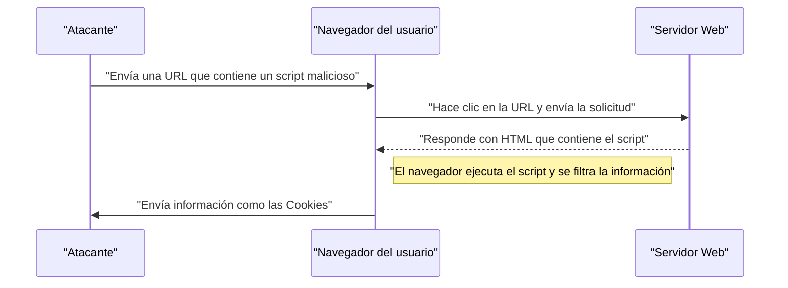
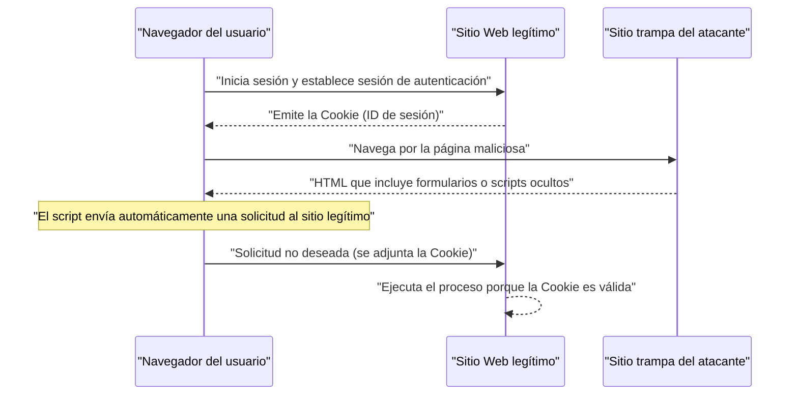

# Vulnerabilidades y medidas de seguridad de aplicaciones Web (OWASP Top 10 y codificación segura)

En las aplicaciones Web modernas, las medidas de seguridad son un elemento indispensable. Las técnicas de ataque son cada día más sofisticadas, y los desarrolladores deben adquirir constantemente conocimientos sobre las últimas amenazas y las técnicas de **codificación segura** para prevenirlas. En este artículo, explicaremos detalladamente los mecanismos de las principales vulnerabilidades, el impacto de los ataques y las medidas de defensa concretas, basándonos en el "OWASP Top 10", que es el estándar de facto para la seguridad de las aplicaciones Web.

## ¿Qué es el OWASP Top 10?

OWASP (Open Worldwide Application Security Project) es una organización internacional sin fines de lucro cuyo objetivo es mejorar la seguridad del software. El "OWASP Top 10", publicado periódicamente por OWASP, es un informe que resume los diez riesgos de seguridad más críticos en las aplicaciones Web, y es adoptado por muchas empresas y desarrolladores como estándar de seguridad.

En este artículo profundizaremos en vulnerabilidades que tienen un impacto particularmente grande y ocurren con frecuencia, como "Inyección", "Cross-Site Scripting (XSS)", "Cross-Site Request Forgery (CSRF)", "Server-Side Request Forgery (SSRF)" y "Falta de control de acceso".

---

## 1. Inyección (Injection)

La inyección es una vulnerabilidad que ocurre cuando se envían datos no confiables a un intérprete como parte de un comando o consulta. Los datos maliciosos del atacante son ejecutados por el intérprete como comandos no deseados o se accede a los datos sin la autorización adecuada.

### 1.1. Inyección SQL

La inyección SQL ocurre en aplicaciones que interactúan con una base de datos cuando los valores de entrada externos se integran indebidamente en una consulta SQL. Esto permite a los atacantes leer información confidencial en la base de datos, alterar datos e incluso tomar el control del servidor de la base de datos.

#### Mecanismo del ataque

Consideremos el procesamiento de inicio de sesión utilizando un nombre de usuario y contraseña como ejemplo típico.

**Ejemplo de código vulnerable (PHP):**

```php
$username = $_POST['username'];
$password = $_POST['password'];

// Peligro: Se concatena el valor de entrada directamente en la consulta SQL
$query = "SELECT * FROM users WHERE username = '" . $username . "' AND password = '" . $password . "'";
$result = $mysqli->query($query);
```

Supongamos que un atacante introduce la siguiente cadena en el campo `username` contra este código.

`admin' OR '1'='1`

Entonces, la consulta SQL que se ejecuta es la siguiente:

```sql
SELECT * FROM users WHERE username = 'admin' OR '1'='1' AND password = ''
```

Dado que `'1'='1'` siempre es verdadero (True), se omite la verificación de la contraseña y el atacante puede iniciar sesión como el usuario `admin`.

#### Métodos de defensa contra la inyección SQL

El método más seguro para prevenir la inyección SQL es utilizar **sentencias preparadas** (consultas parametrizadas). Esto separa la estructura de la consulta SQL y los datos, impidiendo que los valores de entrada se interpreten como comandos SQL.

**Ejemplo de código con medidas de seguridad (PHP / PDO):**

```php
$username = $_POST['username'];
$password = $_POST['password'];

// Seguro: Uso de sentencias preparadas
$stmt = $pdo->prepare("SELECT * FROM users WHERE username = :username AND password = :password");
$stmt->bindParam(':username', $username);
$stmt->bindParam(':password', $password);
$stmt->execute();
$result = $stmt->fetchAll();
```

### 1.2. Inyección [NoSQL](https://kenji.blog/es/p/nosql-database-selection-kvs-document-graph-wide-column/)

Los ataques de inyección también ocurren en bases de datos NoSQL (como [MongoDB](https://kenji.blog/es/p/nosql-database-selection-kvs-document-graph-wide-column/)) que se han popularizado en los últimos años. En NoSQL se utilizan lenguajes de consulta diferentes a SQL (como los basados en JSON), pero si la validación del valor de entrada es insuficiente, se pueden provocar cambios no deseados en la estructura de la consulta.

**Ejemplo de código vulnerable (JavaScript / Node.js + MongoDB):**

```javascript
const username = req.body.username;
const password = req.body.password;

// Peligro: Se incorpora el valor de entrada directamente en el objeto
db.collection('users').find({
    username: username,
    password: password
});
```

Si un atacante envía el objeto `{"$gt": ""}` en `password`, la consulta será la siguiente:

```json
{
    "username": "admin",
    "password": {"$gt": ""}
}
```

Esta condición significa "la contraseña es mayor que una cadena vacía (es decir, cualquier cadena)", y la autenticación es vulnerada.

#### Métodos de defensa contra la inyección [NoSQL](https://kenji.blog/es/p/nosql-database-selection-kvs-document-graph-wide-column/)

Para prevenir la inyección NoSQL, es importante realizar una verificación estricta de tipos de los valores de entrada y asegurarse de que no se pasen objetos en los lugares donde se esperan cadenas.

### 1.3. Inyección de comandos del SO

La inyección de comandos del SO es una vulnerabilidad donde, cuando la aplicación ejecuta un comando del sistema a través del shell, el valor de entrada externo se interpreta como parte del comando del shell.

**Ejemplo de código vulnerable (Python):**

```python
import os

domain = request.args.get('domain')
# Peligro: Se concatena el valor de entrada directamente en el comando del SO
os.system(f"ping -c 4 {domain}")
```

Si un atacante introduce `example.com; rm -rf /` en `domain`, se ejecutará un comando destructivo después del comando `ping`.

#### Métodos de defensa contra la inyección de comandos del SO

Se debe evitar en la medida de lo posible llamar a comandos del SO y utilizar las API (bibliotecas) integradas en el lenguaje. Si es inevitable ejecutar un comando del SO, asegúrese de pasar los argumentos en forma de lista sin pasar por el shell.

**Ejemplo de código con medidas de seguridad (Python):**

```python
import subprocess

domain = request.args.get('domain')
# Seguro: Los argumentos se pasan como una lista, sin usar el shell
subprocess.run(["ping", "-c", "4", domain])
```

---

## 2. Cross-Site Scripting (XSS)

El Cross-Site Scripting (XSS) es un ataque en el que un atacante inyecta un script malicioso (generalmente JavaScript) en una página web y hace que se ejecute en el navegador de otros usuarios. Esto resulta en el robo de tokens de sesión, operaciones no autorizadas con los privilegios del usuario, redireccionamiento a sitios de phishing, etc.

### Modelo de probabilidad de éxito del ataque

En los ataques del lado del cliente como XSS, la probabilidad de que el ataque tenga éxito depende de la probabilidad de que el usuario caiga en una trampa (como un enlace malicioso). Si modelamos esto matemáticamente, sería de la siguiente manera.

La probabilidad $ P(success) $ de que el ataque tenga éxito al menos una vez, asumiendo que la probabilidad de fallar en un intento es $ p $, y el número de intentos (como la cantidad de enlaces enviados) es $ n $, se puede expresar de la siguiente manera:

$ P(success) = 1 - (1 - p)^n $

A partir de esta fórmula, podemos ver que si existe una vulnerabilidad, a medida que aumenta el número de intentos de ataque, la probabilidad de que el ataque tenga éxito se acerca exponencialmente a 1. Por lo tanto, es esencial la eliminación fundamental de las vulnerabilidades.

### Tipos de XSS

El XSS se clasifica principalmente en los tres siguientes.

#### 2.1. Reflected XSS (XSS Reflejado)

Se ejecuta cuando se hace que un usuario haga clic en una URL que contiene un script malicioso, y ese script se refleja directamente en la respuesta del servidor (como un mensaje de error o resultados de búsqueda).



#### 2.2. Stored XSS (XSS Almacenado)

Un script malicioso se almacena en una base de datos o tablón de anuncios, y se ejecuta cuando otros usuarios ven esos datos. Es un XSS peligroso que tiende a tener un gran alcance de daño.

#### 2.3. DOM-based XSS

Es una vulnerabilidad en la que el JavaScript del lado del cliente (en el navegador) ejecuta un script no autorizado en el proceso de manipulación del DOM (Document Object Model) sin pasar por el servidor.

### Métodos de defensa contra XSS

El principio básico para prevenir XSS es el **escape (saneamiento)**. Cuando se emiten valores ingresados por el usuario en una página web, los caracteres que tienen un significado especial en HTML (como `<`, `>`, `&`, `"`, `'`, etc.) se convierten en cadenas inofensivas.

**Ejemplo de código vulnerable (JavaScript / Manipulación del DOM):**

```html
<div id="greeting"></div>
<script>
    // Obtiene el nombre de los parámetros de la URL
    const params = new URLSearchParams(window.location.search);
    const name = params.get('name');
    
    // Peligro: Se asigna a innerHTML sin escapar el valor de entrada
    document.getElementById('greeting').innerHTML = "¡Hola, " + name + "!";
</script>
```

**Ejemplo de código con medidas de seguridad (JavaScript):**

```html
<div id="greeting"></div>
<script>
    const params = new URLSearchParams(window.location.search);
    const name = params.get('name');
    
    // Seguro: Usa textContent para tratarlo como texto
    document.getElementById('greeting').textContent = "¡Hola, " + name + "!";
</script>
```

Del mismo modo, cuando se emite en el backend (como PHP), se debe utilizar una función de escape adecuada (como `htmlspecialchars`). Además, la introducción de una Política de Seguridad de Contenido (CSP) permite una defensa en profundidad que evita la ejecución de scripts en caso de que sean inyectados.

---

## 3. Cross-Site Request Forgery (CSRF)

El CSRF es un ataque en el que un atacante obliga a un usuario a enviar una solicitud no deseada a una aplicación Web en la que está autenticado. Esto puede provocar cambios de contraseña no deseados, compras de productos, eliminación de cuentas, etc.

### Flujo de ataque de CSRF



### Métodos de defensa contra CSRF

Para prevenir CSRF, se necesita un mecanismo para verificar si la solicitud es realmente intencionada por el usuario.

#### 3.1. Token CSRF

La medida más común es generar un token aleatorio en el servidor e incluir ese token cuando se envía el formulario. El servidor verifica el token enviado y rechaza la solicitud si no coincide.

**Ejemplo de código con medidas de seguridad (Formulario HTML):**

```html
<form action="/update_profile" method="POST">
    <!-- Incrusta el token CSRF generado en el servidor -->
    <input type="hidden" name="csrf_token" value="abc123xyz456...">
    <input type="text" name="email">
    <button type="submit">Actualizar</button>
</form>
```

#### 3.2. SameSite Cookie

Como medida más moderna, existe el método de utilizar el atributo `SameSite` de la Cookie. Al configurar `SameSite=Lax` o `SameSite=Strict`, las Cookies no se enviarán para solicitudes desde dominios diferentes, lo que puede prevenir de raíz los ataques CSRF.

**Ejemplo de encabezado HTTP con medidas de seguridad:**

```http
Set-Cookie: session_id=12345; Secure; HttpOnly; SameSite=Lax
```

---

## 4. Server-Side Request Forgery (SSRF)

El SSRF es un ataque en el que, si una aplicación Web tiene la capacidad de obtener datos de una URL externa, el atacante hace que el servidor envíe una solicitud a cualquier URL especificada. Esto permite el acceso a sistemas de la red interna (API de metadatos de la nube, bases de datos internas de la empresa, etc.) que normalmente no son accesibles desde el exterior.

### Amenazas e impacto del SSRF

En entornos en la nube (AWS, GCP, Azure, etc.), a veces es posible obtener metadatos como credenciales accediendo a una dirección IP específica (por ejemplo, `169.254.169.254`) desde dentro de la instancia. Si se accede a esta API utilizando SSRF, puede provocar una filtración de información crítica.

### Métodos de defensa contra SSRF

- **Restricción de URL mediante listas blancas**: Gestione los dominios y las direcciones IP a los que puede acceder la aplicación con una estricta lista blanca.
- **Prohibición de acceso a IP internas**: Bloquee las solicitudes a direcciones IP privadas como `127.0.0.1` o `10.0.0.0/8`, `169.254.169.254`, direcciones de loopback y direcciones link-local.
- **Verificación de la resolución de DNS**: Antes de enviar la solicitud, compruebe que la dirección IP resultante de resolver el dominio de la URL se encuentra dentro del rango permitido.

---

## 5. Falta de control de acceso (Broken Access Control)

La falta de control de acceso (autorización) es una vulnerabilidad en la que los usuarios pueden ejecutar acciones que exceden sus privilegios. En el OWASP Top 10 de 2021, está clasificado como el riesgo más grave (1er lugar).

### Escenarios concretos

- **IDOR (Insecure Direct Object References)**: Al alterar el parámetro de la URL (ejemplo: `user_id=123`), se puede acceder a la información personal de otros usuarios.
- **Escalada de privilegios**: Un usuario general puede realizar operaciones con privilegios de administrador accediendo directamente a la URL de la pantalla de administración (ejemplo: `/admin/dashboard`).

### Métodos de defensa del control de acceso

- **Denegación por defecto (Default Deny)**: Deniegue todos los accesos por defecto y solo permita el acceso a los usuarios y roles explícitamente autorizados (introducción de RBAC/ABAC).
- **Verificación estricta de privilegios en el servidor**: Verifique los privilegios siempre justo antes de ejecutar el procesamiento del backend, no solo en el lado del cliente (como ocultar en la interfaz de usuario del navegador).
- **Uso de identificadores difíciles de adivinar**: Para la referencia a objetos, utilice identificadores aleatorios difíciles de adivinar, como UUID, en lugar de ID secuenciales.

---

## 6. Hacia el desarrollo de aplicaciones Web seguras

La mayoría de las vulnerabilidades en las aplicaciones Web surgen de la falta de conocimiento o de conciencia sobre la **seguridad** durante la fase de desarrollo. Es importante incorporar las siguientes prácticas en el proceso de desarrollo.

1. **Seguridad desde el diseño**: Definir los requisitos de seguridad desde la fase de planificación y diseño, e incorporarlos en la arquitectura.
2. **Utilización de herramientas de análisis estático y dinámico**: Incorporar SAST (Pruebas estáticas de seguridad de aplicaciones) y DAST (Pruebas dinámicas de seguridad de aplicaciones) en el pipeline de CI/CD para descubrir vulnerabilidades de forma temprana.
3. **Gestión de dependencias**: Supervisar constantemente la información de vulnerabilidades (CVE) de las bibliotecas y frameworks de terceros, y aplicar actualizaciones rápidamente.
4. **Aprendizaje continuo**: Aprender continuamente las últimas tendencias de amenazas y métodos de defensa de comunidades como OWASP.

### Modelo de cálculo del alcance del impacto

El alcance del impacto (riesgo) si se ignora una vulnerabilidad se puede cuantificar con la siguiente fórmula matemática:

$ Risk = Threat 	imes Vulnerability 	imes Impact $

- **Threat (Amenaza)**: La probabilidad de que exista un atacante o la frecuencia de los ataques
- **Vulnerability (Vulnerabilidad)**: El grado de debilidad del sistema o la facilidad de explotación
- **Impact (Impacto)**: El daño al negocio (pérdida financiera o de credibilidad) por la filtración de información o la interrupción del sistema

Esta fórmula muestra que si cualquiera de estos factores se puede acercar a cero, el riesgo general se puede reducir significativamente. Como desarrolladores, su mayor responsabilidad es minimizar la "vulnerabilidad (Vulnerability)".

---

## Conclusión

En este artículo explicamos los mecanismos y los métodos concretos de **codificación segura** para las principales vulnerabilidades de las aplicaciones Web (inyección, XSS, CSRF, SSRF, falta de control de acceso) según el OWASP Top 10.

La seguridad no es algo que termina una vez que se implementan las medidas. En el proceso de desarrollo diario, es necesario escribir siempre código con la seguridad en mente e implementar revisiones y pruebas continuas para construir aplicaciones Web seguras y robustas.

## 7. Arquitectura de defensa detallada y operaciones (Parte 1)

En las aplicaciones Web a escala empresarial, además de las medidas a nivel de codificación mencionadas anteriormente, es indispensable una defensa en profundidad a nivel de infraestructura.

### 7.1 Introducción de WAF (Web Application Firewall)

El Web Application Firewall (WAF) es un sistema que supervisa y filtra el tráfico hacia las aplicaciones Web, y bloquea ataques como la inyección SQL y el Cross-Site Scripting (XSS) antes de que lleguen a la aplicación. WAF mejora su capacidad de respuesta frente a ataques de día cero al combinar no solo la detección basada en firmas, sino también la detección de comportamiento (detección de anomalías).

### 7.2 Construcción de un pipeline CI/CD seguro

Basado en el concepto de DevSecOps, es importante automatizar e integrar las pruebas de seguridad en el pipeline de Integración Continua/Entrega Continua (CI/CD).

* **SAST (Static Application Security Testing):** Analiza el código fuente estáticamente para detectar patrones de codificación que contienen vulnerabilidades.
* **DAST (Dynamic Application Security Testing):** Envía solicitudes de ataque simuladas a la aplicación en ejecución para detectar vulnerabilidades en tiempo de ejecución.
* **SCA (Software Composition Analysis):** Detecta vulnerabilidades conocidas (CVE) en las bibliotecas y componentes de código abierto utilizados e insta a su actualización.

### 7.3 Realización periódica de pruebas de penetración

Además de los escaneos con herramientas automatizadas, la realización periódica de pruebas de penetración manuales (pruebas de intrusión) por parte de expertos en seguridad permite identificar fallas en la lógica de negocio y vulnerabilidades de control de acceso complejas que son difíciles de descubrir con herramientas.

## 8. Arquitectura de defensa detallada y operaciones (Parte 2)

En las aplicaciones Web a escala empresarial, además de las medidas a nivel de codificación mencionadas anteriormente, es indispensable una defensa en profundidad a nivel de infraestructura.

### 8.1 Introducción de WAF (Web Application Firewall)

El Web Application Firewall (WAF) es un sistema que supervisa y filtra el tráfico hacia las aplicaciones Web, y bloquea ataques como la inyección SQL y el Cross-Site Scripting (XSS) antes de que lleguen a la aplicación. WAF mejora su capacidad de respuesta frente a ataques de día cero al combinar no solo la detección basada en firmas, sino también la detección de comportamiento (detección de anomalías).

### 8.2 Construcción de un pipeline CI/CD seguro

Basado en el concepto de DevSecOps, es importante automatizar e integrar las pruebas de seguridad en el pipeline de Integración Continua/Entrega Continua (CI/CD).

* **SAST (Static Application Security Testing):** Analiza el código fuente estáticamente para detectar patrones de codificación que contienen vulnerabilidades.
* **DAST (Dynamic Application Security Testing):** Envía solicitudes de ataque simuladas a la aplicación en ejecución para detectar vulnerabilidades en tiempo de ejecución.
* **SCA (Software Composition Analysis):** Detecta vulnerabilidades conocidas (CVE) en las bibliotecas y componentes de código abierto utilizados e insta a su actualización.

### 8.3 Realización periódica de pruebas de penetración

Además de los escaneos con herramientas automatizadas, la realización periódica de pruebas de penetración manuales (pruebas de intrusión) por parte de expertos en seguridad permite identificar fallas en la lógica de negocio y vulnerabilidades de control de acceso complejas que son difíciles de descubrir con herramientas.

## 9. Arquitectura de defensa detallada y operaciones (Parte 3)

En las aplicaciones Web a escala empresarial, además de las medidas a nivel de codificación mencionadas anteriormente, es indispensable una defensa en profundidad a nivel de infraestructura.

### 9.1 Introducción de WAF (Web Application Firewall)

El Web Application Firewall (WAF) es un sistema que supervisa y filtra el tráfico hacia las aplicaciones Web, y bloquea ataques como la inyección SQL y el Cross-Site Scripting (XSS) antes de que lleguen a la aplicación. WAF mejora su capacidad de respuesta frente a ataques de día cero al combinar no solo la detección basada en firmas, sino también la detección de comportamiento (detección de anomalías).

### 9.2 Construcción de un pipeline CI/CD seguro

Basado en el concepto de DevSecOps, es importante automatizar e integrar las pruebas de seguridad en el pipeline de Integración Continua/Entrega Continua (CI/CD).

* **SAST (Static Application Security Testing):** Analiza el código fuente estáticamente para detectar patrones de codificación que contienen vulnerabilidades.
* **DAST (Dynamic Application Security Testing):** Envía solicitudes de ataque simuladas a la aplicación en ejecución para detectar vulnerabilidades en tiempo de ejecución.
* **SCA (Software Composition Analysis):** Detecta vulnerabilidades conocidas (CVE) en las bibliotecas y componentes de código abierto utilizados e insta a su actualización.

### 9.3 Realización periódica de pruebas de penetración

Además de los escaneos con herramientas automatizadas, la realización periódica de pruebas de penetración manuales (pruebas de intrusión) por parte de expertos en seguridad permite identificar fallas en la lógica de negocio y vulnerabilidades de control de acceso complejas que son difíciles de descubrir con herramientas.

## 10. Arquitectura de defensa detallada y operaciones (Parte 4)

En las aplicaciones Web a escala empresarial, además de las medidas a nivel de codificación mencionadas anteriormente, es indispensable una defensa en profundidad a nivel de infraestructura.

### 10.1 Introducción de WAF (Web Application Firewall)

El Web Application Firewall (WAF) es un sistema que supervisa y filtra el tráfico hacia las aplicaciones Web, y bloquea ataques como la inyección SQL y el Cross-Site Scripting (XSS) antes de que lleguen a la aplicación. WAF mejora su capacidad de respuesta frente a ataques de día cero al combinar no solo la detección basada en firmas, sino también la detección de comportamiento (detección de anomalías).

### 10.2 Construcción de un pipeline CI/CD seguro

Basado en el concepto de DevSecOps, es importante automatizar e integrar las pruebas de seguridad en el pipeline de Integración Continua/Entrega Continua (CI/CD).

* **SAST (Static Application Security Testing):** Analiza el código fuente estáticamente para detectar patrones de codificación que contienen vulnerabilidades.
* **DAST (Dynamic Application Security Testing):** Envía solicitudes de ataque simuladas a la aplicación en ejecución para detectar vulnerabilidades en tiempo de ejecución.
* **SCA (Software Composition Analysis):** Detecta vulnerabilidades conocidas (CVE) en las bibliotecas y componentes de código abierto utilizados e insta a su actualización.

### 10.3 Realización periódica de pruebas de penetración

Además de los escaneos con herramientas automatizadas, la realización periódica de pruebas de penetración manuales (pruebas de intrusión) por parte de expertos en seguridad permite identificar fallas en la lógica de negocio y vulnerabilidades de control de acceso complejas que son difíciles de descubrir con herramientas.

## 11. Arquitectura de defensa detallada y operaciones (Parte 5)

En las aplicaciones Web a escala empresarial, además de las medidas a nivel de codificación mencionadas anteriormente, es indispensable una defensa en profundidad a nivel de infraestructura.

### 11.1 Introducción de WAF (Web Application Firewall)

El Web Application Firewall (WAF) es un sistema que supervisa y filtra el tráfico hacia las aplicaciones Web, y bloquea ataques como la inyección SQL y el Cross-Site Scripting (XSS) antes de que lleguen a la aplicación. WAF mejora su capacidad de respuesta frente a ataques de día cero al combinar no solo la detección basada en firmas, sino también la detección de comportamiento (detección de anomalías).

### 11.2 Construcción de un pipeline CI/CD seguro

Basado en el concepto de DevSecOps, es importante automatizar e integrar las pruebas de seguridad en el pipeline de Integración Continua/Entrega Continua (CI/CD).

* **SAST (Static Application Security Testing):** Analiza el código fuente estáticamente para detectar patrones de codificación que contienen vulnerabilidades.
* **DAST (Dynamic Application Security Testing):** Envía solicitudes de ataque simuladas a la aplicación en ejecución para detectar vulnerabilidades en tiempo de ejecución.
* **SCA (Software Composition Analysis):** Detecta vulnerabilidades conocidas (CVE) en las bibliotecas y componentes de código abierto utilizados e insta a su actualización.

### 11.3 Realización periódica de pruebas de penetración

Además de los escaneos con herramientas automatizadas, la realización periódica de pruebas de penetración manuales (pruebas de intrusión) por parte de expertos en seguridad permite identificar fallas en la lógica de negocio y vulnerabilidades de control de acceso complejas que son difíciles de descubrir con herramientas.

## 12. Arquitectura de defensa detallada y operaciones (Parte 6)

En las aplicaciones Web a escala empresarial, además de las medidas a nivel de codificación mencionadas anteriormente, es indispensable una defensa en profundidad a nivel de infraestructura.

### 12.1 Introducción de WAF (Web Application Firewall)

El Web Application Firewall (WAF) es un sistema que supervisa y filtra el tráfico hacia las aplicaciones Web, y bloquea ataques como la inyección SQL y el Cross-Site Scripting (XSS) antes de que lleguen a la aplicación. WAF mejora su capacidad de respuesta frente a ataques de día cero al combinar no solo la detección basada en firmas, sino también la detección de comportamiento (detección de anomalías).

### 12.2 Construcción de un pipeline CI/CD seguro

Basado en el concepto de DevSecOps, es importante automatizar e integrar las pruebas de seguridad en el pipeline de Integración Continua/Entrega Continua (CI/CD).

* **SAST (Static Application Security Testing):** Analiza el código fuente estáticamente para detectar patrones de codificación que contienen vulnerabilidades.
* **DAST (Dynamic Application Security Testing):** Envía solicitudes de ataque simuladas a la aplicación en ejecución para detectar vulnerabilidades en tiempo de ejecución.
* **SCA (Software Composition Analysis):** Detecta vulnerabilidades conocidas (CVE) en las bibliotecas y componentes de código abierto utilizados e insta a su actualización.

### 12.3 Realización periódica de pruebas de penetración

Además de los escaneos con herramientas automatizadas, la realización periódica de pruebas de penetración manuales (pruebas de intrusión) por parte de expertos en seguridad permite identificar fallas en la lógica de negocio y vulnerabilidades de control de acceso complejas que son difíciles de descubrir con herramientas.

## 13. Arquitectura de defensa detallada y operaciones (Parte 7)

En las aplicaciones Web a escala empresarial, además de las medidas a nivel de codificación mencionadas anteriormente, es indispensable una defensa en profundidad a nivel de infraestructura.

### 13.1 Introducción de WAF (Web Application Firewall)

El Web Application Firewall (WAF) es un sistema que supervisa y filtra el tráfico hacia las aplicaciones Web, y bloquea ataques como la inyección SQL y el Cross-Site Scripting (XSS) antes de que lleguen a la aplicación. WAF mejora su capacidad de respuesta frente a ataques de día cero al combinar no solo la detección basada en firmas, sino también la detección de comportamiento (detección de anomalías).

### 13.2 Construcción de un pipeline CI/CD seguro

Basado en el concepto de DevSecOps, es importante automatizar e integrar las pruebas de seguridad en el pipeline de Integración Continua/Entrega Continua (CI/CD).

* **SAST (Static Application Security Testing):** Analiza el código fuente estáticamente para detectar patrones de codificación que contienen vulnerabilidades.
* **DAST (Dynamic Application Security Testing):** Envía solicitudes de ataque simuladas a la aplicación en ejecución para detectar vulnerabilidades en tiempo de ejecución.
* **SCA (Software Composition Analysis):** Detecta vulnerabilidades conocidas (CVE) en las bibliotecas y componentes de código abierto utilizados e insta a su actualización.

### 13.3 Realización periódica de pruebas de penetración

Además de los escaneos con herramientas automatizadas, la realización periódica de pruebas de penetración manuales (pruebas de intrusión) por parte de expertos en seguridad permite identificar fallas en la lógica de negocio y vulnerabilidades de control de acceso complejas que son difíciles de descubrir con herramientas.

## 14. Arquitectura de defensa detallada y operaciones (Parte 8)

En las aplicaciones Web a escala empresarial, además de las medidas a nivel de codificación mencionadas anteriormente, es indispensable una defensa en profundidad a nivel de infraestructura.

### 14.1 Introducción de WAF (Web Application Firewall)

El Web Application Firewall (WAF) es un sistema que supervisa y filtra el tráfico hacia las aplicaciones Web, y bloquea ataques como la inyección SQL y el Cross-Site Scripting (XSS) antes de que lleguen a la aplicación. WAF mejora su capacidad de respuesta frente a ataques de día cero al combinar no solo la detección basada en firmas, sino también la detección de comportamiento (detección de anomalías).

### 14.2 Construcción de un pipeline CI/CD seguro

Basado en el concepto de DevSecOps, es importante automatizar e integrar las pruebas de seguridad en el pipeline de Integración Continua/Entrega Continua (CI/CD).

* **SAST (Static Application Security Testing):** Analiza el código fuente estáticamente para detectar patrones de codificación que contienen vulnerabilidades.
* **DAST (Dynamic Application Security Testing):** Envía solicitudes de ataque simuladas a la aplicación en ejecución para detectar vulnerabilidades en tiempo de ejecución.
* **SCA (Software Composition Analysis):** Detecta vulnerabilidades conocidas (CVE) en las bibliotecas y componentes de código abierto utilizados e insta a su actualización.

### 14.3 Realización periódica de pruebas de penetración

Además de los escaneos con herramientas automatizadas, la realización periódica de pruebas de penetración manuales (pruebas de intrusión) por parte de expertos en seguridad permite identificar fallas en la lógica de negocio y vulnerabilidades de control de acceso complejas que son difíciles de descubrir con herramientas.

## 15. Arquitectura de defensa detallada y operaciones (Parte 9)

En las aplicaciones Web a escala empresarial, además de las medidas a nivel de codificación mencionadas anteriormente, es indispensable una defensa en profundidad a nivel de infraestructura.

### 15.1 Introducción de WAF (Web Application Firewall)

El Web Application Firewall (WAF) es un sistema que supervisa y filtra el tráfico hacia las aplicaciones Web, y bloquea ataques como la inyección SQL y el Cross-Site Scripting (XSS) antes de que lleguen a la aplicación. WAF mejora su capacidad de respuesta frente a ataques de día cero al combinar no solo la detección basada en firmas, sino también la detección de comportamiento (detección de anomalías).

### 15.2 Construcción de un pipeline CI/CD seguro

Basado en el concepto de DevSecOps, es importante automatizar e integrar las pruebas de seguridad en el pipeline de Integración Continua/Entrega Continua (CI/CD).

* **SAST (Static Application Security Testing):** Analiza el código fuente estáticamente para detectar patrones de codificación que contienen vulnerabilidades.
* **DAST (Dynamic Application Security Testing):** Envía solicitudes de ataque simuladas a la aplicación en ejecución para detectar vulnerabilidades en tiempo de ejecución.
* **SCA (Software Composition Analysis):** Detecta vulnerabilidades conocidas (CVE) en las bibliotecas y componentes de código abierto utilizados e insta a su actualización.

### 15.3 Realización periódica de pruebas de penetración

Además de los escaneos con herramientas automatizadas, la realización periódica de pruebas de penetración manuales (pruebas de intrusión) por parte de expertos en seguridad permite identificar fallas en la lógica de negocio y vulnerabilidades de control de acceso complejas que son difíciles de descubrir con herramientas.

## 16. Arquitectura de defensa detallada y operaciones (Parte 10)

En las aplicaciones Web a escala empresarial, además de las medidas a nivel de codificación mencionadas anteriormente, es indispensable una defensa en profundidad a nivel de infraestructura.

### 16.1 Introducción de WAF (Web Application Firewall)

El Web Application Firewall (WAF) es un sistema que supervisa y filtra el tráfico hacia las aplicaciones Web, y bloquea ataques como la inyección SQL y el Cross-Site Scripting (XSS) antes de que lleguen a la aplicación. WAF mejora su capacidad de respuesta frente a ataques de día cero al combinar no solo la detección basada en firmas, sino también la detección de comportamiento (detección de anomalías).

### 16.2 Construcción de un pipeline CI/CD seguro

Basado en el concepto de DevSecOps, es importante automatizar e integrar las pruebas de seguridad en el pipeline de Integración Continua/Entrega Continua (CI/CD).

* **SAST (Static Application Security Testing):** Analiza el código fuente estáticamente para detectar patrones de codificación que contienen vulnerabilidades.
* **DAST (Dynamic Application Security Testing):** Envía solicitudes de ataque simuladas a la aplicación en ejecución para detectar vulnerabilidades en tiempo de ejecución.
* **SCA (Software Composition Analysis):** Detecta vulnerabilidades conocidas (CVE) en las bibliotecas y componentes de código abierto utilizados e insta a su actualización.

### 16.3 Realización periódica de pruebas de penetración

Además de los escaneos con herramientas automatizadas, la realización periódica de pruebas de penetración manuales (pruebas de intrusión) por parte de expertos en seguridad permite identificar fallas en la lógica de negocio y vulnerabilidades de control de acceso complejas que son difíciles de descubrir con herramientas.

## 17. Arquitectura de defensa detallada y operaciones (Parte 11)

En las aplicaciones Web a escala empresarial, además de las medidas a nivel de codificación mencionadas anteriormente, es indispensable una defensa en profundidad a nivel de infraestructura.

### 17.1 Introducción de WAF (Web Application Firewall)

El Web Application Firewall (WAF) es un sistema que supervisa y filtra el tráfico hacia las aplicaciones Web, y bloquea ataques como la inyección SQL y el Cross-Site Scripting (XSS) antes de que lleguen a la aplicación. WAF mejora su capacidad de respuesta frente a ataques de día cero al combinar no solo la detección basada en firmas, sino también la detección de comportamiento (detección de anomalías).

### 17.2 Construcción de un pipeline CI/CD seguro

Basado en el concepto de DevSecOps, es importante automatizar e integrar las pruebas de seguridad en el pipeline de Integración Continua/Entrega Continua (CI/CD).

* **SAST (Static Application Security Testing):** Analiza el código fuente estáticamente para detectar patrones de codificación que contienen vulnerabilidades.
* **DAST (Dynamic Application Security Testing):** Envía solicitudes de ataque simuladas a la aplicación en ejecución para detectar vulnerabilidades en tiempo de ejecución.
* **SCA (Software Composition Analysis):** Detecta vulnerabilidades conocidas (CVE) en las bibliotecas y componentes de código abierto utilizados e insta a su actualización.

### 17.3 Realización periódica de pruebas de penetración

Además de los escaneos con herramientas automatizadas, la realización periódica de pruebas de penetración manuales (pruebas de intrusión) por parte de expertos en seguridad permite identificar fallas en la lógica de negocio y vulnerabilidades de control de acceso complejas que son difíciles de descubrir con herramientas.

## 18. Arquitectura de defensa detallada y operaciones (Parte 12)

En las aplicaciones Web a escala empresarial, además de las medidas a nivel de codificación mencionadas anteriormente, es indispensable una defensa en profundidad a nivel de infraestructura.

### 18.1 Introducción de WAF (Web Application Firewall)

El Web Application Firewall (WAF) es un sistema que supervisa y filtra el tráfico hacia las aplicaciones Web, y bloquea ataques como la inyección SQL y el Cross-Site Scripting (XSS) antes de que lleguen a la aplicación. WAF mejora su capacidad de respuesta frente a ataques de día cero al combinar no solo la detección basada en firmas, sino también la detección de comportamiento (detección de anomalías).

### 18.2 Construcción de un pipeline CI/CD seguro

Basado en el concepto de DevSecOps, es importante automatizar e integrar las pruebas de seguridad en el pipeline de Integración Continua/Entrega Continua (CI/CD).

* **SAST (Static Application Security Testing):** Analiza el código fuente estáticamente para detectar patrones de codificación que contienen vulnerabilidades.
* **DAST (Dynamic Application Security Testing):** Envía solicitudes de ataque simuladas a la aplicación en ejecución para detectar vulnerabilidades en tiempo de ejecución.
* **SCA (Software Composition Analysis):** Detecta vulnerabilidades conocidas (CVE) en las bibliotecas y componentes de código abierto utilizados e insta a su actualización.

### 18.3 Realización periódica de pruebas de penetración

Además de los escaneos con herramientas automatizadas, la realización periódica de pruebas de penetración manuales (pruebas de intrusión) por parte de expertos en seguridad permite identificar fallas en la lógica de negocio y vulnerabilidades de control de acceso complejas que son difíciles de descubrir con herramientas.

## 19. Arquitectura de defensa detallada y operaciones (Parte 13)

En las aplicaciones Web a escala empresarial, además de las medidas a nivel de codificación mencionadas anteriormente, es indispensable una defensa en profundidad a nivel de infraestructura.

### 19.1 Introducción de WAF (Web Application Firewall)

El Web Application Firewall (WAF) es un sistema que supervisa y filtra el tráfico hacia las aplicaciones Web, y bloquea ataques como la inyección SQL y el Cross-Site Scripting (XSS) antes de que lleguen a la aplicación. WAF mejora su capacidad de respuesta frente a ataques de día cero al combinar no solo la detección basada en firmas, sino también la detección de comportamiento (detección de anomalías).

### 19.2 Construcción de un pipeline CI/CD seguro

Basado en el concepto de DevSecOps, es importante automatizar e integrar las pruebas de seguridad en el pipeline de Integración Continua/Entrega Continua (CI/CD).

* **SAST (Static Application Security Testing):** Analiza el código fuente estáticamente para detectar patrones de codificación que contienen vulnerabilidades.
* **DAST (Dynamic Application Security Testing):** Envía solicitudes de ataque simuladas a la aplicación en ejecución para detectar vulnerabilidades en tiempo de ejecución.
* **SCA (Software Composition Analysis):** Detecta vulnerabilidades conocidas (CVE) en las bibliotecas y componentes de código abierto utilizados e insta a su actualización.

### 19.3 Realización periódica de pruebas de penetración

Además de los escaneos con herramientas automatizadas, la realización periódica de pruebas de penetración manuales (pruebas de intrusión) por parte de expertos en seguridad permite identificar fallas en la lógica de negocio y vulnerabilidades de control de acceso complejas que son difíciles de descubrir con herramientas.

## 20. Arquitectura de defensa detallada y operaciones (Parte 14)

En las aplicaciones Web a escala empresarial, además de las medidas a nivel de codificación mencionadas anteriormente, es indispensable una defensa en profundidad a nivel de infraestructura.

### 20.1 Introducción de WAF (Web Application Firewall)

El Web Application Firewall (WAF) es un sistema que supervisa y filtra el tráfico hacia las aplicaciones Web, y bloquea ataques como la inyección SQL y el Cross-Site Scripting (XSS) antes de que lleguen a la aplicación. WAF mejora su capacidad de respuesta frente a ataques de día cero al combinar no solo la detección basada en firmas, sino también la detección de comportamiento (detección de anomalías).

### 20.2 Construcción de un pipeline CI/CD seguro

Basado en el concepto de DevSecOps, es importante automatizar e integrar las pruebas de seguridad en el pipeline de Integración Continua/Entrega Continua (CI/CD).

* **SAST (Static Application Security Testing):** Analiza el código fuente estáticamente para detectar patrones de codificación que contienen vulnerabilidades.
* **DAST (Dynamic Application Security Testing):** Envía solicitudes de ataque simuladas a la aplicación en ejecución para detectar vulnerabilidades en tiempo de ejecución.
* **SCA (Software Composition Analysis):** Detecta vulnerabilidades conocidas (CVE) en las bibliotecas y componentes de código abierto utilizados e insta a su actualización.

### 20.3 Realización periódica de pruebas de penetración

Además de los escaneos con herramientas automatizadas, la realización periódica de pruebas de penetración manuales (pruebas de intrusión) por parte de expertos en seguridad permite identificar fallas en la lógica de negocio y vulnerabilidades de control de acceso complejas que son difíciles de descubrir con herramientas.
