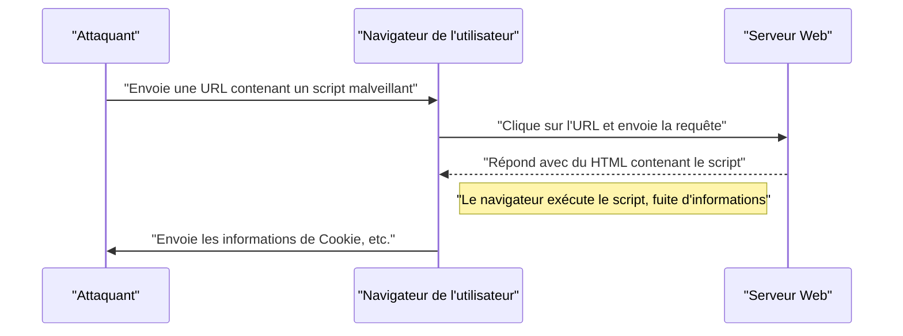
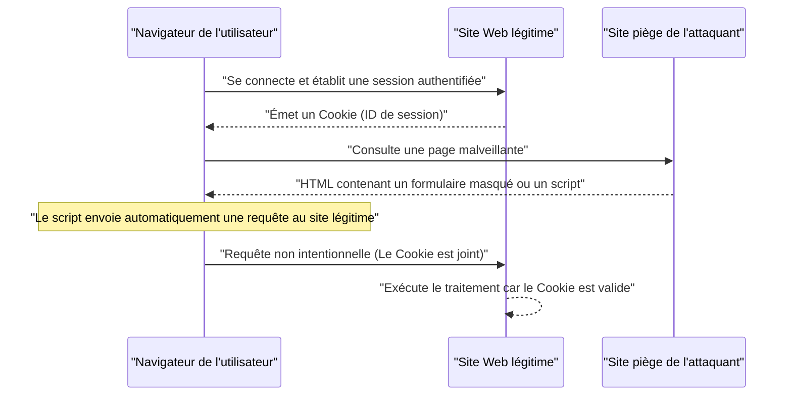

# Vulnérabilités des applications Web et contre-mesures (OWASP Top 10 et codage sécurisé)

Dans les applications Web modernes, les mesures de sécurité sont un élément essentiel. Les méthodes d'attaque deviennent de plus en plus sophistiquées de jour en jour, et les développeurs doivent constamment acquérir des connaissances sur les dernières menaces et les techniques de **codage sécurisé** pour les prévenir. Cet article expliquera en détail les mécanismes des principales vulnérabilités, l'impact des attaques et les méthodes de défense spécifiques, sur la base du « OWASP Top 10 », qui est la norme de facto en matière de sécurité des applications Web.

## Qu'est-ce que l'OWASP Top 10 ?

L'OWASP (Open Worldwide Application Security Project) est une organisation internationale à but non lucratif dont l'objectif est d'améliorer la sécurité des logiciels. L'« OWASP Top 10 », publié régulièrement par l'OWASP, est un rapport résumant les dix risques de sécurité les plus critiques pour les applications Web, et de nombreuses entreprises et développeurs l'adoptent comme norme de sécurité.

Cet article se concentrera et approfondira en particulier les vulnérabilités qui ont un impact important et qui se produisent fréquemment, telles que « Injection », « Cross-Site Scripting (XSS) », « Cross-Site Request Forgery (CSRF) », « Server-Side Request Forgery (SSRF) » et « Défaut de contrôle d'accès ».

---

## 1. Injection

L'injection est une vulnérabilité qui se produit lorsque des données non fiables sont envoyées à un interpréteur en tant que partie d'une commande ou d'une requête. Les données malveillantes de l'attaquant peuvent être exécutées en tant que commande non intentionnelle par l'interpréteur, ou des données peuvent être consultées sans autorisation appropriée.

### 1.1. Injection SQL

L'injection SQL se produit dans les applications qui interagissent avec une base de données lorsque des valeurs d'entrée externes sont incorporées de manière frauduleuse dans une requête SQL. Cela permet à un attaquant de lire des informations sensibles dans la base de données, de falsifier des données, voire de prendre le contrôle du serveur de base de données.

#### Mécanisme de l'attaque

Comme exemple typique, considérons un processus de connexion utilisant un nom d'utilisateur et un mot de passe.

**Exemple de code vulnérable (PHP) :**

```php
$username = $_POST['username'];
$password = $_POST['password'];

// Danger : concaténation des valeurs d'entrée directement dans la requête SQL
$query = "SELECT * FROM users WHERE username = '" . $username . "' AND password = '" . $password . "'";
$result = $mysqli->query($query);
```

Supposons qu'un attaquant saisisse la chaîne de caractères suivante dans le champ `username` pour ce code :

`admin' OR '1'='1`

Ensuite, la requête SQL exécutée sera la suivante :

```sql
SELECT * FROM users WHERE username = 'admin' OR '1'='1' AND password = ''
```

Puisque `'1'='1'` est toujours vrai (True), la vérification du mot de passe est contournée et l'attaquant peut se connecter en tant qu'utilisateur `admin`.

#### Méthodes de défense contre l'injection SQL

La méthode la plus fiable pour prévenir l'injection SQL est d'utiliser des **instructions préparées** (requêtes paramétrées). Cela sépare la structure de la requête SQL des données et empêche les valeurs d'entrée d'être interprétées comme des commandes SQL.

**Exemple de code corrigé (PHP / PDO) :**

```php
$username = $_POST['username'];
$password = $_POST['password'];

// Sécurité : utilisation d'instructions préparées
$stmt = $pdo->prepare("SELECT * FROM users WHERE username = :username AND password = :password");
$stmt->bindParam(':username', $username);
$stmt->bindParam(':password', $password);
$stmt->execute();
$result = $stmt->fetchAll();
```

### 1.2. Injection NoSQL

Les attaques par injection se produisent également dans les bases de données NoSQL (telles que MongoDB) qui se sont répandues ces dernières années. Dans NoSQL, on utilise un langage de requête différent de SQL (basé sur JSON, etc.), mais si la validation des valeurs d'entrée est insuffisante, il est possible de provoquer une modification involontaire de la structure de la requête.

**Exemple de code vulnérable (JavaScript / Node.js + MongoDB) :**

```javascript
const username = req.body.username;
const password = req.body.password;

// Danger : intégration des valeurs d'entrée directement dans l'objet
db.collection('users').find({
    username: username,
    password: password
});
```

Si un attaquant envoie un objet tel que `{"$gt": ""}` dans le `password`, la requête sera la suivante :

```json
{
    "username": "admin",
    "password": {"$gt": ""}
}
```

Cela devient une condition « le mot de passe est supérieur à une chaîne vide (c'est-à-dire n'importe quelle chaîne) », et l'authentification est contournée.

#### Méthodes de défense contre l'injection NoSQL

Pour prévenir l'injection NoSQL, il est important d'effectuer une vérification stricte du type des valeurs d'entrée et de s'assurer que des objets ne sont pas transmis là où des chaînes de caractères sont attendues.

### 1.3. Injection de commandes du système d'exploitation

L'injection de commandes du système d'exploitation (OS) est une vulnérabilité où les valeurs d'entrée externes sont interprétées comme faisant partie d'une commande shell lorsque l'application exécute des commandes système via le shell.

**Exemple de code vulnérable (Python) :**

```python
import os

domain = request.args.get('domain')
# Danger : concaténation des valeurs d'entrée directement à la commande du système d'exploitation
os.system(f"ping -c 4 {domain}")
```

Si un attaquant saisit `example.com; rm -rf /` pour `domain`, une commande destructrice sera exécutée après la commande `ping`.

#### Méthodes de défense contre l'injection de commandes du système d'exploitation

Dans la mesure du possible, évitez d'appeler des commandes du système d'exploitation et utilisez les API (bibliothèques) intégrées au langage. S'il est inévitable d'exécuter une commande du système d'exploitation, passez les arguments sous forme de liste sans passer par le shell.

**Exemple de code corrigé (Python) :**

```python
import subprocess

domain = request.args.get('domain')
# Sécurité : passage des arguments sous forme de liste, sans passer par le shell
subprocess.run(["ping", "-c", "4", domain])
```

---

## 2. Cross-Site Scripting (XSS)

Le Cross-Site Scripting (XSS) est une attaque où un attaquant injecte un script malveillant (généralement du JavaScript) dans une page Web et le fait exécuter sur le navigateur d'autres utilisateurs. Cela permet de voler des jetons de session, d'effectuer des opérations frauduleuses avec les privilèges de l'utilisateur, ou de rediriger vers des sites de phishing.

### Modèle de probabilité de succès de l'attaque

Dans les attaques côté client telles que XSS, la probabilité de succès de l'attaque dépend de la probabilité que l'utilisateur tombe dans le piège (par exemple, en cliquant sur un lien malveillant). Ceci peut être modélisé par une formule comme suit.

La probabilité $ P(success) $ que l'attaque réussisse au moins une fois, si la probabilité d'échec d'une seule tentative est $ p $ et le nombre de tentatives (comme le nombre de liens envoyés) est $ n $, peut être exprimée comme suit :

$ P(success) = 1 - (1 - p)^n $

D'après cette formule, on comprend que s'il existe une vulnérabilité et que le nombre de tentatives d'attaque augmente, la probabilité de succès de l'attaque s'approche de 1 de manière exponentielle. Par conséquent, l'élimination fondamentale de la vulnérabilité est indispensable.

### Types de XSS

Le XSS est principalement classé en trois types :

#### 2.1. Reflected XSS (XSS réfléchi)

Il est exécuté en faisant cliquer à l'utilisateur sur une URL contenant un script malveillant, et le script est réfléchi (Reflect) et affiché tel quel dans la réponse du serveur (comme un message d'erreur ou un résultat de recherche).



#### 2.2. Stored XSS (XSS stocké)

Un script malveillant est stocké (Store) dans une base de données ou un forum, et le script est exécuté lorsque d'autres utilisateurs affichent ces données. C'est un XSS dangereux dont la portée des dommages a tendance à être importante.

#### 2.3. DOM-based XSS

Il s'agit d'une vulnérabilité où le JavaScript côté client (sur le navigateur) exécute un script malveillant lors de la manipulation du DOM (Document Object Model) sans passer par le serveur.

### Méthodes de défense contre XSS

Le principe de base pour prévenir le XSS est l'**échappement (nettoyage)**. Lors de l'affichage des valeurs d'entrée de l'utilisateur sur une page Web, les caractères ayant une signification particulière en HTML (comme `<`, `>`, `&`, `"`, `'`) sont convertis en chaînes de caractères inoffensives.

**Exemple de code vulnérable (JavaScript / Manipulation du DOM) :**

```html
<div id="greeting"></div>
<script>
    // Obtention du nom à partir des paramètres de l'URL
    const params = new URLSearchParams(window.location.search);
    const name = params.get('name');
    
    // Danger : affectation à innerHTML sans échapper la valeur d'entrée
    document.getElementById('greeting').innerHTML = "Bonjour, " + name + " !";
</script>
```

**Exemple de code corrigé (JavaScript) :**

```html
<div id="greeting"></div>
<script>
    const params = new URLSearchParams(window.location.search);
    const name = params.get('name');
    
    // Sécurité : utilisation de textContent pour traiter comme du texte
    document.getElementById('greeting').textContent = "Bonjour, " + name + " !";
</script>
```

De même, lors de la sortie en back-end (PHP, etc.), une fonction d'échappement appropriée (telle que `htmlspecialchars`) est utilisée. De plus, l'introduction de la Content Security Policy (CSP) permet une défense en profondeur empêchant l'exécution même si un script est injecté.

---

## 3. Cross-Site Request Forgery (CSRF)

Le CSRF est une attaque où un attaquant force un utilisateur à envoyer une requête non intentionnelle à une application Web sur laquelle l'utilisateur est authentifié. Cela entraîne des changements de mot de passe involontaires de la part de l'utilisateur, des achats d'articles, des processus de désinscription, etc.

### [Flux](https://kenji.blog/fr/p/state-management-history-redux-context-recoil-zustand/) d'attaque CSRF



### Méthodes de défense contre CSRF

Pour prévenir le CSRF, il faut un mécanisme permettant de vérifier si la requête est vraiment l'intention de l'utilisateur.

#### 3.1. Jeton CSRF

La mesure la plus courante consiste à générer un jeton aléatoire côté serveur et à l'inclure lors de la soumission du formulaire. Le serveur vérifie le jeton envoyé et rejette la requête si elle ne correspond pas.

**Exemple de code corrigé (Formulaire HTML) :**

```html
<form action="/update_profile" method="POST">
    <!-- Intégration du jeton CSRF généré par le serveur -->
    <input type="hidden" name="csrf_token" value="abc123xyz456...">
    <input type="text" name="email">
    <button type="submit">Mettre à jour</button>
</form>
```

#### 3.2. Cookie SameSite

Comme mesure plus moderne, il existe une méthode utilisant l'attribut `SameSite` du Cookie. En configurant `SameSite=Lax` ou `SameSite=Strict`, les Cookies ne seront plus envoyés pour les requêtes provenant d'autres domaines, ce qui permet de prévenir fondamentalement les attaques CSRF.

**Exemple d'en-tête HTTP corrigé :**

```http
Set-Cookie: session_id=12345; Secure; HttpOnly; SameSite=Lax
```

---

## 4. Server-Side Request Forgery (SSRF)

Le SSRF est une attaque où, lorsque l'application Web a la fonctionnalité de récupérer des données à partir d'une URL externe, un attaquant force le serveur à envoyer une requête à une URL arbitraire qu'il a spécifiée. Cela permet l'accès aux systèmes du réseau interne qui sont normalement inaccessibles de l'extérieur (API de métadonnées du cloud, bases de données internes, etc.).

### Menace et impact du SSRF

Dans les environnements cloud (AWS, GCP, Azure, etc.), il est parfois possible de récupérer des métadonnées telles que des identifiants en accédant à une adresse IP spécifique (par exemple, `169.254.169.254`) depuis l'intérieur de l'instance. Si cette API est accessible via SSRF, cela entraîne une fuite d'informations fatale.

### Méthodes de défense contre SSRF

- **Restriction des URL par liste blanche** : Gérez les domaines et les adresses IP auxquels l'application peut accéder avec une liste blanche stricte.
- **Interdiction d'accès aux IP internes** : Bloquez les requêtes vers les adresses IP privées, les adresses de bouclage et les adresses link-local telles que `127.0.0.1`, `10.0.0.0/8` et `169.254.169.254`.
- **Vérification de la résolution DNS** : Avant d'envoyer la requête, vérifiez que l'adresse IP résultant de la résolution du domaine de l'URL se situe dans la plage autorisée.

---

## 5. Défaut de contrôle d'accès (Broken Access Control)

Le défaut de contrôle d'accès (autorisation) est une vulnérabilité qui permet à un utilisateur d'exécuter des opérations qui dépassent ses privilèges. Il est positionné comme le risque le plus critique (1ère place) dans l'OWASP Top 10 2021.

### Scénarios spécifiques

- **IDOR (Insecure Direct Object References)** : En modifiant les paramètres de l'URL (par exemple, `user_id=123`), on peut accéder aux informations personnelles d'autres utilisateurs.
- **Élévation de privilèges** : Un utilisateur ordinaire peut effectuer des opérations avec des privilèges d'administrateur en accédant directement à l'URL de l'écran d'administration (par exemple, `/admin/dashboard`).

### Méthodes de défense du contrôle d'accès

- **Refus par défaut** : Refusez tous les accès par défaut, et n'autorisez l'accès qu'aux utilisateurs et aux rôles explicitement autorisés (introduction de RBAC/ABAC).
- **Vérification stricte des autorisations côté serveur** : Assurez-vous de vérifier les autorisations juste avant d'exécuter le traitement backend, et pas seulement côté client (comme masquer l'UI du navigateur).
- **Utilisation d'identifiants difficiles à deviner** : Pour référencer des objets, utilisez des identifiants aléatoires tels que des UUID difficiles à deviner au lieu d'ID séquentiels.

---

## 6. Vers un développement d'applications Web sécurisées

Les vulnérabilités des applications Web proviennent principalement d'un manque de sensibilisation à la **sécurité** et d'un manque de connaissances au stade du développement. Il est important d'intégrer les pratiques suivantes dans le processus de développement.

1. **Security by Design** : Définissez les exigences de sécurité dès la phase de planification et de conception, et intégrez-les à l'architecture.
2. **Utilisation d'outils d'analyse statique et dynamique** : Intégrez le SAST (Static Application Security Testing) et le DAST (Dynamic Application Security Testing) dans le pipeline CI/CD pour détecter les vulnérabilités de manière précoce.
3. **Gestion des dépendances** : Surveillez constamment les informations de vulnérabilité (CVE) des bibliothèques et des frameworks tiers, et appliquez rapidement les mises à jour.
4. **Apprentissage continu** : Apprenez continuellement les dernières tendances en matière de menaces et les méthodes de défense auprès de communautés telles que l'OWASP.

### Modèle de calcul de la portée de l'impact

L'étendue de l'impact (risque) lorsqu'une vulnérabilité est laissée telle quelle peut être quantifiée par la formule suivante.

$ Risk = Threat \times Vulnerability \times Impact $

- **Threat (Menace)** : La probabilité qu'un attaquant existe ou la fréquence des attaques.
- **Vulnerability (Vulnérabilité)** : Le degré de faiblesse du système ou la facilité d'exploitation.
- **Impact** : Les dommages causés à l'entreprise (pertes financières ou de réputation) en raison de la fuite d'informations ou de l'arrêt du système.

Cette formule montre que si l'un de ces éléments se rapproche de zéro, le risque global peut être considérablement réduit. En tant que développeur, c'est votre plus grande responsabilité de minimiser la « Vulnérabilité (Vulnerability) ».

---

## Conclusion

Dans cet article, nous avons expliqué les mécanismes et les méthodes spécifiques de **codage sécurisé** concernant les principales vulnérabilités des applications Web (Injection, XSS, CSRF, SSRF, Défaut de contrôle d'accès) basées sur l'OWASP Top 10.

La sécurité n'est pas quelque chose qui s'arrête une fois que des mesures ont été prises. Dans le processus de développement quotidien, il est nécessaire de construire des applications Web sûres et robustes en écrivant toujours du code axé sur la sécurité et en effectuant des révisions et des tests continus.

## 7. Architecture de défense détaillée et opérations (Part 1)

Dans les applications Web à l'échelle de l'entreprise, en plus des mesures au niveau du codage mentionnées ci-dessus, une défense en profondeur au niveau de l'infrastructure est indispensable.

### 7.1 Introduction du WAF (Web Application Firewall)

Le Web Application Firewall (WAF) est un système qui surveille et filtre le trafic vers les applications Web, et bloque les attaques telles que l'injection SQL et le Cross-Site Scripting (XSS) avant qu'elles n'atteignent l'application. En combinant la détection basée sur les signatures avec la détection comportementale (détection d'anomalies), le WAF augmente également sa capacité à répondre aux attaques zero-day.

### 7.2 Construction d'un pipeline CI/CD sécurisé

Sur la base du concept DevSecOps, il est important d'automatiser et d'intégrer les tests de sécurité dans le pipeline d'intégration continue / livraison continue (CI/CD).

* **SAST (Static Application Security Testing) :** Analyse statiquement le code source pour détecter les modèles de codage contenant des vulnérabilités.
* **DAST (Dynamic Application Security Testing) :** Envoie des requêtes d'attaque simulées à une application en cours d'exécution pour détecter les vulnérabilités au moment de l'exécution.
* **SCA (Software Composition Analysis) :** Détecte les vulnérabilités connues (CVE) incluses dans les bibliothèques et composants open source utilisés, et encourage les mises à jour.

### 7.3 Réalisation régulière de tests d'intrusion

En effectuant régulièrement des tests d'intrusion manuels (tests de pénétration) par des experts en sécurité en plus des analyses par des outils automatisés, il est possible d'identifier des failles de logique métier et des vulnérabilités de contrôle d'accès complexes qui sont difficiles à détecter avec des outils.

## 8. Architecture de défense détaillée et opérations (Part 2)

Dans les applications Web à l'échelle de l'entreprise, en plus des mesures au niveau du codage mentionnées ci-dessus, une défense en profondeur au niveau de l'infrastructure est indispensable.

### 8.1 Introduction du WAF (Web Application Firewall)

Le Web Application Firewall (WAF) est un système qui surveille et filtre le trafic vers les applications Web, et bloque les attaques telles que l'injection SQL et le Cross-Site Scripting (XSS) avant qu'elles n'atteignent l'application. En combinant la détection basée sur les signatures avec la détection comportementale (détection d'anomalies), le WAF augmente également sa capacité à répondre aux attaques zero-day.

### 8.2 Construction d'un pipeline CI/CD sécurisé

Sur la base du concept DevSecOps, il est important d'automatiser et d'intégrer les tests de sécurité dans le pipeline d'intégration continue / livraison continue (CI/CD).

* **SAST (Static Application Security Testing) :** Analyse statiquement le code source pour détecter les modèles de codage contenant des vulnérabilités.
* **DAST (Dynamic Application Security Testing) :** Envoie des requêtes d'attaque simulées à une application en cours d'exécution pour détecter les vulnérabilités au moment de l'exécution.
* **SCA (Software Composition Analysis) :** Détecte les vulnérabilités connues (CVE) incluses dans les bibliothèques et composants open source utilisés, et encourage les mises à jour.

### 8.3 Réalisation régulière de tests d'intrusion

En effectuant régulièrement des tests d'intrusion manuels (tests de pénétration) par des experts en sécurité en plus des analyses par des outils automatisés, il est possible d'identifier des failles de logique métier et des vulnérabilités de contrôle d'accès complexes qui sont difficiles à détecter avec des outils.

## 9. Architecture de défense détaillée et opérations (Part 3)

Dans les applications Web à l'échelle de l'entreprise, en plus des mesures au niveau du codage mentionnées ci-dessus, une défense en profondeur au niveau de l'infrastructure est indispensable.

### 9.1 Introduction du WAF (Web Application Firewall)

Le Web Application Firewall (WAF) est un système qui surveille et filtre le trafic vers les applications Web, et bloque les attaques telles que l'injection SQL et le Cross-Site Scripting (XSS) avant qu'elles n'atteignent l'application. En combinant la détection basée sur les signatures avec la détection comportementale (détection d'anomalies), le WAF augmente également sa capacité à répondre aux attaques zero-day.

### 9.2 Construction d'un pipeline CI/CD sécurisé

Sur la base du concept DevSecOps, il est important d'automatiser et d'intégrer les tests de sécurité dans le pipeline d'intégration continue / livraison continue (CI/CD).

* **SAST (Static Application Security Testing) :** Analyse statiquement le code source pour détecter les modèles de codage contenant des vulnérabilités.
* **DAST (Dynamic Application Security Testing) :** Envoie des requêtes d'attaque simulées à une application en cours d'exécution pour détecter les vulnérabilités au moment de l'exécution.
* **SCA (Software Composition Analysis) :** Détecte les vulnérabilités connues (CVE) incluses dans les bibliothèques et composants open source utilisés, et encourage les mises à jour.

### 9.3 Réalisation régulière de tests d'intrusion

En effectuant régulièrement des tests d'intrusion manuels (tests de pénétration) par des experts en sécurité en plus des analyses par des outils automatisés, il est possible d'identifier des failles de logique métier et des vulnérabilités de contrôle d'accès complexes qui sont difficiles à détecter avec des outils.

## 10. Architecture de défense détaillée et opérations (Part 4)

Dans les applications Web à l'échelle de l'entreprise, en plus des mesures au niveau du codage mentionnées ci-dessus, une défense en profondeur au niveau de l'infrastructure est indispensable.

### 10.1 Introduction du WAF (Web Application Firewall)

Le Web Application Firewall (WAF) est un système qui surveille et filtre le trafic vers les applications Web, et bloque les attaques telles que l'injection SQL et le Cross-Site Scripting (XSS) avant qu'elles n'atteignent l'application. En combinant la détection basée sur les signatures avec la détection comportementale (détection d'anomalies), le WAF augmente également sa capacité à répondre aux attaques zero-day.

### 10.2 Construction d'un pipeline CI/CD sécurisé

Sur la base du concept DevSecOps, il est important d'automatiser et d'intégrer les tests de sécurité dans le pipeline d'intégration continue / livraison continue (CI/CD).

* **SAST (Static Application Security Testing) :** Analyse statiquement le code source pour détecter les modèles de codage contenant des vulnérabilités.
* **DAST (Dynamic Application Security Testing) :** Envoie des requêtes d'attaque simulées à une application en cours d'exécution pour détecter les vulnérabilités au moment de l'exécution.
* **SCA (Software Composition Analysis) :** Détecte les vulnérabilités connues (CVE) incluses dans les bibliothèques et composants open source utilisés, et encourage les mises à jour.

### 10.3 Réalisation régulière de tests d'intrusion

En effectuant régulièrement des tests d'intrusion manuels (tests de pénétration) par des experts en sécurité en plus des analyses par des outils automatisés, il est possible d'identifier des failles de logique métier et des vulnérabilités de contrôle d'accès complexes qui sont difficiles à détecter avec des outils.

## 11. Architecture de défense détaillée et opérations (Part 5)

Dans les applications Web à l'échelle de l'entreprise, en plus des mesures au niveau du codage mentionnées ci-dessus, une défense en profondeur au niveau de l'infrastructure est indispensable.

### 11.1 Introduction du WAF (Web Application Firewall)

Le Web Application Firewall (WAF) est un système qui surveille et filtre le trafic vers les applications Web, et bloque les attaques telles que l'injection SQL et le Cross-Site Scripting (XSS) avant qu'elles n'atteignent l'application. En combinant la détection basée sur les signatures avec la détection comportementale (détection d'anomalies), le WAF augmente également sa capacité à répondre aux attaques zero-day.

### 11.2 Construction d'un pipeline CI/CD sécurisé

Sur la base du concept DevSecOps, il est important d'automatiser et d'intégrer les tests de sécurité dans le pipeline d'intégration continue / livraison continue (CI/CD).

* **SAST (Static Application Security Testing) :** Analyse statiquement le code source pour détecter les modèles de codage contenant des vulnérabilités.
* **DAST (Dynamic Application Security Testing) :** Envoie des requêtes d'attaque simulées à une application en cours d'exécution pour détecter les vulnérabilités au moment de l'exécution.
* **SCA (Software Composition Analysis) :** Détecte les vulnérabilités connues (CVE) incluses dans les bibliothèques et composants open source utilisés, et encourage les mises à jour.

### 11.3 Réalisation régulière de tests d'intrusion

En effectuant régulièrement des tests d'intrusion manuels (tests de pénétration) par des experts en sécurité en plus des analyses par des outils automatisés, il est possible d'identifier des failles de logique métier et des vulnérabilités de contrôle d'accès complexes qui sont difficiles à détecter avec des outils.

## 12. Architecture de défense détaillée et opérations (Part 6)

Dans les applications Web à l'échelle de l'entreprise, en plus des mesures au niveau du codage mentionnées ci-dessus, une défense en profondeur au niveau de l'infrastructure est indispensable.

### 12.1 Introduction du WAF (Web Application Firewall)

Le Web Application Firewall (WAF) est un système qui surveille et filtre le trafic vers les applications Web, et bloque les attaques telles que l'injection SQL et le Cross-Site Scripting (XSS) avant qu'elles n'atteignent l'application. En combinant la détection basée sur les signatures avec la détection comportementale (détection d'anomalies), le WAF augmente également sa capacité à répondre aux attaques zero-day.

### 12.2 Construction d'un pipeline CI/CD sécurisé

Sur la base du concept DevSecOps, il est important d'automatiser et d'intégrer les tests de sécurité dans le pipeline d'intégration continue / livraison continue (CI/CD).

* **SAST (Static Application Security Testing) :** Analyse statiquement le code source pour détecter les modèles de codage contenant des vulnérabilités.
* **DAST (Dynamic Application Security Testing) :** Envoie des requêtes d'attaque simulées à une application en cours d'exécution pour détecter les vulnérabilités au moment de l'exécution.
* **SCA (Software Composition Analysis) :** Détecte les vulnérabilités connues (CVE) incluses dans les bibliothèques et composants open source utilisés, et encourage les mises à jour.

### 12.3 Réalisation régulière de tests d'intrusion

En effectuant régulièrement des tests d'intrusion manuels (tests de pénétration) par des experts en sécurité en plus des analyses par des outils automatisés, il est possible d'identifier des failles de logique métier et des vulnérabilités de contrôle d'accès complexes qui sont difficiles à détecter avec des outils.

## 13. Architecture de défense détaillée et opérations (Part 7)

Dans les applications Web à l'échelle de l'entreprise, en plus des mesures au niveau du codage mentionnées ci-dessus, une défense en profondeur au niveau de l'infrastructure est indispensable.

### 13.1 Introduction du WAF (Web Application Firewall)

Le Web Application Firewall (WAF) est un système qui surveille et filtre le trafic vers les applications Web, et bloque les attaques telles que l'injection SQL et le Cross-Site Scripting (XSS) avant qu'elles n'atteignent l'application. En combinant la détection basée sur les signatures avec la détection comportementale (détection d'anomalies), le WAF augmente également sa capacité à répondre aux attaques zero-day.

### 13.2 Construction d'un pipeline CI/CD sécurisé

Sur la base du concept DevSecOps, il est important d'automatiser et d'intégrer les tests de sécurité dans le pipeline d'intégration continue / livraison continue (CI/CD).

* **SAST (Static Application Security Testing) :** Analyse statiquement le code source pour détecter les modèles de codage contenant des vulnérabilités.
* **DAST (Dynamic Application Security Testing) :** Envoie des requêtes d'attaque simulées à une application en cours d'exécution pour détecter les vulnérabilités au moment de l'exécution.
* **SCA (Software Composition Analysis) :** Détecte les vulnérabilités connues (CVE) incluses dans les bibliothèques et composants open source utilisés, et encourage les mises à jour.

### 13.3 Réalisation régulière de tests d'intrusion

En effectuant régulièrement des tests d'intrusion manuels (tests de pénétration) par des experts en sécurité en plus des analyses par des outils automatisés, il est possible d'identifier des failles de logique métier et des vulnérabilités de contrôle d'accès complexes qui sont difficiles à détecter avec des outils.

## 14. Architecture de défense détaillée et opérations (Part 8)

Dans les applications Web à l'échelle de l'entreprise, en plus des mesures au niveau du codage mentionnées ci-dessus, une défense en profondeur au niveau de l'infrastructure est indispensable.

### 14.1 Introduction du WAF (Web Application Firewall)

Le Web Application Firewall (WAF) est un système qui surveille et filtre le trafic vers les applications Web, et bloque les attaques telles que l'injection SQL et le Cross-Site Scripting (XSS) avant qu'elles n'atteignent l'application. En combinant la détection basée sur les signatures avec la détection comportementale (détection d'anomalies), le WAF augmente également sa capacité à répondre aux attaques zero-day.

### 14.2 Construction d'un pipeline CI/CD sécurisé

Sur la base du concept DevSecOps, il est important d'automatiser et d'intégrer les tests de sécurité dans le pipeline d'intégration continue / livraison continue (CI/CD).

* **SAST (Static Application Security Testing) :** Analyse statiquement le code source pour détecter les modèles de codage contenant des vulnérabilités.
* **DAST (Dynamic Application Security Testing) :** Envoie des requêtes d'attaque simulées à une application en cours d'exécution pour détecter les vulnérabilités au moment de l'exécution.
* **SCA (Software Composition Analysis) :** Détecte les vulnérabilités connues (CVE) incluses dans les bibliothèques et composants open source utilisés, et encourage les mises à jour.

### 14.3 Réalisation régulière de tests d'intrusion

En effectuant régulièrement des tests d'intrusion manuels (tests de pénétration) par des experts en sécurité en plus des analyses par des outils automatisés, il est possible d'identifier des failles de logique métier et des vulnérabilités de contrôle d'accès complexes qui sont difficiles à détecter avec des outils.

## 15. Architecture de défense détaillée et opérations (Part 9)

Dans les applications Web à l'échelle de l'entreprise, en plus des mesures au niveau du codage mentionnées ci-dessus, une défense en profondeur au niveau de l'infrastructure est indispensable.

### 15.1 Introduction du WAF (Web Application Firewall)

Le Web Application Firewall (WAF) est un système qui surveille et filtre le trafic vers les applications Web, et bloque les attaques telles que l'injection SQL et le Cross-Site Scripting (XSS) avant qu'elles n'atteignent l'application. En combinant la détection basée sur les signatures avec la détection comportementale (détection d'anomalies), le WAF augmente également sa capacité à répondre aux attaques zero-day.

### 15.2 Construction d'un pipeline CI/CD sécurisé

Sur la base du concept DevSecOps, il est important d'automatiser et d'intégrer les tests de sécurité dans le pipeline d'intégration continue / livraison continue (CI/CD).

* **SAST (Static Application Security Testing) :** Analyse statiquement le code source pour détecter les modèles de codage contenant des vulnérabilités.
* **DAST (Dynamic Application Security Testing) :** Envoie des requêtes d'attaque simulées à une application en cours d'exécution pour détecter les vulnérabilités au moment de l'exécution.
* **SCA (Software Composition Analysis) :** Détecte les vulnérabilités connues (CVE) incluses dans les bibliothèques et composants open source utilisés, et encourage les mises à jour.

### 15.3 Réalisation régulière de tests d'intrusion

En effectuant régulièrement des tests d'intrusion manuels (tests de pénétration) par des experts en sécurité en plus des analyses par des outils automatisés, il est possible d'identifier des failles de logique métier et des vulnérabilités de contrôle d'accès complexes qui sont difficiles à détecter avec des outils.

## 16. Architecture de défense détaillée et opérations (Part 10)

Dans les applications Web à l'échelle de l'entreprise, en plus des mesures au niveau du codage mentionnées ci-dessus, une défense en profondeur au niveau de l'infrastructure est indispensable.

### 16.1 Introduction du WAF (Web Application Firewall)

Le Web Application Firewall (WAF) est un système qui surveille et filtre le trafic vers les applications Web, et bloque les attaques telles que l'injection SQL et le Cross-Site Scripting (XSS) avant qu'elles n'atteignent l'application. En combinant la détection basée sur les signatures avec la détection comportementale (détection d'anomalies), le WAF augmente également sa capacité à répondre aux attaques zero-day.

### 16.2 Construction d'un pipeline CI/CD sécurisé

Sur la base du concept DevSecOps, il est important d'automatiser et d'intégrer les tests de sécurité dans le pipeline d'intégration continue / livraison continue (CI/CD).

* **SAST (Static Application Security Testing) :** Analyse statiquement le code source pour détecter les modèles de codage contenant des vulnérabilités.
* **DAST (Dynamic Application Security Testing) :** Envoie des requêtes d'attaque simulées à une application en cours d'exécution pour détecter les vulnérabilités au moment de l'exécution.
* **SCA (Software Composition Analysis) :** Détecte les vulnérabilités connues (CVE) incluses dans les bibliothèques et composants open source utilisés, et encourage les mises à jour.

### 16.3 Réalisation régulière de tests d'intrusion

En effectuant régulièrement des tests d'intrusion manuels (tests de pénétration) par des experts en sécurité en plus des analyses par des outils automatisés, il est possible d'identifier des failles de logique métier et des vulnérabilités de contrôle d'accès complexes qui sont difficiles à détecter avec des outils.

## 17. Architecture de défense détaillée et opérations (Part 11)

Dans les applications Web à l'échelle de l'entreprise, en plus des mesures au niveau du codage mentionnées ci-dessus, une défense en profondeur au niveau de l'infrastructure est indispensable.

### 17.1 Introduction du WAF (Web Application Firewall)

Le Web Application Firewall (WAF) est un système qui surveille et filtre le trafic vers les applications Web, et bloque les attaques telles que l'injection SQL et le Cross-Site Scripting (XSS) avant qu'elles n'atteignent l'application. En combinant la détection basée sur les signatures avec la détection comportementale (détection d'anomalies), le WAF augmente également sa capacité à répondre aux attaques zero-day.

### 17.2 Construction d'un pipeline CI/CD sécurisé

Sur la base du concept DevSecOps, il est important d'automatiser et d'intégrer les tests de sécurité dans le pipeline d'intégration continue / livraison continue (CI/CD).

* **SAST (Static Application Security Testing) :** Analyse statiquement le code source pour détecter les modèles de codage contenant des vulnérabilités.
* **DAST (Dynamic Application Security Testing) :** Envoie des requêtes d'attaque simulées à une application en cours d'exécution pour détecter les vulnérabilités au moment de l'exécution.
* **SCA (Software Composition Analysis) :** Détecte les vulnérabilités connues (CVE) incluses dans les bibliothèques et composants open source utilisés, et encourage les mises à jour.

### 17.3 Réalisation régulière de tests d'intrusion

En effectuant régulièrement des tests d'intrusion manuels (tests de pénétration) par des experts en sécurité en plus des analyses par des outils automatisés, il est possible d'identifier des failles de logique métier et des vulnérabilités de contrôle d'accès complexes qui sont difficiles à détecter avec des outils.

## 18. Architecture de défense détaillée et opérations (Part 12)

Dans les applications Web à l'échelle de l'entreprise, en plus des mesures au niveau du codage mentionnées ci-dessus, une défense en profondeur au niveau de l'infrastructure est indispensable.

### 18.1 Introduction du WAF (Web Application Firewall)

Le Web Application Firewall (WAF) est un système qui surveille et filtre le trafic vers les applications Web, et bloque les attaques telles que l'injection SQL et le Cross-Site Scripting (XSS) avant qu'elles n'atteignent l'application. En combinant la détection basée sur les signatures avec la détection comportementale (détection d'anomalies), le WAF augmente également sa capacité à répondre aux attaques zero-day.

### 18.2 Construction d'un pipeline CI/CD sécurisé

Sur la base du concept DevSecOps, il est important d'automatiser et d'intégrer les tests de sécurité dans le pipeline d'intégration continue / livraison continue (CI/CD).

* **SAST (Static Application Security Testing) :** Analyse statiquement le code source pour détecter les modèles de codage contenant des vulnérabilités.
* **DAST (Dynamic Application Security Testing) :** Envoie des requêtes d'attaque simulées à une application en cours d'exécution pour détecter les vulnérabilités au moment de l'exécution.
* **SCA (Software Composition Analysis) :** Détecte les vulnérabilités connues (CVE) incluses dans les bibliothèques et composants open source utilisés, et encourage les mises à jour.

### 18.3 Réalisation régulière de tests d'intrusion

En effectuant régulièrement des tests d'intrusion manuels (tests de pénétration) par des experts en sécurité en plus des analyses par des outils automatisés, il est possible d'identifier des failles de logique métier et des vulnérabilités de contrôle d'accès complexes qui sont difficiles à détecter avec des outils.

## 19. Architecture de défense détaillée et opérations (Part 13)

Dans les applications Web à l'échelle de l'entreprise, en plus des mesures au niveau du codage mentionnées ci-dessus, une défense en profondeur au niveau de l'infrastructure est indispensable.

### 19.1 Introduction du WAF (Web Application Firewall)

Le Web Application Firewall (WAF) est un système qui surveille et filtre le trafic vers les applications Web, et bloque les attaques telles que l'injection SQL et le Cross-Site Scripting (XSS) avant qu'elles n'atteignent l'application. En combinant la détection basée sur les signatures avec la détection comportementale (détection d'anomalies), le WAF augmente également sa capacité à répondre aux attaques zero-day.

### 19.2 Construction d'un pipeline CI/CD sécurisé

Sur la base du concept DevSecOps, il est important d'automatiser et d'intégrer les tests de sécurité dans le pipeline d'intégration continue / livraison continue (CI/CD).

* **SAST (Static Application Security Testing) :** Analyse statiquement le code source pour détecter les modèles de codage contenant des vulnérabilités.
* **DAST (Dynamic Application Security Testing) :** Envoie des requêtes d'attaque simulées à une application en cours d'exécution pour détecter les vulnérabilités au moment de l'exécution.
* **SCA (Software Composition Analysis) :** Détecte les vulnérabilités connues (CVE) incluses dans les bibliothèques et composants open source utilisés, et encourage les mises à jour.

### 19.3 Réalisation régulière de tests d'intrusion

En effectuant régulièrement des tests d'intrusion manuels (tests de pénétration) par des experts en sécurité en plus des analyses par des outils automatisés, il est possible d'identifier des failles de logique métier et des vulnérabilités de contrôle d'accès complexes qui sont difficiles à détecter avec des outils.

## 20. Architecture de défense détaillée et opérations (Part 14)

Dans les applications Web à l'échelle de l'entreprise, en plus des mesures au niveau du codage mentionnées ci-dessus, une défense en profondeur au niveau de l'infrastructure est indispensable.

### 20.1 Introduction du WAF (Web Application Firewall)

Le Web Application Firewall (WAF) est un système qui surveille et filtre le trafic vers les applications Web, et bloque les attaques telles que l'injection SQL et le Cross-Site Scripting (XSS) avant qu'elles n'atteignent l'application. En combinant la détection basée sur les signatures avec la détection comportementale (détection d'anomalies), le WAF augmente également sa capacité à répondre aux attaques zero-day.

### 20.2 Construction d'un pipeline CI/CD sécurisé

Sur la base du concept DevSecOps, il est important d'automatiser et d'intégrer les tests de sécurité dans le pipeline d'intégration continue / livraison continue (CI/CD).

* **SAST (Static Application Security Testing) :** Analyse statiquement le code source pour détecter les modèles de codage contenant des vulnérabilités.
* **DAST (Dynamic Application Security Testing) :** Envoie des requêtes d'attaque simulées à une application en cours d'exécution pour détecter les vulnérabilités au moment de l'exécution.
* **SCA (Software Composition Analysis) :** Détecte les vulnérabilités connues (CVE) incluses dans les bibliothèques et composants open source utilisés, et encourage les mises à jour.

### 20.3 Réalisation régulière de tests d'intrusion

En effectuant régulièrement des tests d'intrusion manuels (tests de pénétration) par des experts en sécurité en plus des analyses par des outils automatisés, il est possible d'identifier des failles de logique métier et des vulnérabilités de contrôle d'accès complexes qui sont difficiles à détecter avec des outils.
