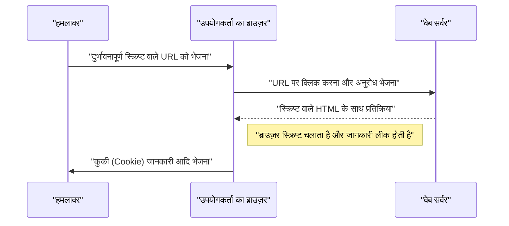
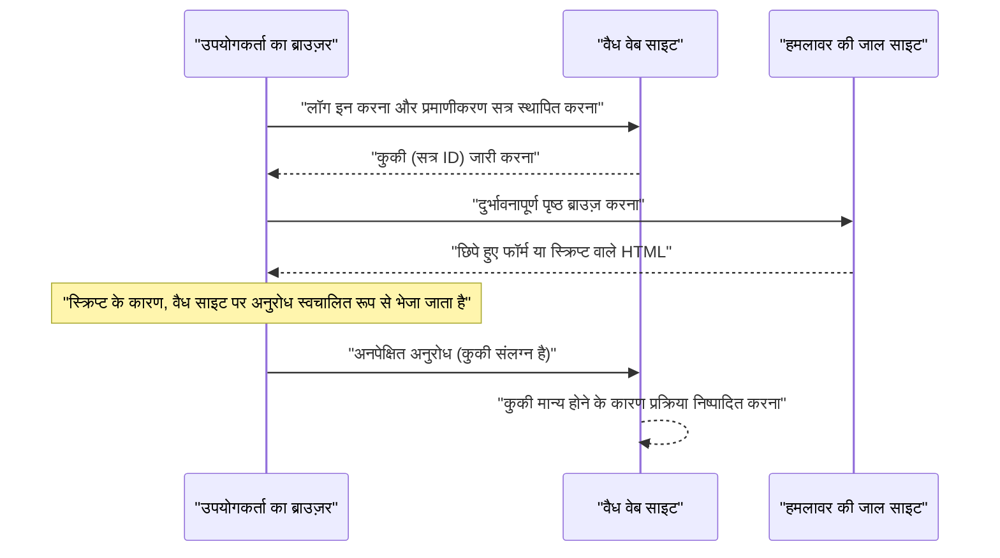

# वेब एप्लिकेशन भेद्यता और काउंटरमेशर्स (OWASP शीर्ष 10 और सुरक्षित कोडिंग)

आधुनिक वेब एप्लिकेशनों में, सुरक्षा उपाय एक अनिवार्य तत्व हैं। हमले के तरीके दिन-ब-दिन परिष्कृत होते जा रहे हैं, और डेवलपर्स को हमेशा नवीनतम खतरों के ज्ञान और उन्हें रोकने के लिए **सुरक्षित कोडिंग** तकनीकों से लैस होने की आवश्यकता है। इस लेख में, हम वेब एप्लिकेशन सुरक्षा के वास्तविक मानक 'OWASP शीर्ष 10' के आधार पर प्रमुख कमजोरियों के तंत्र, हमलों के प्रभाव और विशिष्ट रक्षा विधियों के बारे में विस्तार से बताएंगे।

## OWASP शीर्ष 10 क्या है

OWASP (ओपन वर्ल्डवाइड एप्लिकेशन सिक्योरिटी प्रोजेक्ट) एक अंतरराष्ट्रीय गैर-लाभकारी संगठन है जिसका उद्देश्य सॉफ्टवेयर सुरक्षा में सुधार करना है। OWASP द्वारा नियमित रूप से प्रकाशित 'OWASP शीर्ष 10', वेब एप्लिकेशन में शीर्ष 10 सबसे गंभीर सुरक्षा जोखिमों को सारांशित करने वाली एक रिपोर्ट है, और कई कंपनियों और डेवलपर्स द्वारा इसे सुरक्षा मानक के रूप में अपनाया गया है।

इस लेख में, हम विशेष रूप से 'इंजेक्शन', 'क्रॉस-साइट स्क्रिप्टिंग (XSS)', 'क्रॉस-साइट रिक्वेस्ट फोर्जरी (CSRF)', 'सर्वर-साइड रिक्वेस्ट फोर्जरी (SSRF)', और 'एक्सेस कंट्रोल की कमी' जैसी कमजोरियों पर ध्यान केंद्रित करेंगे, जिनका बड़ा प्रभाव होता है और जो अक्सर होती हैं।

---

## 1. इंजेक्शन (Injection)

इंजेक्शन एक ऐसी भेद्यता है जो तब होती है जब अविश्वसनीय डेटा को कमांड या क्वेरी के हिस्से के रूप में दुभाषिए (इंटरप्रेटर) को भेजा जाता है। हमलावर का दुर्भावनापूर्ण डेटा दुभाषिए द्वारा एक अनपेक्षित कमांड के रूप में निष्पादित किया जा सकता है, या उचित प्राधिकरण के बिना डेटा तक पहुँचा जा सकता है।

### 1.1. SQL इंजेक्शन

SQL इंजेक्शन तब होता है जब डेटाबेस के साथ इंटरैक्ट करने वाले एप्लिकेशन में बाहरी इनपुट मानों को दुर्भावनापूर्ण तरीके से SQL क्वेरी में शामिल किया जाता है। यह हमलावरों को डेटाबेस में संवेदनशील जानकारी पढ़ने, डेटा के साथ छेड़छाड़ करने और यहां तक कि डेटाबेस सर्वर का नियंत्रण लेने की अनुमति देता है।

#### हमले का तंत्र

एक विशिष्ट उदाहरण के रूप में, उपयोगकर्ता नाम और पासवर्ड का उपयोग करके लॉगिन प्रक्रिया पर विचार करें।

**कमजोर कोड उदाहरण (PHP):**

```php
$username = $_POST['username'];
$password = $_POST['password'];

// खतरा: इनपुट मान को सीधे SQL क्वेरी से जोड़ा जा रहा है
$query = "SELECT * FROM users WHERE username = '" . $username . "' AND password = '" . $password . "'";
$result = $mysqli->query($query);
```

मान लीजिए कि इस कोड के लिए, हमलावर `username` फ़ील्ड में निम्नलिखित स्ट्रिंग दर्ज करता है।

`admin' OR '1'='1`

तब, निष्पादित SQL क्वेरी इस प्रकार होगी।

```sql
SELECT * FROM users WHERE username = 'admin' OR '1'='1' AND password = ''
```

चूंकि `'1'='1'` हमेशा सत्य (True) होता है, पासवर्ड जांच को बायपास कर दिया जाता है, और हमलावर `admin` उपयोगकर्ता के रूप में लॉग इन करने में सक्षम होता है।

#### SQL इंजेक्शन के लिए रक्षा विधियाँ

SQL इंजेक्शन को रोकने का सबसे सुरक्षित तरीका **तैयार बयानों (Prepared Statements)** (पैरामीटरयुक्त प्रश्नों) का उपयोग करना है। यह SQL क्वेरी की संरचना को डेटा से अलग करता है और इनपुट मानों को SQL कमांड के रूप में व्याख्यायित होने से रोकता है।

**प्रतिवादित कोड उदाहरण (PHP / PDO):**

```php
$username = $_POST['username'];
$password = $_POST['password'];

// सुरक्षित: तैयार बयानों का उपयोग करना
$stmt = $pdo->prepare("SELECT * FROM users WHERE username = :username AND password = :password");
$stmt->bindParam(':username', $username);
$stmt->bindParam(':password', $password);
$stmt->execute();
$result = $stmt->fetchAll();
```

### 1.2. [NoSQL](https://kenji.blog/hi/p/nosql-database-selection-kvs-document-graph-wide-column/) इंजेक्शन

हाल के वर्षों में लोकप्रिय NoSQL डेटाबेस (जैसे [MongoDB](https://kenji.blog/hi/p/nosql-database-selection-kvs-document-graph-wide-column/)) में भी इंजेक्शन हमले हो सकते हैं। NoSQL में, SQL से भिन्न क्वेरी भाषाओं (जैसे JSON-आधारित) का उपयोग किया जाता है, लेकिन यदि इनपुट मान का सत्यापन अपर्याप्त है, तो क्वेरी संरचना में अनपेक्षित परिवर्तन हो सकते हैं।

**कमजोर कोड उदाहरण (JavaScript / Node.js + MongoDB):**

```javascript
const username = req.body.username;
const password = req.body.password;

// खतरा: इनपुट मान को सीधे ऑब्जेक्ट में शामिल किया जा रहा है
db.collection('users').find({
    username: username,
    password: password
});
```

यदि हमलावर `password` में `{"$gt": ""}` ऑब्जेक्ट भेजता है, तो क्वेरी इस प्रकार होगी।

```json
{
    "username": "admin",
    "password": {"$gt": ""}
}
```

यह इस शर्त में बदल जाता है कि "पासवर्ड खाली स्ट्रिंग से बड़ा है (यानी कोई भी स्ट्रिंग)", और प्रमाणीकरण भंग हो जाता है।

#### [NoSQL](https://kenji.blog/hi/p/nosql-database-selection-kvs-document-graph-wide-column/) इंजेक्शन के लिए रक्षा विधियाँ

NoSQL इंजेक्शन को रोकने के लिए, इनपुट मानों के प्रकार की सख्त जांच करना महत्वपूर्ण है और यह सुनिश्चित करना है कि जहां स्ट्रिंग की उम्मीद है वहां ऑब्जेक्ट पास न हों।

### 1.3. OS कमांड इंजेक्शन

OS कमांड इंजेक्शन एक भेद्यता है जहां बाहरी इनपुट मानों को शेल कमांड के हिस्से के रूप में व्याख्यायित किया जाता है जब कोई एप्लिकेशन शेल के माध्यम से सिस्टम कमांड निष्पादित करता है।

**कमजोर कोड उदाहरण (Python):**

```python
import os

domain = request.args.get('domain')
# खतरा: इनपुट मान को सीधे OS कमांड से जोड़ा जा रहा है
os.system(f"ping -c 4 {domain}")
```

यदि हमलावर `domain` में `example.com; rm -rf /` दर्ज करता है, तो `ping` कमांड के बाद विनाशकारी कमांड निष्पादित की जाएगी।

#### OS कमांड इंजेक्शन के लिए रक्षा विधियाँ

जितना संभव हो सके OS कमांड को कॉल करने से बचें और भाषा में अंतर्निहित API (पुस्तकालयों) का उपयोग करें। यदि OS कमांड को निष्पादित करना अनिवार्य है, तो तर्कों को शेल के बिना सूची प्रारूप में पास करना सुनिश्चित करें।

**प्रतिवादित कोड उदाहरण (Python):**

```python
import subprocess

domain = request.args.get('domain')
# सुरक्षित: शेल के बिना तर्कों को सूची के रूप में पास करना
subprocess.run(["ping", "-c", "4", domain])
```

---

## 2. क्रॉस-साइट स्क्रिप्टिंग (XSS)

क्रॉस-साइट स्क्रिप्टिंग (XSS) एक ऐसा हमला है जहां एक हमलावर वेब पेज में एक दुर्भावनापूर्ण स्क्रिप्ट (आमतौर पर जावास्क्रिप्ट) इंजेक्ट करता है और इसे अन्य उपयोगकर्ताओं के ब्राउज़र पर निष्पादित करता है। यह सत्र टोकन की चोरी, उपयोगकर्ता के विशेषाधिकारों के साथ अनधिकृत संचालन, और फ़िशिंग साइटों पर पुनर्निर्देशन जैसी क्रियाओं को सक्षम करता है।

### हमले की सफलता की संभावना का मॉडल

क्लाइंट-साइड हमलों जैसे XSS में, हमले के सफल होने की संभावना इस बात पर निर्भर करती है कि उपयोगकर्ता किसी जाल (जैसे दुर्भावनापूर्ण लिंक) पर कदम रखता है। गणितीय सूत्र के रूप में इसे मॉडल करने पर यह इस प्रकार होता है।

इस संभावना को $ P(success) $ माना जाए कि हमला कम से कम एक बार सफल होता है, यदि एक ही प्रयास में विफलता की संभावना $ p $ है, और प्रयासों की संख्या (जैसे भेजे गए लिंक की संख्या) $ n $ है, तो इसे इस प्रकार व्यक्त किया जा सकता है।

$ P(success) = 1 - (1 - p)^n $

इस सूत्र से देखा जा सकता है कि यदि कोई भेद्यता मौजूद है और हमले के प्रयासों की संख्या बढ़ती है, तो हमले के सफल होने की संभावना घातांकीय रूप से 1 के करीब पहुंच जाती है। इसलिए, भेद्यता का मौलिक निष्कासन आवश्यक है।

### XSS के प्रकार

XSS को मुख्य रूप से तीन प्रकारों में वर्गीकृत किया गया है।

#### 2.1. रिफ्लेक्टेड XSS (Reflected XSS)

यह तब निष्पादित होता है जब उपयोगकर्ता को दुर्भावनापूर्ण स्क्रिप्ट वाले URL पर क्लिक करने के लिए प्रेरित किया जाता है, और सर्वर की प्रतिक्रिया (जैसे त्रुटि संदेश या खोज परिणाम) में वह स्क्रिप्ट उसी रूप में परिलक्षित (Reflect) होती है।



#### 2.2. संग्रहित XSS (Stored XSS)

दुर्भावनापूर्ण स्क्रिप्ट को डेटाबेस या बुलेटिन बोर्ड में सहेजा (Store) जाता है, और जब अन्य उपयोगकर्ता उस डेटा को देखते हैं तो स्क्रिप्ट निष्पादित होती है। यह एक खतरनाक XSS है जिसका प्रभाव क्षेत्र बड़ा होने की संभावना होती है।

#### 2.3. DOM-आधारित XSS

यह एक भेद्यता है जहां सर्वर को शामिल किए बिना, क्लाइंट-साइड (ब्राउज़र पर) जावास्क्रिप्ट DOM (डॉक्यूमेंट ऑब्जेक्ट मॉडल) में हेरफेर करने की प्रक्रिया में एक अवैध स्क्रिप्ट निष्पादित करती है।

### XSS के लिए रक्षा विधियाँ

XSS को रोकने का मूल सिद्धांत **एस्केपिंग (सफाई / Sanitization)** है। जब वेब पेज पर उपयोगकर्ता से इनपुट मान आउटपुट किया जाता है, तो HTML में विशेष अर्थ रखने वाले वर्णों (जैसे `<`、`>`、`&`、`"`、`'` आदि) को हानिरहित स्ट्रिंग्स में बदल दिया जाता है।

**कमजोर कोड उदाहरण (JavaScript / DOM हेरफेर):**

```html
<div id="greeting"></div>
<script>
    // URL पैरामीटर से नाम प्राप्त करें
    const params = new URLSearchParams(window.location.search);
    const name = params.get('name');
    
    // खतरा: एस्केप किए बिना innerHTML को निर्दिष्ट किया जा रहा है
    document.getElementById('greeting').innerHTML = "नमस्ते, " + name + " जी!";
</script>
```

**प्रतिवादित कोड उदाहरण (JavaScript):**

```html
<div id="greeting"></div>
<script>
    const params = new URLSearchParams(window.location.search);
    const name = params.get('name');
    
    // सुरक्षित: टेक्स्ट के रूप में व्यवहार करने के लिए textContent का उपयोग करना
    document.getElementById('greeting').textContent = "नमस्ते, " + name + " जी!";
</script>
```

बैकएंड (जैसे PHP) में आउटपुट करते समय, इसी तरह उचित एस्केपिंग फ़ंक्शन (जैसे `htmlspecialchars`) का उपयोग करें। इसके अतिरिक्त, Content Security Policy (CSP) को लागू करके, बहु-स्तरीय रक्षा संभव है जो स्क्रिप्ट के इंजेक्ट होने पर भी उसके निष्पादन को रोकती है।

---

## 3. क्रॉस-साइट रिक्वेस्ट फोर्जरी (CSRF)

CSRF एक ऐसा हमला है जहां एक हमलावर उपयोगकर्ता को एक प्रमाणित वेब एप्लिकेशन पर अनपेक्षित अनुरोध भेजने के लिए मजबूर करता है। इससे उपयोगकर्ता के इरादे के बिना पासवर्ड परिवर्तन, उत्पाद की खरीद, रद्दीकरण आदि होता है।

### CSRF हमले का प्रवाह



### CSRF के लिए रक्षा विधियाँ

CSRF को रोकने के लिए, यह जांचने के लिए एक तंत्र की आवश्यकता है कि अनुरोध वास्तव में उपयोगकर्ता के इरादे से है।

#### 3.1. CSRF टोकन

सबसे आम उपाय सर्वर पक्ष पर एक यादृच्छिक टोकन उत्पन्न करना और फॉर्म सबमिट करते समय उस टोकन को शामिल करना है। सर्वर सबमिट किए गए टोकन की पुष्टि करता है, और यदि वे मेल नहीं खाते हैं तो अनुरोध को अस्वीकार कर देता है।

**प्रतिवादित कोड उदाहरण (HTML फॉर्म):**

```html
<form action="/update_profile" method="POST">
    <!-- सर्वर-जनरेटेड CSRF टोकन को एम्बेड करना -->
    <input type="hidden" name="csrf_token" value="abc123xyz456...">
    <input type="text" name="email">
    <button type="submit">अपडेट करें</button>
</form>
```

#### 3.2. SameSite कुकी

एक अधिक आधुनिक उपाय के रूप में, कुकी की `SameSite` विशेषता का उपयोग करने का एक तरीका है। `SameSite=Lax` या `SameSite=Strict` सेट करके, किसी अन्य डोमेन से अनुरोधों के लिए कुकीज़ नहीं भेजी जाएंगी, और CSRF हमलों को मौलिक रूप से रोका जा सकता है।

**प्रतिवादित HTTP हेडर उदाहरण:**

```http
Set-Cookie: session_id=12345; Secure; HttpOnly; SameSite=Lax
```

---

## 4. सर्वर-साइड रिक्वेस्ट फोर्जरी (SSRF)

SSRF एक ऐसा हमला है जहां, यदि वेब एप्लिकेशन में बाहरी URL से डेटा प्राप्त करने की क्षमता है, तो हमलावर सर्वर को किसी निर्दिष्ट मनमाने URL पर अनुरोध भेजने के लिए प्रेरित करता है। यह आमतौर पर बाहरी रूप से अप्राप्य आंतरिक नेटवर्क सिस्टम (जैसे क्लाउड मेटाडेटा API, आंतरिक डेटाबेस आदि) तक पहुंच सक्षम करता है।

### SSRF के खतरे और प्रभाव

क्लाउड परिवेशों (AWS, GCP, Azure आदि) में, इंस्टेंस के भीतर से किसी विशिष्ट IP पते (जैसे `169.254.169.254`) तक पहुंचकर क्रेडेंशियल्स जैसे मेटाडेटा प्राप्त करना संभव हो सकता है। यदि SSRF का उपयोग करके इस API को एक्सेस किया जाता है, तो यह गंभीर सूचना रिसाव की ओर ले जाएगा।

### SSRF के लिए रक्षा विधियाँ

- **श्वेतसूची (Whitelist) द्वारा URL प्रतिबंध**: एक सख्त श्वेतसूची का उपयोग करके उन डोमेन और IP पतों को प्रबंधित करें जिन्हें एप्लिकेशन एक्सेस कर सकता है।
- **आंतरिक IP तक पहुंच पर प्रतिबंध**: निजी IP पते, लूपबैक पते, और लिंक-स्थानीय पते जैसे `127.0.0.1`, `10.0.0.0/8`, और `169.254.169.254` के अनुरोधों को ब्लॉक करें।
- **DNS रिज़ॉल्यूशन सत्यापन**: अनुरोध भेजने से पहले जांच लें कि URL के डोमेन को हल करने का परिणामी IP पता अनुमत सीमा के भीतर है।

---

## 5. एक्सेस कंट्रोल की कमी (Broken Access Control)

एक्सेस नियंत्रण (प्राधिकरण) की कमी एक ऐसी भेद्यता है जो उपयोगकर्ताओं को अपने स्वयं के विशेषाधिकारों से परे संचालन करने की अनुमति देती है। OWASP शीर्ष 10 2021 में, इसे सबसे गंभीर जोखिम (नंबर 1) के रूप में स्थान दिया गया है।

### विशिष्ट परिदृश्य

- **IDOR (Insecure Direct Object References)**: URL पैरामीटर (जैसे `user_id=123`) को फिर से लिखकर, अन्य उपयोगकर्ताओं की व्यक्तिगत जानकारी तक पहुंचा जा सकता है।
- **विशेषाधिकार वृद्धि (Privilege Escalation)**: सामान्य उपयोगकर्ता सीधे व्यवस्थापन स्क्रीन URL (जैसे `/admin/dashboard`) तक पहुंचकर व्यवस्थापक विशेषाधिकारों के साथ संचालन कर सकते हैं।

### एक्सेस कंट्रोल के लिए रक्षा विधियाँ

- **डिफ़ॉल्ट-अस्वीकार**: डिफ़ॉल्ट रूप से सभी एक्सेस को अस्वीकार करें, और केवल स्पष्ट रूप से अनुमत उपयोगकर्ताओं और भूमिकाओं (RBAC/ABAC की शुरुआत) को एक्सेस की अनुमति दें।
- **सर्वर पक्ष पर सख्त अधिकार जांच**: न केवल क्लाइंट पक्ष पर (जैसे ब्राउज़र UI को छिपाना), बल्कि हमेशा बैकएंड प्रक्रिया के निष्पादन से ठीक पहले अधिकारों की जांच करें।
- **अनुमान लगाने में कठिन पहचानकर्ताओं का उपयोग करना**: ऑब्जेक्ट संदर्भ के लिए, अनुक्रमिक ID के बजाय अनुमान लगाने में कठिन UUID जैसे यादृच्छिक पहचानकर्ताओं का उपयोग करें।

---

## 6. सुरक्षित वेब एप्लिकेशन विकास की ओर

वेब एप्लिकेशनों में कमजोरियां अक्सर विकास के चरण के दौरान **सुरक्षा** जागरूकता की कमी या ज्ञान की कमी से उत्पन्न होती हैं। निम्नलिखित प्रथाओं को विकास प्रक्रिया में शामिल करना महत्वपूर्ण है।

1. **डिज़ाइन द्वारा सुरक्षा (Security by Design)**: योजना और डिज़ाइन चरण से ही सुरक्षा आवश्यकताओं को परिभाषित करें और उन्हें वास्तुकला में शामिल करें।
2. **स्थैतिक और गतिशील विश्लेषण उपकरणों का उपयोग**: कमजोरियों का जल्द पता लगाने के लिए SAST (स्थैतिक एप्लिकेशन सुरक्षा परीक्षण) और DAST (गतिशील एप्लिकेशन सुरक्षा परीक्षण) को CI/CD पाइपलाइन में शामिल करें।
3. **निर्भरता प्रबंधन**: तृतीय-पक्ष पुस्तकालयों और रूपरेखाओं के लिए भेद्यता जानकारी (CVE) की लगातार निगरानी करें, और तुरंत अपडेट लागू करें।
4. **निरंतर सीखना**: OWASP जैसे समुदायों से नवीनतम खतरे के रुझान और रक्षा विधियों को सीखना जारी रखें।

### प्रभाव क्षेत्र गणना मॉडल

यदि किसी भेद्यता को अनुपचारित छोड़ दिया जाता है, तो प्रभाव (जोखिम) के क्षेत्र को निम्न सूत्र का उपयोग करके मापा जा सकता है।

$ Risk = Threat \times Vulnerability \times Impact $

- **Threat (खतरा)**: हमलावर के मौजूद होने की संभावना या हमलों की आवृत्ति
- **Vulnerability (भेद्यता)**: सिस्टम की कमजोरी की डिग्री या शोषण में आसानी
- **Impact (प्रभाव)**: सूचना लीक या सिस्टम आउटेज के कारण व्यवसाय को होने वाली क्षति (वित्तीय या प्रतिष्ठा का नुकसान)

यह सूत्र दर्शाता है कि यदि कोई भी कारक शून्य के करीब लाया जा सकता है, तो समग्र जोखिम को काफी कम किया जा सकता है। डेवलपर्स के रूप में, 'भेद्यता (Vulnerability)' को कम करना आपकी सबसे बड़ी जिम्मेदारी है।

---

## निष्कर्ष

इस लेख में, हमने OWASP शीर्ष 10 के आधार पर प्रमुख वेब एप्लिकेशन कमजोरियों (इंजेक्‍शन, XSS, CSRF, SSRF, एक्सेस कंट्रोल की कमी) के तंत्र और विशिष्ट **सुरक्षित कोडिंग** विधियों को समझाया है।

सुरक्षा कोई ऐसी चीज नहीं है जिसे आप एक बार करते हैं और फिर भूल जाते हैं। दैनिक विकास प्रक्रिया में, सुरक्षा को ध्यान में रखकर कोड लिखना जारी रखना और सुरक्षित तथा मजबूत वेब एप्लिकेशन बनाने के लिए निरंतर समीक्षा और परीक्षण करना आवश्यक है।

## 7. विस्तृत रक्षा वास्तुकला और संचालन (Part 1)

एंटरप्राइज़-स्केल वेब एप्लिकेशन में, उपर्युक्त कोडिंग-स्तरीय उपायों के अलावा, बुनियादी ढांचे के स्तर पर बहु-स्तरीय रक्षा अपरिहार्य है।

### 7.1 WAF (Web Application Firewall) का परिचय

वेब एप्लिकेशन फ़ायरवॉल (WAF) एक ऐसी प्रणाली है जो वेब एप्लिकेशन के ट्रैफ़िक की निगरानी और फ़िल्टर करती है, और एप्लिकेशन तक पहुँचने से पहले SQL इंजेक्‍शन और क्रॉस-साइट स्क्रिप्टिंग (XSS) जैसे हमलों को रोकती है। WAF न केवल हस्ताक्षर-आधारित पहचान का उपयोग करता है बल्कि शून्य-दिन (zero-day) हमलों का जवाब देने की अपनी क्षमता में सुधार करने के लिए व्यवहार पहचान (विसंगति पहचान) को भी जोड़ता है।

### 7.2 सुरक्षित CI/CD पाइपलाइन का निर्माण

DevSecOps की अवधारणा के आधार पर, स्वचालित सुरक्षा परीक्षण को निरंतर एकीकरण/निरंतर वितरण (CI/CD) पाइपलाइनों में शामिल करना महत्वपूर्ण है।

* **SAST (Static Application Security Testing):** स्रोत कोड का स्थिर रूप से विश्लेषण करता है और कमजोरियों वाले कोडिंग पैटर्न का पता लगाता है।
* **DAST (Dynamic Application Security Testing):** चल रहे एप्लिकेशन को नकली हमला अनुरोध भेजता है और रनटाइम कमजोरियों का पता लगाता है।
* **SCA (Software Composition Analysis):** उपयोग किए गए ओपन सोर्स लाइब्रेरी या घटकों में ज्ञात कमजोरियों (CVE) का पता लगाता है और अपडेट का संकेत देता है।

### 7.3 नियमित पैठ परीक्षण (Penetration Testing) का निष्पादन

स्वचालित उपकरणों के साथ स्कैन करने के अलावा, सुरक्षा विशेषज्ञों द्वारा नियमित रूप से मैन्युअल पैठ परीक्षण (घुसपैठ परीक्षण) आयोजित करने से व्यावसायिक तर्क संबंधी खामियों और जटिल एक्सेस नियंत्रण कमजोरियों को उजागर किया जा सकता है जिन्हें उपकरणों द्वारा खोजना मुश्किल है।

## 8. विस्तृत रक्षा वास्तुकला और संचालन (Part 2)

एंटरप्राइज़-स्केल वेब एप्लिकेशन में, उपर्युक्त कोडिंग-स्तरीय उपायों के अलावा, बुनियादी ढांचे के स्तर पर बहु-स्तरीय रक्षा अपरिहार्य है।

### 8.1 WAF (Web Application Firewall) का परिचय

वेब एप्लिकेशन फ़ायरवॉल (WAF) एक ऐसी प्रणाली है जो वेब एप्लिकेशन के ट्रैफ़िक की निगरानी और फ़िल्टर करती है, और एप्लिकेशन तक पहुँचने से पहले SQL इंजेक्‍शन और क्रॉस-साइट स्क्रिप्टिंग (XSS) जैसे हमलों को रोकती है। WAF न केवल हस्ताक्षर-आधारित पहचान का उपयोग करता है बल्कि शून्य-दिन (zero-day) हमलों का जवाब देने की अपनी क्षमता में सुधार करने के लिए व्यवहार पहचान (विसंगति पहचान) को भी जोड़ता है।

### 8.2 सुरक्षित CI/CD पाइपलाइन का निर्माण

DevSecOps की अवधारणा के आधार पर, स्वचालित सुरक्षा परीक्षण को निरंतर एकीकरण/निरंतर वितरण (CI/CD) पाइपलाइनों में शामिल करना महत्वपूर्ण है।

* **SAST (Static Application Security Testing):** स्रोत कोड का स्थिर रूप से विश्लेषण करता है और कमजोरियों वाले कोडिंग पैटर्न का पता लगाता है।
* **DAST (Dynamic Application Security Testing):** चल रहे एप्लिकेशन को नकली हमला अनुरोध भेजता है और रनटाइम कमजोरियों का पता लगाता है।
* **SCA (Software Composition Analysis):** उपयोग किए गए ओपन सोर्स लाइब्रेरी या घटकों में ज्ञात कमजोरियों (CVE) का पता लगाता है और अपडेट का संकेत देता है।

### 8.3 नियमित पैठ परीक्षण (Penetration Testing) का निष्पादन

स्वचालित उपकरणों के साथ स्कैन करने के अलावा, सुरक्षा विशेषज्ञों द्वारा नियमित रूप से मैन्युअल पैठ परीक्षण (घुसपैठ परीक्षण) आयोजित करने से व्यावसायिक तर्क संबंधी खामियों और जटिल एक्सेस नियंत्रण कमजोरियों को उजागर किया जा सकता है जिन्हें उपकरणों द्वारा खोजना मुश्किल है।

## 9. विस्तृत रक्षा वास्तुकला और संचालन (Part 3)

एंटरप्राइज़-स्केल वेब एप्लिकेशन में, उपर्युक्त कोडिंग-स्तरीय उपायों के अलावा, बुनियादी ढांचे के स्तर पर बहु-स्तरीय रक्षा अपरिहार्य है।

### 9.1 WAF (Web Application Firewall) का परिचय

वेब एप्लिकेशन फ़ायरवॉल (WAF) एक ऐसी प्रणाली है जो वेब एप्लिकेशन के ट्रैफ़िक की निगरानी और फ़िल्टर करती है, और एप्लिकेशन तक पहुँचने से पहले SQL इंजेक्‍शन और क्रॉस-साइट स्क्रिप्टिंग (XSS) जैसे हमलों को रोकती है। WAF न केवल हस्ताक्षर-आधारित पहचान का उपयोग करता है बल्कि शून्य-दिन (zero-day) हमलों का जवाब देने की अपनी क्षमता में सुधार करने के लिए व्यवहार पहचान (विसंगति पहचान) को भी जोड़ता है।

### 9.2 सुरक्षित CI/CD पाइपलाइन का निर्माण

DevSecOps की अवधारणा के आधार पर, स्वचालित सुरक्षा परीक्षण को निरंतर एकीकरण/निरंतर वितरण (CI/CD) पाइपलाइनों में शामिल करना महत्वपूर्ण है।

* **SAST (Static Application Security Testing):** स्रोत कोड का स्थिर रूप से विश्लेषण करता है और कमजोरियों वाले कोडिंग पैटर्न का पता लगाता है।
* **DAST (Dynamic Application Security Testing):** चल रहे एप्लिकेशन को नकली हमला अनुरोध भेजता है और रनटाइम कमजोरियों का पता लगाता है।
* **SCA (Software Composition Analysis):** उपयोग किए गए ओपन सोर्स लाइब्रेरी या घटकों में ज्ञात कमजोरियों (CVE) का पता लगाता है और अपडेट का संकेत देता है।

### 9.3 नियमित पैठ परीक्षण (Penetration Testing) का निष्पादन

स्वचालित उपकरणों के साथ स्कैन करने के अलावा, सुरक्षा विशेषज्ञों द्वारा नियमित रूप से मैन्युअल पैठ परीक्षण (घुसपैठ परीक्षण) आयोजित करने से व्यावसायिक तर्क संबंधी खामियों और जटिल एक्सेस नियंत्रण कमजोरियों को उजागर किया जा सकता है जिन्हें उपकरणों द्वारा खोजना मुश्किल है।

## 10. विस्तृत रक्षा वास्तुकला और संचालन (Part 4)

एंटरप्राइज़-स्केल वेब एप्लिकेशन में, उपर्युक्त कोडिंग-स्तरीय उपायों के अलावा, बुनियादी ढांचे के स्तर पर बहु-स्तरीय रक्षा अपरिहार्य है।

### 10.1 WAF (Web Application Firewall) का परिचय

वेब एप्लिकेशन फ़ायरवॉल (WAF) एक ऐसी प्रणाली है जो वेब एप्लिकेशन के ट्रैफ़िक की निगरानी और फ़िल्टर करती है, और एप्लिकेशन तक पहुँचने से पहले SQL इंजेक्‍शन और क्रॉस-साइट स्क्रिप्टिंग (XSS) जैसे हमलों को रोकती है। WAF न केवल हस्ताक्षर-आधारित पहचान का उपयोग करता है बल्कि शून्य-दिन (zero-day) हमलों का जवाब देने की अपनी क्षमता में सुधार करने के लिए व्यवहार पहचान (विसंगति पहचान) को भी जोड़ता है।

### 10.2 सुरक्षित CI/CD पाइपलाइन का निर्माण

DevSecOps की अवधारणा के आधार पर, स्वचालित सुरक्षा परीक्षण को निरंतर एकीकरण/निरंतर वितरण (CI/CD) पाइपलाइनों में शामिल करना महत्वपूर्ण है।

* **SAST (Static Application Security Testing):** स्रोत कोड का स्थिर रूप से विश्लेषण करता है और कमजोरियों वाले कोडिंग पैटर्न का पता लगाता है।
* **DAST (Dynamic Application Security Testing):** चल रहे एप्लिकेशन को नकली हमला अनुरोध भेजता है और रनटाइम कमजोरियों का पता लगाता है।
* **SCA (Software Composition Analysis):** उपयोग किए गए ओपन सोर्स लाइब्रेरी या घटकों में ज्ञात कमजोरियों (CVE) का पता लगाता है और अपडेट का संकेत देता है।

### 10.3 नियमित पैठ परीक्षण (Penetration Testing) का निष्पादन

स्वचालित उपकरणों के साथ स्कैन करने के अलावा, सुरक्षा विशेषज्ञों द्वारा नियमित रूप से मैन्युअल पैठ परीक्षण (घुसपैठ परीक्षण) आयोजित करने से व्यावसायिक तर्क संबंधी खामियों और जटिल एक्सेस नियंत्रण कमजोरियों को उजागर किया जा सकता है जिन्हें उपकरणों द्वारा खोजना मुश्किल है।

## 11. विस्तृत रक्षा वास्तुकला और संचालन (Part 5)

एंटरप्राइज़-स्केल वेब एप्लिकेशन में, उपर्युक्त कोडिंग-स्तरीय उपायों के अलावा, बुनियादी ढांचे के स्तर पर बहु-स्तरीय रक्षा अपरिहार्य है।

### 11.1 WAF (Web Application Firewall) का परिचय

वेब एप्लिकेशन फ़ायरवॉल (WAF) एक ऐसी प्रणाली है जो वेब एप्लिकेशन के ट्रैफ़िक की निगरानी और फ़िल्टर करती है, और एप्लिकेशन तक पहुँचने से पहले SQL इंजेक्‍शन और क्रॉस-साइट स्क्रिप्टिंग (XSS) जैसे हमलों को रोकती है। WAF न केवल हस्ताक्षर-आधारित पहचान का उपयोग करता है बल्कि शून्य-दिन (zero-day) हमलों का जवाब देने की अपनी क्षमता में सुधार करने के लिए व्यवहार पहचान (विसंगति पहचान) को भी जोड़ता है।

### 11.2 सुरक्षित CI/CD पाइपलाइन का निर्माण

DevSecOps की अवधारणा के आधार पर, स्वचालित सुरक्षा परीक्षण को निरंतर एकीकरण/निरंतर वितरण (CI/CD) पाइपलाइनों में शामिल करना महत्वपूर्ण है।

* **SAST (Static Application Security Testing):** स्रोत कोड का स्थिर रूप से विश्लेषण करता है और कमजोरियों वाले कोडिंग पैटर्न का पता लगाता है।
* **DAST (Dynamic Application Security Testing):** चल रहे एप्लिकेशन को नकली हमला अनुरोध भेजता है और रनटाइम कमजोरियों का पता लगाता है।
* **SCA (Software Composition Analysis):** उपयोग किए गए ओपन सोर्स लाइब्रेरी या घटकों में ज्ञात कमजोरियों (CVE) का पता लगाता है और अपडेट का संकेत देता है।

### 11.3 नियमित पैठ परीक्षण (Penetration Testing) का निष्पादन

स्वचालित उपकरणों के साथ स्कैन करने के अलावा, सुरक्षा विशेषज्ञों द्वारा नियमित रूप से मैन्युअल पैठ परीक्षण (घुसपैठ परीक्षण) आयोजित करने से व्यावसायिक तर्क संबंधी खामियों और जटिल एक्सेस नियंत्रण कमजोरियों को उजागर किया जा सकता है जिन्हें उपकरणों द्वारा खोजना मुश्किल है।

## 12. विस्तृत रक्षा वास्तुकला और संचालन (Part 6)

एंटरप्राइज़-स्केल वेब एप्लिकेशन में, उपर्युक्त कोडिंग-स्तरीय उपायों के अलावा, बुनियादी ढांचे के स्तर पर बहु-स्तरीय रक्षा अपरिहार्य है।

### 12.1 WAF (Web Application Firewall) का परिचय

वेब एप्लिकेशन फ़ायरवॉल (WAF) एक ऐसी प्रणाली है जो वेब एप्लिकेशन के ट्रैफ़िक की निगरानी और फ़िल्टर करती है, और एप्लिकेशन तक पहुँचने से पहले SQL इंजेक्‍शन और क्रॉस-साइट स्क्रिप्टिंग (XSS) जैसे हमलों को रोकती है। WAF न केवल हस्ताक्षर-आधारित पहचान का उपयोग करता है बल्कि शून्य-दिन (zero-day) हमलों का जवाब देने की अपनी क्षमता में सुधार करने के लिए व्यवहार पहचान (विसंगति पहचान) को भी जोड़ता है।

### 12.2 सुरक्षित CI/CD पाइपलाइन का निर्माण

DevSecOps की अवधारणा के आधार पर, स्वचालित सुरक्षा परीक्षण को निरंतर एकीकरण/निरंतर वितरण (CI/CD) पाइपलाइनों में शामिल करना महत्वपूर्ण है।

* **SAST (Static Application Security Testing):** स्रोत कोड का स्थिर रूप से विश्लेषण करता है और कमजोरियों वाले कोडिंग पैटर्न का पता लगाता है।
* **DAST (Dynamic Application Security Testing):** चल रहे एप्लिकेशन को नकली हमला अनुरोध भेजता है और रनटाइम कमजोरियों का पता लगाता है।
* **SCA (Software Composition Analysis):** उपयोग किए गए ओपन सोर्स लाइब्रेरी या घटकों में ज्ञात कमजोरियों (CVE) का पता लगाता है और अपडेट का संकेत देता है।

### 12.3 नियमित पैठ परीक्षण (Penetration Testing) का निष्पादन

स्वचालित उपकरणों के साथ स्कैन करने के अलावा, सुरक्षा विशेषज्ञों द्वारा नियमित रूप से मैन्युअल पैठ परीक्षण (घुसपैठ परीक्षण) आयोजित करने से व्यावसायिक तर्क संबंधी खामियों और जटिल एक्सेस नियंत्रण कमजोरियों को उजागर किया जा सकता है जिन्हें उपकरणों द्वारा खोजना मुश्किल है।

## 13. विस्तृत रक्षा वास्तुकला और संचालन (Part 7)

एंटरप्राइज़-स्केल वेब एप्लिकेशन में, उपर्युक्त कोडिंग-स्तरीय उपायों के अलावा, बुनियादी ढांचे के स्तर पर बहु-स्तरीय रक्षा अपरिहार्य है।

### 13.1 WAF (Web Application Firewall) का परिचय

वेब एप्लिकेशन फ़ायरवॉल (WAF) एक ऐसी प्रणाली है जो वेब एप्लिकेशन के ट्रैफ़िक की निगरानी और फ़िल्टर करती है, और एप्लिकेशन तक पहुँचने से पहले SQL इंजेक्‍शन और क्रॉस-साइट स्क्रिप्टिंग (XSS) जैसे हमलों को रोकती है। WAF न केवल हस्ताक्षर-आधारित पहचान का उपयोग करता है बल्कि शून्य-दिन (zero-day) हमलों का जवाब देने की अपनी क्षमता में सुधार करने के लिए व्यवहार पहचान (विसंगति पहचान) को भी जोड़ता है।

### 13.2 सुरक्षित CI/CD पाइपलाइन का निर्माण

DevSecOps की अवधारणा के आधार पर, स्वचालित सुरक्षा परीक्षण को निरंतर एकीकरण/निरंतर वितरण (CI/CD) पाइपलाइनों में शामिल करना महत्वपूर्ण है।

* **SAST (Static Application Security Testing):** स्रोत कोड का स्थिर रूप से विश्लेषण करता है और कमजोरियों वाले कोडिंग पैटर्न का पता लगाता है।
* **DAST (Dynamic Application Security Testing):** चल रहे एप्लिकेशन को नकली हमला अनुरोध भेजता है और रनटाइम कमजोरियों का पता लगाता है।
* **SCA (Software Composition Analysis):** उपयोग किए गए ओपन सोर्स लाइब्रेरी या घटकों में ज्ञात कमजोरियों (CVE) का पता लगाता है और अपडेट का संकेत देता है।

### 13.3 नियमित पैठ परीक्षण (Penetration Testing) का निष्पादन

स्वचालित उपकरणों के साथ स्कैन करने के अलावा, सुरक्षा विशेषज्ञों द्वारा नियमित रूप से मैन्युअल पैठ परीक्षण (घुसपैठ परीक्षण) आयोजित करने से व्यावसायिक तर्क संबंधी खामियों और जटिल एक्सेस नियंत्रण कमजोरियों को उजागर किया जा सकता है जिन्हें उपकरणों द्वारा खोजना मुश्किल है।

## 14. विस्तृत रक्षा वास्तुकला और संचालन (Part 8)

एंटरप्राइज़-स्केल वेब एप्लिकेशन में, उपर्युक्त कोडिंग-स्तरीय उपायों के अलावा, बुनियादी ढांचे के स्तर पर बहु-स्तरीय रक्षा अपरिहार्य है।

### 14.1 WAF (Web Application Firewall) का परिचय

वेब एप्लिकेशन फ़ायरवॉल (WAF) एक ऐसी प्रणाली है जो वेब एप्लिकेशन के ट्रैफ़िक की निगरानी और फ़िल्टर करती है, और एप्लिकेशन तक पहुँचने से पहले SQL इंजेक्‍शन और क्रॉस-साइट स्क्रिप्टिंग (XSS) जैसे हमलों को रोकती है। WAF न केवल हस्ताक्षर-आधारित पहचान का उपयोग करता है बल्कि शून्य-दिन (zero-day) हमलों का जवाब देने की अपनी क्षमता में सुधार करने के लिए व्यवहार पहचान (विसंगति पहचान) को भी जोड़ता है।

### 14.2 सुरक्षित CI/CD पाइपलाइन का निर्माण

DevSecOps की अवधारणा के आधार पर, स्वचालित सुरक्षा परीक्षण को निरंतर एकीकरण/निरंतर वितरण (CI/CD) पाइपलाइनों में शामिल करना महत्वपूर्ण है।

* **SAST (Static Application Security Testing):** स्रोत कोड का स्थिर रूप से विश्लेषण करता है और कमजोरियों वाले कोडिंग पैटर्न का पता लगाता है।
* **DAST (Dynamic Application Security Testing):** चल रहे एप्लिकेशन को नकली हमला अनुरोध भेजता है और रनटाइम कमजोरियों का पता लगाता है।
* **SCA (Software Composition Analysis):** उपयोग किए गए ओपन सोर्स लाइब्रेरी या घटकों में ज्ञात कमजोरियों (CVE) का पता लगाता है और अपडेट का संकेत देता है।

### 14.3 नियमित पैठ परीक्षण (Penetration Testing) का निष्पादन

स्वचालित उपकरणों के साथ स्कैन करने के अलावा, सुरक्षा विशेषज्ञों द्वारा नियमित रूप से मैन्युअल पैठ परीक्षण (घुसपैठ परीक्षण) आयोजित करने से व्यावसायिक तर्क संबंधी खामियों और जटिल एक्सेस नियंत्रण कमजोरियों को उजागर किया जा सकता है जिन्हें उपकरणों द्वारा खोजना मुश्किल है।

## 15. विस्तृत रक्षा वास्तुकला और संचालन (Part 9)

एंटरप्राइज़-स्केल वेब एप्लिकेशन में, उपर्युक्त कोडिंग-स्तरीय उपायों के अलावा, बुनियादी ढांचे के स्तर पर बहु-स्तरीय रक्षा अपरिहार्य है।

### 15.1 WAF (Web Application Firewall) का परिचय

वेब एप्लिकेशन फ़ायरवॉल (WAF) एक ऐसी प्रणाली है जो वेब एप्लिकेशन के ट्रैफ़िक की निगरानी और फ़िल्टर करती है, और एप्लिकेशन तक पहुँचने से पहले SQL इंजेक्‍शन और क्रॉस-साइट स्क्रिप्टिंग (XSS) जैसे हमलों को रोकती है। WAF न केवल हस्ताक्षर-आधारित पहचान का उपयोग करता है बल्कि शून्य-दिन (zero-day) हमलों का जवाब देने की अपनी क्षमता में सुधार करने के लिए व्यवहार पहचान (विसंगति पहचान) को भी जोड़ता है।

### 15.2 सुरक्षित CI/CD पाइपलाइन का निर्माण

DevSecOps की अवधारणा के आधार पर, स्वचालित सुरक्षा परीक्षण को निरंतर एकीकरण/निरंतर वितरण (CI/CD) पाइपलाइनों में शामिल करना महत्वपूर्ण है।

* **SAST (Static Application Security Testing):** स्रोत कोड का स्थिर रूप से विश्लेषण करता है और कमजोरियों वाले कोडिंग पैटर्न का पता लगाता है।
* **DAST (Dynamic Application Security Testing):** चल रहे एप्लिकेशन को नकली हमला अनुरोध भेजता है और रनटाइम कमजोरियों का पता लगाता है।
* **SCA (Software Composition Analysis):** उपयोग किए गए ओपन सोर्स लाइब्रेरी या घटकों में ज्ञात कमजोरियों (CVE) का पता लगाता है और अपडेट का संकेत देता है।

### 15.3 नियमित पैठ परीक्षण (Penetration Testing) का निष्पादन

स्वचालित उपकरणों के साथ स्कैन करने के अलावा, सुरक्षा विशेषज्ञों द्वारा नियमित रूप से मैन्युअल पैठ परीक्षण (घुसपैठ परीक्षण) आयोजित करने से व्यावसायिक तर्क संबंधी खामियों और जटिल एक्सेस नियंत्रण कमजोरियों को उजागर किया जा सकता है जिन्हें उपकरणों द्वारा खोजना मुश्किल है।

## 16. विस्तृत रक्षा वास्तुकला और संचालन (Part 10)

एंटरप्राइज़-स्केल वेब एप्लिकेशन में, उपर्युक्त कोडिंग-स्तरीय उपायों के अलावा, बुनियादी ढांचे के स्तर पर बहु-स्तरीय रक्षा अपरिहार्य है।

### 16.1 WAF (Web Application Firewall) का परिचय

वेब एप्लिकेशन फ़ायरवॉल (WAF) एक ऐसी प्रणाली है जो वेब एप्लिकेशन के ट्रैफ़िक की निगरानी और फ़िल्टर करती है, और एप्लिकेशन तक पहुँचने से पहले SQL इंजेक्‍शन और क्रॉस-साइट स्क्रिप्टिंग (XSS) जैसे हमलों को रोकती है। WAF न केवल हस्ताक्षर-आधारित पहचान का उपयोग करता है बल्कि शून्य-दिन (zero-day) हमलों का जवाब देने की अपनी क्षमता में सुधार करने के लिए व्यवहार पहचान (विसंगति पहचान) को भी जोड़ता है।

### 16.2 सुरक्षित CI/CD पाइपलाइन का निर्माण

DevSecOps की अवधारणा के आधार पर, स्वचालित सुरक्षा परीक्षण को निरंतर एकीकरण/निरंतर वितरण (CI/CD) पाइपलाइनों में शामिल करना महत्वपूर्ण है।

* **SAST (Static Application Security Testing):** स्रोत कोड का स्थिर रूप से विश्लेषण करता है और कमजोरियों वाले कोडिंग पैटर्न का पता लगाता है।
* **DAST (Dynamic Application Security Testing):** चल रहे एप्लिकेशन को नकली हमला अनुरोध भेजता है और रनटाइम कमजोरियों का पता लगाता है।
* **SCA (Software Composition Analysis):** उपयोग किए गए ओपन सोर्स लाइब्रेरी या घटकों में ज्ञात कमजोरियों (CVE) का पता लगाता है और अपडेट का संकेत देता है।

### 16.3 नियमित पैठ परीक्षण (Penetration Testing) का निष्पादन

स्वचालित उपकरणों के साथ स्कैन करने के अलावा, सुरक्षा विशेषज्ञों द्वारा नियमित रूप से मैन्युअल पैठ परीक्षण (घुसपैठ परीक्षण) आयोजित करने से व्यावसायिक तर्क संबंधी खामियों और जटिल एक्सेस नियंत्रण कमजोरियों को उजागर किया जा सकता है जिन्हें उपकरणों द्वारा खोजना मुश्किल है।

## 17. विस्तृत रक्षा वास्तुकला और संचालन (Part 11)

एंटरप्राइज़-स्केल वेब एप्लिकेशन में, उपर्युक्त कोडिंग-स्तरीय उपायों के अलावा, बुनियादी ढांचे के स्तर पर बहु-स्तरीय रक्षा अपरिहार्य है।

### 17.1 WAF (Web Application Firewall) का परिचय

वेब एप्लिकेशन फ़ायरवॉल (WAF) एक ऐसी प्रणाली है जो वेब एप्लिकेशन के ट्रैफ़िक की निगरानी और फ़िल्टर करती है, और एप्लिकेशन तक पहुँचने से पहले SQL इंजेक्‍शन और क्रॉस-साइट स्क्रिप्टिंग (XSS) जैसे हमलों को रोकती है। WAF न केवल हस्ताक्षर-आधारित पहचान का उपयोग करता है बल्कि शून्य-दिन (zero-day) हमलों का जवाब देने की अपनी क्षमता में सुधार करने के लिए व्यवहार पहचान (विसंगति पहचान) को भी जोड़ता है।

### 17.2 सुरक्षित CI/CD पाइपलाइन का निर्माण

DevSecOps की अवधारणा के आधार पर, स्वचालित सुरक्षा परीक्षण को निरंतर एकीकरण/निरंतर वितरण (CI/CD) पाइपलाइनों में शामिल करना महत्वपूर्ण है।

* **SAST (Static Application Security Testing):** स्रोत कोड का स्थिर रूप से विश्लेषण करता है और कमजोरियों वाले कोडिंग पैटर्न का पता लगाता है।
* **DAST (Dynamic Application Security Testing):** चल रहे एप्लिकेशन को नकली हमला अनुरोध भेजता है और रनटाइम कमजोरियों का पता लगाता है।
* **SCA (Software Composition Analysis):** उपयोग किए गए ओपन सोर्स लाइब्रेरी या घटकों में ज्ञात कमजोरियों (CVE) का पता लगाता है और अपडेट का संकेत देता है।

### 17.3 नियमित पैठ परीक्षण (Penetration Testing) का निष्पादन

स्वचालित उपकरणों के साथ स्कैन करने के अलावा, सुरक्षा विशेषज्ञों द्वारा नियमित रूप से मैन्युअल पैठ परीक्षण (घुसपैठ परीक्षण) आयोजित करने से व्यावसायिक तर्क संबंधी खामियों और जटिल एक्सेस नियंत्रण कमजोरियों को उजागर किया जा सकता है जिन्हें उपकरणों द्वारा खोजना मुश्किल है।

## 18. विस्तृत रक्षा वास्तुकला और संचालन (Part 12)

एंटरप्राइज़-स्केल वेब एप्लिकेशन में, उपर्युक्त कोडिंग-स्तरीय उपायों के अलावा, बुनियादी ढांचे के स्तर पर बहु-स्तरीय रक्षा अपरिहार्य है।

### 18.1 WAF (Web Application Firewall) का परिचय

वेब एप्लिकेशन फ़ायरवॉल (WAF) एक ऐसी प्रणाली है जो वेब एप्लिकेशन के ट्रैफ़िक की निगरानी और फ़िल्टर करती है, और एप्लिकेशन तक पहुँचने से पहले SQL इंजेक्‍शन और क्रॉस-साइट स्क्रिप्टिंग (XSS) जैसे हमलों को रोकती है। WAF न केवल हस्ताक्षर-आधारित पहचान का उपयोग करता है बल्कि शून्य-दिन (zero-day) हमलों का जवाब देने की अपनी क्षमता में सुधार करने के लिए व्यवहार पहचान (विसंगति पहचान) को भी जोड़ता है।

### 18.2 सुरक्षित CI/CD पाइपलाइन का निर्माण

DevSecOps की अवधारणा के आधार पर, स्वचालित सुरक्षा परीक्षण को निरंतर एकीकरण/निरंतर वितरण (CI/CD) पाइपलाइनों में शामिल करना महत्वपूर्ण है।

* **SAST (Static Application Security Testing):** स्रोत कोड का स्थिर रूप से विश्लेषण करता है और कमजोरियों वाले कोडिंग पैटर्न का पता लगाता है।
* **DAST (Dynamic Application Security Testing):** चल रहे एप्लिकेशन को नकली हमला अनुरोध भेजता है और रनटाइम कमजोरियों का पता लगाता है।
* **SCA (Software Composition Analysis):** उपयोग किए गए ओपन सोर्स लाइब्रेरी या घटकों में ज्ञात कमजोरियों (CVE) का पता लगाता है और अपडेट का संकेत देता है।

### 18.3 नियमित पैठ परीक्षण (Penetration Testing) का निष्पादन

स्वचालित उपकरणों के साथ स्कैन करने के अलावा, सुरक्षा विशेषज्ञों द्वारा नियमित रूप से मैन्युअल पैठ परीक्षण (घुसपैठ परीक्षण) आयोजित करने से व्यावसायिक तर्क संबंधी खामियों और जटिल एक्सेस नियंत्रण कमजोरियों को उजागर किया जा सकता है जिन्हें उपकरणों द्वारा खोजना मुश्किल है।

## 19. विस्तृत रक्षा वास्तुकला और संचालन (Part 13)

एंटरप्राइज़-स्केल वेब एप्लिकेशन में, उपर्युक्त कोडिंग-स्तरीय उपायों के अलावा, बुनियादी ढांचे के स्तर पर बहु-स्तरीय रक्षा अपरिहार्य है।

### 19.1 WAF (Web Application Firewall) का परिचय

वेब एप्लिकेशन फ़ायरवॉल (WAF) एक ऐसी प्रणाली है जो वेब एप्लिकेशन के ट्रैफ़िक की निगरानी और फ़िल्टर करती है, और एप्लिकेशन तक पहुँचने से पहले SQL इंजेक्‍शन और क्रॉस-साइट स्क्रिप्टिंग (XSS) जैसे हमलों को रोकती है। WAF न केवल हस्ताक्षर-आधारित पहचान का उपयोग करता है बल्कि शून्य-दिन (zero-day) हमलों का जवाब देने की अपनी क्षमता में सुधार करने के लिए व्यवहार पहचान (विसंगति पहचान) को भी जोड़ता है।

### 19.2 सुरक्षित CI/CD पाइपलाइन का निर्माण

DevSecOps की अवधारणा के आधार पर, स्वचालित सुरक्षा परीक्षण को निरंतर एकीकरण/निरंतर वितरण (CI/CD) पाइपलाइनों में शामिल करना महत्वपूर्ण है।

* **SAST (Static Application Security Testing):** स्रोत कोड का स्थिर रूप से विश्लेषण करता है और कमजोरियों वाले कोडिंग पैटर्न का पता लगाता है।
* **DAST (Dynamic Application Security Testing):** चल रहे एप्लिकेशन को नकली हमला अनुरोध भेजता है और रनटाइम कमजोरियों का पता लगाता है।
* **SCA (Software Composition Analysis):** उपयोग किए गए ओपन सोर्स लाइब्रेरी या घटकों में ज्ञात कमजोरियों (CVE) का पता लगाता है और अपडेट का संकेत देता है।

### 19.3 नियमित पैठ परीक्षण (Penetration Testing) का निष्पादन

स्वचालित उपकरणों के साथ स्कैन करने के अलावा, सुरक्षा विशेषज्ञों द्वारा नियमित रूप से मैन्युअल पैठ परीक्षण (घुसपैठ परीक्षण) आयोजित करने से व्यावसायिक तर्क संबंधी खामियों और जटिल एक्सेस नियंत्रण कमजोरियों को उजागर किया जा सकता है जिन्हें उपकरणों द्वारा खोजना मुश्किल है।

## 20. विस्तृत रक्षा वास्तुकला और संचालन (Part 14)

एंटरप्राइज़-स्केल वेब एप्लिकेशन में, उपर्युक्त कोडिंग-स्तरीय उपायों के अलावा, बुनियादी ढांचे के स्तर पर बहु-स्तरीय रक्षा अपरिहार्य है।

### 20.1 WAF (Web Application Firewall) का परिचय

वेब एप्लिकेशन फ़ायरवॉल (WAF) एक ऐसी प्रणाली है जो वेब एप्लिकेशन के ट्रैफ़िक की निगरानी और फ़िल्टर करती है, और एप्लिकेशन तक पहुँचने से पहले SQL इंजेक्‍शन और क्रॉस-साइट स्क्रिप्टिंग (XSS) जैसे हमलों को रोकती है। WAF न केवल हस्ताक्षर-आधारित पहचान का उपयोग करता है बल्कि शून्य-दिन (zero-day) हमलों का जवाब देने की अपनी क्षमता में सुधार करने के लिए व्यवहार पहचान (विसंगति पहचान) को भी जोड़ता है।

### 20.2 सुरक्षित CI/CD पाइपलाइन का निर्माण

DevSecOps की अवधारणा के आधार पर, स्वचालित सुरक्षा परीक्षण को निरंतर एकीकरण/निरंतर वितरण (CI/CD) पाइपलाइनों में शामिल करना महत्वपूर्ण है।

* **SAST (Static Application Security Testing):** स्रोत कोड का स्थिर रूप से विश्लेषण करता है और कमजोरियों वाले कोडिंग पैटर्न का पता लगाता है।
* **DAST (Dynamic Application Security Testing):** चल रहे एप्लिकेशन को नकली हमला अनुरोध भेजता है और रनटाइम कमजोरियों का पता लगाता है।
* **SCA (Software Composition Analysis):** उपयोग किए गए ओपन सोर्स लाइब्रेरी या घटकों में ज्ञात कमजोरियों (CVE) का पता लगाता है और अपडेट का संकेत देता है।

### 20.3 नियमित पैठ परीक्षण (Penetration Testing) का निष्पादन

स्वचालित उपकरणों के साथ स्कैन करने के अलावा, सुरक्षा विशेषज्ञों द्वारा नियमित रूप से मैन्युअल पैठ परीक्षण (घुसपैठ परीक्षण) आयोजित करने से व्यावसायिक तर्क संबंधी खामियों और जटिल एक्सेस नियंत्रण कमजोरियों को उजागर किया जा सकता है जिन्हें उपकरणों द्वारा खोजना मुश्किल है।
