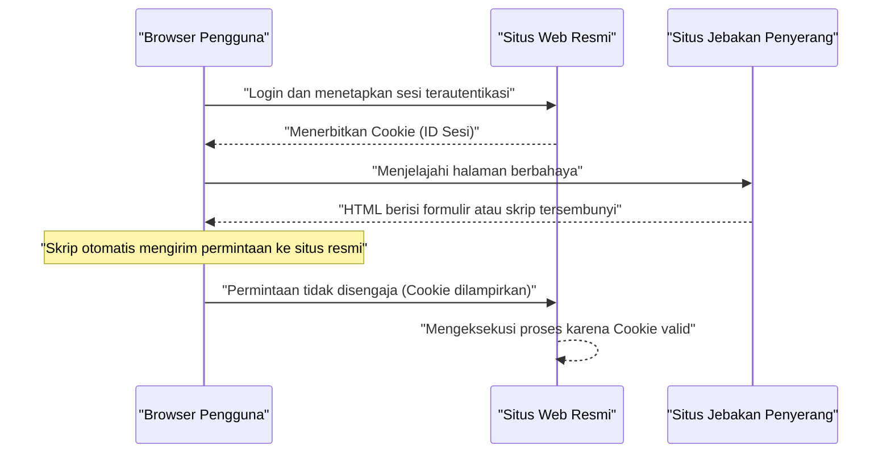

# Kerentanan Aplikasi Web dan Penanganannya (OWASP Top 10 dan Secure Coding)

Dalam aplikasi web modern, langkah-langkah keamanan adalah elemen yang sangat penting. Metode serangan semakin canggih setiap harinya, sehingga pengembang harus selalu membekali diri dengan pengetahuan tentang ancaman terbaru dan teknik **secure coding** untuk mencegahnya. Dalam artikel ini, kami akan menjelaskan secara sangat rinci tentang mekanisme kerentanan utama, dampak serangan, dan metode pertahanan spesifik berdasarkan standar de facto keamanan aplikasi web, yaitu "OWASP Top 10".

## Apa itu OWASP Top 10

OWASP (Open Worldwide Application Security Project) adalah organisasi nirlaba internasional yang bertujuan untuk meningkatkan keamanan perangkat lunak. "OWASP Top 10" yang dirilis secara berkala oleh OWASP adalah laporan yang merangkum 10 risiko keamanan paling kritis dalam aplikasi web, dan diadopsi oleh banyak perusahaan serta pengembang sebagai standar keamanan.

Artikel ini akan secara khusus berfokus dan menggali lebih dalam kerentanan yang memiliki dampak besar dan sering terjadi, seperti "Injeksi", "Cross-Site Scripting (XSS)", "Cross-Site Request Forgery (CSRF)", "Server-Side Request Forgery (SSRF)", dan "Kegagalan Kontrol Akses".

---

## 1. Injeksi (Injection)

Injeksi adalah kerentanan yang terjadi ketika data yang tidak tepercaya dikirim ke interpreter sebagai bagian dari perintah atau kueri. Data berbahaya dari penyerang dieksekusi oleh interpreter sebagai perintah yang tidak diinginkan, atau data diakses tanpa otorisasi yang tepat.

### 1.1. Injeksi SQL

Injeksi SQL terjadi dalam aplikasi yang berinteraksi dengan database, ketika input eksternal secara tidak sah dimasukkan ke dalam kueri SQL. Hal ini memungkinkan penyerang untuk membaca informasi sensitif di database, memanipulasi data, dan bahkan mengambil alih kontrol server database.

#### Mekanisme Serangan

Sebagai contoh umum, mari pertimbangkan proses login menggunakan nama pengguna dan kata sandi.

**Contoh kode yang rentan (PHP):**

```php
$username = $_POST['username'];
$password = $_POST['password'];

// Bahaya: Input langsung digabungkan ke dalam kueri SQL
$query = "SELECT * FROM users WHERE username = '" . $username . "' AND password = '" . $password . "'";
$result = $mysqli->query($query);
```

Terhadap kode ini, anggaplah penyerang memasukkan string berikut di kolom `username`.

`admin' OR '1'='1`

Maka, kueri SQL yang dieksekusi akan menjadi seperti ini:

```sql
SELECT * FROM users WHERE username = 'admin' OR '1'='1' AND password = ''
```

Karena `'1'='1'` selalu bernilai benar (True), pemeriksaan kata sandi dilewati, dan penyerang dapat login sebagai pengguna `admin`.

#### Metode Pertahanan Injeksi SQL

Cara paling andal untuk mencegah injeksi SQL adalah menggunakan **prepared statements** (kueri berparameter). Hal ini memisahkan struktur kueri SQL dari data, mencegah input ditafsirkan sebagai perintah SQL.

**Contoh kode yang telah diperbaiki (PHP / PDO):**

```php
$username = $_POST['username'];
$password = $_POST['password'];

// Aman: Menggunakan prepared statements
$stmt = $pdo->prepare("SELECT * FROM users WHERE username = :username AND password = :password");
$stmt->bindParam(':username', $username);
$stmt->bindParam(':password', $password);
$stmt->execute();
$result = $stmt->fetchAll();
```

### 1.2. Injeksi NoSQL

Serangan injeksi juga terjadi pada database NoSQL (seperti MongoDB) yang populer belakangan ini. Meskipun NoSQL menggunakan bahasa kueri yang berbeda dari SQL (seperti berbasis JSON), validasi input yang tidak memadai dapat menyebabkan modifikasi struktur kueri yang tidak diinginkan.

**Contoh kode yang rentan (JavaScript / Node.js + MongoDB):**

```javascript
const username = req.body.username;
const password = req.body.password;

// Bahaya: Input langsung dimasukkan ke dalam objek
db.collection('users').find({
    username: username,
    password: password
});
```

Jika penyerang mengirimkan objek `{"$gt": ""}` pada `password`, kuerinya akan menjadi seperti berikut:

```json
{
    "username": "admin",
    "password": {"$gt": ""}
}
```

Ini menjadi kondisi "kata sandi lebih besar dari string kosong (artinya string apa pun)", sehingga otentikasi dapat ditembus.

#### Metode Pertahanan Injeksi NoSQL

Untuk mencegah injeksi NoSQL, sangat penting untuk melakukan pengecekan tipe input secara ketat dan memvalidasi agar objek tidak diteruskan ke tempat yang mengharapkan string.

### 1.3. Injeksi Perintah OS

Injeksi perintah OS adalah kerentanan di mana input eksternal ditafsirkan sebagai bagian dari perintah shell saat aplikasi menjalankan perintah sistem melalui shell.

**Contoh kode yang rentan (Python):**

```python
import os

domain = request.args.get('domain')
# Bahaya: Input langsung digabungkan ke perintah OS
os.system(f"ping -c 4 {domain}")
```

Jika penyerang memasukkan `example.com; rm -rf /` pada `domain`, perintah destruktif akan dieksekusi setelah perintah `ping`.

#### Metode Pertahanan Injeksi Perintah OS

Sebisa mungkin hindari pemanggilan perintah OS dan gunakan API (pustaka) bawaan bahasa pemrograman. Jika terpaksa harus menjalankan perintah OS, berikan argumen dalam format list tanpa melalui shell.

**Contoh kode yang telah diperbaiki (Python):**

```python
import subprocess

domain = request.args.get('domain')
# Aman: Melewatkan argumen sebagai list tanpa melalui shell
subprocess.run(["ping", "-c", "4", domain])
```

---

## 2. Cross-Site Scripting (XSS)

Cross-Site Scripting (XSS) adalah serangan di mana penyerang menyuntikkan skrip berbahaya (biasanya JavaScript) ke dalam halaman web untuk dieksekusi di browser pengguna lain. Hal ini dapat mengakibatkan pencurian token sesi, manipulasi tidak sah dengan hak akses pengguna, pengalihan ke situs phishing, dll.

### Model Probabilitas Keberhasilan Serangan

Dalam serangan sisi klien seperti XSS, probabilitas keberhasilan serangan bergantung pada probabilitas pengguna terkena jebakan (seperti mengklik tautan berbahaya). Jika dimodelkan secara matematis, maka akan seperti berikut.

Probabilitas serangan berhasil setidaknya sekali $ P(success) $ dapat dinyatakan sebagai berikut, dengan asumsi probabilitas kegagalan dalam satu percobaan adalah $ p $ dan jumlah percobaan (seperti jumlah tautan yang dikirim) adalah $ n $.

$ P(success) = 1 - (1 - p)^n $

Dari rumus ini, dapat dipahami bahwa jika kerentanan ada, semakin sering serangan dicoba, probabilitas serangan berhasil akan mendekati 1 secara eksponensial. Oleh karena itu, menghilangkan kerentanan pada akarnya sangatlah penting.

### Jenis-jenis XSS

XSS pada dasarnya dibagi menjadi tiga jenis berikut.

#### 2.1. Reflected XSS (XSS Terpantul)

Terjadi ketika pengguna disuruh mengklik URL yang mengandung skrip berbahaya, dan skrip tersebut terpantul (Reflect) dan dieksekusi sebagaimana adanya dalam respons dari server (seperti pesan error atau hasil pencarian).

```mermaid
sequenceDiagram
    participant "Penyerang"
    participant "Browser Pengguna"
    participant "Server Web"

    "Penyerang"->>"Browser Pengguna": "Mengirim URL berisi skrip berbahaya"
    "Browser Pengguna"->>"Server Web": "Mengklik URL dan mengirim permintaan"
    "Server Web"-->>"Browser Pengguna": "Merespons dengan HTML yang berisi skrip"
    Note right of "Browser Pengguna": "Browser mengeksekusi skrip dan informasi bocor"
    "Browser Pengguna"->>"Penyerang": "Mengirim informasi Cookie, dll."
```



#### 2.2. Stored XSS (XSS Tersimpan)

Skrip berbahaya disimpan (Store) di database atau papan buletin, dan dieksekusi saat pengguna lain melihat data tersebut. Ini adalah XSS berbahaya yang cenderung memiliki cakupan korban yang luas.

#### 2.3. DOM-based XSS

Kerentanan di mana JavaScript di sisi klien (browser) mengeksekusi skrip berbahaya tanpa melalui server, selama proses manipulasi DOM (Document Object Model).

### Metode Pertahanan XSS

Prinsip dasar untuk mencegah XSS adalah **escaping (sanitasi)**. Saat menampilkan input pengguna di halaman web, karakter yang memiliki arti khusus dalam HTML (`<`, `>`, `&`, `"`, `'`, dll.) diubah menjadi string yang tidak berbahaya.

**Contoh kode yang rentan (JavaScript / Manipulasi DOM):**

```html
<div id="greeting"></div>
<script>
    // Mendapatkan nama dari parameter URL
    const params = new URLSearchParams(window.location.search);
    const name = params.get('name');
    
    // Bahaya: Menetapkan ke innerHTML tanpa meng-escape input
    document.getElementById('greeting').innerHTML = "Halo, " + name + "!";
</script>
```

**Contoh kode yang telah diperbaiki (JavaScript):**

```html
<div id="greeting"></div>
<script>
    const params = new URLSearchParams(window.location.search);
    const name = params.get('name');
    
    // Aman: Menggunakan textContent untuk memperlakukannya sebagai teks
    document.getElementById('greeting').textContent = "Halo, " + name + "!";
</script>
```

Saat melakukan output di backend (seperti PHP), cara yang sama digunakan dengan memanfaatkan fungsi escape yang tepat (seperti `htmlspecialchars`). Selain itu, dengan menerapkan Content Security Policy (CSP), Anda dapat memiliki pertahanan berlapis untuk mencegah eksekusi skrip meskipun disuntikkan.

---

## 3. Cross-Site Request Forgery (CSRF)

CSRF adalah serangan yang memaksa pengguna untuk mengirim permintaan yang tidak disengaja oleh penyerang ke aplikasi web tempat pengguna telah terautentikasi. Ini dapat mengakibatkan perubahan kata sandi, pembelian produk, atau penghapusan akun tanpa disengaja oleh pengguna.

### Alur Serangan CSRF



### Metode Pertahanan CSRF

Untuk mencegah CSRF, diperlukan mekanisme untuk memastikan bahwa permintaan benar-benar berasal dari niat pengguna.

#### 3.1. Token CSRF

Tindakan balasan yang paling umum adalah dengan menghasilkan token acak di sisi server, dan menyertakan token tersebut saat mengirimkan formulir. Server akan memvalidasi token yang dikirim, dan menolak permintaan jika tidak cocok.

**Contoh kode yang telah diperbaiki (Formulir HTML):**

```html
<form action="/update_profile" method="POST">
    <!-- Menyematkan token CSRF yang dihasilkan oleh server -->
    <input type="hidden" name="csrf_token" value="abc123xyz456...">
    <input type="text" name="email">
    <button type="submit">Perbarui</button>
</form>
```

#### 3.2. SameSite Cookie

Sebagai perlindungan yang lebih modern, ada cara untuk memanfaatkan atribut `SameSite` pada Cookie. Dengan menetapkan `SameSite=Lax` atau `SameSite=Strict`, Cookie tidak akan dikirim untuk permintaan dari domain berbeda, sehingga secara mendasar mencegah serangan CSRF.

**Contoh HTTP Header yang telah diperbaiki:**

```http
Set-Cookie: session_id=12345; Secure; HttpOnly; SameSite=Lax
```

---

## 4. Server-Side Request Forgery (SSRF)

SSRF adalah serangan di mana, jika aplikasi web memiliki fitur untuk mengambil data dari URL eksternal, penyerang memaksa server untuk mengirim permintaan ke URL yang ditentukan oleh penyerang. Hal ini memungkinkan akses ke sistem jaringan internal yang biasanya tidak dapat diakses dari luar (seperti API metadata cloud, database internal perusahaan, dll.).

### Ancaman dan Dampak SSRF

Di lingkungan cloud (AWS, GCP, Azure, dll.), mengakses alamat IP tertentu (misalnya `169.254.169.254`) dari dalam instance terkadang memungkinkan pengambilan metadata seperti kredensial. Jika SSRF digunakan untuk mengakses API ini, hal itu dapat menyebabkan kebocoran informasi yang fatal.

### Metode Pertahanan SSRF

- **Pembatasan URL dengan Whitelist**: Mengelola daftar putih ketat (whitelist) untuk domain dan alamat IP yang dapat diakses oleh aplikasi.
- **Melarang Akses ke IP Internal**: Memblokir permintaan ke alamat IP privat seperti `127.0.0.1` atau `10.0.0.0/8`, alamat loopback, dan alamat link-local seperti `169.254.169.254`.
- **Validasi Resolusi DNS**: Memastikan bahwa alamat IP yang dihasilkan dari resolusi domain URL berada dalam rentang yang diizinkan sebelum mengirim permintaan.

---

## 5. Kegagalan Kontrol Akses (Broken Access Control)

Kegagalan kontrol akses (otorisasi) adalah kerentanan di mana pengguna dapat melakukan operasi di luar hak akses mereka. Ini ditempatkan sebagai risiko paling kritis (peringkat 1) dalam OWASP Top 10 2021.

### Skenario Spesifik

- **IDOR (Insecure Direct Object References)**: Dengan mengubah parameter URL (misalnya `user_id=123`), seseorang dapat mengakses informasi pribadi pengguna lain.
- **Peningkatan Hak Istimewa (Privilege Escalation)**: Pengguna biasa dapat melakukan operasi dengan hak administrator dengan langsung mengakses URL panel admin (misalnya `/admin/dashboard`).

### Metode Pertahanan Kontrol Akses

- **Default Deny**: Menolak semua akses secara default, dan hanya mengizinkan akses kepada pengguna atau peran yang diizinkan secara eksplisit (implementasi RBAC/ABAC).
- **Pemeriksaan Hak Akses yang Ketat di Sisi Server**: Tidak hanya di sisi klien (menyembunyikan UI di browser, dll.), tetapi selalu memverifikasi hak akses tepat sebelum mengeksekusi proses di backend.
- **Menggunakan Pengidentifikasi yang Sulit Ditebak**: Daripada ID yang berurutan, gunakan pengidentifikasi acak seperti UUID yang sulit ditebak untuk referensi objek.

---

## 6. Menuju Pengembangan Aplikasi Web yang Aman

Sebagian besar kerentanan aplikasi web muncul akibat kurangnya kesadaran **keamanan** (security) atau kurangnya pengetahuan pada tahap pengembangan. Sangat penting untuk memasukkan praktik-praktik berikut ke dalam proses pengembangan.

1. **Security by Design**: Mendefinisikan persyaratan keamanan sejak tahap perencanaan dan desain, lalu memasukkannya ke dalam arsitektur.
2. **Pemanfaatan Alat Analisis Statis/Dinamis**: Mengintegrasikan SAST (Static Application Security Testing) dan DAST (Dynamic Application Security Testing) ke dalam alur (pipeline) CI/CD untuk menemukan kerentanan sejak dini.
3. **Manajemen Ketergantungan (Dependencies)**: Selalu memantau informasi kerentanan (CVE) dari pustaka dan kerangka kerja pihak ketiga, serta menerapkan pembaruan dengan cepat.
4. **Pembelajaran Berkelanjutan**: Terus mempelajari tren ancaman dan metode pertahanan terbaru dari komunitas seperti OWASP.

### Model Perhitungan Dampak

Risiko dampak jika kerentanan dibiarkan dapat diukur dengan rumus berikut.

$ Risk = Threat \times Vulnerability \times Impact $

- **Threat (Ancaman)**: Kemungkinan adanya penyerang dan frekuensi serangan
- **Vulnerability (Kerentanan)**: Tingkat kelemahan sistem dan seberapa mudah untuk disalahgunakan
- **Impact (Dampak)**: Kerugian bisnis (finansial dan reputasi) akibat kebocoran informasi atau penghentian sistem

Rumus ini menunjukkan bahwa jika salah satu dari faktor tersebut dapat ditekan mendekati nol, risiko keseluruhan akan berkurang secara signifikan. Sebagai pengembang, meminimalkan "Kerentanan (Vulnerability)" adalah tanggung jawab terbesar.

---

## Kesimpulan

Dalam artikel ini, kami telah menjelaskan mekanisme dan metode **secure coding** yang spesifik untuk kerentanan aplikasi web utama berdasarkan OWASP Top 10 (Injeksi, XSS, CSRF, SSRF, Kegagalan Kontrol Akses).

Keamanan bukanlah sesuatu yang selesai hanya dengan melakukan tindakan sekali saja. Dalam proses pengembangan sehari-hari, Anda dituntut untuk terus membangun aplikasi web yang aman dan tangguh dengan selalu menulis kode yang memperhatikan keamanan, serta melakukan peninjauan dan pengujian yang berkelanjutan.

## 7. Arsitektur Pertahanan Terperinci dan Operasi (Part 1)

Dalam aplikasi web berskala perusahaan (enterprise), selain tindakan pencegahan tingkat kode seperti yang disebutkan sebelumnya, pertahanan berlapis di tingkat infrastruktur juga sangat diperlukan.

### 7.1 Pengenalan WAF (Web Application Firewall)

Web Application Firewall (WAF) adalah sistem yang memantau dan memfilter lalu lintas ke aplikasi web, serta memblokir serangan seperti Injeksi SQL dan Cross-Site Scripting (XSS) sebelum mencapai aplikasi. Dengan menggabungkan deteksi berbasis tanda tangan (signature-based) dan deteksi perilaku (anomaly detection), WAF juga meningkatkan kemampuannya dalam menangani serangan zero-day.

### 7.2 Membangun Pipeline CI/CD yang Aman

Berdasarkan konsep DevSecOps, sangat penting untuk mengotomatisasi dan mengintegrasikan pengujian keamanan ke dalam alur CI/CD (Continuous Integration/Continuous Delivery).

* **SAST (Static Application Security Testing):** Menganalisis kode sumber secara statis untuk mendeteksi pola pengkodean yang mengandung kerentanan.
* **DAST (Dynamic Application Security Testing):** Mengirim permintaan serangan pseudo ke aplikasi yang sedang berjalan untuk mendeteksi kerentanan saat eksekusi (runtime).
* **SCA (Software Composition Analysis):** Mendeteksi kerentanan yang diketahui (CVE) yang terkandung dalam pustaka open source atau komponen yang digunakan, serta mendorong pembaruan.

### 7.3 Pelaksanaan Pengujian Penetrasi Secara Berkala

Selain pemindaian menggunakan alat otomatis, melakukan pengujian penetrasi (penetration test) manual secara berkala oleh ahli keamanan dapat mengungkap kecacatan logika bisnis atau kerentanan kontrol akses kompleks yang sulit ditemukan oleh alat.

## 8. Arsitektur Pertahanan Terperinci dan Operasi (Part 2)

Dalam aplikasi web berskala perusahaan (enterprise), selain tindakan pencegahan tingkat kode seperti yang disebutkan sebelumnya, pertahanan berlapis di tingkat infrastruktur juga sangat diperlukan.

### 8.1 Pengenalan WAF (Web Application Firewall)

Web Application Firewall (WAF) adalah sistem yang memantau dan memfilter lalu lintas ke aplikasi web, serta memblokir serangan seperti Injeksi SQL dan Cross-Site Scripting (XSS) sebelum mencapai aplikasi. Dengan menggabungkan deteksi berbasis tanda tangan (signature-based) dan deteksi perilaku (anomaly detection), WAF juga meningkatkan kemampuannya dalam menangani serangan zero-day.

### 8.2 Membangun Pipeline CI/CD yang Aman

Berdasarkan konsep DevSecOps, sangat penting untuk mengotomatisasi dan mengintegrasikan pengujian keamanan ke dalam alur CI/CD (Continuous Integration/Continuous Delivery).

* **SAST (Static Application Security Testing):** Menganalisis kode sumber secara statis untuk mendeteksi pola pengkodean yang mengandung kerentanan.
* **DAST (Dynamic Application Security Testing):** Mengirim permintaan serangan pseudo ke aplikasi yang sedang berjalan untuk mendeteksi kerentanan saat eksekusi (runtime).
* **SCA (Software Composition Analysis):** Mendeteksi kerentanan yang diketahui (CVE) yang terkandung dalam pustaka open source atau komponen yang digunakan, serta mendorong pembaruan.

### 8.3 Pelaksanaan Pengujian Penetrasi Secara Berkala

Selain pemindaian menggunakan alat otomatis, melakukan pengujian penetrasi (penetration test) manual secara berkala oleh ahli keamanan dapat mengungkap kecacatan logika bisnis atau kerentanan kontrol akses kompleks yang sulit ditemukan oleh alat.

## 9. Arsitektur Pertahanan Terperinci dan Operasi (Part 3)

Dalam aplikasi web berskala perusahaan (enterprise), selain tindakan pencegahan tingkat kode seperti yang disebutkan sebelumnya, pertahanan berlapis di tingkat infrastruktur juga sangat diperlukan.

### 9.1 Pengenalan WAF (Web Application Firewall)

Web Application Firewall (WAF) adalah sistem yang memantau dan memfilter lalu lintas ke aplikasi web, serta memblokir serangan seperti Injeksi SQL dan Cross-Site Scripting (XSS) sebelum mencapai aplikasi. Dengan menggabungkan deteksi berbasis tanda tangan (signature-based) dan deteksi perilaku (anomaly detection), WAF juga meningkatkan kemampuannya dalam menangani serangan zero-day.

### 9.2 Membangun Pipeline CI/CD yang Aman

Berdasarkan konsep DevSecOps, sangat penting untuk mengotomatisasi dan mengintegrasikan pengujian keamanan ke dalam alur CI/CD (Continuous Integration/Continuous Delivery).

* **SAST (Static Application Security Testing):** Menganalisis kode sumber secara statis untuk mendeteksi pola pengkodean yang mengandung kerentanan.
* **DAST (Dynamic Application Security Testing):** Mengirim permintaan serangan pseudo ke aplikasi yang sedang berjalan untuk mendeteksi kerentanan saat eksekusi (runtime).
* **SCA (Software Composition Analysis):** Mendeteksi kerentanan yang diketahui (CVE) yang terkandung dalam pustaka open source atau komponen yang digunakan, serta mendorong pembaruan.

### 9.3 Pelaksanaan Pengujian Penetrasi Secara Berkala

Selain pemindaian menggunakan alat otomatis, melakukan pengujian penetrasi (penetration test) manual secara berkala oleh ahli keamanan dapat mengungkap kecacatan logika bisnis atau kerentanan kontrol akses kompleks yang sulit ditemukan oleh alat.

## 10. Arsitektur Pertahanan Terperinci dan Operasi (Part 4)

Dalam aplikasi web berskala perusahaan (enterprise), selain tindakan pencegahan tingkat kode seperti yang disebutkan sebelumnya, pertahanan berlapis di tingkat infrastruktur juga sangat diperlukan.

### 10.1 Pengenalan WAF (Web Application Firewall)

Web Application Firewall (WAF) adalah sistem yang memantau dan memfilter lalu lintas ke aplikasi web, serta memblokir serangan seperti Injeksi SQL dan Cross-Site Scripting (XSS) sebelum mencapai aplikasi. Dengan menggabungkan deteksi berbasis tanda tangan (signature-based) dan deteksi perilaku (anomaly detection), WAF juga meningkatkan kemampuannya dalam menangani serangan zero-day.

### 10.2 Membangun Pipeline CI/CD yang Aman

Berdasarkan konsep DevSecOps, sangat penting untuk mengotomatisasi dan mengintegrasikan pengujian keamanan ke dalam alur CI/CD (Continuous Integration/Continuous Delivery).

* **SAST (Static Application Security Testing):** Menganalisis kode sumber secara statis untuk mendeteksi pola pengkodean yang mengandung kerentanan.
* **DAST (Dynamic Application Security Testing):** Mengirim permintaan serangan pseudo ke aplikasi yang sedang berjalan untuk mendeteksi kerentanan saat eksekusi (runtime).
* **SCA (Software Composition Analysis):** Mendeteksi kerentanan yang diketahui (CVE) yang terkandung dalam pustaka open source atau komponen yang digunakan, serta mendorong pembaruan.

### 10.3 Pelaksanaan Pengujian Penetrasi Secara Berkala

Selain pemindaian menggunakan alat otomatis, melakukan pengujian penetrasi (penetration test) manual secara berkala oleh ahli keamanan dapat mengungkap kecacatan logika bisnis atau kerentanan kontrol akses kompleks yang sulit ditemukan oleh alat.

## 11. Arsitektur Pertahanan Terperinci dan Operasi (Part 5)

Dalam aplikasi web berskala perusahaan (enterprise), selain tindakan pencegahan tingkat kode seperti yang disebutkan sebelumnya, pertahanan berlapis di tingkat infrastruktur juga sangat diperlukan.

### 11.1 Pengenalan WAF (Web Application Firewall)

Web Application Firewall (WAF) adalah sistem yang memantau dan memfilter lalu lintas ke aplikasi web, serta memblokir serangan seperti Injeksi SQL dan Cross-Site Scripting (XSS) sebelum mencapai aplikasi. Dengan menggabungkan deteksi berbasis tanda tangan (signature-based) dan deteksi perilaku (anomaly detection), WAF juga meningkatkan kemampuannya dalam menangani serangan zero-day.

### 11.2 Membangun Pipeline CI/CD yang Aman

Berdasarkan konsep DevSecOps, sangat penting untuk mengotomatisasi dan mengintegrasikan pengujian keamanan ke dalam alur CI/CD (Continuous Integration/Continuous Delivery).

* **SAST (Static Application Security Testing):** Menganalisis kode sumber secara statis untuk mendeteksi pola pengkodean yang mengandung kerentanan.
* **DAST (Dynamic Application Security Testing):** Mengirim permintaan serangan pseudo ke aplikasi yang sedang berjalan untuk mendeteksi kerentanan saat eksekusi (runtime).
* **SCA (Software Composition Analysis):** Mendeteksi kerentanan yang diketahui (CVE) yang terkandung dalam pustaka open source atau komponen yang digunakan, serta mendorong pembaruan.

### 11.3 Pelaksanaan Pengujian Penetrasi Secara Berkala

Selain pemindaian menggunakan alat otomatis, melakukan pengujian penetrasi (penetration test) manual secara berkala oleh ahli keamanan dapat mengungkap kecacatan logika bisnis atau kerentanan kontrol akses kompleks yang sulit ditemukan oleh alat.

## 12. Arsitektur Pertahanan Terperinci dan Operasi (Part 6)

Dalam aplikasi web berskala perusahaan (enterprise), selain tindakan pencegahan tingkat kode seperti yang disebutkan sebelumnya, pertahanan berlapis di tingkat infrastruktur juga sangat diperlukan.

### 12.1 Pengenalan WAF (Web Application Firewall)

Web Application Firewall (WAF) adalah sistem yang memantau dan memfilter lalu lintas ke aplikasi web, serta memblokir serangan seperti Injeksi SQL dan Cross-Site Scripting (XSS) sebelum mencapai aplikasi. Dengan menggabungkan deteksi berbasis tanda tangan (signature-based) dan deteksi perilaku (anomaly detection), WAF juga meningkatkan kemampuannya dalam menangani serangan zero-day.

### 12.2 Membangun Pipeline CI/CD yang Aman

Berdasarkan konsep DevSecOps, sangat penting untuk mengotomatisasi dan mengintegrasikan pengujian keamanan ke dalam alur CI/CD (Continuous Integration/Continuous Delivery).

* **SAST (Static Application Security Testing):** Menganalisis kode sumber secara statis untuk mendeteksi pola pengkodean yang mengandung kerentanan.
* **DAST (Dynamic Application Security Testing):** Mengirim permintaan serangan pseudo ke aplikasi yang sedang berjalan untuk mendeteksi kerentanan saat eksekusi (runtime).
* **SCA (Software Composition Analysis):** Mendeteksi kerentanan yang diketahui (CVE) yang terkandung dalam pustaka open source atau komponen yang digunakan, serta mendorong pembaruan.

### 12.3 Pelaksanaan Pengujian Penetrasi Secara Berkala

Selain pemindaian menggunakan alat otomatis, melakukan pengujian penetrasi (penetration test) manual secara berkala oleh ahli keamanan dapat mengungkap kecacatan logika bisnis atau kerentanan kontrol akses kompleks yang sulit ditemukan oleh alat.

## 13. Arsitektur Pertahanan Terperinci dan Operasi (Part 7)

Dalam aplikasi web berskala perusahaan (enterprise), selain tindakan pencegahan tingkat kode seperti yang disebutkan sebelumnya, pertahanan berlapis di tingkat infrastruktur juga sangat diperlukan.

### 13.1 Pengenalan WAF (Web Application Firewall)

Web Application Firewall (WAF) adalah sistem yang memantau dan memfilter lalu lintas ke aplikasi web, serta memblokir serangan seperti Injeksi SQL dan Cross-Site Scripting (XSS) sebelum mencapai aplikasi. Dengan menggabungkan deteksi berbasis tanda tangan (signature-based) dan deteksi perilaku (anomaly detection), WAF juga meningkatkan kemampuannya dalam menangani serangan zero-day.

### 13.2 Membangun Pipeline CI/CD yang Aman

Berdasarkan konsep DevSecOps, sangat penting untuk mengotomatisasi dan mengintegrasikan pengujian keamanan ke dalam alur CI/CD (Continuous Integration/Continuous Delivery).

* **SAST (Static Application Security Testing):** Menganalisis kode sumber secara statis untuk mendeteksi pola pengkodean yang mengandung kerentanan.
* **DAST (Dynamic Application Security Testing):** Mengirim permintaan serangan pseudo ke aplikasi yang sedang berjalan untuk mendeteksi kerentanan saat eksekusi (runtime).
* **SCA (Software Composition Analysis):** Mendeteksi kerentanan yang diketahui (CVE) yang terkandung dalam pustaka open source atau komponen yang digunakan, serta mendorong pembaruan.

### 13.3 Pelaksanaan Pengujian Penetrasi Secara Berkala

Selain pemindaian menggunakan alat otomatis, melakukan pengujian penetrasi (penetration test) manual secara berkala oleh ahli keamanan dapat mengungkap kecacatan logika bisnis atau kerentanan kontrol akses kompleks yang sulit ditemukan oleh alat.

## 14. Arsitektur Pertahanan Terperinci dan Operasi (Part 8)

Dalam aplikasi web berskala perusahaan (enterprise), selain tindakan pencegahan tingkat kode seperti yang disebutkan sebelumnya, pertahanan berlapis di tingkat infrastruktur juga sangat diperlukan.

### 14.1 Pengenalan WAF (Web Application Firewall)

Web Application Firewall (WAF) adalah sistem yang memantau dan memfilter lalu lintas ke aplikasi web, serta memblokir serangan seperti Injeksi SQL dan Cross-Site Scripting (XSS) sebelum mencapai aplikasi. Dengan menggabungkan deteksi berbasis tanda tangan (signature-based) dan deteksi perilaku (anomaly detection), WAF juga meningkatkan kemampuannya dalam menangani serangan zero-day.

### 14.2 Membangun Pipeline CI/CD yang Aman

Berdasarkan konsep DevSecOps, sangat penting untuk mengotomatisasi dan mengintegrasikan pengujian keamanan ke dalam alur CI/CD (Continuous Integration/Continuous Delivery).

* **SAST (Static Application Security Testing):** Menganalisis kode sumber secara statis untuk mendeteksi pola pengkodean yang mengandung kerentanan.
* **DAST (Dynamic Application Security Testing):** Mengirim permintaan serangan pseudo ke aplikasi yang sedang berjalan untuk mendeteksi kerentanan saat eksekusi (runtime).
* **SCA (Software Composition Analysis):** Mendeteksi kerentanan yang diketahui (CVE) yang terkandung dalam pustaka open source atau komponen yang digunakan, serta mendorong pembaruan.

### 14.3 Pelaksanaan Pengujian Penetrasi Secara Berkala

Selain pemindaian menggunakan alat otomatis, melakukan pengujian penetrasi (penetration test) manual secara berkala oleh ahli keamanan dapat mengungkap kecacatan logika bisnis atau kerentanan kontrol akses kompleks yang sulit ditemukan oleh alat.

## 15. Arsitektur Pertahanan Terperinci dan Operasi (Part 9)

Dalam aplikasi web berskala perusahaan (enterprise), selain tindakan pencegahan tingkat kode seperti yang disebutkan sebelumnya, pertahanan berlapis di tingkat infrastruktur juga sangat diperlukan.

### 15.1 Pengenalan WAF (Web Application Firewall)

Web Application Firewall (WAF) adalah sistem yang memantau dan memfilter lalu lintas ke aplikasi web, serta memblokir serangan seperti Injeksi SQL dan Cross-Site Scripting (XSS) sebelum mencapai aplikasi. Dengan menggabungkan deteksi berbasis tanda tangan (signature-based) dan deteksi perilaku (anomaly detection), WAF juga meningkatkan kemampuannya dalam menangani serangan zero-day.

### 15.2 Membangun Pipeline CI/CD yang Aman

Berdasarkan konsep DevSecOps, sangat penting untuk mengotomatisasi dan mengintegrasikan pengujian keamanan ke dalam alur CI/CD (Continuous Integration/Continuous Delivery).

* **SAST (Static Application Security Testing):** Menganalisis kode sumber secara statis untuk mendeteksi pola pengkodean yang mengandung kerentanan.
* **DAST (Dynamic Application Security Testing):** Mengirim permintaan serangan pseudo ke aplikasi yang sedang berjalan untuk mendeteksi kerentanan saat eksekusi (runtime).
* **SCA (Software Composition Analysis):** Mendeteksi kerentanan yang diketahui (CVE) yang terkandung dalam pustaka open source atau komponen yang digunakan, serta mendorong pembaruan.

### 15.3 Pelaksanaan Pengujian Penetrasi Secara Berkala

Selain pemindaian menggunakan alat otomatis, melakukan pengujian penetrasi (penetration test) manual secara berkala oleh ahli keamanan dapat mengungkap kecacatan logika bisnis atau kerentanan kontrol akses kompleks yang sulit ditemukan oleh alat.

## 16. Arsitektur Pertahanan Terperinci dan Operasi (Part 10)

Dalam aplikasi web berskala perusahaan (enterprise), selain tindakan pencegahan tingkat kode seperti yang disebutkan sebelumnya, pertahanan berlapis di tingkat infrastruktur juga sangat diperlukan.

### 16.1 Pengenalan WAF (Web Application Firewall)

Web Application Firewall (WAF) adalah sistem yang memantau dan memfilter lalu lintas ke aplikasi web, serta memblokir serangan seperti Injeksi SQL dan Cross-Site Scripting (XSS) sebelum mencapai aplikasi. Dengan menggabungkan deteksi berbasis tanda tangan (signature-based) dan deteksi perilaku (anomaly detection), WAF juga meningkatkan kemampuannya dalam menangani serangan zero-day.

### 16.2 Membangun Pipeline CI/CD yang Aman

Berdasarkan konsep DevSecOps, sangat penting untuk mengotomatisasi dan mengintegrasikan pengujian keamanan ke dalam alur CI/CD (Continuous Integration/Continuous Delivery).

* **SAST (Static Application Security Testing):** Menganalisis kode sumber secara statis untuk mendeteksi pola pengkodean yang mengandung kerentanan.
* **DAST (Dynamic Application Security Testing):** Mengirim permintaan serangan pseudo ke aplikasi yang sedang berjalan untuk mendeteksi kerentanan saat eksekusi (runtime).
* **SCA (Software Composition Analysis):** Mendeteksi kerentanan yang diketahui (CVE) yang terkandung dalam pustaka open source atau komponen yang digunakan, serta mendorong pembaruan.

### 16.3 Pelaksanaan Pengujian Penetrasi Secara Berkala

Selain pemindaian menggunakan alat otomatis, melakukan pengujian penetrasi (penetration test) manual secara berkala oleh ahli keamanan dapat mengungkap kecacatan logika bisnis atau kerentanan kontrol akses kompleks yang sulit ditemukan oleh alat.

## 17. Arsitektur Pertahanan Terperinci dan Operasi (Part 11)

Dalam aplikasi web berskala perusahaan (enterprise), selain tindakan pencegahan tingkat kode seperti yang disebutkan sebelumnya, pertahanan berlapis di tingkat infrastruktur juga sangat diperlukan.

### 17.1 Pengenalan WAF (Web Application Firewall)

Web Application Firewall (WAF) adalah sistem yang memantau dan memfilter lalu lintas ke aplikasi web, serta memblokir serangan seperti Injeksi SQL dan Cross-Site Scripting (XSS) sebelum mencapai aplikasi. Dengan menggabungkan deteksi berbasis tanda tangan (signature-based) dan deteksi perilaku (anomaly detection), WAF juga meningkatkan kemampuannya dalam menangani serangan zero-day.

### 17.2 Membangun Pipeline CI/CD yang Aman

Berdasarkan konsep DevSecOps, sangat penting untuk mengotomatisasi dan mengintegrasikan pengujian keamanan ke dalam alur CI/CD (Continuous Integration/Continuous Delivery).

* **SAST (Static Application Security Testing):** Menganalisis kode sumber secara statis untuk mendeteksi pola pengkodean yang mengandung kerentanan.
* **DAST (Dynamic Application Security Testing):** Mengirim permintaan serangan pseudo ke aplikasi yang sedang berjalan untuk mendeteksi kerentanan saat eksekusi (runtime).
* **SCA (Software Composition Analysis):** Mendeteksi kerentanan yang diketahui (CVE) yang terkandung dalam pustaka open source atau komponen yang digunakan, serta mendorong pembaruan.

### 17.3 Pelaksanaan Pengujian Penetrasi Secara Berkala

Selain pemindaian menggunakan alat otomatis, melakukan pengujian penetrasi (penetration test) manual secara berkala oleh ahli keamanan dapat mengungkap kecacatan logika bisnis atau kerentanan kontrol akses kompleks yang sulit ditemukan oleh alat.

## 18. Arsitektur Pertahanan Terperinci dan Operasi (Part 12)

Dalam aplikasi web berskala perusahaan (enterprise), selain tindakan pencegahan tingkat kode seperti yang disebutkan sebelumnya, pertahanan berlapis di tingkat infrastruktur juga sangat diperlukan.

### 18.1 Pengenalan WAF (Web Application Firewall)

Web Application Firewall (WAF) adalah sistem yang memantau dan memfilter lalu lintas ke aplikasi web, serta memblokir serangan seperti Injeksi SQL dan Cross-Site Scripting (XSS) sebelum mencapai aplikasi. Dengan menggabungkan deteksi berbasis tanda tangan (signature-based) dan deteksi perilaku (anomaly detection), WAF juga meningkatkan kemampuannya dalam menangani serangan zero-day.

### 18.2 Membangun Pipeline CI/CD yang Aman

Berdasarkan konsep DevSecOps, sangat penting untuk mengotomatisasi dan mengintegrasikan pengujian keamanan ke dalam alur CI/CD (Continuous Integration/Continuous Delivery).

* **SAST (Static Application Security Testing):** Menganalisis kode sumber secara statis untuk mendeteksi pola pengkodean yang mengandung kerentanan.
* **DAST (Dynamic Application Security Testing):** Mengirim permintaan serangan pseudo ke aplikasi yang sedang berjalan untuk mendeteksi kerentanan saat eksekusi (runtime).
* **SCA (Software Composition Analysis):** Mendeteksi kerentanan yang diketahui (CVE) yang terkandung dalam pustaka open source atau komponen yang digunakan, serta mendorong pembaruan.

### 18.3 Pelaksanaan Pengujian Penetrasi Secara Berkala

Selain pemindaian menggunakan alat otomatis, melakukan pengujian penetrasi (penetration test) manual secara berkala oleh ahli keamanan dapat mengungkap kecacatan logika bisnis atau kerentanan kontrol akses kompleks yang sulit ditemukan oleh alat.

## 19. Arsitektur Pertahanan Terperinci dan Operasi (Part 13)

Dalam aplikasi web berskala perusahaan (enterprise), selain tindakan pencegahan tingkat kode seperti yang disebutkan sebelumnya, pertahanan berlapis di tingkat infrastruktur juga sangat diperlukan.

### 19.1 Pengenalan WAF (Web Application Firewall)

Web Application Firewall (WAF) adalah sistem yang memantau dan memfilter lalu lintas ke aplikasi web, serta memblokir serangan seperti Injeksi SQL dan Cross-Site Scripting (XSS) sebelum mencapai aplikasi. Dengan menggabungkan deteksi berbasis tanda tangan (signature-based) dan deteksi perilaku (anomaly detection), WAF juga meningkatkan kemampuannya dalam menangani serangan zero-day.

### 19.2 Membangun Pipeline CI/CD yang Aman

Berdasarkan konsep DevSecOps, sangat penting untuk mengotomatisasi dan mengintegrasikan pengujian keamanan ke dalam alur CI/CD (Continuous Integration/Continuous Delivery).

* **SAST (Static Application Security Testing):** Menganalisis kode sumber secara statis untuk mendeteksi pola pengkodean yang mengandung kerentanan.
* **DAST (Dynamic Application Security Testing):** Mengirim permintaan serangan pseudo ke aplikasi yang sedang berjalan untuk mendeteksi kerentanan saat eksekusi (runtime).
* **SCA (Software Composition Analysis):** Mendeteksi kerentanan yang diketahui (CVE) yang terkandung dalam pustaka open source atau komponen yang digunakan, serta mendorong pembaruan.

### 19.3 Pelaksanaan Pengujian Penetrasi Secara Berkala

Selain pemindaian menggunakan alat otomatis, melakukan pengujian penetrasi (penetration test) manual secara berkala oleh ahli keamanan dapat mengungkap kecacatan logika bisnis atau kerentanan kontrol akses kompleks yang sulit ditemukan oleh alat.

## 20. Arsitektur Pertahanan Terperinci dan Operasi (Part 14)

Dalam aplikasi web berskala perusahaan (enterprise), selain tindakan pencegahan tingkat kode seperti yang disebutkan sebelumnya, pertahanan berlapis di tingkat infrastruktur juga sangat diperlukan.

### 20.1 Pengenalan WAF (Web Application Firewall)

Web Application Firewall (WAF) adalah sistem yang memantau dan memfilter lalu lintas ke aplikasi web, serta memblokir serangan seperti Injeksi SQL dan Cross-Site Scripting (XSS) sebelum mencapai aplikasi. Dengan menggabungkan deteksi berbasis tanda tangan (signature-based) dan deteksi perilaku (anomaly detection), WAF juga meningkatkan kemampuannya dalam menangani serangan zero-day.

### 20.2 Membangun Pipeline CI/CD yang Aman

Berdasarkan konsep DevSecOps, sangat penting untuk mengotomatisasi dan mengintegrasikan pengujian keamanan ke dalam alur CI/CD (Continuous Integration/Continuous Delivery).

* **SAST (Static Application Security Testing):** Menganalisis kode sumber secara statis untuk mendeteksi pola pengkodean yang mengandung kerentanan.
* **DAST (Dynamic Application Security Testing):** Mengirim permintaan serangan pseudo ke aplikasi yang sedang berjalan untuk mendeteksi kerentanan saat eksekusi (runtime).
* **SCA (Software Composition Analysis):** Mendeteksi kerentanan yang diketahui (CVE) yang terkandung dalam pustaka open source atau komponen yang digunakan, serta mendorong pembaruan.

### 20.3 Pelaksanaan Pengujian Penetrasi Secara Berkala

Selain pemindaian menggunakan alat otomatis, melakukan pengujian penetrasi (penetration test) manual secara berkala oleh ahli keamanan dapat mengungkap kecacatan logika bisnis atau kerentanan kontrol akses kompleks yang sulit ditemukan oleh alat.
