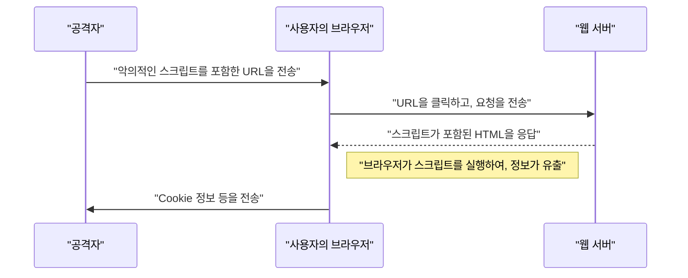

# 웹 애플리케이션의 취약성과 대책 (OWASP Top 10과 시큐어 코딩)

현대의 웹 애플리케이션에 있어 보안 대책은 필수불가결한 요소입니다. 공격 기법은 날로 고도화되고 있으며, 개발자는 항상 최신 위협에 관한 지식과 이를 방어하기 위한 **시큐어 코딩** 기술을 익혀두어야 합니다. 본 기사에서는 웹 애플리케이션 보안의 사실상 표준인 "OWASP Top 10"을 바탕으로, 주요 취약성의 메커니즘, 공격에 의한 영향, 그리고 구체적인 방어 수단에 대해 매우 상세하게 해설합니다.

## OWASP Top 10 이란

OWASP(Open Worldwide Application Security Project)는 소프트웨어의 보안을 향상시키는 것을 목적으로 하는 국제적인 비영리 단체입니다. OWASP가 정기적으로 공개하는 "OWASP Top 10"은 웹 애플리케이션에서 가장 중대한 보안 위험 상위 10가지를 정리한 보고서이며, 많은 기업과 개발자가 보안 기준으로 채택하고 있습니다.

본 기사에서는 특히 영향이 크고 빈번하게 발생하는 "인젝션", "크로스 사이트 스크립팅(XSS)", "크로스 사이트 요청 위조(CSRF)", "서버 사이드 요청 위조(SSRF)", "접근 제어의 결여"와 같은 취약성에 초점을 맞춰 깊이 있게 파헤쳐 보겠습니다.

---

## 1. 인젝션 (Injection)

인젝션은 신뢰할 수 없는 데이터가 명령이나 쿼리의 일부로서 인터프리터에 전송됨으로써 발생하는 취약성입니다. 공격자의 악의적인 데이터가 인터프리터에 의해 의도치 않은 명령으로 실행되거나, 적절한 권한 없이 데이터에 접근하게 됩니다.

### 1.1. SQL 인젝션

SQL 인젝션은 데이터베이스와 상호 작용하는 애플리케이션에서 외부로부터의 입력값이 SQL 쿼리에 부정한 방식으로 포함됨으로써 발생합니다. 이로 인해 공격자는 데이터베이스 내의 기밀 정보 읽기, 데이터 변조, 나아가 데이터베이스 서버의 제어권을 탈취할 수 있게 됩니다.

#### 공격 메커니즘

전형적인 예로 사용자 이름과 비밀번호를 이용한 로그인 처리를 생각해 봅시다.

**취약한 코드 예시 (PHP):**

```php
$username = $_POST['username'];
$password = $_POST['password'];

// 위험: 입력값을 그대로 SQL 쿼리에 결합하고 있음
$query = "SELECT * FROM users WHERE username = '" . $username . "' AND password = '" . $password . "'";
$result = $mysqli->query($query);
```

이 코드에 대해 공격자가 `username` 필드에 다음과 같은 문자열을 입력했다고 가정해 봅시다.

`admin' OR '1'='1`

그러면 실행되는 SQL 쿼리는 다음과 같이 됩니다.

```sql
SELECT * FROM users WHERE username = 'admin' OR '1'='1' AND password = ''
```

`'1'='1'` 은 항상 참(True)이 되므로 비밀번호 확인이 우회되어 공격자는 `admin` 사용자로 로그인할 수 있게 됩니다.

#### SQL 인젝션 방어 수단

SQL 인젝션을 방지하는 가장 확실한 방법은 **준비된 명령문(Prepared Statement)** (매개변수화된 쿼리)을 사용하는 것입니다. 이를 통해 SQL 쿼리의 구조와 데이터가 분리되어, 입력값이 SQL 명령으로 해석되는 것을 방지합니다.

**대책이 적용된 코드 예시 (PHP / PDO):**

```php
$username = $_POST['username'];
$password = $_POST['password'];

// 안전: 준비된 명령문을 사용
$stmt = $pdo->prepare("SELECT * FROM users WHERE username = :username AND password = :password");
$stmt->bindParam(':username', $username);
$stmt->bindParam(':password', $password);
$stmt->execute();
$result = $stmt->fetchAll();
```

### 1.2. [NoSQL](https://kenji.blog/ko/p/nosql-database-selection-kvs-document-graph-wide-column/) 인젝션

최근 보급되고 있는 NoSQL 데이터베이스([MongoDB](https://kenji.blog/ko/p/nosql-database-selection-kvs-document-graph-wide-column/) 등)에서도 인젝션 공격은 발생합니다. NoSQL에서는 SQL과는 다른 쿼리 언어(JSON 기반 등)를 사용하지만, 입력값 검증이 불충분할 경우 의도치 않은 쿼리 구조의 변경을 일으킬 수 있습니다.

**취약한 코드 예시 (JavaScript / Node.js + MongoDB):**

```javascript
const username = req.body.username;
const password = req.body.password;

// 위험: 입력값을 그대로 객체에 포함시키고 있음
db.collection('users').find({
    username: username,
    password: password
});
```

공격자가 `password` 에 `{"$gt": ""}` 라는 객체를 전송할 경우, 쿼리는 다음과 같이 됩니다.

```json
{
    "username": "admin",
    "password": {"$gt": ""}
}
```

이것은 "비밀번호가 빈 문자열보다 크다(즉, 임의의 문자열)"라는 조건이 되어 인증이 뚫리게 됩니다.

#### [NoSQL](https://kenji.blog/ko/p/nosql-database-selection-kvs-document-graph-wide-column/) 인젝션 방어 수단

NoSQL 인젝션을 방어하려면 입력값의 타입 체크를 엄격하게 수행하고, 문자열로 기대되는 곳에 객체가 전달되지 않도록 검증하는 것이 중요합니다.

### 1.3. OS 명령 인젝션

OS 명령 인젝션은 애플리케이션이 셸을 통해 시스템 명령을 실행할 때 외부로부터의 입력값이 셸 명령의 일부로 해석되는 취약성입니다.

**취약한 코드 예시 (Python):**

```python
import os

domain = request.args.get('domain')
# 위험: 입력값을 그대로 OS 명령에 결합하고 있음
os.system(f"ping -c 4 {domain}")
```

공격자가 `domain` 에 `example.com; rm -rf /` 라고 입력하면, `ping` 명령 뒤에 파괴적인 명령이 실행되고 맙니다.

#### OS 명령 인젝션 방어 수단

가능한 한 OS 명령 호출을 피하고, 언어에 내장된 API(라이브러리)를 사용해야 합니다. 부득이하게 OS 명령을 실행해야 할 경우, 셸을 거치지 않고 인수를 리스트 형식으로 전달하도록 합니다.

**대책이 적용된 코드 예시 (Python):**

```python
import subprocess

domain = request.args.get('domain')
# 안전: 셸을 거치지 않고, 인수를 리스트로 전달
subprocess.run(["ping", "-c", "4", domain])
```

---

## 2. 크로스 사이트 스크립팅 (XSS)

크로스 사이트 스크립팅(XSS)은 공격자가 웹 페이지에 악의적인 스크립트(일반적으로 JavaScript)를 주입하여 다른 사용자의 브라우저에서 실행되게 하는 공격입니다. 이를 통해 세션 토큰 탈취, 사용자의 권한으로 부정 조작, 피싱 사이트로의 리다이렉트 등이 이루어집니다.

### 공격의 성공 확률 모델

XSS 등의 클라이언트 사이드 공격에서 공격이 성공할 확률은 사용자가 함정(악의적인 링크 등)을 밟을 확률에 의존합니다. 이를 수식으로 모델화하면 다음과 같습니다.

공격이 적어도 1회 성공할 확률 $ P(success) $ 는, 1회의 시도에서 실패할 확률을 $ p $, 시도 횟수(전송한 링크의 수 등)를 $ n $ 이라고 했을 때, 다음과 같이 나타낼 수 있습니다.

$ P(success) = 1 - (1 - p)^n $

이 식을 통해, 취약성이 존재하고 공격의 시도 횟수가 늘어나면 늘어날수록 공격이 성공할 확률은 지수함수적으로 1에 가까워진다는 것을 알 수 있습니다. 따라서 근본적인 취약성의 제거가 필수적입니다.

### XSS의 종류

XSS는 주로 다음 3가지로 분류됩니다.

#### 2.1. Reflected XSS (반사형 XSS)

악의적인 스크립트가 포함된 URL을 사용자가 클릭하게 하여, 서버로부터의 응답(오류 메시지나 검색 결과 등)에 해당 스크립트가 그대로 반사(Reflect)되어 출력됨으로써 실행됩니다.



#### 2.2. Stored XSS (축적형 XSS)

악의적인 스크립트가 데이터베이스나 게시판 등에 저장(Store)되고, 다른 사용자가 해당 데이터를 표시할 때 스크립트가 실행됩니다. 피해 범위가 커지기 쉬운 위험한 XSS입니다.

#### 2.3. DOM-based XSS

서버를 거치지 않고, 클라이언트 사이드(브라우저상)의 JavaScript가 DOM(Document Object Model) 조작 과정에서 부정한 스크립트를 실행해 버리는 취약성입니다.

### XSS 방어 수단

XSS를 방지하기 위한 기본 원칙은 **이스케이프(새니타이즈)** 입니다. 사용자로부터의 입력값을 웹 페이지에 출력할 때 HTML에서 특별한 의미를 갖는 문자(`<`, `>`, `&`, `"`, `'` 등)를 무해한 문자열로 변환합니다.

**취약한 코드 예시 (JavaScript / DOM 조작):**

```html
<div id="greeting"></div>
<script>
    // URL 매개변수에서 이름을 가져옴
    const params = new URLSearchParams(window.location.search);
    const name = params.get('name');
    
    // 위험: 입력값을 이스케이프하지 않고 innerHTML에 대입하고 있음
    document.getElementById('greeting').innerHTML = "안녕하세요, " + name + "님!";
</script>
```

**대책이 적용된 코드 예시 (JavaScript):**

```html
<div id="greeting"></div>
<script>
    const params = new URLSearchParams(window.location.search);
    const name = params.get('name');
    
    // 안전: textContent를 사용하여 텍스트로 취급
    document.getElementById('greeting').textContent = "안녕하세요, " + name + "님!";
</script>
```

백엔드(PHP 등)에서 출력할 경우에도 동일하게 적절한 이스케이프 함수(`htmlspecialchars` 등)를 사용합니다. 또한, Content Security Policy(CSP)를 도입함으로써 만일 스크립트가 주입되더라도 실행을 방지하는 다층 방어가 가능합니다.

---

## 3. 크로스 사이트 요청 위조 (CSRF)

CSRF는 사용자가 인증된 웹 애플리케이션에 대해 공격자가 의도치 않은 요청을 강제로 전송하게 하는 공격입니다. 이로 인해 사용자가 의도치 않은 비밀번호 변경, 상품 구매, 회원 탈퇴 처리 등이 이루어지게 됩니다.

### CSRF의 공격 흐름


### CSRF 방어 수단

CSRF를 방지하기 위해서는 요청이 정말로 사용자의 의도에 의한 것인지를 확인하는 구조가 필요합니다.

#### 3.1. CSRF 토큰

가장 일반적인 대책은 서버 측에서 무작위 토큰을 생성하고, 폼 전송 시 해당 토큰을 포함하도록 하는 것입니다. 서버는 전송된 토큰을 검증하고, 일치하지 않을 경우 요청을 거부합니다.

**대책이 적용된 코드 예시 (HTML 폼):**

```html
<form action="/update_profile" method="POST">
    <!-- 서버에서 생성된 CSRF 토큰을 삽입 -->
    <input type="hidden" name="csrf_token" value="abc123xyz456...">
    <input type="text" name="email">
    <button type="submit">업데이트</button>
</form>
```

#### 3.2. SameSite Cookie

더 현대적인 대책으로 Cookie의 `SameSite` 속성을 활용하는 방법이 있습니다. `SameSite=Lax` 또는 `SameSite=Strict` 를 설정함으로써 다른 도메인으로부터의 요청에 대해 Cookie가 전송되지 않게 되어, CSRF 공격을 근본적으로 방지할 수 있습니다.

**대책이 적용된 HTTP 헤더 예시:**

```http
Set-Cookie: session_id=12345; Secure; HttpOnly; SameSite=Lax
```

---

## 4. 서버 사이드 요청 위조 (SSRF)

SSRF는 웹 애플리케이션이 외부의 URL로부터 데이터를 가져오는 기능을 가질 경우, 공격자가 지정한 임의의 URL에 대해 서버가 요청을 전송하게 하는 공격입니다. 이로 인해 통상적으로 외부에서 접근할 수 없는 내부 네트워크의 시스템(클라우드의 메타데이터 API, 사내 데이터베이스 등)에 대한 접근이 가능해집니다.

### SSRF의 위협과 영향

클라우드 환경(AWS, GCP, Azure 등)에서는 인스턴스 내부에서 특정 IP 주소(예: `169.254.169.254`)에 접근함으로써 자격 증명(Credential) 등의 메타데이터를 획득할 수 있는 경우가 있습니다. SSRF를 이용해 이 API에 접근하게 되면 치명적인 정보 유출로 이어집니다.

### SSRF 방어 수단

- **화이트리스트에 의한 URL 제한**: 애플리케이션이 접근 가능한 도메인이나 IP 주소를 엄격한 화이트리스트로 관리합니다.
- **내부 IP에 대한 접근 금지**: `127.0.0.1` 이나 `10.0.0.0/8`, `169.254.169.254` 등의 프라이빗 IP 주소, 루프백 주소, 링크 로컬 주소로의 요청을 차단합니다.
- **DNS 리졸브 검증**: URL의 도메인을 리졸브한 결과의 IP 주소가 허용된 범위 내인지 확인한 후 요청을 전송합니다.

---

## 5. 접근 제어의 결여 (Broken Access Control)

접근 제어(인가)의 결여는 사용자가 자신의 권한을 넘어서는 조작을 실행할 수 있게 되는 취약성입니다. OWASP Top 10 2021에서 가장 중대한 위험(1위)으로 위치하고 있습니다.

### 구체적인 시나리오

- **IDOR (Insecure Direct Object References)**: URL의 매개변수(예: `user_id=123`)를 조작하여 다른 사용자의 개인정보에 접근할 수 있게 됨.
- **권한 상승**: 일반 사용자가 관리 화면의 URL(예: `/admin/dashboard`)에 직접 접근하여 관리자 권한의 조작을 수행할 수 있게 됨.

### 접근 제어 방어 수단

- **기본 거부(Default Deny)**: 모든 접근을 기본적으로 거부하고, 명확하게 허용된 사용자/역할에만 접근을 허용합니다(RBAC/ABAC 도입).
- **서버 측에서의 엄격한 권한 체크**: 클라이언트 측(브라우저의 UI 숨김 등)뿐만 아니라, 반드시 백엔드 처리 실행 직전에 권한을 확인합니다.
- **추측하기 어려운 식별자 사용**: 객체 참조에는 일련번호 ID 대신, 추측하기 어려운 UUID 등 무작위 식별자를 사용합니다.

---

## 6. 안전한 웹 애플리케이션 개발을 향해

웹 애플리케이션의 취약성은 개발 단계에서의 **보안** 의식 결여나 지식 부족에서 발생하는 경우가 대부분입니다. 다음 관행들을 개발 프로세스에 통합하는 것이 중요합니다.

1. **시큐어 바이 디자인 (Security by Design)**: 기획·설계 단계부터 보안 요건을 정의하고 아키텍처에 내장.
2. **정적·동적 분석 도구 활용**: SAST(정적 애플리케이션 보안 테스트)나 DAST(동적 애플리케이션 보안 테스트)를 CI/CD 파이프라인에 통합하여 취약성을 조기에 발견.
3. **의존 관계 관리**: 서드파티 라이브러리나 프레임워크의 취약성 정보(CVE)를 항상 모니터링하고 신속하게 업데이트를 적용.
4. **지속적인 학습**: OWASP 등의 커뮤니티로부터 최신 위협 동향이나 방어 수단을 지속적으로 학습.

### 영향 범위 계산 모델

취약성이 방치될 경우의 영향 범위(위험)는 다음 수식으로 정량화할 수 있습니다.

$ Risk = Threat 	imes Vulnerability 	imes Impact $

- **Threat (위협)**: 공격자가 존재할 가능성이나 공격의 빈도
- **Vulnerability (취약성)**: 시스템 약점의 정도나 악용 용이성
- **Impact (영향)**: 정보 유출이나 시스템 정지로 인한 비즈니스 손해(금전적·신용적 손실)

이 식은 어느 하나라도 0에 가깝게 만들 수 있다면 전체 위험을 대폭 낮출 수 있음을 보여줍니다. 개발자로서는 "취약성(Vulnerability)"을 최소화하는 것이 가장 큰 책무입니다.

---

## 결론

본 기사에서는 OWASP Top 10을 바탕으로 주요 웹 애플리케이션의 취약성(인젝션, XSS, CSRF, SSRF, 접근 제어의 결여)에 대해 그 메커니즘과 구체적인 **시큐어 코딩** 기법을 해설했습니다.

보안은 한 번 대책을 마련했다고 끝나는 것이 아닙니다. 매일의 개발 프로세스에서 항상 보안을 의식한 코드를 작성하고, 지속적인 리뷰와 테스트를 실시함으로써 안전하고 견고한 웹 애플리케이션을 구축해 나가는 것이 요구됩니다.

## 7. 상세한 방어 아키텍처와 운용 (Part 1)

엔터프라이즈 규모의 웹 애플리케이션에서는 앞서 언급한 코딩 수준의 대책에 더해, 인프라스트럭처 수준에서의 다층 방어가 필수적입니다.

### 7.1 WAF (Web Application Firewall) 도입

Web Application Firewall (WAF)은 웹 애플리케이션으로 향하는 트래픽을 감시·필터링하여, SQL 인젝션이나 크로스 사이트 스크립팅(XSS) 등의 공격을 애플리케이션 도달 전에 차단하는 시스템입니다. WAF는 시그니처 기반의 탐지뿐만 아니라, 행위 탐지(어노말리 탐지)를 결합함으로써 제로데이 공격에 대한 대응력도 높이고 있습니다.

### 7.2 안전한 CI/CD 파이프라인 구축

DevSecOps의 개념에 기초하여, 지속적 통합/지속적 제공(CI/CD) 파이프라인에 보안 테스트를 자동화하여 통합하는 것이 중요합니다.

* **SAST (Static Application Security Testing):** 소스 코드를 정적으로 분석하여 취약성을 포함한 코딩 패턴을 검출합니다.
* **DAST (Dynamic Application Security Testing):** 가동 중인 애플리케이션에 대해 모의 공격 요청을 전송하여 실행 시의 취약성을 검출합니다.
* **SCA (Software Composition Analysis):** 사용하고 있는 오픈 소스 라이브러리나 컴포넌트에 포함된 알려진 취약성(CVE)을 검출하고 업데이트를 촉구합니다.

### 7.3 정기적인 모의 침투 테스트 실시

자동화된 도구에 의한 스캔뿐만 아니라, 보안 전문가에 의한 수동 모의 침투 테스트(Penetration Test)를 정기적으로 실시함으로써, 도구로는 발견하기 어려운 비즈니스 로직의 결함이나 복잡한 접근 제어의 취약성을 찾아낼 수 있습니다.

## 8. 상세한 방어 아키텍처와 운용 (Part 2)

엔터프라이즈 규모의 웹 애플리케이션에서는 앞서 언급한 코딩 수준의 대책에 더해, 인프라스트럭처 수준에서의 다층 방어가 필수적입니다.

### 8.1 WAF (Web Application Firewall) 도입

Web Application Firewall (WAF)은 웹 애플리케이션으로 향하는 트래픽을 감시·필터링하여, SQL 인젝션이나 크로스 사이트 스크립팅(XSS) 등의 공격을 애플리케이션 도달 전에 차단하는 시스템입니다. WAF는 시그니처 기반의 탐지뿐만 아니라, 행위 탐지(어노말리 탐지)를 결합함으로써 제로데이 공격에 대한 대응력도 높이고 있습니다.

### 8.2 안전한 CI/CD 파이프라인 구축

DevSecOps의 개념에 기초하여, 지속적 통합/지속적 제공(CI/CD) 파이프라인에 보안 테스트를 자동화하여 통합하는 것이 중요합니다.

* **SAST (Static Application Security Testing):** 소스 코드를 정적으로 분석하여 취약성을 포함한 코딩 패턴을 검출합니다.
* **DAST (Dynamic Application Security Testing):** 가동 중인 애플리케이션에 대해 모의 공격 요청을 전송하여 실행 시의 취약성을 검출합니다.
* **SCA (Software Composition Analysis):** 사용하고 있는 오픈 소스 라이브러리나 컴포넌트에 포함된 알려진 취약성(CVE)을 검출하고 업데이트를 촉구합니다.

### 8.3 정기적인 모의 침투 테스트 실시

자동화된 도구에 의한 스캔뿐만 아니라, 보안 전문가에 의한 수동 모의 침투 테스트(Penetration Test)를 정기적으로 실시함으로써, 도구로는 발견하기 어려운 비즈니스 로직의 결함이나 복잡한 접근 제어의 취약성을 찾아낼 수 있습니다.

## 9. 상세한 방어 아키텍처와 운용 (Part 3)

엔터프라이즈 규모의 웹 애플리케이션에서는 앞서 언급한 코딩 수준의 대책에 더해, 인프라스트럭처 수준에서의 다층 방어가 필수적입니다.

### 9.1 WAF (Web Application Firewall) 도입

Web Application Firewall (WAF)은 웹 애플리케이션으로 향하는 트래픽을 감시·필터링하여, SQL 인젝션이나 크로스 사이트 스크립팅(XSS) 등의 공격을 애플리케이션 도달 전에 차단하는 시스템입니다. WAF는 시그니처 기반의 탐지뿐만 아니라, 행위 탐지(어노말리 탐지)를 결합함으로써 제로데이 공격에 대한 대응력도 높이고 있습니다.

### 9.2 안전한 CI/CD 파이프라인 구축

DevSecOps의 개념에 기초하여, 지속적 통합/지속적 제공(CI/CD) 파이프라인에 보안 테스트를 자동화하여 통합하는 것이 중요합니다.

* **SAST (Static Application Security Testing):** 소스 코드를 정적으로 분석하여 취약성을 포함한 코딩 패턴을 검출합니다.
* **DAST (Dynamic Application Security Testing):** 가동 중인 애플리케이션에 대해 모의 공격 요청을 전송하여 실행 시의 취약성을 검출합니다.
* **SCA (Software Composition Analysis):** 사용하고 있는 오픈 소스 라이브러리나 컴포넌트에 포함된 알려진 취약성(CVE)을 검출하고 업데이트를 촉구합니다.

### 9.3 정기적인 모의 침투 테스트 실시

자동화된 도구에 의한 스캔뿐만 아니라, 보안 전문가에 의한 수동 모의 침투 테스트(Penetration Test)를 정기적으로 실시함으로써, 도구로는 발견하기 어려운 비즈니스 로직의 결함이나 복잡한 접근 제어의 취약성을 찾아낼 수 있습니다.

## 10. 상세한 방어 아키텍처와 운용 (Part 4)

엔터프라이즈 규모의 웹 애플리케이션에서는 앞서 언급한 코딩 수준의 대책에 더해, 인프라스트럭처 수준에서의 다층 방어가 필수적입니다.

### 10.1 WAF (Web Application Firewall) 도입

Web Application Firewall (WAF)은 웹 애플리케이션으로 향하는 트래픽을 감시·필터링하여, SQL 인젝션이나 크로스 사이트 스크립팅(XSS) 등의 공격을 애플리케이션 도달 전에 차단하는 시스템입니다. WAF는 시그니처 기반의 탐지뿐만 아니라, 행위 탐지(어노말리 탐지)를 결합함으로써 제로데이 공격에 대한 대응력도 높이고 있습니다.

### 10.2 안전한 CI/CD 파이프라인 구축

DevSecOps의 개념에 기초하여, 지속적 통합/지속적 제공(CI/CD) 파이프라인에 보안 테스트를 자동화하여 통합하는 것이 중요합니다.

* **SAST (Static Application Security Testing):** 소스 코드를 정적으로 분석하여 취약성을 포함한 코딩 패턴을 검출합니다.
* **DAST (Dynamic Application Security Testing):** 가동 중인 애플리케이션에 대해 모의 공격 요청을 전송하여 실행 시의 취약성을 검출합니다.
* **SCA (Software Composition Analysis):** 사용하고 있는 오픈 소스 라이브러리나 컴포넌트에 포함된 알려진 취약성(CVE)을 검출하고 업데이트를 촉구합니다.

### 10.3 정기적인 모의 침투 테스트 실시

자동화된 도구에 의한 스캔뿐만 아니라, 보안 전문가에 의한 수동 모의 침투 테스트(Penetration Test)를 정기적으로 실시함으로써, 도구로는 발견하기 어려운 비즈니스 로직의 결함이나 복잡한 접근 제어의 취약성을 찾아낼 수 있습니다.

## 11. 상세한 방어 아키텍처와 운용 (Part 5)

엔터프라이즈 규모의 웹 애플리케이션에서는 앞서 언급한 코딩 수준의 대책에 더해, 인프라스트럭처 수준에서의 다층 방어가 필수적입니다.

### 11.1 WAF (Web Application Firewall) 도입

Web Application Firewall (WAF)은 웹 애플리케이션으로 향하는 트래픽을 감시·필터링하여, SQL 인젝션이나 크로스 사이트 스크립팅(XSS) 등의 공격을 애플리케이션 도달 전에 차단하는 시스템입니다. WAF는 시그니처 기반의 탐지뿐만 아니라, 행위 탐지(어노말리 탐지)를 결합함으로써 제로데이 공격에 대한 대응력도 높이고 있습니다.

### 11.2 안전한 CI/CD 파이프라인 구축

DevSecOps의 개념에 기초하여, 지속적 통합/지속적 제공(CI/CD) 파이프라인에 보안 테스트를 자동화하여 통합하는 것이 중요합니다.

* **SAST (Static Application Security Testing):** 소스 코드를 정적으로 분석하여 취약성을 포함한 코딩 패턴을 검출합니다.
* **DAST (Dynamic Application Security Testing):** 가동 중인 애플리케이션에 대해 모의 공격 요청을 전송하여 실행 시의 취약성을 검출합니다.
* **SCA (Software Composition Analysis):** 사용하고 있는 오픈 소스 라이브러리나 컴포넌트에 포함된 알려진 취약성(CVE)을 검출하고 업데이트를 촉구합니다.

### 11.3 정기적인 모의 침투 테스트 실시

자동화된 도구에 의한 스캔뿐만 아니라, 보안 전문가에 의한 수동 모의 침투 테스트(Penetration Test)를 정기적으로 실시함으로써, 도구로는 발견하기 어려운 비즈니스 로직의 결함이나 복잡한 접근 제어의 취약성을 찾아낼 수 있습니다.

## 12. 상세한 방어 아키텍처와 운용 (Part 6)

엔터프라이즈 규모의 웹 애플리케이션에서는 앞서 언급한 코딩 수준의 대책에 더해, 인프라스트럭처 수준에서의 다층 방어가 필수적입니다.

### 12.1 WAF (Web Application Firewall) 도입

Web Application Firewall (WAF)은 웹 애플리케이션으로 향하는 트래픽을 감시·필터링하여, SQL 인젝션이나 크로스 사이트 스크립팅(XSS) 등의 공격을 애플리케이션 도달 전에 차단하는 시스템입니다. WAF는 시그니처 기반의 탐지뿐만 아니라, 행위 탐지(어노말리 탐지)를 결합함으로써 제로데이 공격에 대한 대응력도 높이고 있습니다.

### 12.2 안전한 CI/CD 파이프라인 구축

DevSecOps의 개념에 기초하여, 지속적 통합/지속적 제공(CI/CD) 파이프라인에 보안 테스트를 자동화하여 통합하는 것이 중요합니다.

* **SAST (Static Application Security Testing):** 소스 코드를 정적으로 분석하여 취약성을 포함한 코딩 패턴을 검출합니다.
* **DAST (Dynamic Application Security Testing):** 가동 중인 애플리케이션에 대해 모의 공격 요청을 전송하여 실행 시의 취약성을 검출합니다.
* **SCA (Software Composition Analysis):** 사용하고 있는 오픈 소스 라이브러리나 컴포넌트에 포함된 알려진 취약성(CVE)을 검출하고 업데이트를 촉구합니다.

### 12.3 정기적인 모의 침투 테스트 실시

자동화된 도구에 의한 스캔뿐만 아니라, 보안 전문가에 의한 수동 모의 침투 테스트(Penetration Test)를 정기적으로 실시함으로써, 도구로는 발견하기 어려운 비즈니스 로직의 결함이나 복잡한 접근 제어의 취약성을 찾아낼 수 있습니다.

## 13. 상세한 방어 아키텍처와 운용 (Part 7)

엔터프라이즈 규모의 웹 애플리케이션에서는 앞서 언급한 코딩 수준의 대책에 더해, 인프라스트럭처 수준에서의 다층 방어가 필수적입니다.

### 13.1 WAF (Web Application Firewall) 도입

Web Application Firewall (WAF)은 웹 애플리케이션으로 향하는 트래픽을 감시·필터링하여, SQL 인젝션이나 크로스 사이트 스크립팅(XSS) 등의 공격을 애플리케이션 도달 전에 차단하는 시스템입니다. WAF는 시그니처 기반의 탐지뿐만 아니라, 행위 탐지(어노말리 탐지)를 결합함으로써 제로데이 공격에 대한 대응력도 높이고 있습니다.

### 13.2 안전한 CI/CD 파이프라인 구축

DevSecOps의 개념에 기초하여, 지속적 통합/지속적 제공(CI/CD) 파이프라인에 보안 테스트를 자동화하여 통합하는 것이 중요합니다.

* **SAST (Static Application Security Testing):** 소스 코드를 정적으로 분석하여 취약성을 포함한 코딩 패턴을 검출합니다.
* **DAST (Dynamic Application Security Testing):** 가동 중인 애플리케이션에 대해 모의 공격 요청을 전송하여 실행 시의 취약성을 검출합니다.
* **SCA (Software Composition Analysis):** 사용하고 있는 오픈 소스 라이브러리나 컴포넌트에 포함된 알려진 취약성(CVE)을 검출하고 업데이트를 촉구합니다.

### 13.3 정기적인 모의 침투 테스트 실시

자동화된 도구에 의한 스캔뿐만 아니라, 보안 전문가에 의한 수동 모의 침투 테스트(Penetration Test)를 정기적으로 실시함으로써, 도구로는 발견하기 어려운 비즈니스 로직의 결함이나 복잡한 접근 제어의 취약성을 찾아낼 수 있습니다.

## 14. 상세한 방어 아키텍처와 운용 (Part 8)

엔터프라이즈 규모의 웹 애플리케이션에서는 앞서 언급한 코딩 수준의 대책에 더해, 인프라스트럭처 수준에서의 다층 방어가 필수적입니다.

### 14.1 WAF (Web Application Firewall) 도입

Web Application Firewall (WAF)은 웹 애플리케이션으로 향하는 트래픽을 감시·필터링하여, SQL 인젝션이나 크로스 사이트 스크립팅(XSS) 등의 공격을 애플리케이션 도달 전에 차단하는 시스템입니다. WAF는 시그니처 기반의 탐지뿐만 아니라, 행위 탐지(어노말리 탐지)를 결합함으로써 제로데이 공격에 대한 대응력도 높이고 있습니다.

### 14.2 안전한 CI/CD 파이프라인 구축

DevSecOps의 개념에 기초하여, 지속적 통합/지속적 제공(CI/CD) 파이프라인에 보안 테스트를 자동화하여 통합하는 것이 중요합니다.

* **SAST (Static Application Security Testing):** 소스 코드를 정적으로 분석하여 취약성을 포함한 코딩 패턴을 검출합니다.
* **DAST (Dynamic Application Security Testing):** 가동 중인 애플리케이션에 대해 모의 공격 요청을 전송하여 실행 시의 취약성을 검출합니다.
* **SCA (Software Composition Analysis):** 사용하고 있는 오픈 소스 라이브러리나 컴포넌트에 포함된 알려진 취약성(CVE)을 검출하고 업데이트를 촉구합니다.

### 14.3 정기적인 모의 침투 테스트 실시

자동화된 도구에 의한 스캔뿐만 아니라, 보안 전문가에 의한 수동 모의 침투 테스트(Penetration Test)를 정기적으로 실시함으로써, 도구로는 발견하기 어려운 비즈니스 로직의 결함이나 복잡한 접근 제어의 취약성을 찾아낼 수 있습니다.

## 15. 상세한 방어 아키텍처와 운용 (Part 9)

엔터프라이즈 규모의 웹 애플리케이션에서는 앞서 언급한 코딩 수준의 대책에 더해, 인프라스트럭처 수준에서의 다층 방어가 필수적입니다.

### 15.1 WAF (Web Application Firewall) 도입

Web Application Firewall (WAF)은 웹 애플리케이션으로 향하는 트래픽을 감시·필터링하여, SQL 인젝션이나 크로스 사이트 스크립팅(XSS) 등의 공격을 애플리케이션 도달 전에 차단하는 시스템입니다. WAF는 시그니처 기반의 탐지뿐만 아니라, 행위 탐지(어노말리 탐지)를 결합함으로써 제로데이 공격에 대한 대응력도 높이고 있습니다.

### 15.2 안전한 CI/CD 파이프라인 구축

DevSecOps의 개념에 기초하여, 지속적 통합/지속적 제공(CI/CD) 파이프라인에 보안 테스트를 자동화하여 통합하는 것이 중요합니다.

* **SAST (Static Application Security Testing):** 소스 코드를 정적으로 분석하여 취약성을 포함한 코딩 패턴을 검출합니다.
* **DAST (Dynamic Application Security Testing):** 가동 중인 애플리케이션에 대해 모의 공격 요청을 전송하여 실행 시의 취약성을 검출합니다.
* **SCA (Software Composition Analysis):** 사용하고 있는 오픈 소스 라이브러리나 컴포넌트에 포함된 알려진 취약성(CVE)을 검출하고 업데이트를 촉구합니다.

### 15.3 정기적인 모의 침투 테스트 실시

자동화된 도구에 의한 스캔뿐만 아니라, 보안 전문가에 의한 수동 모의 침투 테스트(Penetration Test)를 정기적으로 실시함으로써, 도구로는 발견하기 어려운 비즈니스 로직의 결함이나 복잡한 접근 제어의 취약성을 찾아낼 수 있습니다.

## 16. 상세한 방어 아키텍처와 운용 (Part 10)

엔터프라이즈 규모의 웹 애플리케이션에서는 앞서 언급한 코딩 수준의 대책에 더해, 인프라스트럭처 수준에서의 다층 방어가 필수적입니다.

### 16.1 WAF (Web Application Firewall) 도입

Web Application Firewall (WAF)은 웹 애플리케이션으로 향하는 트래픽을 감시·필터링하여, SQL 인젝션이나 크로스 사이트 스크립팅(XSS) 등의 공격을 애플리케이션 도달 전에 차단하는 시스템입니다. WAF는 시그니처 기반의 탐지뿐만 아니라, 행위 탐지(어노말리 탐지)를 결합함으로써 제로데이 공격에 대한 대응력도 높이고 있습니다.

### 16.2 안전한 CI/CD 파이프라인 구축

DevSecOps의 개념에 기초하여, 지속적 통합/지속적 제공(CI/CD) 파이프라인에 보안 테스트를 자동화하여 통합하는 것이 중요합니다.

* **SAST (Static Application Security Testing):** 소스 코드를 정적으로 분석하여 취약성을 포함한 코딩 패턴을 검출합니다.
* **DAST (Dynamic Application Security Testing):** 가동 중인 애플리케이션에 대해 모의 공격 요청을 전송하여 실행 시의 취약성을 검출합니다.
* **SCA (Software Composition Analysis):** 사용하고 있는 오픈 소스 라이브러리나 컴포넌트에 포함된 알려진 취약성(CVE)을 검출하고 업데이트를 촉구합니다.

### 16.3 정기적인 모의 침투 테스트 실시

자동화된 도구에 의한 스캔뿐만 아니라, 보안 전문가에 의한 수동 모의 침투 테스트(Penetration Test)를 정기적으로 실시함으로써, 도구로는 발견하기 어려운 비즈니스 로직의 결함이나 복잡한 접근 제어의 취약성을 찾아낼 수 있습니다.

## 17. 상세한 방어 아키텍처와 운용 (Part 11)

엔터프라이즈 규모의 웹 애플리케이션에서는 앞서 언급한 코딩 수준의 대책에 더해, 인프라스트럭처 수준에서의 다층 방어가 필수적입니다.

### 17.1 WAF (Web Application Firewall) 도입

Web Application Firewall (WAF)은 웹 애플리케이션으로 향하는 트래픽을 감시·필터링하여, SQL 인젝션이나 크로스 사이트 스크립팅(XSS) 등의 공격을 애플리케이션 도달 전에 차단하는 시스템입니다. WAF는 시그니처 기반의 탐지뿐만 아니라, 행위 탐지(어노말리 탐지)를 결합함으로써 제로데이 공격에 대한 대응력도 높이고 있습니다.

### 17.2 안전한 CI/CD 파이프라인 구축

DevSecOps의 개념에 기초하여, 지속적 통합/지속적 제공(CI/CD) 파이프라인에 보안 테스트를 자동화하여 통합하는 것이 중요합니다.

* **SAST (Static Application Security Testing):** 소스 코드를 정적으로 분석하여 취약성을 포함한 코딩 패턴을 검출합니다.
* **DAST (Dynamic Application Security Testing):** 가동 중인 애플리케이션에 대해 모의 공격 요청을 전송하여 실행 시의 취약성을 검출합니다.
* **SCA (Software Composition Analysis):** 사용하고 있는 오픈 소스 라이브러리나 컴포넌트에 포함된 알려진 취약성(CVE)을 검출하고 업데이트를 촉구합니다.

### 17.3 정기적인 모의 침투 테스트 실시

자동화된 도구에 의한 스캔뿐만 아니라, 보안 전문가에 의한 수동 모의 침투 테스트(Penetration Test)를 정기적으로 실시함으로써, 도구로는 발견하기 어려운 비즈니스 로직의 결함이나 복잡한 접근 제어의 취약성을 찾아낼 수 있습니다.

## 18. 상세한 방어 아키텍처와 운용 (Part 12)

엔터프라이즈 규모의 웹 애플리케이션에서는 앞서 언급한 코딩 수준의 대책에 더해, 인프라스트럭처 수준에서의 다층 방어가 필수적입니다.

### 18.1 WAF (Web Application Firewall) 도입

Web Application Firewall (WAF)은 웹 애플리케이션으로 향하는 트래픽을 감시·필터링하여, SQL 인젝션이나 크로스 사이트 스크립팅(XSS) 등의 공격을 애플리케이션 도달 전에 차단하는 시스템입니다. WAF는 시그니처 기반의 탐지뿐만 아니라, 행위 탐지(어노말리 탐지)를 결합함으로써 제로데이 공격에 대한 대응력도 높이고 있습니다.

### 18.2 안전한 CI/CD 파이프라인 구축

DevSecOps의 개념에 기초하여, 지속적 통합/지속적 제공(CI/CD) 파이프라인에 보안 테스트를 자동화하여 통합하는 것이 중요합니다.

* **SAST (Static Application Security Testing):** 소스 코드를 정적으로 분석하여 취약성을 포함한 코딩 패턴을 검출합니다.
* **DAST (Dynamic Application Security Testing):** 가동 중인 애플리케이션에 대해 모의 공격 요청을 전송하여 실행 시의 취약성을 검출합니다.
* **SCA (Software Composition Analysis):** 사용하고 있는 오픈 소스 라이브러리나 컴포넌트에 포함된 알려진 취약성(CVE)을 검출하고 업데이트를 촉구합니다.

### 18.3 정기적인 모의 침투 테스트 실시

자동화된 도구에 의한 스캔뿐만 아니라, 보안 전문가에 의한 수동 모의 침투 테스트(Penetration Test)를 정기적으로 실시함으로써, 도구로는 발견하기 어려운 비즈니스 로직의 결함이나 복잡한 접근 제어의 취약성을 찾아낼 수 있습니다.

## 19. 상세한 방어 아키텍처와 운용 (Part 13)

엔터프라이즈 규모의 웹 애플리케이션에서는 앞서 언급한 코딩 수준의 대책에 더해, 인프라스트럭처 수준에서의 다층 방어가 필수적입니다.

### 19.1 WAF (Web Application Firewall) 도입

Web Application Firewall (WAF)은 웹 애플리케이션으로 향하는 트래픽을 감시·필터링하여, SQL 인젝션이나 크로스 사이트 스크립팅(XSS) 등의 공격을 애플리케이션 도달 전에 차단하는 시스템입니다. WAF는 시그니처 기반의 탐지뿐만 아니라, 행위 탐지(어노말리 탐지)를 결합함으로써 제로데이 공격에 대한 대응력도 높이고 있습니다.

### 19.2 안전한 CI/CD 파이프라인 구축

DevSecOps의 개념에 기초하여, 지속적 통합/지속적 제공(CI/CD) 파이프라인에 보안 테스트를 자동화하여 통합하는 것이 중요합니다.

* **SAST (Static Application Security Testing):** 소스 코드를 정적으로 분석하여 취약성을 포함한 코딩 패턴을 검출합니다.
* **DAST (Dynamic Application Security Testing):** 가동 중인 애플리케이션에 대해 모의 공격 요청을 전송하여 실행 시의 취약성을 검출합니다.
* **SCA (Software Composition Analysis):** 사용하고 있는 오픈 소스 라이브러리나 컴포넌트에 포함된 알려진 취약성(CVE)을 검출하고 업데이트를 촉구합니다.

### 19.3 정기적인 모의 침투 테스트 실시

자동화된 도구에 의한 스캔뿐만 아니라, 보안 전문가에 의한 수동 모의 침투 테스트(Penetration Test)를 정기적으로 실시함으로써, 도구로는 발견하기 어려운 비즈니스 로직의 결함이나 복잡한 접근 제어의 취약성을 찾아낼 수 있습니다.

## 20. 상세한 방어 아키텍처와 운용 (Part 14)

엔터프라이즈 규모의 웹 애플리케이션에서는 앞서 언급한 코딩 수준의 대책에 더해, 인프라스트럭처 수준에서의 다층 방어가 필수적입니다.

### 20.1 WAF (Web Application Firewall) 도입

Web Application Firewall (WAF)은 웹 애플리케이션으로 향하는 트래픽을 감시·필터링하여, SQL 인젝션이나 크로스 사이트 스크립팅(XSS) 등의 공격을 애플리케이션 도달 전에 차단하는 시스템입니다. WAF는 시그니처 기반의 탐지뿐만 아니라, 행위 탐지(어노말리 탐지)를 결합함으로써 제로데이 공격에 대한 대응력도 높이고 있습니다.

### 20.2 안전한 CI/CD 파이프라인 구축

DevSecOps의 개념에 기초하여, 지속적 통합/지속적 제공(CI/CD) 파이프라인에 보안 테스트를 자동화하여 통합하는 것이 중요합니다.

* **SAST (Static Application Security Testing):** 소스 코드를 정적으로 분석하여 취약성을 포함한 코딩 패턴을 검출합니다.
* **DAST (Dynamic Application Security Testing):** 가동 중인 애플리케이션에 대해 모의 공격 요청을 전송하여 실행 시의 취약성을 검출합니다.
* **SCA (Software Composition Analysis):** 사용하고 있는 오픈 소스 라이브러리나 컴포넌트에 포함된 알려진 취약성(CVE)을 검출하고 업데이트를 촉구합니다.

### 20.3 정기적인 모의 침투 테스트 실시

자동화된 도구에 의한 스캔뿐만 아니라, 보안 전문가에 의한 수동 모의 침투 테스트(Penetration Test)를 정기적으로 실시함으로써, 도구로는 발견하기 어려운 비즈니스 로직의 결함이나 복잡한 접근 제어의 취약성을 찾아낼 수 있습니다.
