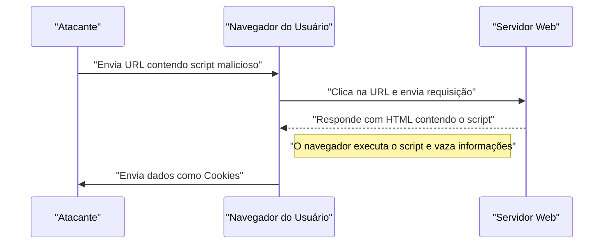
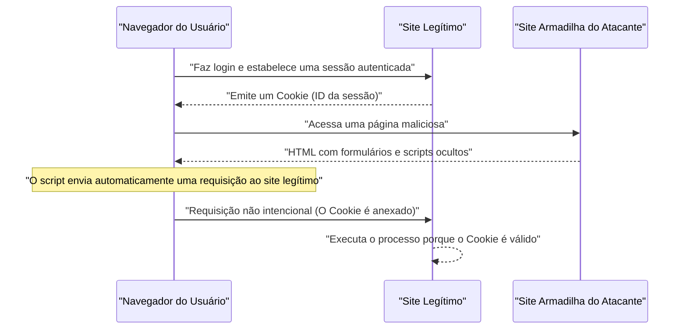

# Vulnerabilidades de Aplicações Web e Contramedidas (OWASP Top 10 e Codificação Segura)

Em aplicações Web modernas, as medidas de segurança são um elemento indispensável. Os métodos de ataque estão se tornando mais sofisticados a cada dia, e os desenvolvedores devem estar sempre equipados com conhecimento sobre as ameaças mais recentes e técnicas de **codificação segura** para preveni-las. Neste artigo, com base no "OWASP Top 10", que é o padrão de fato para a segurança de aplicações Web, explicaremos os mecanismos das principais vulnerabilidades, o impacto dos ataques e os métodos específicos de defesa em grandes detalhes.

## O que é OWASP Top 10

A OWASP (Open Worldwide Application Security Project) é uma organização internacional sem fins lucrativos cujo objetivo é melhorar a segurança do software. O "OWASP Top 10", publicado periodicamente pela OWASP, é um relatório que resume os 10 principais riscos de segurança mais críticos em aplicações Web e é adotado por muitas empresas e desenvolvedores como um padrão de segurança.

Neste artigo, nos aprofundaremos nas vulnerabilidades que têm um impacto particularmente grande e ocorrem com frequência, como "Injeção", "Cross-Site Scripting (XSS)", "Cross-Site Request Forgery (CSRF)", "Server-Side Request Forgery (SSRF)" e "Falha no Controle de Acesso".

---

## 1. Injeção (Injection)

Injeção é uma vulnerabilidade que ocorre quando dados não confiáveis são enviados a um interpretador como parte de um comando ou consulta. Dados maliciosos de um atacante podem ser executados pelo interpretador como comandos não intencionais, ou dados podem ser acessados sem a devida autorização.

### 1.1. Injeção de SQL

A Injeção de SQL ocorre em aplicações que interagem com um banco de dados, onde os valores de entrada externos são incorporados incorretamente a uma consulta SQL. Isso permite que os atacantes leiam informações confidenciais no banco de dados, falsifiquem dados ou até mesmo assumam o controle do servidor do banco de dados.

#### Mecanismo de Ataque

Como um exemplo típico, considere um processo de login usando um nome de usuário e uma senha.

**Exemplo de código vulnerável (PHP):**

```php
$username = $_POST['username'];
$password = $_POST['password'];

// Perigo: Os valores de entrada são combinados diretamente na consulta SQL
$query = "SELECT * FROM users WHERE username = '" . $username . "' AND password = '" . $password . "'";
$result = $mysqli->query($query);
```

Suponha que um atacante insira a seguinte string no campo `username` contra este código:

`admin' OR '1'='1`

Então, a consulta SQL executada será a seguinte:

```sql
SELECT * FROM users WHERE username = 'admin' OR '1'='1' AND password = ''
```

Como `'1'='1'` é sempre verdadeiro (True), a verificação da senha é ignorada e o atacante consegue fazer login como o usuário `admin`.

#### Métodos de Defesa contra Injeção de SQL

O método mais confiável para evitar a Injeção de SQL é usar **declarações preparadas** (consultas parametrizadas). Isso separa a estrutura da consulta SQL e os dados, evitando que os valores de entrada sejam interpretados como comandos SQL.

**Exemplo de código com contramedida (PHP / PDO):**

```php
$username = $_POST['username'];
$password = $_POST['password'];

// Seguro: Uso de declarações preparadas
$stmt = $pdo->prepare("SELECT * FROM users WHERE username = :username AND password = :password");
$stmt->bindParam(':username', $username);
$stmt->bindParam(':password', $password);
$stmt->execute();
$result = $stmt->fetchAll();
```

### 1.2. Injeção [NoSQL](https://kenji.blog/pt/p/nosql-database-selection-kvs-document-graph-wide-column/)

Ataques de injeção também ocorrem em bancos de dados NoSQL (como o [MongoDB](https://kenji.blog/pt/p/nosql-database-selection-kvs-document-graph-wide-column/)), que se tornaram populares nos últimos anos. O NoSQL usa linguagens de consulta diferentes do SQL (como baseadas em JSON), mas se a validação dos valores de entrada for insuficiente, ela pode causar alterações não intencionais na estrutura da consulta.

**Exemplo de código vulnerável (JavaScript / Node.js + MongoDB):**

```javascript
const username = req.body.username;
const password = req.body.password;

// Perigo: Os valores de entrada são incorporados diretamente no objeto
db.collection('users').find({
    username: username,
    password: password
});
```

Se um atacante enviar o objeto `{"$gt": ""}` como `password`, a consulta ficará assim:

```json
{
    "username": "admin",
    "password": {"$gt": ""}
}
```

Essa condição significa "a senha é maior que uma string vazia (ou seja, qualquer string)", o que faz com que a autenticação seja violada.

#### Métodos de Defesa contra Injeção [NoSQL](https://kenji.blog/pt/p/nosql-database-selection-kvs-document-graph-wide-column/)

Para evitar a Injeção NoSQL, é importante realizar verificações rigorosas de tipo nos valores de entrada e validar para garantir que os objetos não sejam passados para lugares onde se esperam strings.

### 1.3. Injeção de Comandos do SO

A injeção de comandos do sistema operacional (SO) é uma vulnerabilidade em que os valores de entrada externos são interpretados como parte de um comando do shell quando a aplicação executa comandos do sistema através de um shell.

**Exemplo de código vulnerável (Python):**

```python
import os

domain = request.args.get('domain')
# Perigo: O valor de entrada é combinado diretamente no comando do SO
os.system(f"ping -c 4 {domain}")
```

Se um atacante inserir `example.com; rm -rf /` em `domain`, comandos destrutivos serão executados após o comando `ping`.

#### Métodos de Defesa contra Injeção de Comandos do SO

Deve-se evitar chamar comandos do SO sempre que possível, e as APIs (bibliotecas) nativas da linguagem devem ser usadas. Se for inevitável executar comandos do SO, os argumentos devem ser passados no formato de lista, sem usar um shell.

**Exemplo de código com contramedida (Python):**

```python
import subprocess

domain = request.args.get('domain')
# Seguro: Os argumentos são passados como uma lista sem o uso de um shell
subprocess.run(["ping", "-c", "4", domain])
```

---

## 2. Cross-Site Scripting (XSS)

O Cross-Site Scripting (XSS) é um ataque no qual o atacante injeta scripts maliciosos (geralmente JavaScript) em páginas Web e faz com que sejam executados nos navegadores de outros usuários. Isso resulta em roubo de tokens de sessão, ações não autorizadas usando os privilégios do usuário, redirecionamento para sites de phishing, etc.

### Modelo de Probabilidade de Sucesso do Ataque

Em ataques do lado do cliente, como o XSS, a probabilidade de sucesso do ataque depende da probabilidade de o usuário cair em uma armadilha (como um link malicioso). Se modelarmos isso matematicamente, teremos o seguinte:

A probabilidade de o ataque ter sucesso pelo menos uma vez, $ \text{P(sucesso)} $, pode ser expressa da seguinte forma, onde $ p $ é a probabilidade de falha em uma tentativa e $ n $ é o número de tentativas (como o número de links enviados):

$ \text{P(sucesso)} = 1 - (1 - p)^n $

A partir dessa fórmula, pode-se ver que se a vulnerabilidade existir, à medida que o número de tentativas de ataque aumenta, a probabilidade de sucesso se aproxima exponencialmente de 1. Portanto, é essencial a eliminação fundamental da vulnerabilidade.

### Tipos de XSS

O XSS é classificado principalmente nestes três tipos.

#### 2.1. Reflected XSS (XSS Refletido)

Ocorre quando um usuário é forçado a clicar em uma URL que contém scripts maliciosos e a resposta do servidor (como mensagens de erro ou resultados de pesquisa) reflete o script diretamente na saída, permitindo sua execução.



#### 2.2. Stored XSS (XSS Armazenado)

Scripts maliciosos são salvos (armazenados) em bancos de dados ou fóruns e são executados quando outros usuários visualizam esses dados. É um tipo de XSS perigoso que tende a ter um amplo raio de impacto.

#### 2.3. DOM-based XSS

É uma vulnerabilidade onde scripts JavaScript do lado do cliente (no navegador) executam incorretamente um script malicioso no processo de manipulação do DOM (Document Object Model) sem intervenção do servidor.

### Métodos de Defesa contra XSS

O princípio básico para evitar o XSS é **escapar (sanitizar)**. Ao enviar a entrada do usuário para uma página Web, os caracteres com significados especiais em HTML (como `<`, `>`, `&`, `"`, `'`, etc.) são convertidos em sequências inofensivas.

**Exemplo de código vulnerável (JavaScript / Manipulação do DOM):**

```html
<div id="greeting"></div>
<script>
    // Obtém o nome do parâmetro da URL
    const params = new URLSearchParams(window.location.search);
    const name = params.get('name');
    
    // Perigo: Atribui o valor de entrada a innerHTML sem escapar
    document.getElementById('greeting').innerHTML = "Olá, " + name + "!";
</script>
```

**Exemplo de código com contramedida (JavaScript):**

```html
<div id="greeting"></div>
<script>
    const params = new URLSearchParams(window.location.search);
    const name = params.get('name');
    
    // Seguro: Uso de textContent para tratá-lo como texto
    document.getElementById('greeting').textContent = "Olá, " + name + "!";
</script>
```

Ao emitir resultados no back-end (como PHP), funções de escape apropriadas (como `htmlspecialchars`) também são usadas. Além disso, a introdução de uma Política de Segurança de Conteúdo (CSP) fornece uma defesa em múltiplas camadas para evitar a execução de scripts no caso improvável de injeção.

---

## 3. Cross-Site Request Forgery (CSRF)

CSRF é um ataque no qual o atacante força um usuário a enviar solicitações não intencionais a uma aplicação Web onde ele está autenticado. Isso permite que ações como alteração de senha, compra de itens ou cancelamento de contas sejam realizadas sem o consentimento do usuário.

### Fluxo de Ataque CSRF



### Métodos de Defesa contra CSRF

Para evitar CSRF, é necessário um mecanismo para verificar se a requisição é realmente pretendida pelo usuário.

#### 3.1. Token CSRF

A contramedida mais comum é o servidor gerar um token aleatório e incluí-lo ao enviar o formulário. O servidor verifica o token enviado e rejeita a requisição se não coincidir.

**Exemplo de código com contramedida (Formulário HTML):**

```html
<form action="/update_profile" method="POST">
    <!-- Incorpora o token CSRF gerado no servidor -->
    <input type="hidden" name="csrf_token" value="abc123xyz456...">
    <input type="text" name="email">
    <button type="submit">Atualizar</button>
</form>
```

#### 3.2. Cookie SameSite

Uma contramedida mais moderna é utilizar o atributo `SameSite` nos Cookies. Ao configurar `SameSite=Lax` ou `SameSite=Strict`, os cookies deixam de ser enviados para solicitações originárias de outros domínios, o que previne fundamentalmente ataques CSRF.

**Exemplo de cabeçalho HTTP com contramedida:**

```http
Set-Cookie: session_id=12345; Secure; HttpOnly; SameSite=Lax
```

---

## 4. Server-Side Request Forgery (SSRF)

SSRF é um ataque no qual o atacante faz o servidor enviar requisições a uma URL de sua escolha, se a aplicação Web tiver a funcionalidade de buscar dados em URLs externas. Isso permite acesso a sistemas internos de redes que normalmente não são acessíveis externamente (APIs de metadados na nuvem, bancos de dados internos, etc.).

### Ameaça e Impacto do SSRF

Em ambientes de nuvem (AWS, GCP, Azure, etc.), o acesso a endereços IP específicos a partir do interior da instância (ex: `169.254.169.254`) pode permitir a recuperação de metadados, como credenciais. Se esta API for acessada usando SSRF, isso resultará em um vazamento fatal de informações.

### Métodos de Defesa contra SSRF

- **Restringir URLs por meio de lista de permissões**: Os domínios ou endereços IP que a aplicação pode acessar são gerenciados através de uma lista de permissões rigorosa (whitelist).
- **Proibição de acesso a IPs internos**: Bloquear requisições a endereços IP privados, endereços de loopback e endereços link-local, como `127.0.0.1`, `10.0.0.0/8` e `169.254.169.254`.
- **Validação de resolução de DNS**: Verificar se o endereço IP resultante da resolução do domínio da URL está dentro do intervalo permitido antes de enviar a requisição.

---

## 5. Falha no Controle de Acesso (Broken Access Control)

Uma falha no controle de acesso (autorização) é uma vulnerabilidade que permite ao usuário executar operações que excedem os seus privilégios. Esta vulnerabilidade é considerada o risco de segurança mais sério (1º lugar) no OWASP Top 10 de 2021.

### Cenários Específicos

- **IDOR (Insecure Direct Object References)**: Ao modificar parâmetros da URL (ex: `user_id=123`), pode ser possível acessar as informações pessoais de outros usuários.
- **Escalonamento de Privilégios**: Um usuário comum pode obter privilégios administrativos ao acessar diretamente a URL do painel de administração (ex: `/admin/dashboard`).

### Métodos de Defesa contra Falhas no Controle de Acesso

- **Negação por Padrão (Default Deny)**: Todo o acesso é negado por padrão e o acesso só é permitido a usuários ou funções explicitamente autorizados (implementação de RBAC/ABAC).
- **Verificações Rígidas de Permissão no Lado do Servidor**: Verificações devem sempre ser realizadas no back-end imediatamente antes da execução da operação e não apenas no lado do cliente (como ocultar elementos da interface do usuário).
- **Uso de Identificadores Difíceis de Adivinhar**: Para referenciar objetos, em vez de usar IDs numéricos sequenciais, use identificadores aleatórios, como UUIDs, que são difíceis de adivinhar.

---

## 6. Rumo ao Desenvolvimento de Aplicações Web Seguras

As vulnerabilidades em aplicações Web quase sempre derivam de falta de conhecimento ou ausência de uma mentalidade de **segurança** na fase de desenvolvimento. É crucial incorporar as seguintes práticas ao processo de desenvolvimento:

1. **Security by Design**: Definir os requisitos de segurança na fase de planejamento e integrá-los na arquitetura.
2. **Uso de Ferramentas de Análise Estática e Dinâmica**: Integrar o SAST (Static Application Security Testing) e o DAST (Dynamic Application Security Testing) ao pipeline de CI/CD para descobrir vulnerabilidades de forma precoce.
3. **Gestão de Dependências**: Monitorar de perto bibliotecas de terceiros ou frameworks quanto a informações sobre vulnerabilidades conhecidas (CVE) e aplicar atualizações rapidamente.
4. **Aprendizado Contínuo**: Estudar de modo contínuo sobre tendências recentes de ameaças e mecanismos de defesa através de comunidades como a OWASP.

### Modelo de Cálculo da Extensão do Impacto

O impacto (risco) quando a vulnerabilidade é negligenciada pode ser quantificado matematicamente pela seguinte fórmula:

$ \text{Risco} = \text{Ameaça} \times \text{Vulnerabilidade} \times \text{Impacto} $

- **Ameaça (Threat)**: A probabilidade de um atacante existir e a frequência dos ataques
- **Vulnerabilidade (Vulnerability)**: A extensão da fraqueza do sistema e como ele pode ser abusado facilmente
- **Impacto (Impact)**: O dano ao negócio (perda financeira/reputacional) devido a um vazamento de informações ou inatividade do sistema

Essa fórmula mostra que, se conseguirmos reduzir qualquer um desses elementos a quase zero, o risco geral será drasticamente atenuado. O maior dever do desenvolvedor é minimizar a "Vulnerabilidade (Vulnerability)".

---

## Conclusão

Neste artigo, discutimos as principais vulnerabilidades em aplicações Web baseadas no OWASP Top 10 (Injeções, XSS, CSRF, SSRF e Falha no Controle de Acesso), seus mecanismos e as práticas específicas de **codificação segura**.

A segurança não é algo que deve ser considerado de vez em quando. No processo de desenvolvimento diário, é preciso focar continuamente em escrever código com segurança, além de conduzir testes e revisões sistematicamente. Dessa forma, você conseguirá construir e manter aplicações Web robustas e blindadas.

## 7. Arquitetura de Defesa Detalhada e Operações (Part 1)

Para aplicações Web em escala corporativa, além das medidas em nível de código abordadas anteriormente, uma abordagem em múltiplas camadas no nível da infraestrutura se faz obrigatória.

### 7.1 Implantação de WAF (Web Application Firewall)

O Web Application Firewall (WAF) é um sistema que monitora e filtra o tráfego da aplicação Web, bloqueando ataques como Injeção de SQL ou Cross-Site Scripting (XSS) antes que eles alcancem a aplicação. Um WAF emprega não apenas detecção baseada em assinatura, mas também detecção comportamental (detecção de anomalias), aumentando consideravelmente as chances de conter ataques zero-day.

### 7.2 Construção de um Pipeline de CI/CD Seguro

Com base nos conceitos de DevSecOps, automatizar as avaliações e testes de segurança e inseri-los no pipeline de integração e entrega contínuas (CI/CD) é fundamental.

* **SAST (Static Application Security Testing):** Analisa de forma estática os códigos fontes para identificar padrões suspeitos de codificação que envolvam fragilidades.
* **DAST (Dynamic Application Security Testing):** Ao emitir solicitações forjadas parecidas com ataques a uma aplicação funcional e já implantada, ele rastreia anomalias de execução de tempos em tempos.
* **SCA (Software Composition Analysis):** Mapeia os componentes e bibliotecas abertas utilizadas, visando localizar eventuais problemas públicos (CVE) e orientar a correção via updates.

### 7.3 Execução de Testes de Penetração Periódicos

Diferentemente do escaneamento mecânico realizado por ferramentas, realizar testes manuais de penetração sistemáticos liderados por um profissional capacitado no ramo permite destrinchar pontos que as varreduras automáticas negligenciam – englobando de falhas profundas na regra de negócios à carência minuciosa em lógicas e esquemas restritivos de controle.

## 8. Arquitetura de Defesa Detalhada e Operações (Part 2)

Para aplicações Web em escala corporativa, além das medidas em nível de código abordadas anteriormente, uma abordagem em múltiplas camadas no nível da infraestrutura se faz obrigatória.

### 8.1 Implantação de WAF (Web Application Firewall)

O Web Application Firewall (WAF) é um sistema que monitora e filtra o tráfego da aplicação Web, bloqueando ataques como Injeção de SQL ou Cross-Site Scripting (XSS) antes que eles alcancem a aplicação. Um WAF emprega não apenas detecção baseada em assinatura, mas também detecção comportamental (detecção de anomalias), aumentando consideravelmente as chances de conter ataques zero-day.

### 8.2 Construção de um Pipeline de CI/CD Seguro

Com base nos conceitos de DevSecOps, automatizar as avaliações e testes de segurança e inseri-los no pipeline de integração e entrega contínuas (CI/CD) é fundamental.

* **SAST (Static Application Security Testing):** Analisa de forma estática os códigos fontes para identificar padrões suspeitos de codificação que envolvam fragilidades.
* **DAST (Dynamic Application Security Testing):** Ao emitir solicitações forjadas parecidas com ataques a uma aplicação funcional e já implantada, ele rastreia anomalias de execução de tempos em tempos.
* **SCA (Software Composition Analysis):** Mapeia os componentes e bibliotecas abertas utilizadas, visando localizar eventuais problemas públicos (CVE) e orientar a correção via updates.

### 8.3 Execução de Testes de Penetração Periódicos

Diferentemente do escaneamento mecânico realizado por ferramentas, realizar testes manuais de penetração sistemáticos liderados por um profissional capacitado no ramo permite destrinchar pontos que as varreduras automáticas negligenciam – englobando de falhas profundas na regra de negócios à carência minuciosa em lógicas e esquemas restritivos de controle.

## 9. Arquitetura de Defesa Detalhada e Operações (Part 3)

Para aplicações Web em escala corporativa, além das medidas em nível de código abordadas anteriormente, uma abordagem em múltiplas camadas no nível da infraestrutura se faz obrigatória.

### 9.1 Implantação de WAF (Web Application Firewall)

O Web Application Firewall (WAF) é um sistema que monitora e filtra o tráfego da aplicação Web, bloqueando ataques como Injeção de SQL ou Cross-Site Scripting (XSS) antes que eles alcancem a aplicação. Um WAF emprega não apenas detecção baseada em assinatura, mas também detecção comportamental (detecção de anomalias), aumentando consideravelmente as chances de conter ataques zero-day.

### 9.2 Construção de um Pipeline de CI/CD Seguro

Com base nos conceitos de DevSecOps, automatizar as avaliações e testes de segurança e inseri-los no pipeline de integração e entrega contínuas (CI/CD) é fundamental.

* **SAST (Static Application Security Testing):** Analisa de forma estática os códigos fontes para identificar padrões suspeitos de codificação que envolvam fragilidades.
* **DAST (Dynamic Application Security Testing):** Ao emitir solicitações forjadas parecidas com ataques a uma aplicação funcional e já implantada, ele rastreia anomalias de execução de tempos em tempos.
* **SCA (Software Composition Analysis):** Mapeia os componentes e bibliotecas abertas utilizadas, visando localizar eventuais problemas públicos (CVE) e orientar a correção via updates.

### 9.3 Execução de Testes de Penetração Periódicos

Diferentemente do escaneamento mecânico realizado por ferramentas, realizar testes manuais de penetração sistemáticos liderados por um profissional capacitado no ramo permite destrinchar pontos que as varreduras automáticas negligenciam – englobando de falhas profundas na regra de negócios à carência minuciosa em lógicas e esquemas restritivos de controle.

## 10. Arquitetura de Defesa Detalhada e Operações (Part 4)

Para aplicações Web em escala corporativa, além das medidas em nível de código abordadas anteriormente, uma abordagem em múltiplas camadas no nível da infraestrutura se faz obrigatória.

### 10.1 Implantação de WAF (Web Application Firewall)

O Web Application Firewall (WAF) é um sistema que monitora e filtra o tráfego da aplicação Web, bloqueando ataques como Injeção de SQL ou Cross-Site Scripting (XSS) antes que eles alcancem a aplicação. Um WAF emprega não apenas detecção baseada em assinatura, mas também detecção comportamental (detecção de anomalias), aumentando consideravelmente as chances de conter ataques zero-day.

### 10.2 Construção de um Pipeline de CI/CD Seguro

Com base nos conceitos de DevSecOps, automatizar as avaliações e testes de segurança e inseri-los no pipeline de integração e entrega contínuas (CI/CD) é fundamental.

* **SAST (Static Application Security Testing):** Analisa de forma estática os códigos fontes para identificar padrões suspeitos de codificação que envolvam fragilidades.
* **DAST (Dynamic Application Security Testing):** Ao emitir solicitações forjadas parecidas com ataques a uma aplicação funcional e já implantada, ele rastreia anomalias de execução de tempos em tempos.
* **SCA (Software Composition Analysis):** Mapeia os componentes e bibliotecas abertas utilizadas, visando localizar eventuais problemas públicos (CVE) e orientar a correção via updates.

### 10.3 Execução de Testes de Penetração Periódicos

Diferentemente do escaneamento mecânico realizado por ferramentas, realizar testes manuais de penetração sistemáticos liderados por um profissional capacitado no ramo permite destrinchar pontos que as varreduras automáticas negligenciam – englobando de falhas profundas na regra de negócios à carência minuciosa em lógicas e esquemas restritivos de controle.

## 11. Arquitetura de Defesa Detalhada e Operações (Part 5)

Para aplicações Web em escala corporativa, além das medidas em nível de código abordadas anteriormente, uma abordagem em múltiplas camadas no nível da infraestrutura se faz obrigatória.

### 11.1 Implantação de WAF (Web Application Firewall)

O Web Application Firewall (WAF) é um sistema que monitora e filtra o tráfego da aplicação Web, bloqueando ataques como Injeção de SQL ou Cross-Site Scripting (XSS) antes que eles alcancem a aplicação. Um WAF emprega não apenas detecção baseada em assinatura, mas também detecção comportamental (detecção de anomalias), aumentando consideravelmente as chances de conter ataques zero-day.

### 11.2 Construção de um Pipeline de CI/CD Seguro

Com base nos conceitos de DevSecOps, automatizar as avaliações e testes de segurança e inseri-los no pipeline de integração e entrega contínuas (CI/CD) é fundamental.

* **SAST (Static Application Security Testing):** Analisa de forma estática os códigos fontes para identificar padrões suspeitos de codificação que envolvam fragilidades.
* **DAST (Dynamic Application Security Testing):** Ao emitir solicitações forjadas parecidas com ataques a uma aplicação funcional e já implantada, ele rastreia anomalias de execução de tempos em tempos.
* **SCA (Software Composition Analysis):** Mapeia os componentes e bibliotecas abertas utilizadas, visando localizar eventuais problemas públicos (CVE) e orientar a correção via updates.

### 11.3 Execução de Testes de Penetração Periódicos

Diferentemente do escaneamento mecânico realizado por ferramentas, realizar testes manuais de penetração sistemáticos liderados por um profissional capacitado no ramo permite destrinchar pontos que as varreduras automáticas negligenciam – englobando de falhas profundas na regra de negócios à carência minuciosa em lógicas e esquemas restritivos de controle.

## 12. Arquitetura de Defesa Detalhada e Operações (Part 6)

Para aplicações Web em escala corporativa, além das medidas em nível de código abordadas anteriormente, uma abordagem em múltiplas camadas no nível da infraestrutura se faz obrigatória.

### 12.1 Implantação de WAF (Web Application Firewall)

O Web Application Firewall (WAF) é um sistema que monitora e filtra o tráfego da aplicação Web, bloqueando ataques como Injeção de SQL ou Cross-Site Scripting (XSS) antes que eles alcancem a aplicação. Um WAF emprega não apenas detecção baseada em assinatura, mas também detecção comportamental (detecção de anomalias), aumentando consideravelmente as chances de conter ataques zero-day.

### 12.2 Construção de um Pipeline de CI/CD Seguro

Com base nos conceitos de DevSecOps, automatizar as avaliações e testes de segurança e inseri-los no pipeline de integração e entrega contínuas (CI/CD) é fundamental.

* **SAST (Static Application Security Testing):** Analisa de forma estática os códigos fontes para identificar padrões suspeitos de codificação que envolvam fragilidades.
* **DAST (Dynamic Application Security Testing):** Ao emitir solicitações forjadas parecidas com ataques a uma aplicação funcional e já implantada, ele rastreia anomalias de execução de tempos em tempos.
* **SCA (Software Composition Analysis):** Mapeia os componentes e bibliotecas abertas utilizadas, visando localizar eventuais problemas públicos (CVE) e orientar a correção via updates.

### 12.3 Execução de Testes de Penetração Periódicos

Diferentemente do escaneamento mecânico realizado por ferramentas, realizar testes manuais de penetração sistemáticos liderados por um profissional capacitado no ramo permite destrinchar pontos que as varreduras automáticas negligenciam – englobando de falhas profundas na regra de negócios à carência minuciosa em lógicas e esquemas restritivos de controle.

## 13. Arquitetura de Defesa Detalhada e Operações (Part 7)

Para aplicações Web em escala corporativa, além das medidas em nível de código abordadas anteriormente, uma abordagem em múltiplas camadas no nível da infraestrutura se faz obrigatória.

### 13.1 Implantação de WAF (Web Application Firewall)

O Web Application Firewall (WAF) é um sistema que monitora e filtra o tráfego da aplicação Web, bloqueando ataques como Injeção de SQL ou Cross-Site Scripting (XSS) antes que eles alcancem a aplicação. Um WAF emprega não apenas detecção baseada em assinatura, mas também detecção comportamental (detecção de anomalias), aumentando consideravelmente as chances de conter ataques zero-day.

### 13.2 Construção de um Pipeline de CI/CD Seguro

Com base nos conceitos de DevSecOps, automatizar as avaliações e testes de segurança e inseri-los no pipeline de integração e entrega contínuas (CI/CD) é fundamental.

* **SAST (Static Application Security Testing):** Analisa de forma estática os códigos fontes para identificar padrões suspeitos de codificação que envolvam fragilidades.
* **DAST (Dynamic Application Security Testing):** Ao emitir solicitações forjadas parecidas com ataques a uma aplicação funcional e já implantada, ele rastreia anomalias de execução de tempos em tempos.
* **SCA (Software Composition Analysis):** Mapeia os componentes e bibliotecas abertas utilizadas, visando localizar eventuais problemas públicos (CVE) e orientar a correção via updates.

### 13.3 Execução de Testes de Penetração Periódicos

Diferentemente do escaneamento mecânico realizado por ferramentas, realizar testes manuais de penetração sistemáticos liderados por um profissional capacitado no ramo permite destrinchar pontos que as varreduras automáticas negligenciam – englobando de falhas profundas na regra de negócios à carência minuciosa em lógicas e esquemas restritivos de controle.

## 14. Arquitetura de Defesa Detalhada e Operações (Part 8)

Para aplicações Web em escala corporativa, além das medidas em nível de código abordadas anteriormente, uma abordagem em múltiplas camadas no nível da infraestrutura se faz obrigatória.

### 14.1 Implantação de WAF (Web Application Firewall)

O Web Application Firewall (WAF) é um sistema que monitora e filtra o tráfego da aplicação Web, bloqueando ataques como Injeção de SQL ou Cross-Site Scripting (XSS) antes que eles alcancem a aplicação. Um WAF emprega não apenas detecção baseada em assinatura, mas também detecção comportamental (detecção de anomalias), aumentando consideravelmente as chances de conter ataques zero-day.

### 14.2 Construção de um Pipeline de CI/CD Seguro

Com base nos conceitos de DevSecOps, automatizar as avaliações e testes de segurança e inseri-los no pipeline de integração e entrega contínuas (CI/CD) é fundamental.

* **SAST (Static Application Security Testing):** Analisa de forma estática os códigos fontes para identificar padrões suspeitos de codificação que envolvam fragilidades.
* **DAST (Dynamic Application Security Testing):** Ao emitir solicitações forjadas parecidas com ataques a uma aplicação funcional e já implantada, ele rastreia anomalias de execução de tempos em tempos.
* **SCA (Software Composition Analysis):** Mapeia os componentes e bibliotecas abertas utilizadas, visando localizar eventuais problemas públicos (CVE) e orientar a correção via updates.

### 14.3 Execução de Testes de Penetração Periódicos

Diferentemente do escaneamento mecânico realizado por ferramentas, realizar testes manuais de penetração sistemáticos liderados por um profissional capacitado no ramo permite destrinchar pontos que as varreduras automáticas negligenciam – englobando de falhas profundas na regra de negócios à carência minuciosa em lógicas e esquemas restritivos de controle.

## 15. Arquitetura de Defesa Detalhada e Operações (Part 9)

Para aplicações Web em escala corporativa, além das medidas em nível de código abordadas anteriormente, uma abordagem em múltiplas camadas no nível da infraestrutura se faz obrigatória.

### 15.1 Implantação de WAF (Web Application Firewall)

O Web Application Firewall (WAF) é um sistema que monitora e filtra o tráfego da aplicação Web, bloqueando ataques como Injeção de SQL ou Cross-Site Scripting (XSS) antes que eles alcancem a aplicação. Um WAF emprega não apenas detecção baseada em assinatura, mas também detecção comportamental (detecção de anomalias), aumentando consideravelmente as chances de conter ataques zero-day.

### 15.2 Construção de um Pipeline de CI/CD Seguro

Com base nos conceitos de DevSecOps, automatizar as avaliações e testes de segurança e inseri-los no pipeline de integração e entrega contínuas (CI/CD) é fundamental.

* **SAST (Static Application Security Testing):** Analisa de forma estática os códigos fontes para identificar padrões suspeitos de codificação que envolvam fragilidades.
* **DAST (Dynamic Application Security Testing):** Ao emitir solicitações forjadas parecidas com ataques a uma aplicação funcional e já implantada, ele rastreia anomalias de execução de tempos em tempos.
* **SCA (Software Composition Analysis):** Mapeia os componentes e bibliotecas abertas utilizadas, visando localizar eventuais problemas públicos (CVE) e orientar a correção via updates.

### 15.3 Execução de Testes de Penetração Periódicos

Diferentemente do escaneamento mecânico realizado por ferramentas, realizar testes manuais de penetração sistemáticos liderados por um profissional capacitado no ramo permite destrinchar pontos que as varreduras automáticas negligenciam – englobando de falhas profundas na regra de negócios à carência minuciosa em lógicas e esquemas restritivos de controle.

## 16. Arquitetura de Defesa Detalhada e Operações (Part 10)

Para aplicações Web em escala corporativa, além das medidas em nível de código abordadas anteriormente, uma abordagem em múltiplas camadas no nível da infraestrutura se faz obrigatória.

### 16.1 Implantação de WAF (Web Application Firewall)

O Web Application Firewall (WAF) é um sistema que monitora e filtra o tráfego da aplicação Web, bloqueando ataques como Injeção de SQL ou Cross-Site Scripting (XSS) antes que eles alcancem a aplicação. Um WAF emprega não apenas detecção baseada em assinatura, mas também detecção comportamental (detecção de anomalias), aumentando consideravelmente as chances de conter ataques zero-day.

### 16.2 Construção de um Pipeline de CI/CD Seguro

Com base nos conceitos de DevSecOps, automatizar as avaliações e testes de segurança e inseri-los no pipeline de integração e entrega contínuas (CI/CD) é fundamental.

* **SAST (Static Application Security Testing):** Analisa de forma estática os códigos fontes para identificar padrões suspeitos de codificação que envolvam fragilidades.
* **DAST (Dynamic Application Security Testing):** Ao emitir solicitações forjadas parecidas com ataques a uma aplicação funcional e já implantada, ele rastreia anomalias de execução de tempos em tempos.
* **SCA (Software Composition Analysis):** Mapeia os componentes e bibliotecas abertas utilizadas, visando localizar eventuais problemas públicos (CVE) e orientar a correção via updates.

### 16.3 Execução de Testes de Penetração Periódicos

Diferentemente do escaneamento mecânico realizado por ferramentas, realizar testes manuais de penetração sistemáticos liderados por um profissional capacitado no ramo permite destrinchar pontos que as varreduras automáticas negligenciam – englobando de falhas profundas na regra de negócios à carência minuciosa em lógicas e esquemas restritivos de controle.

## 17. Arquitetura de Defesa Detalhada e Operações (Part 11)

Para aplicações Web em escala corporativa, além das medidas em nível de código abordadas anteriormente, uma abordagem em múltiplas camadas no nível da infraestrutura se faz obrigatória.

### 17.1 Implantação de WAF (Web Application Firewall)

O Web Application Firewall (WAF) é um sistema que monitora e filtra o tráfego da aplicação Web, bloqueando ataques como Injeção de SQL ou Cross-Site Scripting (XSS) antes que eles alcancem a aplicação. Um WAF emprega não apenas detecção baseada em assinatura, mas também detecção comportamental (detecção de anomalias), aumentando consideravelmente as chances de conter ataques zero-day.

### 17.2 Construção de um Pipeline de CI/CD Seguro

Com base nos conceitos de DevSecOps, automatizar as avaliações e testes de segurança e inseri-los no pipeline de integração e entrega contínuas (CI/CD) é fundamental.

* **SAST (Static Application Security Testing):** Analisa de forma estática os códigos fontes para identificar padrões suspeitos de codificação que envolvam fragilidades.
* **DAST (Dynamic Application Security Testing):** Ao emitir solicitações forjadas parecidas com ataques a uma aplicação funcional e já implantada, ele rastreia anomalias de execução de tempos em tempos.
* **SCA (Software Composition Analysis):** Mapeia os componentes e bibliotecas abertas utilizadas, visando localizar eventuais problemas públicos (CVE) e orientar a correção via updates.

### 17.3 Execução de Testes de Penetração Periódicos

Diferentemente do escaneamento mecânico realizado por ferramentas, realizar testes manuais de penetração sistemáticos liderados por um profissional capacitado no ramo permite destrinchar pontos que as varreduras automáticas negligenciam – englobando de falhas profundas na regra de negócios à carência minuciosa em lógicas e esquemas restritivos de controle.

## 18. Arquitetura de Defesa Detalhada e Operações (Part 12)

Para aplicações Web em escala corporativa, além das medidas em nível de código abordadas anteriormente, uma abordagem em múltiplas camadas no nível da infraestrutura se faz obrigatória.

### 18.1 Implantação de WAF (Web Application Firewall)

O Web Application Firewall (WAF) é um sistema que monitora e filtra o tráfego da aplicação Web, bloqueando ataques como Injeção de SQL ou Cross-Site Scripting (XSS) antes que eles alcancem a aplicação. Um WAF emprega não apenas detecção baseada em assinatura, mas também detecção comportamental (detecção de anomalias), aumentando consideravelmente as chances de conter ataques zero-day.

### 18.2 Construção de um Pipeline de CI/CD Seguro

Com base nos conceitos de DevSecOps, automatizar as avaliações e testes de segurança e inseri-los no pipeline de integração e entrega contínuas (CI/CD) é fundamental.

* **SAST (Static Application Security Testing):** Analisa de forma estática os códigos fontes para identificar padrões suspeitos de codificação que envolvam fragilidades.
* **DAST (Dynamic Application Security Testing):** Ao emitir solicitações forjadas parecidas com ataques a uma aplicação funcional e já implantada, ele rastreia anomalias de execução de tempos em tempos.
* **SCA (Software Composition Analysis):** Mapeia os componentes e bibliotecas abertas utilizadas, visando localizar eventuais problemas públicos (CVE) e orientar a correção via updates.

### 18.3 Execução de Testes de Penetração Periódicos

Diferentemente do escaneamento mecânico realizado por ferramentas, realizar testes manuais de penetração sistemáticos liderados por um profissional capacitado no ramo permite destrinchar pontos que as varreduras automáticas negligenciam – englobando de falhas profundas na regra de negócios à carência minuciosa em lógicas e esquemas restritivos de controle.

## 19. Arquitetura de Defesa Detalhada e Operações (Part 13)

Para aplicações Web em escala corporativa, além das medidas em nível de código abordadas anteriormente, uma abordagem em múltiplas camadas no nível da infraestrutura se faz obrigatória.

### 19.1 Implantação de WAF (Web Application Firewall)

O Web Application Firewall (WAF) é um sistema que monitora e filtra o tráfego da aplicação Web, bloqueando ataques como Injeção de SQL ou Cross-Site Scripting (XSS) antes que eles alcancem a aplicação. Um WAF emprega não apenas detecção baseada em assinatura, mas também detecção comportamental (detecção de anomalias), aumentando consideravelmente as chances de conter ataques zero-day.

### 19.2 Construção de um Pipeline de CI/CD Seguro

Com base nos conceitos de DevSecOps, automatizar as avaliações e testes de segurança e inseri-los no pipeline de integração e entrega contínuas (CI/CD) é fundamental.

* **SAST (Static Application Security Testing):** Analisa de forma estática os códigos fontes para identificar padrões suspeitos de codificação que envolvam fragilidades.
* **DAST (Dynamic Application Security Testing):** Ao emitir solicitações forjadas parecidas com ataques a uma aplicação funcional e já implantada, ele rastreia anomalias de execução de tempos em tempos.
* **SCA (Software Composition Analysis):** Mapeia os componentes e bibliotecas abertas utilizadas, visando localizar eventuais problemas públicos (CVE) e orientar a correção via updates.

### 19.3 Execução de Testes de Penetração Periódicos

Diferentemente do escaneamento mecânico realizado por ferramentas, realizar testes manuais de penetração sistemáticos liderados por um profissional capacitado no ramo permite destrinchar pontos que as varreduras automáticas negligenciam – englobando de falhas profundas na regra de negócios à carência minuciosa em lógicas e esquemas restritivos de controle.

## 20. Arquitetura de Defesa Detalhada e Operações (Part 14)

Para aplicações Web em escala corporativa, além das medidas em nível de código abordadas anteriormente, uma abordagem em múltiplas camadas no nível da infraestrutura se faz obrigatória.

### 20.1 Implantação de WAF (Web Application Firewall)

O Web Application Firewall (WAF) é um sistema que monitora e filtra o tráfego da aplicação Web, bloqueando ataques como Injeção de SQL ou Cross-Site Scripting (XSS) antes que eles alcancem a aplicação. Um WAF emprega não apenas detecção baseada em assinatura, mas também detecção comportamental (detecção de anomalias), aumentando consideravelmente as chances de conter ataques zero-day.

### 20.2 Construção de um Pipeline de CI/CD Seguro

Com base nos conceitos de DevSecOps, automatizar as avaliações e testes de segurança e inseri-los no pipeline de integração e entrega contínuas (CI/CD) é fundamental.

* **SAST (Static Application Security Testing):** Analisa de forma estática os códigos fontes para identificar padrões suspeitos de codificação que envolvam fragilidades.
* **DAST (Dynamic Application Security Testing):** Ao emitir solicitações forjadas parecidas com ataques a uma aplicação funcional e já implantada, ele rastreia anomalias de execução de tempos em tempos.
* **SCA (Software Composition Analysis):** Mapeia os componentes e bibliotecas abertas utilizadas, visando localizar eventuais problemas públicos (CVE) e orientar a correção via updates.

### 20.3 Execução de Testes de Penetração Periódicos

Diferentemente do escaneamento mecânico realizado por ferramentas, realizar testes manuais de penetração sistemáticos liderados por um profissional capacitado no ramo permite destrinchar pontos que as varreduras automáticas negligenciam – englobando de falhas profundas na regra de negócios à carência minuciosa em lógicas e esquemas restritivos de controle.
