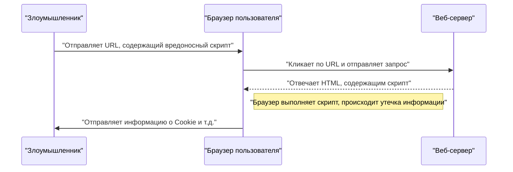
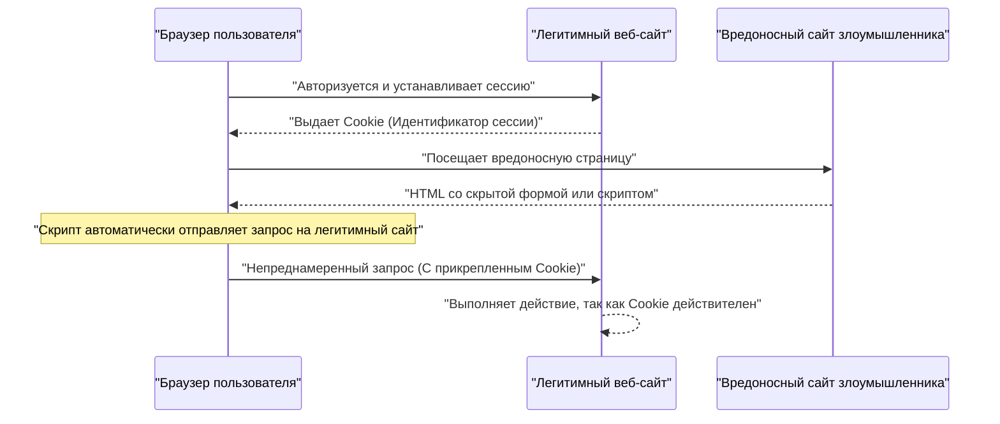

# Уязвимости веб-приложений и меры защиты (OWASP Top 10 и безопасное программирование)

В современных веб-приложениях меры безопасности являются неотъемлемым элементом. Методы атак с каждым днем становятся все более изощренными, и разработчикам необходимо постоянно получать знания о новейших угрозах и приобретать навыки **безопасного программирования** для их предотвращения. В этой статье мы подробно рассмотрим механизмы основных уязвимостей, последствия атак и конкретные методы защиты, опираясь на стандарт безопасности веб-приложений "OWASP Top 10".

## Что такое OWASP Top 10

OWASP (Open Worldwide Application Security Project) — это международная некоммерческая организация, цель которой — повышение безопасности программного обеспечения. Регулярно публикуемый отчет "OWASP Top 10" обобщает топ-10 самых серьезных рисков безопасности веб-приложений и используется многими компаниями и разработчиками в качестве стандарта безопасности.

В этой статье мы подробно остановимся на таких уязвимостях, как "Инъекции", "Межсайтовый скриптинг (XSS)", "Подделка межсайтовых запросов (CSRF)", "Подделка запросов на стороне сервера (SSRF)" и "Нарушение контроля доступа", которые оказывают наибольшее влияние и происходят наиболее часто.

---

## 1. Инъекции (Injection)

Инъекция — это уязвимость, возникающая при отправке ненадежных данных интерпретатору в качестве части команды или запроса. Вредоносные данные злоумышленника могут быть выполнены интерпретатором как непреднамеренная команда или получить доступ к данным без соответствующих прав.

### 1.1. SQL-инъекция

SQL-инъекция возникает в приложениях, взаимодействующих с базой данных, когда входные значения извне незаконно встраиваются в SQL-запрос. Это позволяет злоумышленнику читать конфиденциальную информацию в базе данных, изменять данные и даже захватывать контроль над сервером базы данных.

#### Механизм атаки

В качестве типичного примера рассмотрим процесс входа в систему с использованием имени пользователя и пароля.

**Пример уязвимого кода (PHP):**

```php
$username = $_POST['username'];
$password = $_POST['password'];

// Опасно: Входные значения напрямую объединяются в SQL-запрос
$query = "SELECT * FROM users WHERE username = '" . $username . "' AND password = '" . $password . "'";
$result = $mysqli->query($query);
```

Предположим, злоумышленник вводит в поле `username` следующую строку:

`admin' OR '1'='1`

Тогда выполняемый SQL-запрос будет выглядеть следующим образом:

```sql
SELECT * FROM users WHERE username = 'admin' OR '1'='1' AND password = ''
```

Поскольку `'1'='1'` всегда истинно (True), проверка пароля обходится, и злоумышленник может войти в систему как пользователь `admin`.

#### Методы защиты от SQL-инъекций

Самый надежный способ предотвратить SQL-инъекции — это использовать **подготовленные выражения** (параметризованные запросы). Это отделяет структуру SQL-запроса от данных и предотвращает интерпретацию входных значений как SQL-команд.

**Пример безопасного кода (PHP / PDO):**

```php
$username = $_POST['username'];
$password = $_POST['password'];

// Безопасно: Использование подготовленных выражений
$stmt = $pdo->prepare("SELECT * FROM users WHERE username = :username AND password = :password");
$stmt->bindParam(':username', $username);
$stmt->bindParam(':password', $password);
$stmt->execute();
$result = $stmt->fetchAll();
```

### 1.2. NoSQL-инъекция

В широко используемых сегодня NoSQL-базах данных (например, MongoDB) также происходят атаки внедрения. В NoSQL используется язык запросов, отличный от SQL (например, на основе JSON), но при недостаточной проверке входных значений можно вызвать непреднамеренное изменение структуры запроса.

**Пример уязвимого кода (JavaScript / Node.js + MongoDB):**

```javascript
const username = req.body.username;
const password = req.body.password;

// Опасно: Входные значения напрямую встраиваются в объект
db.collection('users').find({
    username: username,
    password: password
});
```

Если злоумышленник отправляет объект `{"$gt": ""}` в качестве `password`, запрос становится следующим:

```json
{
    "username": "admin",
    "password": {"$gt": ""}
}
```

Это означает условие "пароль больше пустой строки (т.е. любая строка)", в результате чего аутентификация обходится.

#### Методы защиты от NoSQL-инъекций

Для предотвращения NoSQL-инъекций важно строго проверять тип входных значений и убедиться, что объекты не передаются в те места, где ожидаются строки.

### 1.3. Инъекция команд ОС

Инъекция команд ОС — это уязвимость, при которой входные значения извне интерпретируются как часть команды оболочки, когда приложение выполняет системные команды через оболочку.

**Пример уязвимого кода (Python):**

```python
import os

domain = request.args.get('domain')
# Опасно: Входные значения напрямую объединяются с командой ОС
os.system(f"ping -c 4 {domain}")
```

Если злоумышленник вводит `example.com; rm -rf /` в качестве `domain`, после команды `ping` будет выполнена разрушительная команда.

#### Методы защиты от инъекций команд ОС

По возможности следует избегать вызова команд ОС и использовать встроенные API языка (библиотеки). Если выполнение команды ОС неизбежно, аргументы следует передавать в виде списка без использования оболочки.

**Пример безопасного кода (Python):**

```python
import subprocess

domain = request.args.get('domain')
# Безопасно: Передача аргументов в виде списка без использования оболочки
subprocess.run(["ping", "-c", "4", domain])
```

---

## 2. Межсайтовый скриптинг (XSS)

Межсайтовый скриптинг (XSS) — это атака, при которой злоумышленник внедряет вредоносный скрипт (обычно JavaScript) на веб-страницу и заставляет его выполняться в браузерах других пользователей. Это может привести к краже сессионных токенов, несанкционированным действиям с правами пользователя, перенаправлению на фишинговые сайты и т.д.

### Модель вероятности успеха атаки

Вероятность успеха клиентских атак, таких как XSS, зависит от того, насколько вероятно, что пользователь попадется в ловушку (например, нажмет на вредоносную ссылку). Это можно смоделировать математически следующим образом.

Если вероятность неудачи при одной попытке равна $ p $, а количество попыток (например, количество отправленных ссылок) равно $ n $, то вероятность того, что атака будет успешной хотя бы один раз $ P(success) $, можно выразить как:

$ P(success) = 1 - (1 - p)^n $

Из этой формулы видно, что при наличии уязвимости вероятность успеха атаки экспоненциально приближается к 1 по мере увеличения числа попыток. Следовательно, фундаментальное устранение уязвимостей является обязательным.

### Виды XSS

XSS в основном делится на следующие три вида.

#### 2.1. Reflected XSS (Отраженный XSS)

Атака, при которой пользователя заставляют перейти по URL-адресу, содержащему вредоносный скрипт, и этот скрипт отражается в ответе сервера (например, в сообщении об ошибке или результатах поиска) и выполняется.



#### 2.2. Stored XSS (Хранимый XSS)

Вредоносный скрипт сохраняется (Store) в базе данных или на доске объявлений, и выполняется, когда другие пользователи просматривают эти данные. Это опасный XSS с большим радиусом поражения.

#### 2.3. DOM-based XSS

Уязвимость, при которой JavaScript на стороне клиента (в браузере) выполняет несанкционированный скрипт в процессе работы с DOM (Document Object Model) без участия сервера.

### Методы защиты от XSS

Основной принцип защиты от XSS — это **экранирование (санитизация)**. При выводе входных значений пользователя на веб-страницу символы, имеющие особое значение в HTML (`<`, `>`, `&`, `"`, `'` и т.д.), преобразуются в безопасные строки.

**Пример уязвимого кода (JavaScript / Манипуляции с DOM):**

```html
<div id="greeting"></div>
<script>
    // Получение имени из параметров URL
    const params = new URLSearchParams(window.location.search);
    const name = params.get('name');
    
    // Опасно: Присваивание в innerHTML без экранирования входного значения
    document.getElementById('greeting').innerHTML = "Здравствуйте, " + name + "!";
</script>
```

**Пример безопасного кода (JavaScript):**

```html
<div id="greeting"></div>
<script>
    const params = new URLSearchParams(window.location.search);
    const name = params.get('name');
    
    // Безопасно: Использование textContent для обработки как текста
    document.getElementById('greeting').textContent = "Здравствуйте, " + name + "!";
</script>
```

Аналогично, при выводе на бэкенде (например, в PHP) используются соответствующие функции экранирования (например, `htmlspecialchars`). Кроме того, внедрение Content Security Policy (CSP) обеспечивает многоуровневую защиту, предотвращая выполнение скрипта даже в случае его внедрения.

---

## 3. Подделка межсайтовых запросов (CSRF)

CSRF — это атака, при которой пользователя заставляют невольно отправлять запросы в веб-приложение, в котором он авторизован. Это может привести к несанкционированным изменениям пароля, покупкам товаров, удалению аккаунта и т.д.

### Схема атаки CSRF



### Методы защиты от CSRF

Для предотвращения CSRF необходим механизм проверки того, что запрос действительно отправлен намеренно пользователем.

#### 3.1. CSRF-токен

Самый распространенный метод — это генерация случайного токена на сервере и его включение при отправке формы. Сервер проверяет отправленный токен и отклоняет запрос в случае несовпадения.

**Пример безопасного кода (HTML-форма):**

```html
<form action="/update_profile" method="POST">
    <!-- Встраивание CSRF-токена, сгенерированного на сервере -->
    <input type="hidden" name="csrf_token" value="abc123xyz456...">
    <input type="text" name="email">
    <button type="submit">Обновить</button>
</form>
```

#### 3.2. SameSite Cookie

Более современный подход заключается в использовании атрибута `SameSite` для Cookie. Установка `SameSite=Lax` или `SameSite=Strict` предотвращает отправку Cookie для запросов с других доменов, что в корне предотвращает атаки CSRF.

**Пример безопасного HTTP-заголовка:**

```http
Set-Cookie: session_id=12345; Secure; HttpOnly; SameSite=Lax
```

---

## 4. Подделка запросов на стороне сервера (SSRF)

SSRF — это атака, при которой, если веб-приложение имеет функцию получения данных по внешнему URL-адресу, сервер вынуждают отправить запрос на любой URL, указанный злоумышленником. Это позволяет получить доступ к внутренним сетевым системам, которые обычно недоступны извне (API метаданных облака, внутренние базы данных и т.д.).

### Угроза и влияние SSRF

В облачных средах (AWS, GCP, Azure и т.д.) доступ к метаданным, таким как учетные данные, может быть получен путем доступа к определенным IP-адресам (например, `169.254.169.254`) изнутри экземпляра. Если к этому API обратятся с помощью SSRF, это приведет к фатальной утечке информации.

### Методы защиты от SSRF

- **Ограничение URL с помощью белого списка**: Строгое управление доменами и IP-адресами, к которым приложению разрешен доступ, с помощью белого списка.
- **Запрет доступа к внутренним IP**: Блокировка запросов к частным IP-адресам, адресам замыкания на себя и локальным адресам канала, таким как `127.0.0.1`, `10.0.0.0/8`, `169.254.169.254`.
- **Проверка разрешения DNS**: Отправка запроса только после того, как будет подтверждено, что IP-адрес, полученный в результате разрешения домена URL-адреса, находится в разрешенном диапазоне.

---

## 5. Нарушение контроля доступа (Broken Access Control)

Нарушение контроля доступа (авторизации) — это уязвимость, позволяющая пользователям выполнять действия, превышающие их полномочия. В OWASP Top 10 2021 она занимает первое место как наиболее серьезный риск.

### Конкретные сценарии

- **IDOR (Insecure Direct Object References)**: Изменяя параметры URL (например, `user_id=123`), можно получить доступ к личной информации других пользователей.
- **Повышение привилегий**: Обычный пользователь может выполнять действия с правами администратора, напрямую обращаясь к URL-адресу панели управления (например, `/admin/dashboard`).

### Методы защиты контроля доступа

- **Отказ по умолчанию**: Запрет всех видов доступа по умолчанию и предоставление доступа только явно авторизованным пользователям и ролям (внедрение RBAC/ABAC).
- **Строгая проверка прав на сервере**: Проверка прав не только на стороне клиента (скрытие интерфейса в браузере и т.д.), но и непосредственно перед выполнением бэкенд-процессов.
- **Использование трудноугадываемых идентификаторов**: Использование случайных идентификаторов, таких как UUID, вместо последовательных ID для ссылки на объекты.

---

## 6. На пути к безопасной разработке веб-приложений

Уязвимости веб-приложений чаще всего возникают из-за отсутствия понимания **безопасности** или недостатка знаний на этапе разработки. Важно внедрить следующие практики в процесс разработки:

1. **Безопасность на этапе проектирования (Security by Design)**: Определение требований безопасности на этапе планирования и проектирования и их интеграция в архитектуру.
2. **Использование инструментов статического и динамического анализа**: Внедрение SAST (статическое тестирование безопасности приложений) и DAST (динамическое тестирование безопасности приложений) в конвейер CI/CD для раннего обнаружения уязвимостей.
3. **Управление зависимостями**: Постоянный мониторинг информации об уязвимостях (CVE) сторонних библиотек и фреймворков и быстрое применение обновлений.
4. **Непрерывное обучение**: Непрерывное изучение последних тенденций угроз и методов защиты в сообществах, таких как OWASP.

### Модель расчета области влияния

Риск от неустраненной уязвимости можно количественно оценить по следующей формуле:

$ Risk = Threat 	imes Vulnerability 	imes Impact $

- **Threat (Угроза)**: Вероятность наличия злоумышленника и частота атак.
- **Vulnerability (Уязвимость)**: Степень слабости системы и легкость ее использования.
- **Impact (Влияние)**: Ущерб для бизнеса в результате утечки информации или остановки системы (финансовые и репутационные потери).

Эта формула показывает, что если хотя бы один из параметров приближается к нулю, общий риск может быть значительно снижен. Главная обязанность разработчиков — свести к минимуму "Уязвимость (Vulnerability)".

---

## Заключение

В этой статье мы рассмотрели механизмы основных уязвимостей веб-приложений (Инъекции, XSS, CSRF, SSRF, нарушение контроля доступа) согласно OWASP Top 10 и конкретные методы **безопасного программирования**.

Безопасность — это не разовая мера. В повседневном процессе разработки необходимо постоянно писать код с учетом безопасности, проводить непрерывные проверки и тестирование для создания безопасных и надежных веб-приложений.

## 7. Подробная архитектура защиты и эксплуатация (Part 1)

В веб-приложениях корпоративного масштаба помимо мер на уровне программирования, упомянутых выше, необходима многоуровневая защита на уровне инфраструктуры.

### 7.1 Внедрение WAF (Web Application Firewall)

Web Application Firewall (WAF) — это система, которая отслеживает и фильтрует трафик к веб-приложению и блокирует атаки, такие как SQL-инъекции и межсайтовый скриптинг (XSS), до того, как они достигнут приложения. WAF повышает свою способность реагировать на атаки нулевого дня за счет сочетания обнаружения на основе сигнатур и обнаружения на основе поведения (обнаружение аномалий).

### 7.2 Создание безопасного конвейера CI/CD

Основываясь на концепции DevSecOps, важно автоматизировать и интегрировать тестирование безопасности в конвейер непрерывной интеграции/непрерывной доставки (CI/CD).

* **SAST (Static Application Security Testing):** Статически анализирует исходный код для обнаружения шаблонов кодирования, содержащих уязвимости.
* **DAST (Dynamic Application Security Testing):** Отправляет смоделированные запросы атак в запущенное приложение для обнаружения уязвимостей во время выполнения.
* **SCA (Software Composition Analysis):** Обнаруживает известные уязвимости (CVE) в используемых библиотеках и компонентах с открытым исходным кодом и предлагает их обновить.

### 7.3 Регулярное проведение тестов на проникновение

Помимо сканирования с помощью автоматизированных инструментов, регулярное проведение ручных тестов на проникновение (пентестов) специалистами по безопасности может выявить недостатки бизнес-логики и уязвимости сложных систем управления доступом, которые трудно обнаружить с помощью инструментов.

## 8. Подробная архитектура защиты и эксплуатация (Part 2)

В веб-приложениях корпоративного масштаба помимо мер на уровне программирования, упомянутых выше, необходима многоуровневая защита на уровне инфраструктуры.

### 8.1 Внедрение WAF (Web Application Firewall)

Web Application Firewall (WAF) — это система, которая отслеживает и фильтрует трафик к веб-приложению и блокирует атаки, такие как SQL-инъекции и межсайтовый скриптинг (XSS), до того, как они достигнут приложения. WAF повышает свою способность реагировать на атаки нулевого дня за счет сочетания обнаружения на основе сигнатур и обнаружения на основе поведения (обнаружение аномалий).

### 8.2 Создание безопасного конвейера CI/CD

Основываясь на концепции DevSecOps, важно автоматизировать и интегрировать тестирование безопасности в конвейер непрерывной интеграции/непрерывной доставки (CI/CD).

* **SAST (Static Application Security Testing):** Статически анализирует исходный код для обнаружения шаблонов кодирования, содержащих уязвимости.
* **DAST (Dynamic Application Security Testing):** Отправляет смоделированные запросы атак в запущенное приложение для обнаружения уязвимостей во время выполнения.
* **SCA (Software Composition Analysis):** Обнаруживает известные уязвимости (CVE) в используемых библиотеках и компонентах с открытым исходным кодом и предлагает их обновить.

### 8.3 Регулярное проведение тестов на проникновение

Помимо сканирования с помощью автоматизированных инструментов, регулярное проведение ручных тестов на проникновение (пентестов) специалистами по безопасности может выявить недостатки бизнес-логики и уязвимости сложных систем управления доступом, которые трудно обнаружить с помощью инструментов.

## 9. Подробная архитектура защиты и эксплуатация (Part 3)

В веб-приложениях корпоративного масштаба помимо мер на уровне программирования, упомянутых выше, необходима многоуровневая защита на уровне инфраструктуры.

### 9.1 Внедрение WAF (Web Application Firewall)

Web Application Firewall (WAF) — это система, которая отслеживает и фильтрует трафик к веб-приложению и блокирует атаки, такие как SQL-инъекции и межсайтовый скриптинг (XSS), до того, как они достигнут приложения. WAF повышает свою способность реагировать на атаки нулевого дня за счет сочетания обнаружения на основе сигнатур и обнаружения на основе поведения (обнаружение аномалий).

### 9.2 Создание безопасного конвейера CI/CD

Основываясь на концепции DevSecOps, важно автоматизировать и интегрировать тестирование безопасности в конвейер непрерывной интеграции/непрерывной доставки (CI/CD).

* **SAST (Static Application Security Testing):** Статически анализирует исходный код для обнаружения шаблонов кодирования, содержащих уязвимости.
* **DAST (Dynamic Application Security Testing):** Отправляет смоделированные запросы атак в запущенное приложение для обнаружения уязвимостей во время выполнения.
* **SCA (Software Composition Analysis):** Обнаруживает известные уязвимости (CVE) в используемых библиотеках и компонентах с открытым исходным кодом и предлагает их обновить.

### 9.3 Регулярное проведение тестов на проникновение

Помимо сканирования с помощью автоматизированных инструментов, регулярное проведение ручных тестов на проникновение (пентестов) специалистами по безопасности может выявить недостатки бизнес-логики и уязвимости сложных систем управления доступом, которые трудно обнаружить с помощью инструментов.

## 10. Подробная архитектура защиты и эксплуатация (Part 4)

В веб-приложениях корпоративного масштаба помимо мер на уровне программирования, упомянутых выше, необходима многоуровневая защита на уровне инфраструктуры.

### 10.1 Внедрение WAF (Web Application Firewall)

Web Application Firewall (WAF) — это система, которая отслеживает и фильтрует трафик к веб-приложению и блокирует атаки, такие как SQL-инъекции и межсайтовый скриптинг (XSS), до того, как они достигнут приложения. WAF повышает свою способность реагировать на атаки нулевого дня за счет сочетания обнаружения на основе сигнатур и обнаружения на основе поведения (обнаружение аномалий).

### 10.2 Создание безопасного конвейера CI/CD

Основываясь на концепции DevSecOps, важно автоматизировать и интегрировать тестирование безопасности в конвейер непрерывной интеграции/непрерывной доставки (CI/CD).

* **SAST (Static Application Security Testing):** Статически анализирует исходный код для обнаружения шаблонов кодирования, содержащих уязвимости.
* **DAST (Dynamic Application Security Testing):** Отправляет смоделированные запросы атак в запущенное приложение для обнаружения уязвимостей во время выполнения.
* **SCA (Software Composition Analysis):** Обнаруживает известные уязвимости (CVE) в используемых библиотеках и компонентах с открытым исходным кодом и предлагает их обновить.

### 10.3 Регулярное проведение тестов на проникновение

Помимо сканирования с помощью автоматизированных инструментов, регулярное проведение ручных тестов на проникновение (пентестов) специалистами по безопасности может выявить недостатки бизнес-логики и уязвимости сложных систем управления доступом, которые трудно обнаружить с помощью инструментов.

## 11. Подробная архитектура защиты и эксплуатация (Part 5)

В веб-приложениях корпоративного масштаба помимо мер на уровне программирования, упомянутых выше, необходима многоуровневая защита на уровне инфраструктуры.

### 11.1 Внедрение WAF (Web Application Firewall)

Web Application Firewall (WAF) — это система, которая отслеживает и фильтрует трафик к веб-приложению и блокирует атаки, такие как SQL-инъекции и межсайтовый скриптинг (XSS), до того, как они достигнут приложения. WAF повышает свою способность реагировать на атаки нулевого дня за счет сочетания обнаружения на основе сигнатур и обнаружения на основе поведения (обнаружение аномалий).

### 11.2 Создание безопасного конвейера CI/CD

Основываясь на концепции DevSecOps, важно автоматизировать и интегрировать тестирование безопасности в конвейер непрерывной интеграции/непрерывной доставки (CI/CD).

* **SAST (Static Application Security Testing):** Статически анализирует исходный код для обнаружения шаблонов кодирования, содержащих уязвимости.
* **DAST (Dynamic Application Security Testing):** Отправляет смоделированные запросы атак в запущенное приложение для обнаружения уязвимостей во время выполнения.
* **SCA (Software Composition Analysis):** Обнаруживает известные уязвимости (CVE) в используемых библиотеках и компонентах с открытым исходным кодом и предлагает их обновить.

### 11.3 Регулярное проведение тестов на проникновение

Помимо сканирования с помощью автоматизированных инструментов, регулярное проведение ручных тестов на проникновение (пентестов) специалистами по безопасности может выявить недостатки бизнес-логики и уязвимости сложных систем управления доступом, которые трудно обнаружить с помощью инструментов.

## 12. Подробная архитектура защиты и эксплуатация (Part 6)

В веб-приложениях корпоративного масштаба помимо мер на уровне программирования, упомянутых выше, необходима многоуровневая защита на уровне инфраструктуры.

### 12.1 Внедрение WAF (Web Application Firewall)

Web Application Firewall (WAF) — это система, которая отслеживает и фильтрует трафик к веб-приложению и блокирует атаки, такие как SQL-инъекции и межсайтовый скриптинг (XSS), до того, как они достигнут приложения. WAF повышает свою способность реагировать на атаки нулевого дня за счет сочетания обнаружения на основе сигнатур и обнаружения на основе поведения (обнаружение аномалий).

### 12.2 Создание безопасного конвейера CI/CD

Основываясь на концепции DevSecOps, важно автоматизировать и интегрировать тестирование безопасности в конвейер непрерывной интеграции/непрерывной доставки (CI/CD).

* **SAST (Static Application Security Testing):** Статически анализирует исходный код для обнаружения шаблонов кодирования, содержащих уязвимости.
* **DAST (Dynamic Application Security Testing):** Отправляет смоделированные запросы атак в запущенное приложение для обнаружения уязвимостей во время выполнения.
* **SCA (Software Composition Analysis):** Обнаруживает известные уязвимости (CVE) в используемых библиотеках и компонентах с открытым исходным кодом и предлагает их обновить.

### 12.3 Регулярное проведение тестов на проникновение

Помимо сканирования с помощью автоматизированных инструментов, регулярное проведение ручных тестов на проникновение (пентестов) специалистами по безопасности может выявить недостатки бизнес-логики и уязвимости сложных систем управления доступом, которые трудно обнаружить с помощью инструментов.

## 13. Подробная архитектура защиты и эксплуатация (Part 7)

В веб-приложениях корпоративного масштаба помимо мер на уровне программирования, упомянутых выше, необходима многоуровневая защита на уровне инфраструктуры.

### 13.1 Внедрение WAF (Web Application Firewall)

Web Application Firewall (WAF) — это система, которая отслеживает и фильтрует трафик к веб-приложению и блокирует атаки, такие как SQL-инъекции и межсайтовый скриптинг (XSS), до того, как они достигнут приложения. WAF повышает свою способность реагировать на атаки нулевого дня за счет сочетания обнаружения на основе сигнатур и обнаружения на основе поведения (обнаружение аномалий).

### 13.2 Создание безопасного конвейера CI/CD

Основываясь на концепции DevSecOps, важно автоматизировать и интегрировать тестирование безопасности в конвейер непрерывной интеграции/непрерывной доставки (CI/CD).

* **SAST (Static Application Security Testing):** Статически анализирует исходный код для обнаружения шаблонов кодирования, содержащих уязвимости.
* **DAST (Dynamic Application Security Testing):** Отправляет смоделированные запросы атак в запущенное приложение для обнаружения уязвимостей во время выполнения.
* **SCA (Software Composition Analysis):** Обнаруживает известные уязвимости (CVE) в используемых библиотеках и компонентах с открытым исходным кодом и предлагает их обновить.

### 13.3 Регулярное проведение тестов на проникновение

Помимо сканирования с помощью автоматизированных инструментов, регулярное проведение ручных тестов на проникновение (пентестов) специалистами по безопасности может выявить недостатки бизнес-логики и уязвимости сложных систем управления доступом, которые трудно обнаружить с помощью инструментов.

## 14. Подробная архитектура защиты и эксплуатация (Part 8)

В веб-приложениях корпоративного масштаба помимо мер на уровне программирования, упомянутых выше, необходима многоуровневая защита на уровне инфраструктуры.

### 14.1 Внедрение WAF (Web Application Firewall)

Web Application Firewall (WAF) — это система, которая отслеживает и фильтрует трафик к веб-приложению и блокирует атаки, такие как SQL-инъекции и межсайтовый скриптинг (XSS), до того, как они достигнут приложения. WAF повышает свою способность реагировать на атаки нулевого дня за счет сочетания обнаружения на основе сигнатур и обнаружения на основе поведения (обнаружение аномалий).

### 14.2 Создание безопасного конвейера CI/CD

Основываясь на концепции DevSecOps, важно автоматизировать и интегрировать тестирование безопасности в конвейер непрерывной интеграции/непрерывной доставки (CI/CD).

* **SAST (Static Application Security Testing):** Статически анализирует исходный код для обнаружения шаблонов кодирования, содержащих уязвимости.
* **DAST (Dynamic Application Security Testing):** Отправляет смоделированные запросы атак в запущенное приложение для обнаружения уязвимостей во время выполнения.
* **SCA (Software Composition Analysis):** Обнаруживает известные уязвимости (CVE) в используемых библиотеках и компонентах с открытым исходным кодом и предлагает их обновить.

### 14.3 Регулярное проведение тестов на проникновение

Помимо сканирования с помощью автоматизированных инструментов, регулярное проведение ручных тестов на проникновение (пентестов) специалистами по безопасности может выявить недостатки бизнес-логики и уязвимости сложных систем управления доступом, которые трудно обнаружить с помощью инструментов.

## 15. Подробная архитектура защиты и эксплуатация (Part 9)

В веб-приложениях корпоративного масштаба помимо мер на уровне программирования, упомянутых выше, необходима многоуровневая защита на уровне инфраструктуры.

### 15.1 Внедрение WAF (Web Application Firewall)

Web Application Firewall (WAF) — это система, которая отслеживает и фильтрует трафик к веб-приложению и блокирует атаки, такие как SQL-инъекции и межсайтовый скриптинг (XSS), до того, как они достигнут приложения. WAF повышает свою способность реагировать на атаки нулевого дня за счет сочетания обнаружения на основе сигнатур и обнаружения на основе поведения (обнаружение аномалий).

### 15.2 Создание безопасного конвейера CI/CD

Основываясь на концепции DevSecOps, важно автоматизировать и интегрировать тестирование безопасности в конвейер непрерывной интеграции/непрерывной доставки (CI/CD).

* **SAST (Static Application Security Testing):** Статически анализирует исходный код для обнаружения шаблонов кодирования, содержащих уязвимости.
* **DAST (Dynamic Application Security Testing):** Отправляет смоделированные запросы атак в запущенное приложение для обнаружения уязвимостей во время выполнения.
* **SCA (Software Composition Analysis):** Обнаруживает известные уязвимости (CVE) в используемых библиотеках и компонентах с открытым исходным кодом и предлагает их обновить.

### 15.3 Регулярное проведение тестов на проникновение

Помимо сканирования с помощью автоматизированных инструментов, регулярное проведение ручных тестов на проникновение (пентестов) специалистами по безопасности может выявить недостатки бизнес-логики и уязвимости сложных систем управления доступом, которые трудно обнаружить с помощью инструментов.

## 16. Подробная архитектура защиты и эксплуатация (Part 10)

В веб-приложениях корпоративного масштаба помимо мер на уровне программирования, упомянутых выше, необходима многоуровневая защита на уровне инфраструктуры.

### 16.1 Внедрение WAF (Web Application Firewall)

Web Application Firewall (WAF) — это система, которая отслеживает и фильтрует трафик к веб-приложению и блокирует атаки, такие как SQL-инъекции и межсайтовый скриптинг (XSS), до того, как они достигнут приложения. WAF повышает свою способность реагировать на атаки нулевого дня за счет сочетания обнаружения на основе сигнатур и обнаружения на основе поведения (обнаружение аномалий).

### 16.2 Создание безопасного конвейера CI/CD

Основываясь на концепции DevSecOps, важно автоматизировать и интегрировать тестирование безопасности в конвейер непрерывной интеграции/непрерывной доставки (CI/CD).

* **SAST (Static Application Security Testing):** Статически анализирует исходный код для обнаружения шаблонов кодирования, содержащих уязвимости.
* **DAST (Dynamic Application Security Testing):** Отправляет смоделированные запросы атак в запущенное приложение для обнаружения уязвимостей во время выполнения.
* **SCA (Software Composition Analysis):** Обнаруживает известные уязвимости (CVE) в используемых библиотеках и компонентах с открытым исходным кодом и предлагает их обновить.

### 16.3 Регулярное проведение тестов на проникновение

Помимо сканирования с помощью автоматизированных инструментов, регулярное проведение ручных тестов на проникновение (пентестов) специалистами по безопасности может выявить недостатки бизнес-логики и уязвимости сложных систем управления доступом, которые трудно обнаружить с помощью инструментов.

## 17. Подробная архитектура защиты и эксплуатация (Part 11)

В веб-приложениях корпоративного масштаба помимо мер на уровне программирования, упомянутых выше, необходима многоуровневая защита на уровне инфраструктуры.

### 17.1 Внедрение WAF (Web Application Firewall)

Web Application Firewall (WAF) — это система, которая отслеживает и фильтрует трафик к веб-приложению и блокирует атаки, такие как SQL-инъекции и межсайтовый скриптинг (XSS), до того, как они достигнут приложения. WAF повышает свою способность реагировать на атаки нулевого дня за счет сочетания обнаружения на основе сигнатур и обнаружения на основе поведения (обнаружение аномалий).

### 17.2 Создание безопасного конвейера CI/CD

Основываясь на концепции DevSecOps, важно автоматизировать и интегрировать тестирование безопасности в конвейер непрерывной интеграции/непрерывной доставки (CI/CD).

* **SAST (Static Application Security Testing):** Статически анализирует исходный код для обнаружения шаблонов кодирования, содержащих уязвимости.
* **DAST (Dynamic Application Security Testing):** Отправляет смоделированные запросы атак в запущенное приложение для обнаружения уязвимостей во время выполнения.
* **SCA (Software Composition Analysis):** Обнаруживает известные уязвимости (CVE) в используемых библиотеках и компонентах с открытым исходным кодом и предлагает их обновить.

### 17.3 Регулярное проведение тестов на проникновение

Помимо сканирования с помощью автоматизированных инструментов, регулярное проведение ручных тестов на проникновение (пентестов) специалистами по безопасности может выявить недостатки бизнес-логики и уязвимости сложных систем управления доступом, которые трудно обнаружить с помощью инструментов.

## 18. Подробная архитектура защиты и эксплуатация (Part 12)

В веб-приложениях корпоративного масштаба помимо мер на уровне программирования, упомянутых выше, необходима многоуровневая защита на уровне инфраструктуры.

### 18.1 Внедрение WAF (Web Application Firewall)

Web Application Firewall (WAF) — это система, которая отслеживает и фильтрует трафик к веб-приложению и блокирует атаки, такие как SQL-инъекции и межсайтовый скриптинг (XSS), до того, как они достигнут приложения. WAF повышает свою способность реагировать на атаки нулевого дня за счет сочетания обнаружения на основе сигнатур и обнаружения на основе поведения (обнаружение аномалий).

### 18.2 Создание безопасного конвейера CI/CD

Основываясь на концепции DevSecOps, важно автоматизировать и интегрировать тестирование безопасности в конвейер непрерывной интеграции/непрерывной доставки (CI/CD).

* **SAST (Static Application Security Testing):** Статически анализирует исходный код для обнаружения шаблонов кодирования, содержащих уязвимости.
* **DAST (Dynamic Application Security Testing):** Отправляет смоделированные запросы атак в запущенное приложение для обнаружения уязвимостей во время выполнения.
* **SCA (Software Composition Analysis):** Обнаруживает известные уязвимости (CVE) в используемых библиотеках и компонентах с открытым исходным кодом и предлагает их обновить.

### 18.3 Регулярное проведение тестов на проникновение

Помимо сканирования с помощью автоматизированных инструментов, регулярное проведение ручных тестов на проникновение (пентестов) специалистами по безопасности может выявить недостатки бизнес-логики и уязвимости сложных систем управления доступом, которые трудно обнаружить с помощью инструментов.

## 19. Подробная архитектура защиты и эксплуатация (Part 13)

В веб-приложениях корпоративного масштаба помимо мер на уровне программирования, упомянутых выше, необходима многоуровневая защита на уровне инфраструктуры.

### 19.1 Внедрение WAF (Web Application Firewall)

Web Application Firewall (WAF) — это система, которая отслеживает и фильтрует трафик к веб-приложению и блокирует атаки, такие как SQL-инъекции и межсайтовый скриптинг (XSS), до того, как они достигнут приложения. WAF повышает свою способность реагировать на атаки нулевого дня за счет сочетания обнаружения на основе сигнатур и обнаружения на основе поведения (обнаружение аномалий).

### 19.2 Создание безопасного конвейера CI/CD

Основываясь на концепции DevSecOps, важно автоматизировать и интегрировать тестирование безопасности в конвейер непрерывной интеграции/непрерывной доставки (CI/CD).

* **SAST (Static Application Security Testing):** Статически анализирует исходный код для обнаружения шаблонов кодирования, содержащих уязвимости.
* **DAST (Dynamic Application Security Testing):** Отправляет смоделированные запросы атак в запущенное приложение для обнаружения уязвимостей во время выполнения.
* **SCA (Software Composition Analysis):** Обнаруживает известные уязвимости (CVE) в используемых библиотеках и компонентах с открытым исходным кодом и предлагает их обновить.

### 19.3 Регулярное проведение тестов на проникновение

Помимо сканирования с помощью автоматизированных инструментов, регулярное проведение ручных тестов на проникновение (пентестов) специалистами по безопасности может выявить недостатки бизнес-логики и уязвимости сложных систем управления доступом, которые трудно обнаружить с помощью инструментов.

## 20. Подробная архитектура защиты и эксплуатация (Part 14)

В веб-приложениях корпоративного масштаба помимо мер на уровне программирования, упомянутых выше, необходима многоуровневая защита на уровне инфраструктуры.

### 20.1 Внедрение WAF (Web Application Firewall)

Web Application Firewall (WAF) — это система, которая отслеживает и фильтрует трафик к веб-приложению и блокирует атаки, такие как SQL-инъекции и межсайтовый скриптинг (XSS), до того, как они достигнут приложения. WAF повышает свою способность реагировать на атаки нулевого дня за счет сочетания обнаружения на основе сигнатур и обнаружения на основе поведения (обнаружение аномалий).

### 20.2 Создание безопасного конвейера CI/CD

Основываясь на концепции DevSecOps, важно автоматизировать и интегрировать тестирование безопасности в конвейер непрерывной интеграции/непрерывной доставки (CI/CD).

* **SAST (Static Application Security Testing):** Статически анализирует исходный код для обнаружения шаблонов кодирования, содержащих уязвимости.
* **DAST (Dynamic Application Security Testing):** Отправляет смоделированные запросы атак в запущенное приложение для обнаружения уязвимостей во время выполнения.
* **SCA (Software Composition Analysis):** Обнаруживает известные уязвимости (CVE) в используемых библиотеках и компонентах с открытым исходным кодом и предлагает их обновить.

### 20.3 Регулярное проведение тестов на проникновение

Помимо сканирования с помощью автоматизированных инструментов, регулярное проведение ручных тестов на проникновение (пентестов) специалистами по безопасности может выявить недостатки бизнес-логики и уязвимости сложных систем управления доступом, которые трудно обнаружить с помощью инструментов.\n