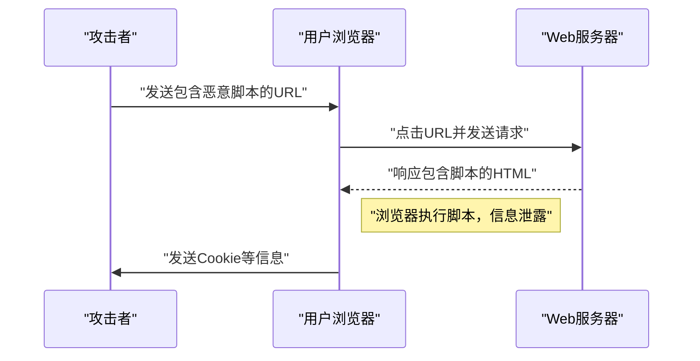
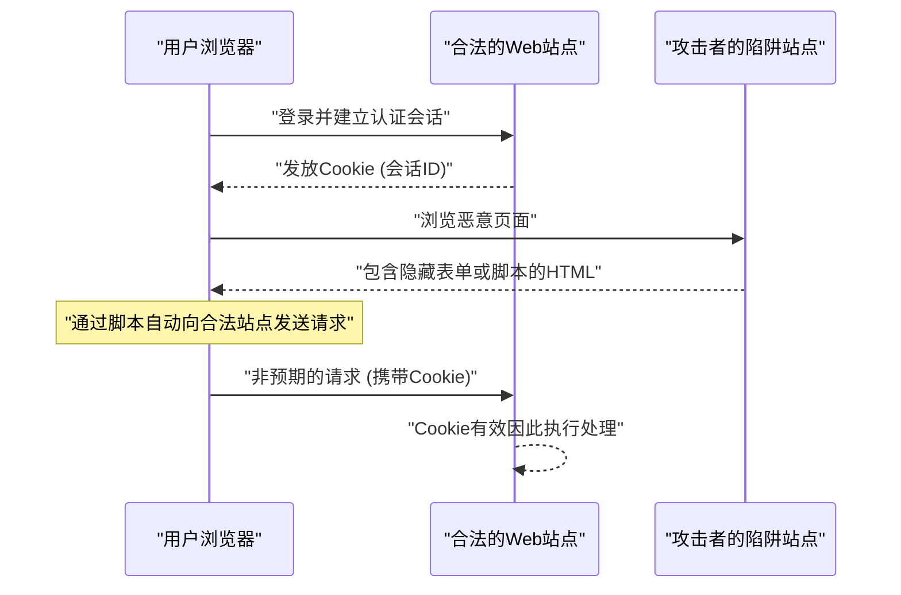

# Web应用程序漏洞与对策（OWASP Top 10与安全编码）

在现代Web应用程序中，安全对策是不可或缺的要素。攻击手法日益高度化，开发者必须不断掌握最新威胁相关的知识，以及防御这些威胁的 **安全编码** 技术。本文将以Web应用程序安全的事实标准“OWASP Top 10”为基础，针对主要漏洞的机制、攻击造成的影响，以及具体的防御手法，进行非常详细的解说。

## 什么是 OWASP Top 10

OWASP（Open Worldwide Application Security Project）是一个旨在提高软件安全性的国际非营利组织。OWASP定期发布的“OWASP Top 10”是一份总结了Web应用程序中最严重的十大安全风险的报告，许多企业和开发者将其作为安全标准采用。

本文将特别聚焦于影响巨大且频繁发生的“注入”、“跨站脚本（XSS）”、“跨站请求伪造（CSRF）”、“服务器端请求伪造（SSRF）”和“失效的访问控制”等漏洞，并进行深入探讨。

---

## 1. 注入（Injection）

注入是由于不可信的数据作为命令或查询的一部分发送给解释器而产生的漏洞。攻击者的恶意数据可能会被解释器作为意外命令执行，或者在没有适当权限的情况下访问数据。

### 1.1. SQL注入

SQL注入发生在与数据库交互的应用程序中，当外部输入值被非法嵌入到SQL查询中时就会产生。通过这种方式，攻击者可以读取数据库中的机密信息、篡改数据，甚至夺取数据库服务器的控制权。

#### 攻击机制

作为一个典型的例子，让我们考虑一个使用用户名和密码的登录处理。

**脆弱的代码示例（PHP）:**

```php
$username = $_POST['username'];
$password = $_POST['password'];

// 危险：直接将输入值拼接到SQL查询中
$query = "SELECT * FROM users WHERE username = '" . $username . "' AND password = '" . $password . "'";
$result = $mysqli->query($query);
```

假设攻击者在 `username` 字段中输入了以下字符串：

`admin' OR '1'='1`

那么，执行的SQL查询将如下所示：

```sql
SELECT * FROM users WHERE username = 'admin' OR '1'='1' AND password = ''
```

由于 `'1'='1'` 始终为真（True），因此密码验证会被绕过，攻击者便能够以 `admin` 用户的身份登录。

#### SQL注入的防御手法

防止SQL注入的最可靠方法是使用 **预处理语句** （参数化查询）。这样可以将SQL查询的结构与数据分离，防止输入值被解释为SQL命令。

**已修复的代码示例（PHP / PDO）:**

```php
$username = $_POST['username'];
$password = $_POST['password'];

// 安全：使用预处理语句
$stmt = $pdo->prepare("SELECT * FROM users WHERE username = :username AND password = :password");
$stmt->bindParam(':username', $username);
$stmt->bindParam(':password', $password);
$stmt->execute();
$result = $stmt->fetchAll();
```

### 1.2. NoSQL注入

在近年来普及的NoSQL数据库（如MongoDB）中，也会发生注入攻击。虽然NoSQL使用不同于SQL的查询语言（如基于JSON等），但如果对输入值的验证不充分，也可能导致意外改变查询结构。

**脆弱的代码示例（JavaScript / Node.js + MongoDB）:**

```javascript
const username = req.body.username;
const password = req.body.password;

// 危险：直接将输入值嵌入对象中
db.collection('users').find({
    username: username,
    password: password
});
```

如果攻击者向 `password` 发送了 `{"$gt": ""}` 这样一个对象，查询将变成如下形式：

```json
{
    "username": "admin",
    "password": {"$gt": ""}
}
```

这变成了“密码大于空字符串（即任意字符串）”的条件，从而突破了身份验证。

#### NoSQL注入的防御手法

要防止NoSQL注入，关键是要对输入值进行严格的类型检查，确保传递给期望字符串的地方不会被传入对象。

### 1.3. OS命令注入

OS命令注入是指应用程序通过shell执行系统命令时，外部输入值被解释为shell命令一部分的漏洞。

**脆弱的代码示例（Python）:**

```python
import os

domain = request.args.get('domain')
# 危险：直接将输入值拼接到OS命令中
os.system(f"ping -c 4 {domain}")
```

如果攻击者在 `domain` 中输入 `example.com; rm -rf /`，那么在 `ping` 命令之后将会执行破坏性的命令。

#### OS命令注入的防御手法

应尽可能避免调用OS命令，而应使用语言内置的API（库）。如果迫不得已要执行OS命令，应不通过shell，而是以列表形式传递参数。

**已修复的代码示例（Python）:**

```python
import subprocess

domain = request.args.get('domain')
# 安全：不通过shell，将参数作为列表传递
subprocess.run(["ping", "-c", "4", domain])
```

---

## 2. 跨站脚本（XSS）

跨站脚本（XSS）是指攻击者将恶意脚本（通常是JavaScript）注入到Web页面中，并在其他用户的浏览器上执行的攻击。这会导致会话令牌被窃取、利用用户权限进行非法操作、重定向到钓鱼网站等。

### 攻击的成功概率模型

在XSS等客户端攻击中，攻击成功的概率取决于用户落入陷阱（例如点击恶意链接）的概率。如果用数学公式将其模型化，如下所示：

假设攻击至少成功1次的概率为 $ P(success) $，单次尝试失败的概率为 $ p $，尝试次数（如发送的链接数）为 $ n $，则可以表示为：

$ P(success) = 1 - (1 - p)^n $

从这个公式可以看出，如果存在漏洞，随着攻击尝试次数的增加，攻击成功的概率呈指数级地逼近1。因此，从根本上消除漏洞是必不可少的。

### XSS的种类

XSS主要分为以下三种：

#### 2.1. 反射型XSS（Reflected XSS）

诱使让用户点击包含恶意脚本的URL，服务器的响应（如错误信息或搜索结果）中将该脚本原样反射（Reflect）输出从而被执行。



#### 2.2. 存储型XSS（Stored XSS）

恶意脚本被保存（Store）在数据库或留言板中，当其他用户查看该数据时，脚本就会被执行。这是一种危险的XSS，受害范围往往很大。

#### 2.3. DOM-based XSS

不经过服务器，客户端（浏览器上）的JavaScript在操作DOM（文档对象模型）的过程中，执行了非法脚本的漏洞。

### XSS的防御手法

防止XSS的基本原则是 **转义（消毒）**。在将用户输入值输出到Web页面时，将HTML中具有特殊含义的字符（如 `<`、`>`、`&`、`"`、`'` 等）转换为无害的字符串。

**脆弱的代码示例（JavaScript / DOM操作）:**

```html
<div id="greeting"></div>
<script>
    // 从URL参数中获取名字
    const params = new URLSearchParams(window.location.search);
    const name = params.get('name');
    
    // 危险：未转义输入值就赋值给 innerHTML
    document.getElementById('greeting').innerHTML = "你好，" + name + "！";
</script>
```

**已修复的代码示例（JavaScript）:**

```html
<div id="greeting"></div>
<script>
    const params = new URLSearchParams(window.location.search);
    const name = params.get('name');
    
    // 安全：使用 textContent 作为文本处理
    document.getElementById('greeting').textContent = "你好，" + name + "！";
</script>
```

在后端（如PHP）输出时，同样要使用合适的转义函数（如 `htmlspecialchars` 等）。此外，通过引入内容安全策略（CSP），即使万一被注入了脚本，也能防止其执行，实现多层防御。

---

## 3. 跨站请求伪造（CSRF）

CSRF是指攻击者强制用户向已认证的Web应用程序发送非预期请求的攻击。这将导致用户的非预期密码修改、商品购买、注销处理等行为被执行。

### CSRF的攻击流程



### CSRF的防御手法

为了防止CSRF，需要有一种机制来确认请求是否真的是出于用户的意愿。

#### 3.1. CSRF Token

最常见的对策是在服务器端生成一个随机令牌（Token），并在提交表单时包含该令牌。服务器验证提交的令牌，如果不一致则拒绝该请求。

**已修复的代码示例（HTML表单）:**

```html
<form action="/update_profile" method="POST">
    <!-- 嵌入服务器生成的CSRF令牌 -->
    <input type="hidden" name="csrf_token" value="abc123xyz456...">
    <input type="text" name="email">
    <button type="submit">更新</button>
</form>
```

#### 3.2. SameSite Cookie

作为更现代的对策，有利用Cookie的 `SameSite` 属性的方法。通过设置 `SameSite=Lax` 或 `SameSite=Strict`，来自不同域的请求将不再发送Cookie，从而从根本上防止CSRF攻击。

**已修复的HTTP头示例:**

```http
Set-Cookie: session_id=12345; Secure; HttpOnly; SameSite=Lax
```

---

## 4. 服务器端请求伪造（SSRF）

SSRF是指在Web应用程序具有从外部URL获取数据的功能时，攻击者让服务器向其指定的任意URL发送请求的攻击。借此，攻击者可以访问通常从外部无法访问的内部网络系统（云元数据API、内部数据库等）。

### SSRF的威胁与影响

在云环境（AWS、GCP、Azure等）中，通过从实例内部访问特定IP地址（例如：`169.254.169.254`），可能会获取凭据等元数据。如果利用SSRF访问该API，将导致致命的信息泄露。

### SSRF的防御手法

- **通过白名单限制URL**: 使用严格的白名单管理应用程序可访问的域名或IP地址。
- **禁止访问内部IP**: 阻止对私有IP地址、环回地址、链路本地地址（如 `127.0.0.1`、`10.0.0.0/8`、`169.254.169.254` 等）的请求。
- **验证DNS解析**: 确认URL域名的解析结果IP地址是否在允许的范围内，然后再发送请求。

---

## 5. 失效的访问控制（Broken Access Control）

失效的访问控制（授权）是指用户能够执行超出其权限的操作的漏洞。在OWASP Top 10 2021中，它被定位为最严重的风险（第1位）。

### 具体场景

- **IDOR（不安全的直接对象引用）**: 通过修改URL参数（例：`user_id=123`），可以访问其他用户的个人信息。
- **权限提升**: 普通用户直接访问管理页面的URL（例：`/admin/dashboard`），即可执行管理员权限的操作。

### 访问控制的防御手法

- **默认拒绝**: 默认拒绝所有访问，仅向明确允许的用户/角色授予访问权限（引入RBAC/ABAC）。
- **在服务器端进行严格的权限检查**: 不仅仅在客户端（例如隐藏浏览器的UI），务必在后端处理执行前确认权限。
- **使用难以猜测的标识符**: 在引用对象时，不要使用连续编号的ID，而应使用难以猜测的UUID等随机标识符。

---

## 6. 迈向安全的Web应用程序开发

Web应用程序的漏洞大多源于开发阶段 **安全** 意识的缺乏或知识不足。将以下实践融入开发流程至关重要。

1. **安全设计（Security by Design）**: 从规划/设计阶段定义安全要求，并融入架构中。
2. **利用静态/动态分析工具**: 将SAST（静态应用程序安全测试）和DAST（动态应用程序安全测试）整合到CI/CD流水线中，及早发现漏洞。
3. **依赖关系管理**: 持续监控第三方库和框架的漏洞信息（CVE），并迅速应用更新。
4. **持续学习**: 从OWASP等社区不断学习最新的威胁趋势和防御手法。

### 影响范围的计算模型

如果漏洞被搁置，其影响范围（风险）可以通过以下公式进行量化。

$ Risk = Threat 	imes Vulnerability 	imes Impact $

- **Threat（威胁）**: 攻击者存在的可能性以及攻击的频率
- **Vulnerability（漏洞）**: 系统弱点的程度以及被利用的容易程度
- **Impact（影响）**: 信息泄露或系统宕机给业务造成的损失（财务或信誉损失）

该公式表明，只要能将其中任何一个因素降至接近于零，就可以大幅降低整体风险。作为开发者，最大限度地减少“漏洞（Vulnerability）”是最大的职责。

---

## 结论

本文基于OWASP Top 10，针对主要的Web应用程序漏洞（注入、XSS、CSRF、SSRF、失效的访问控制），解说了其机制与具体的 **安全编码** 手法。

安全并不是一次性对策就能一劳永逸的事情。在日常开发流程中，必须始终编写具有安全意识的代码，并进行持续的代码审查与测试，从而构建安全坚固的Web应用程序。

## 7. 详细的防御架构与运维 (Part 1)

在企业规模的Web应用程序中，除了上述编码级别的对策外，基础设施级别的多层防御也是必不可少的。

### 7.1 引入 WAF (Web Application Firewall)

Web Application Firewall (WAF) 是一种监视和过滤发往Web应用程序的流量的系统，它能在SQL注入和跨站脚本（XSS）等攻击到达应用程序之前将其拦截。WAF不仅具有基于签名的检测，还结合了行为检测（异常检测），从而提高了应对零日攻击的能力。

### 7.2 构建安全的 CI/CD 流水线

基于DevSecOps的理念，在持续集成/持续交付（CI/CD）流水线中自动化地集成安全测试是至关重要的。

* **SAST (Static Application Security Testing):** 静态解析源代码，检测包含漏洞的编码模式。
* **DAST (Dynamic Application Security Testing):** 向运行中的应用程序发送模拟攻击请求，检测运行时的漏洞。
* **SCA (Software Composition Analysis):** 检测所使用的开源库或组件中包含的已知漏洞（CVE），并促使进行更新。

### 7.3 定期实施渗透测试

不仅要使用自动化工具进行扫描，还要定期由安全专家进行手动的渗透测试（侵入测试），这样可以找出工具难以发现的业务逻辑缺陷以及复杂的访问控制漏洞。

## 8. 详细的防御架构与运维 (Part 2)

在企业规模的Web应用程序中，除了上述编码级别的对策外，基础设施级别的多层防御也是必不可少的。

### 8.1 引入 WAF (Web Application Firewall)

Web Application Firewall (WAF) 是一种监视和过滤发往Web应用程序的流量的系统，它能在SQL注入和跨站脚本（XSS）等攻击到达应用程序之前将其拦截。WAF不仅具有基于签名的检测，还结合了行为检测（异常检测），从而提高了应对零日攻击的能力。

### 8.2 构建安全的 CI/CD 流水线

基于DevSecOps的理念，在持续集成/持续交付（CI/CD）流水线中自动化地集成安全测试是至关重要的。

* **SAST (Static Application Security Testing):** 静态解析源代码，检测包含漏洞的编码模式。
* **DAST (Dynamic Application Security Testing):** 向运行中的应用程序发送模拟攻击请求，检测运行时的漏洞。
* **SCA (Software Composition Analysis):** 检测所使用的开源库或组件中包含的已知漏洞（CVE），并促使进行更新。

### 8.3 定期实施渗透测试

不仅要使用自动化工具进行扫描，还要定期由安全专家进行手动的渗透测试（侵入测试），这样可以找出工具难以发现的业务逻辑缺陷以及复杂的访问控制漏洞。

## 9. 详细的防御架构与运维 (Part 3)

在企业规模的Web应用程序中，除了上述编码级别的对策外，基础设施级别的多层防御也是必不可少的。

### 9.1 引入 WAF (Web Application Firewall)

Web Application Firewall (WAF) 是一种监视和过滤发往Web应用程序的流量的系统，它能在SQL注入和跨站脚本（XSS）等攻击到达应用程序之前将其拦截。WAF不仅具有基于签名的检测，还结合了行为检测（异常检测），从而提高了应对零日攻击的能力。

### 9.2 构建安全的 CI/CD 流水线

基于DevSecOps的理念，在持续集成/持续交付（CI/CD）流水线中自动化地集成安全测试是至关重要的。

* **SAST (Static Application Security Testing):** 静态解析源代码，检测包含漏洞的编码模式。
* **DAST (Dynamic Application Security Testing):** 向运行中的应用程序发送模拟攻击请求，检测运行时的漏洞。
* **SCA (Software Composition Analysis):** 检测所使用的开源库或组件中包含的已知漏洞（CVE），并促使进行更新。

### 9.3 定期实施渗透测试

不仅要使用自动化工具进行扫描，还要定期由安全专家进行手动的渗透测试（侵入测试），这样可以找出工具难以发现的业务逻辑缺陷以及复杂的访问控制漏洞。

## 10. 详细的防御架构与运维 (Part 4)

在企业规模的Web应用程序中，除了上述编码级别的对策外，基础设施级别的多层防御也是必不可少的。

### 10.1 引入 WAF (Web Application Firewall)

Web Application Firewall (WAF) 是一种监视和过滤发往Web应用程序的流量的系统，它能在SQL注入和跨站脚本（XSS）等攻击到达应用程序之前将其拦截。WAF不仅具有基于签名的检测，还结合了行为检测（异常检测），从而提高了应对零日攻击的能力。

### 10.2 构建安全的 CI/CD 流水线

基于DevSecOps的理念，在持续集成/持续交付（CI/CD）流水线中自动化地集成安全测试是至关重要的。

* **SAST (Static Application Security Testing):** 静态解析源代码，检测包含漏洞的编码模式。
* **DAST (Dynamic Application Security Testing):** 向运行中的应用程序发送模拟攻击请求，检测运行时的漏洞。
* **SCA (Software Composition Analysis):** 检测所使用的开源库或组件中包含的已知漏洞（CVE），并促使进行更新。

### 10.3 定期实施渗透测试

不仅要使用自动化工具进行扫描，还要定期由安全专家进行手动的渗透测试（侵入测试），这样可以找出工具难以发现的业务逻辑缺陷以及复杂的访问控制漏洞。

## 11. 详细的防御架构与运维 (Part 5)

在企业规模的Web应用程序中，除了上述编码级别的对策外，基础设施级别的多层防御也是必不可少的。

### 11.1 引入 WAF (Web Application Firewall)

Web Application Firewall (WAF) 是一种监视和过滤发往Web应用程序的流量的系统，它能在SQL注入和跨站脚本（XSS）等攻击到达应用程序之前将其拦截。WAF不仅具有基于签名的检测，还结合了行为检测（异常检测），从而提高了应对零日攻击的能力。

### 11.2 构建安全的 CI/CD 流水线

基于DevSecOps的理念，在持续集成/持续交付（CI/CD）流水线中自动化地集成安全测试是至关重要的。

* **SAST (Static Application Security Testing):** 静态解析源代码，检测包含漏洞的编码模式。
* **DAST (Dynamic Application Security Testing):** 向运行中的应用程序发送模拟攻击请求，检测运行时的漏洞。
* **SCA (Software Composition Analysis):** 检测所使用的开源库或组件中包含的已知漏洞（CVE），并促使进行更新。

### 11.3 定期实施渗透测试

不仅要使用自动化工具进行扫描，还要定期由安全专家进行手动的渗透测试（侵入测试），这样可以找出工具难以发现的业务逻辑缺陷以及复杂的访问控制漏洞。

## 12. 详细的防御架构与运维 (Part 6)

在企业规模的Web应用程序中，除了上述编码级别的对策外，基础设施级别的多层防御也是必不可少的。

### 12.1 引入 WAF (Web Application Firewall)

Web Application Firewall (WAF) 是一种监视和过滤发往Web应用程序的流量的系统，它能在SQL注入和跨站脚本（XSS）等攻击到达应用程序之前将其拦截。WAF不仅具有基于签名的检测，还结合了行为检测（异常检测），从而提高了应对零日攻击的能力。

### 12.2 构建安全的 CI/CD 流水线

基于DevSecOps的理念，在持续集成/持续交付（CI/CD）流水线中自动化地集成安全测试是至关重要的。

* **SAST (Static Application Security Testing):** 静态解析源代码，检测包含漏洞的编码模式。
* **DAST (Dynamic Application Security Testing):** 向运行中的应用程序发送模拟攻击请求，检测运行时的漏洞。
* **SCA (Software Composition Analysis):** 检测所使用的开源库或组件中包含的已知漏洞（CVE），并促使进行更新。

### 12.3 定期实施渗透测试

不仅要使用自动化工具进行扫描，还要定期由安全专家进行手动的渗透测试（侵入测试），这样可以找出工具难以发现的业务逻辑缺陷以及复杂的访问控制漏洞。

## 13. 详细的防御架构与运维 (Part 7)

在企业规模的Web应用程序中，除了上述编码级别的对策外，基础设施级别的多层防御也是必不可少的。

### 13.1 引入 WAF (Web Application Firewall)

Web Application Firewall (WAF) 是一种监视和过滤发往Web应用程序的流量的系统，它能在SQL注入和跨站脚本（XSS）等攻击到达应用程序之前将其拦截。WAF不仅具有基于签名的检测，还结合了行为检测（异常检测），从而提高了应对零日攻击的能力。

### 13.2 构建安全的 CI/CD 流水线

基于DevSecOps的理念，在持续集成/持续交付（CI/CD）流水线中自动化地集成安全测试是至关重要的。

* **SAST (Static Application Security Testing):** 静态解析源代码，检测包含漏洞的编码模式。
* **DAST (Dynamic Application Security Testing):** 向运行中的应用程序发送模拟攻击请求，检测运行时的漏洞。
* **SCA (Software Composition Analysis):** 检测所使用的开源库或组件中包含的已知漏洞（CVE），并促使进行更新。

### 13.3 定期实施渗透测试

不仅要使用自动化工具进行扫描，还要定期由安全专家进行手动的渗透测试（侵入测试），这样可以找出工具难以发现的业务逻辑缺陷以及复杂的访问控制漏洞。

## 14. 详细的防御架构与运维 (Part 8)

在企业规模的Web应用程序中，除了上述编码级别的对策外，基础设施级别的多层防御也是必不可少的。

### 14.1 引入 WAF (Web Application Firewall)

Web Application Firewall (WAF) 是一种监视和过滤发往Web应用程序的流量的系统，它能在SQL注入和跨站脚本（XSS）等攻击到达应用程序之前将其拦截。WAF不仅具有基于签名的检测，还结合了行为检测（异常检测），从而提高了应对零日攻击的能力。

### 14.2 构建安全的 CI/CD 流水线

基于DevSecOps的理念，在持续集成/持续交付（CI/CD）流水线中自动化地集成安全测试是至关重要的。

* **SAST (Static Application Security Testing):** 静态解析源代码，检测包含漏洞的编码模式。
* **DAST (Dynamic Application Security Testing):** 向运行中的应用程序发送模拟攻击请求，检测运行时的漏洞。
* **SCA (Software Composition Analysis):** 检测所使用的开源库或组件中包含的已知漏洞（CVE），并促使进行更新。

### 14.3 定期实施渗透测试

不仅要使用自动化工具进行扫描，还要定期由安全专家进行手动的渗透测试（侵入测试），这样可以找出工具难以发现的业务逻辑缺陷以及复杂的访问控制漏洞。

## 15. 详细的防御架构与运维 (Part 9)

在企业规模的Web应用程序中，除了上述编码级别的对策外，基础设施级别的多层防御也是必不可少的。

### 15.1 引入 WAF (Web Application Firewall)

Web Application Firewall (WAF) 是一种监视和过滤发往Web应用程序的流量的系统，它能在SQL注入和跨站脚本（XSS）等攻击到达应用程序之前将其拦截。WAF不仅具有基于签名的检测，还结合了行为检测（异常检测），从而提高了应对零日攻击的能力。

### 15.2 构建安全的 CI/CD 流水线

基于DevSecOps的理念，在持续集成/持续交付（CI/CD）流水线中自动化地集成安全测试是至关重要的。

* **SAST (Static Application Security Testing):** 静态解析源代码，检测包含漏洞的编码模式。
* **DAST (Dynamic Application Security Testing):** 向运行中的应用程序发送模拟攻击请求，检测运行时的漏洞。
* **SCA (Software Composition Analysis):** 检测所使用的开源库或组件中包含的已知漏洞（CVE），并促使进行更新。

### 15.3 定期实施渗透测试

不仅要使用自动化工具进行扫描，还要定期由安全专家进行手动的渗透测试（侵入测试），这样可以找出工具难以发现的业务逻辑缺陷以及复杂的访问控制漏洞。

## 16. 详细的防御架构与运维 (Part 10)

在企业规模的Web应用程序中，除了上述编码级别的对策外，基础设施级别的多层防御也是必不可少的。

### 16.1 引入 WAF (Web Application Firewall)

Web Application Firewall (WAF) 是一种监视和过滤发往Web应用程序的流量的系统，它能在SQL注入和跨站脚本（XSS）等攻击到达应用程序之前将其拦截。WAF不仅具有基于签名的检测，还结合了行为检测（异常检测），从而提高了应对零日攻击的能力。

### 16.2 构建安全的 CI/CD 流水线

基于DevSecOps的理念，在持续集成/持续交付（CI/CD）流水线中自动化地集成安全测试是至关重要的。

* **SAST (Static Application Security Testing):** 静态解析源代码，检测包含漏洞的编码模式。
* **DAST (Dynamic Application Security Testing):** 向运行中的应用程序发送模拟攻击请求，检测运行时的漏洞。
* **SCA (Software Composition Analysis):** 检测所使用的开源库或组件中包含的已知漏洞（CVE），并促使进行更新。

### 16.3 定期实施渗透测试

不仅要使用自动化工具进行扫描，还要定期由安全专家进行手动的渗透测试（侵入测试），这样可以找出工具难以发现的业务逻辑缺陷以及复杂的访问控制漏洞。

## 17. 详细的防御架构与运维 (Part 11)

在企业规模的Web应用程序中，除了上述编码级别的对策外，基础设施级别的多层防御也是必不可少的。

### 17.1 引入 WAF (Web Application Firewall)

Web Application Firewall (WAF) 是一种监视和过滤发往Web应用程序的流量的系统，它能在SQL注入和跨站脚本（XSS）等攻击到达应用程序之前将其拦截。WAF不仅具有基于签名的检测，还结合了行为检测（异常检测），从而提高了应对零日攻击的能力。

### 17.2 构建安全的 CI/CD 流水线

基于DevSecOps的理念，在持续集成/持续交付（CI/CD）流水线中自动化地集成安全测试是至关重要的。

* **SAST (Static Application Security Testing):** 静态解析源代码，检测包含漏洞的编码模式。
* **DAST (Dynamic Application Security Testing):** 向运行中的应用程序发送模拟攻击请求，检测运行时的漏洞。
* **SCA (Software Composition Analysis):** 检测所使用的开源库或组件中包含的已知漏洞（CVE），并促使进行更新。

### 17.3 定期实施渗透测试

不仅要使用自动化工具进行扫描，还要定期由安全专家进行手动的渗透测试（侵入测试），这样可以找出工具难以发现的业务逻辑缺陷以及复杂的访问控制漏洞。

## 18. 详细的防御架构与运维 (Part 12)

在企业规模的Web应用程序中，除了上述编码级别的对策外，基础设施级别的多层防御也是必不可少的。

### 18.1 引入 WAF (Web Application Firewall)

Web Application Firewall (WAF) 是一种监视和过滤发往Web应用程序的流量的系统，它能在SQL注入和跨站脚本（XSS）等攻击到达应用程序之前将其拦截。WAF不仅具有基于签名的检测，还结合了行为检测（异常检测），从而提高了应对零日攻击的能力。

### 18.2 构建安全的 CI/CD 流水线

基于DevSecOps的理念，在持续集成/持续交付（CI/CD）流水线中自动化地集成安全测试是至关重要的。

* **SAST (Static Application Security Testing):** 静态解析源代码，检测包含漏洞的编码模式。
* **DAST (Dynamic Application Security Testing):** 向运行中的应用程序发送模拟攻击请求，检测运行时的漏洞。
* **SCA (Software Composition Analysis):** 检测所使用的开源库或组件中包含的已知漏洞（CVE），并促使进行更新。

### 18.3 定期实施渗透测试

不仅要使用自动化工具进行扫描，还要定期由安全专家进行手动的渗透测试（侵入测试），这样可以找出工具难以发现的业务逻辑缺陷以及复杂的访问控制漏洞。

## 19. 详细的防御架构与运维 (Part 13)

在企业规模的Web应用程序中，除了上述编码级别的对策外，基础设施级别的多层防御也是必不可少的。

### 19.1 引入 WAF (Web Application Firewall)

Web Application Firewall (WAF) 是一种监视和过滤发往Web应用程序的流量的系统，它能在SQL注入和跨站脚本（XSS）等攻击到达应用程序之前将其拦截。WAF不仅具有基于签名的检测，还结合了行为检测（异常检测），从而提高了应对零日攻击的能力。

### 19.2 构建安全的 CI/CD 流水线

基于DevSecOps的理念，在持续集成/持续交付（CI/CD）流水线中自动化地集成安全测试是至关重要的。

* **SAST (Static Application Security Testing):** 静态解析源代码，检测包含漏洞的编码模式。
* **DAST (Dynamic Application Security Testing):** 向运行中的应用程序发送模拟攻击请求，检测运行时的漏洞。
* **SCA (Software Composition Analysis):** 检测所使用的开源库或组件中包含的已知漏洞（CVE），并促使进行更新。

### 19.3 定期实施渗透测试

不仅要使用自动化工具进行扫描，还要定期由安全专家进行手动的渗透测试（侵入测试），这样可以找出工具难以发现的业务逻辑缺陷以及复杂的访问控制漏洞。

## 20. 详细的防御架构与运维 (Part 14)

在企业规模的Web应用程序中，除了上述编码级别的对策外，基础设施级别的多层防御也是必不可少的。

### 20.1 引入 WAF (Web Application Firewall)

Web Application Firewall (WAF) 是一种监视和过滤发往Web应用程序的流量的系统，它能在SQL注入和跨站脚本（XSS）等攻击到达应用程序之前将其拦截。WAF不仅具有基于签名的检测，还结合了行为检测（异常检测），从而提高了应对零日攻击的能力。

### 20.2 构建安全的 CI/CD 流水线

基于DevSecOps的理念，在持续集成/持续交付（CI/CD）流水线中自动化地集成安全测试是至关重要的。

* **SAST (Static Application Security Testing):** 静态解析源代码，检测包含漏洞的编码模式。
* **DAST (Dynamic Application Security Testing):** 向运行中的应用程序发送模拟攻击请求，检测运行时的漏洞。
* **SCA (Software Composition Analysis):** 检测所使用的开源库或组件中包含的已知漏洞（CVE），并促使进行更新。

### 20.3 定期实施渗透测试

不仅要使用自动化工具进行扫描，还要定期由安全专家进行手动的渗透测试（侵入测试），这样可以找出工具难以发现的业务逻辑缺陷以及复杂的访问控制漏洞。\n