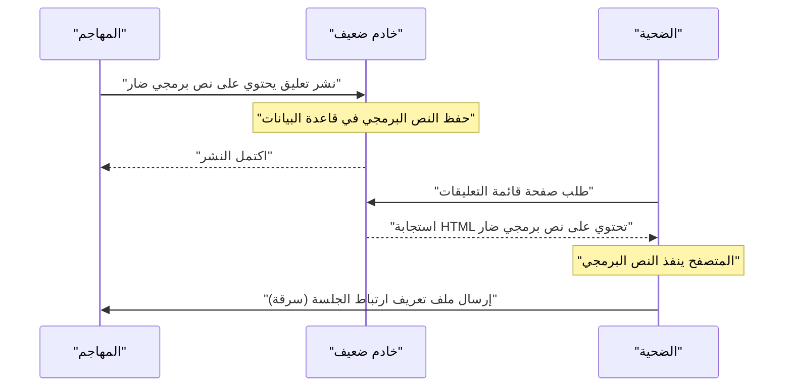
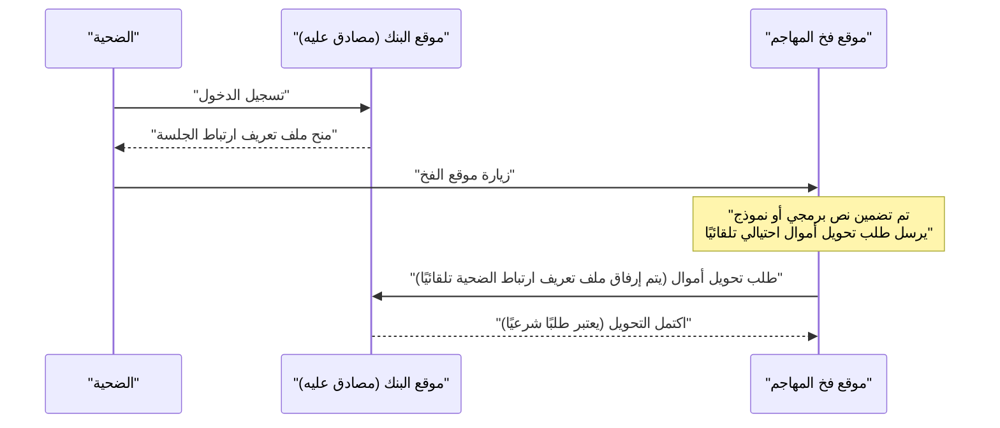
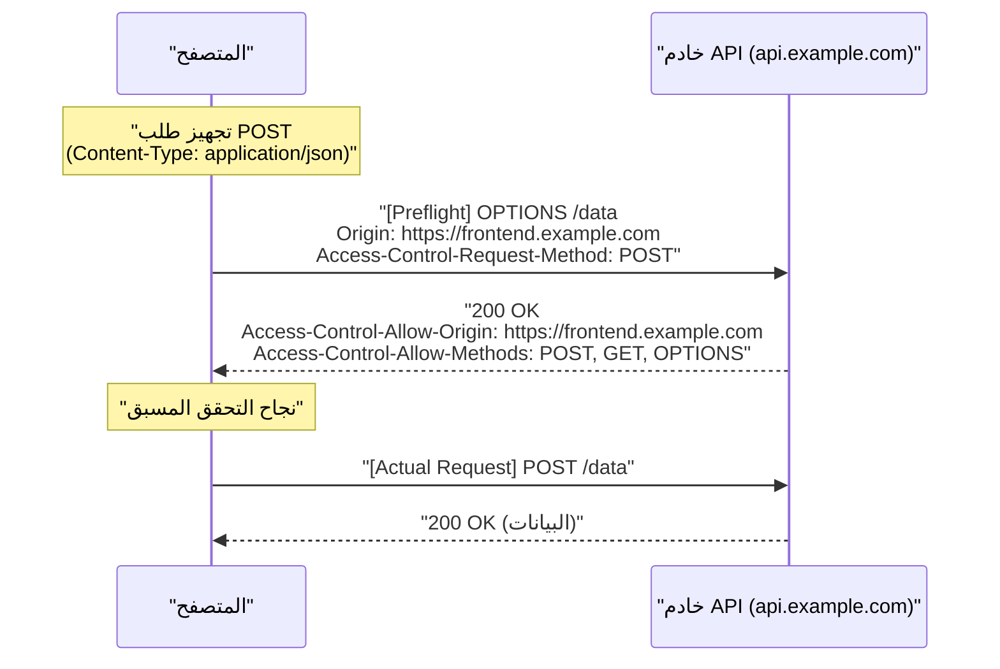
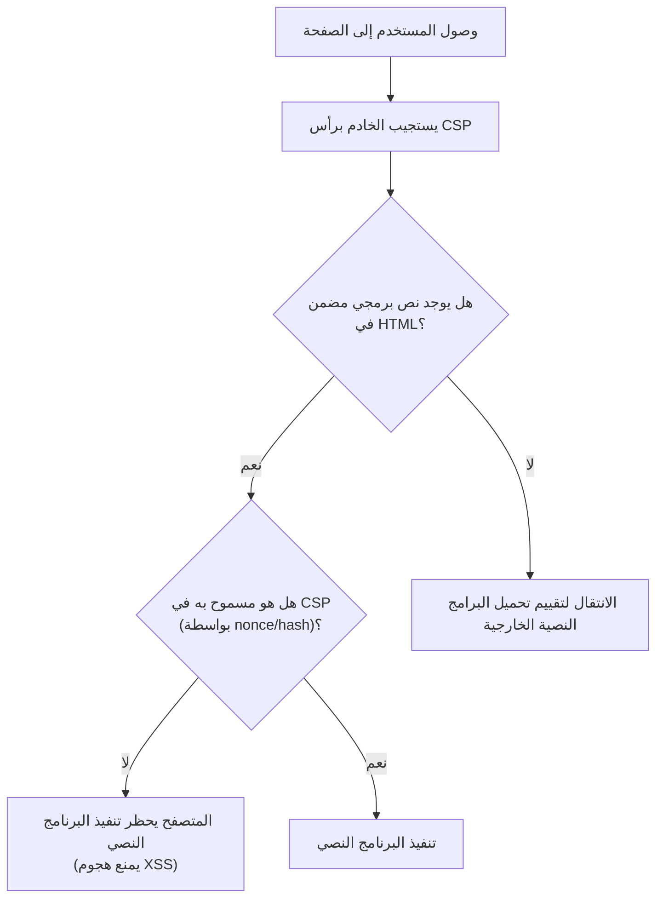

# مقدمة
تستمر تطبيقات الويب في التطور، حيث تحولت من مجرد عارض للمستندات إلى أنظمة أعمال متقدمة ومنصات ترفيهية. ومع ذلك، أصبحت البيانات التي تتعامل معها تطبيقات الويب أكثر حساسية، مما يجعلها عرضة بشكل أكبر للهجمات الإلكترونية.

في هذه المقالة، سنشرح بشكل شامل ومفصل أساسيات أمان الويب، بدءًا من الثغرات الأمنية الكلاسيكية التي لا تزال تشكل تهديدًا مثل [XSS](https://kenji.blog/ar/p/web-application-vulnerability-owasp-top-10/) و [CSRF](https://kenji.blog/ar/p/web-application-vulnerability-owasp-top-10/)، وصولاً إلى أحدث آليات الدفاع الضرورية في تطوير الويب الحديث، مثل CORS و CSP وملفات تعريف الارتباط SameSite. بالإضافة إلى ذلك، سنوضح كيف تعمل هذه التقنيات معًا لبناء تطبيقات ويب قوية، مع أمثلة عملية من الأكواد ومخططات Mermaid.

---

# 1. الثغرات الأمنية الكلاسيكية التي لا تزال تشكل تهديدًا اليوم

من بين الثغرات الأمنية الأقدم في تاريخ تطبيقات الويب والتي لا تزال تظهر بانتظام في قائمة [OWASP](https://kenji.blog/ar/p/web-application-vulnerability-owasp-top-10/) Top 10 هي تلك المتعلقة بـ **الحقن (Injection)** و **ضعف التحكم في الوصول (Broken Access Control)**. هنا سنتعمق في أبرزها: البرمجة عبر المواقع (XSS) وتزوير الطلب عبر المواقع (CSRF).

## 1.1 البرمجة عبر المواقع (XSS)

البرمجة عبر المواقع (XSS) هي تقنية هجوم يقوم فيها المهاجم بحقن نصوص برمجية خبيثة في موقع ويب ضعيف، مما يؤدي إلى تنفيذها على متصفحات المستخدمين الذين يزورون الموقع. يمكن أن يؤدي هذا إلى أضرار جسيمة، مثل سرقة رموز الجلسات (Session Tokens)، وانتحال شخصية المستخدم، وتوزيع البرامج الضارة.

### 1.1.1 أنواع XSS

ينقسم XSS بشكل رئيسي إلى الأنواع الثلاثة التالية:

1.  **Reflected XSS (XSS المنعكس)**
    يقوم المهاجم بخداع المستخدم للنقر على رابط ضار، بحيث يتم "عكس" النص البرمجي المضمن في الطلب كما هو من الخادم كاستجابة، ويتم تنفيذه في المتصفح.
2.  **Stored XSS (XSS المخزن)**
    في الميزات التي يتم فيها حفظ البيانات التي يدخلها المستخدم في قاعدة البيانات، مثل لوحات الرسائل وقسم التعليقات، يقوم المهاجم بنشر نص برمجي ضار يتم تنفيذه لكل مستخدم يزور تلك الصفحة. يميل هذا النوع إلى إحداث أضرار واسعة النطاق.
3.  **DOM-based XSS (XSS المستند إلى DOM)**
    ثغرة تحدث عندما يقوم JavaScript على جانب العميل بكتابة مدخلات أو عناوين URL في DOM دون معالجتها بأمان، دون المرور عبر معالجة جانب الخادم.

### 1.1.2 تدفق هجوم XSS (مثال على Stored XSS)

يوضح المخطط التالي تدفق هجوم Stored XSS.



### 1.1.3 أمثلة على أكواد [XSS](https://kenji.blog/ar/p/web-application-vulnerability-owasp-top-10/) وتدابير الحماية

**مثال على كود ضعيف (Node.js / Express)**

```javascript
app.get('/search', (req, res) => {
    const query = req.query.q;
    // عرض إدخال المستخدم كـ HTML كما هو، مما يجعله عرضة لـ XSS
    res.send(`<h1>نتائج البحث: ${query}</h1>`);
});
```

إذا قام مهاجم بالوصول باستخدام الرابط `?q=<script>alert('XSS')</script>`، فسيتم تنفيذ النص البرمجي.

**تدبير الحماية: المعالجة بالهروب (Escaping)**

الأساس في منع [XSS](https://kenji.blog/ar/p/web-application-vulnerability-owasp-top-10/) هو جعل المدخلات آمنة (Escaping) بحيث لا يتم تفسيرها كـ HTML. على وجه الخصوص، يتم تحويل الأحرف الخاصة الخمسة `<`, `>`, `&`, `"`, `'` إلى كيانات HTML.

```javascript
function escapeHTML(str) {
    return str.replace(/[&<>'"]/g, function(match) {
        const escapeMap = {
            '&': '&amp;',
            '<': '&lt;',
            '>': '&gt;',
            "'": '&#39;',
            '"': '&quot;'
        };
        return escapeMap[match];
    });
}

app.get('/search', (req, res) => {
    const query = escapeHTML(req.query.q);
    res.send(`<h1>نتائج البحث: ${query}</h1>`);
});
```

في الوقت الحاضر، تقوم إطارات عمل الواجهة الأمامية الحديثة مثل React و Vue.js بإجراء المعالجة بالهروب افتراضيًا، مما يوفر مستوى معينًا من الحماية ضد [XSS](https://kenji.blog/ar/p/web-application-vulnerability-owasp-top-10/) دون أن يضطر المطور إلى القلق بشأن ذلك. ومع ذلك، لا يزال يجب الحذر عند استخدام `dangerouslySetInnerHTML` (في React) أو `v-html` (في Vue.js).

---

## 1.2 تزوير الطلب عبر المواقع ([CSRF](https://kenji.blog/ar/p/web-application-vulnerability-owasp-top-10/))

تزوير الطلب عبر المواقع (CSRF) هو هجوم يُجبر المستخدم على إرسال طلب غير مقصود (مثل تحويل الأموال، أو تغيير كلمة المرور، أو إلغاء الحساب) إلى موقع ويب تمت مصادقته بالفعل، وذلك عبر موقع فخ أعده المهاجم.

### 1.2.1 تدفق هجوم CSRF



بناءً على مواصفات المتصفح، يتم تلقائيًا إرسال ملفات تعريف الارتباط المرتبطة بنطاق معين مع الطلبات الموجهة إلى ذلك النطاق. يستغل هجوم [CSRF](https://kenji.blog/ar/p/web-application-vulnerability-owasp-top-10/) هذه الآلية.

### 1.2.2 تدابير الحماية ضد CSRF

لمنع CSRF، يجب التحقق مما إذا كان الطلب ناتجًا بالفعل عن إجراء مقصود من قبل المستخدم.

**1. استخدام رموز CSRF (CSRF Tokens)**

التدبير الأكثر شيوعًا هو إنشاء سلسلة عشوائية يصعب تخمينها (رمز CSRF) على جانب الخادم وتضمينها كحقل مخفي (`hidden`) في النموذج. عند استلام الطلب، تتم مقارنة الرمز المخزن في الجلسة بالرمز المرسل، ويتم رفض الطلب إذا لم يتطابقا.

```html
<!-- تضمين رمز CSRF في النموذج -->
<form action="/transfer" method="POST">
    <input type="hidden" name="csrf_token" value="سلسلة عشوائية تم إنشاؤها على الخادم">
    <input type="text" name="amount" value="10000">
    <button type="submit">تحويل</button>
</form>
```

**2. الاستفادة من سمة SameSite في ملفات تعريف الارتباط**

يعد إعداد سمة **SameSite** الموضحة لاحقًا في ملفات تعريف الارتباط طريقة فعالة للغاية لمنع إرسال ملفات تعريف الارتباط في الطلبات عبر المواقع، مما يجعله إجراءً مضادًا قويًا ضد [CSRF](https://kenji.blog/ar/p/web-application-vulnerability-owasp-top-10/).

---

# 2. آليات الدفاع التي تدعم أمان الويب الحديث

مع تزايد تعقيد تطبيقات الويب وأصبح نهج التطبيق أحادي الصفحة (SPA) القائم على API هو السائد، أصبحت التدابير الكلاسيكية وحدها غير كافية. لذلك، ظهرت معايير جديدة لضمان الأمان على مستوى المتصفح. هنا سنشرح بالتفصيل ركائز أمان الويب الحديث: **CORS**، و **CSP**، و **SameSite Cookie**.

## 2.1 مشاركة الموارد عبر الأصول (CORS)

منذ فترة طويلة، كان للويب نموذج أمان قوي يسمى **سياسة المصدر نفسه (Same-Origin Policy: SOP)**. تفرض SOP قيودًا على المستندات أو البرامج النصية المحملة من أصل معين (مزيج من المخطط والمضيف والمنفذ) وتمنعها من الوصول إلى موارد أصول أخرى. يمنع هذا قراءة البيانات من قبل المواقع الضارة.

ومع ذلك، في الويب الحديث، من الشائع أن يكون للواجهة الأمامية (مثل: `https://frontend.example.com`) والواجهة الخلفية لواجهة برمجة التطبيقات (مثل: `https://api.example.com`) أصول مختلفة. في ظل SOP، سيتم حظر طلبات Ajax من الواجهة الأمامية إلى API.

الآلية التي تخفف هذا التقييد بأمان وتسمح بمشاركة الموارد بين الأصول المسموح بها هي **CORS (Cross-Origin Resource Sharing)**.

### 2.1.1 آلية طلب التحقق المسبق (Preflight Request)

في CORS، قبل إرسال الطلبات التي قد تؤثر على البيانات الموجودة على الخادم (مثل `POST`, `PUT`, `DELETE` أو الطلبات التي تحتوي على رؤوس مخصصة)، يقوم المتصفح تلقائيًا بإرسال **طلب تحقق مسبق (Preflight Request)** للتحقق مما إذا كان الخادم جاهزًا لقبول الطلب الفعلي.

يستخدم طلب التحقق المسبق طريقة `OPTIONS` ويتضمن الرؤوس التالية:
- `Origin`: أصل الطلب
- `Access-Control-Request-Method`: الطريقة المستخدمة في الطلب الفعلي
- `Access-Control-Request-Headers`: الرؤوس المخصصة المستخدمة في الطلب الفعلي



### 2.1.2 أفضل الممارسات لإعدادات CORS والأداء

**الإعداد المناسب لـ `Access-Control-Allow-Origin`**

إذا قمت بتعيين `Access-Control-Allow-Origin: *`، فيمكنك السماح بالوصول من جميع الأصول، ولكن لا يمكن استخدام `*` للطلبات التي تتضمن بيانات الاعتماد (مثل ملفات تعريف الارتباط) (`withCredentials: true`). لأسباب أمنية، يوصى بتحديد الأصول المسموح بها بوضوح.

**تحسين الأداء عن طريق تخزين التحقق المسبق مؤقتًا (Caching)**

تمثل طلبات التحقق المسبق عبئًا على الاتصال ويمكن أن تتسبب في تدهور أداء التطبيق. لمنع ذلك، من المهم استخدام رأس `Access-Control-Max-Age` للسماح للمتصفح بتخزين نتائج التحقق المسبق مؤقتًا.

```http
Access-Control-Max-Age: 86400
```
(الوحدة بالثواني. في هذا المثال، التخزين المؤقت لمدة 24 ساعة)

**مقارنة الأداء (نموذج رياضي)**

لنفترض أن الوقت المستغرق للطلب هو $T$، وزمن انتقال الشبكة هو $L$، ووقت معالجة الخادم هو $S$.

طلب المصدر نفسه العادي:
$ T_{normal} = 2L + S $

طلب CORS غير المخزن مؤقتًا (مع التحقق المسبق):
$ T_{cors\_unached} = 4L + S_{options} + S_{actual} $

يتم تقليل الوقت المستغرق لطلب CORS المخزن مؤقتًا بشكل كبير، ويصبح تقريبًا مكافئًا للوصول العادي.

$$
\begin{aligned}
T_{cors\_cached} &= 2L + S_{actual} \\\\
&\approx T_{normal}
\end{aligned}
$$

بهذه الطريقة، من خلال التخزين المؤقت للتحقق المسبق، يمكنك تقليل زمن الانتقال $2L$ ووقت معالجة OPTIONS $S_{options}$، ويمكن توقع تحسن كبير في السرعة.

---

## 2.2 سياسة أمان المحتوى (CSP)

**سياسة أمان المحتوى (Content Security Policy: CSP)** هي آلية دفاع قوية متعددة الطبقات لمنع هجمات [XSS](https://kenji.blog/ar/p/web-application-vulnerability-owasp-top-10/) وحقن البيانات من جذورها. وهي تحدد بدقة أصول الموارد (البرامج النصية، الصور، أوراق الأنماط، إلخ) التي يُسمح لصفحة الويب بتحميلها كقائمة بيضاء على جانب الخادم.

### 2.2.1 الصيغة الأساسية لـ CSP

يتم نقل CSP إلى المتصفح عبر رأس استجابة HTTP `Content-Security-Policy`.

```http
Content-Security-Policy: default-src 'self'; script-src 'self' https://trusted.cdn.com; img-src *;
```

- `default-src 'self'`: يقيد المصدر الافتراضي لتحميل جميع الموارد بأصل الموقع نفسه.
- `script-src 'self' https://trusted.cdn.com`: يسمح بتحميل JavaScript فقط من أصل الموقع وشبكة توصيل المحتوى (CDN) المحددة.
- `img-src *`: يمكن تحميل الصور من أي مكان.

### 2.2.2 القضاء على [XSS](https://kenji.blog/ar/p/web-application-vulnerability-owasp-top-10/) من خلال حظر البرامج النصية المضمنة (Inline Scripts)

الميزة الأهم لـ CSP هي أنها **تحظر تنفيذ البرامج النصية المضمنة (`<script>...</script>`) واستخدام `eval()` افتراضيًا**. نتيجة لذلك، حتى إذا قام مهاجم بحقن نص برمجي ضار في HTML (Stored [XSS](https://kenji.blog/ar/p/web-application-vulnerability-owasp-top-10/) أو Reflected XSS)، فإن المتصفح سيحظر تنفيذه باعتباره انتهاكًا لـ CSP.



### 2.2.3 الاستفادة من nonce و hash

إذا كان لابد من استخدام البرامج النصية المضمنة (مثل: علامات Google Analytics)، فهناك طرق للسماح بها بأمان.

**1. استخدام Nonce**

يقوم الخادم بإنشاء سلسلة عشوائية فريدة لكل طلب (nonce) ويحددها في رأس CSP وسمة علامة `<script>`. يُسمح بالتنفيذ فقط إذا كانا متطابقين.

رأس HTTP:
```http
Content-Security-Policy: script-src 'nonce-r4nd0mStr1ng';
```

HTML:
```html
<script nonce="r4nd0mStr1ng">
    console.log("سيتم تنفيذ هذا البرنامج النصي");
</script>
<script>
    alert("سيتم حظر البرنامج النصي للمهاجم");
</script>
```

**2. استخدام Hash**

يتم حساب قيمة التجزئة (مثل SHA-256) لمحتويات البرنامج النصي ويتم تحديدها في رأس CSP.

رأس HTTP:
```http
Content-Security-Policy: script-src 'sha256-B2yPHKaXnvFWtRChIbabYmUBFZdVfKKXHbWtWidDVF8=';
```

### 2.2.4 وظيفة الإبلاغ عن انتهاكات CSP

يحتوي CSP على ميزة تتيح للمتصفح إرسال تقرير إلى نقطة نهاية محددة عند حدوث انتهاك للسياسة. يسمح هذا للمسؤولين باكتشاف محاولات [XSS](https://kenji.blog/ar/p/web-application-vulnerability-owasp-top-10/) غير المعروفة أو أخطاء التكوين.

```http
Content-Security-Policy: default-src 'self'; report-uri /csp-violation-report-endpoint/
```
※ في السنوات الأخيرة، أصبحت `report-uri` مهملة، ويوصى باستخدام رأس `Report-To` الأكثر قوة.

---

## 2.3 الدفاع ضد [CSRF](https://kenji.blog/ar/p/web-application-vulnerability-owasp-top-10/) بواسطة SameSite Cookie

تعتبر ملفات تعريف الارتباط ضرورية لإدارة جلسات المستخدمين في تطبيقات الويب، لكن حقيقة أنها تُرسل تلقائيًا أثناء الطلبات عبر المواقع كانت سببًا في حدوث ثغرات CSRF. السمة **SameSite** لملفات تعريف الارتباط هي التي تحل هذه المشكلة.

### 2.3.1 الأوضاع الثلاثة لسمة SameSite

يمكن تعيين سمة SameSite إلى القيم الثلاث التالية:

1.  **Strict**
    الإعداد الأكثر صرامة. يتم إرسال ملف تعريف الارتباط فقط إذا كان الطلب من نفس الموقع (يتطابق نطاق المستوى الأعلى والنطاق الذي يليه). حتى إذا انتقل المستخدم من خلال النقر على رابط من موقع خارجي، فلن يتم إرسال ملف تعريف الارتباط. يوفر أمانًا عاليًا، ولكنه قد يضر بسهولة الاستخدام، حيث قد لا يتم الاحتفاظ بحالة تسجيل الدخول عند الوصول عبر رابط خارجي.

2.  **Lax**
    القيمة الافتراضية الحالية للمتصفحات. بشكل أساسي، لا يتم إرسال ملفات تعريف الارتباط في الطلبات عبر المواقع، ولكن يتم إرسالها فقط إذا كان تنقلاً في المستوى الأعلى (انتقال الشاشة عن طريق النقر على رابط) ويستخدم طريقة HTTP آمنة (مثل GET). يوفر توازنًا بين الأمان وسهولة الاستخدام.

3.  **None**
    مثل السلوك القديم، يرسل دائمًا ملفات تعريف الارتباط حتى في الطلبات عبر المواقع. عند استخدام هذا الإعداد، يجب دائمًا إضافة سمة `Secure` (إرسال ملفات تعريف الارتباط عبر HTTPS فقط).

```http
Set-Cookie: session_id=abc123xyz; SameSite=Strict; Secure; HttpOnly
```

### 2.3.2 آلية الحماية SameSite = Lax

يوضح الجدول التالي سلوك ملفات تعريف الارتباط (عند تعيين SameSite=Lax) عند إرسال طلب إلى موقع بنك من موقع ذي نطاق مختلف (موقع فخ).

| إجراء المستخدم (على موقع الفخ) | طريقة HTTP | نوع الطلب | إرسال ملف تعريف الارتباط | التأثير على [CSRF](https://kenji.blog/ar/p/web-application-vulnerability-owasp-top-10/) |
| :--- | :--- | :--- | :--- | :--- |
| النقر على رابط (`<a>`) | GET | تنقل المستوى الأعلى | **يُرسل** | GET لا يغير الحالة، لذا فهو آمن |
| إرسال نموذج (`<form>`) | GET | تنقل المستوى الأعلى | **يُرسل** | GET لا يغير الحالة، لذا فهو آمن |
| إرسال نموذج (`<form>`) | POST | تنقل المستوى الأعلى | **يُحظر** | **يمنع هجوم [CSRF](https://kenji.blog/ar/p/web-application-vulnerability-owasp-top-10/)** |
| اتصال غير متزامن (fetch, XHR) | GET/POST | طلب فرعي | **يُحظر** | **يمنع هجوم CSRF** |
| تحميل صورة (``) | GET | طلب فرعي | **يُحظر** | آمن |

بهذه الطريقة، مجرد تعيين `SameSite=Lax` (أو عمله كإعداد افتراضي للمتصفح) يبطل هجمات [CSRF](https://kenji.blog/ar/p/web-application-vulnerability-owasp-top-10/) الكلاسيكية التي تستخدم طريقة POST. ومع ذلك، للحصول على حماية كاملة، يوصى باستخدامه مع رموز CSRF التقليدية.

---

# 3. مقايضات التدابير الأمنية

عند تقديم تدابير أمنية قوية، يجب دائمًا مراعاة المقايضة بين **سهولة الاستخدام** و **الأداء**.

## 3.1 الأمان مقابل سهولة الاستخدام

على سبيل المثال، تعيين سمة SameSite لملف تعريف الارتباط إلى `Strict` يوفر حماية قوية جدًا ضد [CSRF](https://kenji.blog/ar/p/web-application-vulnerability-owasp-top-10/)، ولكن عندما ينقر المستخدم على رابط في بريد إلكتروني ترويجي للوصول إلى موقعك، سيتم معاملته كغير مسجل دخول، مما قد يضر بتجربة المستخدم (UX). من الضروري تحديد `Lax` بناءً على خصائص التطبيق والموازنة من خلال المطالبة بكلمات مرور لمرة واحدة أو إعادة المصادقة للعمليات الهامة.

## 3.2 الأمان مقابل الأداء

بينما يؤدي إدخال CSP إلى تحسين الأمان بشكل كبير، إلا أنه يترتب عليه تكاليف تشغيلية لإنشاء سياسات صارمة وصيانتها. بالإضافة إلى ذلك، يستهلك إنشاء Nonce لكل طلب وطلبات التحقق المسبق في CORS، وإن كان بشكل طفيف، موارد الحوسبة للخادم وعرض النطاق الترددي للشبكة.

كما ذكرنا سابقًا، من الضروري في CORS تقليل التدهور في الأداء من خلال تحديد فترة تخزين مؤقت مناسبة (`Access-Control-Max-Age`).

---

# 4. الخلاصة والتطلعات المستقبلية

في هذه المقالة، قمنا بشرح كل شيء من المعرفة الأساسية إلى أحدث التقنيات لحماية تطبيقات الويب من التهديدات.

*   **[XSS](https://kenji.blog/ar/p/web-application-vulnerability-owasp-top-10/) و [CSRF](https://kenji.blog/ar/p/web-application-vulnerability-owasp-top-10/)**: ثغرات أمنية كلاسيكية لكنها لا تزال تسبب أضرارًا قاتلة حتى اليوم. المعالجة بالهروب المناسبة والدفاع بواسطة الرموز هي الأساسيات.
*   **CORS**: آلية لتحقيق اتصال آمن عبر الأصول في معمارية الويب الحديثة متزايدة التعقيد.
*   **CSP**: سياسة قوية لاحتواء هجمات الحقن مثل XSS على مستوى المتصفح من خلال استبعاد البرامج النصية المضمنة وما إلى ذلك.
*   **SameSite Cookie**: حاجز المتصفح القياسي ضد CSRF. تتزايد أهميته وسط التحرك نحو التخلص من ملفات تعريف الارتباط لجهات خارجية.

عالم أمان الويب هو دائمًا لعبة قط وفأر. حتى عندما يوفر موردو المتصفحات آليات دفاع قوية (مثل CSP و SameSite)، يبتكر المهاجمون طرقًا جديدة لتجاوزها (مثل DOM Clobbering و CSS Injection).

يجب على المطورين أن يدركوا أنه لا توجد "رصاصة فضية" ويجب عليهم تنفيذ نهج **الدفاع متعدد الطبقات (Defense in Depth)** الذي يجمع بين التحقق من صحة الإدخال (Validation)، والمعالجة بالهروب عند الإخراج، وإعدادات رؤوس HTTP المناسبة (CSP، CORS، HSTS، إلخ)، والتقييم المستمر للثغرات الأمنية.

دعونا نستمر في متابعة أحدث الاتجاهات وبناء تطبيقات ويب أكثر أمانًا وموثوقية.
