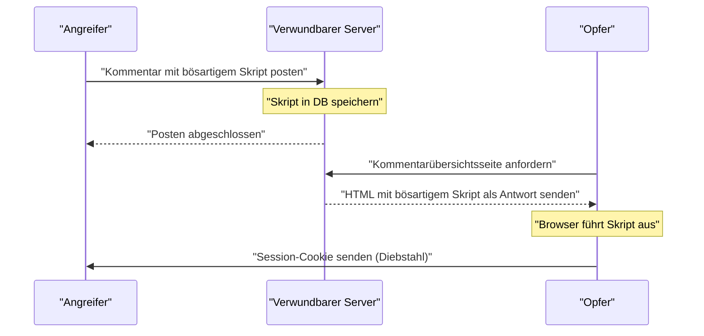
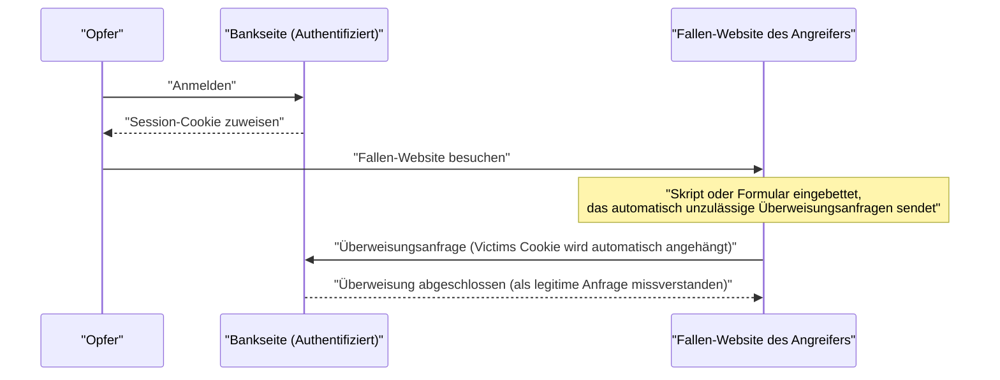
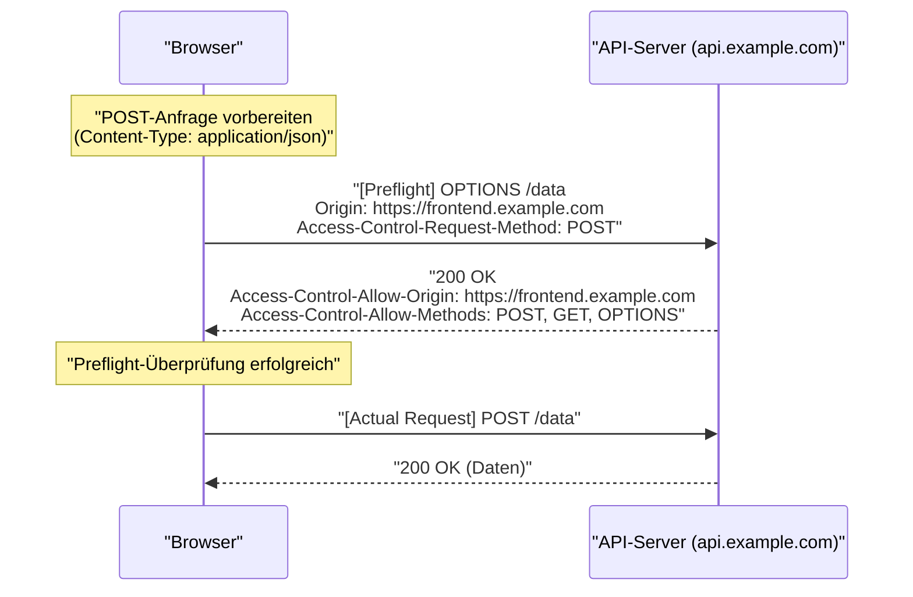
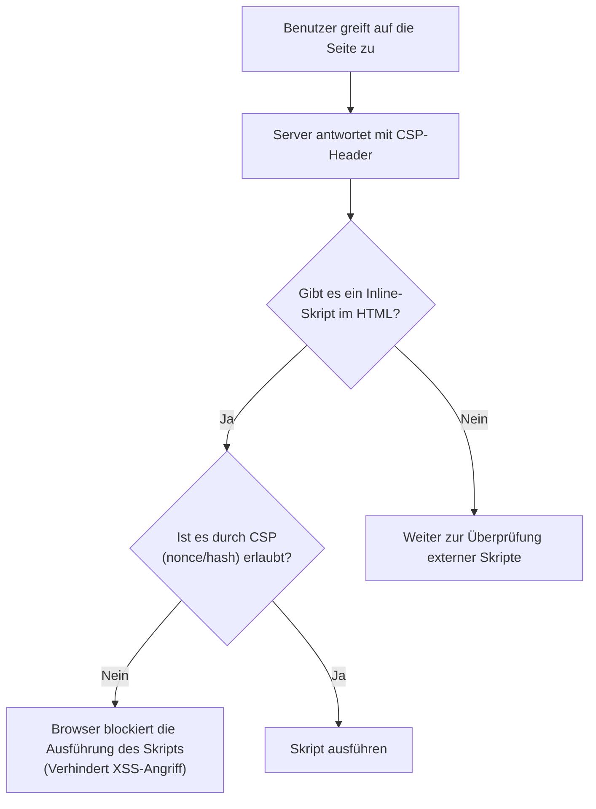

# Einführung
Webanwendungen entwickeln sich ständig weiter und haben sich von einfachen Dokumentenbetrachtern zu hoch entwickelten Geschäftssystemen und Unterhaltungsplattformen gewandelt. Infolgedessen werden die von Webanwendungen verarbeiteten Daten immer vertraulicher und damit anfälliger für Cyberangriffe.

In diesem Artikel werden die Grundlagen der Websicherheit umfassend und detailliert erläutert, von klassischen und immer noch weit verbreiteten Schwachstellen wie [XSS](https://kenji.blog/de/p/web-application-vulnerability-owasp-top-10/) und [CSRF](https://kenji.blog/de/p/web-application-vulnerability-owasp-top-10/) bis hin zu den neuesten Verteidigungsmechanismen wie CORS, CSP und SameSite-Cookies, die in der modernen Webentwicklung unerlässlich sind. Darüber hinaus erklären wir anhand konkreter Codebeispiele und Mermaid-Diagramme verständlich, wie diese Technologien zusammenarbeiten, um robuste Webanwendungen aufzubauen.

---

# 1. Klassische und immer noch bedrohliche Schwachstellen

Zu den Schwachstellen, die in der Geschichte der Webanwendungen schon lange existieren und immer noch regelmäßig in den [OWASP](https://kenji.blog/de/p/web-application-vulnerability-owasp-top-10/) Top 10 zu finden sind, gehören jene im Zusammenhang mit **Injections** und **fehlerhafter Zugriffskontrolle**. Hier gehen wir näher auf die bekanntesten Vertreter ein: Cross-Site Scripting (XSS) und Cross-Site Request Forgery (CSRF).

## 1.1 Cross-Site Scripting (XSS)

Cross-Site Scripting (XSS) ist eine Angriffsmethode, bei der ein Angreifer ein bösartiges Skript in eine verwundbare Website einschleust, das dann im Browser der Benutzer ausgeführt wird, die diese Website besuchen. Dies kann zu erheblichen Schäden führen, wie zum Beispiel dem Diebstahl von Session-Tokens, dem Fälschen von Benutzeraktionen oder sogar der Verbreitung von Malware.

### 1.1.1 Arten von XSS

XSS wird hauptsächlich in die folgenden drei Kategorien unterteilt:

1.  **Reflected XSS (Reflektiertes XSS)**
    Bei dieser Methode bringt der Angreifer den Benutzer dazu, auf einen präparierten Link zu klicken. Das in der Anfrage enthaltene Skript wird vom Server direkt als Antwort "reflektiert" und im Browser ausgeführt.
2.  **Stored XSS (Gespeichertes XSS)**
    Bei Funktionen wie Foren oder Kommentarbereichen, in denen von Benutzern eingegebene Daten in einer Datenbank gespeichert werden, postet der Angreifer ein bösartiges Skript. Dieses Skript wird dann bei allen Benutzern ausgeführt, die die betreffende Seite aufrufen. Das Schadensausmaß ist hier tendenziell sehr groß.
3.  **DOM-based XSS**
    Diese Schwachstelle entsteht, wenn clientseitiges JavaScript URLs oder Eingabewerte unsicher verarbeitet und in das DOM schreibt, ohne die serverseitige Verarbeitung zu durchlaufen.

### 1.1.2 Ablauf eines XSS-Angriffs (Beispiel: Stored XSS)

Das folgende Diagramm zeigt den Ablauf eines Stored XSS-Angriffs.



### 1.1.3 Konkrete Codebeispiele und Schutzmaßnahmen gegen [XSS](https://kenji.blog/de/p/web-application-vulnerability-owasp-top-10/)

**Beispiel für verwundbaren Code (Node.js / Express)**

```javascript
app.get('/search', (req, res) => {
    const query = req.query.q;
    // Da die Benutzereingabe direkt als HTML ausgegeben wird, ist dies anfällig für XSS
    res.send(`<h1>Suchergebnisse: ${query}</h1>`);
});
```

Wenn ein Angreifer mit der URL `?q=<script>alert('XSS')</script>` zugreift, wird das Skript ausgeführt.

**Schutzmaßnahme: Escaping (Maskierung)**

Die grundlegende Maßnahme zur Vermeidung von [XSS](https://kenji.blog/de/p/web-application-vulnerability-owasp-top-10/) besteht darin, Benutzereingaben unschädlich zu machen (Escaping), damit sie nicht als HTML interpretiert werden. Insbesondere die fünf Sonderzeichen `<`, `>`, `&`, `"` und `'` müssen in HTML-Entitäten umgewandelt werden.

```javascript
function escapeHTML(str) {
    return str.replace(/[&<>'"]/g, function(match) {
        const escapeMap = {
            '&': '&amp;',
            '<': '&lt;',
            '>': '&gt;',
            "'": '&#39;',
            '"': '&quot;'
        };
        return escapeMap[match];
    });
}

app.get('/search', (req, res) => {
    const query = escapeHTML(req.query.q);
    res.send(`<h1>Suchergebnisse: ${query}</h1>`);
});
```

Heute übernehmen moderne Frontend-Frameworks wie React und Vue.js standardmäßig das Escaping, so dass ein gewisses Maß an [XSS](https://kenji.blog/de/p/web-application-vulnerability-owasp-top-10/)-Schutz gegeben ist, ohne dass der Entwickler sich dessen bewusst sein muss. Allerdings ist bei der Verwendung von `dangerouslySetInnerHTML` (React) oder `v-html` (Vue.js) weiterhin Vorsicht geboten.

---

## 1.2 Cross-Site Request Forgery ([CSRF](https://kenji.blog/de/p/web-application-vulnerability-owasp-top-10/))

Cross-Site Request Forgery (CSRF) ist ein Angriff, bei dem ein Benutzer gezwungen wird, über eine vom Angreifer präparierte Website ungewollt Anfragen (wie Überweisungen, Passwortänderungen, Kontolöschungen usw.) an eine Website zu senden, bei der der Benutzer bereits authentifiziert ist.

### 1.2.1 Ablauf eines CSRF-Angriffs



Aufgrund der Browserspezifikationen werden Anfragen an eine bestimmte Domain automatisch mit den mit dieser Domain verknüpften Cookies versehen. [CSRF](https://kenji.blog/de/p/web-application-vulnerability-owasp-top-10/) missbraucht diesen Mechanismus.

### 1.2.2 Schutzmaßnahmen gegen CSRF

Um CSRF zu verhindern, muss sichergestellt werden, dass die Anfrage wirklich auf eine vom Benutzer beabsichtigte Aktion zurückgeht.

**1. Verwendung von CSRF-Token**

Die gängigste Maßnahme besteht darin, auf der Serverseite eine zufällige, schwer zu erratende Zeichenfolge (CSRF-Token) zu generieren und diese als verstecktes Feld (`hidden`) in das Formular einzubetten. Beim Empfang der Anfrage wird das im Session-Speicher hinterlegte Token mit dem gesendeten Token verglichen. Stimmen sie nicht überein, wird die Anfrage abgelehnt.

```html
<!-- CSRF-Token in das Formular einbetten -->
<form action="/transfer" method="POST">
    <input type="hidden" name="csrf_token" value="Vom Server generierte zufällige Zeichenfolge">
    <input type="text" name="amount" value="10000">
    <button type="submit">Überweisen</button>
</form>
```

**2. Nutzung des SameSite-Cookie-Attributs**

Durch das Festlegen des **SameSite**-Attributs, das später näher erläutert wird, kann gesteuert werden, dass Cookies bei Cross-Site-Anfragen nicht mitgesendet werden. Dies ist ein sehr wirksamer Schutz gegen [CSRF](https://kenji.blog/de/p/web-application-vulnerability-owasp-top-10/).

---

# 2. Verteidigungsmechanismen der modernen Web-Sicherheit

Da Webanwendungen immer komplexer werden und API-basierte SPAs (Single Page Applications) zum Mainstream geworden sind, zeigen klassische Maßnahmen ihre Grenzen auf. Daher wurden nach und nach neue Standards eingeführt, um die Sicherheit auf Browser-Ebene zu gewährleisten. In diesem Abschnitt werden **CORS**, **CSP** und **SameSite-Cookies** detailliert erläutert, die heutzutage die Grundpfeiler der modernen Websicherheit bilden.

## 2.1 Cross-Origin Resource Sharing (CORS)

Im Web existiert seit langem ein starkes Sicherheitsmodell namens **Same-Origin Policy (SOP)**. Die SOP besagt, dass "Dokumente oder Skripte, die von einem Origin (Kombination aus Schema, Host und Port) geladen werden, nur auf Ressourcen desselben Origins zugreifen dürfen". Dies verhindert das Lesen von Daten durch bösartige Websites.

In der modernen Webentwicklung ist es jedoch üblich, dass Frontend (z.B. `https://frontend.example.com`) und Backend-API (z.B. `https://api.example.com`) unterschiedliche Origins haben. Unter der SOP würden Ajax-Anfragen vom Frontend an die API blockiert werden.

Der Mechanismus, der diese Einschränkung sicher lockert und die gemeinsame Nutzung von Ressourcen zwischen autorisierten Origins ermöglicht, ist **CORS (Cross-Origin Resource Sharing)**.

### 2.1.1 Die Funktionsweise von Preflight-Anfragen

Bei CORS sendet der Browser vor Anfragen, die potenziell Auswirkungen auf Serverdaten haben könnten (z. B. `POST`, `PUT`, `DELETE` oder Anfragen mit benutzerdefinierten Headern), automatisch eine **Preflight-Anfrage** ab, um zu prüfen, ob der Server bereit ist, die eigentliche Anfrage zu akzeptieren.

Preflight-Anfragen verwenden die `OPTIONS`-Methode und enthalten folgende Header:
- `Origin`: Der Origin, von dem die Anfrage ausgeht
- `Access-Control-Request-Method`: Die Methode, die für die eigentliche Anfrage verwendet wird
- `Access-Control-Request-Headers`: Die benutzerdefinierten Header, die für die eigentliche Anfrage verwendet werden



### 2.1.2 Best Practices und Leistung für CORS-Einstellungen

**Angemessene Einstellung von `Access-Control-Allow-Origin`**

Wenn `Access-Control-Allow-Origin: *` gesetzt ist, wird der Zugriff von allen Origins erlaubt. Bei Anfragen, die Anmeldeinformationen (wie Cookies) enthalten (`withCredentials: true`), kann `*` jedoch nicht verwendet werden. Auch aus Sicherheitsgründen wird empfohlen, die erlaubten Origins explizit anzugeben.

**Leistungssteigerung durch Caching von Preflights**

Preflight-Anfragen verursachen Kommunikations-Overhead und können die Leistung der Anwendung beeinträchtigen. Um dies zu verhindern, ist es wichtig, den `Access-Control-Max-Age`-Header zu verwenden, damit der Browser die Ergebnisse des Preflights zwischenspeichert (cacht).

```http
Access-Control-Max-Age: 86400
```
(Die Einheit ist Sekunden. In diesem Beispiel ein Cache für 24 Stunden)

**Leistungsvergleich (Mathematisches Modell)**

Sei $T$ die Zeit, die für die Anfrage benötigt wird, $L$ die Netzwerklatenz und $S$ die Verarbeitungszeit des Servers.

Normale Same-Origin-Anfrage:
$ T_{normal} = 2L + S $

Nicht gecachte CORS-Anfrage (mit Preflight):
$ T_{cors\_unached} = 4L + S_{options} + S_{actual} $

Die benötigte Zeit für eine gecachte CORS-Anfrage wird erheblich verkürzt und ist fast identisch mit der eines normalen Zugriffs.

$$
\begin{aligned}
T_{cors\_cached} &= 2L + S_{actual} \\\\
&\approx T_{normal}
\end{aligned}
$$

Durch das Caching des Preflights können also die Latenz von $2L$ und die OPTIONS-Verarbeitungszeit $S_{options}$ reduziert werden, was eine dramatische Geschwindigkeitsverbesserung mit sich bringt.

---

## 2.2 Content Security Policy (CSP)

Die **Content Security Policy (CSP)** ist ein starker mehrstufiger Verteidigungsmechanismus, der [XSS](https://kenji.blog/de/p/web-application-vulnerability-owasp-top-10/)- und Dateninjektionsangriffe an der Wurzel packt. Sie definiert serverseitig eine strenge Whitelist der Ursprünge (Origins), von denen die Webseite Ressourcen (Skripte, Bilder, Stylesheets usw.) laden darf.

### 2.2.1 Grundlegende CSP-Syntax

CSP wird dem Browser über den HTTP-Response-Header `Content-Security-Policy` übermittelt.

```http
Content-Security-Policy: default-src 'self'; script-src 'self' https://trusted.cdn.com; img-src *;
```

- `default-src 'self'`: Beschränkt die Standardladequelle aller Ressourcen auf den eigenen Origin.
- `script-src 'self' https://trusted.cdn.com`: Erlaubt das Laden von JavaScript nur vom eigenen Origin und dem angegebenen CDN.
- `img-src *`: Bilder können von überall geladen werden.

### 2.2.2 Ausrottung von [XSS](https://kenji.blog/de/p/web-application-vulnerability-owasp-top-10/) durch Verbot von Inline-Skripten

Das wichtigste Merkmal von CSP ist, dass es standardmäßig **die Ausführung von Inline-Skripten (`<script>...</script>`) und die Verwendung von `eval()` verbietet**. Selbst wenn ein Angreifer ein bösartiges Skript in das HTML injiziert (Stored [XSS](https://kenji.blog/de/p/web-application-vulnerability-owasp-top-10/) oder Reflected XSS), blockiert der Browser die Ausführung als CSP-Verstoß.



### 2.2.3 Nutzung von Nonce und Hash

Wenn die Verwendung von Inline-Skripten unumgänglich ist (z. B. Google Analytics-Tags), gibt es sichere Methoden, diese zuzulassen.

**1. Verwendung von Nonces**

Der Server generiert bei jeder Anfrage eine eindeutige, zufällige Zeichenfolge (Nonce) und gibt sie im CSP-Header sowie im Attribut des `<script>`-Tags an. Die Ausführung wird nur erlaubt, wenn beide übereinstimmen.

HTTP-Header:
```http
Content-Security-Policy: script-src 'nonce-r4nd0mStr1ng';
```

HTML:
```html
<script nonce="r4nd0mStr1ng">
    console.log("Dieses Skript wird ausgeführt");
</script>
<script>
    alert("Das Skript des Angreifers wird blockiert");
</script>
```

**2. Verwendung von Hashes**

Der Hash-Wert (z.B. SHA-256) des Skriptinhalts wird berechnet und im CSP-Header angegeben.

HTTP-Header:
```http
Content-Security-Policy: script-src 'sha256-B2yPHKaXnvFWtRChIbabYmUBFZdVfKKXHbWtWidDVF8=';
```

### 2.2.4 Reporting-Funktion für CSP-Verstöße

CSP verfügt über eine Funktion, mit der der Browser bei einem Richtlinienverstoß einen Bericht an einen festgelegten Endpunkt sendet. Dadurch können Administratoren auf unbekannte [XSS](https://kenji.blog/de/p/web-application-vulnerability-owasp-top-10/)-Versuche oder Konfigurationsfehler aufmerksam werden.

```http
Content-Security-Policy: default-src 'self'; report-uri /csp-violation-report-endpoint/
```
*In den letzten Jahren wurde `report-uri` als veraltet eingestuft, und die Verwendung des leistungsstärkeren `Report-To`-Headers wird empfohlen.*

---

## 2.3 [CSRF](https://kenji.blog/de/p/web-application-vulnerability-owasp-top-10/)-Abwehr durch SameSite-Cookies

Cookies sind für die Sitzungsverwaltung in Webanwendungen unerlässlich, aber ihre Eigenschaft, bei Cross-Site-Anfragen automatisch gesendet zu werden, bot einen Nährboden für CSRF. Dieses Problem wird durch das **SameSite-Attribut** von Cookies gelöst.

### 2.3.1 Die 3 Modi des SameSite-Attributs

Das SameSite-Attribut kann auf einen der folgenden drei Werte gesetzt werden:

1.  **Strict**
    Die strengste Einstellung. Cookies werden nur gesendet, wenn die Anfrage von derselben Website stammt (Top-Level-Domain und die Domain darunter stimmen überein). Selbst beim Anklicken eines Links von einer externen Seite wird das Cookie nicht gesendet. Dies bietet hohe Sicherheit, kann aber den Komfort beeinträchtigen, z. B. wenn der Login-Status beim Zugriff über externe Links nicht übernommen wird.

2.  **Lax**
    Der aktuelle Standardwert in Browsern. Grundsätzlich werden Cookies bei Cross-Site-Anfragen nicht gesendet. Eine Ausnahme gilt jedoch für Top-Level-Navigationen (Bildschirmwechsel durch Klick auf einen Link), wenn eine sichere HTTP-Methode (wie GET) verwendet wird. Dies stellt einen guten Kompromiss zwischen Komfort und Sicherheit dar.

3.  **None**
    Wie beim früheren Verhalten werden Cookies bei Cross-Site-Anfragen immer gesendet. Wenn diese Einstellung verwendet wird, muss zwingend das `Secure`-Attribut hinzugefügt werden (Cookies werden nur über HTTPS gesendet).

```http
Set-Cookie: session_id=abc123xyz; SameSite=Strict; Secure; HttpOnly
```

### 2.3.2 Schutzmechanismus bei SameSite = Lax

Die folgende Tabelle zeigt das Verhalten des Cookies (bei der Einstellung SameSite=Lax), wenn eine Anfrage von der Seite einer anderen Domain (Fallen-Website) an die Bankseite gesendet wird.

| Benutzeraktion (auf Fallen-Website) | HTTP-Methode | Art der Anfrage | Cookie-Übertragung | Auswirkung auf [CSRF](https://kenji.blog/de/p/web-application-vulnerability-owasp-top-10/) |
| :--- | :--- | :--- | :--- | :--- |
| Klick auf Link (`<a>`) | GET | Top-Level-Navigation | **Wird gesendet** | Sicher, da GET den Zustand nicht ändert |
| Absenden eines Formulars (`<form>`) | GET | Top-Level-Navigation | **Wird gesendet** | Sicher, da GET den Zustand nicht ändert |
| Absenden eines Formulars (`<form>`) | POST | Top-Level-Navigation | **Blockiert** | **Verhindert [CSRF](https://kenji.blog/de/p/web-application-vulnerability-owasp-top-10/)-Angriffe** |
| Asynchrone Kommunikation (fetch, XHR) | GET/POST | Sub-Anfrage | **Blockiert** | **Verhindert CSRF-Angriffe** |
| Laden eines Bildes (``) | GET | Sub-Anfrage | **Blockiert** | Sicher |

Auf diese Weise macht allein das Festlegen von `SameSite=Lax` (oder das Belassen als Standard-Browserverhalten) klassische [CSRF](https://kenji.blog/de/p/web-application-vulnerability-owasp-top-10/)-Angriffe, die die POST-Methode verwenden, unwirksam. Für einen vollständigen Schutz wird jedoch die Kombination mit traditionellen CSRF-Tokens empfohlen.

---

# 3. Kompromisse bei Sicherheitsmaßnahmen

Bei der Implementierung robuster Sicherheitsmaßnahmen müssen stets die Kompromisse zwischen **Sicherheit**, **Benutzerfreundlichkeit** und **Leistung** berücksichtigt werden.

## 3.1 Sicherheit vs. Benutzerfreundlichkeit

Wenn Sie beispielsweise das SameSite-Attribut eines Cookies auf `Strict` setzen, bietet dies einen extrem starken Schutz gegen [CSRF](https://kenji.blog/de/p/web-application-vulnerability-owasp-top-10/). Wenn ein Benutzer jedoch auf einen Link in einer Werbe-E-Mail klickt, um auf Ihre Website zuzugreifen, wird er möglicherweise als nicht angemeldet behandelt, was die UX (User Experience) beeinträchtigen kann. Es ist wichtig, die Balance zu finden, indem Sie `Lax` entsprechend den Eigenschaften der Anwendung wählen und für wichtige Aktionen Einmalpasswörter oder eine erneute Authentifizierung verlangen.

## 3.2 Sicherheit vs. Leistung

Die Einführung von CSP verbessert die Sicherheit drastisch, verursacht aber betriebliche Kosten für den Aufbau und die Pflege einer strengen Richtlinie. Darüber hinaus verbrauchen die Generierung von Nonces für jede Anfrage und Preflight-Anfragen bei CORS geringfügig Server-Rechenressourcen und Netzwerkbandbreite.

Wie bereits erwähnt, ist es bei CORS unerlässlich, die Leistungseinbußen durch Festlegen einer angemessenen Cache-Dauer (`Access-Control-Max-Age`) so gering wie möglich zu halten.

---

# 4. Zusammenfassung und Ausblick

Dieser Artikel erläuterte das Grundlagenwissen bis hin zu den neuesten Technologien zum Schutz von Webanwendungen vor Bedrohungen.

*   **[XSS](https://kenji.blog/de/p/web-application-vulnerability-owasp-top-10/) und [CSRF](https://kenji.blog/de/p/web-application-vulnerability-owasp-top-10/)**: Klassische Schwachstellen, die auch heute noch fatale Schäden verursachen können. Grundlegend ist der Schutz durch angemessenes Escaping und Tokens.
*   **CORS**: Ein Mechanismus zur Realisierung sicherer ursprungsübergreifender Kommunikation in immer komplexer werdenden modernen Webarchitekturen.
*   **CSP**: Eine starke Richtlinie, die Injektionsangriffe wie XSS auf Browser-Ebene durch Maßnahmen wie den Ausschluss von Inline-Skripten eindämmt.
*   **SameSite-Cookies**: Eine browserseitige Standard-Verteidigungsmauer gegen CSRF. Angesichts des Trends zur Abschaffung von Third-Party-Cookies gewinnen sie zunehmend an Bedeutung.

Die Welt der Web-Sicherheit ist ein ständiges Katz-und-Maus-Spiel. Selbst wenn Browser-Hersteller leistungsstarke Abwehrmechanismen (wie CSP und SameSite) bereitstellen, entwickeln Angreifer neue Umgehungsmethoden (wie DOM Clobbering oder CSS Injection).

Entwickler müssen erkennen, dass es keine „Silberkugel“ gibt, und stattdessen konsequent den Ansatz der **mehrschichtigen Verteidigung (Defense in Depth)** verfolgen. Dieser kombiniert Eingabevalidierung, Ausgabe-Escaping, geeignete HTTP-Header-Einstellungen (CSP, CORS, HSTS usw.) und kontinuierliche Schwachstellenscans.

Bleiben Sie stets über die neuesten Entwicklungen informiert, um sicherere und vertrauenswürdigere Webanwendungen zu entwickeln.
