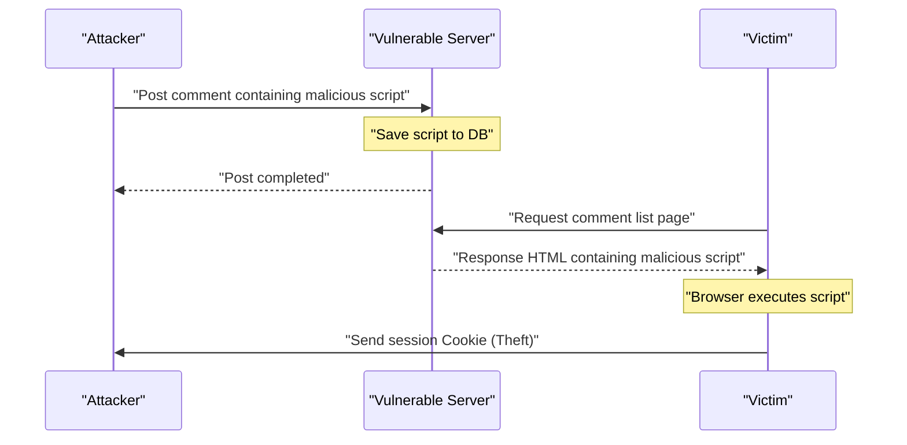
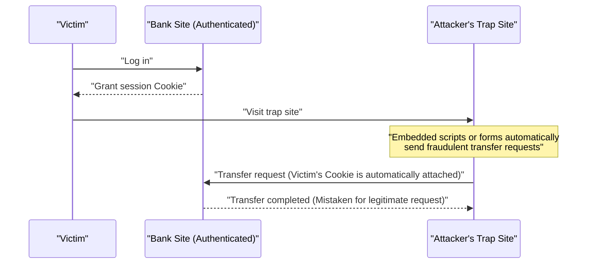
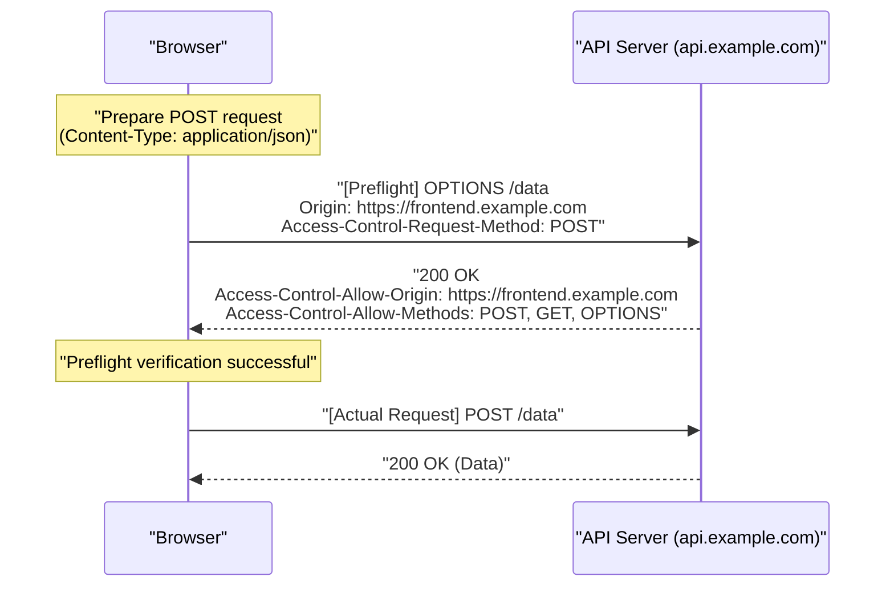
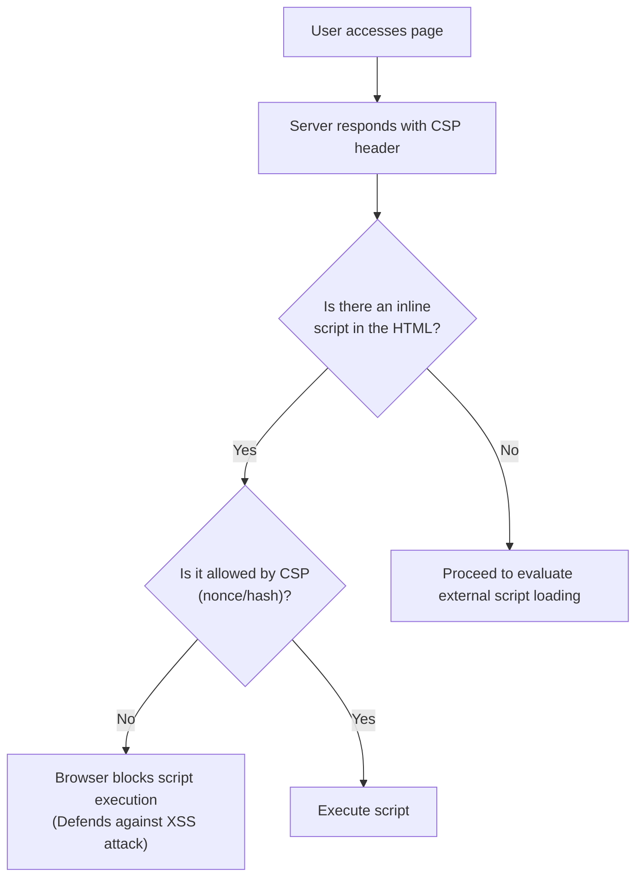

# Introduction
Web applications continue to evolve, transforming from mere document viewers into advanced business systems and entertainment platforms. Along with this, the data handled by Web applications is becoming increasingly sensitive, making them more prone to being targets of cyber attacks.

In this article, we comprehensively and in detail explain Web security basics, from classic vulnerabilities like [XSS](https://kenji.blog/en/p/web-application-vulnerability-owasp-top-10/) and [CSRF](https://kenji.blog/en/p/web-application-vulnerability-owasp-top-10/) that still pose a severe threat today, to the latest defense mechanisms essential in modern Web development, such as CORS, CSP, and SameSite Cookie. Furthermore, we will explain how these technologies work together to build robust Web applications, using concrete code examples and Mermaid diagrams in an easy-to-understand manner.

---

# 1. Classic Yet Modern Vulnerabilities

Vulnerabilities related to **Injection** and **Broken Access Control** have existed since the early history of Web applications and remain regulars in the [OWASP](https://kenji.blog/en/p/web-application-vulnerability-owasp-top-10/) Top 10. Here, we delve deeply into their most representative types: Cross-Site Scripting (XSS) and Cross-Site Request Forgery (CSRF).

## 1.1 Cross-Site Scripting (XSS)

Cross-Site Scripting (XSS) is an attack method where an attacker injects malicious scripts into a vulnerable website, causing them to execute on the browsers of users viewing the site. This can lead to catastrophic damage, such as session token theft, forgery of user actions, and even malware distribution.

### 1.1.1 Types of XSS

XSS is mainly classified into the following three types:

1.  **Reflected XSS**
    An attack method where an attacker tricks a user into clicking a malicious link containing a script in the request, which is then "reflected" as a response from the server and executed on the browser.
2.  **Stored XSS**
    An attack method involving features where user-input data is saved in a database, such as bulletin boards or comment sections. The attacker posts a malicious script, causing it to execute for all users who view that page. The scale of damage tends to be extremely large.
3.  **DOM-based XSS**
    A vulnerability that occurs without going through server-side processing, when client-side JavaScript unsafely handles URLs or input values and writes them to the DOM.

### 1.1.2 XSS Attack Flow (Stored XSS Example)

The diagram below shows the attack flow of Stored XSS.



### 1.1.3 Specific Code Examples and Defense Measures for [XSS](https://kenji.blog/en/p/web-application-vulnerability-owasp-top-10/)

**Vulnerable code example (Node.js / Express)**

```javascript
app.get('/search', (req, res) => {
    const query = req.query.q;
    // Vulnerable to XSS because user input is output directly to HTML
    res.send(`<h1>Search Results: ${query}</h1>`);
});
```

If an attacker accesses the URL `?q=<script>alert('XSS')</script>`, the script will be executed.

**Defense Measure: Escaping**

The fundamental way to prevent [XSS](https://kenji.blog/en/p/web-application-vulnerability-owasp-top-10/) is to sanitize (escape) user input so that it is not interpreted as HTML. Specifically, the five special characters `<`, `>`, `&`, `"`, and `'` are converted into HTML entities.

```javascript
function escapeHTML(str) {
    return str.replace(/[&<>'"]/g, function(match) {
        const escapeMap = {
            '&': '&amp;',
            '<': '&lt;',
            '>': '&gt;',
            "'": '&#39;',
            '"': '&quot;'
        };
        return escapeMap[match];
    });
}

app.get('/search', (req, res) => {
    const query = escapeHTML(req.query.q);
    res.send(`<h1>Search Results: ${query}</h1>`);
});
```

Nowadays, modern frontend frameworks like React and Vue.js perform escaping by default, providing a certain level of [XSS](https://kenji.blog/en/p/web-application-vulnerability-owasp-top-10/) protection even if the developer is not consciously aware of it. However, caution is still required when using `dangerouslySetInnerHTML` (React) or `v-html` (Vue.js).

---

## 1.2 Cross-Site Request Forgery ([CSRF](https://kenji.blog/en/p/web-application-vulnerability-owasp-top-10/))

Cross-Site Request Forgery (CSRF) is an attack where an attacker forces a user who has authenticated with a website to send unintended requests (such as transferring money, changing passwords, or deleting an account) through a trap site prepared by the attacker.

### 1.2.1 CSRF Attack Flow



Due to browser specifications, requests to a specific domain automatically include the Cookies associated with that domain. [CSRF](https://kenji.blog/en/p/web-application-vulnerability-owasp-top-10/) exploits this mechanism.

### 1.2.2 CSRF Defense Measures

To prevent CSRF, it is necessary to verify whether a request is truly the result of a user's intended action.

**1. Using CSRF Tokens**

The most common countermeasure is to generate a random, hard-to-guess string (CSRF token) on the server side and embed it as a hidden field (`hidden`) in the form. When receiving a request, the server compares the token stored in the session with the submitted token and rejects the request if they do not match.

```html
<!-- Embed CSRF token in the form -->
<form action="/transfer" method="POST">
    <input type="hidden" name="csrf_token" value="Random string generated on the server">
    <input type="text" name="amount" value="10000">
    <button type="submit">Transfer</button>
</form>
```

**2. Utilizing the SameSite Cookie Attribute**

By setting the **SameSite** attribute (described later) on Cookies, you can control them so that they are not attached to cross-site requests, which is highly effective as a [CSRF](https://kenji.blog/en/p/web-application-vulnerability-owasp-top-10/) countermeasure.

---

# 2. Defense Mechanisms Supporting Modern Web Security

As Web applications have become more complex and API-based SPAs (Single Page Applications) have become mainstream, the limits of classic countermeasures have become apparent. Consequently, new standards to ensure security at the browser level have continually emerged. Here, we provide a detailed explanation of **CORS**, **CSP**, and **SameSite Cookie**, which are the cornerstones of modern Web security.

## 2.1 Cross-Origin Resource Sharing (CORS)

The Web has long had a powerful security model known as the **Same-Origin Policy (SOP)**. SOP restricts documents or scripts loaded from one origin (a combination of scheme, host, and port) from interacting with resources from another origin. This prevents data from being read by malicious sites.

However, in the modern Web, it is common for the frontend (e.g., `https://frontend.example.com`) and the backend API (e.g., `https://api.example.com`) to have different origins. Under SOP, Ajax requests from the frontend to the API would be blocked.

The mechanism that safely relaxes this restriction and enables resource sharing between permitted origins is **CORS (Cross-Origin Resource Sharing)**.

### 2.1.1 Mechanism of Preflight Requests

In CORS, before sending requests that might affect server data (e.g., `POST`, `PUT`, `DELETE`, or requests with custom headers), the browser automatically sends a **preflight request** to check if the server is ready to accept the actual request.

A preflight request uses the `OPTIONS` method and includes the following headers:
- `Origin`: The origin of the request source
- `Access-Control-Request-Method`: The method to be used in the actual request
- `Access-Control-Request-Headers`: Custom headers to be used in the actual request



### 2.1.2 CORS Configuration Best Practices and Performance

**Appropriate Configuration of `Access-Control-Allow-Origin`**

While setting `Access-Control-Allow-Origin: *` permits access from all origins, `*` cannot be used for requests that include credentials like Cookies (`withCredentials: true`). For security reasons, it is also recommended to explicitly specify the allowed origins.

**Improving Performance by Caching Preflights**

Preflight requests add communication overhead and can degrade application performance. To prevent this, it is crucial to use the `Access-Control-Max-Age` header to have the browser cache the preflight results.

```http
Access-Control-Max-Age: 86400
```
(The unit is seconds. In this example, it caches for 24 hours.)

**Performance Comparison (Mathematical Model)**

Let $T$ be the time taken for a request, $L$ be the network latency, and $S$ be the server processing time.

Normal same-origin request:
$ T_{\text{normal}} = 2L + S $

Uncached CORS request (with preflight):
$ T_{\text{cors\_uncached}} = 4L + S_{\text{options}} + S_{\text{actual}} $

The time required for a cached CORS request is significantly reduced and becomes almost equivalent to normal access.

$$
\begin{aligned}
T_{\text{cors\_cached}} &= 2L + S_{\text{actual}} \\\\
&\approx T_{\text{normal}}
\end{aligned}
$$

In this way, by caching preflights, the latency $2L$ and OPTIONS processing time $S_{\text{options}}$ can be reduced, leading to a dramatic speed improvement.

---

## 2.2 Content Security Policy (CSP)

**Content Security Policy (CSP)** is a robust defense-in-depth mechanism intended to prevent [XSS](https://kenji.blog/en/p/web-application-vulnerability-owasp-top-10/) and data injection attacks from the ground up. It strictly defines the origins of resources (scripts, images, stylesheets, etc.) that a Web page can load, using a server-side whitelist.

### 2.2.1 Basic CSP Syntax

CSP is communicated to the browser via the HTTP response header `Content-Security-Policy`.

```http
Content-Security-Policy: default-src 'self'; script-src 'self' https://trusted.cdn.com; img-src *;
```

- `default-src 'self'`: Restricts the default source for all resources to its own origin only.
- `script-src 'self' https://trusted.cdn.com`: Allows JavaScript loading only from its own origin and the specified CDN.
- `img-src *`: Images can be loaded from anywhere.

### 2.2.2 Eradicating [XSS](https://kenji.blog/en/p/web-application-vulnerability-owasp-top-10/) by Banning Inline Scripts

The biggest feature of CSP is that it **bans the execution of inline scripts (`<script>...</script>`) and the use of `eval()`** by default. Because of this, even if an attacker injects a malicious script into the HTML (Stored [XSS](https://kenji.blog/en/p/web-application-vulnerability-owasp-top-10/) or Reflected XSS), the browser will block its execution as a CSP violation.



### 2.2.3 Utilizing Nonce and Hash

If you absolutely must use inline scripts (e.g., Google Analytics tags), there are safe ways to allow them.

**1. Using Nonce**

The server generates a unique, random string (nonce) for each request and specifies it in the CSP header and as an attribute on the `<script>` tag. Execution is permitted only if both match.

HTTP Header:
```http
Content-Security-Policy: script-src 'nonce-r4nd0mStr1ng';
```

HTML:
```html
<script nonce="r4nd0mStr1ng">
    console.log("This script will be executed");
</script>
<script>
    alert("The attacker's script will be blocked");
</script>
```

**2. Using Hash**

The hash value (e.g., SHA-256) of the script's contents is calculated and specified in the CSP header.

HTTP Header:
```http
Content-Security-Policy: script-src 'sha256-B2yPHKaXnvFWtRChIbabYmUBFZdVfKKXHbWtWidDVF8=';
```

### 2.2.4 CSP Violation Reporting Feature

CSP has a feature that allows the browser to send a report to a specified endpoint when a policy violation occurs. This enables administrators to notice unknown [XSS](https://kenji.blog/en/p/web-application-vulnerability-owasp-top-10/) attempts and configuration errors.

```http
Content-Security-Policy: default-src 'self'; report-uri /csp-violation-report-endpoint/
```
*Note: In recent years, `report-uri` has been deprecated, and the use of the more robust `Report-To` header is recommended.

---

## 2.3 [CSRF](https://kenji.blog/en/p/web-application-vulnerability-owasp-top-10/) Defense with SameSite Cookie

Cookies are essential for managing user sessions in Web applications, but the specification that they are automatically sent on cross-site requests has been a breeding ground for CSRF. The solution to this problem is the Cookie's **SameSite attribute**.

### 2.3.1 The Three Modes of the SameSite Attribute

The SameSite attribute can be set to the following three values:

1.  **Strict**
    The strictest setting. Cookies are sent only if the request comes from the same site (the top-level domain and the one immediately below it match). Cookies will not be sent even if a user navigates to the site by clicking a link from an external site. It boasts high security but may compromise convenience, such as not carrying over login state when accessing via an external link.

2.  **Lax**
    The current default value for browsers. Basically, Cookies are not sent on cross-site requests, but they are sent only if it is a top-level navigation (screen transition caused by clicking a link) and uses a safe HTTP method (like GET). It is a setting that balances convenience and security.

3.  **None**
    Like the traditional behavior, it always sends Cookies even on cross-site requests. When using this setting, you must always attach the `Secure` attribute (sends Cookies only over HTTPS).

```http
Set-Cookie: session_id=abc123xyz; SameSite=Strict; Secure; HttpOnly
```

### 2.3.2 Protection Mechanism of SameSite = Lax

The table below shows the behavior of Cookies (when set to SameSite=Lax) when a request is sent from a different domain site (trap site) to a bank site.

| User Action (on trap site) | HTTP Method | Request Type | Cookie Transmission | Impact on [CSRF](https://kenji.blog/en/p/web-application-vulnerability-owasp-top-10/) |
| :--- | :--- | :--- | :--- | :--- |
| Clicking a link (`<a>`) | GET | Top-level navigation | **Sent** | Safe because GET does not change state |
| Submitting a form (`<form>`) | GET | Top-level navigation | **Sent** | Safe because GET does not change state |
| Submitting a form (`<form>`) | POST | Top-level navigation | **Blocked** | **Prevents [CSRF](https://kenji.blog/en/p/web-application-vulnerability-owasp-top-10/) attacks** |
| Asynchronous request (fetch, XHR) | GET/POST | Subrequest | **Blocked** | **Prevents CSRF attacks** |
| Loading an image (``) | GET | Subrequest | **Blocked** | Safe |

In this way, simply having `SameSite=Lax` set (or functioning as the browser default) nullifies classic [CSRF](https://kenji.blog/en/p/web-application-vulnerability-owasp-top-10/) attacks using the POST method. However, for complete defense, combining it with traditional CSRF tokens is recommended.

---

# 3. Trade-offs in Security Measures

When introducing robust security measures, you must always consider the trade-offs with **convenience** and **performance**.

## 3.1 Security vs. Convenience

For example, setting a Cookie's SameSite attribute to `Strict` is extremely effective against [CSRF](https://kenji.blog/en/p/web-application-vulnerability-owasp-top-10/), but if a user clicks a link in a promotional email and accesses your site, they might be treated as unlogged in, which could harm the UX (User Experience). A balance is needed, such as selecting `Lax` based on the application's characteristics and requiring one-time passwords or re-authentication for critical operations.

## 3.2 Security vs. Performance

Introducing CSP drastically improves security, but there are operational costs to building and maintaining strict policies. In addition, generating Nonces per request or sending preflight requests in CORS consumes a small amount of server computing resources and network bandwidth.

As mentioned earlier, for CORS, it is essential to minimize performance degradation by setting an appropriate cache period (`Access-Control-Max-Age`).

---

# 4. Conclusion and Future Outlook

In this article, we explained everything from basic knowledge to the latest technologies for protecting Web applications from threats.

*   **[XSS](https://kenji.blog/en/p/web-application-vulnerability-owasp-top-10/) and [CSRF](https://kenji.blog/en/p/web-application-vulnerability-owasp-top-10/)**: Classic vulnerabilities that still cause fatal damage today. The basics are defending with appropriate escaping and tokens.
*   **CORS**: A mechanism for achieving safe cross-origin communication in modern, increasingly complex Web architectures.
*   **CSP**: A robust policy that contains injection attacks like XSS at the browser level through measures such as eliminating inline scripts.
*   **SameSite Cookie**: A browser-standard defense against CSRF. Its importance is growing amid the movement to abolish third-party Cookies.

The world of Web security is a constant game of cat and mouse. Even when browser vendors provide robust defense mechanisms (like CSP or SameSite), attackers will devise new bypass techniques (such as DOM Clobbering or CSS Injection).

Developers must recognize that there is no "silver bullet" and strictly implement a **Defense in Depth** approach combining input validation, output escaping, appropriate HTTP header settings (CSP, CORS, HSTS, etc.), and continuous vulnerability assessments.

Let's continue to follow the latest trends and build safer, more trusted Web applications.
