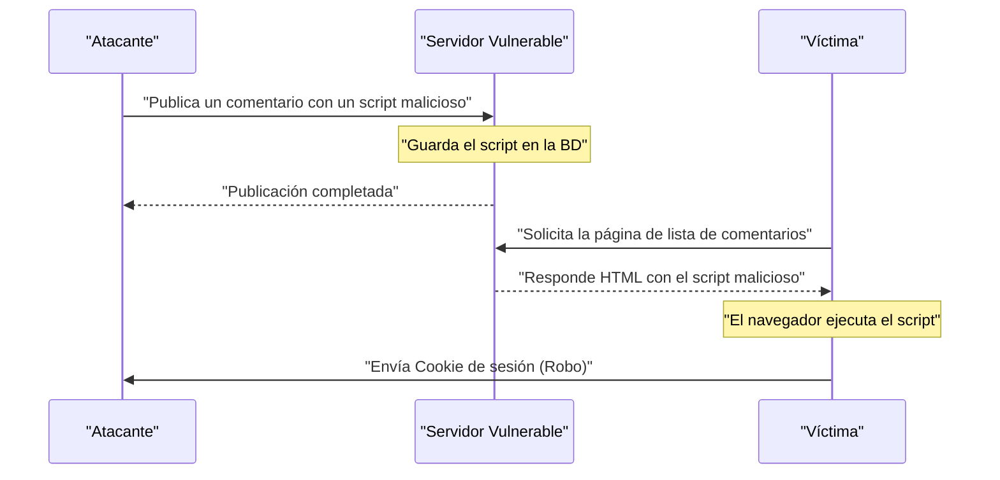
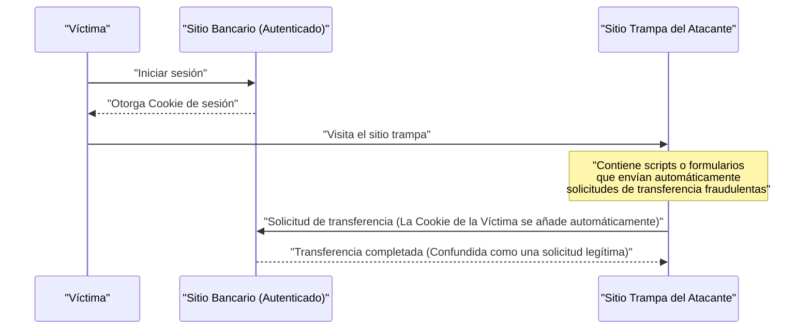
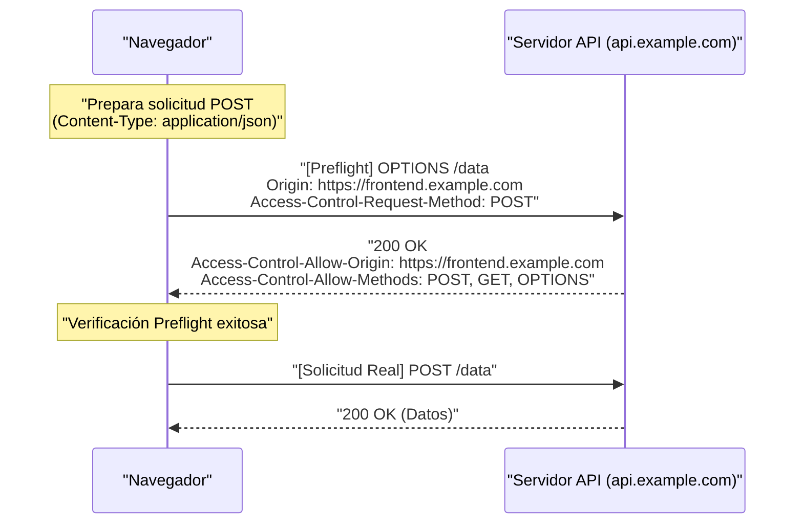
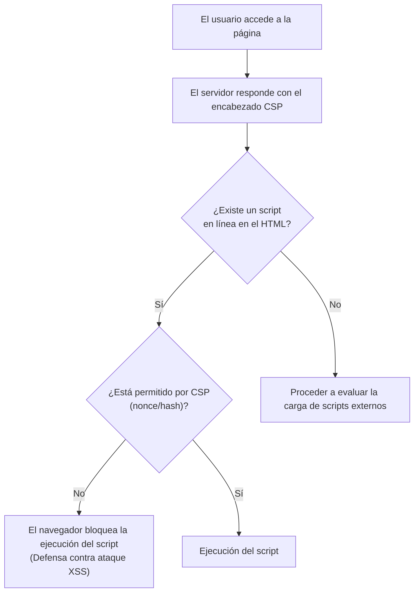

# Introducción
Las aplicaciones web han seguido evolucionando, transformándose de simples visores de documentos a sistemas empresariales avanzados y plataformas de entretenimiento. Como resultado, los datos que manejan las aplicaciones web son cada vez más confidenciales, convirtiéndolas en blancos fáciles para los ciberataques.

En este artículo, explicaremos de manera exhaustiva y detallada desde las vulnerabilidades clásicas que aún causan estragos en la actualidad, como [XSS](https://kenji.blog/es/p/web-application-vulnerability-owasp-top-10/) y [CSRF](https://kenji.blog/es/p/web-application-vulnerability-owasp-top-10/), que son la base de la seguridad web, hasta los mecanismos de defensa más modernos y esenciales en el desarrollo web actual, como CORS, CSP y SameSite Cookie. Además, explicaremos claramente cómo interactúan estas tecnologías para construir aplicaciones web robustas, utilizando ejemplos de código concretos y diagramas Mermaid.

---

# 1. Vulnerabilidades Clásicas que Aún son una Amenaza en la Actualidad

Las vulnerabilidades relacionadas con la **inyección** y las **deficiencias en el control de acceso** han existido desde hace mucho tiempo en la historia de las aplicaciones web y siguen siendo habituales en el [OWASP](https://kenji.blog/es/p/web-application-vulnerability-owasp-top-10/) Top 10. Aquí profundizaremos en sus representantes más destacados: Cross-Site Scripting (XSS) y Cross-Site Request Forgery (CSRF).

## 1.1 Cross-Site Scripting (XSS)

El Cross-Site Scripting (XSS) es una técnica de ataque en la que un atacante inyecta scripts maliciosos en un sitio web vulnerable y los ejecuta en el navegador del usuario que lo visita. Esto puede causar daños graves, como el robo de tokens de sesión, la falsificación de acciones del usuario e incluso la distribución de malware.

### 1.1.1 Tipos de XSS

El XSS se clasifica principalmente en los siguientes tres tipos:

1.  **Reflected XSS (XSS Reflejado)**
    Es una técnica en la que el atacante engaña al usuario para que haga clic en un enlace malicioso preparado previamente. El script incluido en la solicitud es "reflejado" tal cual desde el servidor como respuesta y se ejecuta en el navegador.
2.  **Stored XSS (XSS Almacenado)**
    Es una técnica en la que se publican scripts maliciosos en funciones donde los datos introducidos por el usuario se guardan en la base de datos, como foros o secciones de comentarios. El script se ejecutará para todos los usuarios que visiten esa página. Tiende a causar daños a una escala mucho mayor.
3.  **DOM-based XSS (XSS basado en DOM)**
    Es una vulnerabilidad que ocurre cuando el JavaScript del lado del cliente, sin pasar por el procesamiento del lado del servidor, escribe en el DOM sin procesar de manera segura la URL o los valores de entrada.

### 1.1.2 Flujo de Ataque de XSS (Ejemplo de Stored XSS)

El siguiente diagrama muestra el flujo de ataque del Stored XSS.



### 1.1.3 Ejemplos de Código Específicos y Medidas Defensivas para [XSS](https://kenji.blog/es/p/web-application-vulnerability-owasp-top-10/)

**Ejemplo de código vulnerable (Node.js / Express)**

```javascript
app.get('/search', (req, res) => {
    const query = req.query.q;
    // Vulnerable a XSS porque emite la entrada del usuario como HTML sin modificar
    res.send(`<h1>Resultados de búsqueda: ${query}</h1>`);
});
```

Si un atacante accede con la URL `?q=<script>alert('XSS')</script>`, el script se ejecutará.

**Medida Defensiva: Proceso de Escape**

La base para prevenir el [XSS](https://kenji.blog/es/p/web-application-vulnerability-owasp-top-10/) es desinfectar (escapar) la entrada del usuario para que no sea interpretada como HTML. En particular, los 5 caracteres especiales `<`, `>`, `&`, `"`, `'` se convierten en entidades HTML.

```javascript
function escapeHTML(str) {
    return str.replace(/[&<>'"]/g, function(match) {
        const escapeMap = {
            '&': '&amp;',
            '<': '&lt;',
            '>': '&gt;',
            "'": '&#39;',
            '"': '&quot;'
        };
        return escapeMap[match];
    });
}

app.get('/search', (req, res) => {
    const query = escapeHTML(req.query.q);
    res.send(`<h1>Resultados de búsqueda: ${query}</h1>`);
});
```

En la actualidad, los frameworks frontend modernos como React y Vue.js realizan el proceso de escape por defecto, por lo que se implementa un cierto nivel de prevención [XSS](https://kenji.blog/es/p/web-application-vulnerability-owasp-top-10/) sin que los desarrolladores sean conscientes de ello. Sin embargo, todavía se requiere precaución al usar `dangerouslySetInnerHTML` (React) o `v-html` (Vue.js).

---

## 1.2 Cross-Site Request Forgery ([CSRF](https://kenji.blog/es/p/web-application-vulnerability-owasp-top-10/))

Cross-Site Request Forgery (CSRF) es un ataque en el que un atacante obliga a un usuario a enviar una solicitud no deseada (como transferencias de dinero, cambio de contraseñas, cancelación de cuentas, etc.) a un sitio web autenticado a través de un sitio trampa preparado por el atacante.

### 1.2.1 Flujo de Ataque de CSRF



Debido a las especificaciones del navegador, las Cookies asociadas a un dominio específico se envían automáticamente a las solicitudes a ese dominio. [CSRF](https://kenji.blog/es/p/web-application-vulnerability-owasp-top-10/) abusa de este mecanismo.

### 1.2.2 Medidas Defensivas para CSRF

Para prevenir el CSRF, es necesario verificar si la solicitud es realmente una acción intencionada por el usuario.

**1. Uso de Tokens CSRF**

La medida más común es generar una cadena aleatoria y difícil de adivinar (token CSRF) en el lado del servidor e incrustarla como un campo oculto (`hidden`) en un formulario. Al recibir la solicitud, se compara el token guardado en la sesión con el token enviado, y si no coinciden, la solicitud se rechaza.

```html
<!-- Incrustar el token CSRF en el formulario -->
<form action="/transfer" method="POST">
    <input type="hidden" name="csrf_token" value="Cadena aleatoria generada por el servidor">
    <input type="text" name="amount" value="10000">
    <button type="submit">Transferir</button>
</form>
```

**2. Utilización del Atributo SameSite Cookie**

Al configurar el atributo **SameSite**, que se describirá más adelante, en la Cookie, puede controlar que no se adjunte la Cookie a las solicitudes desde sitios cruzados, siendo extremadamente efectivo como medida contra [CSRF](https://kenji.blog/es/p/web-application-vulnerability-owasp-top-10/).

---

# 2. Mecanismos Defensivos que Sustentan la Seguridad Web Moderna

A medida que las aplicaciones web se volvieron más complejas y las SPA (Single Page Applications) basadas en API se convirtieron en la norma, los enfoques clásicos mostraron sus límites. Por ello, surgieron nuevos estándares de manera sucesiva para garantizar la seguridad a nivel de navegador. Aquí explicaremos en detalle **CORS**, **CSP** y **SameSite Cookie**, que son los pilares de la seguridad web moderna.

## 2.1 Intercambio de Recursos de Origen Cruzado (CORS)

La web ha tenido un modelo de seguridad poderoso desde sus inicios llamado **Política del Mismo Origen (Same-Origin Policy: SOP)**. SOP dicta que "restringe que los documentos o scripts cargados desde un origen (combinación de esquema, host y puerto) accedan a recursos de otros orígenes". Esto evita la lectura de datos de sitios maliciosos.

Sin embargo, en la web moderna, es común que el frontend (por ejemplo: `https://frontend.example.com`) y la API backend (por ejemplo: `https://api.example.com`) tengan orígenes diferentes. Bajo la política SOP, las solicitudes Ajax del frontend a la API serían bloqueadas.

El mecanismo que relaja esta restricción de forma segura y permite compartir recursos entre orígenes permitidos es **CORS (Cross-Origin Resource Sharing)**.

### 2.1.1 Mecanismo de Solicitud de Comprobación Previa (Preflight Request)

En CORS, antes de enviar una solicitud que pueda afectar a los datos del servidor (por ejemplo, `POST`, `PUT`, `DELETE`, o solicitudes con encabezados personalizados), el navegador envía automáticamente una **solicitud preflight** para verificar si el servidor está listo para aceptar la solicitud real.

La solicitud preflight utiliza el método `OPTIONS` e incluye los siguientes encabezados:
- `Origin`: El origen de donde proviene la solicitud
- `Access-Control-Request-Method`: El método a utilizar en la solicitud real
- `Access-Control-Request-Headers`: Los encabezados personalizados a utilizar en la solicitud real



### 2.1.2 Mejores Prácticas y Rendimiento de la Configuración de CORS

**Configuración Adecuada de `Access-Control-Allow-Origin`**

Si se establece `Access-Control-Allow-Origin: *`, se puede permitir el acceso desde todos los orígenes, pero `*` no se puede utilizar en solicitudes ( `withCredentials: true` ) que incluyan credenciales (como Cookies). Por razones de seguridad, se recomienda especificar explícitamente los orígenes permitidos.

**Mejora del Rendimiento a través del Caché del Preflight**

Las solicitudes preflight suponen una sobrecarga en la comunicación, lo que provoca una disminución del rendimiento de la aplicación. Para evitar esto, es fundamental utilizar el encabezado `Access-Control-Max-Age` para que el navegador almacene en caché los resultados del preflight.

```http
Access-Control-Max-Age: 86400
```
(La unidad son segundos. En este ejemplo se almacena en caché durante 24 horas)

**Comparación de Rendimiento (Modelo Matemático)**

Supongamos que el tiempo que tarda una solicitud es $T$, la latencia de la red es $L$, y el tiempo de procesamiento del servidor es $S$.

Solicitud normal del mismo origen:
$ T_{normal} = 2L + S $

Solicitud CORS no almacenada en caché (con preflight):
$ T_{cors\_uncached} = 4L + S_{options} + S_{actual} $

El tiempo requerido para una solicitud CORS almacenada en caché se reduce significativamente, haciéndolo casi equivalente al de un acceso normal.

$$
\begin{aligned}
T_{cors\_cached} &= 2L + S_{actual} \\
&\approx T_{normal}
\end{aligned}
$$

Como se muestra, almacenar en caché el preflight reduce la latencia $2L$ y el tiempo de procesamiento de OPTIONS $S_{options}$, logrando una mejora drástica en la velocidad.

---

## 2.2 Política de Seguridad de Contenido (CSP)

La **Política de Seguridad de Contenido (Content Security Policy: CSP)** es un potente mecanismo de defensa en múltiples capas diseñado para prevenir los ataques de [XSS](https://kenji.blog/es/p/web-application-vulnerability-owasp-top-10/) e inyección de datos de raíz. Define estrictamente en el lado del servidor, mediante listas blancas, el origen de los recursos (scripts, imágenes, hojas de estilo, etc.) que la página web puede cargar.

### 2.2.1 Sintaxis Básica de CSP

El CSP se transmite al navegador a través del encabezado de respuesta HTTP `Content-Security-Policy`.

```http
Content-Security-Policy: default-src 'self'; script-src 'self' https://trusted.cdn.com; img-src *;
```

- `default-src 'self'`: Restringe la fuente de carga predeterminada de todos los recursos solo al origen propio.
- `script-src 'self' https://trusted.cdn.com`: Permite la carga de JavaScript solo desde el origen propio y el CDN especificado.
- `img-src *`: Las imágenes se pueden cargar desde cualquier lugar.

### 2.2.2 Erradicación de [XSS](https://kenji.blog/es/p/web-application-vulnerability-owasp-top-10/) Mediante la Prohibición de Scripts en Línea

La principal característica de CSP es que, de manera predeterminada, **prohíbe la ejecución de scripts en línea (`<script>...</script>`) y el uso de `eval()`**. Así, si un atacante inyecta un script malicioso en el HTML (Stored [XSS](https://kenji.blog/es/p/web-application-vulnerability-owasp-top-10/) o Reflected XSS), el navegador bloqueará su ejecución considerándolo una violación del CSP.



### 2.2.3 Uso de nonce y hash

En los casos en que deba usar scripts en línea a toda costa (por ejemplo, las etiquetas de Google Analytics), se proporcionan formas seguras para permitirlo.

**1. Uso de Nonce (Número Usado Una Vez)**

El servidor genera una cadena aleatoria y única (nonce) para cada solicitud y la especifica en el encabezado CSP y en el atributo de la etiqueta `<script>`. Solo se permitirá la ejecución si ambos coinciden.

Encabezado HTTP:
```http
Content-Security-Policy: script-src 'nonce-r4nd0mStr1ng';
```

HTML:
```html
<script nonce="r4nd0mStr1ng">
    console.log("Este script se ejecutará");
</script>
<script>
    alert("El script del atacante será bloqueado");
</script>
```

**2. Uso de Hash**

Calcula el valor hash (SHA-256, etc.) del contenido del script y lo especifica en el encabezado CSP.

Encabezado HTTP:
```http
Content-Security-Policy: script-src 'sha256-B2yPHKaXnvFWtRChIbabYmUBFZdVfKKXHbWtWidDVF8=';
```

### 2.2.4 Función de Reporte de Infracciones de CSP

CSP cuenta con una función que hace que el navegador envíe un informe al punto de enlace especificado cuando se produce una violación de la política. Esto permite a los administradores notar intentos desconocidos de [XSS](https://kenji.blog/es/p/web-application-vulnerability-owasp-top-10/) y errores de configuración.

```http
Content-Security-Policy: default-src 'self'; report-uri /csp-violation-report-endpoint/
```
*En los últimos años, `report-uri` ha quedado obsoleto y se recomienda el uso del encabezado más poderoso `Report-To`.

---

## 2.3 Defensa contra [CSRF](https://kenji.blog/es/p/web-application-vulnerability-owasp-top-10/) mediante SameSite Cookie

Las Cookies son indispensables para gestionar la sesión de los usuarios en aplicaciones web, pero su especificación de ser enviadas automáticamente durante las solicitudes de sitios cruzados fue el caldo de cultivo de los ataques CSRF. El **atributo SameSite** de la Cookie resuelve este problema.

### 2.3.1 Los 3 Modos del Atributo SameSite

Se pueden configurar los siguientes tres valores en el atributo SameSite:

1.  **Strict**
    Es la configuración más rigurosa. La Cookie solo se envía si la solicitud proviene del mismo sitio (donde coinciden el dominio de nivel superior y el dominio inferior). La Cookie no se enviará ni siquiera cuando se navegue haciendo clic en un enlace desde un sitio externo. Aunque proporciona un alto nivel de seguridad, puede afectar la usabilidad, ya que los usuarios podrían perder su estado de sesión al acceder a través de enlaces externos.

2.  **Lax**
    Es el valor predeterminado en los navegadores actuales. Básicamente, la Cookie no se enviará con las solicitudes cruzadas, pero se enviará si y solo si es una navegación de nivel superior (navegación de página por un clic en el enlace) y se utiliza un método HTTP seguro (como GET). Es un ajuste que equilibra la comodidad y la seguridad.

3.  **None**
    Al igual que el comportamiento tradicional, siempre enviará la Cookie incluso en las solicitudes cruzadas. Al usar esta configuración, es obligatorio añadir el atributo `Secure` (las Cookies se envían solo por HTTPS).

```http
Set-Cookie: session_id=abc123xyz; SameSite=Strict; Secure; HttpOnly
```

### 2.3.2 Mecanismo de Protección de SameSite = Lax

La siguiente tabla muestra el comportamiento de la Cookie (al tener configurado SameSite=Lax) cuando se envía una solicitud al sitio bancario desde un sitio de otro dominio (sitio trampa).

| Acción del usuario (En el sitio trampa) | Método HTTP | Tipo de Solicitud | Envío de la Cookie | Impacto sobre [CSRF](https://kenji.blog/es/p/web-application-vulnerability-owasp-top-10/) |
| :--- | :--- | :--- | :--- | :--- |
| Clic en enlace (`<a>`) | GET | Navegación nivel superior | **Se envía** | Seguro, ya que GET no altera el estado |
| Envío de formulario (`<form>`) | GET | Navegación nivel superior | **Se envía** | Seguro, ya que GET no altera el estado |
| Envío de formulario (`<form>`) | POST | Navegación nivel superior | **Bloqueado** | **Evita ataques [CSRF](https://kenji.blog/es/p/web-application-vulnerability-owasp-top-10/)** |
| Comunicación asíncrona (fetch, XHR) | GET/POST | Sub-solicitud | **Bloqueado** | **Evita ataques CSRF** |
| Carga de imagen (``) | GET | Sub-solicitud | **Bloqueado** | Seguro |

De esta manera, simplemente al configurar `SameSite=Lax` (o funcionar como el valor predeterminado en el navegador), los ataques clásicos [CSRF](https://kenji.blog/es/p/web-application-vulnerability-owasp-top-10/) mediante el método POST se neutralizan. Sin embargo, para una protección completa, se recomienda usarlo en combinación con el token CSRF tradicional.

---

# 3. Compensaciones en las Medidas de Seguridad

Al implementar medidas de seguridad sólidas, siempre es necesario considerar la compensación entre **conveniencia** y **rendimiento**.

## 3.1 Seguridad vs Conveniencia

Por ejemplo, establecer el atributo SameSite de las Cookies a `Strict` hace que sea muy resistente al [CSRF](https://kenji.blog/es/p/web-application-vulnerability-owasp-top-10/), pero si un usuario hace clic en un enlace de un correo electrónico promocional para acceder al sitio web de su empresa, será tratado como no logueado, pudiendo arruinar la experiencia del usuario (UX). Es necesario encontrar un equilibrio, por ejemplo, eligiendo `Lax` según las características de la aplicación y requiriendo contraseñas de un solo uso o reautenticación para operaciones críticas.

## 3.2 Seguridad vs Rendimiento

La adopción de CSP mejora la seguridad drásticamente, pero conlleva gastos operativos para crear y mantener políticas estrictas. Además, la generación de un Nonce en cada solicitud y las solicitudes preflight de CORS consumen, aunque poco, recursos computacionales en los servidores y ancho de banda en la red.

Como se mencionó, es fundamental minimizar la degradación del rendimiento estableciendo tiempos de almacenamiento en caché apropiados (`Access-Control-Max-Age`) para las solicitudes en CORS.

---

# 4. Conclusión y Perspectivas Futuras

En este artículo, hemos explicado desde los fundamentos hasta las últimas tecnologías para proteger las aplicaciones web de amenazas.

*   **[XSS](https://kenji.blog/es/p/web-application-vulnerability-owasp-top-10/) y [CSRF](https://kenji.blog/es/p/web-application-vulnerability-owasp-top-10/)**: Vulnerabilidades clásicas que, sin embargo, siguen causando daños letales en la actualidad. La prevención mediante un escape y uso de tokens adecuados es fundamental.
*   **CORS**: Mecanismo para permitir la comunicación cruzada segura en arquitecturas web modernas cada vez más complejas.
*   **CSP**: Una poderosa política para contener a nivel del navegador los ataques de inyección como el XSS mediante la erradicación de scripts en línea, entre otros.
*   **SameSite Cookie**: Defensa predeterminada del navegador contra el CSRF. Es cada vez más importante en medio de los movimientos para descontinuar las cookies de terceros.

El mundo de la seguridad web es el juego del gato y el ratón. Aunque los proveedores de navegadores ofrezcan potentes mecanismos de defensa (CSP, SameSite), los atacantes desarrollarán nuevas formas para saltarlos (como DOM Clobbering, CSS Injection, etc.).

Los desarrolladores deben reconocer que no hay "balas de plata" y es necesario aplicar rigurosamente un enfoque de **Defensa en Profundidad (Defense in Depth)**, que combina validaciones (validación de entrada), proceso de escape de salidas, configuración adecuada de encabezados HTTP (CSP, CORS, HSTS) y evaluaciones de vulnerabilidad continuas.

Sigamos al tanto de las últimas tendencias y construyamos aplicaciones web más seguras y confiables.
