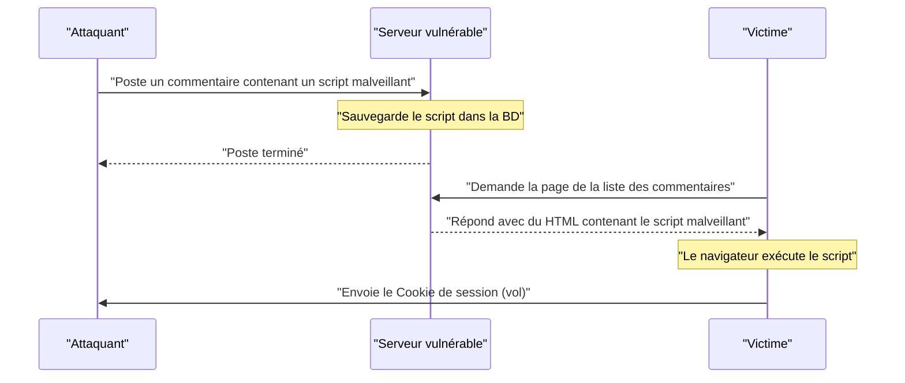
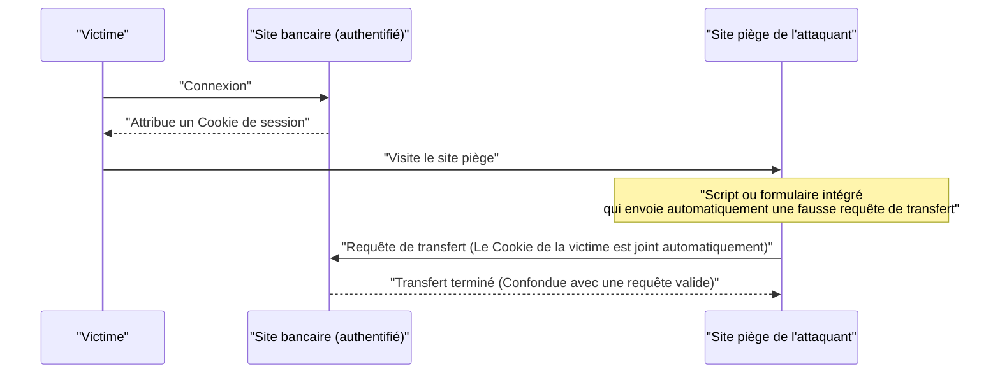
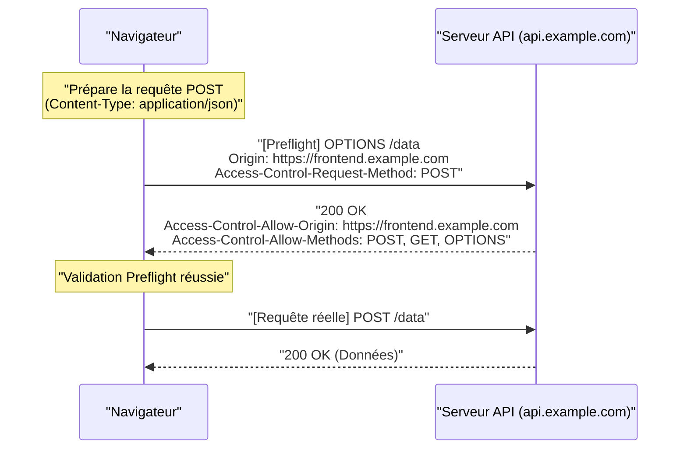
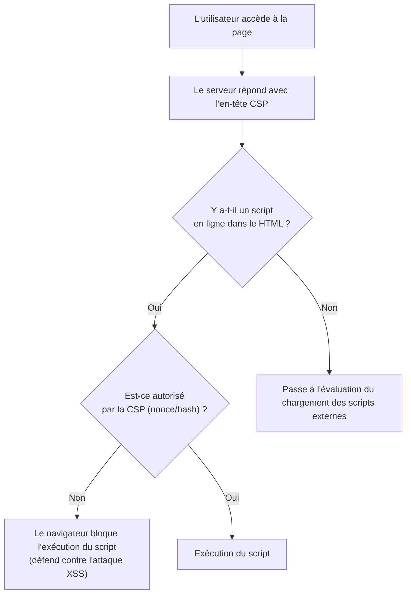

# Introduction
Les applications Web ont continué à évoluer, passant de simples visionneuses de documents à des systèmes d'entreprise très avancés et des plateformes de divertissement. Par conséquent, les données traitées par les applications Web deviennent de plus en plus sensibles et constituent souvent la cible de cyberattaques.

Dans cet article, nous expliquerons de manière exhaustive et détaillée depuis les vulnérabilités classiques et toujours redoutables comme le [XSS](https://kenji.blog/fr/p/web-application-vulnerability-owasp-top-10/) et le [CSRF](https://kenji.blog/fr/p/web-application-vulnerability-owasp-top-10/), qui sont les bases de la sécurité Web, jusqu'aux mécanismes de défense modernes essentiels au développement Web tels que le CORS, la CSP, et le SameSite Cookie. De plus, nous utiliserons des exemples de code concrets et des diagrammes Mermaid pour expliquer comment ces technologies fonctionnent ensemble pour construire des applications Web robustes.

---

# 1. Vulnérabilités classiques et toujours menaçantes

Dans l'histoire des applications Web, les vulnérabilités liées aux **injections** et aux **défauts de contrôle d'accès** existent depuis longtemps et figurent toujours régulièrement dans le Top 10 de l'[OWASP](https://kenji.blog/fr/p/web-application-vulnerability-owasp-top-10/). Ici, nous allons approfondir les cas représentatifs, à savoir le Cross-Site Scripting (XSS) et le Cross-Site Request Forgery (CSRF).

## 1.1 Cross-Site Scripting (XSS)

Le Cross-Site Scripting (XSS) est une méthode d'attaque où un attaquant injecte un script malveillant dans un site Web vulnérable et l'exécute sur le navigateur de l'utilisateur qui le consulte. Cela peut causer des dommages considérables, tels que le vol de jetons de session, l'usurpation des actions de l'utilisateur ou même la distribution de logiciels malveillants.

### 1.1.1 Types de XSS

Le XSS est principalement classé en trois catégories :

1.  **Reflected XSS (XSS réfléchi)**
    En incitant l'utilisateur à cliquer sur un lien malveillant préparé par l'attaquant, le script inclus dans la requête est « réfléchi » tel quel dans la réponse du serveur et exécuté sur le navigateur.
2.  **Stored XSS (XSS stocké)**
    Dans les fonctionnalités où les données saisies par l'utilisateur sont sauvegardées dans la base de données, comme les forums ou les sections de commentaires, l'attaquant publie un script malveillant. Celui-ci est alors exécuté pour tous les utilisateurs qui visitent cette page. L'ampleur des dégâts a tendance à être très importante.
3.  **DOM-based XSS**
    C'est une vulnérabilité qui se produit sans passer par le traitement côté serveur, lorsque le JavaScript côté client traite de manière non sécurisée des URL ou des valeurs d'entrée et les écrit dans le DOM.

### 1.1.2 Flux d'attaque XSS (Exemple de Stored XSS)

Le diagramme suivant montre le flux d'attaque du Stored XSS.



### 1.1.3 Exemples de code spécifiques et mesures de défense contre [XSS](https://kenji.blog/fr/p/web-application-vulnerability-owasp-top-10/)

**Exemple de code vulnérable (Node.js / Express)**

```javascript
app.get('/search', (req, res) => {
    const query = req.query.q;
    // Les entrées de l'utilisateur sont directement affichées en HTML, donc vulnérables au XSS
    res.send(`<h1>Résultat de la recherche : ${query}</h1>`);
});
```

Si un attaquant accède à l'URL `?q=<script>alert('XSS')</script>`, le script sera exécuté.

**Mesure de défense : Échappement**

La base pour prévenir le [XSS](https://kenji.blog/fr/p/web-application-vulnerability-owasp-top-10/) est de neutraliser (échapper) les entrées de l'utilisateur afin qu'elles ne soient pas interprétées comme du HTML. En particulier, les 5 caractères spéciaux `<`, `>`, `&`, `"`, `'` sont convertis en entités HTML.

```javascript
function escapeHTML(str) {
    return str.replace(/[&<>'"]/g, function(match) {
        const escapeMap = {
            '&': '&amp;',
            '<': '&lt;',
            '>': '&gt;',
            "'": '&#39;',
            '"': '&quot;'
        };
        return escapeMap[match];
    });
}

app.get('/search', (req, res) => {
    const query = escapeHTML(req.query.q);
    res.send(`<h1>Résultat de la recherche : ${query}</h1>`);
});
```

De nos jours, les frameworks front-end modernes comme React et Vue.js effectuent l'échappement par défaut, de sorte qu'une certaine protection contre le [XSS](https://kenji.blog/fr/p/web-application-vulnerability-owasp-top-10/) est appliquée même sans que le développeur en soit conscient. Cependant, il faut toujours être prudent lors de l'utilisation de `dangerouslySetInnerHTML` (React) ou `v-html` (Vue.js).

---

## 1.2 Cross-Site Request Forgery ([CSRF](https://kenji.blog/fr/p/web-application-vulnerability-owasp-top-10/))

Le Cross-Site Request Forgery (CSRF) est une attaque dans laquelle un utilisateur est forcé d'envoyer des requêtes non désirées (transferts d'argent, changements de mot de passe, désinscriptions, etc.) à un site Web authentifié via un site piège préparé par l'attaquant.

### 1.2.1 Flux d'attaque CSRF



Selon les spécifications du navigateur, les requêtes adressées à un domaine spécifique sont automatiquement accompagnées des Cookies associés à ce domaine. Le [CSRF](https://kenji.blog/fr/p/web-application-vulnerability-owasp-top-10/) exploite ce mécanisme.

### 1.2.2 Mesures de défense contre le CSRF

Pour prévenir le CSRF, il est nécessaire de vérifier si la requête résulte réellement d'une action voulue par l'utilisateur.

**1. Utilisation de jetons CSRF**

La méthode la plus courante consiste à générer côté serveur une chaîne aléatoire difficile à deviner (jeton CSRF) et à l'intégrer en tant que champ caché (`hidden`) dans le formulaire. Lors de la réception de la requête, le jeton enregistré dans la session est comparé à celui envoyé, et la requête est rejetée s'ils ne correspondent pas.

```html
<!-- Intégration du jeton CSRF dans le formulaire -->
<form action="/transfer" method="POST">
    <input type="hidden" name="csrf_token" value="Chaîne aléatoire générée par le serveur">
    <input type="text" name="amount" value="10000">
    <button type="submit">Transférer</button>
</form>
```

**2. Utilisation de l'attribut SameSite Cookie**

En configurant l'attribut **SameSite**, détaillé plus loin, sur les Cookies, vous pouvez empêcher qu'ils soient joints aux requêtes provenant d'autres sites, ce qui est extrêmement efficace comme mesure anti-[CSRF](https://kenji.blog/fr/p/web-application-vulnerability-owasp-top-10/).

---

# 2. Mécanismes de défense soutenant la sécurité Web moderne

À mesure que les applications Web se sont complexifiées et que les SPA (Single Page Applications) basées sur des API sont devenues la norme, les limites des mesures classiques sont apparues. De nouvelles normes sont alors apparues successivement pour garantir la sécurité au niveau du navigateur. Nous expliquerons ici en détail **CORS**, **CSP** et le **SameSite Cookie**, qui sont les piliers de la sécurité Web moderne.

## 2.1 Cross-Origin Resource Sharing (CORS)

Le Web possède depuis longtemps un modèle de sécurité puissant appelé **Politique de même origine (Same-Origin Policy : SOP)**. La SOP limite un document ou un script chargé depuis une origine (une combinaison de schéma, hôte et port) à interagir avec des ressources provenant d'une autre origine. Cela empêche les sites malveillants de lire des données.

Cependant, dans le Web moderne, il est courant que le front-end (ex : `https://frontend.example.com`) et l'API back-end (ex : `https://api.example.com`) aient des origines différentes. Sous la SOP, les requêtes Ajax du front-end vers l'API seraient bloquées.

Le mécanisme qui permet d'assouplir cette restriction en toute sécurité et de partager des ressources entre des origines autorisées s'appelle **CORS (Cross-Origin Resource Sharing)**.

### 2.1.1 Le fonctionnement des requêtes Preflight (Preflight Request)

Dans le mécanisme CORS, avant d'envoyer des requêtes qui pourraient affecter les données du serveur (ex : `POST`, `PUT`, `DELETE` ou des requêtes contenant des en-têtes personnalisés), le navigateur envoie automatiquement une **requête Preflight** pour vérifier si le serveur est prêt à accepter la requête réelle.

La requête Preflight utilise la méthode `OPTIONS` et inclut les en-têtes suivants :
- `Origin` : L'origine de la requête
- `Access-Control-Request-Method` : La méthode utilisée dans la requête réelle
- `Access-Control-Request-Headers` : Les en-têtes personnalisés utilisés dans la requête réelle



### 2.1.2 Bonnes pratiques et performances de configuration CORS

**Configuration appropriée de `Access-Control-Allow-Origin`**

Si vous définissez `Access-Control-Allow-Origin: *`, vous pouvez autoriser l'accès depuis n'importe quelle origine, mais `*` ne peut pas être utilisé pour les requêtes accompagnées d'informations d'authentification comme les Cookies (`withCredentials: true`). Pour des raisons de sécurité, il est fortement recommandé de spécifier explicitement les origines autorisées.

**Amélioration des performances par la mise en cache de Preflight**

Les requêtes Preflight engendrent un surcoût de communication et peuvent entraîner une dégradation des performances de l'application. Pour éviter cela, il est important d'utiliser l'en-tête `Access-Control-Max-Age` pour demander au navigateur de mettre en cache les résultats de Preflight.

```http
Access-Control-Max-Age: 86400
```
(L'unité est en secondes. Dans cet exemple, mis en cache pendant 24 heures)

**Comparaison des performances (Modèle mathématique)**

Soit $T$ le temps nécessaire pour une requête, $L$ la latence du réseau, et $S$ le temps de traitement du serveur.

Requête classique de même origine :
$ T_{normal} = 2L + S $

Requête CORS non mise en cache (avec Preflight) :
$ T_{cors\_unached} = 4L + S_{options} + S_{actual} $

Le temps nécessaire pour une requête CORS mise en cache est considérablement réduit et devient presque équivalent à un accès normal.

$$
\begin{aligned}
T_{cors\_cached} &= 2L + S_{actual} \\\\
&\approx T_{normal}
\end{aligned}
$$

Ainsi, en mettant en cache le Preflight, la latence $2L$ et le temps de traitement des OPTIONS $S_{options}$ peuvent être éliminés, permettant d'espérer une amélioration spectaculaire de la vitesse.

---

## 2.2 Content Security Policy (CSP)

La **Content Security Policy (CSP)** est un mécanisme de défense en profondeur puissant pour prévenir fondamentalement les attaques [XSS](https://kenji.blog/fr/p/web-application-vulnerability-owasp-top-10/) et les injections de données. Elle définit strictement sous forme de liste blanche côté serveur les origines des ressources (scripts, images, feuilles de style, etc.) qu'une page Web peut charger.

### 2.2.1 Syntaxe de base de la CSP

La CSP est transmise au navigateur via l'en-tête de réponse HTTP `Content-Security-Policy`.

```http
Content-Security-Policy: default-src 'self'; script-src 'self' https://trusted.cdn.com; img-src *;
```

- `default-src 'self'` : Restreint la source par défaut pour toutes les ressources uniquement à sa propre origine.
- `script-src 'self' https://trusted.cdn.com` : Autorise le chargement de JavaScript uniquement à partir de sa propre origine et du CDN spécifié.
- `img-src *` : Les images peuvent être chargées de n'importe où.

### 2.2.2 Éradication du [XSS](https://kenji.blog/fr/p/web-application-vulnerability-owasp-top-10/) par l'interdiction des scripts en ligne

La principale caractéristique de la CSP est l'interdiction par défaut de **l'exécution de scripts en ligne (`<script>...</script>`) et l'utilisation de `eval()`**. Grâce à cela, même si un attaquant injecte un script malveillant dans le HTML (Stored [XSS](https://kenji.blog/fr/p/web-application-vulnerability-owasp-top-10/) ou Reflected XSS), le navigateur bloquera l'exécution en tant que violation de la CSP.



### 2.2.3 Utilisation de nonce et de hash

S'il est absolument nécessaire d'utiliser des scripts en ligne (ex : tags Google Analytics), des méthodes d'autorisation sécurisées sont disponibles.

**1. Utilisation d'un Nonce (Nombre utilisé une seule fois)**

Le serveur génère une chaîne de caractères aléatoire unique (nonce) pour chaque requête et la spécifie dans l'en-tête CSP et l'attribut de la balise `<script>`. L'exécution n'est autorisée que si les deux correspondent.

En-tête HTTP :
```http
Content-Security-Policy: script-src 'nonce-r4nd0mStr1ng';
```

HTML :
```html
<script nonce="r4nd0mStr1ng">
    console.log("Ce script sera exécuté");
</script>
<script>
    alert("Le script de l'attaquant sera bloqué");
</script>
```

**2. Utilisation d'un Hash (Hachage)**

La valeur de hachage (SHA-256, etc.) du contenu du script est calculée et spécifiée dans l'en-tête CSP.

En-tête HTTP :
```http
Content-Security-Policy: script-src 'sha256-B2yPHKaXnvFWtRChIbabYmUBFZdVfKKXHbWtWidDVF8=';
```

### 2.2.4 Fonction de rapport des violations CSP

La CSP dispose d'une fonctionnalité permettant d'envoyer un rapport depuis le navigateur vers un point de terminaison spécifié lorsqu'une violation de la politique se produit. Cela permet aux administrateurs d'être informés des tentatives de [XSS](https://kenji.blog/fr/p/web-application-vulnerability-owasp-top-10/) inconnues ou des erreurs de configuration.

```http
Content-Security-Policy: default-src 'self'; report-uri /csp-violation-report-endpoint/
```
※Ces dernières années, `report-uri` a été déprécié et l'utilisation de l'en-tête `Report-To` plus puissant est recommandée.

---

## 2.3 SameSite Cookie pour la défense contre le [CSRF](https://kenji.blog/fr/p/web-application-vulnerability-owasp-top-10/)

Les Cookies sont essentiels à la gestion des sessions utilisateurs dans les applications Web, mais le fait qu'ils soient envoyés automatiquement lors des requêtes intersites était un terrain propice au CSRF. Ce problème est résolu par l'attribut **SameSite** des Cookies.

### 2.3.1 Les 3 modes de l'attribut SameSite

L'attribut SameSite peut être configuré avec les trois valeurs suivantes :

1.  **Strict**
    C'est la configuration la plus stricte. Le Cookie n'est envoyé que si la requête provient du même site (le domaine de premier niveau et celui immédiatement inférieur correspondent). Même lors d'une transition en cliquant sur un lien depuis un site externe, le Cookie ne sera pas envoyé. Cela offre un haut niveau de sécurité, mais peut nuire à l'ergonomie, par exemple en ne préservant pas l'état de connexion lors de l'accès depuis un lien externe.

2.  **Lax**
    C'est la valeur par défaut actuelle des navigateurs. En principe, le Cookie n'est pas envoyé dans les requêtes intersites, mais il le sera uniquement dans le cas de navigations de premier niveau (transitions d'écran par des clics sur des liens) utilisant une méthode HTTP sécurisée (comme GET). C'est un paramètre qui équilibre la commodité et la sécurité.

3.  **None**
    Tout comme le comportement traditionnel, il envoie toujours le Cookie même pour les requêtes intersites. Lors de l'utilisation de ce paramètre, il est obligatoire d'ajouter l'attribut `Secure` (le Cookie est envoyé uniquement en HTTPS).

```http
Set-Cookie: session_id=abc123xyz; SameSite=Strict; Secure; HttpOnly
```

### 2.3.2 Le mécanisme de protection SameSite = Lax

Le tableau suivant montre le comportement du Cookie (lorsque `SameSite=Lax` est défini) lorsqu'une requête est envoyée à un site bancaire à partir d'un site d'un autre domaine (site piège).

| Opération de l'utilisateur (sur le site piège) | Méthode HTTP | Type de requête | Envoi du Cookie | Impact sur le [CSRF](https://kenji.blog/fr/p/web-application-vulnerability-owasp-top-10/) |
| :--- | :--- | :--- | :--- | :--- |
| Clic sur un lien (`<a>`) | GET | Navigation de premier niveau | **Envoyé** | Sécurisé car GET ne modifie pas l'état |
| Soumission de formulaire (`<form>`) | GET | Navigation de premier niveau | **Envoyé** | Sécurisé car GET ne modifie pas l'état |
| Soumission de formulaire (`<form>`) | POST | Navigation de premier niveau | **Bloqué** | **Empêche l'attaque [CSRF](https://kenji.blog/fr/p/web-application-vulnerability-owasp-top-10/)** |
| Communication asynchrone (fetch, XHR) | GET/POST | Sous-requête | **Bloqué** | **Empêche l'attaque CSRF** |
| Chargement d'image (``) | GET | Sous-requête | **Bloqué** | Sécurisé |

Ainsi, le simple fait de définir `SameSite=Lax` (ou qu'il fonctionne comme configuration par défaut du navigateur) désactive les attaques [CSRF](https://kenji.blog/fr/p/web-application-vulnerability-owasp-top-10/) classiques utilisant la méthode POST. Cependant, pour une défense totale, son utilisation conjointe avec les traditionnels jetons CSRF est recommandée.

---

# 3. Les compromis des mesures de sécurité

Lors de l'introduction de mesures de sécurité solides, il faut toujours prendre en compte le compromis entre **confort d'utilisation (utilisabilité)** et **performances**.

## 3.1 Sécurité vs Confort d'utilisation

Par exemple, si l'attribut SameSite d'un Cookie est réglé sur `Strict`, il est extrêmement efficace contre le [CSRF](https://kenji.blog/fr/p/web-application-vulnerability-owasp-top-10/), mais si un utilisateur accède à votre site en cliquant sur un lien dans un email promotionnel, il sera traité comme n'étant pas connecté, ce qui peut nuire à l'UX (Expérience Utilisateur). Il est nécessaire d'équilibrer cela en sélectionnant `Lax` en fonction des caractéristiques de l'application, et de demander un mot de passe à usage unique ou une ré-authentification pour les opérations importantes.

## 3.2 Sécurité vs Performances

L'introduction de la CSP améliore considérablement la sécurité, mais sa conception et son maintien coûtent en termes d'exploitation. De plus, la génération de Nonce pour chaque requête, ou les requêtes Preflight pour le CORS, consomment, même légèrement, les ressources de calcul du serveur et la bande passante du réseau.

Comme mentionné précédemment, il est essentiel pour le CORS de configurer une durée de cache appropriée (`Access-Control-Max-Age`) afin de minimiser la dégradation des performances.

---

# 4. Conclusion et perspectives d'avenir

Dans cet article, nous avons expliqué les connaissances de base et les technologies récentes pour protéger les applications Web contre les menaces.

*   **[XSS](https://kenji.blog/fr/p/web-application-vulnerability-owasp-top-10/) et [CSRF](https://kenji.blog/fr/p/web-application-vulnerability-owasp-top-10/)** : Bien qu'anciennes, ce sont des vulnérabilités qui causent encore des dommages fatals aujourd'hui. L'échappement approprié et la défense par jetons sont fondamentaux.
*   **CORS** : Un mécanisme pour réaliser une communication inter-origines sécurisée dans les architectures Web modernes complexes.
*   **CSP** : Une politique puissante pour bloquer les attaques par injection telles que le XSS au niveau du navigateur, en excluant les scripts en ligne, entre autres.
*   **SameSite Cookie** : Un pare-feu standard du navigateur contre le CSRF. Son importance grandit dans le mouvement vers l'abolition des Cookies tiers.

Le monde de la sécurité Web est un jeu permanent du chat et de la souris. Même si les fournisseurs de navigateurs offrent des mécanismes de défense puissants (CSP, SameSite), les attaquants inventent sans cesse de nouvelles techniques de contournement (DOM Clobbering, CSS Injection, etc.).

Les développeurs doivent reconnaître qu'il n'y a pas de « remède miracle », et appliquer scrupuleusement une approche de **Défense en profondeur (Defense in Depth)** combinant la validation des entrées, l'échappement des sorties, la configuration adéquate des en-têtes HTTP (CSP, CORS, HSTS, etc.), et des évaluations de vulnérabilité continues.

Continuons à suivre les dernières tendances pour construire des applications Web plus sûres et plus fiables.
