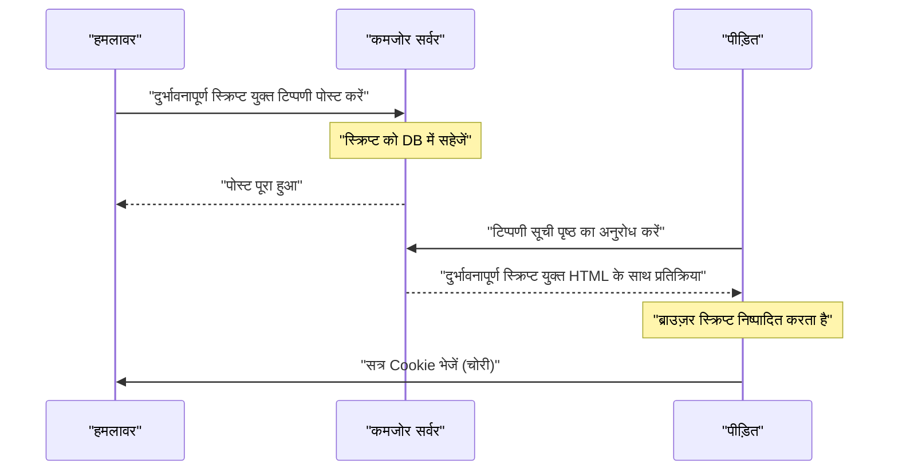
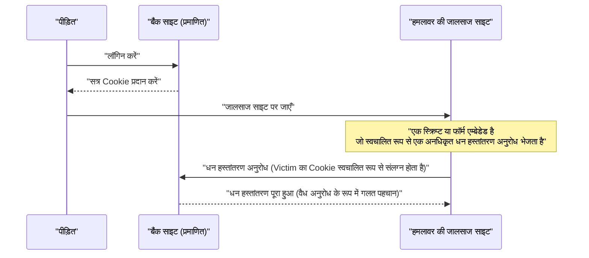
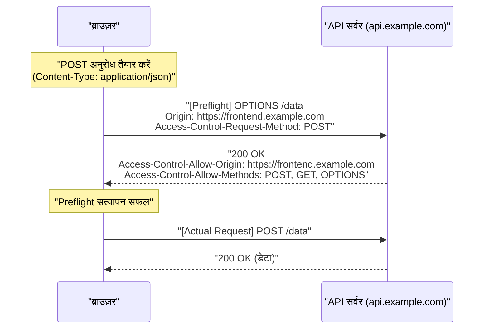
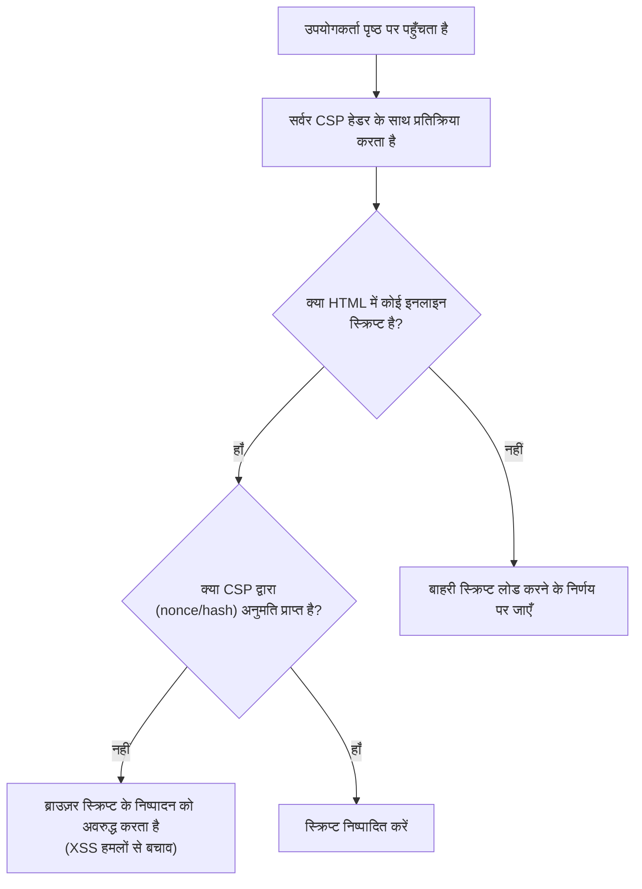

# परिचय
वेब एप्लिकेशन्स निरंतर विकसित हो रहे हैं, जो मात्र डॉक्यूमेंट व्यूअर से लेकर उन्नत व्यावसायिक सिस्टम और एंटरटेनमेंट प्लेटफॉर्म में बदल गए हैं। इसके साथ ही, वेब एप्लिकेशन द्वारा संभाला जाने वाला डेटा तेजी से संवेदनशील हो गया है, जिससे वे साइबर हमलों का आसान लक्ष्य बन गए हैं।

इस लेख में, हम वेब सुरक्षा के मूल सिद्धांतों जैसे XSS और CSRF जैसी क्लासिक कमजोरियों के बारे में विस्तार से चर्चा करेंगे, जो आज भी खतरा बनी हुई हैं, से लेकर CORS, CSP, और SameSite Cookie जैसे नवीनतम सुरक्षा तंत्रों तक, जो आधुनिक वेब विकास में आवश्यक हैं। इसके अलावा, हम विशिष्ट कोड उदाहरणों और Mermaid आरेखों का उपयोग करके यह भी स्पष्ट करेंगे कि ये तकनीकें एक मजबूत वेब एप्लिकेशन बनाने के लिए एक साथ कैसे काम करती हैं।

---

# 1. क्लासिक और आधुनिक खतरों वाली कमजोरियाँ

वेब अनुप्रयोगों के इतिहास में लंबे समय से मौजूद और अभी भी OWASP टॉप 10 में नियमित रूप से शामिल **इंजेक्शन (Injection)** और **टूटा हुआ एक्सेस कंट्रोल (Broken Access Control)** से संबंधित कमजोरियां हैं। यहाँ, हम उनके मुख्य प्रतिनिधियों, क्रॉस-साइट स्क्रिप्टिंग (XSS) और क्रॉस-साइट रिक्वेस्ट फोर्जरी (CSRF) के बारे में गहराई से जानेंगे।

## 1.1 क्रॉस-साइट स्क्रिप्टिंग (XSS)

क्रॉस-साइट स्क्रिप्टिंग (XSS) एक हमला तकनीक है जहाँ हमलावर एक कमजोर वेबसाइट में दुर्भावनापूर्ण स्क्रिप्ट इंजेक्ट करता है और उसे ब्राउज़ करने वाले उपयोगकर्ता के ब्राउज़र पर निष्पादित करता है। इसके परिणामस्वरूप सत्र टोकन की चोरी, उपयोगकर्ता कार्यों की जालसाजी, और यहां तक कि मैलवेयर का वितरण भी हो सकता है, जिससे गंभीर नुकसान हो सकता है।

### 1.1.1 XSS के प्रकार

XSS को मुख्य रूप से तीन प्रकारों में वर्गीकृत किया गया है।

1.  **प्रतिबिंबित XSS (Reflected XSS)**
    यह एक ऐसी तकनीक है जहाँ एक उपयोगकर्ता हमलावर द्वारा तैयार किए गए दुर्भावनापूर्ण लिंक पर क्लिक करता है, और अनुरोध में शामिल स्क्रिप्ट सर्वर से प्रतिक्रिया के रूप में "प्रतिबिंबित" होती है और सीधे ब्राउज़र पर निष्पादित होती है।
2.  **संग्रहीत XSS (Stored XSS)**
    मैसेज बोर्ड और टिप्पणी अनुभागों जैसी सुविधाओं में जहां उपयोगकर्ता द्वारा दर्ज किया गया डेटा डेटाबेस में सहेजा जाता है, यह तकनीक एक दुर्भावनापूर्ण स्क्रिप्ट पोस्ट करती है और उस पृष्ठ को देखने वाले प्रत्येक उपयोगकर्ता को स्क्रिप्ट निष्पादित करने के लिए मजबूर करती है। नुकसान का पैमाना बहुत बड़ा हो सकता है।
3.  **DOM-आधारित XSS (DOM-based XSS)**
    यह एक ऐसी भेद्यता है जो तब होती है जब क्लाइंट-साइड JavaScript URL या इनपुट मानों को सुरक्षित रूप से संसाधित किए बिना सर्वर-साइड प्रोसेसिंग के बिना DOM को लिखता है।

### 1.1.2 XSS का हमला प्रवाह (Stored XSS का उदाहरण)

नीचे दिया गया आरेख Stored XSS का हमला प्रवाह दिखाता है।



### 1.1.3 XSS के विशिष्ट कोड उदाहरण और सुरक्षा उपाय

**कमजोर कोड उदाहरण (Node.js / Express)**

```javascript
app.get('/search', (req, res) => {
    const query = req.query.q;
    // उपयोगकर्ता इनपुट सीधे HTML में आउटपुट हो रहा है, इसलिए यह XSS के प्रति संवेदनशील है
    res.send(`<h1>खोज परिणाम: ${query}</h1>`);
});
```

यदि कोई हमलावर `?q=<script>alert('XSS')</script>` URL के साथ एक्सेस करता है, तो स्क्रिप्ट निष्पादित हो जाएगी।

**सुरक्षा उपाय: एस्केप प्रोसेसिंग (Escape Processing)**

XSS को रोकने का मूल सिद्धांत उपयोगकर्ता इनपुट को हानिरहित बनाना (एस्केप करना) है ताकि इसे HTML के रूप में व्याख्यायित न किया जा सके। विशेष रूप से, 5 विशेष वर्णों `<`, `>`, `&`, `"`, `'` को HTML संस्थाओं में परिवर्तित किया जाता है।

```javascript
function escapeHTML(str) {
    return str.replace(/[&<>'"]/g, function(match) {
        const escapeMap = {
            '&': '&amp;',
            '<': '&lt;',
            '>': '&gt;',
            "'": '&#39;',
            '"': '&quot;'
        };
        return escapeMap[match];
    });
}

app.get('/search', (req, res) => {
    const query = escapeHTML(req.query.q);
    res.send(`<h1>खोज परिणाम: ${query}</h1>`);
});
```

आजकल, React और Vue.js जैसे आधुनिक फ्रंट-एंड फ्रेमवर्क डिफ़ॉल्ट रूप से एस्केप प्रोसेसिंग करते हैं, इसलिए डेवलपर्स को सचेत हुए बिना कुछ हद तक XSS के खिलाफ सुरक्षा प्रदान की जाती है। हालाँकि, `dangerouslySetInnerHTML` (React) या `v-html` (Vue.js) का उपयोग करते समय अभी भी सावधानी बरतने की आवश्यकता है।

---

## 1.2 क्रॉस-साइट रिक्वेस्ट फोर्जरी (CSRF)

क्रॉस-साइट रिक्वेस्ट फोर्जरी (CSRF) एक ऐसा हमला है जिसमें एक उपयोगकर्ता को प्रमाणित वेबसाइट पर एक अनपेक्षित अनुरोध (धन हस्तांतरण, पासवर्ड परिवर्तन, सदस्यता रद्द करना, आदि) भेजने के लिए मजबूर किया जाता है, जो हमलावर द्वारा तैयार की गई जालसाज साइट के माध्यम से होता है।

### 1.2.1 CSRF का हमला प्रवाह



ब्राउज़र के विनिर्देशों के कारण, किसी विशिष्ट डोमेन के लिए अनुरोधों में स्वचालित रूप से उस डोमेन से जुड़ी Cookie शामिल होती है। CSRF इसी तंत्र का दुरुपयोग करता है।

### 1.2.2 CSRF के सुरक्षा उपाय

CSRF को रोकने के लिए, यह जाँचना आवश्यक है कि अनुरोध वास्तव में उपयोगकर्ता के इच्छित कार्य का परिणाम है या नहीं।

**1. CSRF टोकन का उपयोग**

सबसे आम उपाय यह है कि सर्वर-साइड पर एक यादृच्छिक (random) और अनुमान लगाने में कठिन स्ट्रिंग (CSRF टोकन) उत्पन्न की जाए और इसे फॉर्म के छिपे हुए फ़ील्ड (`hidden`) के रूप में एम्बेड किया जाए। अनुरोध प्राप्त होने पर, यह सत्र में सहेजे गए टोकन की तुलना भेजे गए टोकन से करता है, और यदि वे मेल नहीं खाते हैं, तो अनुरोध को अस्वीकार कर देता है।

```html
<!-- फॉर्म में CSRF टोकन एम्बेड करें -->
<form action="/transfer" method="POST">
    <input type="hidden" name="csrf_token" value="सर्वर द्वारा उत्पन्न यादृच्छिक स्ट्रिंग">
    <input type="text" name="amount" value="10000">
    <button type="submit">पैसे भेजें</button>
</form>
```

**2. SameSite Cookie विशेषता का उपयोग**

बाद में वर्णित **SameSite** विशेषता को Cookie में सेट करके, आप क्रॉस-साइट से अनुरोधों में Cookie को संलग्न होने से रोक सकते हैं, जो CSRF के खिलाफ बहुत प्रभावी है।

---

# 2. आधुनिक वेब सुरक्षा का समर्थन करने वाले रक्षा तंत्र

जैसे-जैसे वेब एप्लिकेशन अधिक जटिल होते गए और API-आधारित SPA (सिंगल पेज एप्लिकेशन) मुख्यधारा बन गए, अकेले क्लासिक उपायों ने अपनी सीमाएं दिखानी शुरू कर दीं। इसलिए, ब्राउज़र स्तर पर सुरक्षा सुनिश्चित करने के लिए एक के बाद एक नए मानक सामने आए। यहाँ, हम **CORS**, **CSP**, और **SameSite Cookie** के बारे में विस्तार से चर्चा करेंगे, जो आधुनिक वेब सुरक्षा के आधार हैं।

## 2.1 क्रॉस-ऑरिजिन रिसोर्स शेयरिंग (CORS)

लंबे समय से वेब पर **सेम-ऑरिजिन पॉलिसी (Same-Origin Policy: SOP)** नामक एक मजबूत सुरक्षा मॉडल मौजूद है। SOP "किसी एक ऑरिजिन (स्कीम, होस्ट और पोर्ट का संयोजन) से लोड किए गए दस्तावेज़ों या स्क्रिप्ट को अन्य ऑरिजिन के संसाधनों तक पहुँचने से प्रतिबंधित करता है।" यह दुर्भावनापूर्ण साइटों से डेटा पढ़ने को रोकता है।

हालाँकि, आधुनिक वेब में, यह सामान्य है कि फ्रंट-एंड (उदा: `https://frontend.example.com`) और बैक-एंड API (उदा: `https://api.example.com`) के ऑरिजिन अलग-अलग हों। SOP के तहत, फ्रंट-एंड से API के लिए Ajax अनुरोध अवरुद्ध कर दिए जाते हैं।

इस प्रतिबंध को सुरक्षित रूप से शिथिल करने और अनुमत ऑरिजिन के बीच संसाधनों को साझा करने की अनुमति देने वाला तंत्र **CORS (Cross-Origin Resource Sharing)** है।

### 2.1.1 प्रीफ़्लाइट अनुरोध (Preflight Request) का तंत्र

CORS में, सर्वर के डेटा को प्रभावित करने वाले अनुरोध (उदा: `POST`, `PUT`, `DELETE`, या कस्टम हेडर वाले अनुरोध) भेजने से पहले, ब्राउज़र स्वचालित रूप से एक **प्रीफ़्लाइट अनुरोध** भेजता है ताकि यह जांचा जा सके कि क्या सर्वर वास्तव में अनुरोध स्वीकार करने के लिए तैयार है।

प्रीफ़्लाइट अनुरोध `OPTIONS` विधि का उपयोग करता है और इसमें निम्नलिखित हेडर शामिल होते हैं:
- `Origin`: अनुरोधकर्ता का ऑरिजिन
- `Access-Control-Request-Method`: वास्तविक अनुरोध में प्रयुक्त विधि
- `Access-Control-Request-Headers`: वास्तविक अनुरोध में प्रयुक्त कस्टम हेडर



### 2.1.2 CORS सेटिंग्स के लिए सर्वोत्तम अभ्यास और प्रदर्शन

**उचित `Access-Control-Allow-Origin` सेट करना**

यदि आप `Access-Control-Allow-Origin: *` सेट करते हैं, तो आप सभी ऑरिजिन से पहुंच की अनुमति दे सकते हैं, लेकिन `*` का उपयोग प्रमाणीकरण जानकारी (जैसे कुकीज़) वाले अनुरोधों (`withCredentials: true`) के साथ नहीं किया जा सकता है। सुरक्षा कारणों से स्पष्ट रूप से अनुमत ऑरिजिन निर्दिष्ट करने की भी अनुशंसा की जाती है।

**प्रीफ़्लाइट कैशिंग के माध्यम से प्रदर्शन में सुधार**

प्रीफ़्लाइट अनुरोध संचार ओवरहेड का कारण बनते हैं और एप्लिकेशन के प्रदर्शन को कम कर सकते हैं। इसे रोकने के लिए, `Access-Control-Max-Age` हेडर का उपयोग करके ब्राउज़र को प्रीफ़्लाइट परिणामों को कैश करने का निर्देश देना महत्वपूर्ण है।

```http
Access-Control-Max-Age: 86400
```
(इकाई सेकंड में है। इस उदाहरण में, 24 घंटे की कैशिंग)

**प्रदर्शन की तुलना (गणितीय मॉडल)**

मान लीजिए कि अनुरोध में लगने वाला समय $T$ है, नेटवर्क विलंबता $L$ है, और सर्वर प्रसंस्करण समय $S$ है।

सामान्य सेम-ऑरिजिन अनुरोध:
$ T_{normal} = 2L + S $

बिना कैश किए गए CORS अनुरोध (प्रीफ़्लाइट के साथ):
$ T_{cors\_unached} = 4L + S_{options} + S_{actual} $

कैश किए गए CORS अनुरोधों में लगने वाला समय काफी कम हो जाता है और लगभग सामान्य पहुंच के बराबर हो जाता है।

$$
\begin{aligned}
T_{cors\_cached} &= 2L + S_{actual} \\\\
&\approx T_{normal}
\end{aligned}
$$

इस प्रकार, प्रीफ़्लाइट को कैश करके, विलंबता $2L$ और OPTIONS प्रसंस्करण समय $S_{options}$ को कम किया जा सकता है, जिससे गति में उल्लेखनीय सुधार होता है।

---

## 2.2 सामग्री सुरक्षा नीति (CSP)

**सामग्री सुरक्षा नीति (Content Security Policy: CSP)** XSS और डेटा इंजेक्शन हमलों को मूल रूप से रोकने के लिए एक मजबूत बहु-स्तरीय रक्षा तंत्र है। यह सर्वर-साइड पर एक सख्त श्वेतसूची को परिभाषित करता है जिसमें उन संसाधनों (स्क्रिप्ट, चित्र, स्टाइलशीट, आदि) के स्रोत (ऑरिजिन) शामिल होते हैं जिन्हें एक वेब पेज लोड कर सकता है।

### 2.2.1 CSP का मूल सिंटैक्स

CSP ब्राउज़र को HTTP प्रतिक्रिया हेडर `Content-Security-Policy` के माध्यम से प्रेषित किया जाता है।

```http
Content-Security-Policy: default-src 'self'; script-src 'self' https://trusted.cdn.com; img-src *;
```

- `default-src 'self'`: सभी संसाधनों के लिए डिफ़ॉल्ट लोडिंग स्रोत को केवल अपने स्वयं के ऑरिजिन तक सीमित करता है।
- `script-src 'self' https://trusted.cdn.com`: JavaScript को केवल अपने स्वयं के ऑरिजिन और निर्दिष्ट CDN से लोड करने की अनुमति देता है।
- `img-src *`: छवियों को कहीं से भी लोड किया जा सकता है।

### 2.2.2 इनलाइन स्क्रिप्ट पर प्रतिबंध के माध्यम से XSS का उन्मूलन

CSP की सबसे बड़ी विशेषता यह है कि यह डिफ़ॉल्ट रूप से **इनलाइन स्क्रिप्ट (`<script>...</script>`) के निष्पादन और `eval()` के उपयोग को प्रतिबंधित करता है**। इसके परिणामस्वरूप, भले ही कोई हमलावर HTML में कोई दुर्भावनापूर्ण स्क्रिप्ट इंजेक्ट करता हो, ब्राउज़र इसे CSP का उल्लंघन मानते हुए इसके निष्पादन को अवरुद्ध कर देगा।



### 2.2.3 nonce और hash का उपयोग

यदि इनलाइन स्क्रिप्ट का उपयोग करना नितांत आवश्यक हो (उदा: Google Analytics टैग), तो इसे सुरक्षित रूप से अनुमति देने के तरीके उपलब्ध हैं।

**1. Nonce (नॉन्स) का उपयोग**

सर्वर प्रत्येक अनुरोध के लिए एक अद्वितीय और यादृच्छिक स्ट्रिंग (nonce) उत्पन्न करता है और इसे CSP हेडर और `<script>` टैग की विशेषता में निर्दिष्ट करता है। निष्पादन की अनुमति केवल तभी दी जाती है जब दोनों मेल खाते हों।

HTTP हेडर:
```http
Content-Security-Policy: script-src 'nonce-r4nd0mStr1ng';
```

HTML:
```html
<script nonce="r4nd0mStr1ng">
    console.log("यह स्क्रिप्ट निष्पादित की जाएगी");
</script>
<script>
    alert("हमलावर की स्क्रिप्ट अवरुद्ध कर दी जाएगी");
</script>
```

**2. Hash (हैश) का उपयोग**

स्क्रिप्ट की सामग्री के हैश मान (जैसे SHA-256) की गणना की जाती है और CSP हेडर में निर्दिष्ट की जाती है।

HTTP हेडर:
```http
Content-Security-Policy: script-src 'sha256-B2yPHKaXnvFWtRChIbabYmUBFZdVfKKXHbWtWidDVF8=';
```

### 2.2.4 CSP उल्लंघन रिपोर्टिंग सुविधा

CSP में एक सुविधा होती है जो नीति उल्लंघन होने पर ब्राउज़र को निर्दिष्ट समापन बिंदु पर एक रिपोर्ट भेजने की अनुमति देती है। यह प्रशासकों को अज्ञात XSS प्रयासों या गलत कॉन्फ़िगरेशन के बारे में जागरूक होने की अनुमति देता है।

```http
Content-Security-Policy: default-src 'self'; report-uri /csp-violation-report-endpoint/
```
※हाल के वर्षों में, `report-uri` को अस्वीकृत कर दिया गया है, और अधिक शक्तिशाली `Report-To` हेडर का उपयोग करने की अनुशंसा की जाती है।

---

## 2.3 SameSite Cookie द्वारा CSRF रक्षा

वेब अनुप्रयोगों में उपयोगकर्ता सत्र प्रबंधन के लिए कुकीज़ आवश्यक हैं, लेकिन क्रॉस-साइट अनुरोधों के दौरान उनके स्वचालित रूप से भेजे जाने का विनिर्देश CSRF के लिए एक प्रजनन मैदान बन गया था। Cookie की **SameSite विशेषता** इस समस्या का समाधान करती है।

### 2.3.1 SameSite विशेषता के 3 मोड

SameSite विशेषता को निम्नलिखित 3 मानों पर सेट किया जा सकता है:

1.  **Strict**
    यह सबसे सख्त सेटिंग है। Cookie केवल तभी भेजी जाती है जब अनुरोध उसी साइट (शीर्ष-स्तरीय डोमेन और उसके नीचे का एक डोमेन मेल खाता हो) से हो। भले ही आप किसी बाहरी साइट के लिंक पर क्लिक करके नेविगेट करें, Cookie नहीं भेजी जाएगी। हालांकि यह उच्च सुरक्षा प्रदान करता है, यह सुविधा से समझौता कर सकता है, जैसे कि किसी बाहरी लिंक से एक्सेस करने पर लॉगिन स्थिति को न बनाए रखना।

2.  **Lax**
    यह वर्तमान ब्राउज़र का डिफ़ॉल्ट मान है। मूल रूप से, क्रॉस-साइट अनुरोधों में Cookie नहीं भेजी जाती है, लेकिन Cookie केवल तभी भेजी जाती है जब यह एक शीर्ष-स्तरीय नेविगेशन (लिंक पर क्लिक करने के कारण स्क्रीन संक्रमण) हो और एक सुरक्षित HTTP विधि (जैसे GET) का उपयोग किया जा रहा हो। यह एक सेटिंग है जो सुविधा और सुरक्षा को संतुलित करती है।

3.  **None**
    पारंपरिक व्यवहार के समान, कुकीज़ हमेशा भेजी जाती हैं, यहाँ तक कि क्रॉस-साइट अनुरोधों में भी। इस सेटिंग का उपयोग करते समय, आपको `Secure` विशेषता (Cookie केवल HTTPS पर भेजी जाती है) को शामिल करना होगा।

```http
Set-Cookie: session_id=abc123xyz; SameSite=Strict; Secure; HttpOnly
```

### 2.3.2 SameSite = Lax का सुरक्षा तंत्र

निम्न तालिका किसी अन्य डोमेन की साइट (जालसाज साइट) से बैंक साइट पर अनुरोध भेजे जाने पर Cookie के व्यवहार (जब SameSite=Lax सेट हो) को दिखाती है।

| उपयोगकर्ता की कार्रवाई (जालसाज साइट पर) | HTTP विधि | अनुरोध का प्रकार | Cookie भेजना | CSRF पर प्रभाव |
| :--- | :--- | :--- | :--- | :--- |
| लिंक (`<a>`) पर क्लिक करना | GET | शीर्ष-स्तरीय नेविगेशन | **भेजी जाती है** | GET स्थिति नहीं बदलता, इसलिए सुरक्षित है |
| फॉर्म (`<form>`) सबमिट करना | GET | शीर्ष-स्तरीय नेविगेशन | **भेजी जाती है** | GET स्थिति नहीं बदलता, इसलिए सुरक्षित है |
| फॉर्म (`<form>`) सबमिट करना | POST | शीर्ष-स्तरीय नेविगेशन | **अवरुद्ध** | **CSRF हमले को रोकता है** |
| एसिंक्रोनस संचार (fetch, XHR) | GET/POST | उप-अनुरोध | **अवरुद्ध** | **CSRF हमले को रोकता है** |
| छवि लोड करना (``) | GET | उप-अनुरोध | **अवरुद्ध** | सुरक्षित |

इस प्रकार, केवल `SameSite=Lax` सेट करने से (या इसे ब्राउज़र डिफ़ॉल्ट के रूप में कार्य करने देने से), POST विधि का उपयोग करके होने वाले क्लासिक CSRF हमले बेअसर हो जाते हैं। हालाँकि, पूर्ण सुरक्षा के लिए, इसे पारंपरिक CSRF टोकन के संयोजन में उपयोग करने की अनुशंसा की जाती है।

---

# 3. सुरक्षा उपायों के ट्रेड-ऑफ़

मजबूत सुरक्षा उपायों को लागू करते समय, हमेशा **सुविधा** और **प्रदर्शन** के बीच ट्रेड-ऑफ़ पर विचार करना आवश्यक है।

## 3.1 सुरक्षा बनाम सुविधा

उदाहरण के लिए, यदि Cookie की SameSite विशेषता को `Strict` पर सेट किया जाता है, तो यह CSRF के खिलाफ बहुत शक्तिशाली है, लेकिन यदि उपयोगकर्ता किसी प्रचार ईमेल में लिंक पर क्लिक करके आपकी साइट तक पहुंचता है, तो उसे गैर-लॉगिन माना जा सकता है, जो UX (उपयोगकर्ता अनुभव) से समझौता कर सकता है। एप्लिकेशन की विशेषताओं के अनुसार `Lax` का चयन करना आवश्यक है और महत्वपूर्ण कार्यों के लिए वन-टाइम पासवर्ड या पुनः प्रमाणीकरण की मांग करके संतुलन बनाना आवश्यक है।

## 3.2 सुरक्षा बनाम प्रदर्शन

CSP का परिचय सुरक्षा में नाटकीय रूप से सुधार करता है, लेकिन सख्त नीतियों के निर्माण और रखरखाव के लिए परिचालन लागत की आवश्यकता होती है। इसके अलावा, प्रत्येक अनुरोध के लिए Nonce का निर्माण और CORS में प्रीफ़्लाइट अनुरोध, सर्वर के गणना संसाधनों और नेटवर्क बैंडविड्थ की थोड़ी मात्रा की खपत करते हैं।

जैसा कि पहले उल्लेख किया गया है, CORS के लिए, एक उपयुक्त कैशिंग अवधि (`Access-Control-Max-Age`) सेट करना आवश्यक है ताकि प्रदर्शन में गिरावट को कम किया जा सके।

---

# 4. निष्कर्ष और भविष्य की संभावनाएं

इस लेख में, हमने वेब अनुप्रयोगों को खतरों से बचाने के लिए बुनियादी ज्ञान से लेकर नवीनतम तकनीक तक सब कुछ समझाया है।

*   **XSS और CSRF**: क्लासिक कमजोरियां जो आज भी घातक नुकसान पहुंचाती हैं। उचित एस्केप और टोकन का उपयोग करके सुरक्षा मूलभूत है।
*   **CORS**: जटिल आधुनिक वेब आर्किटेक्चर में सुरक्षित क्रॉस-ऑरिजिन संचार प्राप्त करने का एक तंत्र।
*   **CSP**: एक मजबूत नीति जो इनलाइन स्क्रिप्ट आदि को समाप्त करके ब्राउज़र स्तर पर XSS जैसे इंजेक्शन हमलों को रोकती है।
*   **SameSite Cookie**: CSRF के विरुद्ध एक ब्राउज़र-मानक बाधा। थर्ड-पार्टी कुकीज़ को समाप्त करने के कदम के साथ, इसका महत्व और भी अधिक बढ़ रहा है।

वेब सुरक्षा की दुनिया हमेशा एक चूहे-बिल्ली का खेल है। भले ही ब्राउज़र विक्रेता मजबूत रक्षा तंत्र (CSP और SameSite) प्रदान करते हैं, हमलावर नई बाईपास तकनीकों (जैसे DOM Clobbering और CSS Injection) के साथ आएंगे।

डेवलपर्स को यह पहचानना होगा कि कोई "सिल्वर बुलेट" नहीं है और इनपुट मानों के सत्यापन, आउटपुट के दौरान एस्केप, उपयुक्त HTTP हेडर (CSP, CORS, HSTS, आदि) की सेटिंग, और निरंतर भेद्यता निदान के संयोजन के साथ **बहु-स्तरीय रक्षा (Defense in Depth)** के दृष्टिकोण को पूरी तरह से लागू करना चाहिए।

आइए नवीनतम रुझानों से अवगत रहें और अधिक सुरक्षित और विश्वसनीय वेब एप्लिकेशन बनाएं।
