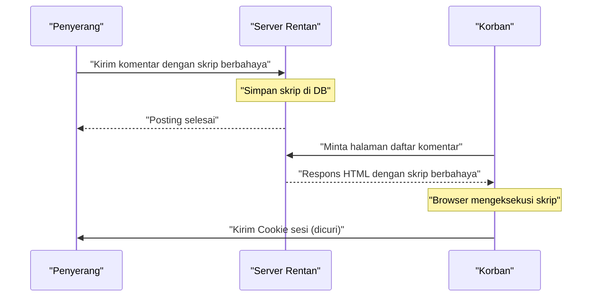
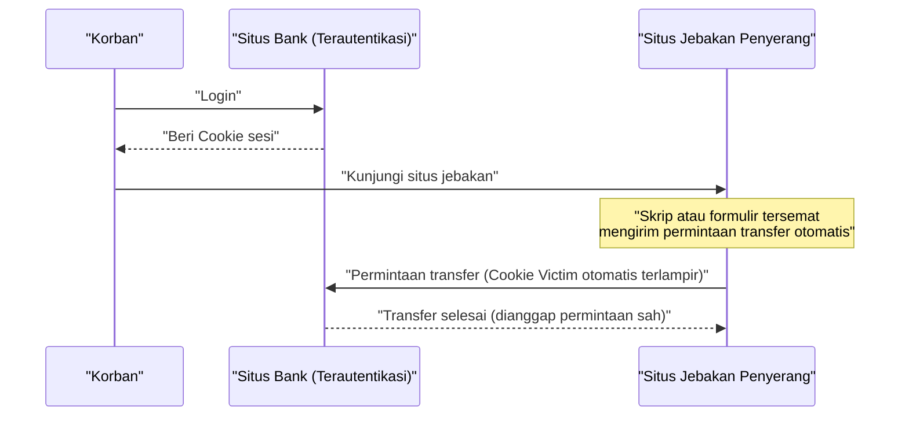
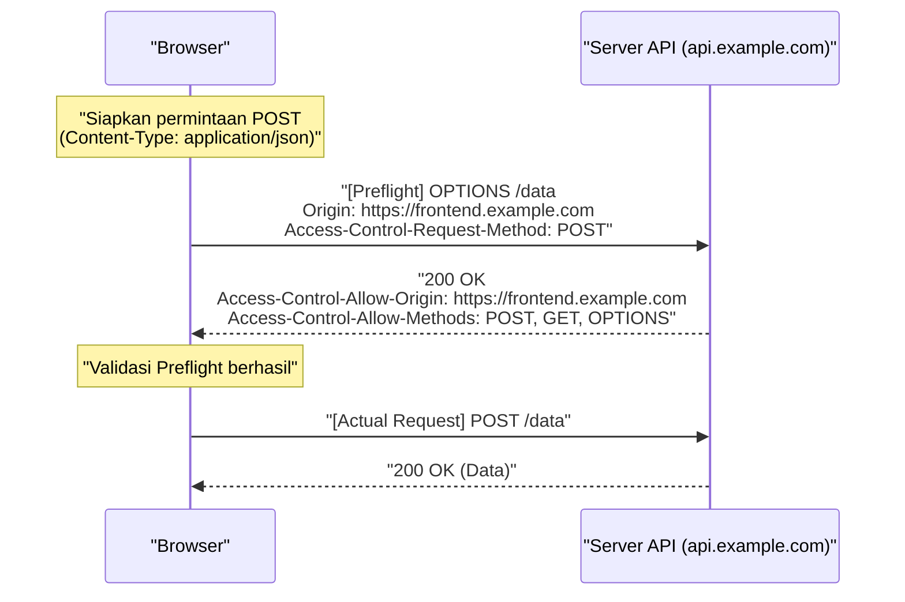
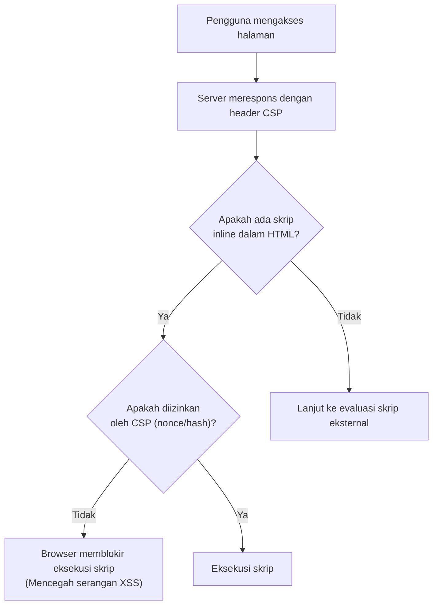

# Pendahuluan
Aplikasi web terus berkembang, berubah dari sekadar penampil dokumen menjadi sistem bisnis yang canggih dan platform hiburan. Seiring dengan itu, data yang ditangani oleh aplikasi web menjadi semakin sensitif dan lebih rentan menjadi target serangan siber.

Artikel ini membahas secara komprehensif dan mendetail mulai dari kerentanan klasik seperti [XSS](https://kenji.blog/id/p/web-application-vulnerability-owasp-top-10/) dan [CSRF](https://kenji.blog/id/p/web-application-vulnerability-owasp-top-10/), yang masih menjadi ancaman hingga saat ini, hingga mekanisme pertahanan terbaru yang menjadi esensial dalam pengembangan web modern, seperti CORS, CSP, dan Cookie SameSite. Lebih lanjut, kami juga akan menjelaskan bagaimana teknologi-teknologi ini bekerja sama untuk membangun aplikasi web yang tangguh, menggunakan contoh kode dan diagram Mermaid agar mudah dipahami.

---

# 1. Kerentanan Klasik yang Masih Menjadi Ancaman Saat Ini

Kerentanan yang telah ada sejak lama dalam sejarah aplikasi web dan masih sering muncul di [OWASP](https://kenji.blog/id/p/web-application-vulnerability-owasp-top-10/) Top 10 adalah kerentanan yang terkait dengan **injeksi** dan **kelemahan kontrol akses**. Di sini, kita akan membahas lebih dalam mengenai dua di antaranya: Cross-Site Scripting (XSS) dan Cross-Site Request Forgery (CSRF).

## 1.1 Cross-Site Scripting (XSS)

Cross-Site Scripting (XSS) adalah metode serangan di mana penyerang menyuntikkan skrip berbahaya ke dalam situs web yang rentan dan mengeksekusinya di browser pengguna yang mengunjungi situs tersebut. Hal ini dapat menyebabkan kerusakan besar, seperti pencurian token sesi, pemalsuan operasi pengguna, dan bahkan distribusi malware.

### 1.1.1 Jenis-Jenis XSS

XSS secara umum diklasifikasikan menjadi tiga jenis berikut:

1.  **Reflected XSS (XSS Terpantul)**
    Metode di mana penyerang mengelabui pengguna agar mengklik tautan berbahaya, sehingga skrip yang ada dalam permintaan tersebut langsung "dipantulkan" kembali dari server sebagai respons dan dieksekusi di browser.
2.  **Stored XSS (XSS Tersimpan)**
    Dalam fitur di mana data yang dimasukkan pengguna disimpan dalam database, seperti papan buletin atau kolom komentar, penyerang mengirimkan skrip berbahaya yang kemudian dieksekusi oleh setiap pengguna yang mengunjungi halaman tersebut. Kerusakan biasanya berskala jauh lebih besar.
3.  **DOM-based XSS**
    Kerentanan yang tidak melalui pemrosesan server, melainkan terjadi ketika JavaScript di sisi klien menuliskan URL atau nilai input ke DOM tanpa memprosesnya secara aman.

### 1.1.2 Alur Serangan XSS (Contoh Stored XSS)

Diagram di bawah ini menunjukkan alur serangan dari Stored XSS.



### 1.1.3 Contoh Kode dan Langkah Pencegahan [XSS](https://kenji.blog/id/p/web-application-vulnerability-owasp-top-10/)

**Contoh kode rentan (Node.js / Express)**

```javascript
app.get('/search', (req, res) => {
    const query = req.query.q;
    // Karena input pengguna langsung dikeluarkan ke HTML, ini rentan terhadap XSS
    res.send(`<h1>Hasil pencarian: ${query}</h1>`);
});
```

Jika penyerang mengakses dengan URL `?q=<script>alert('XSS')</script>`, skrip tersebut akan dieksekusi.

**Pencegahan: Proses Escaping**

Dasar untuk mencegah [XSS](https://kenji.blog/id/p/web-application-vulnerability-owasp-top-10/) adalah mensterilkan (melakukan escape) input pengguna agar tidak dievaluasi sebagai HTML. Khususnya, ubah 5 karakter khusus `<`, `>`, `&`, `"`, `'` menjadi entitas HTML.

```javascript
function escapeHTML(str) {
    return str.replace(/[&<>'"]/g, function(match) {
        const escapeMap = {
            '&': '&amp;',
            '<': '&lt;',
            '>': '&gt;',
            "'": '&#39;',
            '"': '&quot;'
        };
        return escapeMap[match];
    });
}

app.get('/search', (req, res) => {
    const query = escapeHTML(req.query.q);
    res.send(`<h1>Hasil pencarian: ${query}</h1>`);
});
```

Saat ini, framework frontend modern seperti React dan Vue.js secara default melakukan escape, sehingga pengembang mendapatkan tingkat pencegahan [XSS](https://kenji.blog/id/p/web-application-vulnerability-owasp-top-10/) tertentu tanpa perlu menyadarinya. Namun, tetap perlu berhati-hati saat menggunakan `dangerouslySetInnerHTML` (React) atau `v-html` (Vue.js).

---

## 1.2 Cross-Site Request Forgery ([CSRF](https://kenji.blog/id/p/web-application-vulnerability-owasp-top-10/))

Cross-Site Request Forgery (CSRF) adalah serangan di mana pengguna secara paksa mengirimkan permintaan yang tidak disengaja (seperti transfer uang, perubahan kata sandi, atau pembatalan akun) ke situs web terautentikasi melalui situs jebakan yang disiapkan oleh penyerang.

### 1.2.1 Alur Serangan CSRF



Menurut spesifikasi browser, permintaan ke domain tertentu secara otomatis menyertakan Cookie yang terkait dengan domain tersebut. [CSRF](https://kenji.blog/id/p/web-application-vulnerability-owasp-top-10/) menyalahgunakan mekanisme ini.

### 1.2.2 Langkah Pencegahan CSRF

Untuk mencegah CSRF, perlu diverifikasi apakah permintaan tersebut benar-benar berasal dari tindakan yang disengaja oleh pengguna.

**1. Penggunaan Token CSRF**

Langkah paling umum adalah menghasilkan string acak yang sulit ditebak (token CSRF) di sisi server dan menyematkannya sebagai field tersembunyi ( `hidden` ) di dalam formulir. Saat permintaan diterima, bandingkan token yang tersimpan di sesi dengan token yang dikirim; jika tidak cocok, tolak permintaan tersebut.

```html
<!-- Menyematkan token CSRF ke dalam form -->
<form action="/transfer" method="POST">
    <input type="hidden" name="csrf_token" value="String acak yang dihasilkan oleh server">
    <input type="text" name="amount" value="10000">
    <button type="submit">Kirim Uang</button>
</form>
```

**2. Pemanfaatan Atribut Cookie SameSite**

Dengan mengatur atribut **SameSite** yang akan dibahas nanti pada Cookie, Anda dapat mengontrol agar Cookie tidak disertakan dalam permintaan dari lintas situs, yang sangat efektif sebagai perlindungan [CSRF](https://kenji.blog/id/p/web-application-vulnerability-owasp-top-10/).

---

# 2. Mekanisme Pertahanan yang Mendukung Keamanan Web Modern

Seiring dengan semakin kompleksnya aplikasi web dan semakin populernya SPA (Single Page Application) berbasis API, pertahanan klasik saja sudah mencapai batasnya. Oleh karena itu, standar baru terus bermunculan untuk menjamin keamanan di tingkat browser. Di sini, kita akan membahas lebih detail mengenai **CORS** , **CSP** , dan **Cookie SameSite** , yang menjadi pilar keamanan web modern.

## 2.1 Cross-Origin Resource Sharing (CORS)

Sejak lama, web telah memiliki model keamanan yang kuat yaitu **Same-Origin Policy (SOP)** . SOP berarti, "membatasi dokumen atau skrip yang dimuat dari satu origin (kombinasi dari skema, host, dan port) untuk berinteraksi dengan sumber daya dari origin lain." Hal ini mencegah situs berbahaya membaca data.

Namun, di web modern, sudah menjadi hal umum jika frontend (misalnya: `https://frontend.example.com` ) dan API backend (misalnya: `https://api.example.com` ) memiliki origin yang berbeda. Di bawah SOP, permintaan Ajax dari frontend ke API akan diblokir.

Mekanisme untuk melonggarkan pembatasan ini secara aman dan memungkinkan berbagi sumber daya antara origin yang diizinkan adalah **CORS (Cross-Origin Resource Sharing)** .

### 2.1.1 Mekanisme Permintaan Preflight (Preflight Request)

Dalam CORS, sebelum mengirim permintaan yang berpotensi memengaruhi data server (misalnya: `POST`, `PUT`, `DELETE` atau permintaan dengan header kustom), browser secara otomatis mengirimkan **permintaan preflight** untuk memeriksa apakah server siap menerima permintaan sebenarnya.

Permintaan preflight menggunakan metode `OPTIONS` dan menyertakan header berikut:
- `Origin`: Origin dari peminta
- `Access-Control-Request-Method`: Metode yang akan digunakan pada permintaan sebenarnya
- `Access-Control-Request-Headers`: Header kustom yang akan digunakan pada permintaan sebenarnya



### 2.1.2 Praktik Terbaik Pengaturan CORS dan Performa

**Pengaturan `Access-Control-Allow-Origin` yang Tepat**

Jika Anda mengatur `Access-Control-Allow-Origin: *`, Anda dapat mengizinkan akses dari semua origin, tetapi untuk permintaan dengan kredensial (seperti Cookie) (`withCredentials: true`), tanda `*` tidak dapat digunakan. Dari sisi keamanan juga disarankan untuk menentukan origin yang diizinkan secara eksplisit.

**Peningkatan Performa Melalui Caching Preflight**

Permintaan preflight menambah overhead komunikasi dan dapat menurunkan performa aplikasi. Untuk mencegah hal ini, penting menggunakan header `Access-Control-Max-Age` agar browser menyimpan sementara (cache) hasil preflight.

```http
Access-Control-Max-Age: 86400
```
(Satuannya adalah detik. Dalam contoh ini, cache berlaku selama 24 jam)

**Perbandingan Performa (Model Matematis)**

Misalkan waktu permintaan adalah $T$ , latensi jaringan adalah $L$ , dan waktu pemrosesan server adalah $S$ .

Permintaan origin yang sama pada umumnya:
$ T_{normal} = 2L + S $

Permintaan CORS yang tidak dicache (dengan preflight):
$ T_{cors\_unached} = 4L + S_{options} + S_{actual} $

Waktu yang diperlukan untuk permintaan CORS yang dicache berkurang secara signifikan, sehingga hampir sama dengan akses normal.

$$
\begin{aligned}
T_{cors\_cached} &= 2L + S_{actual} \\\\
&\approx T_{normal}
\end{aligned}
$$

Dengan menyimpan cache preflight dengan cara ini, latensi $2L$ dan waktu proses OPTIONS $S_{options}$ dapat dikurangi, sehingga menghasilkan peningkatan kecepatan yang dramatis.

---

## 2.2 Content Security Policy (CSP)

**Content Security Policy (CSP)** adalah mekanisme pertahanan berlapis yang kuat untuk mencegah [XSS](https://kenji.blog/id/p/web-application-vulnerability-owasp-top-10/) dan serangan injeksi data dari akar masalahnya. Mekanisme ini menentukan secara ketat sumber (origin) sumber daya yang dapat dimuat halaman web (skrip, gambar, stylesheet, dll.) sebagai whitelist dari sisi server.

### 2.2.1 Sintaks Dasar CSP

CSP disampaikan ke browser melalui header respons HTTP `Content-Security-Policy`.

```http
Content-Security-Policy: default-src 'self'; script-src 'self' https://trusted.cdn.com; img-src *;
```

- `default-src 'self'`: Membatasi sumber default pemuatan semua sumber daya hanya ke origin sendiri.
- `script-src 'self' https://trusted.cdn.com`: Mengizinkan skrip JavaScript dimuat hanya dari origin sendiri dan CDN yang ditentukan.
- `img-src *`: Gambar dapat dimuat dari mana saja.

### 2.2.2 Pemberantasan [XSS](https://kenji.blog/id/p/web-application-vulnerability-owasp-top-10/) Melalui Pelarangan Skrip Inline

Fitur utama dari CSP adalah bahwa secara default CSP **melarang eksekusi skrip inline ( `<script>...</script>` ) dan penggunaan `eval()`**. Dengan demikian, meskipun penyerang menyuntikkan skrip berbahaya ke dalam HTML (Stored [XSS](https://kenji.blog/id/p/web-application-vulnerability-owasp-top-10/) atau Reflected XSS), browser akan memblokir eksekusi tersebut sebagai pelanggaran CSP.



### 2.2.3 Pemanfaatan Nonce dan Hash

Jika skrip inline benar-benar harus digunakan (misalnya: tag Google Analytics), ada metode aman untuk mengizinkannya.

**1. Penggunaan Nonce**

Server menghasilkan string acak dan unik (nonce) untuk setiap permintaan, kemudian menambahkannya ke header CSP dan atribut tag `<script>`. Eksekusi hanya diizinkan jika keduanya cocok.

Header HTTP:
```http
Content-Security-Policy: script-src 'nonce-r4nd0mStr1ng';
```

HTML:
```html
<script nonce="r4nd0mStr1ng">
    console.log("Skrip ini akan dieksekusi");
</script>
<script>
    alert("Skrip penyerang akan diblokir");
</script>
```

**2. Penggunaan Hash**

Hitung nilai hash dari konten skrip (misalnya SHA-256) dan tetapkan di header CSP.

Header HTTP:
```http
Content-Security-Policy: script-src 'sha256-B2yPHKaXnvFWtRChIbabYmUBFZdVfKKXHbWtWidDVF8=';
```

### 2.2.4 Fitur Laporan Pelanggaran CSP

CSP memiliki fitur untuk membuat browser mengirimkan laporan ke titik akhir yang ditentukan ketika pelanggaran kebijakan terjadi. Hal ini memungkinkan administrator mendeteksi upaya [XSS](https://kenji.blog/id/p/web-application-vulnerability-owasp-top-10/) yang tidak diketahui atau kesalahan konfigurasi.

```http
Content-Security-Policy: default-src 'self'; report-uri /csp-violation-report-endpoint/
```
※Dalam beberapa tahun terakhir, `report-uri` sudah usang (deprecated), dan penggunaan header `Report-To` yang lebih kuat lebih direkomendasikan.

---

## 2.3 Perlindungan [CSRF](https://kenji.blog/id/p/web-application-vulnerability-owasp-top-10/) dengan Cookie SameSite

Meskipun Cookie sangat penting untuk manajemen sesi pengguna dalam aplikasi web, spesifikasi pengiriman otomatis selama permintaan lintas situs menjadi sarang serangan CSRF. **Atribut SameSite** pada Cookie menyelesaikan masalah ini.

### 2.3.1 Tiga Mode Atribut SameSite

Atribut SameSite memiliki tiga nilai pengaturan berikut:

1.  **Strict**
    Pengaturan paling ketat. Cookie dikirim hanya jika permintaan berasal dari situs yang sama (Domain tingkat atas (TLD) dan satu domain di bawahnya cocok). Meskipun pengguna mengeklik tautan dari situs eksternal dan dialihkan, Cookie tidak akan dikirim. Ini memberikan keamanan yang tinggi, tetapi dapat merugikan kenyamanan, seperti tidak mempertahankan status login ketika diakses dari tautan eksternal.

2.  **Lax**
    Nilai default di browser saat ini. Pada dasarnya, Cookie tidak dikirim pada permintaan lintas situs, tetapi dikirim hanya untuk navigasi tingkat atas (peralihan layar karena mengeklik tautan) dan menggunakan metode HTTP yang aman (seperti GET). Ini adalah pengaturan seimbang antara kenyamanan dan keamanan.

3.  **None**
    Sama seperti perilaku lama, ini selalu mengirim Cookie meskipun pada permintaan lintas situs. Jika Anda menggunakan pengaturan ini, Anda harus menambahkan atribut `Secure` (mengirim Cookie hanya melalui HTTPS).

```http
Set-Cookie: session_id=abc123xyz; SameSite=Strict; Secure; HttpOnly
```

### 2.3.2 Mekanisme Perlindungan SameSite = Lax

Tabel berikut menunjukkan perilaku Cookie (dengan pengaturan SameSite=Lax) ketika permintaan dikirim dari situs domain yang berbeda (situs jebakan) ke situs bank.

| Tindakan Pengguna (Di Situs Jebakan) | Metode HTTP | Jenis Permintaan | Pengiriman Cookie | Pengaruh pada [CSRF](https://kenji.blog/id/p/web-application-vulnerability-owasp-top-10/) |
| :--- | :--- | :--- | :--- | :--- |
| Klik Tautan (`<a>`) | GET | Navigasi Tingkat Atas | **Dikirim** | GET aman karena tidak mengubah keadaan |
| Kirim Formulir (`<form>`) | GET | Navigasi Tingkat Atas | **Dikirim** | GET aman karena tidak mengubah keadaan |
| Kirim Formulir (`<form>`) | POST | Navigasi Tingkat Atas | **Diblokir** | **Mencegah serangan [CSRF](https://kenji.blog/id/p/web-application-vulnerability-owasp-top-10/)** |
| Komunikasi Asinkron (fetch, XHR) | GET/POST | Sub-permintaan | **Diblokir** | **Mencegah serangan CSRF** |
| Pemuatan Gambar (``) | GET | Sub-permintaan | **Diblokir** | Aman |

Dengan mengatur `SameSite=Lax` (atau dibiarkan sebagai fungsi default browser), serangan [CSRF](https://kenji.blog/id/p/web-application-vulnerability-owasp-top-10/) klasik yang menggunakan metode POST akan ditangkal. Namun, untuk perlindungan penuh, masih disarankan penggunaannya dikombinasikan dengan token CSRF tradisional.

---

# 3. Pertukaran (Trade-off) dalam Langkah-langkah Keamanan

Saat menerapkan tindakan keamanan yang kuat, Anda harus selalu mempertimbangkan keseimbangan (trade-off) antara **kenyamanan** dan **performa**.

## 3.1 Keamanan vs Kenyamanan

Sebagai contoh, jika mengatur atribut SameSite dari Cookie ke `Strict`, perlindungan terhadap [CSRF](https://kenji.blog/id/p/web-application-vulnerability-owasp-top-10/) sangat kuat, namun jika pengguna mengklik tautan dari email promosi untuk mengakses situs Anda, mereka mungkin dianggap belum login, yang bisa merugikan pengalaman pengguna (UX). Penting untuk menyesuaikan dengan karakteristik aplikasi, seperti memilih `Lax` dan memerlukan kata sandi sekali pakai (OTP) atau otentikasi ulang untuk operasi penting.

## 3.2 Keamanan vs Performa

Penerapan CSP secara dramatis meningkatkan keamanan, tetapi ada biaya operasional untuk membangun dan memelihara kebijakan yang ketat. Selain itu, membuat Nonce setiap permintaan dan permintaan preflight di CORS sedikit menghabiskan sumber daya komputasi server dan bandwidth jaringan.

Seperti yang disebutkan sebelumnya, dalam CORS, penting untuk meminimalkan penurunan performa dengan menetapkan durasi cache yang tepat (`Access-Control-Max-Age`).

---

# 4. Kesimpulan dan Prospek Masa Depan

Dalam artikel ini, kami telah menjelaskan mulai dari pengetahuan dasar hingga teknologi terkini untuk melindungi aplikasi web dari berbagai ancaman.

*   **[XSS](https://kenji.blog/id/p/web-application-vulnerability-owasp-top-10/) dan [CSRF](https://kenji.blog/id/p/web-application-vulnerability-owasp-top-10/)**: Kerentanan klasik yang hingga saat ini masih menimbulkan kerusakan fatal. Pencegahan dasar meliputi penggunaan token dan escape yang tepat.
*   **CORS**: Sebuah mekanisme untuk memungkinkan komunikasi lintas asal secara aman dalam arsitektur web modern yang semakin kompleks.
*   **CSP**: Kebijakan kuat yang menahan serangan injeksi seperti XSS pada tingkat browser melalui penghapusan skrip inline dan metode lainnya.
*   **Cookie SameSite**: Benteng perlindungan bawaan browser terhadap CSRF. Semakin penting seiring pergerakan menuju penghentian Cookie pihak ketiga.

Dunia keamanan web adalah permainan kucing-kucingan yang konstan. Meskipun vendor browser menyediakan mekanisme pertahanan yang kuat (seperti CSP dan SameSite), penyerang akan menciptakan metode bypass yang baru (seperti DOM Clobbering atau CSS Injection).

Pengembang harus menyadari bahwa "tidak ada solusi ajaib", dan penting untuk menerapkan pendekatan **Pertahanan Berlapis (Defense in Depth)** yang menggabungkan validasi nilai input, escaping saat output, pengaturan header HTTP yang sesuai (CSP, CORS, HSTS, dll.), dan diagnostik kerentanan berkelanjutan.

Teruslah ikuti tren terbaru dan bangun aplikasi web yang lebih aman dan terpercaya.
