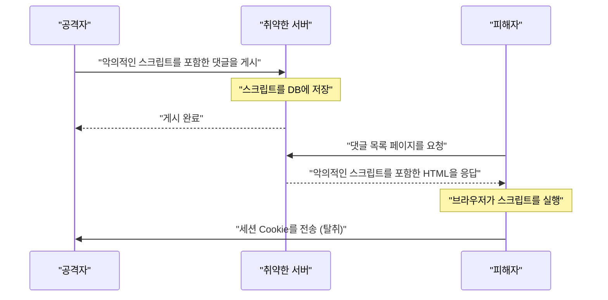
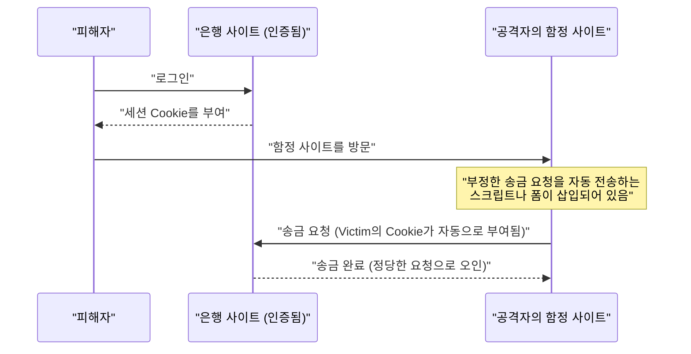
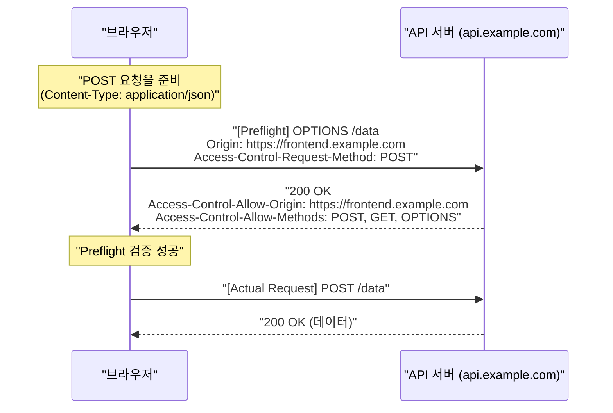
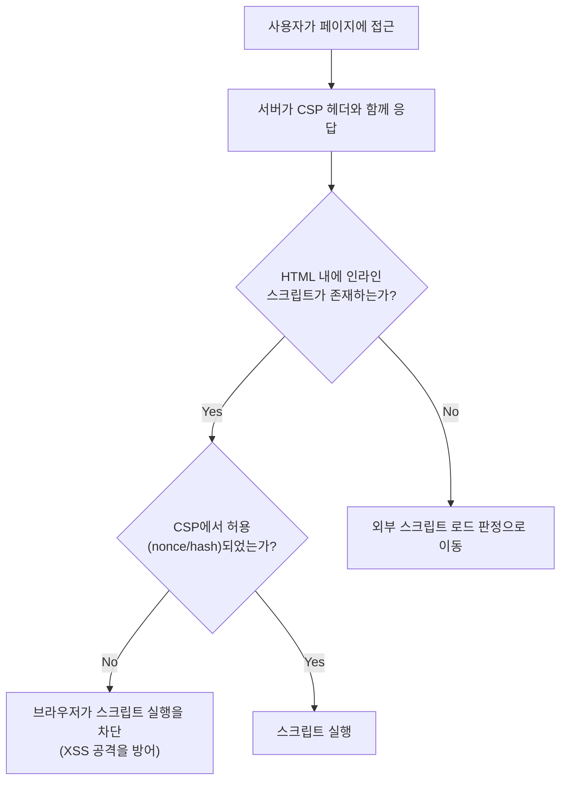

# 시작하며
웹 애플리케이션은 진화를 거듭하여 단순한 문서 뷰어에서 고도의 업무 시스템이나 엔터테인먼트 플랫폼으로 변모했습니다. 이에 따라 웹 애플리케이션이 다루는 데이터는 점점 더 기밀성이 높아져 사이버 공격의 표적이 되기 쉬워졌습니다.

본 기사에서는 웹 보안의 기초인 [XSS](https://kenji.blog/ko/p/web-application-vulnerability-owasp-top-10/)나 [CSRF](https://kenji.blog/ko/p/web-application-vulnerability-owasp-top-10/)와 같은 고전적이면서도 현재까지 맹위를 떨치는 취약점부터, 현대 웹 개발에서 필수가 된 CORS, CSP, 그리고 SameSite Cookie와 같은 최신 방어 메커니즘까지 포괄적이고 상세하게 해설합니다. 또한, 이러한 기술들이 어떻게 연계하여 견고한 웹 애플리케이션을 구축하는지 구체적인 코드 예제와 Mermaid 도표를 사용하여 알기 쉽게 설명합니다.

---

# 1. 고전적이면서도 현대에도 위협이 되는 취약점

웹 애플리케이션의 역사 속에서 예전부터 존재하며 현재에도 [OWASP](https://kenji.blog/ko/p/web-application-vulnerability-owasp-top-10/) Top 10의 단골이 된 것이 **인젝션** 과 **접근 제어의 미비** 와 관련된 취약점입니다. 여기서는 그 대표격인 크로스 사이트 스크립팅(XSS)과 크로스 사이트 요청 위조(CSRF)에 대해 깊이 파고들어 봅니다.

## 1.1 크로스 사이트 스크립팅 (XSS)

크로스 사이트 스크립팅(XSS)은 공격자가 악의적인 스크립트를 취약한 웹 사이트에 주입하여, 이를 열람한 사용자의 브라우저에서 실행되게 하는 공격 기법입니다. 이로 인해 세션 토큰 탈취, 사용자 조작 위장, 나아가 악성코드 유포 등 막대한 피해를 초래할 수 있습니다.

### 1.1.1 XSS의 종류

XSS는 주로 다음의 3가지로 분류됩니다.

1.  **Reflected XSS (반사형 XSS)**
    공격자가 준비한 악의적인 링크를 사용자가 클릭하게 함으로써, 요청에 포함된 스크립트가 그대로 서버로부터 응답으로 '반사'되어 브라우저 상에서 실행되는 기법입니다.
2.  **Stored XSS (축적형 XSS)**
    게시판이나 댓글란 등 사용자가 입력한 데이터가 데이터베이스에 저장되는 기능에서, 악의적인 스크립트를 게시하여 해당 페이지를 열람한 모든 사용자에게 스크립트를 실행하게 하는 기법입니다. 피해 규모가 매우 커지는 경향이 있습니다.
3.  **DOM-based XSS**
    서버 측의 처리를 거치지 않고, 클라이언트 측의 JavaScript가 URL이나 입력값을 안전하게 처리하지 않고 DOM에 씀으로써 발생하는 취약점입니다.

### 1.1.2 XSS의 공격 흐름 (Stored XSS의 예)

다음 그림은 Stored XSS의 공격 흐름을 보여줍니다.



### 1.1.3 [XSS](https://kenji.blog/ko/p/web-application-vulnerability-owasp-top-10/)의 구체적인 코드 예제와 방어책

**취약한 코드 예제 (Node.js / Express)**

```javascript
app.get('/search', (req, res) => {
    const query = req.query.q;
    // 사용자 입력을 그대로 HTML에 출력하고 있으므로, XSS에 취약함
    res.send(`<h1>검색 결과: ${query}</h1>`);
});
```

공격자가 `?q=<script>alert('XSS')</script>` 라는 URL로 접근한 경우, 스크립트가 실행되어 버립니다.

**방어책: 이스케이프 처리**

[XSS](https://kenji.blog/ko/p/web-application-vulnerability-owasp-top-10/)를 방지하기 위한 기본은 사용자 입력이 HTML로 해석되지 않도록 무해화(이스케이프)하는 것입니다. 특히 `<`, `>`, `&`, `"`, `'` 의 5가지 특수문자를 HTML 엔티티로 변환합니다.

```javascript
function escapeHTML(str) {
    return str.replace(/[&<>'"]/g, function(match) {
        const escapeMap = {
            '&': '&amp;',
            '<': '&lt;',
            '>': '&gt;',
            "'": '&#39;',
            '"': '&quot;'
        };
        return escapeMap[match];
    });
}

app.get('/search', (req, res) => {
    const query = escapeHTML(req.query.q);
    res.send(`<h1>검색 결과: ${query}</h1>`);
});
```

현재는 React나 Vue.js와 같은 모던 프런트엔드 프레임워크가 기본적으로 이스케이프 처리를 수행해주기 때문에, 개발자가 의식하지 않아도 어느 정도 [XSS](https://kenji.blog/ko/p/web-application-vulnerability-owasp-top-10/) 대책이 적용되어 있습니다. 하지만 `dangerouslySetInnerHTML` (React)이나 `v-html` (Vue.js)을 사용할 때는 여전히 주의가 필요합니다.

---

## 1.2 크로스 사이트 요청 위조 ([CSRF](https://kenji.blog/ko/p/web-application-vulnerability-owasp-top-10/))

크로스 사이트 요청 위조(CSRF)는 사용자가 인증을 마친 웹 사이트에 대해, 공격자가 준비한 함정 사이트를 경유하여 사용자가 의도하지 않은 요청(송금, 비밀번호 변경, 탈퇴 등)을 강제로 전송하게 만드는 공격입니다.

### 1.2.1 CSRF의 공격 흐름



브라우저의 사양상, 특정 도메인에 대한 요청에는 해당 도메인과 연결된 Cookie가 자동으로 전송됩니다. [CSRF](https://kenji.blog/ko/p/web-application-vulnerability-owasp-top-10/)는 이 메커니즘을 악용한 것입니다.

### 1.2.2 CSRF의 방어책

CSRF를 방지하기 위해서는 요청이 정말로 사용자가 의도한 조작에 의한 것인지 확인할 필요가 있습니다.

**1. CSRF 토큰의 이용**

가장 일반적인 대책은 서버 측에서 무작위로 추측하기 어려운 문자열(CSRF 토큰)을 생성하여 폼의 숨겨진 필드( `hidden` )로 삽입하는 방법입니다. 요청 수신 시, 세션에 저장된 토큰과 전송된 토큰을 비교하여 일치하지 않으면 요청을 거부합니다.

```html
<!-- 폼에 CSRF 토큰을 삽입 -->
<form action="/transfer" method="POST">
    <input type="hidden" name="csrf_token" value="서버에서 생성된 무작위 문자열">
    <input type="text" name="amount" value="10000">
    <button type="submit">송금</button>
</form>
```

**2. SameSite Cookie 속성의 활용**

후술할 **SameSite** 속성을 Cookie에 설정함으로써 크로스 사이트로부터의 요청에 Cookie를 부여하지 않도록 제어할 수 있어 [CSRF](https://kenji.blog/ko/p/web-application-vulnerability-owasp-top-10/) 대책으로 매우 유효합니다.

---

# 2. 현대 웹 보안을 지탱하는 방어 메커니즘

웹 애플리케이션이 복잡해지고 API 기반의 SPA(Single Page Application)가 주류가 되면서 고전적인 대책만으로는 한계가 보이기 시작했습니다. 그래서 브라우저 수준에서 보안을 담보하기 위한 새로운 규격이 차례로 등장했습니다. 여기서는 현대 웹 보안의 핵심이 되는 **CORS** , **CSP** , 그리고 **SameSite Cookie** 에 대해 상세히 해설합니다.

## 2.1 교차 출처 리소스 공유 (CORS)

웹에는 오래전부터 **동일 출처 정책 (Same-Origin Policy: SOP)** 이라는 강력한 보안 모델이 존재합니다. SOP는 '특정 출처(스킴, 호스트, 포트의 조합)에서 불러온 문서나 스크립트가 다른 출처의 리소스에 접근하는 것을 제한하는' 것입니다. 이를 통해 악의적인 사이트로부터의 데이터 읽기를 방지합니다.

하지만 현대의 웹에서는 프런트엔드(예: `https://frontend.example.com` )와 백엔드 API(예: `https://api.example.com` )의 출처가 다른 구성이 일반적입니다. SOP 하에서는 프런트엔드에서 API로의 Ajax 요청이 차단되어 버립니다.

이러한 제한을 안전하게 완화하고, 허용된 출처 간의 리소스 공유를 실현하는 메커니즘이 **CORS(Cross-Origin Resource Sharing)** 입니다.

### 2.1.1 사전 요청 (Preflight Request)의 메커니즘

CORS에서는 서버의 데이터에 영향을 줄 수 있는 요청(예: `POST` , `PUT` , `DELETE` 나 커스텀 헤더를 포함한 요청)을 전송하기 전에, 브라우저가 자동으로 **사전 요청** 을 전송하여 서버가 실제 요청을 수락할 준비가 되어 있는지 확인합니다.

사전 요청은 `OPTIONS` 메서드를 사용하며 다음 헤더를 포함합니다.
- `Origin`: 요청을 보낸 출처
- `Access-Control-Request-Method`: 실제 요청에서 사용할 메서드
- `Access-Control-Request-Headers`: 실제 요청에서 사용할 커스텀 헤더



### 2.1.2 CORS 설정의 모범 사례와 성능

**적절한 `Access-Control-Allow-Origin` 의 설정**

`Access-Control-Allow-Origin: *` 로 설정하면 모든 출처에서의 접근을 허용할 수 있지만, 인증 정보(Cookie 등)를 동반하는 요청( `withCredentials: true` )에서는 `*` 를 사용할 수 없습니다. 보안상으로도 허용할 출처를 명시적으로 지정하는 것이 권장됩니다.

**사전 요청 캐시를 통한 성능 향상**

사전 요청은 통신의 오버헤드가 되어 애플리케이션의 성능을 저하시키는 원인이 됩니다. 이를 방지하기 위해 `Access-Control-Max-Age` 헤더를 사용하여 사전 요청의 결과를 브라우저에 캐시시키는 것이 중요합니다.

```http
Access-Control-Max-Age: 86400
```
(단위는 초. 이 예제에서는 24시간 캐시)

**성능 비교 (수식 모델)**

요청에 걸리는 시간을 $T$ , 네트워크의 레이턴시를 $L$ , 서버의 처리 시간을 $S$ 라고 합니다.

일반적인 동일 출처 요청:
$ T_{normal} = 2L + S $

캐시되지 않은 CORS 요청 (사전 요청 포함):
$ T_{cors\_unached} = 4L + S_{options} + S_{actual} $

캐시된 CORS 요청의 소요 시간은 대폭 단축되어 거의 일반적인 접근과 동등해집니다.

$$
\begin{aligned}
T_{cors\_cached} &= 2L + S_{actual} \\
&\approx T_{normal}
\end{aligned}
$$

이처럼 사전 요청을 캐시함으로써 레이턴시 $2L$ 과 OPTIONS 처리 시간 $S_{options}$ 를 줄일 수 있어 극적인 속도 개선을 기대할 수 있습니다.

---

## 2.2 콘텐츠 보안 정책 (CSP)

**콘텐츠 보안 정책 (Content Security Policy: CSP)** 은 [XSS](https://kenji.blog/ko/p/web-application-vulnerability-owasp-top-10/)나 데이터 인젝션 공격을 근본부터 방지하기 위한 강력한 다계층 방어 메커니즘입니다. 웹 페이지가 로드할 수 있는 리소스(스크립트, 이미지, 스타일시트 등)의 출처(오리진)를 서버 측에서 화이트리스트로서 엄격하게 정의합니다.

### 2.2.1 CSP의 기본 구문

CSP는 HTTP 응답 헤더 `Content-Security-Policy` 를 통해 브라우저에 전달됩니다.

```http
Content-Security-Policy: default-src 'self'; script-src 'self' https://trusted.cdn.com; img-src *;
```

- `default-src 'self'`: 모든 리소스의 기본 로드 출처를 자신의 출처로만 제한.
- `script-src 'self' https://trusted.cdn.com`: JavaScript 로드를 자신의 출처와 지정한 CDN에서만 허용.
- `img-src *`: 이미지는 어디에서나 로드 가능.

### 2.2.2 인라인 스크립트 금지로 인한 [XSS](https://kenji.blog/ko/p/web-application-vulnerability-owasp-top-10/) 근절

CSP의 가장 큰 특징은 기본적으로 **인라인 스크립트( `<script>...</script>` )의 실행이나 `eval()` 의 사용을 금지** 한다는 것입니다. 이를 통해 공격자가 HTML 내에 악의적인 스크립트를 주입(Stored [XSS](https://kenji.blog/ko/p/web-application-vulnerability-owasp-top-10/)나 Reflected XSS)하더라도 브라우저는 CSP 위반으로 판단하여 실행을 차단합니다.



### 2.2.3 nonce와 hash의 활용

어쩔 수 없이 인라인 스크립트를 사용해야 하는 경우(예: Google Analytics의 태그 등), 안전하게 허용하는 방법이 준비되어 있습니다.

**1. Nonce (논스)의 이용**

서버가 요청마다 고유하고 무작위적인 문자열(nonce)을 생성하여 CSP 헤더와 `<script>` 태그의 속성에 지정합니다. 양쪽이 일치하는 경우에만 실행이 허용됩니다.

HTTP 헤더:
```http
Content-Security-Policy: script-src 'nonce-r4nd0mStr1ng';
```

HTML:
```html
<script nonce="r4nd0mStr1ng">
    console.log("이 스크립트는 실행됩니다");
</script>
<script>
    alert("공격자의 스크립트는 차단됩니다");
</script>
```

**2. Hash (해시)의 이용**

스크립트 내용의 해시값(SHA-256 등)을 계산하여 CSP 헤더에 지정합니다.

HTTP 헤더:
```http
Content-Security-Policy: script-src 'sha256-B2yPHKaXnvFWtRChIbabYmUBFZdVfKKXHbWtWidDVF8=';
```

### 2.2.4 CSP 위반 리포트 기능

CSP에는 정책 위반이 발생했을 때 브라우저에서 지정된 엔드포인트로 리포트를 전송하게 하는 기능이 있습니다. 이를 통해 관리자는 알지 못했던 [XSS](https://kenji.blog/ko/p/web-application-vulnerability-owasp-top-10/) 시도나 설정 오류를 알아차릴 수 있습니다.

```http
Content-Security-Policy: default-src 'self'; report-uri /csp-violation-report-endpoint/
```
※ 최근에는 `report-uri` 가 비권장(deprecated)되었으며, 보다 강력한 `Report-To` 헤더의 사용이 권장됩니다.

---

## 2.3 SameSite Cookie에 의한 [CSRF](https://kenji.blog/ko/p/web-application-vulnerability-owasp-top-10/) 방어

Cookie는 웹 애플리케이션에서 사용자의 세션 관리에 필수적이지만, 크로스 사이트 요청 시 자동으로 전송되는 사양이 CSRF의 온상이 되었습니다. 이 문제를 해결하는 것이 Cookie의 **SameSite 속성** 입니다.

### 2.3.1 SameSite 속성의 3가지 모드

SameSite 속성에는 다음의 3가지 값을 설정할 수 있습니다.

1.  **Strict**
    가장 엄격한 설정입니다. 요청이 동일한 사이트(최상위 도메인과 그 한 단계 아래 도메인이 일치)에서 온 경우에만 Cookie가 전송됩니다. 외부 사이트에서 링크를 클릭하여 이동한 경우에도 Cookie는 전송되지 않습니다. 높은 보안을 자랑하지만, 외부에서의 링크 접근 시 로그인 상태가 유지되지 않는 등 편의성을 저해할 수 있습니다.

2.  **Lax**
    현재 브라우저의 기본값입니다. 기본적으로 크로스 사이트 요청에서는 Cookie가 전송되지 않지만, 최상위 내비게이션(링크 클릭에 의한 화면 이동)이며 안전한 HTTP 메서드(GET 등)를 사용하는 경우에 한해 Cookie가 전송됩니다. 편의성과 보안의 균형이 맞춰진 설정입니다.

3.  **None**
    기존의 동작과 마찬가지로 크로스 사이트 요청에서도 항상 Cookie를 전송합니다. 이 설정을 사용할 경우에는 반드시 `Secure` 속성(HTTPS에서만 Cookie를 전송)을 부여해야 합니다.

```http
Set-Cookie: session_id=abc123xyz; SameSite=Strict; Secure; HttpOnly
```

### 2.3.2 SameSite = Lax의 보호 메커니즘

다음 표는 다른 도메인의 사이트(함정 사이트)에서 은행 사이트로 요청을 전송했을 때의 Cookie의 동작(SameSite=Lax 설정 시)을 보여줍니다.

| 사용자의 조작 (함정 사이트 상) | HTTP 메서드 | 요청의 종류 | Cookie 전송 | [CSRF](https://kenji.blog/ko/p/web-application-vulnerability-owasp-top-10/)에 대한 영향 |
| :--- | :--- | :--- | :--- | :--- |
| 링크 ( `<a>` ) 클릭 | GET | 최상위 내비게이션 | **전송됨** | GET은 상태를 변경하지 않으므로 안전함 |
| 폼 ( `<form>` ) 전송 | GET | 최상위 내비게이션 | **전송됨** | GET은 상태를 변경하지 않으므로 안전함 |
| 폼 ( `<form>` ) 전송 | POST | 최상위 내비게이션 | **차단됨** | **[CSRF](https://kenji.blog/ko/p/web-application-vulnerability-owasp-top-10/) 공격을 방지** |
| 비동기 통신 (fetch, XHR) | GET/POST | 하위 요청 | **차단됨** | **CSRF 공격을 방지** |
| 이미지 로드 ( `` ) | GET | 하위 요청 | **차단됨** | 안전함 |

이처럼 `SameSite=Lax` 가 설정되어 있는(또는 브라우저의 기본값으로 기능하고 있는) 것만으로 POST 메서드를 이용한 고전적인 [CSRF](https://kenji.blog/ko/p/web-application-vulnerability-owasp-top-10/) 공격은 무력화됩니다. 하지만 완전한 방어를 위해서는 기존의 CSRF 토큰과의 병용이 권장됩니다.

---

# 3. 보안 대책의 트레이드오프

견고한 보안 대책을 도입할 때는 항상 **편의성** 과 **성능** 과의 트레이드오프를 고려해야 합니다.

## 3.1 보안 vs 편의성

예를 들어, Cookie의 SameSite 속성을 `Strict` 로 설정하면 [CSRF](https://kenji.blog/ko/p/web-application-vulnerability-owasp-top-10/)에 대해 매우 강력하지만, 사용자가 프로모션 이메일의 링크를 클릭하여 자사 사이트에 접근했을 때 미로그인 상태로 취급되어 버려 UX(사용자 경험)를 저해할 가능성이 있습니다. 애플리케이션의 특성에 맞춰 `Lax` 를 선택하고, 중요한 조작에는 원타임 비밀번호나 재인증을 요구하는 등의 균형이 필요합니다.

## 3.2 보안 vs 성능

CSP의 도입은 보안을 극적으로 향상시키지만, 엄격한 정책을 구축하고 유지하기 위한 운영 비용이 듭니다. 또한, 요청마다 Nonce를 생성하거나 CORS에서의 사전 요청은 미미하지만 서버의 계산 자원과 네트워크 대역폭을 소비합니다.

앞서 언급한 바와 같이, CORS에서는 적절한 캐시 기간( `Access-Control-Max-Age` )을 설정함으로써 성능 저하를 최소화하는 것이 필수적입니다.

---

# 4. 요약과 향후 전망

본 기사에서는 웹 애플리케이션을 위협으로부터 보호하기 위한 기초 지식부터 최신 기술까지 해설했습니다.

*   **[XSS](https://kenji.blog/ko/p/web-application-vulnerability-owasp-top-10/)와 [CSRF](https://kenji.blog/ko/p/web-application-vulnerability-owasp-top-10/)**: 고전적이면서도 현재까지 치명적인 피해를 주는 취약점. 적절한 이스케이프와 토큰을 통한 방어가 기본.
*   **CORS**: 복잡해지는 현대 웹 아키텍처에서 안전한 출처 간 통신을 실현하기 위한 메커니즘.
*   **CSP**: 인라인 스크립트의 배제 등을 통해 XSS 등의 인젝션 공격을 브라우저 수준에서 차단하는 강력한 정책.
*   **SameSite Cookie**: CSRF에 대한 브라우저 표준의 방벽. 서드파티 Cookie 폐지를 향한 움직임 속에서 그 중요성이 점점 커지고 있다.

웹 보안의 세계는 항상 쫓고 쫓기는 관계입니다. 브라우저 벤더가 강력한 방어 메커니즘(CSP나 SameSite)을 제공해도, 공격자는 새로운 우회 기법(DOM Clobbering이나 CSS Injection 등)을 고안해 냅니다.

개발자는 '은탄환'은 존재하지 않는다는 점을 인식하고, 입력값 검증(유효성 검사), 출력 시 이스케이프, 적절한 HTTP 헤더 설정(CSP, CORS, HSTS 등), 그리고 지속적인 취약점 진단을 조합한 **다계층 방어 (Defense in Depth)** 의 접근법을 철저히 해야 합니다.

최신 동향을 계속 주시하며, 더 안전하고 신뢰받는 웹 애플리케이션을 구축해 나갑시다.
