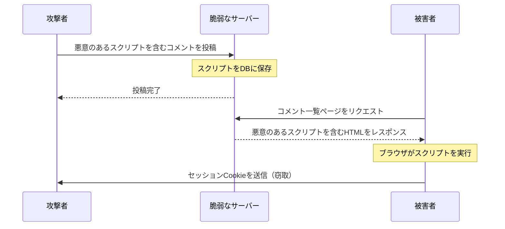
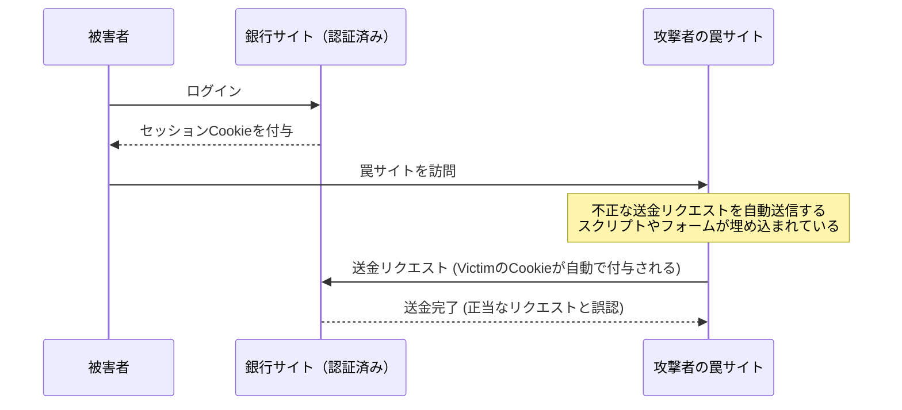
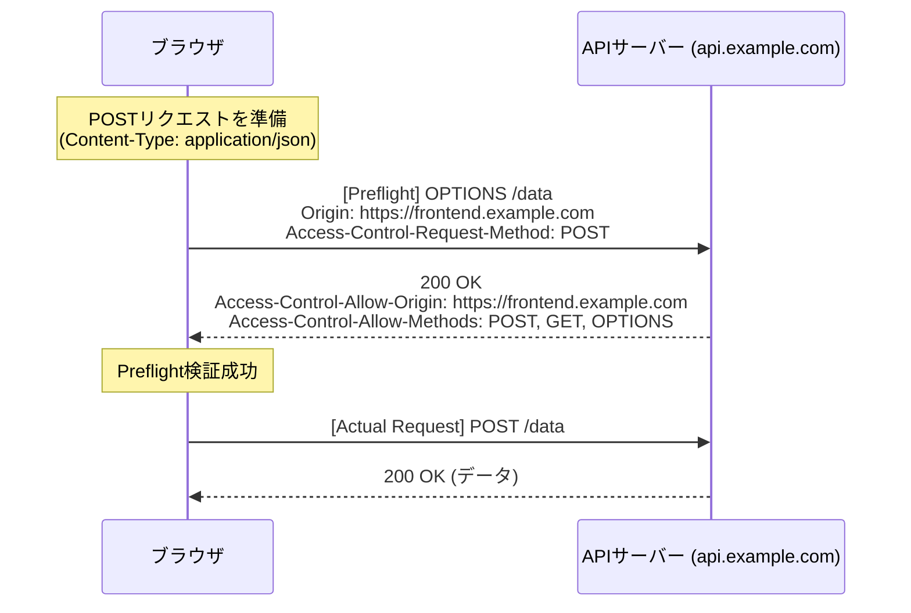

# はじめに
Webアプリケーションは進化を続け、単なるドキュメントビューアから、高度な業務システムやエンターテイメントプラットフォームへと変貌を遂げました。それに伴い、Webアプリケーションが扱うデータはますます機密性の高いものとなり、サイバー攻撃の標的となりやすくなっています。

本記事では、Webセキュリティの基礎であるXSSやCSRFといった古典的かつ現在でも猛威を振るう脆弱性から、現代のWeb開発において必須となるCORS、CSP、そしてSameSite Cookieといった最新の防御機構まで、網羅的かつ詳細に解説します。さらに、これらの技術がどのように連携して堅牢なWebアプリケーションを構築するのか、具体的なコード例やMermaid図表を用いてわかりやすく説明します。

---

# 1. 古典的かつ現代でも脅威となる脆弱性

Webアプリケーションの歴史の中で古くから存在し、現在でもOWASP Top 10の常連となっているのが **インジェクション** や **アクセス制御の不備** に関連する脆弱性です。ここでは、その代表格であるクロスサイトスクリプティング（XSS）とクロスサイトリクエストフォージェリ（CSRF）について深く掘り下げます。

## 1.1 クロスサイトスクリプティング (XSS)

クロスサイトスクリプティング（XSS）は、攻撃者が悪意のあるスクリプトを脆弱なWebサイトに注入し、それを閲覧したユーザーのブラウザ上で実行させる攻撃手法です。これにより、セッショントークンの窃取、ユーザーの操作の偽装、さらにはマルウェアの配布など、甚大な被害をもたらす可能性があります。

### 1.1.1 XSSの種類

XSSは主に以下の3つに分類されます。

1.  **Reflected XSS（反射型XSS）**
    攻撃者が用意した悪意のあるリンクをユーザーにクリックさせることで、リクエストに含まれるスクリプトがそのままサーバーからレスポンスとして「反射」され、ブラウザ上で実行される手法です。
2.  **Stored XSS（蓄積型XSS）**
    掲示板やコメント欄など、ユーザーが入力したデータがデータベースに保存される機能において、悪意のあるスクリプトを投稿し、そのページを閲覧したすべてのユーザーにスクリプトを実行させる手法です。被害の規模が非常に大きくなる傾向があります。
3.  **DOM-based XSS**
    サーバー側の処理を経由せず、クライアント側のJavaScriptがURLや入力値を安全に処理せずにDOMに書き込むことで発生する脆弱性です。

### 1.1.2 XSSの攻撃フロー（Stored XSSの例）

以下の図は、Stored XSSの攻撃フローを示しています。



### 1.1.3 XSSの具体的なコード例と防御策

**脆弱なコード例（Node.js / Express）**

```javascript
app.get('/search', (req, res) => {
    const query = req.query.q;
    // ユーザー入力をそのままHTMLに出力しているため、XSSに対して脆弱
    res.send(`<h1>検索結果: ${query}</h1>`);
});
```

攻撃者が `?q=<script>alert('XSS')</script>` というURLでアクセスした場合、スクリプトが実行されてしまいます。

**防御策：エスケープ処理**

XSSを防ぐための基本は、ユーザー入力をHTMLとして解釈されないように無害化（エスケープ）することです。特に `<`, `>`, `&`, `"`, `'` の5つの特殊文字をHTMLエンティティに変換します。

```javascript
function escapeHTML(str) {
    return str.replace(/[&<>'"]/g, function(match) {
        const escapeMap = {
            '&': '&amp;',
            '<': '&lt;',
            '>': '&gt;',
            "'": '&#39;',
            '"': '&quot;'
        };
        return escapeMap[match];
    });
}

app.get('/search', (req, res) => {
    const query = escapeHTML(req.query.q);
    res.send(`<h1>検索結果: ${query}</h1>`);
});
```

現在では、ReactやVue.jsといったモダンなフロントエンドフレームワークがデフォルトでエスケープ処理を行ってくれるため、開発者が意識しなくてもある程度のXSS対策が施されています。しかし、 `dangerouslySetInnerHTML` （React）や `v-html` （Vue.js）を使用する際は依然として注意が必要です。

---

## 1.2 クロスサイトリクエストフォージェリ (CSRF)

クロスサイトリクエストフォージェリ（CSRF）は、ユーザーが認証済みのWebサイトに対して、攻撃者が用意した罠サイトを経由して、ユーザーの意図しないリクエスト（送金、パスワード変更、退会など）を強制的に送信させる攻撃です。

### 1.2.1 CSRFの攻撃フロー



ブラウザの仕様上、特定ドメインに対するリクエストには、そのドメインに関連付けられたCookieが自動的に送信されます。CSRFはこの仕組みを悪用したものです。

### 1.2.2 CSRFの防御策

CSRFを防ぐためには、リクエストが本当にユーザーの意図した操作によるものかを確認する必要があります。

**1. CSRFトークンの利用**

最も一般的な対策は、サーバー側でランダムな推測困難な文字列（CSRFトークン）を生成し、フォームの隠しフィールド（ `hidden` ）として埋め込む方法です。リクエスト受信時に、セッションに保存されたトークンと送信されたトークンを比較し、一致しなければリクエストを拒否します。

```html
<!-- フォームにCSRFトークンを埋め込む -->
<form action="/transfer" method="POST">
    <input type="hidden" name="csrf_token" value="サーバーで生成されたランダムな文字列">
    <input type="text" name="amount" value="10000">
    <button type="submit">送金</button>
</form>
```

**2. SameSite Cookie属性の活用**

後述する **SameSite** 属性をCookieに設定することで、クロスサイトからのリクエストにCookieを付与しないように制御でき、CSRF対策として非常に有効です。

---

# 2. 現代のWebセキュリティを支える防御機構

Webアプリケーションが複雑化し、APIベースのSPA（Single Page Application）が主流となるにつれ、古典的な対策だけでは限界が見えてきました。そこで、ブラウザレベルでセキュリティを担保するための新たな規格が次々と登場しました。ここでは、現代のWebセキュリティの要となる **CORS** 、 **CSP** 、そして **SameSite Cookie** について詳細に解説します。

## 2.1 オリジン間リソース共有 (CORS)

Webには古くから **同一オリジンポリシー（Same-Origin Policy: SOP）** という強力なセキュリティモデルが存在します。SOPは、「あるオリジン（スキーム、ホスト、ポートの組み合わせ）から読み込まれたドキュメントやスクリプトが、他のオリジンのリソースにアクセスすることを制限する」というものです。これにより、悪意のあるサイトからのデータの読み取りを防いでいます。

しかし、現代のWebでは、フロントエンド（例： `https://frontend.example.com` ）とバックエンドAPI（例： `https://api.example.com` ）のオリジンが異なる構成が一般的です。SOPの下では、フロントエンドからAPIへのAjaxリクエストがブロックされてしまいます。

この制限を安全に緩和し、許可されたオリジン間でのリソース共有を実現する仕組みが **CORS（Cross-Origin Resource Sharing）** です。

### 2.1.1 プリフライトリクエスト (Preflight Request) の仕組み

CORSでは、サーバーのデータに影響を与える可能性のあるリクエスト（例： `POST`, `PUT`, `DELETE` や、カスタムヘッダーを含むリクエスト）を送信する前に、ブラウザが自動的に **プリフライトリクエスト** を送信し、サーバーが実際のリクエストを受け入れる準備ができているかを確認します。

プリフライトリクエストは `OPTIONS` メソッドを使用し、以下のヘッダーを含みます。
- `Origin`: リクエスト元のオリジン
- `Access-Control-Request-Method`: 実際のリクエストで使用するメソッド
- `Access-Control-Request-Headers`: 実際のリクエストで使用するカスタムヘッダー



### 2.1.2 CORS設定のベストプラクティスとパフォーマンス

**適切な `Access-Control-Allow-Origin` の設定**

`Access-Control-Allow-Origin: *` と設定すれば、すべてのオリジンからのアクセスを許可できますが、認証情報（Cookieなど）を伴うリクエスト（ `withCredentials: true` ）では `*` は使用できません。セキュリティ上も、許可するオリジンを明示的に指定することが推奨されます。

**プリフライトのキャッシュによるパフォーマンス向上**

プリフライトリクエストは通信のオーバーヘッドとなり、アプリケーションのパフォーマンスを低下させる原因となります。これを防ぐために、 `Access-Control-Max-Age` ヘッダーを使用してプリフライトの結果をブラウザにキャッシュさせることが重要です。

```http
Access-Control-Max-Age: 86400
```
（単位は秒。この例では24時間キャッシュ）

**パフォーマンスの比較（数式モデル）**

リクエストにかかる時間を $T$ 、ネットワークのレイテンシを $L$ 、サーバーの処理時間を $S$ とします。

通常の同一オリジンリクエスト：
$$ T_{normal} = 2L + S $$

キャッシュされていないCORSリクエスト（プリフライトあり）：
$$ T_{cors\_unached} = 4L + S_{options} + S_{actual} $$

キャッシュされたCORSリクエストの所要時間は大幅に短縮され、ほぼ通常のアクセスと同等になります。

$$
\begin{aligned}
T_{cors\_cached} &= 2L + S_{actual} \\\\
&\approx T_{normal}
\end{aligned}
$$

このように、プリフライトをキャッシュすることで、レイテンシ $2L$ とOPTIONS処理時間 $S_{options}$ を削減でき、劇的な速度改善が見込めます。

---

## 2.2 コンテンツセキュリティポリシー (CSP)

**コンテンツセキュリティポリシー（Content Security Policy: CSP）** は、XSSやデータインジェクション攻撃を根本から防ぐための強力な多層防御メカニズムです。Webページが読み込むことができるリソース（スクリプト、画像、スタイルシートなど）の出所（オリジン）をサーバー側でホワイトリストとして厳格に定義します。

### 2.2.1 CSPの基本構文

CSPは、HTTPレスポンスヘッダー `Content-Security-Policy` を通じてブラウザに伝達されます。

```http
Content-Security-Policy: default-src 'self'; script-src 'self' https://trusted.cdn.com; img-src *;
```

- `default-src 'self'`: すべてのリソースのデフォルトの読み込み元を自身のオリジンのみに制限。
- `script-src 'self' https://trusted.cdn.com`: JavaScriptの読み込みを自身のオリジンと指定したCDNからのみ許可。
- `img-src *`: 画像はどこからでも読み込み可能。

### 2.2.2 インラインスクリプトの禁止によるXSS根絶

CSPの最大の特徴は、デフォルトで **インラインスクリプト（ `<script>...</script>` ）の実行や `eval()` の使用を禁止** することです。これにより、攻撃者がHTML内に悪意のあるスクリプトを注入（Stored XSSやReflected XSS）しても、ブラウザはCSP違反として実行をブロックします。

```mermaid
flowchart TD
    A[ユーザーがページにアクセス] --> B[サーバーがCSPヘッダー付きでレスポンス]
    B --> C{HTML内にインライン<br>スクリプトが存在するか?}
    C -- Yes --> D{CSPで許可<br>(nonce/hash)されているか?}
    D -- No --> E[ブラウザがスクリプトの実行をブロック<br>(XSS攻撃を防御)]
    D -- Yes --> F[スクリプト実行]
    C -- No --> G[外部スクリプトの読み込み判定へ]
```

### 2.2.3 nonceとhashの活用

どうしてもインラインスクリプトを使用しなければならない場合（例：Google Analyticsのタグなど）、安全に許可する方法が用意されています。

**1. Nonce（ノンス）の利用**

サーバーがリクエストごとに一意でランダムな文字列（nonce）を生成し、CSPヘッダーと `<script>` タグの属性に指定します。両者が一致した場合のみ実行が許可されます。

HTTPヘッダー:
```http
Content-Security-Policy: script-src 'nonce-r4nd0mStr1ng';
```

HTML:
```html
<script nonce="r4nd0mStr1ng">
    console.log("このスクリプトは実行されます");
</script>
<script>
    alert("攻撃者のスクリプトはブロックされます");
</script>
```

**2. Hash（ハッシュ）の利用**

スクリプトの内容のハッシュ値（SHA-256など）を計算し、CSPヘッダーに指定します。

HTTPヘッダー:
```http
Content-Security-Policy: script-src 'sha256-B2yPHKaXnvFWtRChIbabYmUBFZdVfKKXHbWtWidDVF8=';
```

### 2.2.4 CSP違反のレポート機能

CSPには、ポリシー違反が発生した際にブラウザから指定したエンドポイントへレポートを送信させる機能があります。これにより、管理者は未知のXSSの試みや設定ミスに気づくことができます。

```http
Content-Security-Policy: default-src 'self'; report-uri /csp-violation-report-endpoint/
```
※近年では `report-uri` は非推奨となり、より強力な `Report-To` ヘッダーの使用が推奨されています。

---

## 2.3 SameSite Cookie によるCSRF防御

CookieはWebアプリケーションにおいてユーザーのセッション管理に不可欠ですが、クロスサイトリクエスト時に自動で送信される仕様がCSRFの温床となっていました。この問題を解決するのが、Cookieの **SameSite属性** です。

### 2.3.1 SameSite属性の3つのモード

SameSite属性には以下の3つの値を設定できます。

1.  **Strict**
    最も厳格な設定です。リクエストが同一サイト（トップレベルドメインと一つ下のドメインが一致）からの場合のみCookieが送信されます。外部サイトからのリンクをクリックして遷移した場合でもCookieは送信されません。高いセキュリティを誇りますが、外部からのリンクアクセス時にログイン状態が引き継がれないなど、利便性を損なう場合があります。

2.  **Lax**
    現在のブラウザのデフォルト値です。基本的にはクロスサイトリクエストでCookieは送信されませんが、トップレベルのナビゲーション（リンクのクリックによる画面遷移）であり、かつ安全なHTTPメソッド（GETなど）を使用している場合に限りCookieが送信されます。利便性とセキュリティのバランスが取れた設定です。

3.  **None**
    従来の挙動と同じく、クロスサイトリクエストでも常にCookieを送信します。この設定を使用する場合は、必ず `Secure` 属性（HTTPSでのみCookieを送信）を付与する必要があります。

```http
Set-Cookie: session_id=abc123xyz; SameSite=Strict; Secure; HttpOnly
```

### 2.3.2 SameSite = Lax の保護メカニズム

以下の表は、別ドメインのサイト（罠サイト）から銀行サイトへリクエストを送信した場合のCookieの挙動（SameSite=Lax設定時）を示しています。

| ユーザーの操作（罠サイト上） | HTTPメソッド | リクエストの種類 | Cookieの送信 | CSRFへの影響 |
| :--- | :--- | :--- | :--- | :--- |
| リンク (`<a>`) のクリック | GET | トップレベルナビゲーション | **送信される** | GETは状態を変更しないため安全 |
| フォーム (`<form>`) の送信 | GET | トップレベルナビゲーション | **送信される** | GETは状態を変更しないため安全 |
| フォーム (`<form>`) の送信 | POST | トップレベルナビゲーション | **ブロック** | **CSRF攻撃を防止** |
| 非同期通信 (fetch, XHR) | GET/POST | サブリクエスト | **ブロック** | **CSRF攻撃を防止** |
| 画像の読み込み (``) | GET | サブリクエスト | **ブロック** | 安全 |

このように、 `SameSite=Lax` が設定されている（あるいはブラウザのデフォルトとして機能している）だけで、POSTメソッドを用いた古典的なCSRF攻撃は無効化されます。しかし、完全な防御のためには、従来のCSRFトークンとの併用が推奨されます。

---

# 3. セキュリティ対策のトレードオフ

堅牢なセキュリティ対策を導入する際には、常に **利便性** と **パフォーマンス** とのトレードオフを考慮する必要があります。

## 3.1 セキュリティ vs 利便性

たとえば、Cookieの SameSite 属性を `Strict` に設定すればCSRFに対して非常に強力ですが、ユーザーがプロモーションメールのリンクをクリックして自社サイトにアクセスした際に、未ログイン状態として扱われてしまい、UX（ユーザーエクスペリエンス）を損なう可能性があります。アプリケーションの特性に合わせて `Lax` を選択し、重要な操作にはワンタイムパスワードや再認証を要求するなどのバランスが求められます。

## 3.2 セキュリティ vs パフォーマンス

CSPの導入はセキュリティを劇的に向上させますが、厳密なポリシーを構築・維持するための運用コストがかかります。また、リクエストごとのNonceの生成や、CORSにおけるプリフライトリクエストは、わずかですがサーバーの計算資源とネットワーク帯域を消費します。

前述の通り、CORSにおいては適切なキャッシュ期間（ `Access-Control-Max-Age` ）を設定することで、パフォーマンスの低下を最小限に抑えることが不可欠です。

---

# 4. まとめと将来の展望

本記事では、Webアプリケーションを脅威から守るための基礎知識から最新技術までを解説しました。

*   **XSSとCSRF**: 古典的でありながら、現在も致命的な被害をもたらす脆弱性。適切なエスケープとトークンによる防御が基本。
*   **CORS**: 複雑化する現代のWebアーキテクチャにおいて、安全なオリジン間通信を実現するための仕組み。
*   **CSP**: インラインスクリプトの排除などを通じて、XSSなどのインジェクション攻撃をブラウザレベルで封じ込める強力なポリシー。
*   **SameSite Cookie**: CSRFに対するブラウザ標準の防壁。サードパーティCookieの廃止に向けた動きの中で、ますます重要性が高まっている。

Webセキュリティの世界は常にいたちごっこです。ブラウザベンダーが強力な防御機構（CSPやSameSite）を提供しても、攻撃者は新たなバイパス手法（DOM ClobberingやCSS Injectionなど）を編み出してきます。

開発者は「銀の弾丸」は存在しないことを認識し、入力値の検証（バリデーション）、出力時のエスケープ、適切なHTTPヘッダーの設定（CSP、CORS、HSTSなど）、そして継続的な脆弱性診断を組み合わせた **多層防御（Defense in Depth）** のアプローチを徹底する必要があります。

最新の動向を追い続け、より安全で信頼されるWebアプリケーションを構築していきましょう。
