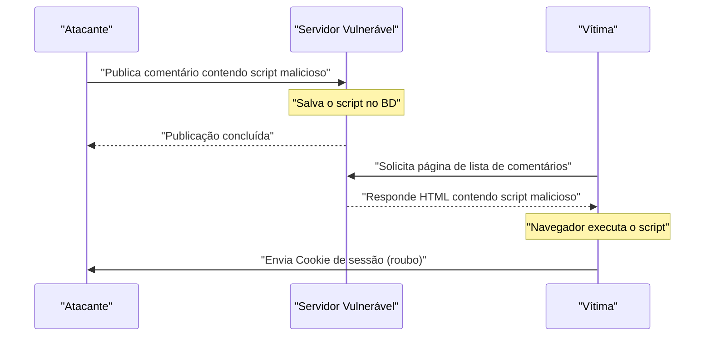
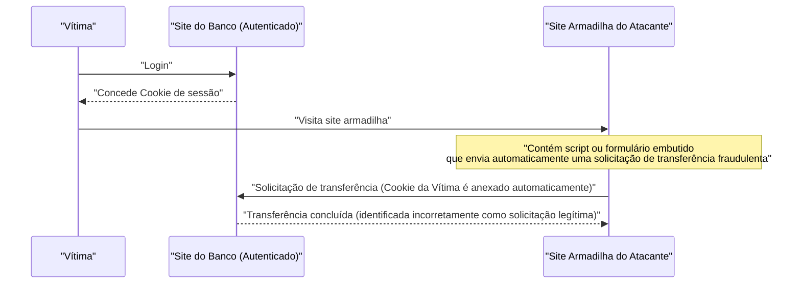
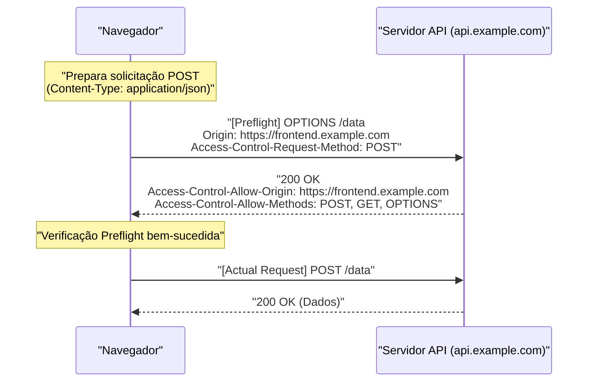
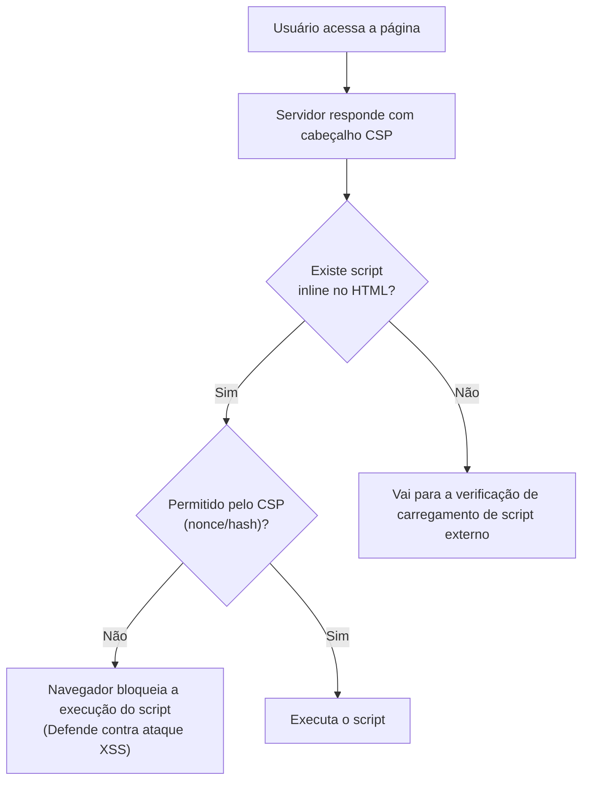

# Introdução
As aplicações Web continuam a evoluir, transformando-se de meros visualizadores de documentos em sistemas de negócios avançados e plataformas de entretenimento. Consequentemente, os dados manipulados pelas aplicações Web tornaram-se cada vez mais confidenciais e mais suscetíveis a ataques cibernéticos.

Neste artigo, explicaremos de forma abrangente e detalhada desde as vulnerabilidades clássicas que continuam a causar estragos hoje, como [XSS](https://kenji.blog/pt/p/web-application-vulnerability-owasp-top-10/) e [CSRF](https://kenji.blog/pt/p/web-application-vulnerability-owasp-top-10/) (a base da segurança na Web), até os mais recentes mecanismos de defesa essenciais no desenvolvimento Web moderno, como CORS, CSP e SameSite Cookie. Além disso, usaremos exemplos de código específicos e diagramas Mermaid para explicar claramente como essas tecnologias trabalham em conjunto para construir aplicações Web robustas.

---

# 1. Vulnerabilidades Clássicas que Continuam a ser Ameaças Modernas

Vulnerabilidades relacionadas a **injeção** e **falhas de controle de acesso** existem há muito tempo na história das aplicações Web e continuam a aparecer frequentemente no [OWASP](https://kenji.blog/pt/p/web-application-vulnerability-owasp-top-10/) Top 10. Aqui, aprofundaremos nas mais representativas: Cross-Site Scripting (XSS) e Cross-Site Request Forgery (CSRF).

## 1.1 Cross-Site Scripting (XSS)

Cross-Site Scripting (XSS) é uma técnica de ataque em que um invasor injeta scripts maliciosos em um site vulnerável e faz com que eles sejam executados no navegador dos usuários que visitam o site. Isso pode causar danos graves, como roubo de tokens de sessão, falsificação de ações do usuário e até mesmo distribuição de malware.

### 1.1.1 Tipos de XSS

O XSS é classificado principalmente em três tipos:

1.  **Reflected XSS (XSS Refletido)**
    Uma técnica onde o invasor induz o usuário a clicar em um link malicioso que ele preparou, fazendo com que o script incluído na solicitação seja "refletido" diretamente como resposta do servidor e executado no navegador.
2.  **Stored XSS (XSS Armazenado)**
    Uma técnica onde um script malicioso é postado em recursos onde os dados inseridos pelo usuário são salvos no banco de dados, como fóruns ou seções de comentários, fazendo com que todos os usuários que visualizam essa página executem o script. A escala dos danos tende a ser muito grande.
3.  **DOM-based XSS**
    Uma vulnerabilidade que ocorre quando o JavaScript do lado do cliente processa inseguramente URLs ou valores de entrada e os escreve no DOM sem passar pelo processamento do lado do servidor.

### 1.1.2 Fluxo de Ataque XSS (Exemplo de Stored XSS)

O diagrama a seguir ilustra o fluxo de um ataque de Stored XSS.



### 1.1.3 Exemplo Prático de Código e Medidas de Defesa contra [XSS](https://kenji.blog/pt/p/web-application-vulnerability-owasp-top-10/)

**Exemplo de código vulnerável (Node.js / Express)**

```javascript
app.get('/search', (req, res) => {
    const query = req.query.q;
    // Vulnerável a XSS pois a entrada do usuário é exibida no HTML como está
    res.send(`<h1>Resultados da busca: ${query}</h1>`);
});
```

Se um invasor acessar a URL com `?q=<script>alert('XSS')</script>`, o script será executado.

**Medida de Defesa: Escapamento (Escaping)**

A base da prevenção do [XSS](https://kenji.blog/pt/p/web-application-vulnerability-owasp-top-10/) é neutralizar (escapar) as entradas do usuário para que não sejam interpretadas como HTML. Especificamente, os 5 caracteres especiais `<`, `>`, `&`, `"` e `'` são convertidos em entidades HTML.

```javascript
function escapeHTML(str) {
    return str.replace(/[&<>'"]/g, function(match) {
        const escapeMap = {
            '&': '&amp;',
            '<': '&lt;',
            '>': '&gt;',
            "'": '&#39;',
            '"': '&quot;'
        };
        return escapeMap[match];
    });
}

app.get('/search', (req, res) => {
    const query = escapeHTML(req.query.q);
    res.send(`<h1>Resultados da busca: ${query}</h1>`);
});
```

Atualmente, frameworks de front-end modernos como React e Vue.js executam o escape por padrão, fornecendo um certo nível de proteção contra [XSS](https://kenji.blog/pt/p/web-application-vulnerability-owasp-top-10/) sem que os desenvolvedores precisem se preocupar com isso. No entanto, ainda é preciso ter cuidado ao usar `dangerouslySetInnerHTML` (React) ou `v-html` (Vue.js).

---

## 1.2 Cross-Site Request Forgery ([CSRF](https://kenji.blog/pt/p/web-application-vulnerability-owasp-top-10/))

Cross-Site Request Forgery (CSRF) é um ataque que força o usuário a enviar solicitações não intencionais (como transferência de fundos, alteração de senha, exclusão de conta, etc.) para um site autenticado através de um site malicioso preparado pelo invasor.

### 1.2.1 Fluxo de Ataque CSRF



Devido à especificação do navegador, solicitações para um domínio específico enviarão automaticamente os Cookies associados a esse domínio. O [CSRF](https://kenji.blog/pt/p/web-application-vulnerability-owasp-top-10/) explora esse mecanismo.

### 1.2.2 Medidas de Defesa contra CSRF

Para evitar o CSRF, é necessário verificar se a solicitação é realmente proveniente de uma ação intencional do usuário.

**1. Uso de Token CSRF**

A medida mais comum é gerar uma string aleatória e difícil de adivinhar (token CSRF) no servidor e embuti-la como um campo oculto (`hidden`) no formulário. Ao receber a solicitação, o token salvo na sessão e o token enviado são comparados; se não corresponderem, a solicitação é rejeitada.

```html
<!-- Embutindo o token CSRF no formulário -->
<form action="/transfer" method="POST">
    <input type="hidden" name="csrf_token" value="string_aleatoria_gerada_pelo_servidor">
    <input type="text" name="amount" value="10000">
    <button type="submit">Transferir</button>
</form>
```

**2. Utilização do Atributo SameSite Cookie**

Configurar o atributo **SameSite** no Cookie, discutido mais adiante, permite controlar os Cookies para que não sejam enviados em solicitações de sites de terceiros (cross-site), sendo muito eficaz como medida contra [CSRF](https://kenji.blog/pt/p/web-application-vulnerability-owasp-top-10/).

---

# 2. Mecanismos de Defesa que Sustentam a Segurança Web Moderna

À medida que as aplicações Web se tornam mais complexas e as APIs baseadas em SPA (Single Page Application) tornam-se predominantes, as medidas clássicas atingiram seus limites. Como resultado, novos padrões surgiram um após o outro para garantir a segurança no nível do navegador. Aqui, explicaremos em detalhes os pilares da segurança Web moderna: **CORS**, **CSP** e **SameSite Cookie**.

## 2.1 Compartilhamento de Recursos de Origem Cruzada (CORS)

A Web tem um poderoso modelo de segurança conhecido como **Same-Origin Policy (SOP - Política de Mesma Origem)** desde muito tempo. A SOP "restringe como um documento ou script carregado de uma origem (combinação de esquema, host e porta) pode interagir com um recurso de outra origem". Isso impede a leitura de dados por sites maliciosos.

No entanto, na Web moderna, é comum que as origens do front-end (ex: `https://frontend.example.com`) e da API de back-end (ex: `https://api.example.com`) sejam diferentes. Sob a SOP, solicitações Ajax do front-end para a API seriam bloqueadas.

O mecanismo que relaxa essa restrição com segurança e permite o compartilhamento de recursos entre origens permitidas é o **CORS (Cross-Origin Resource Sharing)**.

### 2.1.1 O Mecanismo de Solicitação Preflight (Preflight Request)

No CORS, antes de enviar solicitações que possam afetar os dados do servidor (como `POST`, `PUT`, `DELETE` ou solicitações contendo cabeçalhos personalizados), o navegador envia automaticamente uma **solicitação preflight** para verificar se o servidor está pronto para aceitar a solicitação real.

A solicitação preflight usa o método `OPTIONS` e inclui os seguintes cabeçalhos:
- `Origin`: A origem da solicitação.
- `Access-Control-Request-Method`: O método que será usado na solicitação real.
- `Access-Control-Request-Headers`: Os cabeçalhos personalizados que serão usados na solicitação real.



### 2.1.2 Melhores Práticas e Desempenho na Configuração do CORS

**Configuração Adequada de `Access-Control-Allow-Origin`**

Definir `Access-Control-Allow-Origin: *` permite o acesso de todas as origens, mas `*` não pode ser usado para solicitações que acompanham credenciais, como Cookies (`withCredentials: true`). Do ponto de vista da segurança, recomenda-se especificar explicitamente as origens permitidas.

**Melhoria de Desempenho através de Cache Preflight**

Solicitações preflight aumentam a sobrecarga de comunicação e podem causar a degradação do desempenho do aplicativo. Para evitar isso, é importante usar o cabeçalho `Access-Control-Max-Age` para permitir que o navegador faça o cache dos resultados do preflight.

```http
Access-Control-Max-Age: 86400
```
(A unidade é segundos. Neste exemplo, o cache é de 24 horas)

**Comparação de Desempenho (Modelo Matemático)**

Seja $T$ o tempo gasto na solicitação, $L$ a latência da rede e $S$ o tempo de processamento do servidor.

Solicitação normal da mesma origem:
$ T_{normal} = 2L + S $

Solicitação CORS sem cache (com preflight):
$ T_{cors\_uncached} = 4L + S_{options} + S_{actual} $

O tempo necessário para solicitações CORS armazenadas em cache é significativamente reduzido, tornando-se quase igual a um acesso normal:

$$
\begin{aligned}
T_{cors\_cached} &= 2L + S_{actual} \\
&\approx T_{normal}
\end{aligned}
$$

Desta forma, ao armazenar em cache o preflight, é possível reduzir a latência $2L$ e o tempo de processamento do OPTIONS $S_{options}$, o que deve proporcionar uma melhoria drástica de velocidade.

---

## 2.2 Política de Segurança de Conteúdo (CSP)

A **Content Security Policy (CSP - Política de Segurança de Conteúdo)** é um poderoso mecanismo de defesa em camadas para prevenir fundamentalmente ataques de injeção de dados e [XSS](https://kenji.blog/pt/p/web-application-vulnerability-owasp-top-10/). Ela define rigorosamente como uma lista de permissões (whitelist) do lado do servidor a origem dos recursos (scripts, imagens, folhas de estilo, etc.) que a página da Web tem permissão para carregar.

### 2.2.1 Sintaxe Básica do CSP

A CSP é transmitida ao navegador através do cabeçalho de resposta HTTP `Content-Security-Policy`.

```http
Content-Security-Policy: default-src 'self'; script-src 'self' https://trusted.cdn.com; img-src *;
```

- `default-src 'self'`: Restringe a fonte de carregamento padrão para todos os recursos à sua própria origem.
- `script-src 'self' https://trusted.cdn.com`: Permite o carregamento de JavaScript apenas da própria origem e do CDN especificado.
- `img-src *`: Imagens podem ser carregadas de qualquer lugar.

### 2.2.2 Erradicação do [XSS](https://kenji.blog/pt/p/web-application-vulnerability-owasp-top-10/) ao Proibir Scripts Inline

A principal característica da CSP é que ela, por padrão, **proíbe a execução de scripts inline (`<script>...</script>`) e o uso de `eval()`**. Portanto, mesmo que um invasor injete um script malicioso no HTML (Stored [XSS](https://kenji.blog/pt/p/web-application-vulnerability-owasp-top-10/) ou Reflected XSS), o navegador bloqueará sua execução como uma violação da CSP.



### 2.2.3 Uso de Nonce e Hash

Se o uso de scripts inline for absolutamente necessário (ex: tag do Google Analytics), existem métodos fornecidos para permiti-los com segurança.

**1. Uso de Nonce**

O servidor gera uma string aleatória exclusiva (nonce) para cada solicitação e a especifica no cabeçalho CSP e no atributo da tag `<script>`. A execução só é permitida se ambos corresponderem.

Cabeçalho HTTP:
```http
Content-Security-Policy: script-src 'nonce-r4nd0mStr1ng';
```

HTML:
```html
<script nonce="r4nd0mStr1ng">
    console.log("Este script será executado");
</script>
<script>
    alert("O script do invasor será bloqueado");
</script>
```

**2. Uso de Hash**

O valor de hash (SHA-256, etc.) do conteúdo do script é calculado e especificado no cabeçalho CSP.

Cabeçalho HTTP:
```http
Content-Security-Policy: script-src 'sha256-B2yPHKaXnvFWtRChIbabYmUBFZdVfKKXHbWtWidDVF8=';
```

### 2.2.4 Função de Relatório de Violação de CSP

A CSP tem uma função de enviar um relatório para um endpoint especificado a partir do navegador quando ocorre uma violação de política. Isso permite que os administradores identifiquem tentativas desconhecidas de [XSS](https://kenji.blog/pt/p/web-application-vulnerability-owasp-top-10/) e erros de configuração.

```http
Content-Security-Policy: default-src 'self'; report-uri /csp-violation-report-endpoint/
```
*Note que nos últimos anos o `report-uri` foi preterido, recomendando-se o uso do cabeçalho mais poderoso `Report-To`.

---

## 2.3 Defesa contra [CSRF](https://kenji.blog/pt/p/web-application-vulnerability-owasp-top-10/) através de SameSite Cookie

Os Cookies são essenciais para o gerenciamento de sessões de usuários em aplicações Web, mas o fato de serem enviados automaticamente durante solicitações cross-site tem sido um terreno fértil para o CSRF. O atributo **SameSite** do Cookie resolve este problema.

### 2.3.1 Os Três Modos do Atributo SameSite

O atributo SameSite pode ser configurado com um dos três valores a seguir:

1.  **Strict**
    A configuração mais rígida. Os Cookies só são enviados quando a solicitação é do mesmo site (domínio de nível superior e um domínio abaixo dele coincidem). Os Cookies não são enviados mesmo quando se clica em um link de um site externo. Apesar da alta segurança, a conveniência pode ser prejudicada, como o não transporte do estado de login ao acessar via link externo.

2.  **Lax**
    O valor padrão atual nos navegadores. Basicamente, os Cookies não são enviados em solicitações cross-site, mas são enviados apenas em casos de navegação de nível superior (transição de tela ao clicar em um link) usando métodos HTTP seguros (como GET). É uma configuração equilibrada entre conveniência e segurança.

3.  **None**
    O mesmo comportamento convencional, enviando sempre o Cookie, mesmo em solicitações cross-site. Ao usar esta configuração, o atributo `Secure` (envio de Cookie apenas via HTTPS) deve ser obrigatoriamente adicionado.

```http
Set-Cookie: session_id=abc123xyz; SameSite=Strict; Secure; HttpOnly
```

### 2.3.2 O Mecanismo de Proteção do SameSite = Lax

A tabela a seguir mostra o comportamento do Cookie (quando configurado como SameSite=Lax) ao enviar uma solicitação de um site de domínio diferente (site armadilha) para o site do banco.

| Ação do Usuário (No site armadilha) | Método HTTP | Tipo de Solicitação | Envio do Cookie | Impacto do [CSRF](https://kenji.blog/pt/p/web-application-vulnerability-owasp-top-10/) |
| :--- | :--- | :--- | :--- | :--- |
| Clique em link (`<a>`) | GET | Navegação de nível superior | **Enviado** | GET não altera o estado, portanto é seguro |
| Envio de formulário (`<form>`) | GET | Navegação de nível superior | **Enviado** | GET não altera o estado, portanto é seguro |
| Envio de formulário (`<form>`) | POST | Navegação de nível superior | **Bloqueado** | **Previne ataque [CSRF](https://kenji.blog/pt/p/web-application-vulnerability-owasp-top-10/)** |
| Comunicação assíncrona (fetch, XHR) | GET/POST | Sub-solicitação | **Bloqueado** | **Previne ataque CSRF** |
| Carregamento de imagem (``) | GET | Sub-solicitação | **Bloqueado** | Seguro |

Desta forma, apenas ter o `SameSite=Lax` configurado (ou funcionando como padrão do navegador) neutraliza os ataques [CSRF](https://kenji.blog/pt/p/web-application-vulnerability-owasp-top-10/) clássicos usando o método POST. No entanto, para uma defesa completa, recomenda-se o uso em conjunto com os tokens CSRF tradicionais.

---

# 3. Os Trade-offs das Medidas de Segurança

Ao introduzir medidas de segurança robustas, é preciso sempre considerar o trade-off entre **conveniência** e **desempenho**.

## 3.1 Segurança vs Conveniência

Por exemplo, definir o atributo SameSite do Cookie como `Strict` é muito forte contra o [CSRF](https://kenji.blog/pt/p/web-application-vulnerability-owasp-top-10/), mas se um usuário acessar seu site clicando em um link em um e-mail promocional, ele será tratado como desconectado (não logado), o que pode prejudicar a UX (Experiência do Usuário). É necessário equilibrar escolhendo `Lax` conforme as características da aplicação e exigindo senhas de uso único (OTP) ou reautenticação para operações importantes.

## 3.2 Segurança vs Desempenho

A introdução da CSP melhora drasticamente a segurança, mas requer custos operacionais para construir e manter políticas rigorosas. Além disso, a geração de Nonce para cada solicitação e as solicitações preflight no CORS consomem uma pequena quantidade de recursos de computação do servidor e largura de banda de rede.

Como mencionado anteriormente, é essencial configurar um período de cache adequado (`Access-Control-Max-Age`) no CORS para minimizar a degradação do desempenho.

---

# 4. Conclusão e Perspectivas Futuras

Neste artigo, explicamos desde o conhecimento básico até as tecnologias mais recentes para proteger aplicações Web contra ameaças.

*   **[XSS](https://kenji.blog/pt/p/web-application-vulnerability-owasp-top-10/) e [CSRF](https://kenji.blog/pt/p/web-application-vulnerability-owasp-top-10/)**: Vulnerabilidades clássicas que ainda causam danos fatais hoje. A defesa por meio de escape adequado e tokens é fundamental.
*   **CORS**: Um mecanismo para realizar comunicações seguras entre origens na arquitetura Web moderna e cada vez mais complexa.
*   **CSP**: Uma política poderosa para conter ataques de injeção como XSS no nível do navegador, eliminando scripts inline.
*   **SameSite Cookie**: Uma barreira padrão do navegador contra o CSRF. Com o movimento para abolir os cookies de terceiros, sua importância está crescendo.

O mundo da segurança Web é um jogo constante de gato e rato. Mesmo quando os fornecedores de navegadores oferecem mecanismos de defesa fortes (CSP ou SameSite), os invasores inventam novos métodos de desvio (como DOM Clobbering e CSS Injection).

Os desenvolvedores devem reconhecer que não existe uma "bala de prata" e implementar rigorosamente uma abordagem de **Defesa em Profundidade (Defense in Depth)** que combine a validação de dados de entrada, escape de saída, configuração adequada de cabeçalhos HTTP (CSP, CORS, HSTS, etc.) e diagnósticos contínuos de vulnerabilidades.

Vamos nos manter atualizados sobre as últimas tendências e continuar construindo aplicações Web mais seguras e confiáveis.
