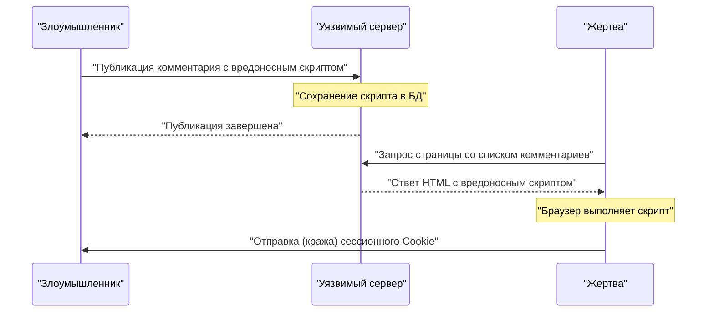
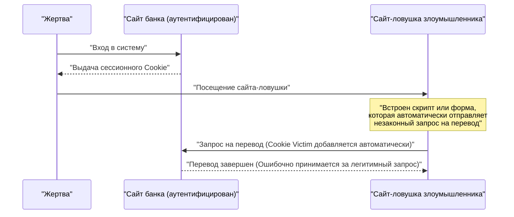
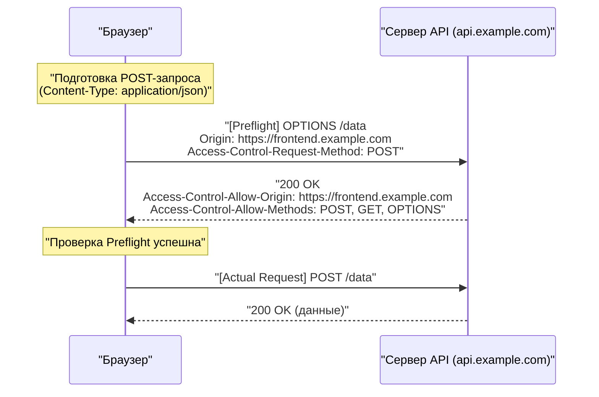
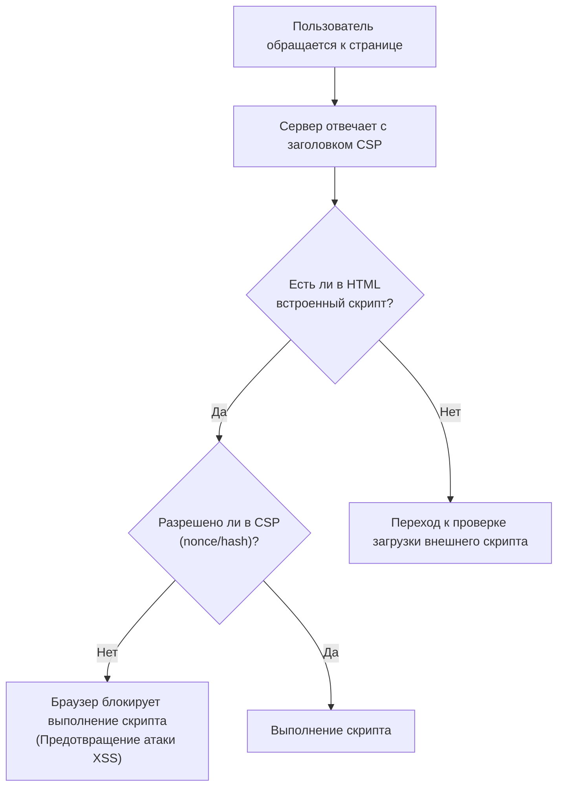

# Введение
Веб-приложения продолжают развиваться, превратившись из простых средств просмотра документов в сложные бизнес-системы и развлекательные платформы. В связи с этим данные, обрабатываемые веб-приложениями, становятся все более конфиденциальными, что делает их более легкой мишенью для кибератак.

В этой статье подробно и всесторонне рассматриваются основы веб-безопасности: от классических, но все еще актуальных уязвимостей, таких как [XSS](https://kenji.blog/ru/p/web-application-vulnerability-owasp-top-10/) и [CSRF](https://kenji.blog/ru/p/web-application-vulnerability-owasp-top-10/), до новейших механизмов защиты, необходимых в современной веб-разработке, таких как CORS, CSP и SameSite Cookie. Кроме того, с помощью конкретных примеров кода и диаграмм Mermaid мы наглядно объясним, как эти технологии работают вместе для создания надежных веб-приложений.

---

# 1. Классические, но современные уязвимости

Уязвимости, связанные с **внедрением (injection)** и **недостатками контроля доступа**, давно существуют в истории веб-приложений и до сих пор регулярно попадают в [OWASP](https://kenji.blog/ru/p/web-application-vulnerability-owasp-top-10/) Top 10. Здесь мы подробно рассмотрим типичные примеры: межсайтовый скриптинг (XSS) и межсайтовую подделку запросов (CSRF).

## 1.1 Межсайтовый скриптинг (XSS)

Межсайтовый скриптинг (XSS) — это метод атаки, при котором злоумышленник внедряет вредоносный скрипт на уязвимый веб-сайт и заставляет его выполняться в браузере пользователя, просматривающего сайт. Это может привести к серьезным последствиям, таким как кража сессионных токенов, подделка действий пользователя и даже распространение вредоносного ПО.

### 1.1.1 Типы XSS

XSS в основном делится на три следующих типа:

1.  **Reflected XSS (Отраженный XSS)**
    Метод, при котором злоумышленник заставляет пользователя кликнуть по вредоносной ссылке, в результате чего скрипт, содержащийся в запросе, «отражается» сервером в ответе как есть и выполняется в браузере.
2.  **Stored XSS (Хранимый XSS)**
    Метод, при котором вредоносный скрипт публикуется в функции, где введенные пользователем данные сохраняются в базе данных (например, на досках объявлений или в разделах комментариев), и заставляет всех пользователей, просматривающих эту страницу, выполнить скрипт. Как правило, масштаб ущерба очень велик.
3.  **DOM-based XSS (XSS на основе DOM)**
    Уязвимость, возникающая, когда клиентский JavaScript записывает URL-адреса или входные значения в DOM без их безопасной обработки, минуя серверную часть.

### 1.1.2 Схема атаки XSS (Пример Stored XSS)

Следующая диаграмма показывает схему атаки Stored XSS.



### 1.1.3 Конкретные примеры кода [XSS](https://kenji.blog/ru/p/web-application-vulnerability-owasp-top-10/) и меры защиты

**Пример уязвимого кода (Node.js / Express)**

```javascript
app.get('/search', (req, res) => {
    const query = req.query.q;
    // Уязвимо к XSS, так как пользовательский ввод выводится в HTML как есть
    res.send(`<h1>Результаты поиска: ${query}</h1>`);
});
```

Если злоумышленник обратится к URL-адресу `?q=<script>alert('XSS')</script>`, скрипт будет выполнен.

**Мера защиты: Экранирование**

Основа предотвращения [XSS](https://kenji.blog/ru/p/web-application-vulnerability-owasp-top-10/) — обезвреживание (экранирование) пользовательского ввода, чтобы он не интерпретировался как HTML. В частности, 5 специальных символов `<`, `>`, `&`, `"`, `'` преобразуются в HTML-сущности.

```javascript
function escapeHTML(str) {
    return str.replace(/[&<>'"]/g, function(match) {
        const escapeMap = {
            '&': '&amp;',
            '<': '&lt;',
            '>': '&gt;',
            "'": '&#39;',
            '"': '&quot;'
        };
        return escapeMap[match];
    });
}

app.get('/search', (req, res) => {
    const query = escapeHTML(req.query.q);
    res.send(`<h1>Результаты поиска: ${query}</h1>`);
});
```

В настоящее время современные фронтенд-фреймворки, такие как React и Vue.js, по умолчанию выполняют экранирование, поэтому определенный уровень защиты от [XSS](https://kenji.blog/ru/p/web-application-vulnerability-owasp-top-10/) обеспечивается, даже если разработчик об этом не задумывается. Однако при использовании `dangerouslySetInnerHTML` (React) или `v-html` (Vue.js) все равно требуется осторожность.

---

## 1.2 Межсайтовая подделка запросов ([CSRF](https://kenji.blog/ru/p/web-application-vulnerability-owasp-top-10/))

Межсайтовая подделка запросов (CSRF) — это атака, при которой пользователя заставляют отправить непреднамеренный запрос (перевод средств, изменение пароля, удаление аккаунта и т.д.) на веб-сайт, где пользователь прошел аутентификацию, через сайт-ловушку, подготовленный злоумышленником.

### 1.2.1 Схема атаки CSRF



В соответствии со спецификацией браузера, запросы к определенному домену автоматически сопровождаются Cookie, связанными с этим доменом. [CSRF](https://kenji.blog/ru/p/web-application-vulnerability-owasp-top-10/) злоупотребляет этим механизмом.

### 1.2.2 Меры защиты от CSRF

Чтобы предотвратить CSRF, необходимо убедиться, что запрос действительно является результатом намеренного действия пользователя.

**1. Использование CSRF-токена**

Наиболее распространенной мерой является генерация на сервере случайной, трудно угадываемой строки (CSRF-токена) и внедрение ее в качестве скрытого поля (`hidden`) в форму. При получении запроса токен, сохраненный в сессии, сравнивается с отправленным токеном, и если они не совпадают, запрос отклоняется.

```html
<!-- Внедрение CSRF-токена в форму -->
<form action="/transfer" method="POST">
    <input type="hidden" name="csrf_token" value="Случайная строка, сгенерированная сервером">
    <input type="text" name="amount" value="10000">
    <button type="submit">Перевод</button>
</form>
```

**2. Использование атрибута SameSite Cookie**

Установка атрибута **SameSite**, описанного ниже, для Cookie позволяет контролировать, чтобы Cookie не прикреплялись к запросам с других сайтов, что является очень эффективной мерой против [CSRF](https://kenji.blog/ru/p/web-application-vulnerability-owasp-top-10/).

---

# 2. Механизмы защиты, поддерживающие современную веб-безопасность

По мере усложнения веб-приложений и распространения SPA (Single Page Application) на основе API классических мер защиты стало недостаточно. В связи с этим один за другим появлялись новые стандарты для обеспечения безопасности на уровне браузера. Здесь мы подробно объясним **CORS**, **CSP** и **SameSite Cookie**, которые являются основой современной веб-безопасности.

## 2.1 Совместное использование ресурсов между разными источниками (CORS)

В Интернете давно существует мощная модель безопасности под названием **Политика одного источника (Same-Origin Policy: SOP)**. SOP гласит, что «документы или скрипты, загруженные из одного источника (комбинация схемы, хоста и порта), ограничены в доступе к ресурсам других источников». Это предотвращает чтение данных с вредоносных сайтов.

Однако в современном вебе распространена конфигурация, при которой источники фронтенда (например, `https://frontend.example.com`) и внутреннего API (например, `https://api.example.com`) различаются. В рамках SOP Ajax-запросы от фронтенда к API будут заблокированы.

Механизм, который безопасно смягчает это ограничение и позволяет совместно использовать ресурсы между разрешенными источниками, называется **CORS (Cross-Origin Resource Sharing)**.

### 2.1.1 Механизм предварительного запроса (Preflight Request)

В CORS перед отправкой запроса, который может повлиять на данные сервера (например, `POST`, `PUT`, `DELETE` или запросы, содержащие пользовательские заголовки), браузер автоматически отправляет **предварительный запрос**, чтобы проверить, готов ли сервер принять фактический запрос.

Предварительный запрос использует метод `OPTIONS` и включает следующие заголовки:
- `Origin`: Источник запроса
- `Access-Control-Request-Method`: Метод, который будет использоваться в фактическом запросе
- `Access-Control-Request-Headers`: Пользовательские заголовки, которые будут использоваться в фактическом запросе



### 2.1.2 Лучшие практики и производительность настроек CORS

**Правильная настройка `Access-Control-Allow-Origin`**

Если вы установите `Access-Control-Allow-Origin: *`, вы разрешите доступ из всех источников, но `*` нельзя использовать для запросов с учетными данными (такими как Cookie) (`withCredentials: true`). В целях безопасности также рекомендуется явно указывать разрешенные источники.

**Повышение производительности за счет кэширования предварительных запросов**

Предварительные запросы создают накладные расходы на связь и могут привести к снижению производительности приложения. Чтобы предотвратить это, важно использовать заголовок `Access-Control-Max-Age` для кэширования результатов предварительного запроса в браузере.

```http
Access-Control-Max-Age: 86400
```
(Единица измерения — секунды. В этом примере кэшируется на 24 часа)

**Сравнение производительности (математическая модель)**

Пусть время, необходимое для запроса, будет $T$, задержка сети — $L$, а время обработки сервером — $S$.

Обычный запрос к тому же источнику:
$ T_{normal} = 2L + S $

Некэшированный запрос CORS (с предварительным запросом):
$ T_{cors\_unached} = 4L + S_{options} + S_{actual} $

Время, необходимое для кэшированного запроса CORS, значительно сокращается и становится почти равным обычному доступу.

$$
\begin{aligned}
T_{cors\_cached} &= 2L + S_{actual} \\\\
&\approx T_{normal}
\end{aligned}
$$

Таким образом, кэшируя предварительный запрос, можно уменьшить задержку $2L$ и время обработки OPTIONS $S_{options}$, что может привести к значительному увеличению скорости.

---

## 2.2 Политика защиты контента (CSP)

**Политика защиты контента (Content Security Policy: CSP)** — это мощный механизм глубокой защиты (defense-in-depth) для фундаментального предотвращения [XSS](https://kenji.blog/ru/p/web-application-vulnerability-owasp-top-10/) и атак с внедрением данных. Он строго определяет происхождение (источники) ресурсов (скриптов, изображений, таблиц стилей и т.д.), которые может загружать веб-страница, в качестве белого списка на стороне сервера.

### 2.2.1 Базовый синтаксис CSP

CSP передается браузеру через HTTP-заголовок ответа `Content-Security-Policy`.

```http
Content-Security-Policy: default-src 'self'; script-src 'self' https://trusted.cdn.com; img-src *;
```

- `default-src 'self'`: Ограничивает источник загрузки по умолчанию для всех ресурсов только собственным источником.
- `script-src 'self' https://trusted.cdn.com`: Разрешает загрузку JavaScript только из собственного источника и указанной CDN.
- `img-src *`: Изображения можно загружать откуда угодно.

### 2.2.2 Искоренение [XSS](https://kenji.blog/ru/p/web-application-vulnerability-owasp-top-10/) путем запрета встроенных скриптов

Главная особенность CSP заключается в том, что по умолчанию **запрещается выполнение встроенных скриптов ( `<script>...</script>` ) и использование `eval()`**. В результате, даже если злоумышленник внедрит вредоносный скрипт в HTML (Stored [XSS](https://kenji.blog/ru/p/web-application-vulnerability-owasp-top-10/) или Reflected XSS), браузер заблокирует его выполнение как нарушение CSP.



### 2.2.3 Использование nonce и hash

Если вам абсолютно необходимо использовать встроенные скрипты (например, тег Google Analytics), существуют безопасные способы их разрешить.

**1. Использование Nonce (нонс)**

Сервер генерирует уникальную случайную строку (nonce) для каждого запроса и указывает ее в заголовке CSP и в атрибуте тега `<script>`. Выполнение разрешается только в том случае, если они совпадают.

HTTP-заголовок:
```http
Content-Security-Policy: script-src 'nonce-r4nd0mStr1ng';
```

HTML:
```html
<script nonce="r4nd0mStr1ng">
    console.log("Этот скрипт будет выполнен");
</script>
<script>
    alert("Скрипт злоумышленника будет заблокирован");
</script>
```

**2. Использование Hash (хеш)**

Вычисляется хеш-значение (например, SHA-256) содержимого скрипта и указывается в заголовке CSP.

HTTP-заголовок:
```http
Content-Security-Policy: script-src 'sha256-B2yPHKaXnvFWtRChIbabYmUBFZdVfKKXHbWtWidDVF8=';
```

### 2.2.4 Функция отчетов о нарушениях CSP

В CSP есть функция, которая позволяет браузеру отправлять отчет на указанную конечную точку при нарушении политики. Это позволяет администраторам замечать попытки неизвестных [XSS](https://kenji.blog/ru/p/web-application-vulnerability-owasp-top-10/) и ошибки конфигурации.

```http
Content-Security-Policy: default-src 'self'; report-uri /csp-violation-report-endpoint/
```
*В последние годы `report-uri` устарел, и рекомендуется использовать более мощный заголовок `Report-To`.

---

## 2.3 Защита от [CSRF](https://kenji.blog/ru/p/web-application-vulnerability-owasp-top-10/) с помощью SameSite Cookie

Cookie необходимы для управления сессиями пользователей в веб-приложениях, но их спецификация автоматической отправки при кросс-доменных запросах была рассадником CSRF. Эту проблему решает атрибут **SameSite** для Cookie.

### 2.3.1 Три режима атрибута SameSite

Для атрибута SameSite можно установить следующие три значения:

1.  **Strict**
    Самая строгая настройка. Cookie отправляются только в том случае, если запрос исходит с того же сайта (домен верхнего уровня и домен на уровень ниже совпадают). Cookie не отправляются даже при переходе по ссылке с внешнего сайта. Он может похвастаться высокой безопасностью, но может снизить удобство использования, например, состояние входа в систему не сохраняется при переходе по ссылке извне.

2.  **Lax**
    Текущее значение браузера по умолчанию. В принципе, Cookie не отправляются в кросс-доменных запросах, но они отправляются только в том случае, если это навигация верхнего уровня (переход на экран по клику на ссылку) и используется безопасный HTTP-метод (например, GET). Это настройка, которая балансирует между удобством и безопасностью.

3.  **None**
    Как и в традиционном поведении, Cookie всегда отправляются даже в кросс-доменных запросах. При использовании этой настройки необходимо добавить атрибут `Secure` (отправка Cookie только по HTTPS).

```http
Set-Cookie: session_id=abc123xyz; SameSite=Strict; Secure; HttpOnly
```

### 2.3.2 Механизм защиты SameSite = Lax

В следующей таблице показано поведение Cookie (при настройке SameSite=Lax) при отправке запроса на сайт банка с сайта другого домена (сайта-ловушки).

| Действие пользователя (на сайте-ловушке) | HTTP-метод | Тип запроса | Отправка Cookie | Влияние на [CSRF](https://kenji.blog/ru/p/web-application-vulnerability-owasp-top-10/) |
| :--- | :--- | :--- | :--- | :--- |
| Клик по ссылке (`<a>`) | GET | Навигация верхнего уровня | **Отправляется** | GET не изменяет состояние, поэтому безопасно |
| Отправка формы (`<form>`) | GET | Навигация верхнего уровня | **Отправляется** | GET не изменяет состояние, поэтому безопасно |
| Отправка формы (`<form>`) | POST | Навигация верхнего уровня | **Блокируется** | **Предотвращает атаку [CSRF](https://kenji.blog/ru/p/web-application-vulnerability-owasp-top-10/)** |
| Асинхронная связь (fetch, XHR) | GET/POST | Подзапрос | **Блокируется** | **Предотвращает атаку CSRF** |
| Загрузка изображения (``) | GET | Подзапрос | **Блокируется** | Безопасно |

Таким образом, простая установка `SameSite=Lax` (или функционирование в качестве значения браузера по умолчанию) делает классические атаки [CSRF](https://kenji.blog/ru/p/web-application-vulnerability-owasp-top-10/) с использованием метода POST неэффективными. Однако для полной защиты рекомендуется использовать его в сочетании с традиционными CSRF-токенами.

---

# 3. Компромиссы в мерах безопасности

При внедрении надежных мер безопасности всегда необходимо учитывать компромисс между **удобством** и **производительностью**.

## 3.1 Безопасность против удобства

Например, установка атрибута SameSite для Cookie в значение `Strict` очень эффективна против [CSRF](https://kenji.blog/ru/p/web-application-vulnerability-owasp-top-10/), но если пользователь нажмет на ссылку в рекламном электронном письме и зайдет на ваш сайт, он будет считаться не авторизованным, что может ухудшить UX (пользовательский опыт). Требуется баланс: выбор `Lax` в соответствии с характеристиками приложения и запрос одноразовых паролей или повторной аутентификации для важных операций.

## 3.2 Безопасность против производительности

Внедрение CSP значительно повышает безопасность, но требует затрат на развертывание и обслуживание строгой политики. Кроме того, генерация Nonce для каждого запроса и предварительные запросы в CORS потребляют, пусть и немного, вычислительные ресурсы сервера и пропускную способность сети.

Как упоминалось выше, в CORS крайне важно минимизировать снижение производительности, установив соответствующий период кэширования (`Access-Control-Max-Age`).

---

# 4. Заключение и перспективы на будущее

В этой статье мы объяснили все: от базовых знаний до новейших технологий для защиты веб-приложений от угроз.

*   **[XSS](https://kenji.blog/ru/p/web-application-vulnerability-owasp-top-10/) и [CSRF](https://kenji.blog/ru/p/web-application-vulnerability-owasp-top-10/)**: Классические, но все еще фатальные уязвимости. Базовой является защита с помощью соответствующего экранирования и токенов.
*   **CORS**: Механизм для реализации безопасной кросс-доменной связи в современной усложняющейся веб-архитектуре.
*   **CSP**: Мощная политика сдерживания инъекционных атак, таких как XSS, на уровне браузера путем исключения встроенных скриптов и т.д.
*   **SameSite Cookie**: Стандартный для браузера барьер против CSRF. Его важность возрастает в связи с движением к отказу от сторонних файлов Cookie.

Мир веб-безопасности — это всегда игра в кошки-мышки. Даже если поставщики браузеров предоставляют мощные механизмы защиты (CSP и SameSite), злоумышленники придумают новые методы обхода (DOM Clobbering, CSS Injection и т.д.).

Разработчики должны признать, что «серебряной пули» не существует, и строго следовать подходу **глубокой защиты (Defense in Depth)**, объединяющему проверку вводимых данных (валидацию), экранирование при выводе, настройку соответствующих HTTP-заголовков (CSP, CORS, HSTS и т.д.) и непрерывную диагностику уязвимостей.

Следите за последними тенденциями и продолжайте создавать более безопасные и надежные веб-приложения.
