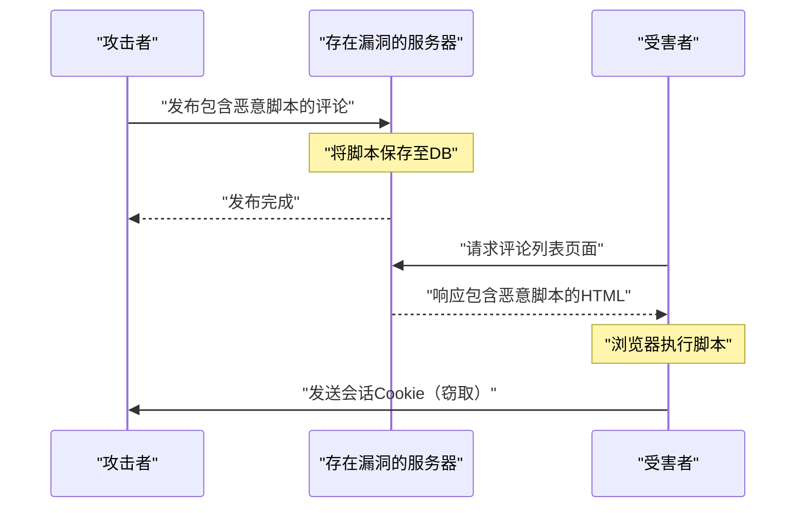
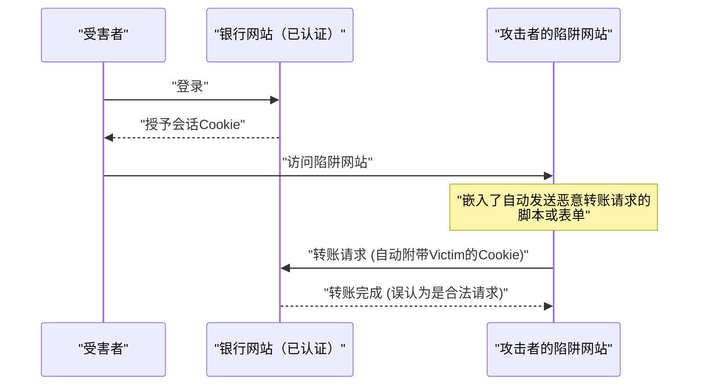
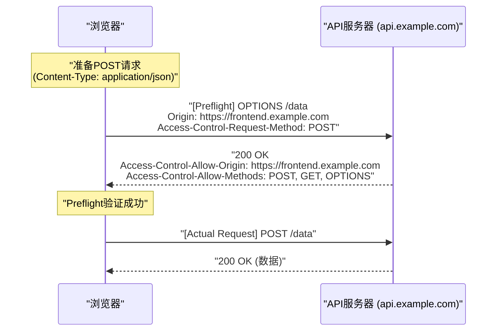
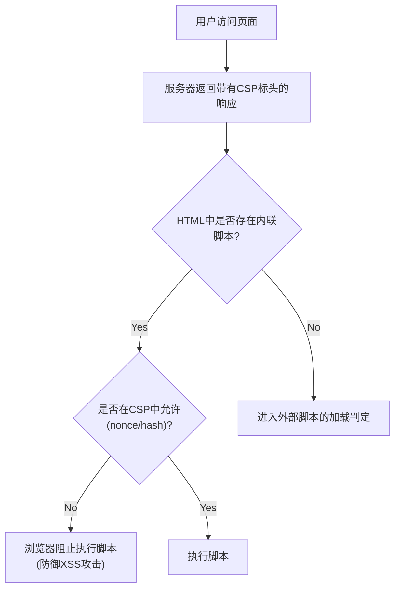

# 前言
Web应用程序在不断发展，已经从单纯的文档查看器蜕变为高级的业务系统和娱乐平台。随之而来的是，Web应用程序处理的数据变得越来越机密，也更容易成为网络攻击的目标。

本文将全面而深入地解析Web安全的基础知识，从[XSS](https://kenji.blog/zh-cn/p/web-application-vulnerability-owasp-top-10/)和[CSRF](https://kenji.blog/zh-cn/p/web-application-vulnerability-owasp-top-10/)等经典且至今仍然肆虐的漏洞，到现代Web开发中不可或缺的CORS、CSP以及SameSite Cookie等最新防御机制。此外，还将结合具体的代码示例和Mermaid图表，通俗易懂地说明这些技术如何协同工作以构建坚固的Web应用程序。

---

# 1. 经典且至今仍具威胁的漏洞

在Web应用程序的历史中，一直存在并常年占据[OWASP](https://kenji.blog/zh-cn/p/web-application-vulnerability-owasp-top-10/) Top 10榜单的是与 **注入** 和 **访问控制不当** 相关的漏洞。在这里，我们将深入探讨其典型代表：跨站脚本攻击（XSS）和跨站请求伪造（CSRF）。

## 1.1 跨站脚本攻击 (XSS)

跨站脚本攻击（XSS）是指攻击者将恶意脚本注入到存在漏洞的网站中，并使其在访问该网站的用户的浏览器上执行的攻击手法。这可能会导致会话令牌被窃取、用户操作被伪造，甚至分发恶意软件，从而造成巨大的损失。

### 1.1.1 XSS的种类

XSS主要分为以下三种：

1.  **Reflected XSS（反射型XSS）**
    通过诱使利用用户点击攻击者准备好的恶意链接，请求中包含的脚本会直接从服务器作为响应“反射”回来，并在浏览器上执行的手法。
2.  **Stored XSS（存储型XSS）**
    在留言板或评论区等将用户输入的数据保存到数据库的功能中，发布恶意脚本，并使所有浏览该页面的用户执行该脚本的手法。其危害规模往往非常大。
3.  **DOM-based XSS**
    不经过服务器端的处理，客户端的JavaScript在没有安全处理URL或输入值的情况下直接写入DOM而产生的漏洞。

### 1.1.2 XSS的攻击流程（以存储型XSS为例）

下图展示了存储型XSS的攻击流程。



### 1.1.3 [XSS](https://kenji.blog/zh-cn/p/web-application-vulnerability-owasp-top-10/)的具体代码示例与防御对策

**存在漏洞的代码示例（Node.js / Express）**

```javascript
app.get('/search', (req, res) => {
    const query = req.query.q;
    // 直接将用户输入输出到HTML中，因此容易受到XSS攻击
    res.send(`<h1>搜索结果: ${query}</h1>`);
});
```

如果攻击者通过 `?q=<script>alert('XSS')</script>` 这样的URL进行访问，脚本就会被执行。

**防御对策：转义处理**

防止[XSS](https://kenji.blog/zh-cn/p/web-application-vulnerability-owasp-top-10/)的基本方法是对用户输入进行无害化（转义）处理，使其不被解析为HTML。尤其是将 `<`, `>`, `&`, `"`, `'` 这5个特殊字符转换为HTML实体。

```javascript
function escapeHTML(str) {
    return str.replace(/[&<>'"]/g, function(match) {
        const escapeMap = {
            '&': '&amp;',
            '<': '&lt;',
            '>': '&gt;',
            "'": '&#39;',
            '"': '&quot;'
        };
        return escapeMap[match];
    });
}

app.get('/search', (req, res) => {
    const query = escapeHTML(req.query.q);
    res.send(`<h1>搜索结果: ${query}</h1>`);
});
```

如今，像React和Vue.js这样的现代前端框架默认会进行转义处理，因此即使开发者不注意，也会有一定程度的[XSS](https://kenji.blog/zh-cn/p/web-application-vulnerability-owasp-top-10/)防护。但是，在使用 `dangerouslySetInnerHTML`（React）或 `v-html`（Vue.js）时，仍然需要特别注意。

---

## 1.2 跨站请求伪造 ([CSRF](https://kenji.blog/zh-cn/p/web-application-vulnerability-owasp-top-10/))

跨站请求伪造（CSRF）是指，用户在已经认证的网站上，被攻击者通过准备好的陷阱网站，强制发送用户意料之外的请求（如转账、修改密码、注销等）的攻击。

### 1.2.1 CSRF的攻击流程



根据浏览器的规范，向特定域名发送请求时，会自动发送与该域名关联的Cookie。[CSRF](https://kenji.blog/zh-cn/p/web-application-vulnerability-owasp-top-10/)正是滥用了这一机制。

### 1.2.2 CSRF的防御对策

为了防止CSRF，必须确认请求是否真的是由用户的意图操作引起的。

**1. 使用CSRF令牌**

最常见的对策是，在服务器端生成一个随机且难以猜测的字符串（CSRF令牌），并将其作为表单的隐藏字段（ `hidden` ）嵌入。在收到请求时，比较保存在会话中的令牌和发送的令牌，如果不一致则拒绝该请求。

```html
<!-- 在表单中嵌入CSRF令牌 -->
<form action="/transfer" method="POST">
    <input type="hidden" name="csrf_token" value="服务器生成的随机字符串">
    <input type="text" name="amount" value="10000">
    <button type="submit">转账</button>
</form>
```

**2. 活用SameSite Cookie属性**

通过在Cookie中设置后文提到的 **SameSite** 属性，可以控制不向跨站请求附加Cookie，这作为[CSRF](https://kenji.blog/zh-cn/p/web-application-vulnerability-owasp-top-10/)对策非常有效。

---

# 2. 支撑现代Web安全的防御机制

随着Web应用程序的复杂化以及基于API的SPA（Single Page Application）成为主流，仅靠传统的对策已经捉襟见肘。因此，在浏览器层面上确保安全的新标准不断涌现。在这里，我们将详细解析现代Web安全的核心： **CORS** 、 **CSP** 以及 **SameSite Cookie** 。

## 2.1 跨源资源共享 (CORS)

Web自古以来就存在一种强大的安全模型，即 **同源策略（Same-Origin Policy: SOP）** 。SOP规定“限制从一个源（协议、主机、端口的组合）加载的文档或脚本访问其他源的资源”。这可以防止来自恶意网站的数据读取。

然而，在现代Web中，前端（例： `https://frontend.example.com` ）和后端API（例： `https://api.example.com` ）的源不同的架构非常普遍。在SOP的限制下，前端向API发起的Ajax请求会被拦截。

安全地放宽这一限制，实现允许的源之间资源共享的机制就是 **CORS（Cross-Origin Resource Sharing）** 。

### 2.1.1 预检请求 (Preflight Request) 的机制

在CORS中，在发送可能影响服务器数据的请求（例如： `POST`，`PUT`，`DELETE` 或包含自定义标头的请求）之前，浏览器会自动发送 **预检请求** ，以确认服务器是否准备好接受实际的请求。

预检请求使用 `OPTIONS` 方法，并包含以下标头：
- `Origin`: 请求源的来源
- `Access-Control-Request-Method`: 实际请求中使用的HTTP方法
- `Access-Control-Request-Headers`: 实际请求中使用的自定义标头



### 2.1.2 CORS设置的最佳实践与性能

**正确设置 `Access-Control-Allow-Origin`**

如果设置为 `Access-Control-Allow-Origin: *` ，则可以允许来自所有源的访问，但是在伴随凭据（如Cookie）的请求（ `withCredentials: true` ）中不能使用 `*` 。从安全角度来看，也建议明确指定允许的源。

**通过缓存预检请求提升性能**

预检请求会造成通信开销，成为降低应用程序性能的原因。为了防止这种情况，使用 `Access-Control-Max-Age` 标头让浏览器缓存预检请求的结果是非常重要的。

```http
Access-Control-Max-Age: 86400
```
（单位为秒。此例为缓存24小时）

**性能比较（数学模型）**

假设请求所需时间为 $T$ ，网络延迟为 $L$ ，服务器处理时间为 $S$ 。

正常的同源请求：
$ T_{normal} = 2L + S $

未缓存的CORS请求（带有预检请求）：
$ T_{cors\_unached} = 4L + S_{options} + S_{actual} $

缓存后的CORS请求所需时间将大幅缩短，几乎与正常访问相同。

$$
\begin{aligned}
T_{cors\_cached} &= 2L + S_{actual} \\\\
&\approx T_{normal}
\end{aligned}
$$

这样，通过缓存预检请求，可以减少延迟 $2L$ 和OPTIONS处理时间 $S_{options}$ ，有望带来显著的速度提升。

---

## 2.2 内容安全策略 (CSP)

**内容安全策略（Content Security Policy: CSP）** 是一种从根本上防止[XSS](https://kenji.blog/zh-cn/p/web-application-vulnerability-owasp-top-10/)和数据注入攻击的强大深度防御机制。它通过服务器端以白名单的形式严格定义Web页面可以加载的资源（脚本、图片、样式表等）的来源（源）。

### 2.2.1 CSP的基本语法

CSP通过HTTP响应标头 `Content-Security-Policy` 传递给浏览器。

```http
Content-Security-Policy: default-src 'self'; script-src 'self' https://trusted.cdn.com; img-src *;
```

- `default-src 'self'`: 将所有资源的默认加载源限制为其自身源。
- `script-src 'self' https://trusted.cdn.com`: 仅允许从自身源和指定的CDN加载JavaScript。
- `img-src *`: 可以从任何地方加载图片。

### 2.2.2 通过禁止内联脚本根除[XSS](https://kenji.blog/zh-cn/p/web-application-vulnerability-owasp-top-10/)

CSP最大的特点是，默认 **禁止执行内联脚本（ `<script>...</script>` ）和使用 `eval()`** 。由此，即使攻击者在HTML中注入了恶意脚本（存储型[XSS](https://kenji.blog/zh-cn/p/web-application-vulnerability-owasp-top-10/)或反射型XSS），浏览器也会将其作为违反CSP的行为而阻止执行。



### 2.2.3 灵活运用nonce和hash

如果无论如何都必须使用内联脚本（例如：Google Analytics标签等），也有提供安全允许的方法。

**1. 使用Nonce（随机数）**

服务器在每次请求时生成一个唯一的随机字符串（nonce），并将其指定给CSP标头和 `<script>` 标签的属性。只有当两者一致时才允许执行。

HTTP标头:
```http
Content-Security-Policy: script-src 'nonce-r4nd0mStr1ng';
```

HTML:
```html
<script nonce="r4nd0mStr1ng">
    console.log("此脚本将被执行");
</script>
<script>
    alert("攻击者的脚本将被拦截");
</script>
```

**2. 使用Hash（哈希）**

计算脚本内容的哈希值（如SHA-256），并将其指定给CSP标头。

HTTP标头:
```http
Content-Security-Policy: script-src 'sha256-B2yPHKaXnvFWtRChIbabYmUBFZdVfKKXHbWtWidDVF8=';
```

### 2.2.4 CSP违反的报告功能

CSP具有在发生违反策略时，使浏览器向指定端点发送报告的功能。这使得管理员能够察觉未知的[XSS](https://kenji.blog/zh-cn/p/web-application-vulnerability-owasp-top-10/)尝试或配置错误。

```http
Content-Security-Policy: default-src 'self'; report-uri /csp-violation-report-endpoint/
```
※近年来 `report-uri` 已被弃用，推荐使用更强大的 `Report-To` 标头。

---

## 2.3 基于SameSite Cookie的[CSRF](https://kenji.blog/zh-cn/p/web-application-vulnerability-owasp-top-10/)防御

Cookie在Web应用程序的用户会话管理中不可或缺，但在跨站请求时自动发送的规范却成了CSRF的温床。解决这一问题的，就是Cookie的 **SameSite属性** 。

### 2.3.1 SameSite属性的3种模式

SameSite属性可以设置以下3个值。

1.  **Strict**
    这是最严格的设置。仅当请求来自同一站点（顶级域名及下一级域名一致）时，才会发送Cookie。即使通过点击外部网站的链接进行跳转，也不会发送Cookie。它具有很高的安全性，但可能会损害便利性，例如从外部链接访问时无法继承登录状态。

2.  **Lax**
    这是当前浏览器的默认值。基本上在跨站请求中不发送Cookie，但只有在顶级导航（通过点击链接进行页面跳转）且使用了安全的HTTP方法（如GET）时，才会发送Cookie。这是一种在便利性和安全性之间取得平衡的设置。

3.  **None**
    与传统的行为相同，即使在跨站请求中也总是发送Cookie。在使用此设置时，必须附带 `Secure` 属性（仅在HTTPS中发送Cookie）。

```http
Set-Cookie: session_id=abc123xyz; SameSite=Strict; Secure; HttpOnly
```

### 2.3.2 SameSite = Lax 的保护机制

下表展示了从其他域名网站（陷阱网站）向银行网站发送请求时Cookie的行为（在设置 SameSite=Lax 的情况下）。

| 用户的操作（在陷阱网站上） | HTTP方法 | 请求类型 | Cookie的发送 | 对[CSRF](https://kenji.blog/zh-cn/p/web-application-vulnerability-owasp-top-10/)的影响 |
| :--- | :--- | :--- | :--- | :--- |
| 链接 (`<a>`) 的点击 | GET | 顶级导航 | **发送** | GET不改变状态，因此安全 |
| 表单 (`<form>`) 的提交 | GET | 顶级导航 | **发送** | GET不改变状态，因此安全 |
| 表单 (`<form>`) 的提交 | POST | 顶级导航 | **拦截** | **防止[CSRF](https://kenji.blog/zh-cn/p/web-application-vulnerability-owasp-top-10/)攻击** |
| 异步通信 (fetch, XHR) | GET/POST | 子请求 | **拦截** | **防止CSRF攻击** |
| 图片的加载 (``) | GET | 子请求 | **拦截** | 安全 |

这样，仅仅是设置了 `SameSite=Lax` （或者作为浏览器默认生效），使用POST方法的传统[CSRF](https://kenji.blog/zh-cn/p/web-application-vulnerability-owasp-top-10/)攻击就会失效。然而，为了实现完全的防御，仍然建议与传统的CSRF令牌结合使用。

---

# 3. 安全对策的权衡

在引入坚固的安全对策时，始终需要考虑 **便利性** 和 **性能** 之间的权衡（Trade-off）。

## 3.1 安全性 vs 便利性

例如，如果将Cookie的 SameSite 属性设置为 `Strict` ，虽然对[CSRF](https://kenji.blog/zh-cn/p/web-application-vulnerability-owasp-top-10/)具有很强的防御力，但当用户点击促销邮件中的链接访问自家网站时，会被当作未登录状态处理，这可能会损害UX（用户体验）。需要根据应用程序的特性选择 `Lax` ，并在重要操作时要求输入一次性密码或重新认证等平衡手段。

## 3.2 安全性 vs 性能

引入CSP能显著提高安全性，但构建和维护严格策略需要相应的运营成本。此外，每次请求时生成Nonce，以及CORS中的预检请求，都会轻微消耗服务器的计算资源和网络带宽。

如前所述，在CORS中，通过设置适当的缓存期限（ `Access-Control-Max-Age` ），将性能下降降至最低是不可或缺的。

---

# 4. 总结与未来展望

本文从保护Web应用程序免受威胁的基础知识到最新技术进行了全面解析。

*   **[XSS](https://kenji.blog/zh-cn/p/web-application-vulnerability-owasp-top-10/)和[CSRF](https://kenji.blog/zh-cn/p/web-application-vulnerability-owasp-top-10/)**: 尽管是经典的漏洞，但至今仍会带来致命的危害。基于适当的转义和令牌的防御是基础。
*   **CORS**: 在日益复杂的现代Web架构中，实现安全跨源通信的机制。
*   **CSP**: 通过排除内联脚本等手段，在浏览器层面封杀XSS等注入攻击的强大策略。
*   **SameSite Cookie**: 浏览器标准的针对CSRF的防壁。在逐步废除第三方Cookie的趋势下，其重要性日益凸显。

Web安全世界永远是一场猫鼠游戏。即使浏览器厂商提供了强大的防御机制（如CSP或SameSite），攻击者也会想出新的绕过手法（如DOM Clobbering或CSS Injection等）。

开发者需要认识到不存在“银弹”，并且必须彻底贯彻结合了输入值验证（Validation）、输出时转义、设置适当的HTTP标头（CSP、CORS、HSTS等），以及持续进行漏洞诊断的 **多层防御（Defense in Depth）** 方法。

持续关注最新动态，构建更安全、值得信赖的Web应用程序吧。
