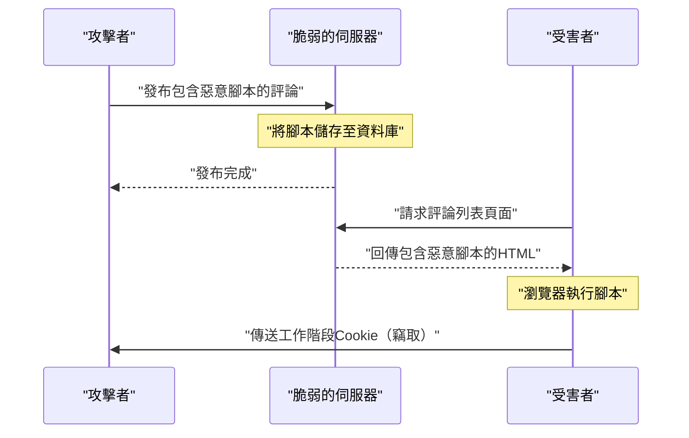
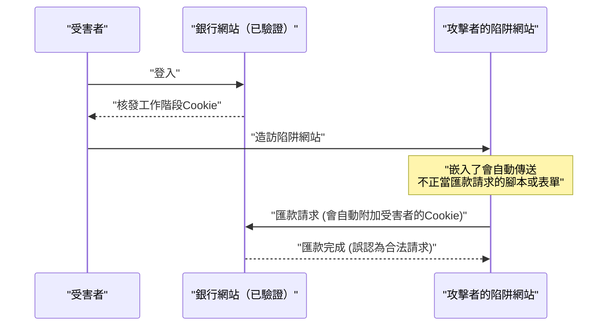
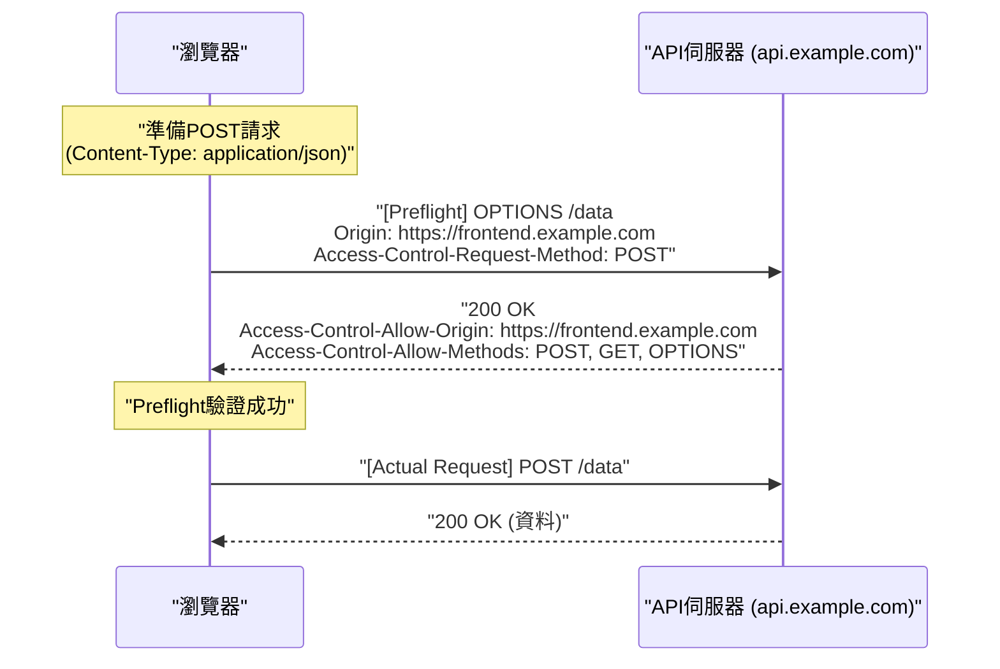

# 前言
Web應用程式持續演進，從單純的文件檢視器，蛻變為高度的業務系統與娛樂平台。伴隨而來的是，Web應用程式處理的資料變得越來越機密，也更容易成為網路攻擊的目標。

本文將針對Web安全性的基礎，從[XSS](https://kenji.blog/zh-tw/p/web-application-vulnerability-owasp-top-10/)與[CSRF](https://kenji.blog/zh-tw/p/web-application-vulnerability-owasp-top-10/)等經典且至今仍具強大威脅的漏洞，到現代Web開發中不可或缺的CORS、CSP，以及SameSite Cookie等最新防禦機制，進行全面且詳細的解說。此外，我們也將透過具體的程式碼範例與Mermaid圖表，淺顯易懂地說明這些技術如何協同運作，以建構出堅固的Web應用程式。

---

# 1. 經典且在現代仍具威脅的漏洞

在Web應用程式的歷史中， **隱碼攻擊** (Injection) 與 **存取控制缺陷** 等相關漏洞由來已久，且至今仍是[OWASP](https://kenji.blog/zh-tw/p/web-application-vulnerability-owasp-top-10/) Top 10的常客。在此，我們將深入探討其中的代表：跨站指令碼 (XSS) 與跨站請求偽造 (CSRF)。

## 1.1 跨站指令碼 (XSS)

跨站指令碼（XSS）是一種攻擊手法，攻擊者將惡意的腳本注入到有漏洞的網站中，並讓瀏覽該網站的受害者在瀏覽器上執行該腳本。這可能導致工作階段權杖遭竊取、偽造使用者操作，甚至散佈惡意軟體等，帶來極大的損害。

### 1.1.1 XSS的種類

XSS主要可分為以下三種：

1.  **反射型XSS (Reflected XSS)**
    攻擊者誘使使用者點擊準備好的惡意連結，使請求中包含的腳本直接從伺服器作為回應「反射」回來，並在瀏覽器上執行的手法。
2.  **儲存型XSS (Stored XSS)**
    在留言板或評論區等會將使用者輸入的資料儲存到資料庫的功能中，攻擊者發布惡意腳本，讓所有瀏覽該頁面的使用者都執行該腳本的手法。這類攻擊的受害規模通常非常大。
3.  **基於DOM的XSS (DOM-based XSS)**
    不經過伺服器端的處理，而是因為用戶端的JavaScript在沒有安全處理URL或輸入值的情況下，直接將其寫入DOM所產生的漏洞。

### 1.1.2 XSS的攻擊流程（以儲存型XSS為例）

下圖展示了儲存型XSS的攻擊流程。



### 1.1.3 [XSS](https://kenji.blog/zh-tw/p/web-application-vulnerability-owasp-top-10/)的具體程式碼範例與防禦策略

**有漏洞的程式碼範例（Node.js / Express）**

```javascript
app.get('/search', (req, res) => {
    const query = req.query.q;
    // 直接將使用者輸入輸出為HTML，因此容易受到XSS攻擊
    res.send(`<h1>搜尋結果: ${query}</h1>`);
});
```

當攻擊者透過 `?q=<script>alert('XSS')</script>` 這樣的URL進行存取時，腳本就會被執行。

**防禦策略：跳脫處理 (Escape)**

防禦[XSS](https://kenji.blog/zh-tw/p/web-application-vulnerability-owasp-top-10/)的基礎在於將使用者輸入無害化（跳脫），使其不被當作HTML來解析。特別是將 `<`, `>`, `&`, `"`, `'` 這五個特殊字元轉換為HTML實體。

```javascript
function escapeHTML(str) {
    return str.replace(/[&<>'"]/g, function(match) {
        const escapeMap = {
            '&': '&amp;',
            '<': '&lt;',
            '>': '&gt;',
            "'": '&#39;',
            '"': '&quot;'
        };
        return escapeMap[match];
    });
}

app.get('/search', (req, res) => {
    const query = escapeHTML(req.query.q);
    res.send(`<h1>搜尋結果: ${query}</h1>`);
});
```

現在，像React或Vue.js等現代前端框架預設就會進行跳脫處理，因此即使開發者沒有特別注意，也能獲得一定程度的[XSS](https://kenji.blog/zh-tw/p/web-application-vulnerability-owasp-top-10/)防護。然而，在使用 `dangerouslySetInnerHTML` （React）或 `v-html` （Vue.js）時，仍需要特別小心。

---

## 1.2 跨站請求偽造 ([CSRF](https://kenji.blog/zh-tw/p/web-application-vulnerability-owasp-top-10/))

跨站請求偽造（CSRF）是一種攻擊方式，攻擊者利用使用者已驗證的網站，讓使用者經由攻擊者準備的陷阱網站，強制傳送使用者無意願的請求（如匯款、更改密碼、退會等）。

### 1.2.1 CSRF的攻擊流程



基於瀏覽器的規格，對特定網域發送請求時，會自動傳送與該網域相關聯的Cookie。[CSRF](https://kenji.blog/zh-tw/p/web-application-vulnerability-owasp-top-10/)就是濫用了這個機制。

### 1.2.2 CSRF的防禦策略

為了防禦CSRF，必須確認請求是否真的出於使用者的意願。

**1. 使用CSRF權杖 (Token)**

最常見的對策是，伺服器端產生一組難以猜測的隨機字串（CSRF權杖），並將其作為表單的隱藏欄位（ `hidden` ）嵌入。在收到請求時，比對儲存在工作階段中的權杖與傳送過來的權杖，若不一致則拒絕該請求。

```html
<!-- 在表單中嵌入CSRF權杖 -->
<form action="/transfer" method="POST">
    <input type="hidden" name="csrf_token" value="伺服器產生的隨機字串">
    <input type="text" name="amount" value="10000">
    <button type="submit">匯款</button>
</form>
```

**2. 活用SameSite Cookie屬性**

後文將提到的 **SameSite** 屬性設定在Cookie上，可以控制跨網站請求時不附加Cookie，這作為[CSRF](https://kenji.blog/zh-tw/p/web-application-vulnerability-owasp-top-10/)的對策非常有效。

---

# 2. 支撐現代Web安全性的防禦機制

隨著Web應用程式變得越來越複雜，以API為基礎的SPA（Single Page Application）成為主流，傳統對策的極限也逐漸顯現。因此，為了在瀏覽器層級確保安全性，新的標準接連問世。在此，我們將詳細解說作為現代Web安全性核心的 **CORS** 、 **CSP** 以及 **SameSite Cookie** 。

## 2.1 跨來源資源共用 (CORS)

Web自古以來就存在一個強大的安全模型，稱為 **同源政策 (Same-Origin Policy: SOP)** 。SOP的意思是「限制從某個來源（通訊協定、主機和通訊埠的組合）載入的文件或腳本，去存取其他來源的資源」。這可以防止惡意網站讀取資料。

然而，在現代的Web開發中，前端（例如： `https://frontend.example.com` ）與後端API（例如： `https://api.example.com` ）來源不同的架構已經非常普遍。在SOP的限制下，從前端發往API的Ajax請求將會被阻擋。

能夠安全地放寬此限制，並實現允許的來源之間進行資源共用的機制，就是 **CORS (Cross-Origin Resource Sharing)** 。

### 2.1.1 預檢請求 (Preflight Request) 的機制

在CORS中，若要發送可能影響伺服器資料的請求（例如： `POST`, `PUT`, `DELETE` 或包含自訂標頭的請求），瀏覽器會自動在事前發送 **預檢請求** ，以確認伺服器是否已準備好接受實際的請求。

預檢請求使用 `OPTIONS` 方法，並包含以下標頭：
- `Origin`: 請求來源的網域
- `Access-Control-Request-Method`: 實際請求將使用的方法
- `Access-Control-Request-Headers`: 實際請求將使用的自訂標頭



### 2.1.2 CORS設定的最佳實踐與效能

**正確設定 `Access-Control-Allow-Origin` **

如果設定為 `Access-Control-Allow-Origin: *` ，雖然可以允許來自所有來源的存取，但在伴隨驗證資訊（如Cookie等）的請求（ `withCredentials: true` ）中無法使用 `*` 。基於安全考量，強烈建議明確指定允許的來源。

**透過快取預檢請求提升效能**

預檢請求會造成通訊的額外負擔，並成為應用程式效能低下的原因。為了防止這種情況，使用 `Access-Control-Max-Age` 標頭讓瀏覽器快取預檢結果是非常重要的。

```http
Access-Control-Max-Age: 86400
```
（單位為秒。此範例為快取24小時）

**效能比較（數學模型）**

假設請求花費的時間為 $T$ ，網路延遲為 $L$ ，伺服器處理時間為 $S$ 。

一般的同源請求：
$ T_{normal} = 2L + S $

未快取的CORS請求（有預檢請求）：
$ T_{cors\_unached} = 4L + S_{options} + S_{actual} $

快取後的CORS請求所需時間將會大幅縮短，幾乎等同於一般存取。

$$
\begin{aligned}
T_{cors\_cached} &= 2L + S_{actual} \\\\
&\approx T_{normal}
\end{aligned}
$$

如上所述，透過快取預檢請求，可以減少 $2L$ 的延遲與 $S_{options}$ 的處理時間，可預期能帶來戲劇性的速度改善。

---

## 2.2 內容安全策略 (CSP)

**內容安全策略 (Content Security Policy: CSP)** 是一種從根本上防禦[XSS](https://kenji.blog/zh-tw/p/web-application-vulnerability-owasp-top-10/)及資料注入攻擊的強大多層次防禦機制。它嚴格定義了伺服器端的白名單，以限制網頁可以載入的資源（腳本、圖片、樣式表等）來源。

### 2.2.1 CSP的基本語法

CSP是透過HTTP回應標頭 `Content-Security-Policy` 傳達給瀏覽器的。

```http
Content-Security-Policy: default-src 'self'; script-src 'self' https://trusted.cdn.com; img-src *;
```

- `default-src 'self'`: 將所有資源的預設載入來源限制為僅限自身來源。
- `script-src 'self' https://trusted.cdn.com`: 僅允許從自身來源與指定的CDN載入JavaScript。
- `img-src *`: 圖片可以從任何地方載入。

### 2.2.2 藉由禁止內聯腳本來根絕[XSS](https://kenji.blog/zh-tw/p/web-application-vulnerability-owasp-top-10/)

CSP最大的特徵是，預設會 **禁止內聯腳本 ( `<script>...</script>` ) 的執行以及 `eval()` 的使用** 。因此，即使攻擊者在HTML中注入了惡意腳本（如儲存型[XSS](https://kenji.blog/zh-tw/p/web-application-vulnerability-owasp-top-10/)或反射型XSS），瀏覽器也會因為違反CSP而阻擋其執行。

```mermaid
flowchart TD
    A["使用者存取頁面"] --> B["伺服器回傳附帶CSP標頭的回應"]
    B --> C{"HTML內是否存在內聯<br>腳本？"}
    C --|"Yes"| D{"是否受到CSP許可<br>(nonce/hash)？"}
    D --|"No"| E["瀏覽器阻擋腳本執行<br>(防禦XSS攻擊)"]
    D --|"Yes"| F["執行腳本"]
    C --|"No"| G["進入外部腳本讀取判定"]
```

### 2.2.3 nonce與hash的活用

如果絕對有必要使用內聯腳本（例如：Google Analytics的標籤等），也有提供安全的許可方法。

**1. 使用Nonce (隨機數)**

伺服器在每次請求時產生一組獨一無二且隨機的字串（nonce），並指定在CSP標頭與 `<script>` 標籤的屬性中。只有當兩者一致時才會允許執行。

HTTP標頭:
```http
Content-Security-Policy: script-src 'nonce-r4nd0mStr1ng';
```

HTML:
```html
<script nonce="r4nd0mStr1ng">
    console.log("此腳本將會被執行");
</script>
<script>
    alert("攻擊者的腳本將會被阻擋");
</script>
```

**2. 使用Hash (雜湊)**

計算腳本內容的雜湊值（例如SHA-256），並指定於CSP標頭中。

HTTP標頭:
```http
Content-Security-Policy: script-src 'sha256-B2yPHKaXnvFWtRChIbabYmUBFZdVfKKXHbWtWidDVF8=';
```

### 2.2.4 CSP違規的報告功能

CSP提供了一種功能，當發生違反策略的情況時，可以讓瀏覽器將報告發送到指定的端點。如此一來，管理員就能察覺未知的[XSS](https://kenji.blog/zh-tw/p/web-application-vulnerability-owasp-top-10/)嘗試或設定錯誤。

```http
Content-Security-Policy: default-src 'self'; report-uri /csp-violation-report-endpoint/
```
※近年來 `report-uri` 已被棄用，建議使用更為強大的 `Report-To` 標頭。

---

## 2.3 藉由 SameSite Cookie 防禦[CSRF](https://kenji.blog/zh-tw/p/web-application-vulnerability-owasp-top-10/)

Cookie在Web應用程式中對於使用者的工作階段管理是不可或缺的，但跨網站請求時會自動傳送的規格，卻成為了CSRF的溫床。解決這個問題的就是Cookie的 **SameSite屬性** 。

### 2.3.1 SameSite屬性的三種模式

SameSite屬性可以設定為以下三種值：

1.  **Strict**
    最嚴格的設定。只有當請求來自同一個網站（頂層網域和下一層網域一致）時，才會傳送Cookie。即使是點擊外部網站的連結跳轉過來，也不會傳送Cookie。雖然擁有極高的安全性，但可能會損害便利性，例如從外部連結存取時無法繼承登入狀態。

2.  **Lax**
    這是目前瀏覽器的預設值。基本上在跨網站請求時不會傳送Cookie，但唯獨在頂層導覽（點擊連結導致畫面跳轉），且使用安全的HTTP方法（如GET）時，才會傳送Cookie。這是在便利性與安全性之間取得平衡的設定。

3.  **None**
    與傳統的行為相同，即使是跨網站請求也始終會傳送Cookie。如果要使用此設定，必須同時加上 `Secure` 屬性（僅在HTTPS下傳送Cookie）。

```http
Set-Cookie: session_id=abc123xyz; SameSite=Strict; Secure; HttpOnly
```

### 2.3.2 SameSite = Lax 的保護機制

下表顯示了從不同網域的網站（陷阱網站）向銀行網站傳送請求時，Cookie的行為（設定為SameSite=Lax時）。

| 使用者的操作（在陷阱網站上） | HTTP方法 | 請求類型 | Cookie的傳送 | 對[CSRF](https://kenji.blog/zh-tw/p/web-application-vulnerability-owasp-top-10/)的影響 |
| :--- | :--- | :--- | :--- | :--- |
| 點擊連結 (`<a>`) | GET | 頂層導覽 | **傳送** | GET不會改變狀態，因此安全 |
| 傳送表單 (`<form>`) | GET | 頂層導覽 | **傳送** | GET不會改變狀態，因此安全 |
| 傳送表單 (`<form>`) | POST | 頂層導覽 | **阻擋** | **防止[CSRF](https://kenji.blog/zh-tw/p/web-application-vulnerability-owasp-top-10/)攻擊** |
| 非同步通訊 (fetch, XHR) | GET/POST | 子請求 | **阻擋** | **防止CSRF攻擊** |
| 載入圖片 (``) | GET | 子請求 | **阻擋** | 安全 |

如上所示，只要設定了 `SameSite=Lax` （或發揮其作為瀏覽器預設值的作用），使用POST方法的傳統[CSRF](https://kenji.blog/zh-tw/p/web-application-vulnerability-owasp-top-10/)攻擊就會失效。然而，為了達到完整的防禦，建議仍要與傳統的CSRF權杖搭配使用。

---

# 3. 安全性對策的權衡

在導入堅固的安全性對策時，必須時常考量 **便利性** 與 **效能** 之間的權衡（Trade-off）。

## 3.1 安全性 vs 便利性

例如，如果將Cookie的 SameSite 屬性設定為 `Strict` ，對抗[CSRF](https://kenji.blog/zh-tw/p/web-application-vulnerability-owasp-top-10/)會非常有效，但當使用者點擊促銷郵件的連結存取自家網站時，可能會被當作未登入狀態處理，進而損害UX（使用者體驗）。我們需要根據應用程式的特性選擇 `Lax` ，並在重要的操作時要求輸入一次性密碼或重新驗證，以取得平衡。

## 3.2 安全性 vs 效能

導入CSP可以大幅提升安全性，但建構與維持嚴格策略需要耗費營運成本。此外，每次請求時產生Nonce，或是CORS中的預檢請求，都會微幅消耗伺服器的運算資源與網路頻寬。

如前所述，在CORS中，設定適當的快取時間（ `Access-Control-Max-Age` ）以將效能的衰退降至最低是不可抹滅的。

---

# 4. 總結與未來展望

本文解說了為了保護Web應用程式免受威脅的基礎知識與最新技術。

*   **[XSS](https://kenji.blog/zh-tw/p/web-application-vulnerability-owasp-top-10/)與[CSRF](https://kenji.blog/zh-tw/p/web-application-vulnerability-owasp-top-10/)**: 雖然古老，但至今仍會帶來致命損害的漏洞。適當的跳脫處理與權杖防禦是基礎。
*   **CORS**: 在日益複雜的現代Web架構中，實現安全跨來源通訊的機制。
*   **CSP**: 透過排除內聯腳本等方式，在瀏覽器層級封殺XSS等注入攻擊的強大策略。
*   **SameSite Cookie**: 對抗CSRF的瀏覽器標準防禦壁壘。在廢除第三方Cookie的趨勢中，其重要性正與日俱增。

Web安全性的世界是一場永無止盡的貓鼠遊戲。即使瀏覽器廠商提供了強大的防禦機制（CSP或SameSite），攻擊者也會想出新的繞過手法（如DOM Clobbering或CSS Injection等）。

開發者必須認知到「銀彈」並不存在，並徹底貫徹結合輸入值驗證（Validation）、輸出時跳脫、正確的HTTP標頭設定（CSP、CORS、HSTS等），以及持續進行弱點掃描的 **多層次防禦 (Defense in Depth)** 策略。

持續關注最新動向，建構出更安全、更值得信賴的Web應用程式吧。
