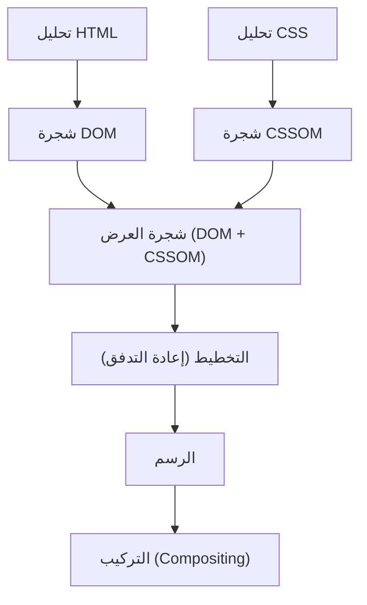

# مؤشرات الويب الحيوية (Web Vitals) وتحسين أداء الواجهة الأمامية (تحسين LCP و FID و CLS)

في تطوير الويب الحديث، أصبح تحسين تجربة المستخدم (UX) عاملاً حاسمًا يرتبط ارتباطًا مباشرًا بنجاح الأعمال. اقترحت Google **مؤشرات الويب الحيوية الأساسية (Core Web Vitals)** كمقاييس لتحديد وتقييم تجربة المستخدم على الويب. في هذه المقالة، من منظور تحسين أداء الواجهة الأمامية، سنتعمق في معايير القياس التفصيلية لـ LCP و FID (والمؤشر من الجيل التالي INP) و CLS التي تشكل Core Web Vitals، وطرق التحسين المحددة.

## 1. خط أنابيب عرض المتصفح (Rendering Pipeline) والأداء

لفهم تحسين أداء الواجهة الأمامية، يجب أن نفهم أولاً كيف يحول المتصفح HTML و CSS و JavaScript إلى بكسلات على الشاشة، أي **خط أنابيب العرض (Rendering Pipeline)**. بعد أن يتلقى المتصفح الموارد من الشبكة، فإنه يرسم الشاشة من خلال الخطوات التالية.



1. **التحليل (Parse)** : عندما يتلقى المتصفح HTML، فإنه يحلله من أعلى إلى أسفل ويبني شجرة DOM (نموذج كائن المستند). في الوقت نفسه، يقوم بتحليل CSS لبناء شجرة CSSOM (نموذج كائن CSS).
2. **النمط (Style)** : يتم دمج شجرتي DOM و CSSOM لإنشاء شجرة عرض تحسب الأنماط التي سيتم تطبيقها على أي عقد.
3. **التخطيط / إعادة التدفق (Layout / Reflow)** : بناءً على شجرة العرض، يتم حساب مكان وحجم كل عنصر على الشاشة.
4. **الرسم (Paint)** : استنادًا إلى معلومات التخطيط، يتم رسم العناصر المرئية مثل النص والألوان والصور والحدود كبكسلات على طبقات في الذاكرة.
5. **التركيب (Composite)** : تتداخل طبقات متعددة بالترتيب الصحيح لإخراج الشاشة النهائية.

تحسين الأداء ليس أكثر من تقليل الوقت المستغرق في كل خطوة من خط الأنابيب هذا ومنع حظر السلسلة الرئيسية (Main Thread). على وجه الخصوص، يعد تنفيذ JavaScript وحسابات CSS الثقيلة العوامل الرئيسية في حظر خط الأنابيب هذا.

## 2. فهم عميق لـ LCP (أكبر رسم محتوى) وطرق تحسينه

### ما هو LCP؟

**LCP (أكبر رسم محتوى - Largest Contentful Paint)** هو مقياس يقيس أداء تحميل الصفحة. على وجه التحديد، يشير إلى الوقت من وصول المستخدم إلى الصفحة حتى يتم عرض أكبر كتلة نصية أو عنصر صورة داخل إطار العرض (منطقة العرض في الشاشة).

- **جيد (Good)** : أقل من 2.5 ثانية
- **يحتاج إلى تحسين (Needs Improvement)** : 2.5 ثانية إلى 4.0 ثانية
- **ضعيف (Poor)** : أكثر من 4.0 ثانية

### الأسباب الرئيسية لتدهور LCP

تنقسم أسباب بطء LCP بشكل أساسي إلى الفئات الأربع التالية.

1. **وقت استجابة الخادم البطيء (تأخير TTFB)** 
2. **JavaScript و CSS اللذان يحظران العرض** 
3. **أوقات التحميل الطويلة للموارد (الصور وخطوط الويب، إلخ)** 
4. **الاعتماد المفرط على العرض من جانب العميل (CSR)** 

### طرق تحسين LCP

#### التحميل المسبق للموارد (`preload` / `prefetch`)

لتحميل عناصر LCP (مثل الصور البارزة "Hero images" وخطوط الويب الرئيسية) مبكرًا، استخدم `<link rel="preload">`. يتيح ذلك بدء التنزيل قبل أن يكتشف محلل المتصفح المورد.

```html
<!-- التحميل المسبق للصورة البارزة (Hero image) -->
<link rel="preload" href="/images/hero-image.webp" as="image" />

<!-- التحميل المسبق لخط الويب -->
<link rel="preload" href="/fonts/custom-font.woff2" as="font" type="font/woff2" crossorigin />

<!-- الاتصال المبكر بالنطاقات الخارجية (مثل شبكة توصيل المحتوى CDN) -->
<link rel="preconnect" href="https://fonts.gstatic.com" crossorigin />
```

#### التخلص من الموارد التي تحظر العرض

CSS هو مورد يحظر العرض افتراضيًا. لا يرسم المتصفح الشاشة حتى يتم بناء CSSOM. يمكن تحسين LCP عن طريق تضمين CSS الحرج (Critical CSS، المطلوب للعرض الأولي) وتحميل CSS الآخر بشكل غير متزامن.

```html
<!-- تحميل غير متزامن لـ CSS غير الحرج -->
<link rel="stylesheet" href="non-critical.css" media="print" onload="this.media='all'" />
```

#### تحسين الصور

غالبًا ما تكون الصور عناصر LCP، لذا فإن التحسين الشامل ضروري.

- **استخدام تنسيقات الجيل التالي** : استخدم تنسيقات ذات معدلات ضغط عالية مثل WebP و AVIF.
- **التسليم بالحجم المناسب** : استخدم سمة `srcset` لتوفير صور بحجم يناسب عرض شاشة الجهاز.

```html
<picture>
  <source srcset="hero-large.avif" media="(min-width: 1024px)" type="image/avif" />
  <source srcset="hero-small.avif" media="(max-width: 1023px)" type="image/avif" />
  
</picture>
```

بالإضافة إلى ذلك، يجب عدم تطبيق `loading="lazy"` (التحميل الكسول) على الصور التي تصبح عناصر LCP، حيث سيؤدي ذلك إلى تأخير توقيت LCP. يمكنك زيادة الأولوية عن طريق إضافة `fetchpriority="high"` صراحةً إلى عناصر LCP.

## 3. FID (تأخير الإدخال الأول) و INP (التفاعل إلى الرسمة التالية)

### الفرق بين FID و INP

يقيس **FID (تأخير الإدخال الأول - First Input Delay)** وقت التأخير من لحظة تفاعل المستخدم الأول مع الصفحة (مثل النقر أو اللمس) حتى يبدأ المتصفح في الاستجابة لذلك التفاعل ومعالجة معالجات الأحداث (Event Handlers).

- **جيد (Good)** : أقل من 100 مللي ثانية

ومع ذلك، يستهدف FID "الإدخال الأول" فقط ويقيس الوقت "حتى يبدأ تنفيذ معالج الحدث" فقط. تم تقديم **INP (التفاعل إلى الرسمة التالية - Interaction to Next Paint)** كمؤشر جديد لاستبدال ذلك. يراقب INP وقت استجابة جميع تفاعلات المستخدم التي تحدث طوال دورة حياة الصفحة بأكملها، ويقيم التأخير الكلي من وقت حدوث الحدث حتى يتم الرسم التالي (Paint).

- **جيد (Good)** : أقل من 200 مللي ثانية

### الأسباب الرئيسية لتدهور FID/INP

السبب الأكبر هو **المهام الطويلة (Long Tasks) التي تشغل السلسلة الرئيسية (Main Thread)**. إذا كانت هناك مهام تستغرق أكثر من 50 مللي ثانية لتحليل وتجميع وتنفيذ JavaScript، فلن يتمكن المتصفح من الاستجابة لإدخال المستخدم على الفور.

### طرق تحسين FID/INP

#### التحميل غير المتزامن للنصوص البرمجية (`async` / `defer`)

استخدم سمات `async` أو `defer` لمنع تحميل JavaScript من حظر تحليل HTML.

```mermaid
gantt
    title "استراتيجيات تحميل النصوص البرمجية"
    dateFormat  s
    axisFormat  %S
    
    section "عادي <script>"
    تحليل HTML :a1, 0, 2s
    تنزيل النص البرمجي :a2, after a1, 2s
    تنفيذ النص البرمجي :a3, after a2, 2s
    تحليل HTML (مستأنف) :a4, after a3, 2s
    
    section "<script async>"
    تحليل HTML :b1, 0, 4s
    تنزيل النص البرمجي :b2, 0, 2s
    تنفيذ النص البرمجي :b3, after b2, 2s
    تحليل HTML (مستأنف) :b4, after b3, 2s
    
    section "<script defer>"
    تحليل HTML :c1, 0, 6s
    تنزيل النص البرمجي :c2, 0, 2s
    تنفيذ النص البرمجي :c3, after c1, 2s
```



- `async` : بمجرد اكتمال التنزيل، تتم مقاطعة تحليل HTML ويتم تنفيذه على الفور. مناسب للنصوص البرمجية لجهات خارجية غير المعتمدة (مثل التحليلات).
- `defer` : يتم التنزيل في الخلفية وينفذ بعد اكتمال تحليل HTML. مناسب للنصوص البرمجية التي تعتمد على DOM.

#### تقسيم التعليمات البرمجية (Code Splitting)

يؤدي تحميل ملف JavaScript مجمع ضخم مرة واحدة إلى حظر السلسلة الرئيسية لفترة طويلة. قم بإجراء **تقسيم التعليمات البرمجية (Code Splitting)** لتحميل التعليمات البرمجية الضرورية فقط عندما تكون مطلوبة. فيما يلي مثال على تقسيم التعليمات البرمجية على مستوى المكون في React.

```javascript
import React, { Suspense, lazy } from 'react';

// لا يتم تحميل HeavyComponent أثناء التحميل الأولي، بل يتم إحضاره بشكل غير متزامن عندما يصبح العرض ضروريًا
const HeavyComponent = lazy(() => import('./components/HeavyComponent'));

function App() {
  return (
    <div>
      <h1>تحسين أداء الواجهة الأمامية</h1>
      {/* توفير واجهة مستخدم احتياطية (Fallback UI) حتى يتم تحميل المكون */}
      <Suspense fallback={<div>جاري تحميل المكون...</div>}>
        <HeavyComponent />
      </Suspense>
    </div>
  );
}

export default App;
```

#### تحرير السلسلة الرئيسية (Web Workers والجدولة)

انقل حسابات المعالجة الثقيلة إلى سلاسل الخلفية باستخدام **Web Workers**، أو استخدم `requestIdleCallback` و `setTimeout` لتقسيم المهام بدقة، مما يتيح وقت فراغ للسلسلة الرئيسية (Yielding to the main thread).

## 4. فهم عميق لـ CLS (انزياح التخطيط التراكمي) وطرق تحسينه

### ما هو CLS؟

**CLS (انزياح التخطيط التراكمي - Cumulative Layout Shift)** هو مقياس يقيس الاستقرار المرئي للصفحة. يسجل مقدار التغييرات غير المتوقعة في التخطيط (الظاهرة التي يتحرك فيها المحتوى فجأة) التي حدثت أثناء عملية تحميل الصفحة.

- **جيد (Good)** : 0.1 أو أقل
- **يحتاج إلى تحسين (Needs Improvement)** : 0.1 إلى 0.25
- **ضعيف (Poor)** : أكثر من 0.25

### الأسباب الرئيسية لتدهور CLS وطرق تحسينه

#### عدم تحديد أحجام الصور و iframes

لا يمكن للمتصفح معرفة نسبة العرض إلى الارتفاع أو الحجم حتى يقوم بتنزيل الصورة. لذلك، في اللحظة التي يكتمل فيها تحميل الصورة، يتم حجز مساحة، ويتم دفع النص المحيط لأسفل.

**الحل**: حدد دائمًا سمات `width` و `height`. يتيح ذلك للمتصفح حساب نسبة العرض إلى الارتفاع قبل تنزيل الصورة وحجز مساحة للتخطيط مسبقًا (عنصر نائب - Placeholder).

```html
<!-- جيد: تحديد الحجم وإخبار المتصفح بنسبة العرض إلى الارتفاع -->

```

عند جعله متجاوبًا (Responsive) باستخدام CSS، يكون من الفعال أيضًا استخدام خاصية `aspect-ratio`.

```css
.responsive-image {
  width: 100%;
  height: auto;
  aspect-ratio: 16 / 9;
}
```

بالإضافة إلى ذلك، بالنسبة للصور التي لا تظهر في العرض الأولي (First View)، فإن تحديد `loading="lazy"` كما في مثال الكود أعلاه يوفر النطاق الترددي للشبكة ويحسن أداء التحميل الأولي.

#### المحتوى المدرج ديناميكيًا (الإعلانات والتضمينات)

تعتبر لافتات الإعلانات وأشرطة الإشعارات المدرجة لاحقًا في DOM بواسطة JavaScript سببًا رئيسيًا في انزياح التخطيط.

**الحل**: بالنسبة للعناصر الحاوية التي ستتلقى هذا المحتوى الديناميكي، احجز حدًا أدنى للارتفاع مسبقًا (`min-height`) في CSS.

```css
.ad-container {
  min-height: 250px;
  display: flex;
  justify-content: center;
  align-items: center;
}
```

#### FOIT/FOUT بسبب خطوط الويب

تُسمى الظاهرة التي يصبح فيها النص غير مرئي أثناء تحميل خط الويب **FOIT (وميض النص غير المرئي - Flash of Invisible Text)**، وتسمى الظاهرة التي يتغير فيها عرض النص أو ارتفاعه في اللحظة التي يتبدل فيها الخط، مما يتسبب في انزياح التخطيط، **FOUT (وميض النص غير المنسق - Flash of Unstyled Text)**.

**الحل**: حدد `font-display: swap;` في `@font-face`. يتيح لك ذلك عرض النص باستخدام خط بديل دون انتظار تحميل الخط، واستبداله بعد اكتمال التحميل.

```css
@font-face {
  font-family: 'CustomFont';
  src: url('/fonts/custom-font.woff2') format('woff2');
  font-display: swap;
}
```

كحل أكثر تقدمًا، هناك تقنيات تقلل من انزياح التخطيط عند تبديل الخطوط إلى الحد الأدنى من خلال استخدام `size-adjust` و `ascent-override` في CSS لمطابقة مقاييس (ارتفاع السطر وعرض الأحرف) الخط البديل وخط الويب قدر الإمكان.

## 5. الخلاصة

يُقيّم كل مؤشر من مؤشرات Core Web Vitals (وهي **LCP** و **FID/INP** و **CLS**) تجربة المستخدم من منظور مختلف.

- لتحسين **LCP**، يعد تحسين المسار الحرج (Critical Path) والتحميل المبكر للموارد (الصور والخطوط) هو المفتاح.
- لتحسين **FID/INP**، من الضروري منع التنفيذ المفرط لـ JavaScript الذي يحظر السلسلة الرئيسية، وإجراء تقسيم التعليمات البرمجية (Code Splitting) وتقسيم المهام.
- لتحسين **CLS**، من المهم الحفاظ على الاستقرار المرئي من خلال حجز مساحة مسبقًا للصور والعناصر المضمنة، وتعيين استراتيجية تحميل الخطوط بشكل مناسب.

من خلال الفهم العميق لـ **خط أنابيب العرض (Rendering Pipeline)** الخاص بالمتصفح وتحديد الأسباب الجذرية وراء تدهور كل مؤشر، يمكنك تحقيق تحسين أداء فعال ومستدام. قم بدمج أفضل الممارسات هذه منذ المراحل الأولى لمشروعك لتقديم أعلى مستوى من تجربة المستخدم.
