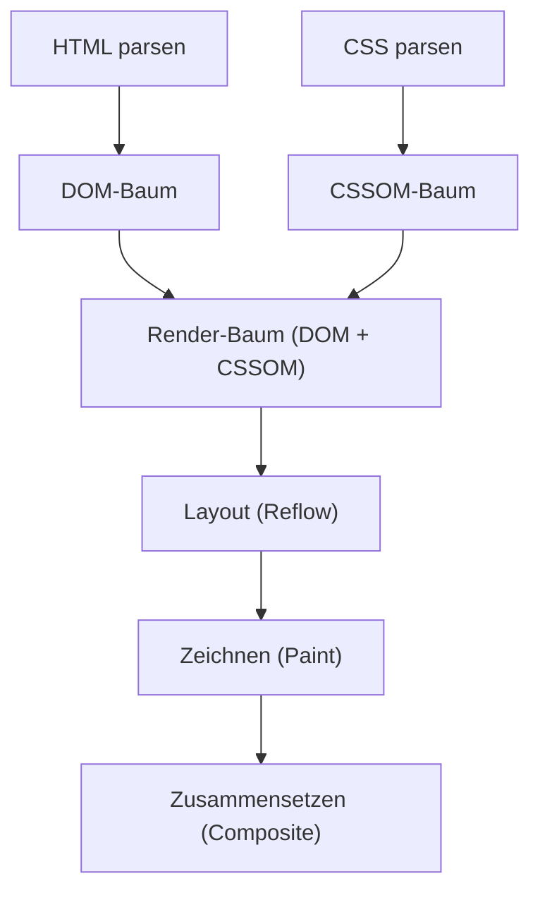

# Web Vitals und Frontend-Performance-Optimierung (Verbesserung von LCP, FID, CLS)

In der modernen Webentwicklung ist die Verbesserung der Benutzererfahrung (UX) ein entscheidender Faktor, der direkt mit dem geschäftlichen Erfolg zusammenhängt. Google hat die **Core Web Vitals** als Metriken eingeführt, um die Benutzererfahrung im Web zu quantifizieren und zu bewerten. In diesem Artikel werden wir im Hinblick auf die Frontend-Performance-Optimierung die detaillierten Messkriterien und spezifischen Verbesserungsmethoden für LCP, FID (und die Metrik der nächsten Generation INP) und CLS, aus denen diese Core Web Vitals bestehen, näher betrachten.

## 1. Browser-Rendering-Pipeline und Performance

Um die Frontend-Performance-Optimierung zu verstehen, müssen wir zunächst verstehen, wie der Browser HTML, CSS und JavaScript in Pixel auf dem Bildschirm umwandelt, d. h. die **Rendering-Pipeline**. Nachdem der Browser Ressourcen aus dem Netzwerk empfangen hat, durchläuft er die folgenden Schritte, um den Bildschirm zu zeichnen:



1. **Parse (Parsen)** : Wenn der Browser HTML empfängt, analysiert (parst) er es von oben nach unten und erstellt den DOM-Baum (Document Object Model). Gleichzeitig parst er CSS, um den CSSOM-Baum (CSS Object Model) zu erstellen.
2. **Style (Stilberechnung)** : Der DOM-Baum und der CSSOM-Baum werden kombiniert, um den Render-Baum zu erstellen, der berechnet, welche Stile auf welche Knoten angewendet werden.
3. **Layout (Layout / Reflow)** : Basierend auf dem Render-Baum wird berechnet, wo und in welcher Größe jedes Element auf dem Bildschirm platziert wird.
4. **Paint (Zeichnen)** : Basierend auf den Layoutinformationen werden visuelle Elemente wie Text, Farben, Bilder und Ränder als Pixel auf Ebenen (Layers) im Speicher gezeichnet.
5. **Composite (Zusammensetzen / Compositing)** : Mehrere Ebenen werden in der richtigen Reihenfolge übereinandergelegt und als endgültiger Bildschirm ausgegeben.

Performance-Optimierung bedeutet nichts anderes, als die Zeit für jeden Schritt dieser Pipeline zu verkürzen und eine Blockierung des Hauptthreads (Main Thread) zu verhindern. Insbesondere die Ausführung von JavaScript und umfangreiche CSS-Berechnungen sind die Hauptursachen für die Blockierung dieser Pipeline.

## 2. LCP (Largest Contentful Paint): Tiefes Verständnis und Verbesserungsmethoden

### Was ist LCP?

**LCP (Largest Contentful Paint)** ist eine Metrik zur Messung der Ladeleistung einer Seite. Konkret bezieht sie sich auf die Zeit vom Zugriff des Benutzers auf die Seite bis zum Rendern des größten Textblocks oder Bildelements im Viewport (dem sichtbaren Bereich des Bildschirms).

- **Gut (Good)** : Innerhalb von 2,5 Sekunden
- **Verbesserungsbedürftig (Needs Improvement)** : 2,5 Sekunden bis 4,0 Sekunden
- **Schlecht (Poor)** : Über 4,0 Sekunden

### Hauptursachen für die Verschlechterung von LCP

Die Ursachen für einen langsamen LCP lassen sich hauptsächlich in die folgenden vier Kategorien einteilen:

1. **Langsame Serverantwortzeit (Verzögerung bei TTFB)** 
2. **Renderblockierendes JavaScript und CSS** 
3. **Lange Ladezeiten für Ressourcen (Bilder, Web-Fonts usw.)** 
4. **Übermäßige Abhängigkeit vom Client-Side Rendering (CSR)** 

### Methoden zur LCP-Verbesserung

#### Vorladen von Ressourcen (`preload` / `prefetch`)

Um LCP-Elemente (z. B. ein Hero-Image oder den wichtigsten Web-Font) frühzeitig zu laden, verwenden wir `<link rel="preload">`. Dadurch kann der Download gestartet werden, bevor der Parser des Browsers die Ressource entdeckt.

```html
<!-- Vorladen des Hero-Images -->
<link rel="preload" href="/images/hero-image.webp" as="image" />

<!-- Vorladen des Web-Fonts -->
<link rel="preload" href="/fonts/custom-font.woff2" as="font" type="font/woff2" crossorigin />

<!-- Frühzeitige Verbindung zu externen Domains (CDN usw.) -->
<link rel="preconnect" href="https://fonts.gstatic.com" crossorigin />
```

#### Beseitigung renderblockierender Ressourcen

CSS ist standardmäßig eine renderblockierende Ressource. Der Browser zeichnet den Bildschirm erst, wenn das CSSOM erstellt ist. Indem Sie kritisches CSS (Critical CSS, das für den First View erforderlich ist) inline einbinden und anderes CSS asynchron laden, können Sie den LCP verbessern.

```html
<!-- Asynchrones Laden von nicht-kritischem CSS -->
<link rel="stylesheet" href="non-critical.css" media="print" onload="this.media='all'" />
```

#### Bildoptimierung

Da Bilder oft LCP-Elemente sind, ist eine gründliche Optimierung erforderlich.

- **Verwendung von Formaten der nächsten Generation** : Verwenden Sie Formate mit hoher Kompressionsrate wie WebP oder AVIF.
- **Bereitstellung in geeigneter Größe** : Verwenden Sie das Attribut `srcset`, um Bilder in einer Größe bereitzustellen, die der Bildschirmbreite des Geräts entspricht.

```html
<picture>
  <source srcset="hero-large.avif" media="(min-width: 1024px)" type="image/avif" />
  <source srcset="hero-small.avif" media="(max-width: 1023px)" type="image/avif" />
  
</picture>
```

Beachten Sie, dass Sie `loading="lazy"` (verzögertes Laden) nicht auf Bilder anwenden dürfen, die LCP-Elemente sind. Dies würde das Timing des LCP verzögern. Indem Sie dem LCP-Element explizit `fetchpriority="high"` hinzufügen, können Sie dessen Priorität erhöhen.

## 3. FID (First Input Delay) und INP (Interaction to Next Paint)

### Unterschied zwischen FID und INP

**FID (First Input Delay)** misst die Verzögerungszeit von der ersten Interaktion des Benutzers mit der Seite (z. B. Klicken oder Tippen) bis zu dem Zeitpunkt, an dem der Browser beginnt, auf diese Interaktion zu reagieren und Event-Handler zu verarbeiten.

- **Gut (Good)** : Innerhalb von 100 Millisekunden

FID zielt jedoch nur auf die „erste Eingabe“ ab und misst nur die Zeit „bis zum Beginn der Ausführung des Event-Handlers“. Als neue Metrik, die dies ersetzt, wurde **INP (Interaction to Next Paint)** eingeführt. INP überwacht die Latenz aller Benutzerinteraktionen, die während des gesamten Lebenszyklus der Seite auftreten, und bewertet die gesamte Verzögerung vom Auftreten des Ereignisses bis zum nächsten Zeichnen (Paint).

- **Gut (Good)** : Innerhalb von 200 Millisekunden

### Hauptursachen für die Verschlechterung von FID/INP

Die größte Ursache sind **Long Tasks (zeitaufwändige Aufgaben), die den Hauptthread belegen**. Wenn Aufgaben vorhanden sind, deren Parsen, Kompilieren und Ausführen von JavaScript mehr als 50 Millisekunden dauert, kann der Browser nicht sofort auf Benutzereingaben reagieren.

### Methoden zur Verbesserung von FID/INP

#### Asynchrones Laden von Skripten (`async` / `defer`)

Verwenden Sie die Attribute `async` oder `defer`, damit das Laden von JavaScript das Parsen von HTML nicht blockiert.

```mermaid
gantt
    title "Strategien zum Laden von Skripten"
    dateFormat  s
    axisFormat  %S
    
    section "Normales <script>"
    "HTML parsen"           :a1, 0, 2s
    "Skript herunterladen"   :a2, after a1, 2s
    "Skript ausführen"      :a3, after a2, 2s
    "HTML parsen (fortgesetzt)" :a4, after a3, 2s
    
    section "<script async>"
    "HTML parsen"           :b1, 0, 4s
    "Skript herunterladen"   :b2, 0, 2s
    "Skript ausführen"      :b3, after b2, 2s
    "HTML parsen (fortgesetzt)" :b4, after b3, 2s
    
    section "<script defer>"
    "HTML parsen"           :c1, 0, 6s
    "Skript herunterladen"   :c2, 0, 2s
    "Skript ausführen"      :c3, after c1, 2s
```



- `async` : Sobald der Download abgeschlossen ist, wird das HTML-Parsen unterbrochen und das Skript sofort ausgeführt. Geeignet für Skripte von Drittanbietern ohne Abhängigkeiten (wie Analytics).
- `defer` : Wird im Hintergrund heruntergeladen und ausgeführt, nachdem das HTML-Parsen abgeschlossen ist. Geeignet für Skripte, die vom DOM abhängen.

#### Code Splitting (Code-Aufteilung)

Wenn eine gebündelte, riesige JavaScript-Datei auf einmal geladen wird, ist der Hauptthread lange blockiert. Durch **Code Splitting** wird sichergestellt, dass nur der benötigte Code zur benötigten Zeit geladen wird. Hier ist ein Beispiel für Code Splitting auf Komponentenebene in React.

```javascript
import React, { Suspense, lazy } from 'react';

// HeavyComponent wird beim anfänglichen Laden nicht geladen, sondern asynchron abgerufen, wenn das Rendern erforderlich wird
const HeavyComponent = lazy(() => import('./components/HeavyComponent'));

function App() {
  return (
    <div>
      <h1>Frontend-Performance-Optimierung</h1>
      {/* Stellt eine Fallback-UI bereit, bis die Komponente geladen ist */}
      <Suspense fallback={<div>Komponente wird geladen...</div>}>
        <HeavyComponent />
      </Suspense>
    </div>
  );
}

export default App;
```

#### Freigabe des Hauptthreads (Web Workers und Scheduling)

Lagern Sie rechenintensive Prozesse mithilfe von **Web Workers** an einen Hintergrundthread aus oder verwenden Sie `requestIdleCallback` oder `setTimeout`, um Aufgaben in kleinere Teile zu zerlegen und freie Zeit im Hauptthread zu schaffen (Yielding to the main thread).

## 4. CLS (Cumulative Layout Shift): Tiefes Verständnis und Verbesserungsmethoden

### Was ist CLS?

**CLS (Cumulative Layout Shift)** ist eine Metrik zur Messung der visuellen Stabilität einer Seite. Sie bewertet, wie oft beim Laden der Seite unerwartete Layoutverschiebungen (das Phänomen, dass Inhalte plötzlich verschoben werden) auftreten.

- **Gut (Good)** : 0,1 oder weniger
- **Verbesserungsbedürftig (Needs Improvement)** : 0,1 bis 0,25
- **Schlecht (Poor)** : Über 0,25

### Hauptursachen für die Verschlechterung von CLS und Verbesserungsmethoden

#### Keine Größenangabe bei Bildern oder Iframes

Der Browser kann das Seitenverhältnis oder die Größe eines Bildes erst erkennen, wenn es heruntergeladen wurde. Daher wird genau in dem Moment Platz reserviert, in dem das Laden des Bildes abgeschlossen ist, wodurch der umgebende Text nach unten gedrückt wird.

**Lösung**: Geben Sie immer die Attribute `width` und `height` an. Dadurch kann der Browser das Seitenverhältnis vor dem Herunterladen des Bildes berechnen und im Voraus Platz für das Layout (Platzhalter) reservieren.

```html
<!-- Gut: Größe angeben und dem Browser das Seitenverhältnis mitteilen -->

```

Wenn Sie Bilder mit CSS responsiv machen möchten, ist es auch effektiv, die Eigenschaft `aspect-ratio` zu verwenden.

```css
.responsive-image {
  width: 100%;
  height: auto;
  aspect-ratio: 16 / 9;
}
```

Darüber hinaus trägt die Angabe von `loading="lazy"` für Bilder, die nicht im First View erscheinen (wie im obigen Codebeispiel), zur Einsparung von Netzwerkbandbreite und zur Verbesserung der anfänglichen Ladeleistung bei.

#### Dynamisch eingefügte Inhalte (Werbung oder Einbettungen)

Werbebanner oder Benachrichtigungsleisten, die später per JavaScript in das DOM eingefügt werden, sind eine Hauptursache für Layoutverschiebungen.

**Lösung**: Reservieren Sie im Voraus eine Mindesthöhe ( `min-height` ) mit CSS für die Container-Elemente, in die diese dynamischen Inhalte eingefügt werden.

```css
.ad-container {
  min-height: 250px;
  display: flex;
  justify-content: center;
  align-items: center;
}
```

#### FOIT/FOUT durch Web-Fonts

Das Phänomen, dass Text unsichtbar wird, bis der Web-Font geladen ist, wird als **FOIT (Flash of Invisible Text)** bezeichnet. Das Phänomen, dass sich Breite oder Höhe des Textes in dem Moment ändern, in dem die Schriftart umgeschaltet wird, und sich das Layout verschiebt, wird als **FOUT (Flash of Unstyled Text)** bezeichnet.

**Lösung**: Geben Sie `font-display: swap;` in `@font-face` an. Dadurch wird der Text sofort mit einer Fallback-Schriftart angezeigt, ohne auf das Laden der Schriftart zu warten, und ersetzt, sobald das Laden abgeschlossen ist.

```css
@font-face {
  font-family: 'CustomFont';
  src: url('/fonts/custom-font.woff2') format('woff2');
  font-display: swap;
}
```

Als fortgeschrittenere Maßnahme gibt es auch Techniken, die CSS-Eigenschaften wie `size-adjust` und `ascent-override` verwenden, um die Metriken (Zeilenhöhe und Zeichenbreite) der Fallback-Schriftart so weit wie möglich an den Web-Font anzupassen und so Layoutverschiebungen beim Wechseln der Schriftarten zu minimieren.

## 5. Zusammenfassung

Die Metriken der Core Web Vitals ( **LCP** , **FID/INP** , **CLS** ) bewerten die Benutzererfahrung jeweils aus unterschiedlichen Perspektiven.

- Um den **LCP** zu verbessern, sind die Optimierung des kritischen Rendering-Pfads (Critical Path) und das frühzeitige Laden von Ressourcen (Bilder und Schriftarten) der Schlüssel.
- Um **FID/INP** zu verbessern, ist es notwendig, die Ausführung von übermäßigem JavaScript zu verhindern, das den Hauptthread blockiert, und Code Splitting sowie die Aufteilung von Aufgaben durchzuführen.
- Um den **CLS** zu verbessern, ist es wichtig, die visuelle Stabilität aufrechtzuerhalten, indem Sie im Voraus Platz für Bilder und eingebettete Elemente reservieren und eine geeignete Strategie für das Laden von Schriftarten festlegen.

Indem Sie die **Rendering-Pipeline** des Browsers tiefgreifend verstehen und die zugrunde liegenden Ursachen für die Verschlechterung jeder Metrik identifizieren, können Sie eine effektive und nachhaltige Performance-Optimierung erreichen. Integrieren Sie diese Best Practices von Beginn des Projekts an, um eine Benutzererfahrung auf höchstem Niveau zu bieten.
