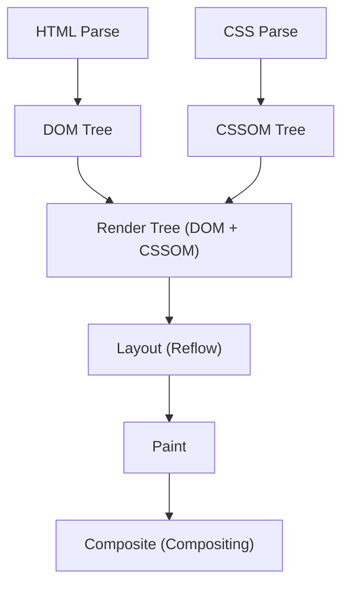

# Web Vitals and Frontend Performance Optimization (Improving LCP, FID, CLS)

In modern web development, improving the user experience (UX) is a critical factor directly tied to business success. Google has proposed **Core Web Vitals** as metrics to quantify and evaluate the user experience on the web. In this article, we will delve into the detailed measurement criteria for LCP, FID (and the next-generation metric, INP), and CLS—which make up these Core Web Vitals—and specific improvement methods from the perspective of frontend performance optimization.

## 1. Browser Rendering Pipeline and Performance

To understand frontend performance optimization, we must first understand how a browser converts HTML, CSS, and JavaScript into pixels on the screen, which is known as the **rendering pipeline**. After receiving resources from the network, the browser renders the screen through the following steps:



1. **Parse**: When the browser receives HTML, it parses it from top to bottom and builds the DOM (Document Object Model) tree. Simultaneously, it parses CSS and builds the CSSOM (CSS Object Model) tree.
2. **Style**: It combines the DOM tree and the CSSOM tree to generate a render tree, calculating which styles apply to which nodes.
3. **Layout (Reflow)**: Based on the render tree, it calculates where and how large each element will be positioned on the screen.
4. **Paint**: Based on the layout information, it draws visual elements such as text, colors, images, and borders as pixels onto layers in memory.
5. **Composite (Compositing)**: It overlays multiple layers in the correct order and outputs the final screen.

Performance optimization is nothing other than reducing the time taken for each step in this pipeline and preventing the blocking of the main thread. In particular, JavaScript execution and heavy CSS calculations are major factors that block this pipeline.

## 2. Deep Understanding and Improvement Methods for LCP (Largest Contentful Paint)

### What is LCP?

**LCP (Largest Contentful Paint)** is a metric that measures page loading performance. Specifically, it refers to the time from when a user accesses a page until the largest text block or image element within the viewport (the display area of the screen) is rendered.

- **Good**: 2.5 seconds or less
- **Needs Improvement**: Between 2.5 seconds and 4.0 seconds
- **Poor**: Over 4.0 seconds

### Main Causes of LCP Degradation

The causes of a slow LCP are mainly classified into the following four:

1. **Slow server response times (TTFB delays)**
2. **Render-blocking JavaScript and CSS**
3. **Long loading times for resources (such as images and web fonts)**
4. **Over-reliance on Client-Side Rendering (CSR)**

### LCP Improvement Methods

#### Preloading Resources (`preload` / `prefetch`)

To load LCP elements (e.g., hero images or main web fonts) early, we utilize `<link rel="preload">`. This allows the download to begin before the browser's parser discovers the resource.

```html
<!-- Preloading the hero image -->
<link rel="preload" href="/images/hero-image.webp" as="image" />

<!-- Preloading the web font -->
<link rel="preload" href="/fonts/custom-font.woff2" as="font" type="font/woff2" crossorigin />

<!-- Early connection to external domains (such as CDNs) -->
<link rel="preconnect" href="https://fonts.gstatic.com" crossorigin />
```

#### Eliminating Render-Blocking Resources

CSS is a render-blocking resource by default. The browser will not render the screen until the CSSOM is constructed. You can improve LCP by inlining critical CSS (the CSS required for the above-the-fold content) and loading the remaining CSS asynchronously.

```html
<!-- Asynchronous loading of non-critical CSS -->
<link rel="stylesheet" href="non-critical.css" media="print" onload="this.media='all'" />
```

#### Image Optimization

Since images often become LCP elements, thorough optimization is required.

- **Use next-generation formats**: Use formats with high compression rates, such as WebP and AVIF.
- **Deliver at appropriate sizes**: Use the `srcset` attribute to provide images sized appropriately for the device's screen width.

```html
<picture>
  <source srcset="hero-large.avif" media="(min-width: 1024px)" type="image/avif" />
  <source srcset="hero-small.avif" media="(max-width: 1023px)" type="image/avif" />
  
</picture>
```

Note that you should not apply `loading="lazy"` (lazy loading) to images that will be LCP elements, as this delays the LCP timing. You can increase the priority of LCP elements by explicitly assigning `fetchpriority="high"`.

## 3. FID (First Input Delay) and INP (Interaction to Next Paint)

### Difference Between FID and INP

**FID (First Input Delay)** measures the delay time from when a user first interacts with a page (such as a click or tap) to when the browser begins processing the event handlers in response to that interaction.

- **Good**: 100 milliseconds or less

However, FID only targets the "first input" and only measures the time "until the execution of event handlers begins." **INP (Interaction to Next Paint)** was introduced as a new metric to replace it. INP monitors the latency of all user interactions that occur throughout the entire lifecycle of a page, evaluating the overall delay from when an event occurs until the next paint takes place.

- **Good**: 200 milliseconds or less

### Main Causes of FID/INP Degradation

The biggest cause is **Long Tasks that monopolize the main thread**. If there is a task taking more than 50 milliseconds to parse, compile, or execute JavaScript, the browser cannot immediately respond to user input.

### FID/INP Improvement Methods

#### Asynchronous Loading of Scripts (`async` / `defer`)

Use the `async` or `defer` attributes so that JavaScript loading does not block HTML parsing.

```mermaid
gantt
    title "Script Loading Strategies"
    dateFormat  s
    axisFormat  %S
    
    section "Normal <script>"
    HTML Parsing           :a1, 0, 2s
    Script Download        :a2, after a1, 2s
    Script Execution       :a3, after a2, 2s
    HTML Parsing (Resumed) :a4, after a3, 2s
    
    section "<script async>"
    HTML Parsing           :b1, 0, 4s
    Script Download        :b2, 0, 2s
    Script Execution       :b3, after b2, 2s
    HTML Parsing (Resumed) :b4, after b3, 2s
    
    section "<script defer>"
    HTML Parsing           :c1, 0, 6s
    Script Download        :c2, 0, 2s
    Script Execution       :c3, after c1, 2s
```



- `async`: Once the download is complete, it interrupts HTML parsing and executes immediately. Suitable for third-party scripts without dependencies (e.g., analytics).
- `defer`: Downloaded in the background and executed after HTML parsing is complete. Suitable for scripts that depend on the DOM.

#### Code Splitting

Loading a massive, bundled JavaScript file all at once blocks the main thread for a long time. Implement **Code Splitting** to load only the necessary code at the required time. Below is an example of component-level code splitting in React.

```javascript
import React, { Suspense, lazy } from 'react';

// HeavyComponent is not loaded during initial load, but fetched asynchronously when rendering is needed
const HeavyComponent = lazy(() => import('./components/HeavyComponent'));

function App() {
  return (
    <div>
      <h1>Frontend Performance Optimization</h1>
      {/* Provides fallback UI until the component is loaded */}
      <Suspense fallback={<div>Loading component...</div>}>
        <HeavyComponent />
      </Suspense>
    </div>
  );
}

export default App;
```

#### Freeing Up the Main Thread (Web Workers and Scheduling)

Transfer heavy calculations to background threads using **Web Workers**, or finely divide tasks using `requestIdleCallback` or `setTimeout` to create idle time on the main thread (Yielding to the main thread).

## 4. Deep Understanding and Improvement Methods for CLS (Cumulative Layout Shift)

### What is CLS?

**CLS (Cumulative Layout Shift)** is a metric that measures the visual stability of a page. It scores how much unexpected layout shifting (the phenomenon where content jumps abruptly) occurs during the page loading process.

- **Good**: 0.1 or less
- **Needs Improvement**: Between 0.1 and 0.25
- **Poor**: Over 0.25

### Main Causes of CLS Degradation and Improvement Methods

#### Images and iframes Without Specified Dimensions

The browser cannot know the aspect ratio or size of an image until it is downloaded. Therefore, the moment the image finishes loading, space is reserved, pushing down the surrounding text.

**Countermeasure**: Always specify the `width` and `height` attributes. This allows the browser to calculate the aspect ratio before downloading the image and pre-allocate the space (placeholder) for the layout.

```html
<!-- Good: Specify dimensions and inform the browser of the aspect ratio -->

```

When making it responsive with CSS, utilizing the `aspect-ratio` property is also effective.

```css
.responsive-image {
  width: 100%;
  height: auto;
  aspect-ratio: 16 / 9;
}
```

Additionally, specifying `loading="lazy"` for images that are not in the above-the-fold content, as shown in the code example above, leads to network bandwidth savings and improved initial load performance.

#### Dynamically Inserted Content (Ads and Embeds)

Ad banners and notification bars inserted into the DOM later by JavaScript are major causes of layout shifts.

**Countermeasure**: Pre-reserve a minimum height (`min-height`) with CSS for the container elements where these dynamic contents will be placed.

```css
.ad-container {
  min-height: 250px;
  display: flex;
  justify-content: center;
  align-items: center;
}
```

#### FOIT/FOUT Caused by Web Fonts

The phenomenon where text becomes invisible while waiting for a web font to load is called **FOIT (Flash of Invisible Text)**, and the phenomenon where text width and height change the moment the font switches, causing layout shifts, is called **FOUT (Flash of Unstyled Text)**.

**Countermeasure**: Specify `font-display: swap;` in `@font-face`. This allows the text to be displayed in a fallback font without waiting for the web font to load, replacing it once the load is complete.

```css
@font-face {
  font-family: 'CustomFont';
  src: url('/fonts/custom-font.woff2') format('woff2');
  font-display: swap;
}
```

As a more advanced countermeasure, there are techniques utilizing CSS properties like `size-adjust` and `ascent-override` to match the metrics (line height and character width) of the fallback font and the web font as closely as possible, minimizing layout shifts upon font switching.

## 5. Conclusion

Each metric of Core Web Vitals (**LCP**, **FID/INP**, and **CLS**) evaluates the user experience from a different perspective.

- To improve **LCP**, optimizing the critical path and loading resources (images and fonts) early is key.
- To improve **FID/INP**, it is necessary to prevent excessive JavaScript execution that blocks the main thread, and to perform Code Splitting and task division.
- To improve **CLS**, it is crucial to maintain visual stability by pre-allocating space for images and embedded elements, and by appropriately setting font loading strategies.

By deeply understanding the browser's **rendering pipeline** and identifying the root causes of the degradation of each metric, you can achieve effective and sustainable performance optimization. Let's build these best practices in from the early stages of a project and provide the highest level of user experience.
