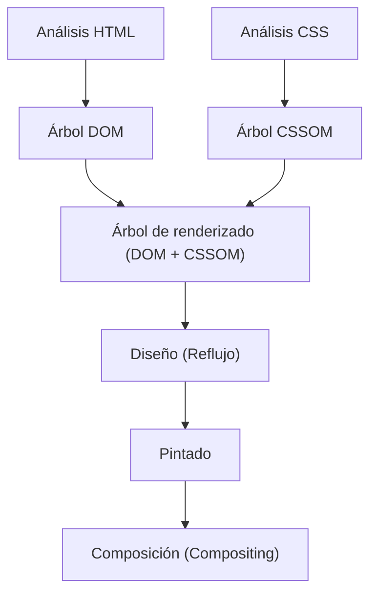

# Web Vitals y optimización del rendimiento frontend (mejora de LCP, FID, CLS)

En el desarrollo web reciente, la mejora de la experiencia del usuario (UX) se ha convertido en un elemento crucial que está directamente ligado al éxito empresarial. Google ha propuesto **Core Web Vitals** como métricas para cuantificar y evaluar la experiencia del usuario en la web. En este artículo, desde la perspectiva de la optimización del rendimiento frontend, profundizaremos en los criterios de medición detallados y los métodos de mejora específicos de LCP, FID (y la métrica de próxima generación INP) y CLS que componen estos Core Web Vitals.

## 1. Pipeline de renderizado del navegador y rendimiento

Para comprender la optimización del rendimiento frontend, primero debemos entender cómo el navegador convierte HTML, CSS y JavaScript en píxeles en la pantalla, es decir, el **pipeline de renderizado** . Tras recibir recursos de la red, el navegador dibuja la pantalla pasando por los siguientes pasos.



1. **Parse (Análisis)** : Cuando el navegador recibe el HTML, lo analiza de arriba a abajo y construye el árbol DOM (Document Object Model). Simultáneamente, analiza el CSS y construye el árbol CSSOM (CSS Object Model).
2. **Style (Cálculo de estilos)** : Combina el árbol DOM y el árbol CSSOM para generar un árbol de renderizado que calcula qué estilos se aplican a cada nodo.
3. **Layout (Diseño / Reflujo)** : Basándose en el árbol de renderizado, calcula dónde y qué tamaño tendrá cada elemento en la pantalla.
4. **Paint (Pintado)** : A partir de la información de diseño, dibuja elementos visuales como texto, colores, imágenes y bordes como píxeles en capas en la memoria.
5. **Composite (Composición)** : Superpone múltiples capas en el orden correcto y las genera como la pantalla final.

La optimización del rendimiento no es más que reducir el tiempo que lleva cada paso de este pipeline y evitar el bloqueo del hilo principal. En particular, la ejecución de JavaScript y los cálculos de CSS pesados son las principales causas de bloqueo de este pipeline.

## 2. Comprensión profunda de LCP (Largest Contentful Paint) y métodos de mejora

### ¿Qué es LCP?

**LCP (Largest Contentful Paint)** es una métrica que mide el rendimiento de carga de una página. Específicamente, se refiere al tiempo desde que el usuario accede a la página hasta que se renderiza el bloque de texto o elemento de imagen más grande dentro de la ventana gráfica (área de visualización de la pantalla).

- **Bueno (Good)** : Dentro de 2.5 segundos
- **Necesita mejora (Needs Improvement)** : 2.5 segundos a 4.0 segundos
- **Pobre (Poor)** : Más de 4.0 segundos

### Principales causas del deterioro de LCP

Las causas por las que LCP se ralentiza se clasifican principalmente en las siguientes cuatro.

1. **Tiempo de respuesta del servidor lento (retraso de TTFB)** 
2. **JavaScript y CSS que bloquean el renderizado** 
3. **Tiempos de carga prolongados para recursos (como imágenes y fuentes web)** 
4. **Dependencia excesiva del renderizado del lado del cliente (CSR)** 

### Métodos de mejora de LCP

#### Precarga de recursos (`preload` / `prefetch`)

Para cargar elementos LCP (por ejemplo, una imagen hero o la fuente web principal) anticipadamente, se utiliza `<link rel="preload">` . Esto permite que la descarga comience antes de que el analizador del navegador descubra el recurso.

```html
<!-- Precarga de la imagen hero -->
<link rel="preload" href="/images/hero-image.webp" as="image" />

<!-- Precarga de fuentes web -->
<link rel="preload" href="/fonts/custom-font.woff2" as="font" type="font/woff2" crossorigin />

<!-- Conexión temprana a dominios externos (CDN, etc.) -->
<link rel="preconnect" href="https://fonts.gstatic.com" crossorigin />
```

#### Eliminación de recursos que bloquean el renderizado

CSS es, por defecto, un recurso que bloquea el renderizado. Hasta que no se construye el CSSOM, el navegador no dibuja la pantalla. Al incorporar CSS crítico (CSS necesario para la vista principal) y cargar de forma asíncrona el resto del CSS, se puede mejorar LCP.

```html
<!-- Carga asíncrona de CSS no crítico -->
<link rel="stylesheet" href="non-critical.css" media="print" onload="this.media='all'" />
```

#### Optimización de imágenes

Dado que las imágenes a menudo se convierten en elementos LCP, se requiere una optimización exhaustiva.

- **Uso de formatos de próxima generación** : Use formatos que ofrezcan altas tasas de compresión, como WebP y AVIF.
- **Entrega en el tamaño apropiado** : Use el atributo `srcset` para proporcionar imágenes en tamaños adaptados al ancho de la pantalla del dispositivo.

```html
<picture>
  <source srcset="hero-large.avif" media="(min-width: 1024px)" type="image/avif" />
  <source srcset="hero-small.avif" media="(max-width: 1023px)" type="image/avif" />
  
</picture>
```

Tenga en cuenta que no se debe aplicar `loading="lazy"` (carga diferida) a las imágenes que actúan como elementos LCP, ya que retrasaría el momento de LCP. Se puede aumentar la prioridad asignando explícitamente `fetchpriority="high"` al elemento LCP.

## 3. FID (First Input Delay) e INP (Interaction to Next Paint)

### Diferencia entre FID e INP

**FID (First Input Delay)** mide el tiempo de retraso desde que un usuario interactúa por primera vez con una página (como un clic o un toque) hasta que el navegador comienza a procesar los manejadores de eventos en respuesta a esa interacción.

- **Bueno (Good)** : Dentro de 100 milisegundos

Sin embargo, FID solo se enfoca en la "primera entrada" y mide solo el tiempo "hasta que comienza la ejecución del manejador de eventos". Como una nueva métrica introducida para reemplazarla, tenemos **INP (Interaction to Next Paint)** . INP monitorea la latencia de todas las interacciones de los usuarios a lo largo del ciclo de vida de la página entera y evalúa el retraso total desde que ocurre un evento hasta que se lleva a cabo el siguiente pintado (Paint).

- **Bueno (Good)** : Dentro de 200 milisegundos

### Principales causas del deterioro de FID/INP

La causa más importante son las **Long Tasks (tareas prolongadas) que ocupan el hilo principal** . Si existe una tarea que toma 50 milisegundos o más para analizar, compilar y ejecutar JavaScript, el navegador no podrá responder inmediatamente a las entradas del usuario.

### Métodos de mejora de FID/INP

#### Carga asíncrona de scripts (`async` / `defer`)

Use los atributos `async` o `defer` para evitar que la carga de JavaScript bloquee el análisis del HTML.

```mermaid
gantt
    title "Estrategias de carga de scripts"
    dateFormat  s
    axisFormat  %S
    
    section "<script> Normal"
    "Análisis HTML"           :a1, 0, 2s
    "Descarga de script"        :a2, after a1, 2s
    "Ejecución de script"       :a3, after a2, 2s
    "Análisis HTML (Reanudado)" :a4, after a3, 2s
    
    section "<script async>"
    "Análisis HTML"           :b1, 0, 4s
    "Descarga de script"        :b2, 0, 2s
    "Ejecución de script"       :b3, after b2, 2s
    "Análisis HTML (Reanudado)" :b4, after b3, 2s
    
    section "<script defer>"
    "Análisis HTML"           :c1, 0, 6s
    "Descarga de script"        :c2, 0, 2s
    "Ejecución de script"       :c3, after c1, 2s
```



- `async` : Interrumpe el análisis HTML y se ejecuta de inmediato tan pronto como se completa la descarga. Adecuado para scripts de terceros sin dependencias (como análisis).
- `defer` : Se descarga en segundo plano y se ejecuta después de que se completa el análisis del HTML. Adecuado para scripts que dependen del DOM.

#### Code Splitting (División de código)

Si un archivo JavaScript empaquetado masivo se carga todo a la vez, bloqueará el hilo principal durante mucho tiempo. Realice el **Code Splitting** para cargar solo el código necesario en el momento en que se requiere. A continuación se muestra un ejemplo de división de código a nivel de componente en React.

```javascript
import React, { Suspense, lazy } from 'react';

// HeavyComponent no se carga durante la carga inicial, sino que se obtiene asincrónicamente cuando se necesita renderizar
const HeavyComponent = lazy(() => import('./components/HeavyComponent'));

function App() {
  return (
    <div>
      <h1>Optimización del rendimiento frontend</h1>
      {/* Proporciona una interfaz de usuario alternativa hasta que el componente se cargue */}
      <Suspense fallback={<div>Cargando componente...</div>}>
        <HeavyComponent />
      </Suspense>
    </div>
  );
}

export default App;
```

#### Liberación del hilo principal (Web Workers y programación)

El procesamiento de cálculos pesados puede delegarse a hilos en segundo plano utilizando **Web Workers** , o utilizando `requestIdleCallback` o `setTimeout` para dividir las tareas en partes pequeñas y crear tiempo de inactividad en el hilo principal (Yielding to the main thread).

## 4. Comprensión profunda de CLS (Cumulative Layout Shift) y métodos de mejora

### ¿Qué es CLS?

**CLS (Cumulative Layout Shift)** es una métrica que evalúa la estabilidad visual de una página. Cuantifica cuánto cambio de diseño inesperado (el fenómeno donde el contenido se mueve repentinamente) ocurre durante el proceso de carga de la página.

- **Bueno (Good)** : 0.1 o menos
- **Necesita mejora (Needs Improvement)** : 0.1 a 0.25
- **Pobre (Poor)** : Más de 0.25

### Principales causas del deterioro de CLS y métodos de mejora

#### No se han especificado tamaños para imágenes e iframes

El navegador no puede conocer su relación de aspecto o tamaño hasta que se descarga la imagen. Por lo tanto, se reserva el espacio en el momento en que se completa la carga de la imagen, empujando el texto circundante hacia abajo.

**Solución**: Siempre especifique los atributos `width` y `height` . Esto permite que el navegador calcule la relación de aspecto antes de descargar la imagen y reserve previamente el espacio de diseño (marcador de posición).

```html
<!-- Bien: Especificar el tamaño y decirle al navegador la relación de aspecto -->

```

Cuando se hace responsivo con CSS, también es efectivo usar la propiedad `aspect-ratio` .

```css
.responsive-image {
  width: 100%;
  height: auto;
  aspect-ratio: 16 / 9;
}
```

Además, para imágenes que no ingresan a la vista principal, especificar `loading="lazy"` como en el ejemplo de código anterior ayudará a ahorrar ancho de banda de red y mejorar el rendimiento de la carga inicial.

#### Contenido insertado dinámicamente (anuncios e incrustaciones)

Los banners publicitarios y las barras de notificaciones que se insertan en el DOM posteriormente mediante JavaScript son las principales causas de los cambios de diseño.

**Solución**: Reserve previamente una altura mínima ( `min-height` ) con CSS para los elementos contenedores donde irán estos contenidos dinámicos.

```css
.ad-container {
  min-height: 250px;
  display: flex;
  justify-content: center;
  align-items: center;
}
```

#### FOIT/FOUT por fuentes web

El fenómeno en el que el texto se vuelve invisible hasta que se carga la fuente web se llama **FOIT (Flash of Invisible Text)** , y el fenómeno en el que el ancho o la altura del texto cambia en el momento en que la fuente cambia, provocando un cambio de diseño, se llama **FOUT (Flash of Unstyled Text)** .

**Solución**: Especifique `font-display: swap;` en `@font-face` . Esto permite mostrar texto usando una fuente alternativa sin esperar a que se cargue la fuente, y reemplazarla una vez que se complete la carga.

```css
@font-face {
  font-family: 'CustomFont';
  src: url('/fonts/custom-font.woff2') format('woff2');
  font-display: swap;
}
```

Como una contramedida aún más avanzada, existen técnicas para usar `size-adjust` o `ascent-override` de CSS para hacer coincidir las métricas (altura de línea y ancho de caracteres) de la fuente alternativa y la fuente web tanto como sea posible, y minimizar el cambio de diseño al cambiar la fuente.

## 5. Resumen

Cada métrica de Core Web Vitals ( **LCP** , **FID/INP** , **CLS** ) evalúa la experiencia del usuario desde una perspectiva diferente.

- Para mejorar **LCP** , optimizar la ruta crítica y cargar tempranamente los recursos (imágenes y fuentes) son las claves.
- Para mejorar **FID/INP** , es necesario evitar la ejecución excesiva de JavaScript que bloquea el hilo principal y realizar la división de código o la división de tareas.
- Para mejorar **CLS** , es importante mantener la estabilidad visual reservando espacio para imágenes y elementos incrustados con anticipación y estableciendo estrategias de carga de fuentes adecuadamente.

Al comprender profundamente el **pipeline de renderizado** del navegador e identificar las causas fundamentales del deterioro en cada métrica, puede lograr una optimización de rendimiento efectiva y sostenible. Incorpore estas mejores prácticas desde las primeras etapas del proyecto para brindar la mejor experiencia de usuario posible.
