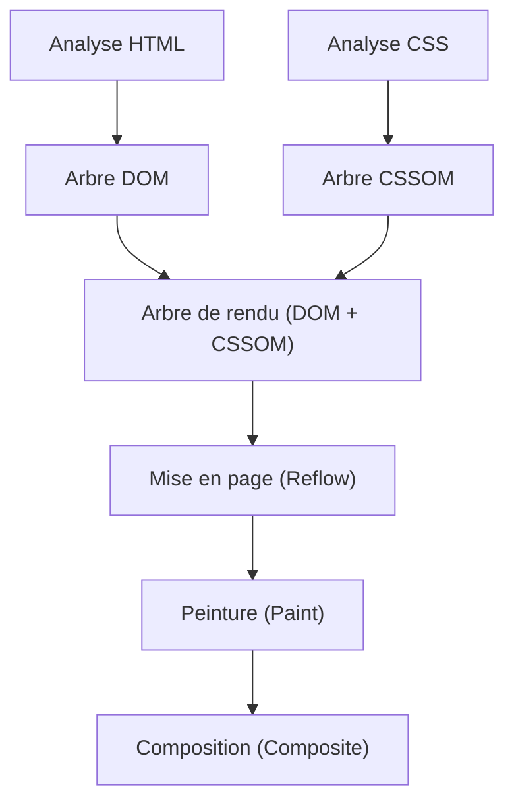

# Web Vitals et optimisation des performances front-end (amélioration de LCP, FID, CLS)

Dans le développement Web récent, l'amélioration de l'expérience utilisateur (UX) est devenue un élément crucial directement lié au succès commercial. Google a proposé les **Core Web Vitals** comme indicateurs pour quantifier et évaluer l'expérience utilisateur sur le Web. Dans cet article, du point de vue de l'optimisation des performances front-end, nous allons examiner en détail les critères de mesure de LCP, FID (et l'indicateur de nouvelle génération INP) et CLS qui composent ces Core Web Vitals, ainsi que les méthodes spécifiques pour les améliorer.

## 1. Pipeline de rendu du navigateur et performances

Pour comprendre l'optimisation des performances front-end, il faut d'abord comprendre comment le navigateur convertit HTML, CSS et JavaScript en pixels sur l'écran, c'est-à-dire le **pipeline de rendu**. Après avoir reçu les ressources du réseau, le navigateur dessine l'écran en passant par les étapes suivantes.



1. **Parse (Analyse)** : À la réception du HTML, le navigateur l'analyse (parse) de haut en bas et construit l'arbre DOM (Document Object Model). Simultanément, il analyse le CSS pour construire l'arbre CSSOM (CSS Object Model).
2. **Style (Calcul des styles)** : Il combine l'arbre DOM et l'arbre CSSOM, et génère un arbre de rendu calculant quel style est appliqué à quel nœud.
3. **Layout (Mise en page / Reflow)** : À partir de l'arbre de rendu, il calcule où et à quelle taille chaque élément sera placé sur l'écran.
4. **Paint (Peinture)** : Sur la base des informations de mise en page, il dessine les éléments visuels (texte, couleurs, images, bordures, etc.) sous forme de pixels dans une couche en mémoire.
5. **Composite (Composition)** : Il superpose plusieurs couches dans le bon ordre et génère l'écran final.

L'optimisation des performances n'est rien d'autre que la réduction du temps nécessaire à chaque étape de ce pipeline et la prévention du blocage du thread principal (main thread). En particulier, l'exécution de JavaScript ou les calculs CSS lourds sont les principaux facteurs bloquant ce pipeline.

## 2. Compréhension approfondie et méthodes d'amélioration du LCP (Largest Contentful Paint)

### Qu'est-ce que le LCP ?

Le **LCP (Largest Contentful Paint)** est un indicateur mesurant les performances de chargement d'une page. Plus précisément, il désigne le temps écoulé entre le moment où l'utilisateur accède à la page et le moment où le plus grand bloc de texte ou élément d'image est rendu dans le viewport (la zone d'affichage de l'écran).

- **Bon (Good)** : Moins de 2,5 secondes
- **Besoin d'amélioration (Needs Improvement)** : 2,5 à 4,0 secondes
- **Médiocre (Poor)** : Plus de 4,0 secondes

### Principales causes de dégradation du LCP

Les causes du ralentissement du LCP se divisent principalement en quatre catégories :

1. **Temps de réponse lent du serveur (retard TTFB)**
2. **JavaScript et CSS bloquant le rendu**
3. **Long temps de chargement des ressources (images, polices Web, etc.)**
4. **Dépendance excessive au rendu côté client (CSR)**

### Méthodes d'amélioration du LCP

#### Préchargement des ressources (`preload` / `prefetch`)

Pour charger rapidement les éléments LCP (par exemple, l'image principale ou la police Web principale), on utilise `<link rel="preload">`. Cela permet de commencer le téléchargement avant que l'analyseur du navigateur ne découvre la ressource.

```html
<!-- Préchargement de l'image principale (hero image) -->
<link rel="preload" href="/images/hero-image.webp" as="image" />

<!-- Préchargement de la police Web -->
<link rel="preload" href="/fonts/custom-font.woff2" as="font" type="font/woff2" crossorigin />

<!-- Connexion anticipée à des domaines externes (CDN, etc.) -->
<link rel="preconnect" href="https://fonts.gstatic.com" crossorigin />
```

#### Élimination des ressources bloquant le rendu

Par défaut, le CSS est une ressource bloquant le rendu. Le navigateur ne dessine pas l'écran tant que le CSSOM n'est pas construit. Vous pouvez améliorer le LCP en incorporant (inline) le CSS critique (nécessaire pour la vue initiale) et en chargeant le reste du CSS de manière asynchrone.

```html
<!-- Chargement asynchrone du CSS non critique -->
<link rel="stylesheet" href="non-critical.css" media="print" onload="this.media='all'" />
```

#### Optimisation des images

Les images devenant souvent des éléments LCP, une optimisation approfondie est nécessaire.

- **Utilisation de formats de nouvelle génération** : Utilisez des formats offrant un taux de compression élevé, tels que WebP ou AVIF.
- **Diffusion dans une taille appropriée** : Utilisez l'attribut `srcset` pour fournir des images adaptées à la largeur de l'écran de l'appareil.

```html
<picture>
  <source srcset="hero-large.avif" media="(min-width: 1024px)" type="image/avif" />
  <source srcset="hero-small.avif" media="(max-width: 1023px)" type="image/avif" />
  
</picture>
```

Notez qu'il ne faut pas appliquer `loading="lazy"` (chargement différé) aux images qui seront des éléments LCP, car cela retarderait le timing du LCP. Vous pouvez augmenter la priorité de l'élément LCP en ajoutant explicitement `fetchpriority="high"`.

## 3. FID (First Input Delay) et INP (Interaction to Next Paint)

### Différence entre FID et INP

Le **FID (First Input Delay)** mesure le délai entre le moment où l'utilisateur interagit pour la première fois avec la page (clic, tap, etc.) et le moment où le navigateur commence à traiter les gestionnaires d'événements en réponse à cette interaction.

- **Bon (Good)** : Moins de 100 millisecondes

Cependant, le FID ne cible que la "première entrée" et ne mesure que le temps jusqu'au "début de l'exécution du gestionnaire d'événements". L'**INP (Interaction to Next Paint)** a été introduit comme un nouvel indicateur pour le remplacer. L'INP surveille la latence de toutes les interactions utilisateur se produisant tout au long du cycle de vie de la page entière, et évalue le délai total entre l'événement et la peinture (Paint) suivante.

- **Bon (Good)** : Moins de 200 millisecondes

### Principales causes de dégradation de FID/INP

La cause principale réside dans les **Long Tasks (tâches longues) qui occupent le thread principal**. S'il existe des tâches dont l'analyse, la compilation et l'exécution JavaScript prennent plus de 50 millisecondes, le navigateur ne peut pas répondre immédiatement aux entrées de l'utilisateur.

### Méthodes d'amélioration de FID/INP

#### Chargement asynchrone des scripts (`async` / `defer`)

Afin d'éviter que le chargement du JavaScript ne bloque l'analyse du HTML, utilisez les attributs `async` ou `defer`.

```mermaid
gantt
    title "Stratégies de chargement de script"
    dateFormat  s
    axisFormat  %S
    
    section "Normal <script>"
    Analyse HTML           :a1, 0, 2s
    Téléchargement du script        :a2, after a1, 2s
    Exécution du script       :a3, after a2, 2s
    Analyse HTML (Reprise) :a4, after a3, 2s
    
    section "<script async>"
    Analyse HTML           :b1, 0, 4s
    Téléchargement du script        :b2, 0, 2s
    Exécution du script       :b3, after b2, 2s
    Analyse HTML (Reprise) :b4, after b3, 2s
    
    section "<script defer>"
    Analyse HTML           :c1, 0, 6s
    Téléchargement du script        :c2, 0, 2s
    Exécution du script       :c3, after c1, 2s
```



- `async` : Dès que le téléchargement est terminé, l'analyse HTML est interrompue et le script est immédiatement exécuté. Il convient aux scripts tiers sans dépendance (comme les outils d'analyse).
- `defer` : Il est téléchargé en arrière-plan et exécuté après l'achèvement de l'analyse HTML. Il convient aux scripts dépendant du DOM.

#### Code Splitting (Fractionnement de code)

Si vous chargez un énorme fichier JavaScript regroupé en une seule fois, le thread principal sera bloqué pendant une longue période. Effectuez le **Code Splitting** (fractionnement de code) pour charger uniquement le code nécessaire au moment voulu. Voici un exemple de fractionnement de code au niveau du composant dans React.

```javascript
import React, { Suspense, lazy } from 'react';

// HeavyComponent n'est pas chargé lors du chargement initial, il est récupéré de manière asynchrone au moment où le rendu est nécessaire
const HeavyComponent = lazy(() => import('./components/HeavyComponent'));

function App() {
  return (
    <div>
      <h1>Optimisation des performances front-end</h1>
      {/* Fournit une interface utilisateur de secours (fallback) en attendant le chargement du composant */}
      <Suspense fallback={<div>Chargement du composant...</div>}>
        <HeavyComponent />
      </Suspense>
    </div>
  );
}

export default App;
```

#### Libération du thread principal (Web Workers et planification)

Pour les calculs lourds, déléguez-les à un thread d'arrière-plan à l'aide des **Web Workers**, ou utilisez `requestIdleCallback` et `setTimeout` pour diviser finement les tâches et libérer du temps sur le thread principal (Yielding to the main thread).

## 4. Compréhension approfondie et méthodes d'amélioration du CLS (Cumulative Layout Shift)

### Qu'est-ce que le CLS ?

Le **CLS (Cumulative Layout Shift)** est un indicateur qui mesure la stabilité visuelle d'une page. Il évalue la fréquence à laquelle des décalages de mise en page inattendus (le phénomène où le contenu se déplace brusquement) se produisent pendant le chargement de la page.

- **Bon (Good)** : 0,1 ou moins
- **Besoin d'amélioration (Needs Improvement)** : 0,1 à 0,25
- **Médiocre (Poor)** : Plus de 0,25

### Principales causes de dégradation du CLS et méthodes d'amélioration

#### Tailles non spécifiées pour les images ou les iframes

Le navigateur ne peut pas connaître le ratio d'aspect ou la taille d'une image avant de l'avoir téléchargée. Par conséquent, l'espace est alloué au moment où le téléchargement de l'image est terminé, repoussant ainsi le texte environnant vers le bas.

**Solution** : Spécifiez toujours les attributs `width` et `height`. Ainsi, le navigateur calcule le ratio d'aspect avant le téléchargement de l'image et réserve à l'avance l'espace nécessaire pour la mise en page (espace réservé).

```html
<!-- Good: Spécifier la taille et indiquer le ratio d'aspect au navigateur -->

```

Si vous souhaitez rendre l'image réactive (responsive) avec CSS, il est également efficace d'utiliser la propriété `aspect-ratio`.

```css
.responsive-image {
  width: 100%;
  height: auto;
  aspect-ratio: 16 / 9;
}
```

De plus, pour les images qui n'apparaissent pas dans la vue initiale, la spécification de `loading="lazy"`, comme dans l'exemple de code ci-dessus, permet d'économiser la bande passante du réseau et d'améliorer les performances du chargement initial.

#### Contenu inséré dynamiquement (publicités et intégrations)

Les bannières publicitaires et les barres de notification insérées ultérieurement dans le DOM par JavaScript sont une cause majeure de décalage de mise en page.

**Solution** : Réservez à l'avance une hauteur minimale (`min-height`) dans le CSS pour les éléments conteneurs qui recevront ce contenu dynamique.

```css
.ad-container {
  min-height: 250px;
  display: flex;
  justify-content: center;
  align-items: center;
}
```

#### FOIT / FOUT causés par les polices Web

Le phénomène où le texte devient invisible en attendant le chargement de la police Web est appelé **FOIT (Flash of Invisible Text)**, et le phénomène où la largeur ou la hauteur du texte change au moment où la police est modifiée, provoquant un décalage de la mise en page, est appelé **FOUT (Flash of Unstyled Text)**.

**Solution** : Spécifiez `font-display: swap;` dans `@font-face`. Cela permet d'afficher le texte avec une police de substitution sans attendre le chargement de la police, puis de la remplacer une fois le chargement terminé.

```css
@font-face {
  font-family: 'CustomFont';
  src: url('/fonts/custom-font.woff2') format('woff2');
  font-display: swap;
}
```

Comme mesure plus avancée, il existe également des techniques utilisant `size-adjust` ou `ascent-override` en CSS pour faire correspondre autant que possible les métriques (hauteur de ligne et largeur de caractères) de la police de substitution à celles de la police Web, minimisant ainsi le décalage de mise en page lors du changement de police.

## 5. Résumé

Chaque indicateur des Core Web Vitals (**LCP**, **FID/INP**, **CLS**) évalue l'expérience utilisateur sous un angle différent.

- Pour améliorer le **LCP**, l'optimisation du chemin critique (critical path) et le chargement anticipé des ressources (images et polices) sont essentiels.
- Pour améliorer **FID/INP**, il est nécessaire d'empêcher l'exécution excessive de JavaScript bloquant le thread principal, de procéder au Code Splitting (fractionnement de code) et de diviser les tâches.
- Pour améliorer le **CLS**, il est important de maintenir la stabilité visuelle en réservant à l'avance de l'espace pour les images et les éléments intégrés, et en configurant de manière appropriée la stratégie de chargement des polices.

En comprenant profondément le **pipeline de rendu** du navigateur et en identifiant les causes fondamentales de la dégradation de chaque indicateur, vous pouvez réaliser une optimisation des performances efficace et durable. Intégrez ces meilleures pratiques dès les premières étapes de votre projet pour offrir une expérience utilisateur de premier ordre.
