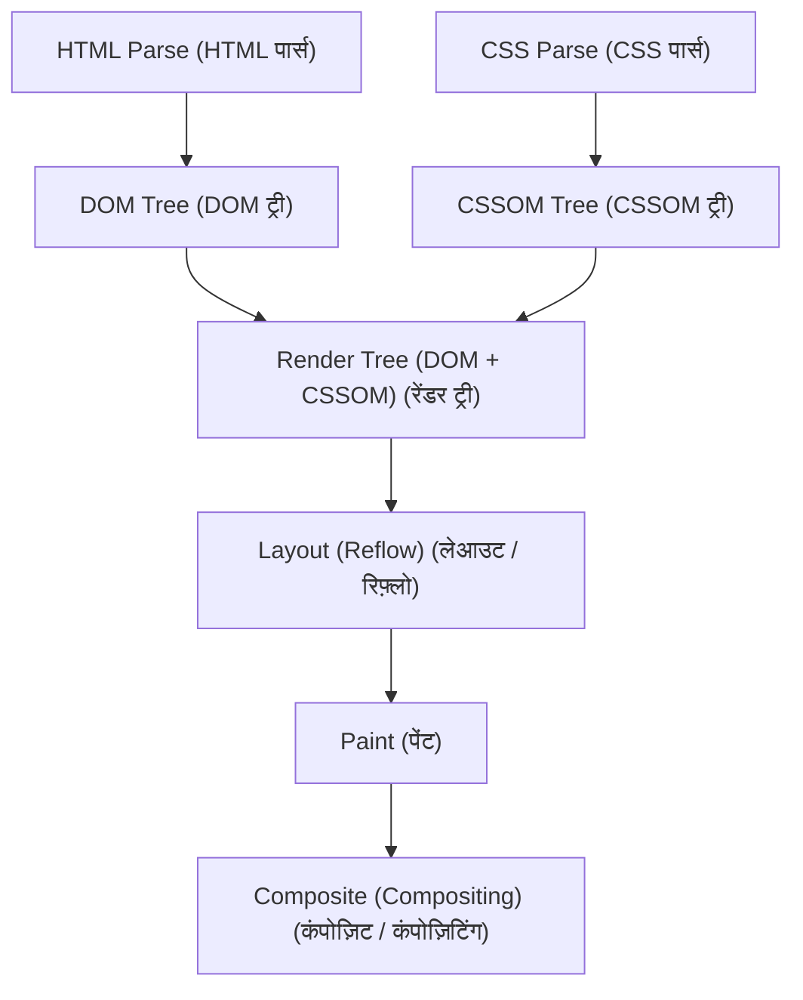

# वेब वाइटल्स (Web Vitals) और फ्रंटएंड परफॉर्मेंस ऑप्टिमाइज़ेशन (LCP, FID, CLS में सुधार)

हाल के वर्षों में वेब डेवलपमेंट में, उपयोगकर्ता अनुभव (UX) में सुधार करना व्यावसायिक सफलता से सीधे जुड़ा एक महत्वपूर्ण कारक बन गया है। Google ने वेब पर उपयोगकर्ता अनुभव को मापने और मूल्यांकन करने के लिए मेट्रिक्स के रूप में **Core Web Vitals** (कोर वेब वाइटल्स) का प्रस्ताव दिया है। इस लेख में, हम फ्रंटएंड परफॉर्मेंस ऑप्टिमाइज़ेशन के दृष्टिकोण से इन Core Web Vitals को बनाने वाले LCP, FID (और अगली पीढ़ी के मेट्रिक INP), और CLS के विस्तृत माप मानदंडों और विशिष्ट सुधार विधियों पर गहराई से विचार करेंगे।

## 1. ब्राउज़र रेंडरिंग पाइपलाइन और परफॉर्मेंस

फ्रंटएंड परफॉर्मेंस ऑप्टिमाइज़ेशन को समझने के लिए, आपको पहले यह समझना होगा कि ब्राउज़र HTML, CSS और JavaScript को स्क्रीन पर पिक्सल में कैसे बदलता है, यानी **रेंडरिंग पाइपलाइन** । नेटवर्क से रिसोर्स प्राप्त करने के बाद, ब्राउज़र स्क्रीन को रेंडर करने के लिए निम्नलिखित चरणों से गुजरता है।



1. **Parse (पार्स)** : जब ब्राउज़र को HTML प्राप्त होता है, तो वह इसे ऊपर से नीचे तक पार्स (विश्लेषण) करता है और एक DOM (Document Object Model) ट्री बनाता है। साथ ही, यह CSS को पार्स करता है और एक CSSOM (CSS Object Model) ट्री बनाता है।
2. **Style (स्टाइल कैलकुलेशन)** : यह DOM ट्री और CSSOM ट्री को जोड़ता है और यह गणना करने के बाद एक रेंडर ट्री उत्पन्न करता है कि किस नोड पर कौन सी स्टाइल लागू होगी।
3. **Layout (लेआउट / रिफ़्लो)** : रेंडर ट्री के आधार पर, यह गणना करता है कि स्क्रीन पर प्रत्येक एलिमेंट कहाँ और किस आकार में रखा जाएगा।
4. **Paint (पेंट)** : लेआउट जानकारी के आधार पर, यह टेक्स्ट, रंग, चित्र और बॉर्डर जैसे दृश्य तत्वों को मेमोरी में लेयर पर पिक्सल के रूप में खींचता है।
5. **Composite (कंपोज़िट / सिंथेसिस)** : यह कई लेयर्स को सही क्रम में ओवरले करता है और उन्हें अंतिम स्क्रीन के रूप में आउटपुट करता है।

परफॉर्मेंस ऑप्टिमाइज़ेशन इस पाइपलाइन के हर चरण में लगने वाले समय को कम करने और मुख्य थ्रेड को ब्लॉक होने से रोकने के अलावा और कुछ नहीं है। विशेष रूप से, JavaScript निष्पादन और भारी CSS गणनाएं इस पाइपलाइन को ब्लॉक करने वाले मुख्य कारण हैं।

## 2. LCP (Largest Contentful Paint) की गहरी समझ और सुधार के तरीके

### LCP क्या है?

**LCP (Largest Contentful Paint)** पेज लोड परफॉर्मेंस को मापने वाला एक मेट्रिक है। विशेष रूप से, यह उस समय को संदर्भित करता है जब उपयोगकर्ता द्वारा पेज पर पहुंचने के बाद व्यूपोर्ट (स्क्रीन के डिस्प्ले एरिया) में सबसे बड़ा टेक्स्ट ब्लॉक या इमेज एलिमेंट रेंडर होता है।

- **अच्छा (Good)** : 2.5 सेकंड के भीतर
- **सुधार की आवश्यकता है (Needs Improvement)** : 2.5 सेकंड से 4.0 सेकंड
- **खराब (Poor)** : 4.0 सेकंड से अधिक

### LCP खराब होने के मुख्य कारण

LCP के धीमा होने के मुख्य कारणों को निम्नलिखित 4 श्रेणियों में बांटा गया है।

1. **सर्वर का रिस्पॉन्स टाइम धीमा होना (TTFB में देरी)** 
2. **रेंडर-ब्लॉकिंग JavaScript और CSS** 
3. **रिसोर्स (जैसे चित्र और वेब फ़ॉन्ट) को लोड होने में लंबा समय लगना** 
4. **क्लाइंट-साइड रेंडरिंग (CSR) पर अत्यधिक निर्भरता** 

### LCP में सुधार के तरीके

#### रिसोर्सेज की प्रीलोडिंग (`preload` / `prefetch`)

LCP एलिमेंट्स (उदाहरण के लिए, हीरो इमेज या मुख्य वेब फ़ॉन्ट) को जल्दी लोड करने বঙ্গবন্ধ करने के लिए, `<link rel="preload">` का उपयोग किया जाता है। इससे ब्राउज़र पार्सर द्वारा रिसोर्स का पता लगाने से पहले ही डाउनलोड शुरू हो सकता है।

```html
<!-- हीरो इमेज की प्रीलोडिंग -->
<link rel="preload" href="/images/hero-image.webp" as="image" />

<!-- वेब फ़ॉन्ट की प्रीलोडिंग -->
<link rel="preload" href="/fonts/custom-font.woff2" as="font" type="font/woff2" crossorigin />

<!-- बाहरी डोमेन (जैसे CDN) से जल्दी कनेक्ट होना -->
<link rel="preconnect" href="https://fonts.gstatic.com" crossorigin />
```

#### रेंडर-ब्लॉकिंग रिसोर्सेज को हटाना

CSS डिफ़ॉल्ट रूप से एक रेंडर-ब्लॉकिंग रिसोर्स है। जब तक CSSOM नहीं बन जाता, ब्राउज़र स्क्रीन को रेंडर नहीं करेगा। क्रिटिकल CSS (फर्स्ट व्यू के लिए आवश्यक CSS) को इनलाइन करके और अन्य CSS को एसिंक्रोनस रूप से लोड करके LCP में सुधार किया जा सकता है।

```html
<!-- नॉन-क्रिटिकल CSS को एसिंक्रोनस रूप से लोड करना -->
<link rel="stylesheet" href="non-critical.css" media="print" onload="this.media='all'" />
```

#### इमेज ऑप्टिमाइज़ेशन

चूंकि छवियां अक्सर LCP एलिमेंट्स बन जाती हैं, इसलिए उन्हें पूरी तरह से ऑप्टिमाइज़ किया जाना चाहिए।

- **नेक्स्ट-जेनरेशन फॉर्मेट्स का उपयोग** : WebP और AVIF जैसे उच्च संपीड़न अनुपात वाले फॉर्मेट्स का उपयोग करें।
- **सही आकार में वितरण** : डिवाइस की स्क्रीन की चौड़ाई के अनुसार आकार में छवियां प्रदान करने के लिए `srcset` एट्रिब्यूट का उपयोग करें।

```html
<picture>
  <source srcset="hero-large.avif" media="(min-width: 1024px)" type="image/avif" />
  <source srcset="hero-small.avif" media="(max-width: 1023px)" type="image/avif" />
  
</picture>
```

ध्यान दें कि LCP एलिमेंट बनने वाली छवियों पर `loading="lazy"` (लेज़ी लोडिंग) लागू नहीं किया जाना चाहिए। इससे LCP का समय लेट हो जाएगा। आप LCP एलिमेंट में स्पष्ट रूप से `fetchpriority="high"` जोड़कर प्राथमिकता बढ़ा सकते हैं।

## 3. FID (First Input Delay) और INP (Interaction to Next Paint)

### FID और INP में अंतर

**FID (First Input Delay)** उस समय से लेकर जब कोई उपयोगकर्ता पहली बार किसी पेज के साथ इंटरैक्ट करता है (जैसे कि क्लिक या टैप करना) और उस समय तक की देरी को मापता है जब ब्राउज़र उस इंटरैक्शन पर प्रतिक्रिया देना शुरू करता है और इवेंट हैंडलर को प्रोसेस करता है।

- **अच्छा (Good)** : 100 मिलीसेकंड के भीतर

हालांकि, FID केवल "पहले इनपुट" को लक्षित करता है और केवल "इवेंट हैंडलर के निष्पादन शुरू होने तक" के समय को मापता है। **INP (Interaction to Next Paint)** को इसके विकल्प के रूप में एक नए मेट्रिक के रूप में पेश किया गया था। INP पेज के पूरे जीवनचक्र में होने वाले सभी उपयोगकर्ता इंटरैक्शन की लेटेंसी को मॉनिटर करता है और किसी इवेंट के घटित होने से लेकर अगले रेंडर (Paint) तक की कुल देरी का मूल्यांकन करता है।

- **अच्छा (Good)** : 200 मिलीसेकंड के भीतर

### FID/INP खराब होने के मुख्य कारण

इसका सबसे बड़ा कारण **Long Tasks (लंबे समय तक चलने वाले कार्य) हैं जो मुख्य थ्रेड को व्यस्त रखते हैं** । यदि JavaScript को पार्स, कंपाइल और निष्पादित करने में 50 मिलीसेकंड से अधिक समय लगता है, तो ब्राउज़र उपयोगकर्ता के इनपुट का तुरंत जवाब नहीं दे पाएगा।

### FID/INP में सुधार के तरीके

#### स्क्रिप्ट की एसिंक्रोनस लोडिंग (`async` / `defer`)

HTML पार्सिंग को ब्लॉक होने से रोकने के लिए JavaScript लोड करते समय `async` या `defer` एट्रिब्यूट्स का उपयोग करें।

```mermaid
gantt
    title "Script Loading Strategies (स्क्रिप्ट लोडिंग रणनीतियाँ)"
    dateFormat  s
    axisFormat  %S
    
    section "Normal <script> (सामान्य <script>)"
    "HTML Parsing (HTML पार्सिंग)"           :a1, 0, 2s
    "Script Download (स्क्रिप्ट डाउनलोड)"        :a2, after a1, 2s
    "Script Execution (स्क्रिप्ट निष्पादन)"       :a3, after a2, 2s
    "HTML Parsing (Resumed) (HTML पार्सिंग (फिर से शुरू))" :a4, after a3, 2s
    
    section "<script async>"
    "HTML Parsing (HTML पार्सिंग)"           :b1, 0, 4s
    "Script Download (स्क्रिप्ट डाउनलोड)"        :b2, 0, 2s
    "Script Execution (स्क्रिप्ट निष्पादन)"       :b3, after b2, 2s
    "HTML Parsing (Resumed) (HTML पार्सिंग (फिर से शुरू))" :b4, after b3, 2s
    
    section "<script defer>"
    "HTML Parsing (HTML पार्सिंग)"           :c1, 0, 6s
    "Script Download (स्क्रिप्ट डाउनलोड)"        :c2, 0, 2s
    "Script Execution (स्क्रिप्ट निष्पादन)"       :c3, after c1, 2s
```



- `async` : जैसे ही डाउनलोड पूरा होता है, HTML पार्सिंग को बाधित कर दिया जाता है और इसे तुरंत निष्पादित किया जाता है। थर्ड-पार्टी स्क्रिप्ट (जैसे एनालिटिक्स) के लिए उपयुक्त है जिनकी कोई निर्भरता नहीं है।
- `defer` : इसे बैकग्राउंड में डाउनलोड किया जाता है और HTML पार्सिंग पूरी होने के बाद निष्पादित किया जाता है। DOM-निर्भर स्क्रिप्ट के लिए उपयुक्त है।

#### Code Splitting (कोड स्प्लिटिंग)

एक बार में बड़ी बंडल की गई JavaScript फ़ाइल को लोड करने से मुख्य थ्रेड लंबे समय तक ब्लॉक हो जाएगा। **Code Splitting** करें और केवल आवश्यक कोड को सही समय पर लोड करें। नीचे React में कंपोनेंट-लेवल कोड स्प्लिटिंग का एक उदाहरण दिया गया है।

```javascript
import React, { Suspense, lazy } from 'react';

// HeavyComponent को प्रारंभिक लोड के दौरान लोड नहीं किया जाता है, बल्कि जब रेंडरिंग की आवश्यकता होती है तब एसिंक्रोनस रूप से प्राप्त किया जाता है
const HeavyComponent = lazy(() => import('./components/HeavyComponent'));

function App() {
  return (
    <div>
      <h1>फ्रंटएंड परफॉर्मेंस ऑप्टिमाइज़ेशन</h1>
      {/* जब तक कंपोनेंट लोड नहीं हो जाता, तब तक एक फॉलबैक UI प्रदान करें */}
      <Suspense fallback={<div>Loading component...</div>}>
        <HeavyComponent />
      </Suspense>
    </div>
  );
}

export default App;
```

#### मुख्य थ्रेड को मुक्त करना (Web Workers और शेड्यूलिंग)

भारी गणनाओं को **Web Workers** का उपयोग करके बैकग्राउंड थ्रेड में स्थानांतरित किया जा सकता है, या `requestIdleCallback` और `setTimeout` का उपयोग करके कार्यों को छोटे टुकड़ों में विभाजित किया जा सकता है ताकि मुख्य थ्रेड में खाली समय बन सके (Yielding to the main thread)।

## 4. CLS (Cumulative Layout Shift) की गहरी समझ और सुधार के तरीके

### CLS क्या है?

**CLS (Cumulative Layout Shift)** किसी पेज की दृश्य स्थिरता को मापने वाला एक मेट्रिक है। यह उस स्कोर को दर्शाता है कि पेज लोड होने की प्रक्रिया के दौरान अनपेक्षित लेआउट शिफ्ट (अचानक कंटेंट के खिसकने की घटना) कितनी बार होती है।

- **अच्छा (Good)** : 0.1 या उससे कम
- **सुधार की आवश्यकता है (Needs Improvement)** : 0.1 से 0.25
- **खराब (Poor)** : 0.25 से अधिक

### CLS खराब होने के मुख्य कारण और सुधार के तरीके

#### इमेज या iframe में आकार (साइज़) निर्दिष्ट न होना

जब तक ब्राउज़र किसी इमेज को डाउनलोड नहीं कर लेता, वह उसके आस्पेक्ट रेशियो या आकार को नहीं जान सकता। इसलिए, इमेज का डाउनलोड पूरा होते ही स्पेस (जगह) ले ली जाती है, जिससे आसपास का टेक्स्ट नीचे धकेल दिया जाता है।

**उपाय**: सुनिश्चित करें कि आप `width` और `height` एट्रिब्यूट्स निर्दिष्ट करें। इससे ब्राउज़र इमेज को डाउनलोड करने से पहले आस्पेक्ट रेशियो की गणना कर सकेगा और लेआउट के लिए स्पेस (प्लेसहोल्डर) पहले से आरक्षित कर सकेगा।

```html
<!-- Good: आकार निर्दिष्ट करें और ब्राउज़र को आस्पेक्ट रेशियो बताएं -->

```

CSS का उपयोग करके इसे रेस्पॉन्सिव बनाते समय `aspect-ratio` प्रॉपर्टी का उपयोग करना भी प्रभावी होता है।

```css
.responsive-image {
  width: 100%;
  height: auto;
  aspect-ratio: 16 / 9;
}
```

साथ ही, उन इमेज के लिए जो फर्स्ट व्यू में नहीं आती हैं, ऊपर दिए गए कोड उदाहरण की तरह `loading="lazy"` निर्दिष्ट करने से नेटवर्क बैंडविड्थ की बचत होगी और प्रारंभिक लोड परफॉर्मेंस में सुधार होगा।

#### गतिशील रूप से डाला गया कंटेंट (विज्ञापन और एम्बेड्स)

JavaScript के माध्यम से बाद में DOM में डाले गए विज्ञापन बैनर और सूचना बार लेआउट शिफ्ट का एक प्रमुख कारण हैं।

**उपाय**: CSS में इन गतिशील कंटेंट्स को रखने वाले कंटेनर तत्वों के लिए पहले से न्यूनतम ऊंचाई (`min-height`) आरक्षित करें।

```css
.ad-container {
  min-height: 250px;
  display: flex;
  justify-content: center;
  align-items: center;
}
```

#### वेब फ़ॉन्ट्स के कारण FOIT/FOUT

वेब फ़ॉन्ट्स के लोड होने तक टेक्स्ट के दिखाई न देने की घटना को **FOIT (Flash of Invisible Text)** कहा जाता है, और जब फ़ॉन्ट बदलता है तो टेक्स्ट की चौड़ाई या ऊंचाई में बदलाव के कारण लेआउट शिफ्ट होने की घटना को **FOUT (Flash of Unstyled Text)** कहा जाता है।

**उपाय**: `@font-face` में `font-display: swap;` निर्दिष्ट करें। इससे आप फ़ॉन्ट के लोड होने का इंतजार किए बिना एक वैकल्पिक फ़ॉन्ट में टेक्स्ट प्रदर्शित कर सकते हैं, और लोड पूरा होने पर इसे बदल सकते हैं।

```css
@font-face {
  font-family: 'CustomFont';
  src: url('/fonts/custom-font.woff2') format('woff2');
  font-display: swap;
}
```

एक अधिक उन्नत उपाय के रूप में, CSS के `size-adjust` और `ascent-override` आदि का उपयोग करके वैकल्पिक फ़ॉन्ट और वेब फ़ॉन्ट के मेट्रिक्स (लाइन की ऊंचाई और वर्ण की चौड़ाई) को यथासंभव मिलाना, जिससे फ़ॉन्ट स्विचिंग के दौरान लेआउट शिफ्ट को कम किया जा सके, यह तकनीक भी मौजूद है।

## 5. निष्कर्ष

Core Web Vitals के प्रत्येक मेट्रिक (**LCP** , **FID/INP** , और **CLS** ) उपयोगकर्ता अनुभव का विभिन्न दृष्टिकोणों से मूल्यांकन करते हैं।

- **LCP** में सुधार करने के लिए, क्रिटिकल पाथ का अनुकूलन और रिसोर्सेज (इमेज और फ़ॉन्ट्स) का शीघ्र लोड होना महत्वपूर्ण है।
- **FID/INP** में सुधार करने के लिए, मुख्य थ्रेड को ब्लॉक करने वाले अत्यधिक JavaScript के निष्पादन को रोकना, और Code Splitting एवं कार्यों को विभाजित करना आवश्यक है।
- **CLS** में सुधार करने के लिए, इमेज और एम्बेडेड एलिमेंट्स के लिए पहले से स्पेस सुरक्षित करके, और फ़ॉन्ट लोडिंग रणनीतियों को उचित रूप से सेट करके दृश्य स्थिरता बनाए रखना महत्वपूर्ण है।

ब्राउज़र की **रेंडरिंग पाइपलाइन** को गहराई से समझकर और प्रत्येक मेट्रिक को खराब करने वाले मूल कारणों की पहचान करके, आप प्रभावी और टिकाऊ परफॉर्मेंस ऑप्टिमाइज़ेशन प्राप्त कर सकते हैं। इन सर्वोत्तम प्रथाओं को अपने प्रोजेक्ट के शुरुआती चरणों से शामिल करें और उच्च स्तर का उपयोगकर्ता अनुभव प्रदान करें।
