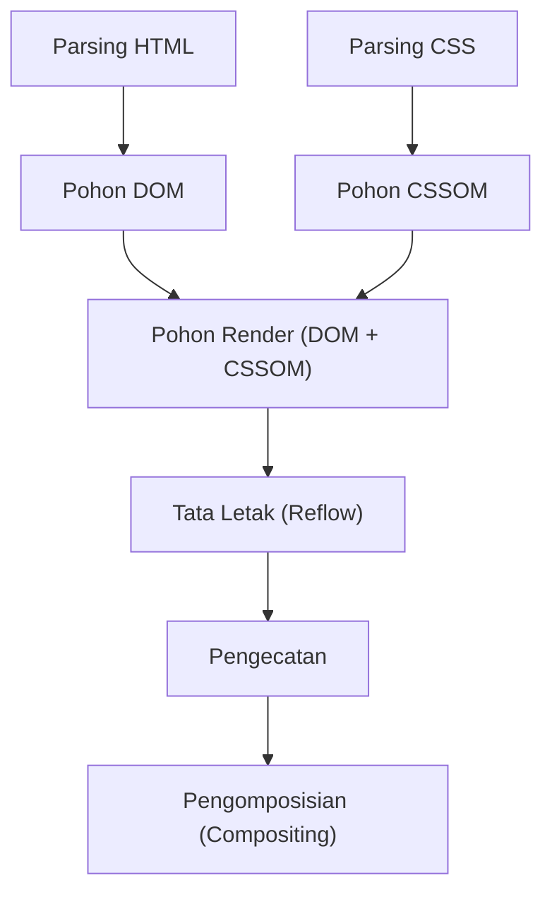

# Web Vitals dan Optimasi Performa Frontend (Peningkatan LCP, FID, CLS)

Dalam pengembangan web modern, peningkatan pengalaman pengguna (UX) telah menjadi faktor penting yang berhubungan langsung dengan kesuksesan bisnis. Google telah mengusulkan **Core Web Vitals** sebagai metrik untuk mengukur dan mengevaluasi pengalaman pengguna di web. Artikel ini akan membahas lebih dalam dari perspektif optimasi performa frontend mengenai kriteria pengukuran detail untuk LCP, FID (serta metrik generasi berikutnya INP), dan CLS yang membentuk Core Web Vitals ini, beserta metode peningkatannya secara spesifik.

## 1. Pipeline Rendering Browser dan Performa

Untuk memahami optimasi performa frontend, pertama-tama kita perlu memahami bagaimana browser mengubah HTML, CSS, dan JavaScript menjadi piksel di layar, yaitu **Pipeline Rendering**. Setelah menerima sumber daya dari jaringan, browser menggambar layar melalui langkah-langkah berikut.



1. **Parse (Parsing)** : Saat browser menerima HTML, browser mengurainya (parsing) secara berurutan dari atas dan membangun pohon DOM (Document Object Model). Pada saat yang sama, ia mengurai CSS untuk membangun pohon CSSOM (CSS Object Model).
2. **Style (Perhitungan gaya)** : Menggabungkan pohon DOM dan pohon CSSOM untuk menghasilkan pohon render yang menghitung gaya mana yang diterapkan ke node mana.
3. **Layout (Tata Letak / Reflow)** : Berdasarkan pohon render, browser menghitung di mana dan seberapa besar setiap elemen akan ditempatkan di layar.
4. **Paint (Pengecatan)** : Berdasarkan informasi tata letak, elemen visual seperti teks, warna, gambar, dan batas digambar sebagai piksel pada lapisan di memori.
5. **Composite (Pengomposisian / Sintesis)** : Beberapa lapisan ditumpuk dalam urutan yang benar dan dihasilkan sebagai layar akhir.

Optimasi performa tidak lain adalah mengurangi waktu yang dibutuhkan untuk setiap langkah dari pipeline ini dan mencegah pemblokiran thread utama. Khususnya, eksekusi JavaScript dan perhitungan CSS yang berat adalah faktor utama yang memblokir pipeline ini.

## 2. Pemahaman Mendalam dan Metode Peningkatan LCP (Largest Contentful Paint)

### Apa itu LCP?

**LCP (Largest Contentful Paint)** adalah metrik yang mengukur performa pemuatan halaman. Secara khusus, ini merujuk pada waktu dari saat pengguna mengakses halaman hingga blok teks atau elemen gambar terbesar dirender di dalam viewport (area tampilan layar).

- **Baik (Good)** : Dalam 2,5 detik
- **Perlu Ditingkatkan (Needs Improvement)** : 2,5 detik - 4,0 detik
- **Buruk (Poor)** : Lebih dari 4,0 detik

### Penyebab Utama Memburuknya LCP

Penyebab melambatnya LCP umumnya dibagi menjadi empat kategori berikut:

1. **Waktu respons server lambat (Penundaan TTFB)** 
2. **JavaScript dan CSS yang memblokir rendering** 
3. **Waktu pemuatan sumber daya (gambar, font web, dll.) yang lama** 
4. **Ketergantungan berlebihan pada Client-Side Rendering (CSR)** 

### Metode Peningkatan LCP

#### Pemuatan Awal Sumber Daya (`preload` / `prefetch`)

Untuk memuat elemen LCP lebih awal (misalnya, gambar pahlawan atau font web utama), gunakan `<link rel="preload">`. Ini memungkinkan pengunduhan dimulai sebelum parser browser menemukan sumber daya tersebut.

```html
<!-- Pemuatan awal gambar pahlawan -->
<link rel="preload" href="/images/hero-image.webp" as="image" />

<!-- Pemuatan awal font Web -->
<link rel="preload" href="/fonts/custom-font.woff2" as="font" type="font/woff2" crossorigin />

<!-- Koneksi awal ke domain eksternal (seperti CDN) -->
<link rel="preconnect" href="https://fonts.gstatic.com" crossorigin />
```

#### Penghapusan Sumber Daya Pemblokir Rendering

Secara default, CSS adalah sumber daya yang memblokir rendering. Browser tidak akan menggambar layar hingga CSSOM dibangun. Anda dapat meningkatkan LCP dengan meng-inline-kan Critical CSS (CSS yang diperlukan untuk tampilan pertama) dan memuat CSS lainnya secara asinkron.

```html
<!-- Pemuatan asinkron CSS non-kritis -->
<link rel="stylesheet" href="non-critical.css" media="print" onload="this.media='all'" />
```

#### Optimasi Gambar

Karena gambar sering kali menjadi elemen LCP, optimasi menyeluruh diperlukan.

- **Penggunaan format generasi berikutnya** : Gunakan format dengan tingkat kompresi tinggi seperti WebP dan AVIF.
- **Pengiriman dalam ukuran yang sesuai** : Gunakan atribut `srcset` untuk menyediakan gambar dengan ukuran yang sesuai dengan lebar layar perangkat.

```html
<picture>
  <source srcset="hero-large.avif" media="(min-width: 1024px)" type="image/avif" />
  <source srcset="hero-small.avif" media="(max-width: 1023px)" type="image/avif" />
  
</picture>
```

Selain itu, Anda tidak boleh menerapkan `loading="lazy"` (pemuatan lambat) pada gambar yang menjadi elemen LCP. Ini akan menunda waktu LCP. Anda dapat meningkatkan prioritas dengan memberikan `fetchpriority="high"` secara eksplisit ke elemen LCP.

## 3. FID (First Input Delay) dan INP (Interaction to Next Paint)

### Perbedaan antara FID dan INP

**FID (First Input Delay)** mengukur waktu tunda dari saat pengguna pertama kali berinteraksi dengan halaman (seperti mengklik atau mengetuk) hingga saat browser merespons interaksi tersebut dan mulai memproses event handler.

- **Baik (Good)** : Dalam 100 milidetik

Namun, FID hanya menargetkan "input pertama" dan hanya mengukur waktu "hingga eksekusi event handler dimulai". Sebagai indikator baru untuk menggantikannya, diperkenalkan **INP (Interaction to Next Paint)**. INP memantau latensi semua interaksi pengguna yang terjadi sepanjang siklus hidup halaman dan mengevaluasi penundaan keseluruhan dari saat peristiwa terjadi hingga pengecatan berikutnya dilakukan.

- **Baik (Good)** : Dalam 200 milidetik

### Penyebab Utama Memburuknya FID/INP

Penyebab utamanya adalah **Long Tasks (Tugas Panjang) yang menempati thread utama**. Jika ada tugas yang membutuhkan lebih dari 50 milidetik untuk mem-parsing, mengkompilasi, dan mengeksekusi JavaScript, browser tidak dapat langsung merespons input pengguna.

### Metode Peningkatan FID/INP

#### Pemuatan Skrip Asinkron (`async` / `defer`)

Gunakan atribut `async` atau `defer` agar pemuatan JavaScript tidak memblokir parsing HTML.

```mermaid
gantt
    title "Strategi Pemuatan Skrip"
    dateFormat  s
    axisFormat  %S
    
    section "Normal <script>"
    Parsing HTML           :a1, 0, 2s
    Pengunduhan Skrip      :a2, after a1, 2s
    Eksekusi Skrip         :a3, after a2, 2s
    Parsing HTML (Dilanjutkan) :a4, after a3, 2s
    
    section "<script async>"
    Parsing HTML           :b1, 0, 4s
    Pengunduhan Skrip      :b2, 0, 2s
    Eksekusi Skrip         :b3, after b2, 2s
    Parsing HTML (Dilanjutkan) :b4, after b3, 2s
    
    section "<script defer>"
    Parsing HTML           :c1, 0, 6s
    Pengunduhan Skrip      :c2, 0, 2s
    Eksekusi Skrip         :c3, after c1, 2s
```



- `async` : Segera setelah pengunduhan selesai, penguraian HTML dihentikan dan skrip segera dieksekusi. Cocok untuk skrip pihak ketiga tanpa dependensi (seperti analitik).
- `defer` : Diunduh di latar belakang dan dieksekusi setelah penguraian HTML selesai. Cocok untuk skrip yang bergantung pada DOM.

#### Code Splitting (Pemisahan Kode)

Memuat file JavaScript besar yang digabungkan sekaligus akan memblokir thread utama untuk waktu yang lama. Lakukan **Code Splitting** untuk memuat hanya kode yang diperlukan pada waktu yang diperlukan. Berikut adalah contoh code splitting tingkat komponen di React.

```javascript
import React, { Suspense, lazy } from 'react';

// HeavyComponent tidak dimuat pada pemuatan awal, tetapi diambil secara asinkron saat perenderan diperlukan
const HeavyComponent = lazy(() => import('./components/HeavyComponent'));

function App() {
  return (
    <div>
      <h1>Optimasi Performa Frontend</h1>
      {/* Menyediakan fallback UI hingga komponen dimuat */}
      <Suspense fallback={<div>Memuat komponen...</div>}>
        <HeavyComponent />
      </Suspense>
    </div>
  );
}

export default App;
```

#### Membebaskan Thread Utama (Web Workers dan Penjadwalan)

Proses komputasi berat harus didelegasikan ke thread latar belakang menggunakan **Web Workers**, atau tugas harus dibagi dengan cermat menggunakan `requestIdleCallback` atau `setTimeout` untuk menciptakan waktu luang di thread utama (Yielding to the main thread).

## 4. Pemahaman Mendalam dan Metode Peningkatan CLS (Cumulative Layout Shift)

### Apa itu CLS?

**CLS (Cumulative Layout Shift)** adalah indikator untuk mengukur stabilitas visual halaman. Ini memberikan skor pada seberapa banyak pergeseran tata letak yang tidak terduga (fenomena di mana konten tiba-tiba bergerak) terjadi selama proses pemuatan halaman.

- **Baik (Good)** : 0,1 atau kurang
- **Perlu Ditingkatkan (Needs Improvement)** : 0,1 - 0,25
- **Buruk (Poor)** : Lebih dari 0,25

### Penyebab Utama Memburuknya CLS dan Metode Peningkatannya

#### Gambar atau iframe tidak memiliki ukuran yang ditentukan

Browser tidak dapat mengetahui rasio aspek atau ukuran gambar sebelum mengunduhnya. Akibatnya, ruang disediakan pada saat pemuatan gambar selesai, yang mendorong teks di sekitarnya ke bawah.

**Solusi**: Selalu tentukan atribut `width` dan `height`. Ini memungkinkan browser menghitung rasio aspek sebelum mengunduh gambar dan mengamankan ruang untuk tata letak (placeholder) sebelumnya.

```html
<!-- Baik: Tentukan ukuran dan beri tahu browser tentang rasio aspek -->

```

Jika Anda membuatnya responsif dengan CSS, penggunaan properti `aspect-ratio` juga efektif.

```css
.responsive-image {
  width: 100%;
  height: auto;
  aspect-ratio: 16 / 9;
}
```

Selain itu, untuk gambar yang tidak masuk dalam tampilan pertama, menentukan `loading="lazy"` seperti contoh kode di atas dapat menghemat bandwidth jaringan dan meningkatkan performa pemuatan awal.

#### Konten yang disisipkan secara dinamis (iklan atau sematan)

Spanduk iklan atau bilah notifikasi yang dimasukkan kemudian ke dalam DOM oleh JavaScript adalah penyebab utama pergeseran tata letak.

**Solusi**: Untuk elemen kontainer tempat konten dinamis ini berada, pesan tinggi minimum (`min-height`) sebelumnya menggunakan CSS.

```css
.ad-container {
  min-height: 250px;
  display: flex;
  justify-content: center;
  align-items: center;
}
```

#### FOIT/FOUT karena Web Font

Fenomena di mana teks tidak terlihat saat font web dimuat disebut **FOIT (Flash of Invisible Text)**, dan fenomena di mana lebar atau tinggi teks berubah pada saat font diubah dan menyebabkan tata letak bergeser disebut **FOUT (Flash of Unstyled Text)**.

**Solusi**: Tentukan `font-display: swap;` di `@font-face`. Ini memungkinkan Anda menampilkan teks dengan font alternatif tanpa menunggu font dimuat, dan menggantinya setelah pemuatan selesai.

```css
@font-face {
  font-family: 'CustomFont';
  src: url('/fonts/custom-font.woff2') format('woff2');
  font-display: swap;
}
```

Sebagai tindakan balasan yang lebih canggih, ada juga metode untuk meminimalkan pergeseran tata letak saat mengganti font dengan menggunakan `size-adjust` atau `ascent-override` CSS untuk mencocokkan metrik (tinggi baris dan lebar karakter) dari font alternatif dan font web sedekat mungkin.

## 5. Kesimpulan

Masing-masing metrik Core Web Vitals (**LCP**, **FID/INP**, dan **CLS**) mengevaluasi pengalaman pengguna dari berbagai perspektif.

- Untuk meningkatkan **LCP**, mengoptimalkan jalur kritis dan memuat sumber daya (gambar dan font) lebih awal adalah kuncinya.
- Untuk meningkatkan **FID/INP**, Anda perlu mencegah eksekusi JavaScript berlebihan yang memblokir thread utama, serta melakukan Code Splitting dan pemisahan tugas.
- Untuk meningkatkan **CLS**, penting untuk menjaga stabilitas visual dengan mengamankan ruang untuk gambar dan elemen sematan sebelumnya, dan mengatur strategi pemuatan font yang tepat.

Dengan memahami secara mendalam **Pipeline Rendering** browser dan mengidentifikasi penyebab mendasar memburuknya masing-masing metrik, Anda dapat mencapai optimasi performa yang efektif dan berkelanjutan. Terapkan praktik terbaik ini sejak tahap awal proyek Anda untuk memberikan pengalaman pengguna dengan standar tertinggi.
