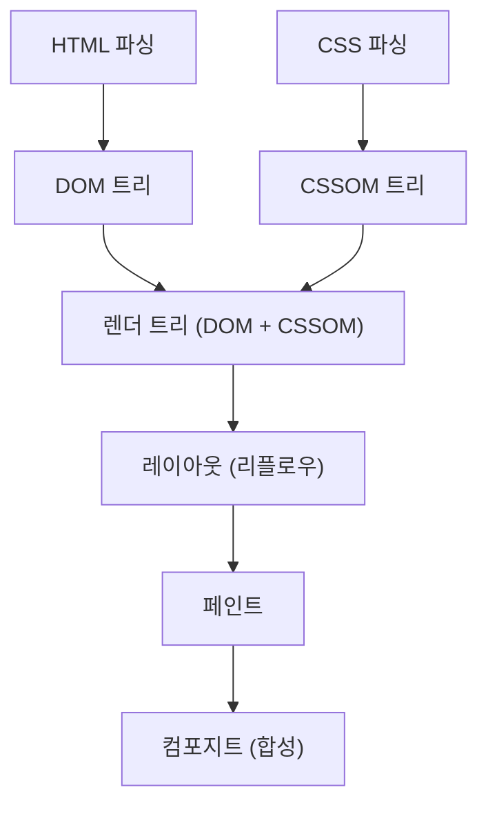

# Web Vitals와 프론트엔드 성능 최적화 (LCP, FID, CLS 개선)

최근의 웹 개발에서 사용자 경험(UX)의 향상은 비즈니스의 성공에 직결되는 중요한 요소가 되었습니다. Google은 웹 상의 사용자 경험을 정량화하고 평가하기 위한 지표로서 **Core Web Vitals** (코어 웹 바이탈)를 제창했습니다. 본 기사에서는 프론트엔드 성능 최적화의 관점에서, 이러한 Core Web Vitals를 구성하는 LCP, FID(및 차세대 지표인 INP), CLS의 상세한 측정 기준과 구체적인 개선 기법에 대해 깊이 파헤쳐 보겠습니다.

## 1. 브라우저의 렌더링 파이프라인과 성능

프론트엔드의 성능 최적화를 이해하기 위해서는 먼저 브라우저가 어떻게 HTML, CSS, JavaScript를 화면 상의 픽셀로 변환하는지, 즉 **렌더링 파이프라인** 을 이해할 필요가 있습니다. 브라우저는 네트워크로부터 리소스를 받은 후, 아래의 단계를 거쳐 화면을 그립니다.



1. **Parse (파싱)** : 브라우저는 HTML을 수신하면 이를 위에서부터 순서대로 해석(파싱)하여 DOM(Document Object Model) 트리를 구축합니다. 동시에 CSS를 해석하여 CSSOM(CSS Object Model) 트리를 구축합니다.
2. **Style (스타일 계산)** : DOM 트리와 CSSOM 트리를 결합하여, 어떤 노드에 어떤 스타일이 적용될지를 계산한 렌더 트리를 생성합니다.
3. **Layout (레이아웃 / 리플로우)** : 렌더 트리를 바탕으로 각 요소가 화면 상의 어디에, 어느 정도의 크기로 배치될지를 계산합니다.
4. **Paint (페인트)** : 레이아웃 정보에 기반하여 텍스트, 색상, 이미지, 경계선 등의 시각적인 요소를 픽셀로서 메모리 상의 레이어에 그립니다.
5. **Composite (컴포지트 / 합성)** : 여러 레이어를 올바른 순서로 겹쳐서 최종적인 화면으로 출력합니다.

성능 최적화란 이 파이프라인의 각 단계에 걸리는 시간을 단축하고, 메인 스레드의 차단을 방지하는 것에 다름 아닙니다. 특히 JavaScript의 실행이나 무거운 CSS의 계산은 이 파이프라인을 차단하는 주요 원인이 됩니다.

## 2. LCP (Largest Contentful Paint)의 깊은 이해와 개선 기법

### LCP란 무엇인가?

**LCP (Largest Contentful Paint)** 는 페이지의 로딩 성능을 측정하는 지표입니다. 구체적으로는 사용자가 페이지에 접속한 후, 뷰포트(화면 표시 영역) 내에서 가장 큰 텍스트 블록이나 이미지 요소가 렌더링될 때까지의 시간을 의미합니다.

- **우수 (Good)** : 2.5초 이내
- **개선 필요 (Needs Improvement)** : 2.5초 ~ 4.0초
- **불량 (Poor)** : 4.0초 초과

### LCP 악화의 주요 원인

LCP가 느려지는 원인은 주로 다음의 4가지로 분류됩니다.

1. **서버의 응답 시간이 느림 (TTFB의 지연)** 
2. **렌더링을 차단하는 JavaScript와 CSS** 
3. **리소스(이미지나 웹 폰트 등)의 로딩 시간이 김** 
4. **클라이언트 사이드 렌더링 (CSR)에 대한 과도한 의존** 

### LCP의 개선 기법

#### 리소스 사전 로드 (`preload` / `prefetch`)

LCP 요소(예를 들어 히어로 이미지나 메인 웹 폰트)를 조기에 로드하기 위해 `<link rel="preload">` 를 활용합니다. 이를 통해 브라우저의 파서가 리소스를 발견하기 전에 다운로드를 시작할 수 있습니다.

```html
<!-- 히어로 이미지의 사전 로드 -->
<link rel="preload" href="/images/hero-image.webp" as="image" />

<!-- 웹 폰트의 사전 로드 -->
<link rel="preload" href="/fonts/custom-font.woff2" as="font" type="font/woff2" crossorigin />

<!-- 외부 도메인(CDN 등)으로의 조기 연결 -->
<link rel="preconnect" href="https://fonts.gstatic.com" crossorigin />
```

#### 렌더링 차단 리소스 제거

CSS는 기본적으로 렌더링 차단 리소스입니다. CSSOM이 구축될 때까지 브라우저는 화면을 그리지 않습니다. 크리티컬 CSS(첫 화면에 필요한 CSS)를 인라인화하고, 그 외의 CSS를 비동기적으로 로드함으로써 LCP를 개선할 수 있습니다.

```html
<!-- 비크리티컬 CSS의 비동기 로드 -->
<link rel="stylesheet" href="non-critical.css" media="print" onload="this.media='all'" />
```

#### 이미지 최적화

이미지는 LCP 요소가 되는 경우가 많기 때문에 철저한 최적화가 필요합니다.

- **차세대 포맷 활용** : WebP나 AVIF 등 높은 압축률을 자랑하는 포맷을 사용합니다.
- **적절한 크기로 제공** : `srcset` 속성을 사용하여 기기의 화면 너비에 맞춘 크기의 이미지를 제공합니다.

```html
<picture>
  <source srcset="hero-large.avif" media="(min-width: 1024px)" type="image/avif" />
  <source srcset="hero-small.avif" media="(max-width: 1023px)" type="image/avif" />
  
</picture>
```

참고로, LCP 요소가 되는 이미지에는 `loading="lazy"` (지연 로드)를 적용해서는 안 됩니다. LCP의 타이밍이 늦어지기 때문입니다. LCP 요소에는 명시적으로 `fetchpriority="high"` 를 부여하여 우선순위를 높일 수 있습니다.

## 3. FID (First Input Delay)와 INP (Interaction to Next Paint)

### FID와 INP의 차이

**FID (First Input Delay)** 는 사용자가 페이지와 처음 상호작용(클릭이나 탭 등)했을 때부터 브라우저가 그 상호작용에 응답하여 이벤트 핸들러를 처리하기 시작할 때까지의 지연 시간을 측정합니다.

- **우수 (Good)** : 100밀리초 이내

그러나 FID는 '첫 번째 입력'만을 대상으로 하며, 게다가 '이벤트 핸들러의 실행 시작까지'의 시간만 측정합니다. 이를 대체할 새로운 지표로 도입된 것이 **INP (Interaction to Next Paint)** 입니다. INP는 페이지 전체의 수명 주기에 걸쳐 발생하는 모든 사용자 인터랙션의 지연 시간을 모니터링하여, 이벤트가 발생하고 다음 그리기(Paint)가 이루어질 때까지의 전체 지연을 평가합니다.

- **우수 (Good)** : 200밀리초 이내

### FID/INP 악화의 주요 원인

가장 큰 원인은 **메인 스레드를 점유하는 Long Tasks (시간이 오래 걸리는 작업)** 입니다. JavaScript의 파싱, 컴파일, 실행에 50밀리초 이상 걸리는 작업이 존재하면, 브라우저는 사용자의 입력에 즉각적으로 응답할 수 없게 됩니다.

### FID/INP의 개선 기법

#### 스크립트 비동기 로드 (`async` / `defer`)

JavaScript의 로딩이 HTML의 파싱을 차단하지 않도록 `async` 또는 `defer` 속성을 사용합니다.

```mermaid
gantt
    title "스크립트 로딩 전략"
    dateFormat  s
    axisFormat  %S
    
    section "일반 <script>"
    HTML 파싱           :a1, 0, 2s
    스크립트 다운로드        :a2, after a1, 2s
    스크립트 실행       :a3, after a2, 2s
    HTML 파싱 (재개) :a4, after a3, 2s
    
    section "<script async>"
    HTML 파싱           :b1, 0, 4s
    스크립트 다운로드        :b2, 0, 2s
    스크립트 실행       :b3, after b2, 2s
    HTML 파싱 (재개) :b4, after b3, 2s
    
    section "<script defer>"
    HTML 파싱           :c1, 0, 6s
    스크립트 다운로드        :c2, 0, 2s
    스크립트 실행       :c3, after c1, 2s
```



- `async` : 다운로드가 완료되는 즉시 HTML 파싱을 중단하고 즉각적으로 실행됩니다. 의존성이 없는 서드파티 스크립트(애널리틱스 등)에 적합합니다.
- `defer` : 백그라운드에서 다운로드되며, HTML 파싱이 완료된 후에 실행됩니다. DOM에 의존하는 스크립트에 적합합니다.

#### Code Splitting (코드 스플리팅)

번들링된 거대한 JavaScript 파일을 한 번에 로드하면 메인 스레드가 장시간 차단됩니다. **Code Splitting** 을 수행하여 필요한 코드만 필요한 시점에 로드하도록 합니다. 다음은 React에서의 컴포넌트 수준 코드 스플리팅의 예시입니다.

```javascript
import React, { Suspense, lazy } from 'react';

// HeavyComponent는 초기 로드 시에는 로드되지 않으며, 렌더링이 필요한 시점에 비동기적으로 가져온다
const HeavyComponent = lazy(() => import('./components/HeavyComponent'));

function App() {
  return (
    <div>
      <h1>프론트엔드 성능 최적화</h1>
      {/* 컴포넌트가 로드될 때까지의 폴백 UI를 제공 */}
      <Suspense fallback={<div>Loading component...</div>}>
        <HeavyComponent />
      </Suspense>
    </div>
  );
}

export default App;
```

#### 메인 스레드 해제 (Web Workers와 스케줄링)

무거운 계산 처리는 **Web Workers** 를 사용하여 백그라운드 스레드로 이양하거나, `requestIdleCallback` 이나 `setTimeout` 을 사용하여 작업을 잘게 분할하고 메인 스레드에 여유 시간을 확보합니다 (Yielding to the main thread).

## 4. CLS (Cumulative Layout Shift)의 깊은 이해와 개선 기법

### CLS란 무엇인가?

**CLS (Cumulative Layout Shift)** 는 페이지의 시각적인 안정성을 측정하는 지표입니다. 페이지가 로드되는 과정에서 예기치 않은 레이아웃 이동(갑자기 콘텐츠가 이동하는 현상)이 얼마나 발생했는지를 점수화합니다.

- **우수 (Good)** : 0.1 이하
- **개선 필요 (Needs Improvement)** : 0.1 ~ 0.25
- **불량 (Poor)** : 0.25 초과

### CLS 악화의 주요 원인과 개선 기법

#### 이미지나 iframe에 크기가 지정되지 않음

브라우저는 이미지를 다운로드하기 전까지 그 종횡비나 크기를 알 수 없습니다. 그로 인해 이미지 로드가 완료되는 순간에 공간이 확보되면서 주변 텍스트가 밀려나게 됩니다.

**대책**: 반드시 `width` 와 `height` 속성을 지정합니다. 이를 통해 브라우저는 이미지 다운로드 전에 종횡비를 계산하여 레이아웃을 위한 공간(플레이스홀더)을 사전에 확보합니다.

```html
<!-- Good: 크기를 지정하여 브라우저에 종횡비를 전달 -->

```

CSS로 반응형을 구성할 경우에는 `aspect-ratio` 속성을 활용하는 것도 효과적입니다.

```css
.responsive-image {
  width: 100%;
  height: auto;
  aspect-ratio: 16 / 9;
}
```

또한 첫 화면에 들어오지 않는 이미지에 대해서는 위 코드 예시와 같이 `loading="lazy"` 를 지정함으로써 네트워크 대역폭 절약과 초기 로딩 성능 향상으로 이어집니다.

#### 동적으로 삽입되는 콘텐츠 (광고나 임베드)

JavaScript에 의해 나중에 DOM에 삽입되는 광고 배너나 알림 바는 레이아웃 시프트의 큰 원인이 됩니다.

**대책**: 이러한 동적 콘텐츠가 들어갈 컨테이너 요소에 대해, CSS로 사전에 최소 높이( `min-height` )를 예약해 둡니다.

```css
.ad-container {
  min-height: 250px;
  display: flex;
  justify-content: center;
  align-items: center;
}
```

#### 웹 폰트에 의한 FOIT/FOUT

웹 폰트가 로드될 때까지 텍스트가 보이지 않는 현상을 **FOIT (Flash of Invisible Text)** , 폰트가 전환되는 순간 텍스트의 너비나 높이가 달라져 레이아웃이 어긋나는 현상을 **FOUT (Flash of Unstyled Text)** 라고 부릅니다.

**대책**: `@font-face` 에서 `font-display: swap;` 을 지정합니다. 이를 통해 폰트 로드를 기다리지 않고 대체 폰트로 텍스트를 표시하며, 로드 완료 후에 교체할 수 있습니다.

```css
@font-face {
  font-family: 'CustomFont';
  src: url('/fonts/custom-font.woff2') format('woff2');
  font-display: swap;
}
```

나아가 더 고도화된 대책으로서, CSS의 `size-adjust` 나 `ascent-override` 등을 이용하여 대체 폰트와 웹 폰트의 메트릭스(행 높이나 문자 너비)를 가능한 한 일치시키고, 폰트 전환 시의 레이아웃 시프트를 최소화하는 기법도 존재합니다.

## 5. 요약

Core Web Vitals의 각 지표( **LCP** , **FID/INP** , **CLS** )는 제각기 다른 관점에서 사용자 경험을 평가하고 있습니다.

- **LCP** 를 개선하려면 크리티컬 패스 최적화와 리소스(이미지나 폰트)의 조기 로드가 핵심입니다.
- **FID/INP** 를 개선하려면 메인 스레드를 차단하는 과도한 JavaScript 실행을 방지하고, Code Splitting이나 작업 분할을 수행해야 합니다.
- **CLS** 를 개선하려면 이미지나 임베드 요소의 공간을 사전에 확보하고, 폰트 로딩 전략을 적절히 설정하여 시각적인 안정성을 유지하는 것이 중요합니다.

브라우저의 **렌더링 파이프라인** 을 깊이 이해하고 각 지표가 악화되는 근본적인 원인을 특정함으로써, 효과적이고 지속 가능한 성능 최적화를 실현할 수 있습니다. 이러한 모범 사례를 프로젝트 초기 단계부터 도입하여 최고 수준의 사용자 경험을 제공합시다.
