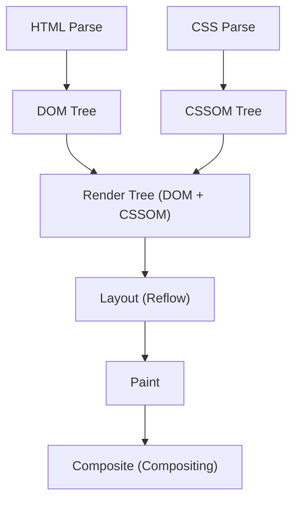

# Web Vitalsとフロントエンドパフォーマンス最適化（LCP, FID, CLSの改善）

近年のWeb開発において、ユーザー体験（UX）の向上はビジネスの成功に直結する重要な要素となっています。GoogleはWeb上のユーザー体験を定量化し、評価するための指標として **Core Web Vitals** （コアウェブバイタル）を提唱しました。本記事では、フロントエンドパフォーマンス最適化の観点から、これら Core Web Vitals を構成する LCP、FID（および次世代指標であるINP）、CLS の詳細な計測基準と、具体的な改善手法について深く掘り下げていきます。

## 1. ブラウザのレンダリングパイプラインとパフォーマンス

フロントエンドのパフォーマンス最適化を理解するためには、まずブラウザがどのようにしてHTML、CSS、JavaScriptを画面上のピクセルに変換しているのか、すなわち **レンダリングパイプライン** を理解する必要があります。ブラウザはネットワークからリソースを受け取った後、以下のステップを経て画面を描画します。



1. **Parse (パース)** : ブラウザはHTMLを受信すると、それを上から順に解析（パース）し、DOM（Document Object Model）ツリーを構築します。同時に、CSSを解析してCSSOM（CSS Object Model）ツリーを構築します。
2. **Style (スタイル計算)** : DOMツリーとCSSOMツリーを結合し、どのノードにどのスタイルが適用されるかを計算したレンダーツリーを生成します。
3. **Layout (レイアウト / リフロー)** : レンダーツリーを元に、各要素が画面上のどこに、どれくらいのサイズで配置されるかを計算します。
4. **Paint (ペイント)** : レイアウト情報に基づいて、テキスト、色、画像、境界線などの視覚的な要素をピクセルとしてメモリ上のレイヤーに描画します。
5. **Composite (コンポジット / 合成)** : 複数のレイヤーを正しい順序で重ね合わせ、最終的な画面として出力します。

パフォーマンスの最適化とは、このパイプラインの各ステップにかかる時間を短縮し、メインスレッドのブ[ロック](https://kenji.blog/p/rdbms-transaction-acid-isolation-level-lock/)を防ぐことに他なりません。特に、JavaScriptの実行や重いCSSの計算は、このパイプラインをブロックする主な要因となります。

## 2. LCP (Largest Contentful Paint) の深い理解と改善手法

### LCPとは何か？

**LCP (Largest Contentful Paint)** は、ページの読み込みパフォーマンスを測る指標です。具体的には、ユーザーがページにアクセスしてから、ビューポート（画面の表示領域）内で最も大きなテキストブロックや画像要素がレンダリングされるまでの時間を指します。

- **良好 (Good)** : 2.5秒以内
- **要改善 (Needs Improvement)** : 2.5秒 〜 4.0秒
- **不良 (Poor)** : 4.0秒超

### LCP悪化の主な原因

LCPが遅くなる原因は、主に以下の4つに分類されます。

1. **サーバーの応答時間が遅い (TTFBの遅延)** 
2. **レンダリングをブロックするJavaScriptとCSS** 
3. **リソース（画像やWebフォントなど）の読み込み時間が長い** 
4. **クライアントサイドレンダリング (CSR) への過度な依存** 

### LCPの改善手法

#### リソースの事前読み込み (`preload` / `prefetch`)

LCP要素（例えば、ヒーロー画像やメインのWebフォント）を早期に読み込むために、 `<link rel="preload">` を活用します。これにより、ブラウザのパーサーがリソースを発見する前にダウンロードを開始できます。

```html
<!-- ヒーロー画像の事前読み込み -->
<link rel="preload" href="/images/hero-image.webp" as="image" />

<!-- Webフォントの事前読み込み -->
<link rel="preload" href="/fonts/custom-font.woff2" as="font" type="font/woff2" crossorigin />

<!-- 外部ドメイン（CDNなど）への早期接続 -->
<link rel="preconnect" href="https://fonts.gstatic.com" crossorigin />
```

#### レンダリングブ[ロック](https://kenji.blog/p/rdbms-transaction-acid-isolation-level-lock/)リソースの排除

CSSはデフォルトでレンダリングブロックリソースです。CSSOMが構築されるまで、ブラウザは画面を描画しません。クリティカルCSS（ファーストビューに必要なCSS）をインライン化し、それ以外のCSSを非同期で読み込むことで、LCPを改善できます。

```html
<!-- 非クリティカルなCSSの非同期読み込み -->
<link rel="stylesheet" href="non-critical.css" media="print" onload="this.media='all'" />
```

#### 画像の最適化

画像はLCP要素になることが多いため、徹底的な最適化が必要です。

- **次世代フォーマットの利用** : WebPやAVIFなどの高い圧縮率を誇るフォーマットを使用します。
- **適切なサイズでの配信** : `srcset` 属性を使用して、デバイスの画面幅に合わせたサイズの画像を提供します。

```html
<picture>
  <source srcset="hero-large.avif" media="(min-width: 1024px)" type="image/avif" />
  <source srcset="hero-small.avif" media="(max-width: 1023px)" type="image/avif" />
  
</picture>
```

なお、LCP要素となる画像には `loading="lazy"` （遅延読み込み）を適用してはいけません。LCPのタイミングが遅れてしまいます。LCP要素には明示的に `fetchpriority="high"` を付与することで、優先度を上げることができます。

## 3. FID (First Input Delay) と INP (Interaction to Next Paint)

### FID と INP の違い

**FID (First Input Delay)** は、ユーザーがページと初めて対話（クリックやタップなど）したときから、ブラウザがその対話に応答してイベントハンドラを処理し始めるまでの遅延時間を測定します。

- **良好 (Good)** : 100ミリ秒以内

しかし、FIDは「最初の入力」のみを対象としており、かつ「イベントハンドラの実行開始まで」の時間しか測りません。これに代わる新しい指標として導入されたのが **INP (Interaction to Next Paint)** です。INPは、ページ全体のライフサイクルにわたって発生するすべてのユーザーインタラクションのレイテンシを監視し、イベントが発生してから次の描画（Paint）が行われるまでの全体の遅延を評価します。

- **良好 (Good)** : 200ミリ秒以内

### FID/INP悪化の主な原因

最も大きな原因は、 **メインスレッドを占有するLong Tasks（時間のかかるタスク）** です。JavaScriptのパース、コンパイル、実行に50ミリ秒以上かかるタスクが存在すると、ブラウザはユーザーの入力に即座に応答できなくなります。

### FID/INPの改善手法

#### スクリプトの非同期読み込み (`async` / `defer`)

JavaScriptの読み込みがHTMLのパースをブ[ロック](https://kenji.blog/p/rdbms-transaction-acid-isolation-level-lock/)しないように、 `async` または `defer` 属性を使用します。

```mermaid
gantt
    title "Script Loading Strategies"
    dateFormat  s
    axisFormat  %S
    
    section "Normal <script>"
    HTML Parsing           :a1, 0, 2s
    Script Download        :a2, after a1, 2s
    Script Execution       :a3, after a2, 2s
    HTML Parsing (Resumed) :a4, after a3, 2s
    
    section "<script async>"
    HTML Parsing           :b1, 0, 4s
    Script Download        :b2, 0, 2s
    Script Execution       :b3, after b2, 2s
    HTML Parsing (Resumed) :b4, after b3, 2s
    
    section "<script defer>"
    HTML Parsing           :c1, 0, 6s
    Script Download        :c2, 0, 2s
    Script Execution       :c3, after c1, 2s
```



- `async` : ダウンロードが完了次第、HTMLパースを中断して即座に実行されます。依存関係のないサードパーティスクリプト（アナリティクスなど）に適しています。
- `defer` : バックグラウンドでダウンロードされ、HTMLのパースが完了した後に実行されます。DOMに依存するスクリプトに適しています。

#### Code Splitting（コードスプリッティング）

バンドルされた巨大なJavaScriptファイルを一度に読み込むと、メインスレッドが長時間ブ[ロック](https://kenji.blog/p/rdbms-transaction-acid-isolation-level-lock/)されます。 **Code Splitting** を行い、必要なコードだけを必要なタイミングで読み込むようにします。以下はReactでのコンポーネントレベルのコードスプリッティングの例です。

```javascript
import React, { Suspense, lazy } from 'react';

// HeavyComponentは初期ロード時には読み込まれず、レンダリングが必要になったタイミングで非同期で取得される
const HeavyComponent = lazy(() => import('./components/HeavyComponent'));

function App() {
  return (
    <div>
      <h1>フロントエンドパフォーマンス最適化</h1>
      {/* コンポーネントが読み込まれるまでのフォールバックUIを提供 */}
      <Suspense fallback={<div>Loading component...</div>}>
        <HeavyComponent />
      </Suspense>
    </div>
  );
}

export default App;
```

#### メインスレッドの解放（Web Workersとスケジューリング）

重い計算処理は **Web Workers** を用いてバックグラウンドスレッドに移譲するか、 `requestIdleCallback` や `setTimeout` を用いてタスクを細かく分割し、メインスレッドに空き時間を作ります（Yielding to the main thread）。

## 4. CLS (Cumulative Layout Shift) の深い理解と改善手法

### CLSとは何か？

**CLS (Cumulative Layout Shift)** は、ページの視覚的な安定性を測る指標です。ページが読み込まれる過程で、予期せぬレイアウトのズレ（ガクッとコンテンツが移動する現象）がどれだけ発生したかをスコア化します。

- **良好 (Good)** : 0.1以下
- **要改善 (Needs Improvement)** : 0.1 〜 0.25
- **不良 (Poor)** : 0.25超

### CLS悪化の主な原因と改善手法

#### 画像やiframeにサイズが指定されていない

ブラウザは画像をダウンロードするまでそのアスペクト比やサイズを知ることができません。そのため、画像の読み込みが完了した瞬間にスペースが確保され、周囲のテキストが押し下げられてしまいます。

**対策**: 必ず `width` と `height` 属性を指定します。これにより、ブラウザは画像のダウンロード前にアスペクト比を計算し、レイアウト用のスペース（プレースホルダー）を事前に確保します。

```html
<!-- Good: サイズを指定し、ブラウザにアスペクト比を伝える -->

```

CSSでレスポンシブにする場合は、 `aspect-ratio` プロパティを活用するのも効果的です。

```css
.responsive-image {
  width: 100%;
  height: auto;
  aspect-ratio: 16 / 9;
}
```

また、ファーストビューに入らない画像については、上述のコード例のように `loading="lazy"` を指定することで、ネットワーク帯域の節約と初期ロードのパフォーマンス向上につながります。

#### 動的に挿入されるコンテンツ（広告や埋め込み）

JavaScriptによって後からDOMに挿入される広告バナーや通知バーは、レイアウトシフトの大きな原因となります。

**対策**: これらの動的コンテンツが入るコンテナ要素に対し、CSSで事前に最小の高さ（ `min-height` ）を予約しておきます。

```css
.ad-container {
  min-height: 250px;
  display: flex;
  justify-content: center;
  align-items: center;
}
```

#### WebフォントによるFOIT/FOUT

Webフォントが読み込まれるまでの間、テキストが見えなくなる現象を **FOIT (Flash of Invisible Text)** 、フォントが切り替わった瞬間にテキストの幅や高さが変わりレイアウトがずれる現象を **FOUT (Flash of Unstyled Text)** と呼びます。

**対策**: `@font-face` で `font-display: swap;` を指定します。これにより、フォントの読み込みを待たずに代替フォントでテキストを表示し、読み込み完了後に差し替えることができます。

```css
@font-face {
  font-family: 'CustomFont';
  src: url('/fonts/custom-font.woff2') format('woff2');
  font-display: swap;
}
```

さらに高度な対策として、CSSの `size-adjust` や `ascent-override` などを利用して、代替フォントとWebフォントのメトリクス（行高や文字幅）を可能な限り一致させ、フォント切り替え時のレイアウトシフトを最小限に抑える手法も存在します。

## 5. まとめ

Core Web Vitalsの各指標（ **LCP** 、 **FID/INP** 、 **CLS** ）は、それぞれが異なる視点からユーザー体験を評価しています。

- **LCP** を改善するには、クリティカルパスの最適化とリソース（画像やフォント）の早期読み込みが鍵となります。
- **FID/INP** を改善するには、メインスレッドをブ[ロック](https://kenji.blog/p/rdbms-transaction-acid-isolation-level-lock/)する過剰なJavaScriptの実行を防ぎ、Code Splittingやタスクの分割を行う必要があります。
- **CLS** を改善するには、画像や埋め込み要素のスペースを事前に確保し、フォントの読み込み戦略を適切に設定することで、視覚的な安定性を保つことが重要です。

ブラウザの **レンダリングパイプライン** を深く理解し、各指標が悪化する根本的な原因を特定することで、効果的かつ持続可能なパフォーマンス最適化を実現することができます。これらのベストプラクティスをプロジェクトの初期段階から組み込み、最高水準のユーザー体験を提供しましょう。
