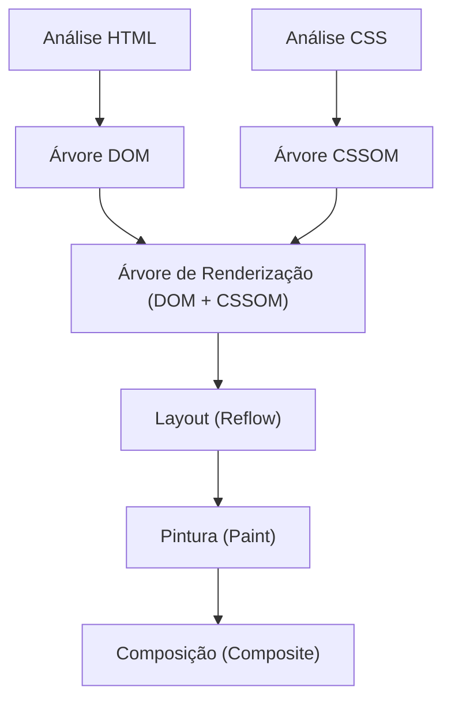

# Web Vitals e Otimização de Desempenho do Front-end (Melhorando LCP, FID e CLS)

No desenvolvimento web moderno, melhorar a experiência do usuário (UX) tornou-se um fator essencial diretamente ligado ao sucesso dos negócios. O Google propôs o **Core Web Vitals** como métricas para quantificar e avaliar a experiência do usuário na web. Neste artigo, a partir da perspectiva de otimização de desempenho do front-end, nos aprofundaremos nos critérios de medição detalhados e nos métodos de melhoria específicos para LCP, FID (e a métrica de próxima geração INP) e CLS, que compõem esses Core Web Vitals.

## 1. O Pipeline de Renderização do Navegador e o Desempenho

Para entender a otimização de desempenho do front-end, primeiro precisamos entender como o navegador converte HTML, CSS e JavaScript em pixels na tela, ou seja, o **pipeline de renderização**. Após receber recursos da rede, o navegador desenha a tela nas seguintes etapas.



1. **Parse (Análise)**: Quando o navegador recebe HTML, ele o analisa (parse) de cima para baixo e constrói a árvore DOM (Document Object Model). Ao mesmo tempo, ele analisa o CSS para construir a árvore CSSOM (CSS Object Model).
2. **Style (Cálculo de Estilo)**: Ele combina a árvore DOM e a árvore CSSOM para gerar uma árvore de renderização (render tree) que calcula quais estilos se aplicam a quais nós.
3. **Layout (Layout / Reflow)**: Com base na árvore de renderização, ele calcula onde e em que tamanho cada elemento será colocado na tela.
4. **Paint (Pintura)**: Com base nas informações de layout, ele desenha elementos visuais como texto, cores, imagens e bordas como pixels em camadas na memória.
5. **Composite (Composição)**: Ele sobrepõe múltiplas camadas na ordem correta e as exibe como a tela final.

A otimização de desempenho não é nada mais do que reduzir o tempo que cada etapa desse pipeline leva e evitar o bloqueio da thread principal (main thread). Em particular, a execução de JavaScript e cálculos pesados de CSS são os principais fatores que bloqueiam esse pipeline.

## 2. Compreensão Profunda e Métodos de Melhoria do LCP (Largest Contentful Paint)

### O que é o LCP?

**LCP (Largest Contentful Paint)** é uma métrica que mede o desempenho de carregamento de uma página. Especificamente, refere-se ao tempo decorrido desde que o usuário acessa a página até que o maior bloco de texto ou elemento de imagem na janela de visualização (viewport) seja renderizado.

- **Bom (Good)**: 2,5 segundos ou menos
- **Precisa de Melhorias (Needs Improvement)**: 2,5 a 4,0 segundos
- **Ruim (Poor)**: Mais de 4,0 segundos

### Principais Causas da Degradação do LCP

As causas da lentidão do LCP são divididas principalmente em quatro categorias.

1. **Tempo de resposta lento do servidor (atraso no TTFB)**
2. **JavaScript e CSS que bloqueiam a renderização**
3. **Longo tempo de carregamento de recursos (imagens, web fonts, etc.)**
4. **Dependência excessiva da renderização no lado do cliente (CSR)**

### Métodos de Melhoria do LCP

#### Pré-carregamento de Recursos (`preload` / `prefetch`)

Para carregar os elementos LCP (por exemplo, a imagem principal (hero image) ou as web fonts principais) de forma antecipada, utilizamos o `<link rel="preload">`. Isso permite que o download comece antes que o analisador (parser) do navegador descubra o recurso.

```html
<!-- Pré-carregamento da imagem hero -->
<link rel="preload" href="/images/hero-image.webp" as="image" />

<!-- Pré-carregamento de web fonts -->
<link rel="preload" href="/fonts/custom-font.woff2" as="font" type="font/woff2" crossorigin />

<!-- Conexão antecipada com domínios externos (como CDN) -->
<link rel="preconnect" href="https://fonts.gstatic.com" crossorigin />
```

#### Remoção de Recursos que Bloqueiam a Renderização

O CSS, por padrão, é um recurso que bloqueia a renderização. O navegador não desenhará a tela até que o CSSOM seja construído. Ao embutir o CSS crítico (CSS necessário para o "above the fold" ou o que é visível primeiro) e carregar outro CSS de forma assíncrona, você pode melhorar o LCP.

```html
<!-- Carregamento assíncrono de CSS não crítico -->
<link rel="stylesheet" href="non-critical.css" media="print" onload="this.media='all'" />
```

#### Otimização de Imagens

Como as imagens muitas vezes se tornam o elemento do LCP, uma otimização rigorosa é necessária.

- **Uso de formatos de próxima geração**: Use formatos com altas taxas de compressão como WebP ou AVIF.
- **Entrega de tamanhos adequados**: Use o atributo `srcset` para fornecer imagens com tamanhos que correspondam à largura da tela do dispositivo.

```html
<picture>
  <source srcset="hero-large.avif" media="(min-width: 1024px)" type="image/avif" />
  <source srcset="hero-small.avif" media="(max-width: 1023px)" type="image/avif" />
  
</picture>
```

Vale ressaltar que `loading="lazy"` (carregamento preguiçoso) não deve ser aplicado à imagem que será o elemento LCP. O tempo do LCP será atrasado. Ao adicionar explicitamente `fetchpriority="high"` ao elemento LCP, você pode aumentar sua prioridade.

## 3. FID (First Input Delay) e INP (Interaction to Next Paint)

### Diferença entre FID e INP

**FID (First Input Delay)** mede o tempo de atraso desde a primeira interação do usuário com a página (como um clique ou toque) até que o navegador responda a essa interação e comece a processar os manipuladores de eventos (event handlers).

- **Bom (Good)**: 100 milissegundos ou menos

No entanto, o FID tem como alvo apenas a "primeira entrada" e mede apenas o tempo "até o início da execução do manipulador de eventos". Como uma nova métrica introduzida para substituir isso, temos o **INP (Interaction to Next Paint)**. O INP monitora a latência de todas as interações do usuário que ocorrem ao longo do ciclo de vida de toda a página e avalia o atraso total desde o momento em que um evento ocorre até que a próxima pintura (Paint) seja realizada.

- **Bom (Good)**: 200 milissegundos ou menos

### Principais Causas da Degradação de FID/INP

A maior causa são as **Tarefas Longas (Long Tasks)** que ocupam a thread principal. Se houver uma tarefa que leve mais de 50 milissegundos para analisar (parse), compilar e executar o JavaScript, o navegador não poderá responder imediatamente à entrada do usuário.

### Métodos de Melhoria do FID/INP

#### Carregamento Assíncrono de Scripts (`async` / `defer`)

Use os atributos `async` ou `defer` para evitar que o carregamento do JavaScript bloqueie a análise do HTML.

```mermaid
gantt
    title "Estratégias de Carregamento de Script"
    dateFormat  s
    axisFormat  %S
    
    section "Normal <script>"
    "Análise HTML"                          :a1, 0, 2s
    "Download do Script"                    :a2, after a1, 2s
    "Execução do Script"                    :a3, after a2, 2s
    "Análise HTML (Retomada)"               :a4, after a3, 2s
    
    section "<script async>"
    "Análise HTML"                          :b1, 0, 4s
    "Download do Script"                    :b2, 0, 2s
    "Execução do Script"                    :b3, after b2, 2s
    "Análise HTML (Retomada)"               :b4, after b3, 2s
    
    section "<script defer>"
    "Análise HTML"                          :c1, 0, 6s
    "Download do Script"                    :c2, 0, 2s
    "Execução do Script"                    :c3, after c1, 2s
```



- `async`: A análise do HTML é interrompida assim que o download é concluído e o script é executado imediatamente. É adequado para scripts de terceiros sem dependências (como ferramentas de análise).
- `defer`: O script é baixado em segundo plano e executado após a conclusão da análise do HTML. É adequado para scripts que dependem do DOM.

#### Code Splitting (Divisão de Código)

Carregar um arquivo JavaScript agrupado (bundle) enorme de uma só vez bloqueará a thread principal por um longo tempo. Execute o **Code Splitting** para carregar apenas o código necessário no momento em que ele é necessário. Aqui está um exemplo de divisão de código em nível de componente em React.

```javascript
import React, { Suspense, lazy } from 'react';

// O HeavyComponent não é carregado no carregamento inicial, 
// ele é buscado assincronamente quando a renderização é necessária
const HeavyComponent = lazy(() => import('./components/HeavyComponent'));

function App() {
  return (
    <div>
      <h1>Otimização de Desempenho do Front-end</h1>
      {/* Fornece uma IU de fallback até que o componente seja carregado */}
      <Suspense fallback={<div>Carregando componente...</div>}>
        <HeavyComponent />
      </Suspense>
    </div>
  );
}

export default App;
```

#### Liberando a Thread Principal (Web Workers e Agendamento)

Para processos computacionais pesados, delegue-os para threads em segundo plano usando **Web Workers** ou divida as tarefas em pedaços menores usando `requestIdleCallback` ou `setTimeout` para criar tempo ocioso na thread principal (Yielding to the main thread).

## 4. Compreensão Profunda e Métodos de Melhoria do CLS (Cumulative Layout Shift)

### O que é o CLS?

**CLS (Cumulative Layout Shift)** é uma métrica que mede a estabilidade visual de uma página. Ele pontua o quanto ocorrem mudanças de layout inesperadas (o fenômeno em que o conteúdo se move abruptamente) durante o processo de carregamento da página.

- **Bom (Good)**: 0,1 ou menos
- **Precisa de Melhorias (Needs Improvement)**: 0,1 a 0,25
- **Ruim (Poor)**: Mais de 0,25

### Principais Causas da Degradação do CLS e Métodos de Melhoria

#### Nenhuma Tamanho Especificado para Imagens e iframes

O navegador não pode saber a proporção (aspect ratio) ou o tamanho de uma imagem até fazer o download dela. Por causa disso, no momento em que a imagem termina de carregar, o espaço é alocado e o texto ao redor é empurrado para baixo.

**Solução**: Sempre especifique os atributos `width` e `height`. Isso permite que o navegador calcule a proporção antes de baixar a imagem e reserve previamente o espaço de layout (placeholder).

```html
<!-- Bom: Especificando o tamanho para informar a proporção ao navegador -->

```

Se você o tornar responsivo com CSS, usar a propriedade `aspect-ratio` também é eficaz.

```css
.responsive-image {
  width: 100%;
  height: auto;
  aspect-ratio: 16 / 9;
}
```

Além disso, para imagens que não aparecem acima da dobra (first view), especificar `loading="lazy"` como no exemplo de código acima economiza largura de banda de rede e melhora o desempenho de carregamento inicial.

#### Conteúdo Inserido Dinamicamente (Anúncios ou Incorporações)

Banners de anúncios ou barras de notificação que são inseridos no DOM posteriormente via JavaScript são grandes causas de mudança de layout.

**Solução**: Reserve antecipadamente uma altura mínima (`min-height`) com CSS para os elementos contêineres onde esse conteúdo dinâmico será colocado.

```css
.ad-container {
  min-height: 250px;
  display: flex;
  justify-content: center;
  align-items: center;
}
```

#### FOIT/FOUT Causado por Web Fonts

O fenômeno onde o texto fica invisível até que a web font seja carregada é chamado de **FOIT (Flash of Invisible Text)**, e o fenômeno onde a largura ou altura do texto muda e causa deslocamento de layout no momento em que a fonte é trocada é chamado de **FOUT (Flash of Unstyled Text)**.

**Solução**: Especifique `font-display: swap;` em `@font-face`. Isso permite que você exiba o texto com uma fonte alternativa sem esperar pelo carregamento da fonte e o substitua após a conclusão do carregamento.

```css
@font-face {
  font-family: 'CustomFont';
  src: url('/fonts/custom-font.woff2') format('woff2');
  font-display: swap;
}
```

Como uma medida mais avançada, existem técnicas que usam `size-adjust` ou `ascent-override` no CSS para corresponder o máximo possível as métricas (altura da linha e largura do caractere) da fonte alternativa e da web font, minimizando o deslocamento de layout quando as fontes são trocadas.

## 5. Resumo

As métricas do Core Web Vitals (**LCP**, **FID/INP**, **CLS**) avaliam a experiência do usuário de diferentes perspectivas.

- Para melhorar o **LCP**, a otimização do caminho crítico (critical path) e o carregamento antecipado de recursos (imagens e fontes) são cruciais.
- Para melhorar o **FID/INP**, é necessário evitar a execução excessiva de JavaScript que bloqueia a thread principal e implementar a divisão de código (Code Splitting) ou a divisão de tarefas.
- Para melhorar o **CLS**, é importante manter a estabilidade visual reservando espaço para imagens e elementos incorporados antecipadamente e configurando adequadamente uma estratégia de carregamento de fontes.

Compreendendo profundamente o **pipeline de renderização** do navegador e identificando as causas básicas por trás da degradação de cada métrica, você pode alcançar uma otimização de desempenho eficaz e sustentável. Incorpore essas melhores práticas desde os estágios iniciais do projeto para oferecer o mais alto nível de experiência do usuário.
