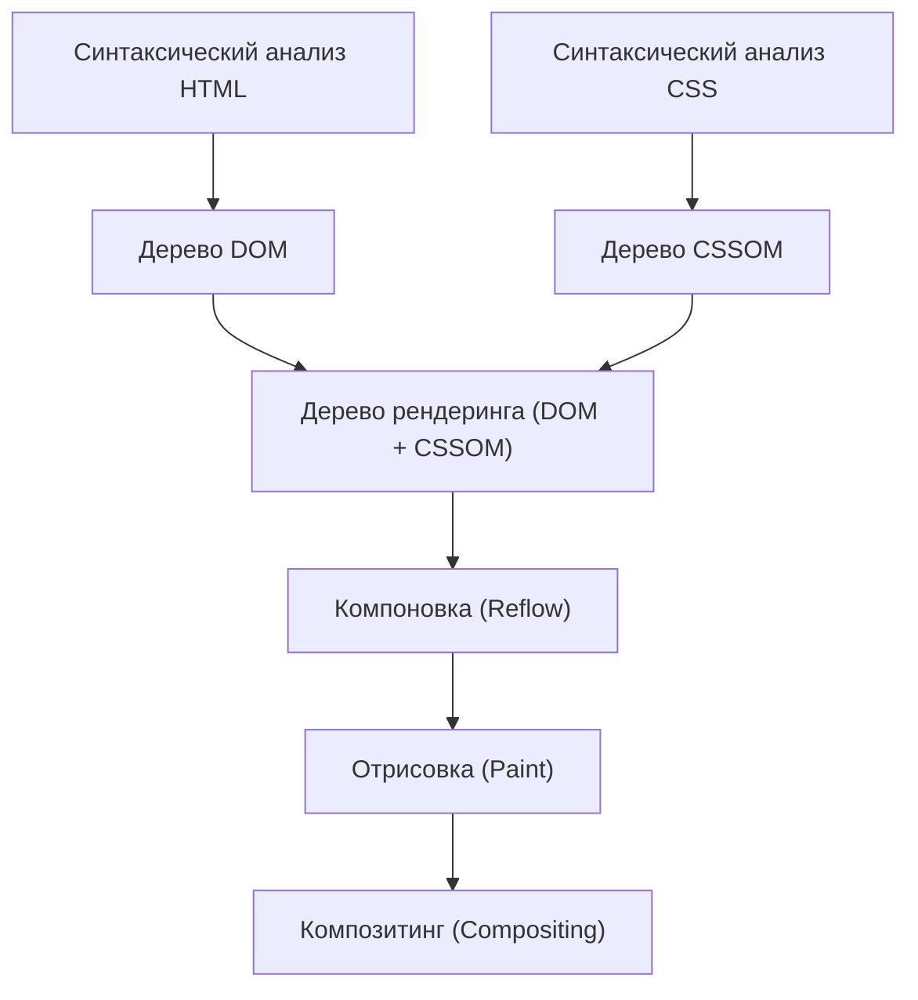

# Web Vitals и оптимизация производительности фронтенда (улучшение LCP, FID, CLS)

В современной веб-разработке улучшение пользовательского опыта (UX) стало важным фактором, напрямую связанным с успехом бизнеса. Google предложил **Core Web Vitals** как метрики для количественной оценки пользовательского опыта в интернете. В этой статье, с точки зрения оптимизации производительности фронтенда, мы подробно рассмотрим критерии измерения и конкретные методы улучшения для LCP, FID (и показателя следующего поколения INP), а также CLS, которые составляют эти Core Web Vitals.

## 1. Конвейер рендеринга браузера и производительность

Чтобы понять оптимизацию производительности фронтенда, в первую очередь необходимо понять, как браузер преобразует HTML, CSS и JavaScript в пиксели на экране, то есть **конвейер рендеринга**. После получения ресурсов из сети браузер отрисовывает экран, проходя через следующие этапы.



1. **Parse (Синтаксический анализ)** : При получении HTML браузер анализирует его сверху вниз и строит дерево DOM (Document Object Model). Одновременно он анализирует CSS и строит дерево CSSOM (CSS Object Model).
2. **Style (Вычисление стилей)** : Деревья DOM и CSSOM объединяются для создания дерева рендеринга, которое вычисляет, какие стили применяются к каким узлам.
3. **Layout (Компоновка / Reflow)** : На основе дерева рендеринга вычисляется, где и какого размера будет расположен каждый элемент на экране.
4. **Paint (Отрисовка)** : На основе информации о компоновке визуальные элементы, такие как текст, цвета, изображения и границы, отрисовываются как пиксели на слоях в памяти.
5. **Composite (Композитинг / Синтез)** : Несколько слоев накладываются в правильном порядке и выводятся в виде конечного экрана.

Оптимизация производительности заключается в сокращении времени, затрачиваемого на каждый шаг этого конвейера, и предотвращении блокировки основного потока. В частности, выполнение JavaScript и тяжелые вычисления CSS являются основными факторами блокировки этого конвейера.

## 2. Глубокое понимание и методы улучшения LCP (Largest Contentful Paint)

### Что такое LCP?

**LCP (Largest Contentful Paint)** — это показатель, измеряющий производительность загрузки страницы. В частности, это время с момента доступа пользователя к странице до момента рендеринга самого большого текстового блока или элемента изображения в пределах области просмотра (видимой области экрана).

- **Хорошо (Good)** : в пределах 2.5 секунд
- **Требует улучшения (Needs Improvement)** : от 2.5 до 4.0 секунд
- **Плохо (Poor)** : более 4.0 секунд

### Основные причины ухудшения LCP

Причины замедления LCP можно разделить на четыре основные категории:

1. **Медленное время ответа сервера (Задержка TTFB)** 
2. **JavaScript и CSS, блокирующие рендеринг** 
3. **Долгое время загрузки ресурсов (таких как изображения и веб-шрифты)** 
4. **Чрезмерная зависимость от рендеринга на стороне клиента (CSR)** 

### Методы улучшения LCP

#### Предварительная загрузка ресурсов (`preload` / `prefetch`)

Для ранней загрузки элементов LCP (например, главного изображения или основного веб-шрифта) используется `<link rel="preload">`. Это позволяет начать загрузку до того, как парсер браузера обнаружит ресурс.

```html
<!-- Предварительная загрузка главного изображения -->
<link rel="preload" href="/images/hero-image.webp" as="image" />

<!-- Предварительная загрузка веб-шрифта -->
<link rel="preload" href="/fonts/custom-font.woff2" as="font" type="font/woff2" crossorigin />

<!-- Раннее подключение к внешнему домену (например, CDN) -->
<link rel="preconnect" href="https://fonts.gstatic.com" crossorigin />
```

#### Устранение ресурсов, блокирующих рендеринг

По умолчанию CSS является ресурсом, блокирующим рендеринг. Браузер не будет отрисовывать экран до тех пор, пока не будет построено дерево CSSOM. Встраивание критического CSS (необходимого для первого экрана) и асинхронная загрузка остального CSS может улучшить LCP.

```html
<!-- Асинхронная загрузка некритического CSS -->
<link rel="stylesheet" href="non-critical.css" media="print" onload="this.media='all'" />
```

#### Оптимизация изображений

Поскольку изображения часто становятся элементами LCP, требуется тщательная оптимизация.

- **Использование форматов следующего поколения** : Используйте форматы с высокой степенью сжатия, такие как WebP и AVIF.
- **Доставка в подходящем размере** : Используйте атрибут `srcset` для предоставления изображений, размер которых соответствует ширине экрана устройства.

```html
<picture>
  <source srcset="hero-large.avif" media="(min-width: 1024px)" type="image/avif" />
  <source srcset="hero-small.avif" media="(max-width: 1023px)" type="image/avif" />
  
</picture>
```

Обратите внимание, что к изображениям, являющимся элементами LCP, не следует применять `loading="lazy"` (отложенная загрузка). Это задержит время LCP. Элементам LCP можно явно присвоить высокий приоритет с помощью `fetchpriority="high"`.

## 3. FID (First Input Delay) и INP (Interaction to Next Paint)

### Разница между FID и INP

**FID (First Input Delay)** измеряет время задержки с момента, когда пользователь впервые взаимодействует со страницей (например, клик или тап), до момента, когда браузер может отреагировать на это взаимодействие и начать обработку обработчиков событий.

- **Хорошо (Good)** : в пределах 100 миллисекунд

Однако FID применяется только к "первому вводу" и измеряет только время "до начала выполнения обработчика событий". В качестве нового показателя для замены FID был введен **INP (Interaction to Next Paint)**. INP отслеживает задержку всех пользовательских взаимодействий, происходящих на протяжении всего жизненного цикла страницы, и оценивает общую задержку с момента возникновения события до следующей отрисовки (Paint).

- **Хорошо (Good)** : в пределах 200 миллисекунд

### Основные причины ухудшения FID/INP

Самая большая причина — это **Long Tasks (продолжительные задачи), занимающие основной поток**. Если существует задача, на парсинг, компиляцию и выполнение JavaScript которой уходит более 50 миллисекунд, браузер не сможет мгновенно отреагировать на ввод пользователя.

### Методы улучшения FID/INP

#### Асинхронная загрузка скриптов (`async` / `defer`)

Чтобы предотвратить блокировку парсинга HTML загрузкой JavaScript, используйте атрибуты `async` или `defer`.

```mermaid
gantt
    title "Стратегии загрузки скриптов"
    dateFormat  s
    axisFormat  %S
    
    section "Обычный <script>"
    "Синтаксический анализ HTML"           :a1, 0, 2s
    "Загрузка скрипта"        :a2, after a1, 2s
    "Выполнение скрипта"       :a3, after a2, 2s
    "Синтаксический анализ HTML (Продолжение)" :a4, after a3, 2s
    
    section "<script async>"
    "Синтаксический анализ HTML"           :b1, 0, 4s
    "Загрузка скрипта"        :b2, 0, 2s
    "Выполнение скрипта"       :b3, after b2, 2s
    "Синтаксический анализ HTML (Продолжение)" :b4, after b3, 2s
    
    section "<script defer>"
    "Синтаксический анализ HTML"           :c1, 0, 6s
    "Загрузка скрипта"        :c2, 0, 2s
    "Выполнение скрипта"       :c3, after c1, 2s
```



- `async` : Выполняется немедленно после завершения загрузки, прерывая синтаксический анализ HTML. Подходит для независимых сторонних скриптов (например, аналитики).
- `defer` : Загружается в фоновом режиме и выполняется после завершения синтаксического анализа HTML. Подходит для скриптов, зависящих от DOM.

#### Разделение кода (Code Splitting)

Загрузка огромного объединенного JavaScript-файла за один раз надолго заблокирует основной поток. Применяйте **Разделение кода (Code Splitting)** для загрузки только необходимого кода в нужное время. Ниже приведен пример разделения кода на уровне компонентов в React.

```javascript
import React, { Suspense, lazy } from 'react';

// HeavyComponent не загружается при начальной загрузке, а получается асинхронно, когда требуется рендеринг
const HeavyComponent = lazy(() => import('./components/HeavyComponent'));

function App() {
  return (
    <div>
      <h1>Оптимизация производительности фронтенда</h1>
      {/* Предоставляет резервный UI до тех пор, пока компонент не будет загружен */}
      <Suspense fallback={<div>Загрузка компонента...</div>}>
        <HeavyComponent />
      </Suspense>
    </div>
  );
}

export default App;
```

#### Освобождение основного потока (Web Workers и планирование)

Передавайте тяжелые вычислительные процессы в фоновые потоки с помощью **Web Workers** или используйте `requestIdleCallback` и `setTimeout` для разделения задач на более мелкие части, освобождая время в основном потоке (Уступка основному потоку).

## 4. Глубокое понимание и методы улучшения CLS (Cumulative Layout Shift)

### Что такое CLS?

**CLS (Cumulative Layout Shift)** — это показатель, измеряющий визуальную стабильность страницы. Он оценивает, насколько сильно происходят неожиданные сдвиги макета (явление, при котором контент резко перемещается) в процессе загрузки страницы.

- **Хорошо (Good)** : 0.1 и ниже
- **Требует улучшения (Needs Improvement)** : от 0.1 до 0.25
- **Плохо (Poor)** : более 0.25

### Основные причины ухудшения CLS и методы улучшения

#### Размеры изображений или iframe не указаны

Браузер не может знать соотношение сторон или размер изображения до его загрузки. Из-за этого в момент завершения загрузки изображения для него выделяется пространство, сдвигая окружающий текст вниз.

**Решение**: Всегда указывайте атрибуты `width` и `height`. Это позволяет браузеру вычислить соотношение сторон до загрузки изображения и заранее зарезервировать пространство для макета (плейсхолдер).

```html
<!-- Good: Укажите размеры и сообщите браузеру соотношение сторон -->

```

Для того чтобы сделать их адаптивными с помощью CSS, также эффективно использовать свойство `aspect-ratio`.

```css
.responsive-image {
  width: 100%;
  height: auto;
  aspect-ratio: 16 / 9;
}
```

Кроме того, для изображений, не попадающих в область первого экрана, использование `loading="lazy"`, как в примере кода выше, помогает сэкономить пропускную способность сети и улучшить производительность начальной загрузки.

#### Динамически вставляемый контент (реклама и встраивания)

Рекламные баннеры и панели уведомлений, динамически вставляемые в DOM с помощью JavaScript, являются основными причинами сдвига макета.

**Решение**: Заранее зарезервируйте минимальную высоту (`min-height`) в CSS для элементов-контейнеров, в которые будет помещен этот динамический контент.

```css
.ad-container {
  min-height: 250px;
  display: flex;
  justify-content: center;
  align-items: center;
}
```

#### FOIT/FOUT из-за веб-шрифтов

Явление, при котором текст становится невидимым во время загрузки веб-шрифтов, называется **FOIT (Flash of Invisible Text)**, а явление, при котором ширина или высота текста изменяется в момент переключения шрифта, вызывая сдвиг макета, называется **FOUT (Flash of Unstyled Text)**.

**Решение**: Укажите `font-display: swap;` внутри `@font-face`. Это позволяет отображать текст с использованием резервного шрифта без ожидания загрузки основного шрифта, а затем заменить его после завершения загрузки.

```css
@font-face {
  font-family: 'CustomFont';
  src: url('/fonts/custom-font.woff2') format('woff2');
  font-display: swap;
}
```

В качестве более продвинутого решения существуют методы использования CSS-свойств, таких как `size-adjust` и `ascent-override`, для максимального совпадения метрик (высоты строки и ширины символов) резервного шрифта и веб-шрифта, минимизируя сдвиг макета при переключении шрифтов.

## 5. Заключение

Каждый из показателей Core Web Vitals (**LCP**, **FID/INP**, **CLS**) оценивает пользовательский опыт с разных точек зрения.

- Для улучшения **LCP** ключевым является оптимизация критического пути и ранняя загрузка ресурсов (изображений и шрифтов).
- Для улучшения **FID/INP** необходимо предотвращать выполнение избыточного JavaScript, блокирующего основной поток, и применять разделение кода (Code Splitting) и разделение задач.
- Для улучшения **CLS** важно заранее резервировать пространство для изображений и встроенных элементов, а также правильно настраивать стратегию загрузки шрифтов для поддержания визуальной стабильности.

Глубокое понимание **конвейера рендеринга** браузера и выявление коренных причин ухудшения каждого показателя позволит вам реализовать эффективную и устойчивую оптимизацию производительности. Внедрите эти передовые методы с самых ранних этапов вашего проекта, чтобы обеспечить пользовательский опыт высочайшего уровня.
