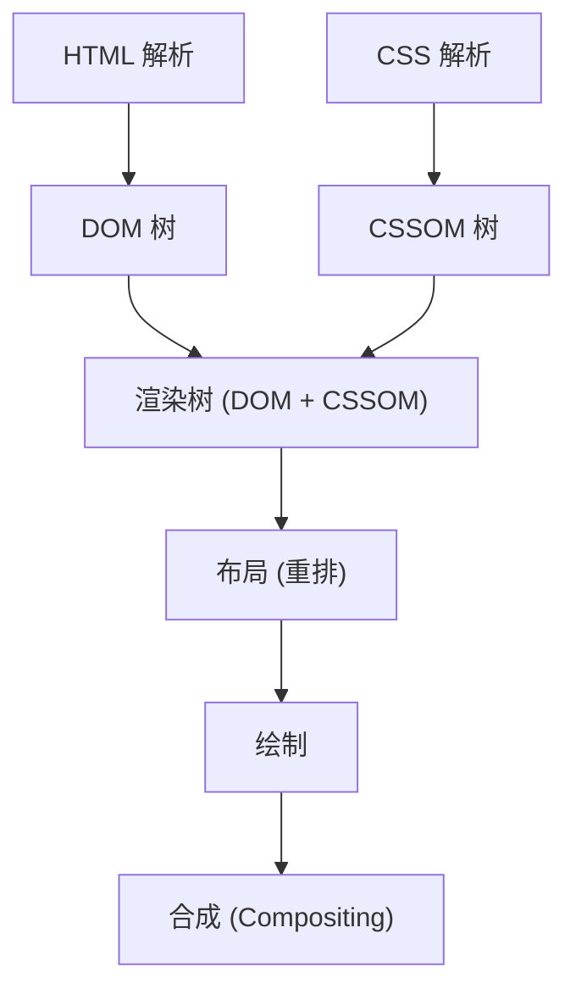

# Web Vitals 与前端性能优化（LCP, FID, CLS 的改进）

在近年的 Web 开发中，提升用户体验（UX）已成为直接关系到商业成功的重要因素。Google 提倡将 **Core Web Vitals** 作为量化和评估 Web 用户体验的指标。本文将从前端性能优化的角度，深入探讨构成这些 Core Web Vitals 的 LCP、FID（以及下一代指标 INP）和 CLS 的详细衡量标准及具体的改进方法。

## 1. 浏览器的渲染流水线与性能

为了理解前端性能优化，首先需要了解浏览器是如何将 HTML、CSS 和 JavaScript 转换为屏幕上的像素的，即了解 **渲染流水线** 。浏览器在从网络接收到资源后，会经过以下步骤来绘制屏幕：



1. **Parse (解析)** ：浏览器接收到 HTML 后，会从上到下依次进行解析，构建 DOM (Document Object Model) 树。同时，解析 CSS 并构建 CSSOM (CSS Object Model) 树。
2. **Style (样式计算)** ：结合 DOM 树和 CSSOM 树，计算哪些节点应用哪些样式，从而生成渲染树。
3. **Layout (布局 / 重排)** ：基于渲染树，计算每个元素在屏幕上的确切位置和大小。
4. **Paint (绘制)** ：根据布局信息，将文本、颜色、图像、边框等视觉元素作为像素绘制到内存中的图层上。
5. **Composite (合成)** ：将多个图层按正确的顺序叠加，输出为最终的屏幕画面。

性能优化无外乎缩短这条流水线每个步骤所需的时间，并防止阻塞主线程。特别是，JavaScript 的执行和繁重的 CSS 计算是阻塞这条流水线的主要因素。

## 2. 深入理解 LCP (Largest Contentful Paint) 及其改进方法

### LCP 是什么？

**LCP (Largest Contentful Paint)** 是衡量页面加载性能的指标。具体来说，它是指从用户访问页面开始，到视口（屏幕显示区域）内最大的文本块或图像元素渲染完成所需的时间。

- **良好 (Good)** ：2.5 秒以内
- **需要改进 (Needs Improvement)** ：2.5 秒 ～ 4.0 秒
- **不良 (Poor)** ：超过 4.0 秒

### 导致 LCP 恶化的主要原因

LCP 变慢的原因主要分为以下 4 种：

1. **服务器响应时间慢 (TTFB 延迟)** 
2. **阻塞渲染的 JavaScript 和 CSS** 
3. **资源（如图像、Web 字体等）加载时间长** 
4. **过度依赖客户端渲染 (CSR)** 

### LCP 的改进方法

#### 资源的预加载 (`preload` / `prefetch`)

为了尽早加载 LCP 元素（例如英雄图像或主要的 Web 字体），可以利用 `<link rel="preload">` 。这样浏览器解析器在发现资源之前就能开始下载。

```html
<!-- 英雄图像的预加载 -->
<link rel="preload" href="/images/hero-image.webp" as="image" />

<!-- Web 字体的预加载 -->
<link rel="preload" href="/fonts/custom-font.woff2" as="font" type="font/woff2" crossorigin />

<!-- 尽早连接到外部域名（如 CDN） -->
<link rel="preconnect" href="https://fonts.gstatic.com" crossorigin />
```

#### 消除阻塞渲染的资源

CSS 默认是阻塞渲染的资源。在 CSSOM 构建完成之前，浏览器不会绘制屏幕。通过内联关键 CSS（首屏所需的 CSS），并异步加载其他 CSS，可以改善 LCP。

```html
<!-- 非关键 CSS 的异步加载 -->
<link rel="stylesheet" href="non-critical.css" media="print" onload="this.media='all'" />
```

#### 图像的优化

由于图像通常是 LCP 元素，因此需要进行彻底的优化。

- **使用下一代格式** ：使用 WebP 或 AVIF 等具有高压缩率的格式。
- **提供合适尺寸** ：使用 `srcset` 属性，提供适合设备屏幕宽度的图像尺寸。

```html
<picture>
  <source srcset="hero-large.avif" media="(min-width: 1024px)" type="image/avif" />
  <source srcset="hero-small.avif" media="(max-width: 1023px)" type="image/avif" />
  
</picture>
```

需要注意的是，绝不能对作为 LCP 元素的图像应用 `loading="lazy"` （延迟加载）。这会延迟 LCP 的时机。通过为 LCP 元素显式添加 `fetchpriority="high"` ，可以提高其优先级。

## 3. FID (First Input Delay) 与 INP (Interaction to Next Paint)

### FID 与 INP 的区别

**FID (First Input Delay)** 测量的是从用户首次与页面交互（如点击或点击）开始，到浏览器能够响应这种交互并开始处理事件处理程序为止的延迟时间。

- **良好 (Good)** ：100 毫秒以内

然而，FID 仅针对“首次输入”，并且只测量到“事件处理程序开始执行为止”的时间。作为其替代方案引入的新指标是 **INP (Interaction to Next Paint)** 。INP 监控页面整个生命周期内发生的所有用户交互的延迟，评估从事件发生到下一次绘制 (Paint) 完成的整体延迟。

- **良好 (Good)** ：200 毫秒以内

### 导致 FID/INP 恶化的主要原因

最大的原因是 **占用主线程的 Long Tasks (耗时任务)** 。如果存在解析、编译或执行需要 50 毫秒以上的 JavaScript 任务，浏览器将无法立即响应用户的输入。

### FID/INP 的改进方法

#### 脚本的异步加载 (`async` / `defer`)

为了确保 JavaScript 的加载不会阻塞 HTML 解析，请使用 `async` 或 `defer` 属性。

```mermaid
gantt
    title "脚本加载策略"
    dateFormat  s
    axisFormat  %S
    
    section "普通 <script>"
    "HTML 解析"           :a1, 0, 2s
    "脚本下载"        :a2, after a1, 2s
    "脚本执行"       :a3, after a2, 2s
    "HTML 解析 (恢复)" :a4, after a3, 2s
    
    section "<script async>"
    "HTML 解析"           :b1, 0, 4s
    "脚本下载"        :b2, 0, 2s
    "脚本执行"       :b3, after b2, 2s
    "HTML 解析 (恢复)" :b4, after b3, 2s
    
    section "<script defer>"
    "HTML 解析"           :c1, 0, 6s
    "脚本下载"        :c2, 0, 2s
    "脚本执行"       :c3, after c1, 2s
```



- `async` ：下载完成后，中断 HTML 解析并立即执行。适用于没有依赖关系的第三方脚本（如分析工具等）。
- `defer` ：在后台下载，并在 HTML 解析完成后执行。适用于依赖 DOM 的脚本。

#### Code Splitting（代码分割）

如果一次性加载庞大且打包好的 JavaScript 文件，主线程将被长时间阻塞。通过 **Code Splitting** ，确保只在需要的时机加载必要的代码。以下是在 React 中进行组件级别代码分割的示例。

```javascript
import React, { Suspense, lazy } from 'react';

// HeavyComponent 不会在初始加载时读取，而是在需要渲染时异步获取
const HeavyComponent = lazy(() => import('./components/HeavyComponent'));

function App() {
  return (
    <div>
      <h1>前端性能优化</h1>
      {/* 提供在组件加载完成之前的回退 UI */}
      <Suspense fallback={<div>正在加载组件...</div>}>
        <HeavyComponent />
      </Suspense>
    </div>
  );
}

export default App;
```

#### 释放主线程（Web Workers 与调度）

繁重的计算处理可以使用 **Web Workers** 转移到后台线程，或者使用 `requestIdleCallback` 和 `setTimeout` 将任务细化分割，为主线程腾出空闲时间 (Yielding to the main thread)。

## 4. 深入理解 CLS (Cumulative Layout Shift) 及其改进方法

### CLS 是什么？

**CLS (Cumulative Layout Shift)** 是衡量页面视觉稳定性的指标。它对页面加载过程中发生的意外布局偏移（内容突然发生移动的现象）进行评分。

- **良好 (Good)** ：0.1 以下
- **需要改进 (Needs Improvement)** ：0.1 ～ 0.25
- **不良 (Poor)** ：超过 0.25

### 导致 CLS 恶化的主要原因及改进方法

#### 图像和 iframe 未指定尺寸

浏览器在下载完图像之前无法知道其宽高比或尺寸。因此，在图像加载完成的瞬间，会突然腾出空间，从而将周围的文本向下推挤。

**对策** ：务必指定 `width` 和 `height` 属性。这样，浏览器就能在下载图像之前计算宽高比，并提前预留布局所需的空间（占位符）。

```html
<!-- Good: 指定尺寸，告知浏览器宽高比 -->

```

如果使用 CSS 实现响应式，利用 `aspect-ratio` 属性也非常有效。

```css
.responsive-image {
  width: 100%;
  height: auto;
  aspect-ratio: 16 / 9;
}
```

此外，对于不在首屏显示的图像，如上述代码示例中指定 `loading="lazy"` ，可以节省网络带宽并提升初始加载性能。

#### 动态插入的内容（广告或嵌入内容）

通过 JavaScript 后期插入到 DOM 中的广告横幅或通知栏，是造成布局偏移的主要原因。

**对策** ：对于这些包含动态内容的容器元素，通过 CSS 提前预留最小高度 (`min-height`)。

```css
.ad-container {
  min-height: 250px;
  display: flex;
  justify-content: center;
  align-items: center;
}
```

#### Web 字体导致的 FOIT/FOUT

在 Web 字体加载完成之前文本不可见的现象被称为 **FOIT (Flash of Invisible Text)** ，而在字体切换的瞬间文本的宽度或高度发生变化导致布局偏移的现象被称为 **FOUT (Flash of Unstyled Text)** 。

**对策** ：在 `@font-face` 中指定 `font-display: swap;` 。这样一来，在等待字体加载时会先用备用字体显示文本，加载完成后再进行替换。

```css
@font-face {
  font-family: 'CustomFont';
  src: url('/fonts/custom-font.woff2') format('woff2');
  font-display: swap;
}
```

作为更高级的对策，还可以利用 CSS 的 `size-adjust` 或 `ascent-override` 等属性，尽可能使备用字体和 Web 字体的度量标准（行高或字符宽度）保持一致，将字体切换时的布局偏移降至最低。

## 5. 总结

Core Web Vitals 的各项指标（ **LCP** 、 **FID/INP** 、 **CLS** ）分别从不同角度评估了用户体验。

- 改善 **LCP** 的关键在于优化关键路径，并尽早加载资源（图像或字体）。
- 改善 **FID/INP** 需要防止执行过多且阻塞主线程的 JavaScript，并进行 Code Splitting 或任务分割。
- 改善 **CLS** 需要提前预留图像或嵌入元素的空间，并适当设置字体加载策略，从而保持视觉上的稳定性。

通过深入理解浏览器的 **渲染流水线** ，并找出导致各指标恶化的根本原因，可以实现有效且可持续的性能优化。在项目的初期阶段就引入这些最佳实践，为用户提供最高水准的体验吧。
