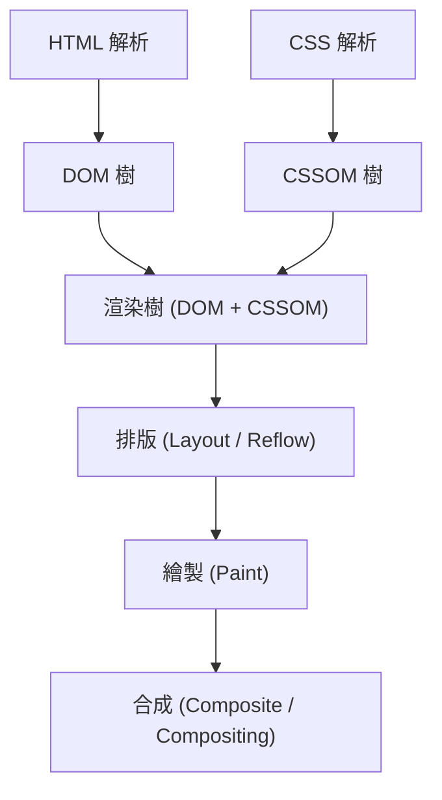

# Web Vitals 與前端效能最佳化（改善 LCP, FID, CLS）

在近年的網頁開發中，提升使用者體驗（UX）已經成為直接影響商業成功的關鍵要素。Google 提倡了 **Core Web Vitals** （網站核心指標）作為量化並評估網頁使用者體驗的指標。本文將從前端效能最佳化的觀點出發，深入探討構成這些 Core Web Vitals 的 LCP、FID（以及次世代指標 INP）、CLS 的詳細測量基準與具體的改善手法。

## 1. 瀏覽器的渲染管線與效能

為了解前端效能最佳化，首先必須了解瀏覽器是如何將 HTML、CSS、JavaScript 轉換為螢幕上的像素，也就是所謂的 **渲染管線** （Rendering Pipeline）。瀏覽器在從網路接收資源後，會經過以下步驟來繪製畫面。



1. **解析 (Parse)** ：瀏覽器在接收到 HTML 時，會由上而下進行解析（Parse），並建構 DOM（Document Object Model）樹。同時也會解析 CSS 並建構 CSSOM（CSS Object Model）樹。
2. **樣式計算 (Style)** ：將 DOM 樹與 CSSOM 樹結合，計算出哪個節點應該套用哪種樣式，藉此生成渲染樹（Render Tree）。
3. **排版 (Layout / Reflow)** ：根據渲染樹，計算每個元素在螢幕上的位置以及大小。
4. **繪製 (Paint)** ：根據排版資訊，將文字、顏色、圖片、邊框等視覺元素作為像素繪製到記憶體的圖層（Layer）上。
5. **合成 (Composite)** ：將多個圖層以正確的順序疊加，並輸出為最終的畫面。

效能最佳化的本質，就是在於縮短這條管線各步驟所花費的時間，並防止主執行緒（Main Thread）被阻塞。特別是 JavaScript 的執行或是繁重的 CSS 計算，往往是阻塞此管線的主要原因。

## 2. 深入了解 LCP (Largest Contentful Paint) 與改善手法

### 什麼是 LCP？

**LCP (Largest Contentful Paint)** 是用來測量網頁載入效能的指標。具體來說，是指使用者進入網頁後，到可視區域（Viewport）內最大的文字區塊或圖片元素渲染完成為止所花費的時間。

- **良好 (Good)** ：2.5 秒以內
- **需要改善 (Needs Improvement)** ：2.5 秒 ～ 4.0 秒
- **不良 (Poor)** ：超過 4.0 秒

### LCP 惡化的主要原因

導致 LCP 變慢的原因，主要可分為以下四種：

1. **伺服器回應時間過慢（TTFB 延遲）** 
2. **阻塞渲染的 JavaScript 與 CSS** 
3. **資源（圖片或網頁字型等）的載入時間過長** 
4. **過度依賴用戶端渲染（CSR）** 

### LCP 的改善手法

#### 資源的預先載入 (`preload` / `prefetch`)

為了提早載入 LCP 元素（例如主視覺圖片或主要的網頁字型），可以使用 `<link rel="preload">` 。這樣一來，便能在瀏覽器的解析器發現資源之前開始下載。

```html
<!-- 預先載入主視覺圖片 -->
<link rel="preload" href="/images/hero-image.webp" as="image" />

<!-- 預先載入網頁字型 -->
<link rel="preload" href="/fonts/custom-font.woff2" as="font" type="font/woff2" crossorigin />

<!-- 提早連接外部網域（如 CDN 等） -->
<link rel="preconnect" href="https://fonts.gstatic.com" crossorigin />
```

#### 排除阻塞渲染的資源

CSS 預設是阻塞渲染的資源。在 CSSOM 建構完成之前，瀏覽器不會繪製畫面。透過將關鍵 CSS（Critical CSS，即首屏所需的 CSS）內聯（Inline），並非同步載入其餘的 CSS，可以改善 LCP。

```html
<!-- 非同步載入非關鍵的 CSS -->
<link rel="stylesheet" href="non-critical.css" media="print" onload="this.media='all'" />
```

#### 圖片最佳化

因為圖片通常會成為 LCP 元素，所以需要徹底的最佳化。

- **使用次世代圖片格式** ：使用 WebP 或 AVIF 等具備高壓縮率的格式。
- **提供合適的尺寸** ：使用 `srcset` 屬性，提供配合裝置螢幕寬度的圖片。

```html
<picture>
  <source srcset="hero-large.avif" media="(min-width: 1024px)" type="image/avif" />
  <source srcset="hero-small.avif" media="(max-width: 1023px)" type="image/avif" />
  
</picture>
```

此外，絕對不可以對成為 LCP 元素的圖片套用 `loading="lazy"` （延遲載入）。這會導致 LCP 觸發的時間變慢。針對 LCP 元素，應明確加上 `fetchpriority="high"` 以提高其載入優先度。

## 3. FID (First Input Delay) 與 INP (Interaction to Next Paint)

### FID 與 INP 的差異

**FID (First Input Delay)** 是用來測量從使用者首次與網頁互動（例如點擊或輕觸），到瀏覽器確實開始處理事件處理器（Event Handler）以回應互動為止的延遲時間。

- **良好 (Good)** ：100 毫秒以內

然而，FID 只針對「首次輸入」，而且只測量「到事件處理器開始執行為止」的時間。為了解決這個問題，引入了新的指標 **INP (Interaction to Next Paint)** 。INP 會監控網頁整個生命週期中發生的所有使用者互動的延遲，並評估從事件發生到下一次繪製（Paint）完成為止的整體延遲。

- **良好 (Good)** ：200 毫秒以內

### FID/INP 惡化的主要原因

最主要的原因是 **佔用主執行緒的長時間任務 (Long Tasks)** 。如果 JavaScript 的解析、編譯或執行存在耗時超過 50 毫秒的任務，瀏覽器就無法立即回應使用者的輸入。

### FID/INP 的改善手法

#### 腳本的非同步載入 (`async` / `defer`)

為了避免 JavaScript 的載入阻塞 HTML 的解析，可以使用 `async` 或 `defer` 屬性。

```mermaid
gantt
    title "腳本載入策略 (Script Loading Strategies)"
    dateFormat  s
    axisFormat  %S
    
    section "一般的 <script>"
    HTML 解析 (Parsing)           :a1, 0, 2s
    腳本下載 (Script Download)        :a2, after a1, 2s
    腳本執行 (Script Execution)       :a3, after a2, 2s
    HTML 解析 (Parsing Resumed) :a4, after a3, 2s
    
    section "<script async>"
    HTML 解析 (Parsing)           :b1, 0, 4s
    腳本下載 (Script Download)        :b2, 0, 2s
    腳本執行 (Script Execution)       :b3, after b2, 2s
    HTML 解析 (Parsing Resumed) :b4, after b3, 2s
    
    section "<script defer>"
    HTML 解析 (Parsing)           :c1, 0, 6s
    腳本下載 (Script Download)        :c2, 0, 2s
    腳本執行 (Script Execution)       :c3, after c1, 2s
```



- `async` ：下載完成後，會中斷 HTML 解析並立即執行。適合用於沒有相依性的第三方腳本（例如分析工具）。
- `defer` ：會在背景進行下載，並在 HTML 解析完成後才執行。適合用於依賴 DOM 的腳本。

#### Code Splitting（程式碼分割）

如果一次載入打包好的巨大 JavaScript 檔案，會導致主執行緒長時間被阻塞。透過 **Code Splitting** ，可以做到只在需要的時機載入所需的程式碼。以下是 React 中元件級別的程式碼分割範例。

```javascript
import React, { Suspense, lazy } from 'react';

// HeavyComponent 不會在初始載入時被讀取，而是會在需要渲染的時機非同步取得
const HeavyComponent = lazy(() => import('./components/HeavyComponent'));

function App() {
  return (
    <div>
      <h1>前端效能最佳化</h1>
      {/* 在元件載入完成前，提供後備的（Fallback） UI */}
      <Suspense fallback={<div>Loading component...</div>}>
        <HeavyComponent />
      </Suspense>
    </div>
  );
}

export default App;
```

#### 釋放主執行緒（Web Workers 與任務排程）

繁重的運算處理可以使用 **Web Workers** 移交給背景執行緒，或是使用 `requestIdleCallback` 與 `setTimeout` 將任務細分，藉此在主執行緒中製造空閒時間（Yielding to the main thread）。

## 4. 深入了解 CLS (Cumulative Layout Shift) 與改善手法

### 什麼是 CLS？

**CLS (Cumulative Layout Shift)** 是用來測量網頁視覺穩定性的指標。它會將網頁載入過程中發生的意外排版位移（內容突然劇烈移動的現象）量化為分數。

- **良好 (Good)** ：0.1 以下
- **需要改善 (Needs Improvement)** ：0.1 ～ 0.25
- **不良 (Poor)** ：超過 0.25

### CLS 惡化的主要原因與改善手法

#### 圖片或 iframe 未指定尺寸

瀏覽器在下載圖片之前無法得知其長寬比或尺寸。因此，在圖片下載完成的瞬間會突然佔據空間，進而將周圍的文字往下推擠。

**解決對策**：務必指定 `width` 與 `height` 屬性。如此一來，瀏覽器就能在下載圖片前計算長寬比，並預先保留排版用的空間（Placeholder）。

```html
<!-- Good: 指定尺寸，讓瀏覽器知道長寬比 -->

```

如果是使用 CSS 來實現響應式設計（Responsive Design），活用 `aspect-ratio` 屬性也非常有效。

```css
.responsive-image {
  width: 100%;
  height: auto;
  aspect-ratio: 16 / 9;
}
```

此外，針對不會進入首屏（First View）的圖片，就像上述程式碼範例一樣指定 `loading="lazy"` ，將有助於節省網路頻寬並提升初期載入的效能。

#### 動態插入的內容（廣告或嵌入內容）

透過 JavaScript 事後插入 DOM 的廣告橫幅或通知列，是造成排版位移的一大原因。

**解決對策**：針對這些放置動態內容的容器元素，預先使用 CSS 設定最小高度（ `min-height` ）。

```css
.ad-container {
  min-height: 250px;
  display: flex;
  justify-content: center;
  align-items: center;
}
```

#### 網頁字型造成的 FOIT/FOUT

在網頁字型載入完成前，文字會變成不可見的現象稱為 **FOIT (Flash of Invisible Text)** ；而在字型切換的瞬間，文字的寬度或高度改變導致排版位移的現象則稱為 **FOUT (Flash of Unstyled Text)** 。

**解決對策**：在 `@font-face` 中指定 `font-display: swap;` 。這樣就能在不等待字型載入的情況下，先用替代字型顯示文字，等到載入完成後再進行替換。

```css
@font-face {
  font-family: 'CustomFont';
  src: url('/fonts/custom-font.woff2') format('woff2');
  font-display: swap;
}
```

更進階的對策，是利用 CSS 的 `size-adjust` 或 `ascent-override` 等屬性，盡可能讓替代字型與網頁字型的排版尺寸（行高或字距等）保持一致，將字型切換時的排版位移降到最低。

## 5. 總結

Core Web Vitals 的各項指標（ **LCP** 、 **FID/INP** 、 **CLS** ）分別從不同的角度來評估使用者體驗。

- 要改善 **LCP** ，關鍵在於優化關鍵轉譯路徑（Critical Rendering Path）以及及早載入資源（圖片或字型）。
- 要改善 **FID/INP** ，必須防止過度執行會阻塞主執行緒的 JavaScript，並進行 Code Splitting 或是任務的切割。
- 要改善 **CLS** ，重要的是預先保留圖片或嵌入元素的空間，並設定合適的字型載入策略，藉此維持視覺的穩定性。

透過深入了解瀏覽器的 **渲染管線** ，並找出導致各項指標惡化的根本原因，就能夠實現有效且可持續的效能最佳化。讓我們從專案初期就導入這些最佳實踐，提供最高水準的使用者體驗吧。
