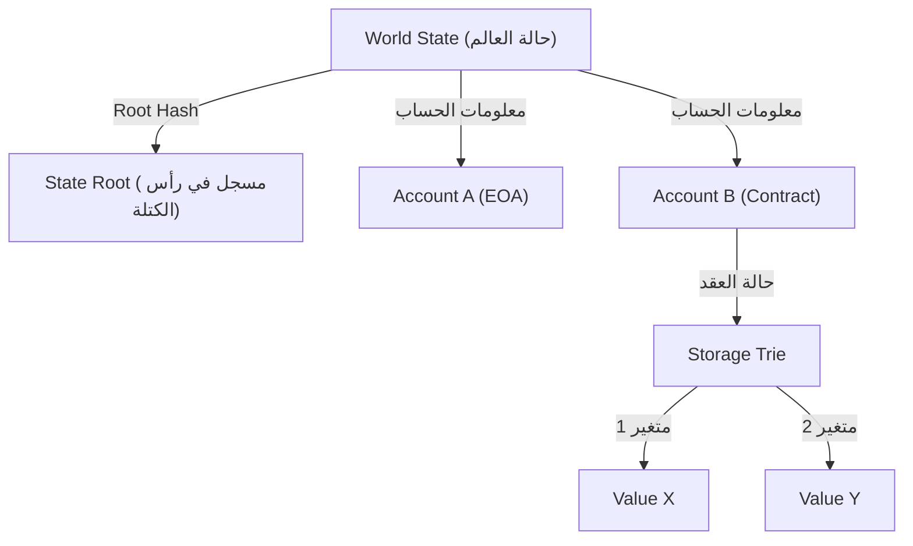

# هيكلية العقود الذكية وآلة إيثريوم الافتراضية (EVM): كيف تعمل أجهزة الكمبيوتر اللامركزية حيث "الكود هو القانون"

بالنظر إلى تاريخ تكنولوجيا البلوكتشين (Blockchain)، في حين أن بيتكوين (Bitcoin) أنشأت مفهوم "العملة الرقمية اللامركزية"، فقد مهدت إيثريوم (Ethereum) الطريق لـ "الكمبيوتر اللامركزي". في قلب هذه الثورة توجد "العقود الذكية (Smart Contracts)" وأساس تنفيذها، "آلة إيثريوم الافتراضية (EVM - Ethereum Virtual Machine)".

في هذه المقالة، سنتعمق في كيفية عمل العقود الذكية، والبنية التي تمتلكها EVM، ولماذا تم تصميمها بهذه الطريقة من منظور تقني.

## 1. لماذا كانت إيثريوم ضرورية؟: حدود سكربت بيتكوين

تم اقتراح مفهوم العقود الذكية نفسه من قبل عالم التشفير نيك سزابو (Nick Szabo) في التسعينيات، لكن تكنولوجيا البلوكتشين هي التي وضعتها موضع التنفيذ. تحتوي بيتكوين أيضًا على لغة برمجة نصية (Bitcoin Script) للتحقق من صحة المعاملات. ومع ذلك، تم تصميم سكربت بيتكوين عمدًا ليكون "غير مكتمل لتورينج (Turing Incomplete)".

عدم اكتمال تورينج يعني، بعبارات بسيطة، أنه لا يحتوي على "حلقات (Loops)" أو "تشعبات شرطية معقدة". كان هناك سبب واضح لهذا. نظرًا لأن جميع العقد (Nodes) على البلوكتشين تتحقق من المعاملات، فإذا أرسل مستخدم خبيث نصًا يسبب "حلقة لا نهائية (Infinite Loop)"، فسيؤدي ذلك إلى خلق نقطة ضعف لهجوم "حجب الخدمة (DoS)" الذي سيؤدي إلى تجميد جميع العقد في الشبكة بأكملها.

ولكن بسبب عدم اكتمال تورينج هذا، كان من الصعب جدًا بناء عقود مالية معقدة وتطبيقات لامركزية (DApps) باستخدام سكربت بيتكوين. أدرك فيتاليك بوتيرين (Vitalik Buterin) بشدة الحاجة إلى منصة بلوكتشين "مكتملة لتورينج (Turing Complete)" حيث يمكن لأي شخص تنفيذ أي منطق عن طريق إزالة هذا القيد. وكانت هذه القوة الدافعة وراء ولادة إيثريوم.

## 2. ما هي آلة إيثريوم الافتراضية (EVM)؟

تعتبر EVM قلب شبكة إيثريوم ويتم وصفها بأنها "كمبيوتر لامركزي عالمي". الآلاف من العقد المنتشرة في جميع أنحاء العالم تشترك في نفس الحالة (State) تمامًا وتنفذ نفس الكود.

إن EVM هي "آلة افتراضية (Virtual Machine)" لا تعتمد على أجهزة أو أنظمة تشغيل معينة. تشبه JVM (آلة جافا الافتراضية) في لغة Java، لكن EVM تختلف في أنها تعمل بشكل متزامن على العقد حول العالم. يكتب المطورون عقودًا ذكية بلغات عالية المستوى مثل Solidity أو Vyper، ويتم تشغيل "الرمز الثانوي (Bytecode)" الناتج عن تجميعها على EVM.

### نموذج التنفيذ لآلة المكدس (Stack Machine)

الميزة الأبرز في بنية EVM هي أنها "آلة مكدس (Stack Machine)". على عكس آلات المسجلات (مثل بنية وحدة المعالجة المركزية العامة x86 أو ARM)، تستخدم EVM بنية بيانات تسمى "المكدس (Stack)" (LIFO: ما يدخل أخيرًا يخرج أولاً) لإجراء العمليات الحسابية.

على سبيل المثال، لإجراء عملية حسابية مثل "2 + 3"، سيبدو كود التجميع لـ EVM (Opcode) كالتالي:

1. `PUSH1 0x02` (دفع 2 إلى المكدس)
2. `PUSH1 0x03` (دفع 3 إلى المكدس)
3. `ADD` (إخراج القيمتين من المكدس، وجمعهما، ودفع النتيجة 5 إلى المكدس)

تتمثل ميزة آلة المكدس في أن أكواد التشغيل (Opcodes) بسيطة، مما يجعل من السهل الحفاظ على تنفيذ الآلة الافتراضية خفيف الوزن وآمن. نظرًا لأن عقد إيثريوم مطلوبة للعمل حتى على الأجهزة ذات المواصفات المنخفضة، فإن هذه الخفة مهمة للغاية. يقتصر عمق المكدس على 1024 كحد أقصى، ويكون حجم البيانات التي يتم التعامل معها أساسه طول كلمة 256 بت (32 بايت). هذا التصميم مخصص لحساب التجزئة المشفرة (Keccak-256) والتوقيعات (secp256k1) بكفاءة.

## 3. التصميم العبقري لحل "مشكلة الحلقة اللانهائية": الغاز (Gas)

مع إدخال إيثريوم للغة برمجة مكتملة لتورينج، ظهر الخطر القاتل المتمثل في "توقف الشبكة بسبب الحلقات اللانهائية" المذكور أعلاه. تم حل هذه المشكلة بأناقة من خلال تصميم حافز يسمى "الغاز (Gas)".

الغاز هو "الوقود" المستهلك عند إجراء العمليات الحسابية أو تخزين البيانات على EVM. عندما ينفذ المستخدم عقدًا ذكيًا (يصدر معاملة)، يجب أن يدفع رسومًا بعملة ETH (إيثر) لتنفيذ تلك المعاملة.

- كل أمر تشغيل (Opcode) له تكلفة غاز محددة وفقًا لمدى تعقيده الحسابي. على سبيل المثال، عملية حسابية بسيطة (`ADD`) رخيصة جدًا (3 Gas)، في حين أن عملية تخزين البيانات الدائمة على البلوكتشين (`SSTORE`) مكلفة للغاية (20,000 Gas).
- يقوم مرسل المعاملة بتعيين "حد الغاز (Gas Limit - الحد الأقصى الذي لن يتم استهلاكه أكثر منه)" و"سعر الغاز (Gas Price - سعر ETH لكل وحدة غاز)" مسبقًا.
- في كل مرة تنفذ فيها EVM سطرًا من التعليمات البرمجية، يتم خصم الغاز من حد الغاز المحدد.
- إذا دخل في حلقة لا نهائية ونفد الغاز (Out of Gas)، يتم إنهاء تنفيذ المعاملة قسريًا (Revert) في تلك النقطة، وتعود الحالة إلى ما قبل التنفيذ. ومع ذلك، **يتم دفع الغاز المستهلك (الرسوم) للمُعدِّن (أو المُدقِّق)، ولا يتم استرداده**.

من خلال هذه الآلية، حتى إذا أرسل المهاجم معاملة بحلقة لا نهائية، فلن يستنفد سوى أمواله الخاصة (ETH)، ولن يؤثر على الشبكة بأكملها. من خلال إدخال "التكلفة الاقتصادية"، فإن حل مشكلة التوقف (Halting Problem) في بيئة مكتملة لتورينج في العالم الحقيقي هو أحد أعظم إنجازات إيثريوم.

## 4. نموذج حالة العالم: إدارة الحالة باستخدام Patricia Trie

بينما تستخدم بيتكوين نموذج UTXO (مخرجات المعاملات غير المنفقة)، تعتمد إيثريوم "نموذج الحالة المستند إلى الحساب (Account-based State Model)".

هناك نوعان من الحسابات في عالم إيثريوم:
1. **EOA (Externally Owned Account - حساب مملوك خارجيًا)**: حساب عام يديره شخص بواسطة مفتاح خاص.
2. **Contract Account (حساب العقد)**: حساب يحتوي على كود وبيانات العقد الذكي. ليس له مفتاح خاص ويتم التحكم فيه حصريًا عن طريق الكود.

تتم إدارة حالة شبكة إيثريوم بأكملها (أرصدة جميع الحسابات وبيانات العقود الذكية) كـ "حالة عالمية (World State)". لإدارة بنية البيانات الضخمة هذه بكفاءة وأمان، ولجعلها غير قابلة للتلاعب، تستخدم إيثريوم بنية بيانات تسمى "Modified Merkle Patricia Trie (شجرة ميركل باتريشيا المعدلة)".

تتمثل ميزة هذا الهيكل في أنه من السهل إنشاء "إثباتات تشفير" لحالة معينة. حتى إذا تغير جزء صغير فقط من الحالة (على سبيل المثال، متغير واحد لعقد ما)، فإن تجزئة الجذر (Root Hash) تتغير في سلسلة، لذلك يمكن اكتشاف عدم تناسق الحالة أو التلاعب بها على الفور عبر الشبكة بأكملها. وهذا يسمح للعقد بمزامنة كميات هائلة من البيانات والتحقق منها بكفاءة.

## 5. دورة حياة كود Solidity: من النشر إلى التنفيذ

أخيرًا، دعونا نلقي نظرة على دورة حياة الكود المكتوب بلغة Solidity بواسطة مطور، وكيف يعمل كـ "قانون" على إيثريوم.

### 1. التجميع (Compilation)
يتم تحويل الكود المصدري لـ Solidity الذي يكتبه المطور بواسطة المترجم (`solc`) إلى "رمز ثانوي (Bytecode)" يمكن لـ EVM فهمه، وإلى "ABI (واجهة التطبيق الثنائية)" التي تحدد واجهة العقد.

### 2. النشر (Creation Transaction)
يتم إرسال الرمز الثانوي المجمّع إلى الشبكة كمعاملة خاصة يكون فيها المستلم (`to`) فارغًا (null). عندما يتم تضمين هذه المعاملة في كتلة، تنفذ EVM كود التهيئة وتخزن الرمز الثانوي النهائي للعقد في عنوان جديد في الحالة العالمية. في هذه اللحظة، يصبح العقد دائمًا على البلوكتشين وفي حالة لا يمكن حذفه أو تغييره أبدًا (ما لم يتم استدعاء `selfdestruct`).

### 3. التنفيذ (Message Call)
يتم تنفيذ العقد عندما يرسل مستخدم (EOA) أو عقد ذكي آخر معاملة تحتوي على بيانات استدعاء الوظيفة (محدد الوظيفة والوسائط). تقرأ EVM الرمز الثانوي للعقد من الحالة العالمية، وتدير آلة المكدس بالبيانات المحددة كمدخلات، وتقوم بتحديث الحالة.

### المعنى الحقيقي لـ "الكود هو القانون (Code is Law)"

بمجرد نشر العقد الذكي، لا يمكن لأي شخص تغييره ويعمل فقط كما تمت برمجته. لا توجد رقابة، ولا توقف، ولا تدخل من طرف ثالث. تعتمد البروتوكولات المالية (DeFi) والمنظمات المستقلة اللامركزية (DAO) على طبيعة "الكود الذي لا يمكن إيقافه".

ومع ذلك، في الوقت نفسه، هذا يعني الحقيقة القاسية المتمثلة في أن "الأخطاء البرمجية (Bugs) تصبح أيضًا قانونًا". إذا كان هناك ثغرة أمنية في الكود، فسيتم استنزاف الأموال بلا رحمة (حادثة The DAO هي مثال نموذجي). لذلك، يتطلب تطوير العقود الذكية مستوى مختلفًا من عمليات تدقيق الأمان وتصميمات الأمان المعطل (Fail-safe) مقارنة بتطوير الويب التقليدي.

## الخلاصة

جلب ظهور إيثريوم و EVM "القابلية للبرمجة" إلى البلوكتشين، الذي كان مجرد شبكة دفع، وفتح نموذجًا جديدًا يسمى Web3.
على الرغم من كسر قيود سكربت بيتكوين غير المكتمل لتورينج، فإنها تحقق الرؤية الكبرى للكمبيوتر اللامركزي من خلال الجمع بين الحوافز الاقتصادية عبر الغاز (Gas)، والإدارة القوية للحالة باستخدام Patricia Trie، وآلة مكدس (EVM) بسيطة وقوية.

سيكون الفهم العميق لبنية العقود الذكية هو الخطوة الأولى لمعرفة إمكانيات وحدود الأنظمة اللامركزية في عصر Web3 وبناء تطبيقات لامركزية (DApps) أكثر أمانًا وابتكارًا.
