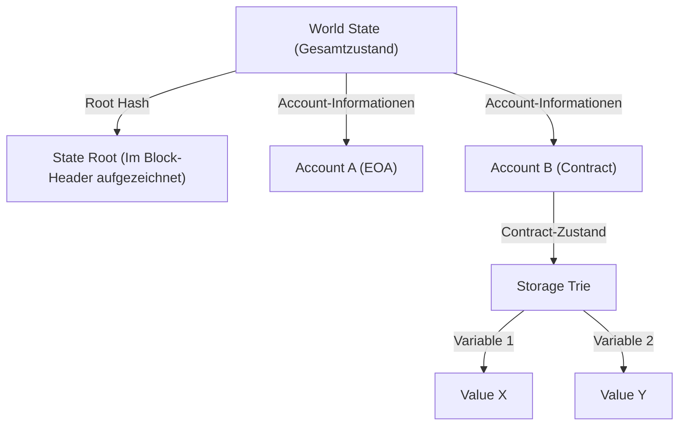

# Die Struktur von Smart Contracts und der EVM (Ethereum Virtual Machine): Wie der dezentrale Computer funktioniert, bei dem "Code is Law" gilt

Wenn wir die Geschichte der Blockchain-Technologie betrachten, so etablierte Bitcoin das Konzept einer "dezentralen digitalen Währung", während Ethereum den Weg als "dezentraler Computer" ebnete. Im Zentrum dieser Revolution stehen "Smart Contracts" und die "EVM (Ethereum Virtual Machine)", die als Grundlage für ihre Ausführung dient.

In diesem Artikel werden wir aus einer technischen Perspektive tiefgehend analysieren, wie Smart Contracts funktionieren, welche Architektur die EVM besitzt und warum sie so entworfen wurde.

## 1. Warum wurde Ethereum benötigt: Die Grenzen von Bitcoin-Skripten

Das Konzept der Smart Contracts selbst wurde in den 1990er Jahren vom Kryptographen Nick Szabo vorgeschlagen, aber erst die Blockchain-Technologie machte es praxistauglich. Auch Bitcoin verfügt über eine Skriptsprache (Bitcoin Script), um die Gültigkeit von Transaktionen zu überprüfen. Das Bitcoin-Skript ist jedoch absichtlich "Turing-unvollständig" (Turing Incomplete) konzipiert.

Turing-unvollständig bedeutet vereinfacht gesagt, dass es keine "Schleifen" (wiederholte Verarbeitungen) oder "komplexe bedingte Verzweigungen" gibt. Dafür gab es einen klaren Grund. Da alle Knoten (Nodes) auf der Blockchain Transaktionen verifizieren, würde ein böswilliger Benutzer, der ein Skript mit einer "Endlosschleife" sendet, die Knoten im gesamten Netzwerk einfrieren lassen. Dies würde eine Schwachstelle für "DoS-Angriffe" (Denial of Service) schaffen.

Aufgrund dieser Turing-Unvollständigkeit war es mit dem Bitcoin-Skript jedoch sehr schwierig, komplexe Finanzverträge und dezentrale Anwendungen (DApps) zu erstellen. Vitalik Buterin erkannte die dringende Notwendigkeit einer "Turing-vollständigen" (Turing Complete) Blockchain-Plattform, die diese Einschränkungen aufhebt und auf der jeder beliebige Logik ausführen kann. Dies war die treibende Kraft hinter der Entstehung von Ethereum.

## 2. Was ist die EVM (Ethereum Virtual Machine)?

Die EVM ist das Herzstück des Ethereum-Netzwerks und wird oft als "globaler dezentraler Computer" bezeichnet. Tausende von Knoten, die über die ganze Welt verteilt sind, teilen sich exakt denselben Zustand (State) und führen denselben Code aus.

Die EVM ist eine "virtuelle Maschine", die unabhängig von bestimmter Hardware oder Betriebssystemen ist. Sie ähnelt der JVM (Java Virtual Machine) in Java, unterscheidet sich jedoch dahingehend, dass die EVM synchron auf Knoten weltweit ausgeführt wird. Entwickler schreiben Smart Contracts in Hochsprachen wie Solidity oder Vyper, und der daraus kompilierte "Bytecode" wird auf der EVM ausgeführt.

### Das Ausführungsmodell der Stack-Maschine

Das wichtigste Merkmal der EVM-Architektur ist, dass sie eine "Stack-Maschine" (Stack Machine) ist. Im Gegensatz zu Registermaschinen (allgemeine CPU-Architekturen wie x86 oder ARM) führt die EVM Berechnungen mithilfe einer Datenstruktur namens "Stack" (LIFO: Last In, First Out) durch.

Wenn Sie beispielsweise die Berechnung "2 + 3" durchführen möchten, sieht der Assemblercode (Opcode) der EVM folgendermaßen aus:

1. `PUSH1 0x02` (Legt 2 auf den Stack)
2. `PUSH1 0x03` (Legt 3 auf den Stack)
3. `ADD` (Nimmt zwei Werte vom Stack, addiert sie und legt das Ergebnis 5 auf den Stack)

Der Vorteil einer Stack-Maschine besteht darin, dass die Opcodes einfach sind, was es einfacher macht, die Implementierung der virtuellen Maschine leichtgewichtig und sicher zu halten. Da Ethereum-Knoten auch auf Hardware mit niedrigen Spezifikationen laufen müssen, ist diese Leichtgewichtigkeit sehr wichtig. Die Tiefe des Stacks ist auf ein Maximum von 1024 begrenzt, und die verarbeitete Datengröße basiert auf einer Wortlänge von 256 Bit (32 Byte). Dies ist ein Design, um kryptographische Hashes (Keccak-256) und Signaturen (secp256k1) effizient zu berechnen.

## 3. Das geniale Design zur Lösung des "Endlosschleifen-Problems": Gas (Gasgebühren)

Mit der Einführung einer Turing-vollständigen Skriptsprache durch Ethereum entstand das oben erwähnte fatale Risiko eines "Netzwerkstillstands durch Endlosschleifen". Dieses Problem wurde elegant durch das Anreizdesign von "Gas" (Gasgebühren) gelöst.

Gas ist der "Treibstoff", der verbraucht wird, wenn Berechnungen auf der EVM ausgeführt oder Daten gespeichert werden. Wenn ein Benutzer einen Smart Contract ausführt (eine Transaktion sendet), muss er für diese Transaktion ETH (Ether) als Ausführungsgebühr bezahlen.

- Für jeden Opcode (Befehl) sind Gas-Kosten entsprechend seiner Rechenkomplexität festgelegt. Beispielsweise ist eine einfache Operation (`ADD`) sehr günstig (3 Gas), während eine Operation zur dauerhaften Speicherung von Daten auf der Blockchain (`SSTORE`) sehr teuer ist (20.000 Gas).
- Der Absender der Transaktion legt im Voraus ein "Gas Limit" (die Obergrenze, die nicht überschritten wird) und einen "Gas Price" (den ETH-Preis pro Gas) fest.
- Jedes Mal, wenn die EVM eine Codezeile ausführt, wird Gas vom festgelegten Gas Limit abgezogen.
- Wenn das Gas aufgrund einer Endlosschleife aufgebraucht ist (Out of Gas), wird die Ausführung der Transaktion an diesem Punkt zwangsweise beendet (Revert) und der Zustand wird auf den Stand vor der Ausführung zurückgesetzt. **Das verbrauchte Gas (die Gebühr) wird jedoch an den Miner (oder Validator) gezahlt und nicht zurückerstattet**.

Dieser Mechanismus stellt sicher, dass selbst wenn ein Angreifer eine Endlosschleifen-Transaktion sendet, nur seine eigenen Mittel (ETH) aufgebraucht werden und das gesamte Netzwerk nicht beeinträchtigt wird. Durch die Einführung "wirtschaftlicher Kosten" hat Ethereum das Halteproblem (Halting Problem) in einer Turing-vollständigen Umgebung in der realen Welt gelöst, was eine seiner größten Errungenschaften ist.

## 4. Das World State-Modell: Zustandsverwaltung durch die Patricia Trie

Während Bitcoin das UTXO-Modell (Unspent Transaction Output) verwendet, nutzt Ethereum ein "kontobasiertes Zustandsmodell".

Es gibt zwei Arten von Konten (Accounts) in der Ethereum-Welt:
1. **EOA (Externally Owned Account)**: Allgemeine Konten, die von Menschen mithilfe privater Schlüssel verwaltet werden.
2. **Contract Account**: Konten, die den Code und die Daten von Smart Contracts enthalten. Sie haben keine privaten Schlüssel und werden nur durch Code gesteuert.

Der Zustand des gesamten Ethereum-Netzwerks (die Salden aller Konten und die Daten von Smart Contracts) wird als "World State" (Gesamtzustand) verwaltet. Um diese riesige Datenstruktur effizient und sicher zu verwalten und sie manipulationssicher zu machen, verwendet Ethereum eine Datenstruktur namens "Modified Merkle Patricia Trie".

Der Vorteil dieser Struktur besteht darin, dass leicht "kryptographische Beweise" für einen bestimmten Zustand erstellt werden können. Wenn auch nur ein kleiner Teil des Zustands (beispielsweise eine einzelne Variable in einem bestimmten Contract) geändert wird, ändert sich der Root Hash kaskadierend, sodass Inkonsistenzen oder Manipulationen des Zustands sofort im gesamten Netzwerk erkannt werden können. Dies ermöglicht es den Knoten, riesige Datenmengen effizient zu synchronisieren und zu überprüfen.

## 5. Der Lebenszyklus von Solidity-Code: Vom Deployment bis zur Ausführung

Lassen Sie uns abschließend betrachten, wie der von Entwicklern in Solidity geschriebene Code als "Gesetz" auf Ethereum fungiert und wie sein Lebenszyklus aussieht.

### 1. Kompilierung
Der vom Entwickler geschriebene Solidity-Quellcode wird vom Compiler (`solc`) in einen von der EVM verständlichen "Bytecode" und eine "ABI (Application Binary Interface)", die die Schnittstelle des Contracts definiert, umgewandelt.

### 2. Deployment (Creation Transaction)
Der kompilierte Bytecode wird als spezielle Transaktion mit leerem Ziel (`to` ist null) an das Netzwerk gesendet. Wenn diese Transaktion in einen Block aufgenommen wird, führt die EVM den Initialisierungscode aus und speichert den endgültigen Contract-Bytecode an einer neuen Adresse im World State. In diesem Moment wird der Contract dauerhaft auf der Blockchain gespeichert und kann niemals gelöscht oder geändert werden (es sei denn, `selfdestruct` wird aufgerufen).

### 3. Ausführung (Message Call)
Der Contract wird ausgeführt, wenn ein Benutzer (EOA) oder ein anderer Smart Contract eine Transaktion sendet, die Daten für den Funktionsaufruf (Funktionsselektor und Argumente) enthält. Die EVM liest den Contract-Bytecode aus dem World State, führt die Stack-Maschine mit den angegebenen Daten als Eingabe aus und aktualisiert den Zustand.

### Die wahre Bedeutung von "Code is Law"

Sobald ein Smart Contract bereitgestellt ist, kann er von niemandem mehr geändert werden und funktioniert nur so, wie er programmiert wurde. Es gibt keine Zensur, keine Ausfallzeiten und keine Eingriffe Dritter. Finanzprotokolle (DeFi) und dezentrale autonome Organisationen (DAOs) basieren auf dieser Eigenschaft des "unaufhaltsamen Codes".

Gleichzeitig bedeutet dies jedoch auch die harte Realität, dass "Bugs ebenfalls zum Gesetz werden". Wenn der Code eine Schwachstelle aufweist, werden unweigerlich Gelder abgeflossen (der DAO-Hack ist ein typisches Beispiel dafür). Aus diesem Grund erfordert die Entwicklung von Smart Contracts ein Maß an Sicherheitsüberprüfungen (Audits) und Fail-Safe-Design, das in einer ganz anderen Liga spielt als bei der herkömmlichen Webentwicklung.

## Fazit

Das Aufkommen von Ethereum und der EVM brachte "Programmierbarkeit" in die Blockchain, die zuvor nur ein Zahlungsnetzwerk war, und eröffnete das neue Paradigma von Web3.
Während es die Grenzen des Turing-unvollständigen Bitcoin-Skripts überwindet, verwirklicht es die große Vision eines dezentralen Computers, indem es wirtschaftliche Anreize durch Gas, eine robuste Zustandsverwaltung durch die Patricia Trie und eine einfache, belastbare Stack-Maschine (EVM) kombiniert.

Ein tiefes Verständnis der Architektur von Smart Contracts ist der erste Schritt, um das Potenzial und die Grenzen dezentraler Systeme im Web3-Zeitalter zu erkennen und sicherere sowie innovativere DApps zu entwickeln.
