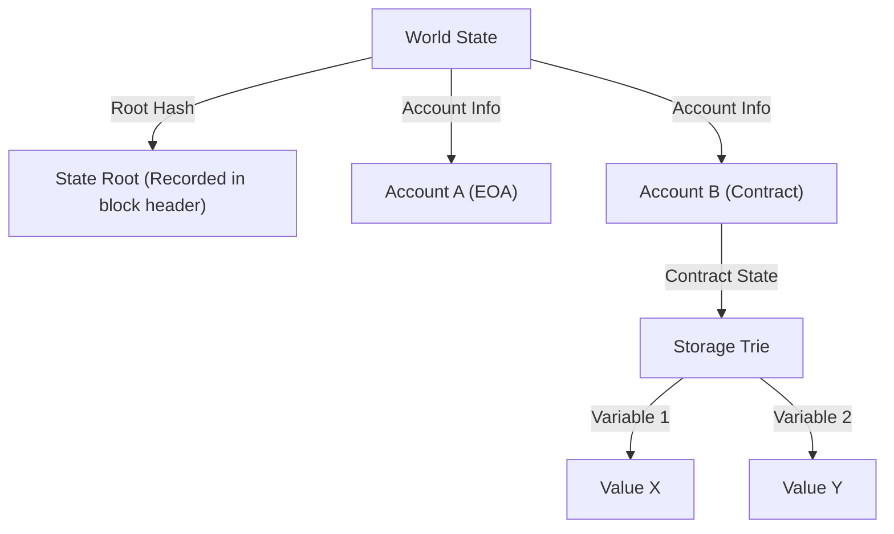

# Structure of Smart Contracts and EVM (Ethereum Virtual Machine): The Mechanism of a Decentralized Computer Where 'Code is Law'

Looking back at the history of blockchain technology, while Bitcoin established the concept of a "decentralized digital currency," Ethereum paved the way as a "decentralized computer." At the core of this revolution are "smart contracts" and the foundation for executing them, the "EVM (Ethereum Virtual Machine)."

In this article, we will delve deeply into how smart contracts operate, the architecture of the EVM, and why it is designed the way it is from a technical perspective.

## 1. Why Ethereum Was Needed: The Limits of Bitcoin Script

The concept of smart contracts was proposed by cryptographer Nick Szabo in the 1990s, but it was blockchain technology that put it into practical use. Bitcoin also features a scripting language (Bitcoin Script) to verify the validity of transactions. However, Bitcoin's script is intentionally designed to be "Turing Incomplete."

Simply put, being Turing incomplete means it lacks "loops (iterative processing)" and "complex conditional branching." There was a clear reason for this. Since every node on the blockchain verifies transactions, if a malicious user were to send a script that triggered an "infinite loop," it would create a vulnerability to a "DoS (Denial of Service) attack," freezing the entire network of nodes.

However, precisely because of this Turing incompleteness, it was extremely difficult to build complex financial contracts or decentralized applications (DApps) using Bitcoin's script. Vitalik Buterin acutely felt the need for a "Turing Complete" blockchain platform that removed these restrictions and allowed anyone to execute arbitrary logic. That was the driving force behind the birth of Ethereum.

## 2. What is the EVM (Ethereum Virtual Machine)?

The EVM is the heart of the Ethereum network, often described as a "global decentralized computer." Thousands of nodes scattered around the world share the exact same state and execute the exact same code.

The EVM is a "virtual machine" that does not depend on specific hardware or operating systems. It is similar to the JVM (Java Virtual Machine) in Java, but the EVM differs in that it operates synchronously across nodes worldwide. Developers write smart contracts in high-level languages like Solidity or Vyper, and the "bytecode" generated by compiling them is executed on the EVM.

### The Execution Model of a Stack Machine

The most distinctive feature of the EVM's architecture is that it is a "Stack Machine." Unlike register machines (common CPU architectures like x86 or ARM), the EVM performs operations using a data structure called a "stack" (LIFO: Last In, First Out).

For example, when performing the calculation "2 + 3", the EVM's assembly code (opcodes) looks like this:

1. `PUSH1 0x02` (Push 2 onto the stack)
2. `PUSH1 0x03` (Push 3 onto the stack)
3. `ADD` (Pop the two values from the stack, add them together, and push the result, 5, onto the stack)

The advantage of a stack machine is that the opcodes are simple, making it easy to keep the virtual machine implementation lightweight and secure. Ethereum nodes are expected to run even on low-spec hardware, so this lightweight nature is very important. The stack depth is limited to a maximum of 1024, and the data size handled is fundamentally based on a 256-bit (32-byte) word length. This design is intended to efficiently perform calculations for cryptographic hashes (Keccak-256) and signatures (secp256k1).

## 3. The Genius Design That Solves the "Infinite Loop Problem": Gas

With Ethereum introducing a Turing-complete scripting language, the aforementioned fatal risk of "network halting due to infinite loops" surfaced. This problem was elegantly solved by an incentive design known as "Gas."

Gas is the "fuel" consumed when executing computations or storing data on the EVM. When a user executes a smart contract (issues a transaction), they must pay ETH (Ether) as a fee to execute that transaction.

- Every opcode (instruction) has a set Gas cost corresponding to its computational complexity. For example, a simple arithmetic operation (`ADD`) is very cheap (3 Gas), while an operation that stores persistent data on the blockchain (`SSTORE`) is set very high (20,000 Gas).
- The transaction sender sets a "Gas Limit (the maximum amount they are willing to consume)" and a "Gas Price (the ETH price per 1 Gas)" in advance.
- Every time the EVM executes a line of code, Gas is deducted from the set Gas Limit.
- If it falls into an infinite loop and runs out of Gas (Out of Gas), the execution of the transaction is forcibly terminated (Reverted) at that point, and the state returns to what it was before execution. However, **the consumed Gas (fee) is paid to the miner (or validator) and is not refunded**.

Thanks to this mechanism, even if an attacker sends a transaction with an infinite loop, only their own funds (ETH) will be depleted, with no impact on the entire network. By introducing an "economic cost," resolving the Halting Problem in a Turing-complete environment in the real world is one of Ethereum's greatest achievements.

## 4. The World State Model: State Management with Patricia Trie

While Bitcoin adopts the UTXO (Unspent Transaction Output) model, Ethereum uses an "account-based state model."

There are two types of accounts in the Ethereum world:
1. **EOA (Externally Owned Account)**: A standard account managed by a human via a private key.
2. **Contract Account**: An account storing smart contract code and data. It has no private key and is controlled entirely by code.

The state of the entire Ethereum network (the balances of all accounts and smart contract data) is managed as the "World State." To efficiently and securely manage this massive data structure and make it tamper-proof, Ethereum employs a data structure called the "Modified Merkle Patricia Trie."

The advantage of this structure is that it is easy to create "cryptographic proofs" for a specific state. Even if just a tiny portion of the state (for example, a single variable of a certain contract) is changed, the Root Hash changes in a cascading manner, allowing the entire network to immediately detect state inconsistencies or tampering. This enables nodes to efficiently synchronize and verify massive amounts of data.

## 5. The Lifecycle of Solidity Code: From Deployment to Execution

Finally, let's look at the lifecycle of how the code written by a developer in Solidity functions as "law" on Ethereum.

### 1. Compilation
The Solidity source code written by the developer is translated by the compiler (`solc`) into "bytecode" that the EVM can understand, and an "ABI (Application Binary Interface)" that defines the interface of the contract.

### 2. Deployment (Creation Transaction)
The compiled bytecode is sent to the network as a special transaction where the destination (`to`) is empty (null). When this transaction is included in a block, the EVM executes the initialization code and saves the final contract bytecode to a new address on the World State. At this moment, the contract is persisted on the blockchain and can never be deleted or altered again (unless `selfdestruct` is called).

### 3. Execution (Message Call)
The contract is executed when a user (EOA) or another smart contract sends a transaction containing function call data (a function selector and arguments). The EVM reads the contract's bytecode from the World State, uses the specified data as input to operate the stack machine, and updates the state.

### The True Meaning of "Code is Law"

Once deployed, a smart contract cannot be altered by anyone and operates strictly as programmed. There is no censorship, no downtime, and no third-party intervention. Financial protocols (DeFi) and Decentralized Autonomous Organizations (DAOs) are built on this property of "unstoppable code."

However, this simultaneously means the harsh reality that "bugs also become law." If there is a vulnerability in the code, funds will be drained without mercy (the typical example being The DAO incident). Therefore, smart contract development requires a level of security auditing and fail-safe design on a completely different dimension from traditional Web development.

## Conclusion

The advent of Ethereum and the EVM brought "programmability" to a blockchain that was merely a payment network, opening up a new paradigm called Web3.
While overcoming the limitations of the Turing-incomplete Bitcoin script, it realizes the grand vision of a decentralized computer by combining the economic incentives of Gas, robust state management via the Patricia Trie, and a simple, solid stack machine (EVM).

A deep understanding of smart contract architecture will be the first step towards understanding the possibilities and limitations of decentralized systems in the Web3 era, and building safer, more innovative DApps.
