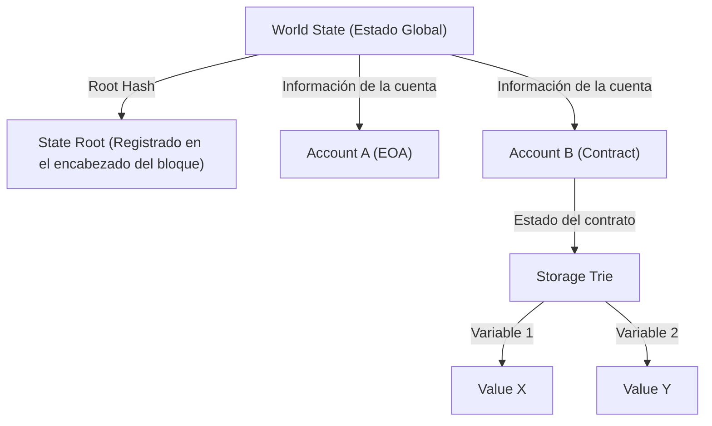

# La Estructura de los Contratos Inteligentes y la EVM (Ethereum Virtual Machine): Cómo funciona el ordenador descentralizado donde 'el código es la ley'

Al desentrañar la historia de la tecnología blockchain, mientras Bitcoin estableció el concepto de "moneda digital descentralizada", Ethereum abrió el camino como un "ordenador descentralizado". En el núcleo de esta revolución se encuentran los "contratos inteligentes" (smart contracts) y la base para ejecutarlos, la "EVM (Ethereum Virtual Machine: Máquina Virtual de Ethereum)".

En este artículo, profundizaremos desde una perspectiva técnica en cómo funcionan los contratos inteligentes, qué arquitectura tiene la EVM y por qué fue diseñada de esa manera.

## 1. ¿Por qué era necesario Ethereum?: Los límites del Script de Bitcoin

El concepto de contratos inteligentes en sí fue propuesto en la década de 1990 por el criptógrafo Nick Szabo, pero fue la tecnología blockchain la que lo puso en práctica. Bitcoin también cuenta con un lenguaje de scripting (Bitcoin Script) para verificar la validez de las transacciones. Sin embargo, el script de Bitcoin está diseñado intencionadamente para ser "Turing incompleto" (Turing Incomplete).

Ser Turing incompleto significa, en términos simples, que no posee "bucles" (procesos iterativos) ni "bifurcaciones condicionales complejas". Había una razón clara para esto. Dado que todos los nodos en la blockchain verifican las transacciones, si un usuario malintencionado enviara un script que provocara un "bucle infinito", crearía una vulnerabilidad a ataques "DoS (Denial of Service)" que congelarían los nodos de toda la red.

No obstante, debido a esta incompletitud de Turing, era extremadamente difícil construir contratos financieros complejos o aplicaciones descentralizadas (DApps) con el script de Bitcoin. Vitalik Buterin sintió la necesidad imperiosa de eliminar esta restricción y crear una plataforma blockchain "Turing completa" (Turing Complete) donde cualquiera pudiera ejecutar lógicas arbitrarias. Ese fue el motor que impulsó el nacimiento de Ethereum.

## 2. ¿Qué es la EVM (Ethereum Virtual Machine)?

La EVM es el corazón de la red Ethereum y se describe como un "ordenador global descentralizado". Miles de nodos dispersos por todo el mundo comparten exactamente el mismo estado (state) y ejecutan el mismo código.

La EVM es una "máquina virtual" que no depende de un hardware o sistema operativo específico. Es similar a la JVM (Java Virtual Machine) en Java, pero se diferencia en que la EVM opera sincronizada en nodos de todo el mundo. Los desarrolladores escriben contratos inteligentes en lenguajes de alto nivel como Solidity o Vyper, y el "bytecode" generado al compilar estos se ejecuta sobre la EVM.

### El modelo de ejecución de la máquina de pila (Stack Machine)

La mayor característica de la arquitectura de la EVM es que es una "máquina de pila" (Stack Machine). A diferencia de las máquinas de registros (arquitecturas de CPU comunes como x86 o ARM), la EVM realiza operaciones utilizando una estructura de datos llamada "pila" (stack, operando bajo LIFO: el último en entrar es el primero en salir).

Por ejemplo, al realizar el cálculo "2 + 3", el código ensamblador (opcode) de la EVM sería el siguiente:

1. `PUSH1 0x02` (Apila un 2 en el stack)
2. `PUSH1 0x03` (Apila un 3 en el stack)
3. `ADD` (Extrae dos valores del stack, los suma y apila el resultado de 5 en el stack)

La ventaja de una máquina de pila es que los opcodes son simples, lo que facilita mantener la implementación de la máquina virtual ligera y segura. Dado que se requiere que los nodos de Ethereum funcionen incluso en hardware de bajas especificaciones, esta ligereza es sumamente importante. La profundidad de la pila está limitada a un máximo de 1024, y el tamaño de los datos que maneja se basa fundamentalmente en palabras (words) de 256 bits (32 bytes). Este diseño está optimizado para realizar eficientemente cálculos de hashes criptográficos (Keccak-256) y firmas (secp256k1).

## 3. El diseño genial que resuelve el "Problema del Bucle Infinito": Gas (Tarifa de Gas)

Con la introducción de un lenguaje de scripting Turing completo en Ethereum, surgió el riesgo fatal mencionado anteriormente: la "detención de la red debido a bucles infinitos". Ethereum resolvió elegantemente este problema mediante un diseño de incentivos llamado "Gas".

El Gas es el "combustible" que se consume al ejecutar cálculos o guardar datos en la EVM. Cuando un usuario ejecuta un contrato inteligente (emite una transacción), debe pagar ETH (Ether) como tarifa por la ejecución de esa transacción.

- A todos los opcodes (instrucciones) se les asigna un coste en Gas acorde a su volumen de cálculo. Por ejemplo, una operación simple (`ADD`) es muy barata (3 Gas), mientras que una operación para almacenar datos de forma permanente en la blockchain (`SSTORE`) es muy cara (20,000 Gas).
- El remitente de la transacción establece por adelantado un "Gas Limit" (el límite máximo que no se consumirá más allá de este) y un "Gas Price" (el precio en ETH por 1 unidad de Gas).
- Cada vez que la EVM ejecuta una línea de código, se deduce Gas del Gas Limit establecido.
- Si se cae en un bucle infinito y el Gas se agota (Out of Gas), la ejecución de la transacción se aborta forzosamente en ese momento (Revert) y el estado vuelve al punto anterior a la ejecución. Sin embargo, **el Gas consumido (la tarifa) se paga a los mineros (o validadores) y no se reembolsa**.

Gracias a este mecanismo, incluso si un atacante envía una transacción con un bucle infinito, solo agotará sus propios fondos (ETH) sin afectar a toda la red. Introducir un "coste económico" para resolver en el mundo real el problema de la parada (Halting Problem) en un entorno Turing completo es uno de los mayores logros de Ethereum.

## 4. El Modelo del Estado Mundial: Gestión del Estado con Patricia Trie

Mientras que Bitcoin adopta el modelo UTXO (Unspent Transaction Output: Salidas de Transacciones No Gastadas), Ethereum utiliza un "modelo de estado basado en cuentas" (Account-based State Model).

En el mundo de Ethereum existen dos tipos de cuentas:
1. **EOA (Externally Owned Account)**: Cuentas generales controladas por humanos a través de claves privadas.
2. **Contract Account**: Cuentas donde se almacenan el código y los datos de los contratos inteligentes. No tienen clave privada y se controlan únicamente por el código.

El estado de toda la red Ethereum (los saldos de todas las cuentas y los datos de los contratos inteligentes) se gestiona como el "Estado Mundial" (World State). Para gestionar de manera eficiente y segura esta gigantesca estructura de datos, haciéndola inmutable, Ethereum adopta una estructura de datos llamada "Modified Merkle Patricia Trie".

La ventaja de esta estructura es la facilidad para crear "pruebas criptográficas" para un estado específico. Si se altera incluso una mínima fracción del estado (por ejemplo, una variable de un contrato), el Root Hash cambiará en cadena, permitiendo que la red entera detecte instantáneamente cualquier inconsistencia o manipulación. Esto permite a los nodos sincronizar y verificar enormes cantidades de datos de forma eficiente.

## 5. El Ciclo de Vida del Código Solidity: Del Despliegue a la Ejecución

Por último, veamos el ciclo de vida de cómo el código escrito en Solidity por un desarrollador funciona como "ley" en Ethereum.

### 1. Compilación
El código fuente de Solidity escrito por el desarrollador es convertido por el compilador (`solc`) en "bytecode" comprensible para la EVM, y en una "ABI (Application Binary Interface)" que define la interfaz del contrato.

### 2. Despliegue (Creation Transaction)
El bytecode compilado se envía a la red como una transacción especial con un destinatario (`to`) vacío (null). Cuando esta transacción se incluye en un bloque, la EVM ejecuta el código de inicialización y guarda el bytecode final del contrato en una nueva dirección del Estado Mundial. En este instante, el contrato se vuelve persistente en la blockchain, en un estado en el que nunca podrá ser borrado ni modificado (a menos que se llame a `selfdestruct`).

### 3. Ejecución (Message Call)
Un usuario (EOA) u otro contrato inteligente envía una transacción que incluye los datos de la llamada a la función (el selector de función y los argumentos), lo que hace que el contrato se ejecute. La EVM lee el bytecode del contrato desde el Estado Mundial, opera la máquina de pila usando los datos especificados como entrada, y actualiza el estado.

### El Verdadero Significado de "El Código es la Ley" (Code is Law)

Una vez que un contrato inteligente es desplegado, nadie puede alterarlo; operará exactamente según fue programado. No hay censura, ni tiempo de inactividad, ni intervención de terceros. Los protocolos financieros (DeFi) y las organizaciones autónomas descentralizadas (DAO) se basan en esta propiedad de ser "código imparable".

Sin embargo, esto también significa enfrentarse a la dura realidad de que "los errores también se vuelven ley" (los bugs también son la ley). Si hay una vulnerabilidad en el código, los fondos se drenarán sin piedad (el incidente de The DAO es un ejemplo típico). Por consiguiente, el desarrollo de contratos inteligentes exige auditorías de seguridad a un nivel completamente diferente al del desarrollo web tradicional y diseños a prueba de fallos (fail-safe).

## Conclusión

La aparición de Ethereum y la EVM aportó "programabilidad" a la blockchain, que era simplemente una red de pagos, y abrió el camino a un nuevo paradigma llamado Web3.
Al superar las limitaciones del script Turing incompleto de Bitcoin, y combinar los incentivos económicos del Gas con la robusta gestión de estado mediante Patricia Trie, y una máquina de pila (EVM) simple y sólida, Ethereum ha hecho realidad la grandiosa visión de un ordenador descentralizado.

Comprender en profundidad la arquitectura de los contratos inteligentes es el primer paso para conocer las posibilidades y los límites de los sistemas descentralizados en la era Web3, y para construir DApps más seguras e innovadoras.
