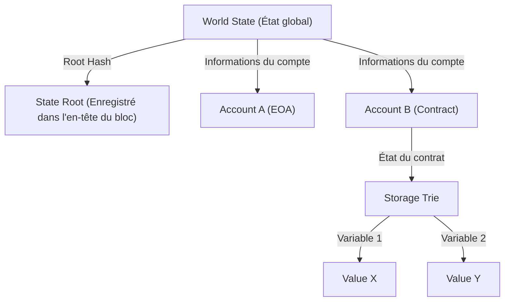

# Structure des Smart Contracts et de l'EVM (Ethereum Virtual Machine) : Le fonctionnement de l'ordinateur décentralisé où "le code fait loi"

En parcourant l'histoire de la technologie blockchain, on constate que si Bitcoin a établi le concept de "monnaie numérique décentralisée", Ethereum a ouvert la voie en tant qu'"ordinateur décentralisé". Au cœur de cette révolution se trouvent les "smart contracts" et leur plateforme d'exécution, l'"EVM (Ethereum Virtual Machine)".

Dans cet article, nous explorerons en profondeur, d'un point de vue technique, le fonctionnement des smart contracts, l'architecture de l'EVM et les raisons de sa conception spécifique.

## 1. Pourquoi Ethereum était-il nécessaire ? Les limites des scripts Bitcoin

Bien que le concept de smart contract ait été proposé dans les années 1990 par le cryptographe Nick Szabo, c'est la technologie blockchain qui l'a rendu pratique. Bitcoin intègre également un langage de script (Bitcoin Script) pour vérifier la validité des transactions. Cependant, le script de Bitcoin a été intentionnellement conçu pour être "Turing incomplet" (Turing Incomplete).

Être Turing incomplet signifie, en termes simples, qu'il ne possède pas de "boucles" (processus itératifs) ni de "branchements conditionnels complexes". Il y avait une raison claire à cela : puisque tous les nœuds de la blockchain vérifient les transactions, si un utilisateur malveillant envoyait un script provoquant une "boucle infinie", cela paralyserait les nœuds de l'ensemble du réseau, créant ainsi une vulnérabilité aux attaques par déni de service (DoS).

Cependant, en raison de cette incomplétude de Turing, il était très difficile de construire des contrats financiers complexes et des applications décentralisées (DApps) avec les scripts Bitcoin. Vitalik Buterin a ressenti le besoin urgent d'une plateforme blockchain "Turing complète" (Turing Complete), où ces restrictions seraient levées et où quiconque pourrait exécuter une logique arbitraire. Cela a été la force motrice derrière la création d'Ethereum.

## 2. Qu'est-ce que l'EVM (Ethereum Virtual Machine) ?

L'EVM est le cœur du réseau Ethereum, souvent décrit comme un "ordinateur décentralisé mondial". Des milliers de nœuds dispersés dans le monde entier partagent exactement le même état (state) et exécutent le même code.

L'EVM est une "machine virtuelle" qui ne dépend d'aucun matériel ni système d'exploitation spécifique. Elle est similaire à la JVM (Java Virtual Machine) pour Java, mais l'EVM diffère en ce qu'elle fonctionne de manière synchrone sur les nœuds du monde entier. Les développeurs écrivent des smart contracts dans des langages de haut niveau tels que Solidity ou Vyper, qui sont ensuite compilés en "bytecode" exécuté sur l'EVM.

### Le modèle d'exécution de la Stack Machine

La caractéristique principale de l'architecture de l'EVM est qu'elle est une "Stack Machine" (machine à pile). Contrairement aux machines à registres (architectures CPU courantes comme x86 ou ARM), l'EVM effectue des opérations en utilisant une structure de données appelée "pile" ou "stack" (LIFO : Last In, First Out).

Par exemple, pour calculer "2 + 3", le code assembleur de l'EVM (opcodes) ressemblerait à ceci :

1. `PUSH1 0x02` (Empile 2 sur la pile)
2. `PUSH1 0x03` (Empile 3 sur la pile)
3. `ADD` (Extrait deux valeurs de la pile, les additionne et empile le résultat, 5)

L'avantage d'une Stack Machine est que ses opcodes sont simples, ce qui permet de maintenir l'implémentation de la machine virtuelle légère et sécurisée. La légèreté est cruciale car les nœuds Ethereum doivent pouvoir fonctionner sur du matériel aux spécifications modestes. La profondeur de la pile est limitée à 1024, et la taille des données traitées est basée sur des mots de 256 bits (32 octets). Cette conception est optimisée pour effectuer efficacement des calculs cryptographiques comme les hachages (Keccak-256) ou les signatures (secp256k1).

## 3. Une conception ingénieuse pour résoudre le problème de la "boucle infinie" : Le Gas (frais de gaz)

En introduisant un langage de script Turing complet, Ethereum a été confronté au risque fatal mentionné précédemment : l'arrêt du réseau à cause de boucles infinies. Ce problème a été élégamment résolu grâce à la conception d'une incitation appelée "Gas" (frais de gaz).

Le Gas est le "carburant" consommé lors de l'exécution de calculs ou du stockage de données sur l'EVM. Lorsqu'un utilisateur exécute un smart contract (émet une transaction), il doit payer des ETH (Ether) en tant que frais d'exécution de cette transaction.

- Tous les opcodes (instructions) ont un coût en Gas défini en fonction de la complexité de leur calcul. Par exemple, une opération simple (`ADD`) est très bon marché (3 Gas), tandis qu'une opération de stockage de données persistantes sur la blockchain (`SSTORE`) est très chère (20 000 Gas).
- L'expéditeur de la transaction définit au préalable une "Gas Limit" (la limite supérieure de consommation) et un "Gas Price" (le prix en ETH par unité de Gas).
- Chaque fois que l'EVM exécute une ligne de code, le Gas consommé est déduit de la Gas Limit fixée.
- Si le processus tombe dans une boucle infinie et que le Gas s'épuise (Out of Gas), l'exécution de la transaction est immédiatement interrompue (Revert) et l'état revient à ce qu'il était avant l'exécution. Cependant, **le Gas consommé (les frais) est payé au mineur (ou validateur) et n'est pas remboursé**.

Grâce à ce mécanisme, si un attaquant envoie une transaction avec une boucle infinie, il épuisera simplement ses propres fonds (ETH) sans affecter le réseau dans son ensemble. L'introduction d'un "coût économique" pour résoudre le problème de l'arrêt (Halting Problem) dans un environnement Turing complet dans le monde réel est l'une des plus grandes réalisations d'Ethereum.

## 4. Modèle d'État Global : Gestion de l'état par Patricia Trie

Alors que Bitcoin utilise le modèle UTXO (Unspent Transaction Output), Ethereum adopte un "modèle d'état basé sur les comptes".

Il existe deux types de comptes dans le monde d'Ethereum :
1. **EOA (Externally Owned Account)** : Un compte standard géré par un humain à l'aide d'une clé privée.
2. **Contract Account** : Un compte qui stocke le code et les données d'un smart contract. Il n'a pas de clé privée et est contrôlé uniquement par son code.

L'état de l'ensemble du réseau Ethereum (les soldes de tous les comptes et les données des smart contracts) est géré en tant qu'"État Global" (World State). Pour gérer cette structure de données massive de manière efficace, sécurisée et inviolable, Ethereum utilise une structure de données appelée "Modified Merkle Patricia Trie".

L'avantage de cette structure est qu'elle permet de générer facilement des "preuves cryptographiques" pour un état spécifique. Si même une infime partie de l'état change (par exemple, une variable d'un contrat), le Root Hash change en chaîne, ce qui permet à l'ensemble du réseau de détecter immédiatement les incohérences ou les falsifications d'état. Cela permet aux nœuds de synchroniser et de vérifier d'énormes quantités de données de manière très efficace.

## 5. Le cycle de vie du code Solidity : Du déploiement à l'exécution

Enfin, examinons le cycle de vie du code écrit par les développeurs en Solidity et comment il fonctionne en tant que "loi" sur Ethereum.

### 1. Compilation
Le code source Solidity écrit par le développeur est converti par le compilateur (`solc`) en un "bytecode" compréhensible par l'EVM, et en une "ABI" (Application Binary Interface) qui définit l'interface du contrat.

### 2. Déploiement (Creation Transaction)
Le bytecode compilé est envoyé au réseau en tant que transaction spéciale avec une destination (`to`) vide (null). Lorsque cette transaction est incluse dans un bloc, l'EVM exécute le code d'initialisation et enregistre le bytecode final du contrat à une nouvelle adresse dans l'État Global. À cet instant, le contrat devient persistant sur la blockchain, et ne peut plus jamais être supprimé ni modifié (à moins que `selfdestruct` ne soit appelé).

### 3. Exécution (Message Call)
Lorsqu'un utilisateur (EOA) ou un autre smart contract envoie une transaction contenant les données d'un appel de fonction (sélecteur de fonction et arguments), le contrat est exécuté. L'EVM charge le bytecode du contrat depuis l'État Global, exécute la Stack Machine avec les données spécifiées comme entrées, et met à jour l'état.

### La véritable signification de "Le code fait loi" (Code is Law)

Une fois qu'un smart contract est déployé, personne ne peut le modifier, et il s'exécutera exactement comme il a été programmé. Il n'y a ni censure, ni temps d'arrêt, ni intervention de tiers. Les protocoles financiers (DeFi) et les organisations autonomes décentralisées (DAO) reposent sur cette nature de "code imparable".

Cependant, cela signifie aussi la dure réalité que "les bugs deviennent également loi". Si le code contient des vulnérabilités, les fonds seront siphonnés sans pitié (l'incident de The DAO en est l'exemple typique). Par conséquent, le développement de smart contracts nécessite un niveau d'audit de sécurité et une conception de sécurité intégrée (fail-safe) qui sont d'une tout autre dimension par rapport au développement Web traditionnel.

## Conclusion

L'avènement d'Ethereum et de l'EVM a apporté la "programmabilité" à la blockchain, qui n'était auparavant qu'un réseau de paiement, et a ouvert un nouveau paradigme appelé Web3.
Tout en dépassant les limites des scripts Bitcoin Turing incomplets, Ethereum a réalisé la vision grandiose d'un ordinateur décentralisé en combinant les incitations économiques du Gas, la gestion d'état robuste du Patricia Trie, et la simplicité et la robustesse de la Stack Machine (EVM).

Une compréhension approfondie de l'architecture des smart contracts constituera votre première étape pour saisir le potentiel et les limites des systèmes décentralisés à l'ère du Web3, et pour construire des DApps plus sûres et plus innovantes.
