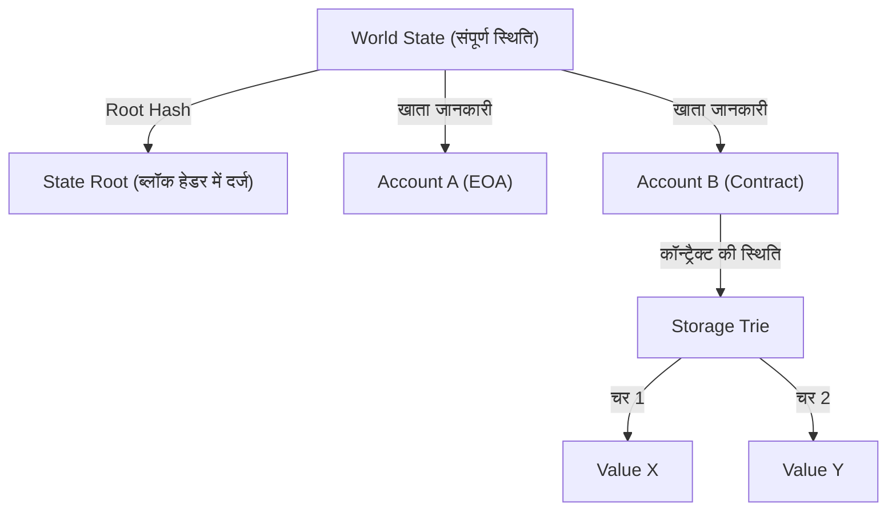

# स्मार्ट कॉन्ट्रैक्ट और EVM (Ethereum Virtual Machine) की संरचना: 'कोड ही कानून है' विकेंद्रीकृत कंप्यूटर का तंत्र

ब्लॉकचेन तकनीक के इतिहास को देखें, तो जहां बिटकॉइन ने 'विकेंद्रीकृत डिजिटल मुद्रा' की अवधारणा स्थापित की, वहीं एथेरियम (Ethereum) ने 'विकेंद्रीकृत कंप्यूटर' के रूप में एक नया रास्ता खोला। इस क्रांति के मूल में 'स्मार्ट कॉन्ट्रैक्ट' (Smart Contract) और इसके निष्पादन का आधार, 'EVM' (Ethereum Virtual Machine: एथेरियम वर्चुअल मशीन) है।

इस लेख में, हम तकनीकी दृष्टिकोण से गहराई में जाकर यह जानेंगे कि स्मार्ट कॉन्ट्रैक्ट कैसे काम करता है, EVM का आर्किटेक्चर कैसा है, और इसे इस तरह से क्यों डिज़ाइन किया गया है।

## 1. एथेरियम की आवश्यकता क्यों थी: बिटकॉइन स्क्रिप्ट की सीमाएँ

स्मार्ट कॉन्ट्रैक्ट की अवधारणा 1990 के दशक में क्रिप्टोग्राफर निक सज़ाबो (Nick Szabo) द्वारा प्रस्तुत की गई थी, लेकिन इसे व्यावहारिक रूप ब्लॉकचेन तकनीक ने दिया। बिटकॉइन में भी लेनदेन की वैधता को सत्यापित करने के लिए एक स्क्रिप्टिंग भाषा (Bitcoin Script) शामिल है। हालाँकि, बिटकॉइन की स्क्रिप्ट जानबूझकर 'ट्यूरिंग इनकम्प्लीट' (Turing Incomplete) डिज़ाइन की गई है।

ट्यूरिंग इनकम्प्लीट का सरल अर्थ है कि इसमें 'लूप' (looping/iteration) या 'जटिल कंडीशन ब्रांचिंग' (complex conditional branching) नहीं होती। इसका एक स्पष्ट कारण था। ब्लॉकचेन पर सभी नोड्स लेनदेन को सत्यापित करते हैं, इसलिए यदि कोई दुर्भावनापूर्ण उपयोगकर्ता 'अनंत लूप' (infinite loop) वाली स्क्रिप्ट भेजता है, तो पूरे नेटवर्क के नोड्स फ्रीज़ हो जाएंगे, जिससे 'DoS (Denial of Service) हमला' हो सकता है।

हालाँकि, इस ट्यूरिंग अपूर्णता के कारण, बिटकॉइन की स्क्रिप्ट में जटिल वित्तीय अनुबंध या विकेंद्रीकृत एप्लिकेशन (DApps) बनाना बहुत मुश्किल था। विटालिक ब्यूटिरिन (Vitalik Buterin) ने इस सीमा को हटाने और एक ऐसे 'ट्यूरिंग कम्प्लीट' (Turing Complete) ब्लॉकचेन प्लेटफॉर्म की आवश्यकता को महसूस किया, जहां कोई भी कोई भी लॉजिक निष्पादित कर सके। यही एथेरियम के जन्म की प्रेरणा थी।

## 2. EVM (Ethereum Virtual Machine) क्या है?

EVM एथेरियम नेटवर्क का हृदय है और इसे 'वैश्विक विकेंद्रीकृत कंप्यूटर' कहा जाता है। दुनिया भर में फैले हजारों नोड्स एक ही स्थिति (state) साझा करते हैं और एक ही कोड को निष्पादित करते हैं।

EVM एक 'वर्चुअल मशीन' है जो किसी विशिष्ट हार्डवेयर या OS पर निर्भर नहीं करती। यह जावा के JVM (Java Virtual Machine) के समान है, लेकिन EVM इस मायने में अलग है कि यह दुनिया भर के नोड्स में समकालिक रूप से (synchronously) काम करता है। डेवलपर्स सॉलिडिटी (Solidity) या वाइपर (Vyper) जैसी उच्च-स्तरीय भाषाओं में स्मार्ट कॉन्ट्रैक्ट लिखते हैं, जिन्हें संकलित (compile) करके उत्पन्न 'बाइटकोड' (bytecode) EVM पर चलाया जाता है।

### स्टैक मशीन का निष्पादन मॉडल

EVM के आर्किटेक्चर की सबसे बड़ी विशेषता यह है कि यह एक 'स्टैक मशीन' (Stack Machine) है। रजिस्टर मशीनों (जैसे x86 या ARM आदि सामान्य CPU आर्किटेक्चर) के विपरीत, EVM 'स्टैक' नामक डेटा संरचना (LIFO: Last-In, First-Out) का उपयोग करके गणना करता है।

उदाहरण के लिए, '2 + 3' की गणना करने पर EVM का असेंबली कोड (Opcode) इस प्रकार होगा:

1. `PUSH1 0x02` (स्टैक पर 2 डालें)
2. `PUSH1 0x03` (स्टैक पर 3 डालें)
3. `ADD` (स्टैक से 2 मान निकालें, उन्हें जोड़ें, और परिणाम 5 को स्टैक पर डालें)

स्टैक मशीन का लाभ यह है कि ओपकोड (opcode) सरल होते हैं, और वर्चुअल मशीन का कार्यान्वयन हल्का और सुरक्षित रखना आसान होता है। एथेरियम नोड्स को कम-स्पेक (low-spec) हार्डवेयर पर भी चलने में सक्षम होना चाहिए, इसलिए यह हल्कापन बहुत महत्वपूर्ण है। स्टैक की गहराई अधिकतम 1024 तक सीमित है, और संभाला जाने वाला डेटा आकार मुख्य रूप से 256-बिट (32-बाइट) वर्ड लेंथ का होता है। यह क्रिप्टोग्राफ़िक हैश (Keccak-256) और हस्ताक्षर (secp256k1) की कुशल गणना के लिए डिज़ाइन किया गया है।

## 3. 'अनंत लूप समस्या' को हल करने वाली शानदार डिज़ाइन: Gas (गैस शुल्क)

एथेरियम द्वारा ट्यूरिंग कम्प्लीट स्क्रिप्टिंग भाषा को पेश करने के साथ, ऊपर वर्णित 'अनंत लूप के कारण नेटवर्क के रुकने' का घातक जोखिम पैदा हुआ। इस समस्या को एक बहुत ही शानदार तरीके से 'Gas' (गैस शुल्क) के प्रोत्साहन डिज़ाइन (incentive design) ने हल किया।

Gas वह 'ईंधन' है जिसका उपभोग EVM पर गणना करने या डेटा संग्रहीत करने के दौरान किया जाता है। जब कोई उपयोगकर्ता स्मार्ट कॉन्ट्रैक्ट निष्पादित करता है (लेनदेन जारी करता है), तो उन्हें लेनदेन को निष्पादित करने के शुल्क के रूप में ETH (ईथर) का भुगतान करना होता है।

- सभी ओपकोड (निर्देशों) के लिए, उनकी गणना की मात्रा के अनुसार Gas लागत निर्धारित की जाती है। उदाहरण के लिए, एक सरल गणना (`ADD`) बहुत सस्ती (3 Gas) है, जबकि ब्लॉकचेन पर स्थायी रूप से डेटा संग्रहीत करने का संचालन (`SSTORE`) बहुत महंगा (20,000 Gas) है।
- लेनदेन भेजने वाला व्यक्ति पहले से ही 'Gas Limit' (अधिकतम सीमा जिसके आगे उपभोग नहीं किया जाएगा) और 'Gas Price' (प्रति 1 Gas की ETH कीमत) निर्धारित करता है।
- जैसे ही EVM कोड की 1 पंक्ति को निष्पादित करता है, निर्धारित Gas Limit से Gas कट जाती है।
- यदि अनंत लूप में फंस जाता है और Gas समाप्त हो जाती है (Out of Gas), तो लेनदेन का निष्पादन वहीं बलपूर्वक समाप्त (Revert) हो जाता है, और स्थिति निष्पादन से पहले वाली स्थिति में लौट आती है। हालाँकि, **खर्च की गई Gas (शुल्क) माइनर (या वैलिडेटर) को भुगतान की जाती है और वापस नहीं की जाती**।

इस तंत्र के कारण, भले ही हमलावर अनंत लूप वाले लेनदेन भेजते हैं, वे केवल अपना फंड (ETH) समाप्त करेंगे और पूरे नेटवर्क को प्रभावित नहीं करेंगे। 'आर्थिक लागत' की शुरुआत करके ट्यूरिंग कम्प्लीट वातावरण में रुकने की समस्या (Halting Problem) को वास्तविक दुनिया में हल करना एथेरियम की सबसे बड़ी उपलब्धियों में से एक है।

## 4. वर्ल्ड स्टेट मॉडल: Patricia Trie द्वारा अवस्था प्रबंधन (State Management)

जहाँ बिटकॉइन UTXO (Unspent Transaction Output: अप्रयुक्त लेनदेन आउटपुट) मॉडल का उपयोग करता है, वहीं एथेरियम 'अकाउंट-आधारित स्टेट मॉडल' (Account-based State Model) अपनाता है।

एथेरियम की दुनिया में 2 प्रकार के खाते मौजूद हैं:
1. **EOA (Externally Owned Account)**: एक सामान्य खाता जिसे निजी कुंजी (private key) के माध्यम से एक इंसान द्वारा प्रबंधित किया जाता है।
2. **Contract Account**: एक खाता जिसमें स्मार्ट कॉन्ट्रैक्ट का कोड और डेटा संग्रहीत होता है। इसके पास कोई निजी कुंजी नहीं होती है, और यह केवल कोड द्वारा नियंत्रित होता है।

संपूर्ण एथेरियम नेटवर्क की स्थिति (सभी खातों की शेष राशि और स्मार्ट कॉन्ट्रैक्ट का डेटा) को 'वर्ल्ड स्टेट' (World State) के रूप में प्रबंधित किया जाता है। इस विशाल डेटा संरचना को कुशलतापूर्वक और सुरक्षित रूप से प्रबंधित करने और इसे छेड़छाड़-प्रूफ (tamper-proof) बनाने के लिए, एथेरियम 'Modified Merkle Patricia Trie' नामक डेटा संरचना को अपनाता है।

इस संरचना का लाभ यह है कि किसी विशिष्ट स्थिति के लिए 'क्रिप्टोग्राफ़िक प्रमाण' (cryptographic proof) आसानी से बनाया जा सकता है। स्थिति के एक छोटे से हिस्से (उदाहरण के लिए, किसी कॉन्ट्रैक्ट के एक चर) के बदलने से Root Hash की एक श्रृंखला प्रतिक्रिया बदल जाती है, जिससे स्थिति में बेमेल या छेड़छाड़ का तुरंत पूरे नेटवर्क में पता लगाया जा सकता है। यह नोड्स को भारी मात्रा में डेटा को कुशलतापूर्वक सिंक्रनाइज़ और सत्यापित करने की अनुमति देता है।

## 5. सॉलिडिटी (Solidity) कोड का जीवनचक्र: परिनियोजन (Deployment) से निष्पादन (Execution) तक

अंत में, आइए देखें कि किसी डेवलपर द्वारा Solidity में लिखा गया कोड एथेरियम पर 'कानून' के रूप में कैसे कार्य करता है, इसके जीवनचक्र (lifecycle) पर एक नजर डालते हैं।

### 1. संकलन (Compile)
डेवलपर द्वारा लिखा गया सॉलिडिटी स्रोत कोड कंपाइलर (`solc`) द्वारा 'बाइटकोड' (जिसे EVM समझ सकता है) और 'ABI' (Application Binary Interface, जो कॉन्ट्रैक्ट के इंटरफेस को परिभाषित करता है) में बदल दिया जाता है।

### 2. پرिनियोजन (Deploy / Creation Transaction)
संकलित बाइटकोड को एक विशेष लेनदेन के रूप में नेटवर्क पर भेजा जाता है जिसका गंतव्य (`to`) खाली (null) होता है। जब यह लेनदेन ब्लॉक में शामिल हो जाता है, तो EVM इनिशियलाइज़ेशन कोड चलाता है और अंतिम कॉन्ट्रैक्ट बाइटकोड को वर्ल्ड स्टेट पर एक नए पते (address) पर सहेजता है। इसी क्षण, कॉन्ट्रैक्ट ब्लॉकचेन पर स्थायी हो जाता है और उस स्थिति में पहुँच जाता है जहाँ इसे फिर कभी हटाया या बदला नहीं जा सकता (जब तक कि `selfdestruct` को न बुलाया जाए)।

### 3. निष्पादन (Execution / Message Call)
जब कोई उपयोगकर्ता (EOA) या अन्य स्मार्ट कॉन्ट्रैक्ट किसी फ़ंक्शन को कॉल करने वाले डेटा (फ़ंक्शन चयनकर्ता और तर्क) के साथ एक लेनदेन भेजता है, तो कॉन्ट्रैक्ट निष्पादित होता है। EVM वर्ल्ड स्टेट से कॉन्ट्रैक्ट का बाइटकोड पढ़ता है, निर्दिष्ट डेटा को इनपुट के रूप में उपयोग करके स्टैक मशीन को चलाता है, और स्थिति (state) को अपडेट करता है।

### 'कोड ही कानून है (Code is Law)' का असली मतलब

एक बार डिप्लॉय हो जाने के बाद, स्मार्ट कॉन्ट्रैक्ट को किसी के द्वारा नहीं बदला जा सकता और यह ठीक वैसे ही काम करता है গান্ধीय प्रोग्राम किया गया है। कोई सेंसरशिप नहीं है, कोई डाउनटाइम नहीं है, और कोई थर्ड-पार्टी का हस्तक्षेप नहीं है। वित्तीय प्रोटोकॉल (DeFi) और विकेंद्रीकृत स्वायत्त संगठन (DAO) इस 'अजेय कोड' (unstoppable code) की प्रकृति पर बनाए गए हैं।

हालाँकि, इसका मतलब यह कड़वी सच्चाई भी है कि 'बग भी कानून बन जाता है'। यदि कोड में कोई भेद्यता (vulnerability) है, तो बिना किसी दया के फंड खो जाएगा (The DAO घटना इसका प्रमुख उदाहरण है)। इसलिए, स्मार्ट कॉन्ट्रैक्ट्स के विकास के लिए सुरक्षा ऑडिट के स्तर और पारंपरिक वेब विकास से बिल्कुल अलग स्तर के फेल-सेफ (fail-safe) डिज़ाइन की आवश्यकता होती है।

## निष्कर्ष

एथेरियम और EVM के उद्भव ने ब्लॉकचेन, जो सिर्फ एक भुगतान नेटवर्क था, में 'प्रोग्रामेबिलिटी' (programmability) को पेश किया और Web3 के रूप में एक नए प्रतिमान (paradigm) का मार्ग प्रशस्त किया।
ट्यूरिंग इनकम्प्लीट बिटकॉइन स्क्रिप्ट की सीमाओं को तोड़ते हुए, यह Gas के माध्यम से आर्थिक प्रोत्साहन, Patricia Trie के साथ मजबूत स्थिति प्रबंधन (state management), और एक सरल और मजबूत स्टैक मशीन (EVM) को मिलाकर विकेंद्रीकृत कंप्यूटर की भव्य दृष्टि को साकार करता है।

स्मार्ट कॉन्ट्रैक्ट के आर्किटेक्चर को गहराई से समझना Web3 युग में विकेंद्रीकृत प्रणालियों (decentralized systems) की संभावनाओं और सीमाओं को जानने और अधिक सुरक्षित व अभिनव DApps बनाने की दिशा में पहला कदम होगा।
