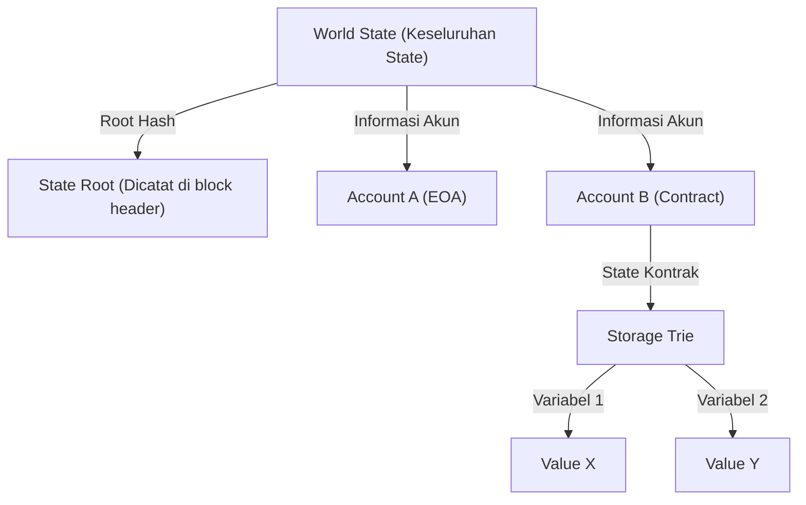

# Struktur Smart Contract dan EVM (Ethereum Virtual Machine): Bagaimana Komputer Terdesentralisasi Bekerja, di Mana 'Kode Adalah Hukum'

Menelusuri sejarah teknologi blockchain, sementara Bitcoin memantapkan konsep "mata uang digital terdesentralisasi", Ethereum membuka jalan sebagai "komputer terdesentralisasi". Inti dari revolusi ini adalah "Smart Contract" dan fondasi untuk menjalankannya, yaitu "EVM (Ethereum Virtual Machine)".

Artikel ini akan membahas secara mendalam dari sudut pandang teknis bagaimana smart contract beroperasi, arsitektur yang dimiliki oleh EVM, dan mengapa sistem tersebut dirancang sedemikian rupa.

## 1. Mengapa Ethereum Dibutuhkan: Keterbatasan Script Bitcoin

Konsep smart contract itu sendiri telah diusulkan oleh kriptografer Nick Szabo pada tahun 1990-an, tetapi teknologi blockchain-lah yang mengimplementasikannya secara praktis. Bitcoin juga dilengkapi dengan bahasa skrip (Bitcoin Script) untuk memverifikasi keabsahan transaksi. Namun, skrip Bitcoin secara sengaja dirancang agar "Turing Incomplete" (Turing tidak lengkap).

Turing Incomplete, secara sederhana, berarti ia tidak memiliki "loop" (proses perulangan) atau "percabangan kondisi yang kompleks". Ada alasan yang jelas untuk hal ini. Karena semua node di blockchain memverifikasi transaksi, jika ada pengguna jahat yang mengirimkan skrip yang menyebabkan "infinite loop" (perulangan tak terbatas), hal itu akan membekukan seluruh node jaringan, menciptakan kerentanan "DoS (Denial of Service)".

Namun, karena ketidaklengkapan Turing ini, sangat sulit untuk membangun kontrak keuangan yang kompleks atau aplikasi terdesentralisasi (DApps) menggunakan skrip Bitcoin. Vitalik Buterin menyadari perlunya sebuah platform blockchain yang "Turing Complete", yang menghilangkan batasan ini dan memungkinkan siapa pun untuk menjalankan logika apa pun. Itulah kekuatan pendorong di balik lahirnya Ethereum.

## 2. Apa Itu EVM (Ethereum Virtual Machine)?

EVM adalah jantung dari jaringan Ethereum, dan sering disebut sebagai "komputer terdesentralisasi global". Ribuan node yang tersebar di seluruh dunia berbagi state (keadaan) yang sama persis dan menjalankan kode yang sama.

EVM adalah sebuah "mesin virtual" yang tidak bergantung pada perangkat keras atau sistem operasi tertentu. Meskipun mirip dengan JVM (Java Virtual Machine) di Java, EVM berbeda dalam hal sinkronisasi dan operasinya di seluruh node di seluruh dunia. Pengembang menulis smart contract dalam bahasa tingkat tinggi seperti Solidity atau Vyper, dan "bytecode" yang dihasilkan setelah kompilasi dijalankan pada EVM.

### Model Eksekusi Mesin Stack (Stack Machine)

Fitur utama dari arsitektur EVM adalah bahwa ia merupakan "Stack Machine" (Mesin Stack). Berbeda dengan mesin register (seperti arsitektur CPU umum x86 atau ARM), EVM menggunakan struktur data yang disebut "stack" (LIFO: Last-In-First-Out) untuk melakukan operasi perhitungan.

Misalnya, ketika menghitung "2 + 3", kode assembly EVM (opcode) akan terlihat seperti ini:

1. `PUSH1 0x02` (Mendorong 2 ke dalam stack)
2. `PUSH1 0x03` (Mendorong 3 ke dalam stack)
3. `ADD` (Mengambil dua nilai dari stack, menjumlahkannya, dan menaruh hasilnya, yaitu 5, kembali ke dalam stack)

Keuntungan dari mesin stack adalah opcodenya sederhana, sehingga memudahkan untuk menjaga implementasi mesin virtual tetap ringan dan aman. Karena node Ethereum diharuskan dapat beroperasi bahkan pada perangkat keras dengan spesifikasi rendah, keringanan ini sangat penting. Kedalaman stack dibatasi maksimal 1024, dan ukuran data yang ditangani utamanya adalah word length 256-bit (32 byte). Ini dirancang untuk melakukan perhitungan hash kriptografi (Keccak-256) dan tanda tangan (secp256k1) secara efisien.

## 3. Desain Jenius yang Menyelesaikan "Masalah Infinite Loop": Gas (Biaya Gas)

Dengan Ethereum yang memperkenalkan bahasa skrip Turing Complete, risiko fatal seperti "pemberhentian jaringan karena infinite loop" seperti yang disebutkan sebelumnya pun muncul. Desain insentif yang secara elegan memecahkan masalah ini adalah "Gas" (biaya gas).

Gas adalah "bahan bakar" yang dikonsumsi saat melakukan komputasi atau menyimpan data pada EVM. Saat pengguna menjalankan smart contract (menerbitkan transaksi), mereka harus membayar ETH (Ether) sebagai biaya untuk mengeksekusi transaksi tersebut.

- Setiap opcode (instruksi) memiliki biaya Gas yang ditetapkan berdasarkan jumlah komputasi. Misalnya, operasi perhitungan sederhana (`ADD`) sangat murah (3 Gas), sedangkan operasi untuk menyimpan data secara permanen di blockchain (`SSTORE`) ditetapkan sangat mahal (20.000 Gas).
- Pengirim transaksi mengatur terlebih dahulu "Gas Limit" (batas maksimum yang tidak akan dilampaui) dan "Gas Price" (harga ETH per 1 Gas).
- Setiap kali EVM mengeksekusi satu baris kode, Gas akan dikurangi dari Gas Limit yang telah ditetapkan.
- Jika terjadi infinite loop dan Gas habis (Out of Gas), eksekusi transaksi akan dihentikan secara paksa (Revert) pada saat itu, dan state akan kembali ke keadaan sebelum dieksekusi. Namun, **Gas (biaya) yang telah dikonsumsi akan tetap dibayarkan kepada miner (atau validator) dan tidak akan dikembalikan**.

Melalui mekanisme ini, bahkan jika seorang penyerang mengirimkan transaksi dengan infinite loop, hanya dana mereka (ETH) yang akan terkuras, tanpa mempengaruhi seluruh jaringan. Dengan memperkenalkan "biaya ekonomi", menyelesaikan masalah penghentian komputasi (Halting Problem) di lingkungan Turing Complete dalam dunia nyata merupakan salah satu pencapaian terbesar Ethereum.

## 4. Model World State: Manajemen State Menggunakan Patricia Trie

Jika Bitcoin menggunakan model UTXO (Unspent Transaction Output), Ethereum mengadopsi "model state berbasis akun".

Ada dua jenis akun dalam dunia Ethereum:
1. **EOA (Externally Owned Account)**: Akun umum yang dikelola oleh manusia menggunakan kunci privat (private key).
2. **Contract Account**: Akun tempat kode dan data smart contract disimpan. Tidak memiliki kunci privat, dan hanya dikontrol oleh kode.

State keseluruhan jaringan Ethereum (saldo semua akun dan data smart contract) dikelola sebagai "World State". Untuk mengelola struktur data yang sangat besar ini secara efisien, aman, dan membuatnya tidak dapat dirusak, Ethereum menggunakan struktur data yang disebut "Modified Merkle Patricia Trie".

Keuntungan dari struktur ini adalah memudahkan pembuatan "bukti kriptografi" (cryptographic proof) untuk state tertentu. Bahkan jika hanya sebagian kecil dari state (misalnya, satu variabel dari sebuah kontrak) yang diubah, Root Hash akan berubah secara berantai, sehingga ketidaksesuaian atau gangguan pada state dapat langsung terdeteksi di seluruh jaringan. Hal ini memungkinkan node untuk menyinkronkan dan memverifikasi sejumlah besar data secara efisien.

## 5. Siklus Hidup Kode Solidity: Dari Deployment Hingga Eksekusi

Terakhir, mari kita lihat siklus hidup bagaimana kode yang ditulis dalam Solidity oleh pengembang berfungsi sebagai "hukum" di Ethereum.

### 1. Kompilasi
Kode sumber Solidity yang ditulis oleh pengembang diubah oleh kompiler (`solc`) menjadi "bytecode" yang dapat dipahami oleh EVM dan "ABI (Application Binary Interface)" yang mendefinisikan antarmuka kontrak.

### 2. Deployment (Creation Transaction)
Bytecode yang telah dikompilasi dikirim ke jaringan sebagai transaksi khusus yang tujuannya (`to`) dibiarkan kosong (null). Ketika transaksi ini dimasukkan ke dalam blok, EVM mengeksekusi kode inisialisasi dan menyimpan bytecode kontrak akhir ke alamat baru di World State. Pada saat itu, kontrak diabadikan di blockchain dan tidak dapat dihapus atau diubah lagi (kecuali jika `selfdestruct` dipanggil).

### 3. Eksekusi (Message Call)
Pengguna (EOA) atau smart contract lainnya menjalankan kontrak dengan mengirimkan transaksi yang berisi data pemanggilan fungsi (pemilih fungsi dan argumen). EVM memuat bytecode kontrak dari World State, menggunakan data yang ditentukan sebagai input untuk mengoperasikan mesin stack, dan memperbarui state.

### Makna Sesungguhnya dari "Kode Adalah Hukum (Code is Law)"

Smart contract yang telah dideploy tidak dapat diubah oleh siapa pun, dan hanya beroperasi sebagaimana yang diprogramkan. Tidak ada penyensoran, tidak ada waktu henti (downtime), dan tidak ada campur tangan pihak ketiga. Protokol keuangan (DeFi) dan organisasi otonom terdesentralisasi (DAO) dibangun di atas properti "kode yang tidak bisa dihentikan" ini.

Namun, ini juga berarti kenyataan pahit bahwa "bug juga akan menjadi hukum". Jika terdapat kerentanan dalam kode, dana akan terkuras tanpa ampun (Insiden The DAO adalah contoh tipikalnya). Oleh karena itu, dalam pengembangan smart contract, tingkat audit keamanan dan desain fail-safe (sistem aman saat gagal) yang diperlukan sangat jauh berbeda dimensinya dibandingkan dengan pengembangan Web tradisional.

## Kesimpulan

Kemunculan Ethereum dan EVM membawa "programabilitas" ke blockchain, yang sebelumnya hanya sekadar jaringan pembayaran, dan membuka paradigma baru yang disebut Web3.
Meskipun menerobos keterbatasan skrip Bitcoin yang Turing Incomplete, visi besar komputer terdesentralisasi terwujud dengan menggabungkan insentif ekonomi menggunakan Gas, manajemen state yang kuat melalui Patricia Trie, dan mesin stack (EVM) yang sederhana dan kokoh.

Pemahaman mendalam tentang arsitektur smart contract merupakan langkah pertama untuk mengetahui potensi dan keterbatasan sistem terdesentralisasi di era Web3, serta untuk membangun DApps yang lebih aman dan inovatif.
