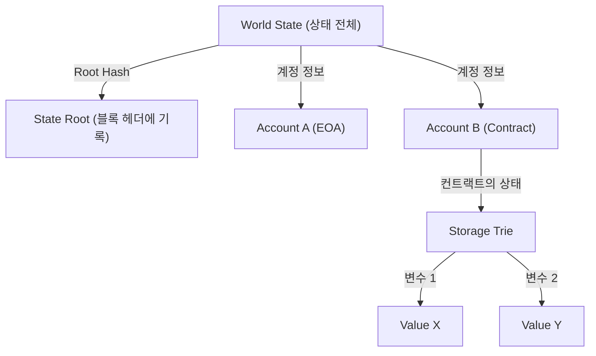

# 스마트 컨트랙트와 EVM(Ethereum Virtual Machine)의 구조: '코드가 법이 된다' 분산형 컴퓨터의 원리

블록체인 기술의 역사를 살펴보면, 비트코인이 '분산형 디지털 통화'라는 개념을 확립한 반면, 이더리움(Ethereum)은 '분산형 컴퓨터'로서의 길을 개척했습니다. 이 혁명의 핵심에 있는 것이 '스마트 컨트랙트(Smart Contract)'와 이를 실행하기 위한 기반인 'EVM(Ethereum Virtual Machine: 이더리움 가상 머신)'입니다.

본 문서에서는 스마트 컨트랙트가 어떻게 동작하는지, 그리고 EVM이 어떤 아키텍처를 가지고 있으며 왜 그렇게 설계되었는지를 기술적인 관점에서 깊이 파헤쳐 설명합니다.

## 1. 왜 이더리움이 필요했는가: 비트코인 스크립트의 한계

스마트 컨트랙트의 개념 자체는 암호학자 닉 사보(Nick 사보)에 의해 1990년대에 제창되었지만, 이를 실용화한 것은 블록체인 기술이었습니다. 비트코인에도 트랜잭션의 정당성을 검증하기 위한 스크립트 언어(Bitcoin Script)가 탑재되어 있습니다. 하지만 비트코인의 스크립트는 의도적으로 '튜링 불완전(Turing Incomplete)'하게 설계되었습니다.

튜링 불완전이란, 간단히 말해 '루프(반복 처리)'나 '복잡한 조건 분기'를 가지지 않음을 의미합니다. 여기에는 명확한 이유가 있었습니다. 블록체인 상의 모든 노드가 트랜잭션을 검증하기 때문에, 만약 악의적인 사용자가 '무한 루프'를 일으키는 스크립트를 전송할 경우, 네트워크 전체의 노드가 멈춰버리는 'DoS(Denial of Service) 공격'의 취약성을 낳기 때문입니다.

하지만 이 튜링 불완전성 때문에, 비트코인의 스크립트로는 복잡한 금융 계약이나 분산형 애플리케이션(DApps)을 구축하는 것이 매우 어려웠습니다. 비탈릭 부테린(Vitalik Buterin)은 이 제약을 없애고, 누구나 임의의 로직을 실행할 수 있는 '튜링 완전(Turing Complete)'한 블록체인 플랫폼의 필요성을 절감했습니다. 그것이 이더리움 탄생의 원동력입니다.

## 2. EVM(Ethereum Virtual Machine)이란 무엇인가?

EVM은 이더리움 네트워크의 심장부이며, '글로벌 분산형 컴퓨터'라고 표현됩니다. 전 세계에 흩어져 있는 수천 개의 노드가 완전히 동일한 상태(스테이트)를 공유하고, 동일한 코드를 실행합니다.

EVM은 특정 하드웨어나 OS에 종속되지 않는 '가상 머신'입니다. Java에서의 JVM(Java Virtual Machine)과 비슷하지만, EVM은 전 세계의 노드에서 동기화되어 동작한다는 점에서 다릅니다. 개발자는 Solidity나 Vyper 같은 고수준 언어로 스마트 컨트랙트를 작성하고, 이를 컴파일하여 생성된 '바이트코드(Bytecode)'가 EVM 상에서 실행됩니다.

### 스택 머신의 실행 모델

EVM 아키텍처의 가장 큰 특징은 그것이 '스택 머신(Stack Machine)'이라는 점입니다. 레지스터 머신(x86이나 ARM 등 일반적인 CPU 아키텍처)과는 달리, EVM은 '스택(Stack)'이라는 데이터 구조(LIFO: 후입선출)를 사용하여 연산을 수행합니다.

예를 들어, '2 + 3'이라는 계산을 수행할 경우, EVM의 어셈블리 코드(오프코드)는 다음과 같습니다.

1. `PUSH1 0x02` (스택에 2를 푸시)
2. `PUSH1 0x03` (스택에 3을 푸시)
3. `ADD` (스택에서 두 개의 값을 꺼내어 더한 후, 결과인 5를 스택에 푸시)

스택 머신의 장점은 오프코드(Opcode)가 단순하며, 가상 머신의 구현을 가볍고 안전하게 유지하기 쉽다는 것입니다. 이더리움 노드는 저사양 하드웨어에서도 동작할 것이 요구되기 때문에 이러한 경량성은 매우 중요합니다. 스택의 깊이는 최대 1024로 제한되어 있으며, 다루는 데이터 크기는 256비트(32바이트)의 워드 길이를 기본으로 합니다. 이는 암호학적인 해시(Keccak-256)나 서명(secp256k1) 계산을 효율적으로 수행하기 위한 설계입니다.

## 3. '무한 루프 문제'를 해결하는 천재적인 설계: Gas(가스비)

이더리움이 튜링 완전한 스크립트 언어를 도입함에 따라, 앞서 언급한 '무한 루프로 인한 네트워크 마비'라는 치명적인 리스크가 부상했습니다. 이 문제를 우아하게 해결한 것이 바로 'Gas(가스비)'라는 인센티브 설계입니다.

Gas란 EVM 상에서 계산을 실행하거나 데이터를 저장할 때 소비되는 '연료'입니다. 사용자가 스마트 컨트랙트를 실행할(트랜잭션을 발행할) 때, 해당 트랜잭션에는 실행 수수료로 ETH(이더)를 지불해야 합니다.

- 모든 오프코드(명령)에는 그 계산량에 비례하는 Gas 비용이 설정되어 있습니다. 예를 들어, 간단한 연산(`ADD`)은 매우 저렴하고(3 Gas), 블록체인에 영구적인 데이터를 저장하는 작업(`SSTORE`)은 매우 비싸게(20,000 Gas) 설정되어 있습니다.
- 트랜잭션 전송자는 미리 'Gas Limit(더 이상은 소비하지 않겠다는 상한)'과 'Gas Price(1 Gas당 ETH 가격)'를 설정합니다.
- EVM이 코드를 1줄 실행할 때마다, 설정된 Gas Limit에서 Gas가 차감됩니다.
- 만약 무한 루프에 빠져 Gas가 고갈(Out of Gas)될 경우, 트랜잭션의 실행은 그 시점에서 강제 종료(Revert)되며, 상태는 실행 전으로 되돌아갑니다. 하지만, **소비된 Gas(수수료)는 마이너(또는 밸리데이터)에게 지불되며 환불되지 않습니다**.

이 구조로 인해, 공격자가 무한 루프 트랜잭션을 전송하더라도 자신의 자금(ETH)만 고갈될 뿐, 네트워크 전체에는 영향을 주지 않습니다. '경제적인 비용'을 도입함으로써 튜링 완전한 환경에서의 정지 문제(Halting Problem)를 현실 세계에서 해결한 것은 이더리움의 가장 큰 공적 중 하나입니다.

## 4. 월드 스테이트 모델: Patricia Trie를 통한 상태 관리

비트코인이 UTXO(Unspent Transaction Output: 미사용 트랜잭션 출력값) 모델을 채택하고 있는 반면, 이더리움은 '계정 기반의 스테이트 모델'을 채택하고 있습니다.

이더리움의 세계에는 2종류의 계정이 존재합니다.
1. **EOA (Externally Owned Account)**: 개인 키를 통해 사람이 관리하는 일반적인 계정.
2. **Contract Account**: 스마트 컨트랙트의 코드와 데이터가 저장된 계정. 개인 키는 없으며 오직 코드에 의해서만 제어됩니다.

이더리움 네트워크 전체의 상태(모든 계정의 잔고 및 스마트 컨트랙트의 데이터)는 '월드 스테이트(World State)'로서 관리됩니다. 이 거대한 데이터 구조를 효율적이고 안전하게 관리하며, 위조를 불가능하게 만들기 위해 이더리움은 'Modified Merkle Patricia Trie(머클 패트리샤 트리)'라는 데이터 구조를 채택하고 있습니다.

이 구조의 장점은 특정 상태에 대한 '암호학적인 증명'을 쉽게 생성할 수 있다는 것입니다. 상태의 아주 일부분(예를 들어 특정 컨트랙트의 변수 하나)이 변경되기만 해도 Root Hash가 연쇄적으로 변화하기 때문에, 상태의 불일치나 위조를 네트워크 전체에서 즉각적으로 감지할 수 있습니다. 이를 통해 노드는 방대한 데이터를 효율적으로 동기화하고 검증할 수 있게 됩니다.

## 5. Solidity 코드의 라이프사이클: 배포부터 실행까지

마지막으로, 개발자가 Solidity로 작성한 코드가 어떻게 이더리움 상에서 '법'으로서 기능하는지 그 라이프사이클을 살펴보겠습니다.

### 1. 컴파일
개발자가 작성한 Solidity 소스 코드는 컴파일러(`solc`)에 의해, EVM이 이해할 수 있는 '바이트코드'와 컨트랙트의 인터페이스를 정의한 'ABI(Application Binary Interface)'로 변환됩니다.

### 2. 배포 (Creation Transaction)
컴파일된 바이트코드는 수신처(`to`)가 비어 있는(null) 특별한 트랜잭션으로서 네트워크에 전송됩니다. 이 트랜잭션이 블록에 포함되면, EVM은 초기화 코드를 실행하고, 최종적인 컨트랙트의 바이트코드를 월드 스테이트 상의 새로운 주소에 저장합니다. 이 순간 컨트랙트는 블록체인 상에 영구화되며, 다시는 삭제하거나 변경할 수 없는(`selfdestruct`가 호출되지 않는 한) 상태가 됩니다.

### 3. 실행 (Message Call)
사용자(EOA)나 다른 스마트 컨트랙트가, 함수 호출의 데이터(함수 셀렉터와 인수)를 포함한 트랜잭션을 전송함으로써 컨트랙트가 실행됩니다. EVM은 월드 스테이트에서 컨트랙트의 바이트코드를 읽어 들이고, 지정된 데이터를 입력으로 하여 스택 머신을 구동시켜 상태를 업데이트합니다.

### '코드가 법이 된다(Code is Law)'의 진정한 의미

한 번 배포된 스마트 컨트랙트는 누구도 변경할 수 없으며, 프로그래밍된 대로만 동작합니다. 검열도, 다운타임도, 제3자의 개입도 없습니다. 금융 프로토콜(DeFi)이나 탈중앙화 자율조직(DAO)은 이 '멈출 수 없는 코드'라는 성질 위에 성립되어 있습니다.

하지만 이는 동시에 '버그도 법이 된다'라는 엄혹한 현실을 의미합니다. 만약 코드에 취약성이 있다면 가차 없이 자금이 유출됩니다(The DAO 사건 등이 그 전형입니다). 그렇기 때문에 스마트 컨트랙트 개발에 있어서는 기존의 웹 개발과는 차원이 다른 수준의 보안 감사와, 페일세이프(fail-safe) 설계가 요구됩니다.

## 요약

이더리움과 EVM의 등장은 단순한 결제 네트워크였던 블록체인에 '프로그래밍 가능성(Programmability)'을 부여하여 Web3라는 새로운 패러다임을 열었습니다.
튜링 불완전한 비트코인 스크립트의 한계를 돌파하면서도, Gas를 통한 경제적 인센티브와 Patricia Trie를 통한 견고한 상태 관리, 그리고 단순하고 탄탄한 스택 머신(EVM)을 결합함으로써, 분산형 컴퓨터라는 웅대한 비전을 실현하고 있습니다.

스마트 컨트랙트의 아키텍처를 깊이 이해하는 것은, Web3 시대의 분산형 시스템이 가진 가능성과 한계를 깨닫고, 더욱 안전하고 혁신적인 DApp을 구축하기 위한 첫걸음이 될 것입니다.
