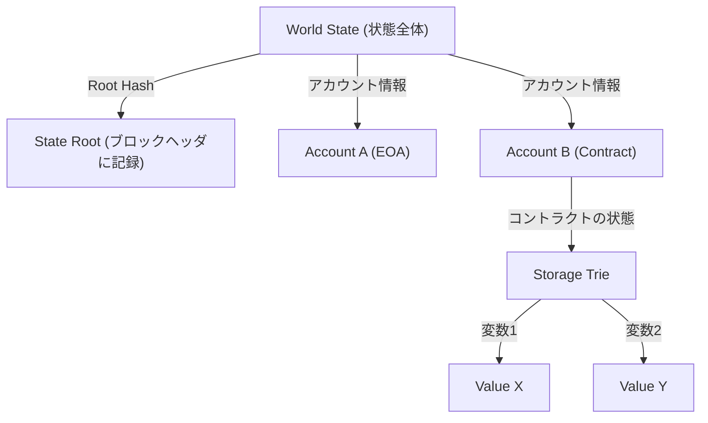

# スマートコントラクトとEVM（Ethereum Virtual Machine）の構造：「コードが法律になる」分散型コンピュータの仕組み

ブロックチェーン技術の歴史を紐解くと、ビットコインが「分散型デジタル通貨」という概念を確立した一方で、Ethereumは「分散型コンピュータ」としての道を切り開きました。この革命の中核にあるのが、「スマートコントラクト」と、それを実行するための基盤である「EVM（Ethereum Virtual Machine：イーサリアム仮想マシン）」です。

本記事では、スマートコントラクトがいかにして動作するのか、そしてEVMがどのようなアーキテクチャを持ち、なぜそのように設計されているのかを、技術的な観点から深く掘り下げて解説します。

## 1. なぜEthereumが必要だったのか：ビットコイン・スクリプトの限界

スマートコントラクトの概念自体は、暗号学者のニック・サボ（Nick Szabo）によって1990年代に提唱されていましたが、それを実用化したのはブロックチェーン技術でした。ビットコインにも、トランザクションの正当性を検証するためのスクリプト言語（Bitcoin Script）が搭載されています。しかし、ビットコインのスクリプトは意図的に「チューリング不完全（Turing Incomplete）」に設計されています。

チューリング不完全とは、簡単に言えば「ループ（繰り返し処理）」や「複雑な条件分岐」を持たないことを意味します。これには明確な理由がありました。ブロックチェーン上のすべてのノードがトランザクションを検証するため、もし悪意のあるユーザーが「無限ループ」を引き起こすスクリプトを送信した場合、ネットワーク全体のノードがフリーズしてしまう「DoS（Denial of Service）攻撃」の脆弱性を生むからです。

しかし、このチューリング不完全性ゆえに、ビットコインのスクリプトでは複雑な金融契約や分散型アプリケーション（DApps）を構築することが非常に困難でした。ヴィタリック・ブテリン（Vitalik Buterin）は、この制約を取り払い、誰もが任意のロジックを実行できる「チューリング完全（Turing Complete）」なブロックチェーンプラットフォームの必要性を痛感しました。それがEthereum誕生の原動力です。

## 2. EVM（Ethereum Virtual Machine）とは何か？

EVMは、Ethereumネットワークの心臓部であり、「グローバルな分散型コンピュータ」と表現されます。世界中に散らばる何千ものノードが、全く同じ状態（ステート）を共有し、同じコードを実行します。

EVMは、特定のハードウェアやOSに依存しない「仮想マシン」です。JavaにおけるJVM（Java Virtual Machine）に似ていますが、EVMは世界中のノードで同期して動作するという点で異なります。開発者はSolidityやVyperといった高水準言語でスマートコントラクトを記述し、それをコンパイルして生成された「バイトコード」がEVM上で実行されます。

### スタックマシンの実行モデル

EVMのアーキテクチャの最大の特徴は、それが「スタックマシン（Stack Machine）」であることです。レジスタマシン（x86やARMなど一般的なCPUアーキテクチャ）とは異なり、EVMは「スタック」と呼ばれるデータ構造（LIFO：後入れ先出し）を用いて演算を行います。

例えば、「2 + 3」という計算を行う場合、EVMのアセンブリコード（オペコード）は以下のようになります。

1. `PUSH1 0x02` （スタックに2を積む）
2. `PUSH1 0x03` （スタックに3を積む）
3. `ADD` （スタックから2つの値を取り出し、足し合わせて、結果の5をスタックに積む）

スタックマシンの利点は、オペコードがシンプルであり、仮想マシンの実装を軽量かつ安全に保ちやすいことです。Ethereumのノードは、低スペックなハードウェアでも動作することが求められるため、この軽量さは非常に重要です。スタックの深さは最大1024に制限されており、扱うデータサイズは256ビット（32バイト）のワード長を基本とします。これは、暗号学的なハッシュ（Keccak-256）や署名（secp256k1）の計算を効率的に行うための設計です。

## 3. 「無限ループ問題」を解決する天才的な設計：Gas（ガス代）

Ethereumがチューリング完全なスクリプト言語を導入したことで、前述の「無限ループによるネットワークの停止」という致命的なリスクが浮上しました。この問題をエレガントに解決したのが、「Gas（ガス代）」というインセンティブ設計です。

Gasとは、EVM上で計算を実行したり、データを保存したりする際に消費される「燃料」です。ユーザーがスマートコントラクトを実行する（トランザクションを発行する）際、そのトランザクションには実行するための手数料としてETH（イーサ）を支払う必要があります。

- すべてのオペコード（命令）には、その計算量に応じたGasコストが設定されています。例えば、簡単な演算（`ADD`）は非常に安く（3 Gas）、ブロックチェーンに永続的なデータを保存する操作（`SSTORE`）は非常に高く（20,000 Gas）設定されています。
- トランザクション送信者は、あらかじめ「Gas Limit（これ以上は消費しないという上限）」と「Gas Price（1 GasあたりのETH価格）」を設定します。
- EVMがコードを1行実行するたびに、設定されたGas LimitからGasが引かれていきます。
- もし無限ループに陥り、Gasが枯渇（Out of Gas）した場合、トランザクションの実行はその時点で強制終了（Revert）され、状態は実行前に戻ります。しかし、**消費されたGas（手数料）はマイナー（またはバリデーター）に支払われ、返金されません**。

この仕組みにより、攻撃者が無限ループのトランザクションを送信しても、自身の資金（ETH）が枯渇するだけで、ネットワーク全体に影響を与えることはありません。「経済的なコスト」を導入することで、チューリング完全な環境における計算停止問題（Halting Problem）を現実世界で解決したのが、Ethereumの最大の功績の一つです。

## 4. ワールドステートモデル：Patricia Trieによる状態管理

ビットコインがUTXO（Unspent Transaction Output：未使用のトランザクションアウトプット）モデルを採用しているのに対し、Ethereumは「アカウントベースのステートモデル」を採用しています。

Ethereumの世界には2種類のアカウントが存在します。
1. **EOA (Externally Owned Account)**: 秘密鍵によって人間が管理する一般的なアカウント。
2. **Contract Account**: スマートコントラクトのコードとデータが格納されたアカウント。秘密鍵はなく、コードによってのみ制御されます。

Ethereumネットワーク全体の状態（全てのアカウントの残高や、スマートコントラクトのデータ）は、「ワールドステート（World State）」として管理されます。この巨大なデータ構造を効率的かつ安全に管理し、改ざん不可能にするために、Ethereumは「Modified Merkle Patricia Trie（マークル・パトリシア・ツリー）」というデータ構造を採用しています。

この構造の利点は、特定の状態に対する「暗号学的な証明」を簡単に作成できることです。状態のほんの一部（例えばあるコントラクトの一つの変数）が変更されるだけで、Root Hashが連鎖的に変化するため、状態の不一致や改ざんをネットワーク全体で即座に検知できます。これにより、ノードは膨大なデータを効率的に同期・検証することが可能になります。

## 5. Solidityコードのライフサイクル：デプロイから実行まで

最後に、開発者がSolidityで記述したコードが、どのようにEthereum上で「法律」として機能するのか、そのライフサイクルを見てみましょう。

### 1. コンパイル
開発者が記述したSolidityのソースコードは、コンパイラ（`solc`）によって、EVMが理解できる「バイトコード」と、コントラクトのインターフェースを定義した「ABI（Application Binary Interface）」に変換されます。

### 2. デプロイ（Creation Transaction）
コンパイルされたバイトコードは、宛先（`to`）が空（null）の特別なトランザクションとしてネットワークに送信されます。このトランザクションがブロックに取り込まれると、EVMは初期化コードを実行し、最終的なコントラクトのバイトコードをワールドステート上の新しいアドレスに保存します。この瞬間、コントラクトはブロックチェーン上に永続化され、二度と削除や変更ができない（`selfdestruct`が呼ばれない限り）状態になります。

### 3. 実行（Message Call）
ユーザー（EOA）や他のスマートコントラクトが、関数呼び出しのデータ（関数セレクタと引数）を含んだトランザクションを送信することで、コントラクトが実行されます。EVMはワールドステートからコントラクトのバイトコードを読み込み、指定されたデータを入力としてスタックマシンを動かし、状態を更新します。

### 「コードが法律になる（Code is Law）」の真意

一度デプロイされたスマートコントラクトは、誰にも変更できず、プログラムされた通りにしか動作しません。検閲も、ダウンタイムも、第三者の介入もありません。金融プロトコル（DeFi）や分散型自律組織（DAO）は、この「止められないコード」という性質の上に成り立っています。

しかし、それは同時に「バグも法律になる」という厳しい現実を意味します。もしコードに脆弱性があれば、容赦無く資金が流出します（The DAO事件などがその典型です）。そのため、スマートコントラクトの開発においては、従来のWeb開発とは次元の異なるレベルのセキュリティ監査と、フェイルセーフの設計が求められます。

## まとめ

EthereumとEVMの登場は、単なる決済ネットワークだったブロックチェーンに「プログラマビリティ」をもたらし、Web3という新たなパラダイムを切り開きました。
チューリング不完全なビットコインスクリプトの限界を打ち破りながらも、Gasによる経済的インセンティブと、Patricia Trieによる強固な状態管理、そしてシンプルで堅牢なスタックマシン（EVM）を組み合わせることで、分散型コンピュータという壮大なビジョンを実現しています。

スマートコントラクトのアーキテクチャを深く理解することは、Web3時代における分散型システムの可能性と限界を知り、より安全で革新的なDAppsを構築するための第一歩となるでしょう。
