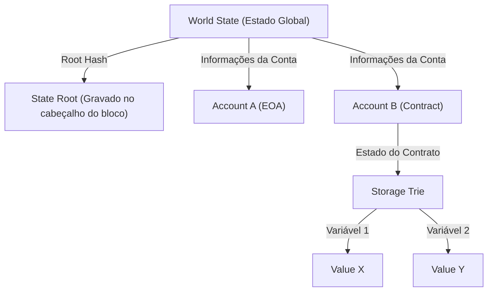

# A Estrutura dos Smart Contracts e da EVM (Ethereum Virtual Machine): Como funciona o computador descentralizado onde "o código é a lei"

Ao analisar a história da tecnologia blockchain, enquanto o Bitcoin estabeleceu o conceito de "moeda digital descentralizada", a Ethereum abriu caminho como um "computador descentralizado". No centro dessa revolução estão os "smart contracts" (contratos inteligentes) e a "EVM (Ethereum Virtual Machine)", a infraestrutura responsável por executá-los.

Neste artigo, vamos explorar profundamente, do ponto de vista técnico, como funcionam os smart contracts, qual é a arquitetura da EVM e por que ela foi projetada dessa maneira.

## 1. Por que a Ethereum era necessária: Os limites do Bitcoin Script

O conceito de smart contracts foi proposto na década de 1990 pelo criptógrafo Nick Szabo, mas foi a tecnologia blockchain que o tornou prático. O Bitcoin também possui uma linguagem de script (Bitcoin Script) para verificar a validade das transações. No entanto, os scripts do Bitcoin foram intencionalmente projetados para serem "Turing Incomplete" (Turing incompletos).

Ser "Turing incompleto" significa, em termos simples, que não possui "loops" (processos de repetição) ou "ramificações condicionais complexas". Havia um motivo claro para isso. Como todos os nós na blockchain verificam as transações, se um usuário mal-intencionado enviasse um script causando um "loop infinito", criaria uma vulnerabilidade de ataque "DoS (Denial of Service)", congelando os nós de toda a rede.

No entanto, devido a essa incompletude de Turing, era extremamente difícil construir contratos financeiros complexos e aplicativos descentralizados (DApps) com os scripts do Bitcoin. Vitalik Buterin sentiu fortemente a necessidade de uma plataforma blockchain "Turing Complete" (Turing completa) que removesse essa restrição e permitisse que qualquer pessoa executasse lógicas arbitrárias. Essa foi a força motriz por trás da criação da Ethereum.

## 2. O que é a EVM (Ethereum Virtual Machine)?

A EVM é o coração da rede Ethereum, frequentemente descrita como um "computador global descentralizado". Milhares de nós espalhados pelo mundo compartilham exatamente o mesmo estado (state) e executam o mesmo código.

A EVM é uma "máquina virtual" que não depende de um hardware ou sistema operacional específico. É semelhante à JVM (Java Virtual Machine) no Java, mas a EVM difere por operar de forma síncrona em nós de todo o mundo. Os desenvolvedores escrevem smart contracts em linguagens de alto nível como Solidity e Vyper; o código é compilado e o "bytecode" gerado é executado na EVM.

### Modelo de execução de Máquina de Pilha (Stack Machine)

A principal característica da arquitetura da EVM é ser uma "Stack Machine" (máquina de pilha). Diferente de uma máquina de registradores (como arquiteturas de CPU comuns, x86 ou ARM), a EVM realiza operações usando uma estrutura de dados chamada "pilha" (LIFO: Last-In, First-Out).

Por exemplo, ao calcular "2 + 3", o código assembly (opcode) da EVM seria o seguinte:

1. `PUSH1 0x02` (Empilha o valor 2)
2. `PUSH1 0x03` (Empilha o valor 3)
3. `ADD` (Remove os dois valores da pilha, soma-os e empilha o resultado, 5)

A vantagem de uma máquina de pilha é que os opcodes são simples, o que facilita manter a implementação da máquina virtual leve e segura. Como os nós da Ethereum precisam ser capazes de rodar em hardwares de baixas especificações, essa leveza é fundamental. A profundidade máxima da pilha é limitada a 1024, e o tamanho dos dados manipulados baseia-se num comprimento de palavra de 256 bits (32 bytes). Este é um design para calcular hashes criptográficos (Keccak-256) e assinaturas (secp256k1) de forma eficiente.

## 3. O design genial para resolver o "Problema do Loop Infinito": Gas (Taxa de Gás)

Com a introdução de uma linguagem de script Turing completa na Ethereum, surgiu o risco fatal já mencionado de "paralisação da rede por loops infinitos". Este problema foi resolvido de forma elegante pelo design de incentivos chamado "Gas" (taxa de gás).

O Gas é o "combustível" consumido ao executar cálculos ou armazenar dados na EVM. Quando um usuário executa um smart contract (emite uma transação), ele deve pagar ETH (Ether) como taxa de execução dessa transação.

- Todos os opcodes (instruções) têm um custo de Gas definido de acordo com a sua complexidade computacional. Por exemplo, uma operação simples (`ADD`) é muito barata (3 Gas), enquanto a operação de salvar dados permanentes na blockchain (`SSTORE`) é muito cara (20.000 Gas).
- O remetente da transação define antecipadamente o "Gas Limit" (o limite máximo de Gas que está disposto a consumir) e o "Gas Price" (o preço em ETH por 1 unidade de Gas).
- Cada vez que a EVM executa uma linha de código, o Gas correspondente é deduzido do Gas Limit definido.
- Se entrar num loop infinito e o Gas se esgotar (Out of Gas), a execução da transação é imediatamente abortada (Revert) e o estado retorna ao momento anterior à execução. No entanto, **o Gas consumido (a taxa) é pago aos mineradores (ou validadores) e não é reembolsado**.

Com esse mecanismo, mesmo que um invasor envie uma transação em loop infinito, apenas os seus próprios fundos (ETH) serão esgotados, não afetando a rede como um todo. Introduzir um "custo econômico" para resolver o Problema da Parada (Halting Problem) no mundo real, em um ambiente Turing completo, é uma das maiores conquistas da Ethereum.

## 4. O modelo de estado global: Gerenciamento de estado via Patricia Trie

Enquanto o Bitcoin adota o modelo UTXO (Unspent Transaction Output - Saída de Transação Não Gasta), a Ethereum adota um "modelo de estado baseado em contas" (Account-based state model).

Existem dois tipos de contas no mundo da Ethereum:
1. **EOA (Externally Owned Account)**: Contas comuns controladas por humanos por meio de chaves privadas.
2. **Contract Account**: Contas onde o código e os dados do smart contract estão armazenados. Não possuem chave privada e são controladas apenas pelo código.

O estado completo da rede Ethereum (saldos de todas as contas e dados dos smart contracts) é gerenciado como o "World State" (Estado Global). Para gerenciar de forma eficiente e segura essa enorme estrutura de dados e torná-la à prova de violações, a Ethereum adota uma estrutura chamada "Modified Merkle Patricia Trie".

A vantagem dessa estrutura é que é fácil criar "provas criptográficas" para estados específicos. Se apenas uma pequena parte do estado (por exemplo, uma única variável de um contrato) for alterada, o Root Hash muda em cadeia, permitindo que discrepâncias ou manipulações de estado sejam detectadas imediatamente por toda a rede. Isso permite que os nós sincronizem e verifiquem uma enorme quantidade de dados de forma eficiente.

## 5. O ciclo de vida do código Solidity: Da implantação à execução

Por fim, vamos observar o ciclo de vida de como o código escrito em Solidity pelos desenvolvedores funciona como "lei" na Ethereum.

### 1. Compilação
O código-fonte Solidity escrito pelos desenvolvedores é convertido pelo compilador (`solc`) em "bytecode" compreensível pela EVM e em uma "ABI (Application Binary Interface)" que define a interface do contrato.

### 2. Implantação (Creation Transaction)
O bytecode compilado é enviado para a rede como uma transação especial onde o destino (`to`) é nulo (null). Quando essa transação é incluída em um bloco, a EVM executa o código de inicialização e salva o bytecode final do contrato num novo endereço no World State. Neste momento, o contrato torna-se persistente na blockchain, em um estado que não pode mais ser deletado ou alterado (a menos que o `selfdestruct` seja invocado).

### 3. Execução (Message Call)
Um usuário (EOA) ou outro smart contract envia uma transação contendo os dados da chamada da função (seletor de função e argumentos), fazendo o contrato ser executado. A EVM lê o bytecode do contrato a partir do World State, opera a máquina de pilha usando os dados fornecidos como entrada, e atualiza o estado.

### O verdadeiro significado de "O código é a lei" (Code is Law)

Uma vez implantado, um smart contract não pode ser modificado por ninguém e opera estritamente conforme programado. Não há censura, tempo de inatividade (downtime) ou intervenção de terceiros. Protocolos financeiros (DeFi) e organizações autônomas descentralizadas (DAO) baseiam-se nessa característica de "código ininterrupto".

No entanto, isso também significa a dura realidade de que "os bugs também se tornam lei". Se o código tiver uma vulnerabilidade, os fundos serão drenados implacavelmente (o incidente "The DAO" é um exemplo clássico). Portanto, o desenvolvimento de smart contracts requer um nível de auditoria de segurança e de design de segurança (fail-safe) que se encontra em uma dimensão totalmente diferente do desenvolvimento Web tradicional.

## Resumo

A chegada da Ethereum e da EVM trouxe "programabilidade" à blockchain, que era apenas uma rede de pagamentos, e abriu o novo paradigma da Web3.
Enquanto superava as limitações do Bitcoin Script Turing incompleto, ao combinar incentivos econômicos via Gas, gerenciamento de estado robusto via Patricia Trie, e uma máquina de pilha simples e sólida (EVM), materializou a grandiosa visão de um computador descentralizado.

Compreender profundamente a arquitetura dos smart contracts é o primeiro passo para conhecer as possibilidades e os limites dos sistemas descentralizados na era da Web3, permitindo construir DApps mais seguros e inovadores.
