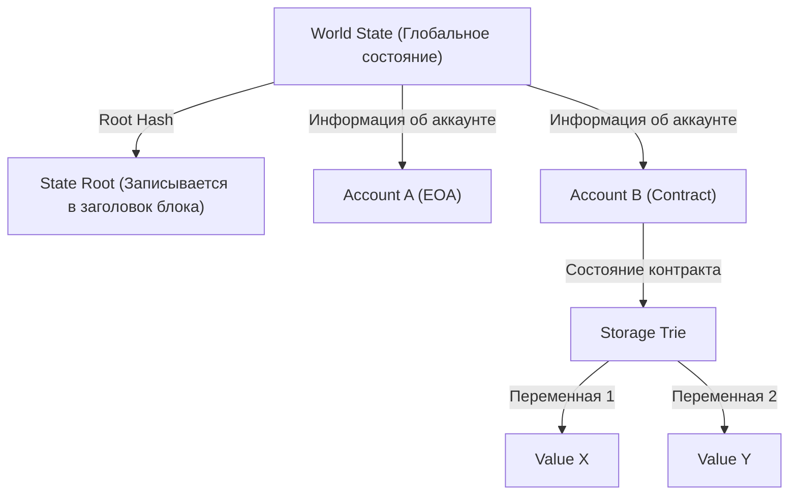

# Структура смарт-контрактов и EVM (Ethereum Virtual Machine): Как работает децентрализованный компьютер, где 'код становится законом'

Если обратиться к истории технологии блокчейн, можно заметить, что хотя Биткойн и утвердил концепцию "децентрализованной цифровой валюты", именно Ethereum проложил путь к созданию "децентрализованного компьютера". В основе этой революции лежат "смарт-контракты" и базовая архитектура для их выполнения — "EVM" (Ethereum Virtual Machine, или Виртуальная машина Эфириума).

В этой статье мы подробно, с технической точки зрения, разберем, как работают смарт-контракты, какую архитектуру имеет EVM и почему она была спроектирована именно так.

## 1. Зачем понадобился Ethereum: Ограничения сценариев (Script) Биткойна

Сама концепция смарт-контрактов была предложена криптографом Ником Сабо (Nick Szabo) еще в 1990-х годах, но ее практическое применение стало возможным лишь благодаря технологии блокчейн. Биткойн также оснащен сценарным языком (Bitcoin Script) для проверки подлинности транзакций. Однако сценарии Биткойна намеренно спроектированы так, чтобы быть "неполными по Тьюрингу" (Turing Incomplete).

Неполнота по Тьюрингу, говоря простым языком, означает отсутствие "циклов" (повторяющихся операций) и "сложных условных ветвлений". Для этого была веская причина. Поскольку все узлы в блокчейне проверяют транзакции, если бы злоумышленник отправил сценарий, вызывающий "бесконечный цикл", это привело бы к зависанию узлов по всей сети и уязвимости к атакам типа DoS (Denial of Service).

Однако именно из-за этой неполноты по Тьюрингу создание сложных финансовых контрактов и децентрализованных приложений (DApps) с использованием сценариев Биткойна оказалось крайне сложной задачей. Виталик Бутерин (Vitalik Buterin) остро осознал необходимость устранения этих ограничений и создания "полной по Тьюрингу" (Turing Complete) блокчейн-платформы, где любой желающий мог бы выполнять произвольную логику. Это и стало движущей силой для создания Ethereum.

## 2. Что такое EVM (Ethereum Virtual Machine)?

EVM — это сердце сети Ethereum, которое часто называют "глобальным децентрализованным компьютером". Тысячи узлов, разбросанных по всему миру, совместно используют абсолютно одинаковое состояние (state) и выполняют один и тот же код.

EVM — это "виртуальная машина", не зависящая от конкретного оборудования или операционной системы. Она похожа на JVM (Java Virtual Machine) в Java, но отличается тем, что EVM работает синхронно на всех узлах по всему миру. Разработчики пишут смарт-контракты на языках высокого уровня, таких как Solidity или Vyper, которые затем компилируются, а полученный "байт-код" выполняется на EVM.

### Модель выполнения: Стек-машина (Stack Machine)

Главной особенностью архитектуры EVM является то, что она представляет собой "стек-машину" (Stack Machine). В отличие от регистровых машин (таких как x86 или ARM — распространенных архитектур CPU), EVM для выполнения операций использует структуру данных, называемую "стеком" (работающую по принципу LIFO — последним пришел, первым ушел).

Например, для вычисления выражения "2 + 3" ассемблерный код EVM (коды операций, или опкоды) будет выглядеть следующим образом:

1. `PUSH1 0x02` (Поместить значение 2 в стек)
2. `PUSH1 0x03` (Поместить значение 3 в стек)
3. `ADD` (Извлечь два значения из стека, сложить их и поместить результат 5 обратно в стек)

Преимущество стек-машины заключается в простоте опкодов, что позволяет легко поддерживать легковесность и безопасность реализации виртуальной машины. Поскольку от узлов Ethereum требуется способность работать даже на маломощном оборудовании, эта легковесность имеет огромное значение. Глубина стека ограничена максимумом в 1024 элемента, а базовый размер обрабатываемых данных (размер слова) составляет 256 бит (32 байта). Такой дизайн позволяет эффективно выполнять криптографические вычисления, такие как хеширование (Keccak-256) и создание подписей (secp256k1).

## 3. Гениальное решение "Проблемы бесконечного цикла": Газ (Gas)

Внедрение полного по Тьюрингу сценарного языка в Ethereum создало упомянутый ранее критический риск — остановку сети из-за бесконечных циклов. Изящным решением этой проблемы стала система экономических стимулов под названием "Газ" (Gas).

Газ — это "топливо", которое расходуется при выполнении вычислений или сохранении данных в EVM. Когда пользователь выполняет смарт-контракт (отправляет транзакцию), он должен заплатить ETH (Эфир) в качестве комиссии за ее выполнение.

- Для каждого опкода (команды) установлена стоимость в Газе в зависимости от объема вычислений. Например, простая арифметическая операция (`ADD`) стоит очень дешево (3 Gas), а операция сохранения постоянных данных в блокчейне (`SSTORE`) — очень дорого (20,000 Gas).
- Отправитель транзакции заранее устанавливает "Gas Limit" (лимит газа — максимальное количество, которое он готов потратить) и "Gas Price" (цена за 1 единицу газа в ETH).
- Каждый раз, когда EVM выполняет одну строку кода, стоимость соответствующей операции вычитается из установленного Gas Limit.
- Если программа попадает в бесконечный цикл и газ заканчивается (возникает ошибка Out of Gas), выполнение транзакции немедленно прерывается (Revert), и состояние возвращается к тому, каким оно было до начала выполнения. Однако **потраченный газ (комиссия) выплачивается майнерам (или валидаторам) и не возвращается пользователю**.

Благодаря этому механизму, даже если злоумышленник отправит транзакцию с бесконечным циклом, это приведет лишь к исчерпанию его собственных средств (ETH) и никак не повлияет на работу сети в целом. Внедрение "экономической стоимости" для решения проблемы остановки (Halting Problem) в среде, полной по Тьюрингу, в реальном мире является одним из величайших достижений Ethereum.

## 4. Модель глобального состояния: Управление состояниями с помощью Patricia Trie

В то время как Биткойн использует модель UTXO (Unspent Transaction Output — неизрасходованные выходы транзакций), Ethereum применяет "модель состояний на основе учетных записей" (Account-based State Model).

В мире Ethereum существует два типа учетных записей:
1. **EOA (Externally Owned Account)**: Обычная учетная запись, управляемая человеком с помощью закрытого ключа.
2. **Contract Account (Учетная запись контракта)**: Учетная запись, в которой хранятся код смарт-контракта и его данные. Она не имеет закрытого ключа и управляется исключительно своим кодом.

Состояние всей сети Ethereum (балансы всех учетных записей и данные смарт-контрактов) управляется как "Глобальное состояние" (World State). Для эффективного и безопасного управления этой огромной структурой данных, а также для защиты от взлома и изменений, Ethereum использует структуру данных, называемую "Modified Merkle Patricia Trie".

Преимущество этой структуры в том, что она позволяет легко создавать "криптографические доказательства" для конкретных состояний. Если изменяется хотя бы крошечная часть состояния (например, одна переменная в контракте), это вызывает цепочку изменений, вплоть до изменения Root Hash. Благодаря этому любые несоответствия или манипуляции с состоянием могут быть мгновенно обнаружены всей сетью. Это позволяет узлам эффективно синхронизировать и проверять огромные объемы данных.

## 5. Жизненный цикл кода Solidity: От развертывания до выполнения

Наконец, давайте рассмотрим жизненный цикл кода, написанного разработчиком на Solidity: как он превращается в "закон" и функционирует в Ethereum.

### 1. Компиляция
Исходный код на Solidity, написанный разработчиком, преобразуется компилятором (`solc`) в "байт-код", понятный EVM, а также в "ABI" (Application Binary Interface), определяющий интерфейс контракта.

### 2. Развертывание (Creation Transaction)
Скомпилированный байт-код отправляется в сеть в виде специальной транзакции с пустым (null) адресом назначения (`to`). Когда эта транзакция включается в блок, EVM выполняет код инициализации и сохраняет окончательный байт-код контракта по новому адресу в World State. С этого момента контракт становится постоянным в блокчейне, и его состояние больше нельзя удалить или изменить (если только не будет вызвана функция `selfdestruct`).

### 3. Выполнение (Message Call)
Контракт выполняется, когда пользователь (EOA) или другой смарт-контракт отправляет транзакцию, содержащую данные для вызова функции (селектор функции и аргументы). EVM считывает байт-код контракта из World State, использует указанные данные в качестве входных параметров для работы стек-машины и обновляет состояние.

### Истинный смысл фразы "Код становится законом" (Code is Law)

Единожды развернутый смарт-контракт никто не может изменить, и он будет работать исключительно так, как был запрограммирован. Никакой цензуры, простоев или вмешательства третьих лиц. Финансовые протоколы (DeFi) и децентрализованные автономные организации (DAO) строятся на этом свойстве "неостанавливаемого кода".

Однако это также означает суровую реальность: "баг тоже становится законом". Если в коде есть уязвимость, средства будут безжалостно украдены (классический пример — инцидент с The DAO). Поэтому разработка смарт-контрактов требует уровня аудита безопасности и проектирования отказоустойчивости, совершенно несопоставимого с традиционной веб-разработкой.

## Заключение

Появление Ethereum и EVM привнесло "программируемость" в блокчейн, который до-этого был лишь платежной сетью, и открыло новую парадигму под названием Web3.
Преодолевая ограничения неполных по Тьюрингу сценариев Биткойна, Ethereum реализовал грандиозное видение децентрализованного компьютера, объединив экономические стимулы в виде Газа, надежное управление состоянием с помощью Patricia Trie и простую, но надежную стек-машину (EVM).

Глубокое понимание архитектуры смарт-контрактов станет вашим первым шагом к пониманию возможностей и ограничений децентрализованных систем в эпоху Web3, а также поможет создавать более безопасные и инновационные DApps.
