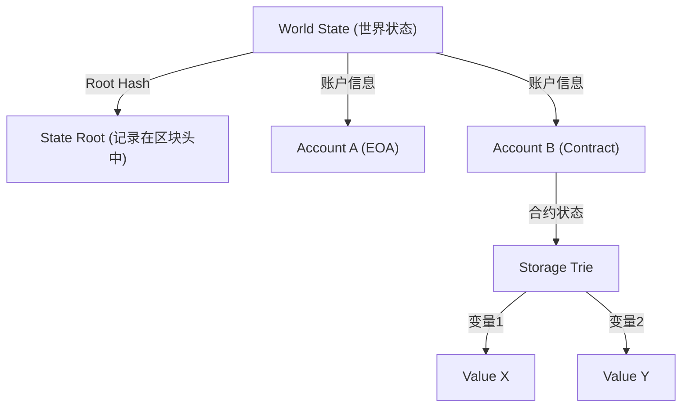

# 智能合约与 EVM（以太坊虚拟机）的结构：“代码即法律”的去中心化计算机机制

回顾区块链技术的历史，比特币确立了“去中心化数字货币”的概念，而以太坊（Ethereum）则开辟了作为“去中心化计算机”的道路。这场革命的核心便是“智能合约（Smart Contract）”及其运行的基础——“EVM（以太坊虚拟机，Ethereum Virtual Machine）”。

本文将从技术角度深入探讨智能合约是如何运作的，EVM 拥有怎样的架构，以及它为何如此设计。

## 1. 为什么需要以太坊：比特币脚本的局限性

智能合约的概念本身由密码学家尼克·萨博（Nick Szabo）在 20 世纪 90 年代提出，但真正将其付诸实用的则是区块链技术。比特币也搭载了用于验证交易合法性的脚本语言（Bitcoin Script）。然而，比特币的脚本被有意设计为“图灵不完备（Turing Incomplete）”。

简单来说，图灵不完备意味着它不具备“循环（重复处理）”或“复杂的条件分支”。这背后有明确的理由：由于区块链上的所有节点都需要验证交易，如果恶意用户发送了会导致“无限循环”的脚本，将会引发导致全网节点瘫痪的“DoS（拒绝服务）攻击”漏洞。

然而，正是由于这种图灵不完备性，在比特币的脚本上构建复杂的金融合约或去中心化应用（DApps）变得极其困难。维塔利克·布特林（Vitalik Buterin）深刻意识到了打破这一限制、建立一个让任何人都能执行任意逻辑的“图灵完备（Turing Complete）”区块链平台的必要性。这正是以太坊诞生的原动力。

## 2. 什么是 EVM（以太坊虚拟机）？

EVM 是以太坊网络的心脏，常被称为“全球去中心化计算机”。散布在世界各地的成千上万个节点共享着完全相同的状态（State），并执行相同的代码。

EVM 是一种不依赖于特定硬件或操作系统的“虚拟机”。它类似于 Java 中的 JVM（Java Virtual Machine），但不同之处在于 EVM 在全球的节点上同步运行。开发者使用 Solidity 或 Vyper 等高级语言编写智能合约，这些合约被编译后生成的“字节码（Bytecode）”便在 EVM 上运行。

### 栈机器（Stack Machine）的执行模型

EVM 架构最大的特点在于它是一个“栈机器（Stack Machine）”。与寄存器机器（如 x86 或 ARM 等常见的 CPU 架构）不同，EVM 使用称为“栈（Stack）”的数据结构（LIFO：后进先出）来进行运算。

例如，在进行“2 + 3”的计算时，EVM 的汇编代码（操作码，Opcode）如下所示：

1. `PUSH1 0x02` （将 2 压入栈）
2. `PUSH1 0x03` （将 3 压入栈）
3. `ADD` （从栈中取出两个值，相加后将结果 5 压回栈）

栈机器的优势在于操作码非常简单，容易保持虚拟机实现的轻量化与安全性。因为以太坊节点被要求即使在低配置的硬件上也能运行，所以这种轻量性至关重要。栈的深度被限制为最大 1024，处理的数据大小以 256 位（32 字节）的字长为基础。这是为了高效进行密码学哈希（Keccak-256）或签名（secp256k1）计算而做出的设计。

## 3. 解决“无限循环问题”的天才设计：Gas（燃料费）

随着以太坊引入图灵完备的脚本语言，前文提到的“无限循环导致网络瘫痪”的致命风险也随之浮现。而优雅地解决这一问题的，正是被称为“Gas（燃料费）”的经济激励设计。

Gas 是在 EVM 上执行计算或存储数据时消耗的“燃料”。当用户执行智能合约（发起交易）时，必须为该交易支付 ETH（以太坊）作为执行手续费。

- 所有的操作码（指令）都根据其计算量设定了相应的 Gas 成本。例如，简单的加法运算（`ADD`）非常便宜（3 Gas），而将数据永久保存在区块链上的操作（`SSTORE`）则非常昂贵（20,000 Gas）。
- 交易发送者会预先设定“Gas Limit（最高可消耗的 Gas 上限）”和“Gas Price（每单位 Gas 的 ETH 价格）”。
- EVM 每执行一行代码，就会从设定的 Gas Limit 中扣除相应的 Gas。
- 如果陷入无限循环，导致 Gas 耗尽（Out of Gas），交易的执行将在该时间点被强制终止（Revert），状态回滚到执行前。然而，**已被消耗的 Gas（手续费）仍会支付给矿工（或验证者），且不予退还**。

凭借这一机制，即使攻击者发送了无限循环的交易，也只会耗尽自己的资金（ETH），而不会对整个网络造成影响。通过引入“经济成本”，在现实世界中解决了图灵完备环境下的停机问题（Halting Problem），这是以太坊最伟大的功绩之一。

## 4. 世界状态模型：通过 Patricia Trie 进行状态管理

与比特币采用 UTXO（Unspent Transaction Output：未花费的交易输出）模型不同，以太坊采用了“基于账户的状态模型（Account-based State Model）”。

在以太坊的世界中存在两种账户：
1. **EOA (Externally Owned Account，外部拥有账户)**: 由人类通过私钥管理的普通账户。
2. **Contract Account (合约账户)**: 存储智能合约代码和数据的账户。没有私钥，仅由代码控制。

整个以太坊网络的状态（所有账户的余额及智能合约的数据）作为“世界状态（World State）”进行管理。为了高效、安全地管理这个庞大的数据结构并使其不可篡改，以太坊采用了“修改过的默克尔-帕特里夏树（Modified Merkle Patricia Trie）”数据结构。

这种结构的优点在于可以轻松为特定状态创建“密码学证明”。只要状态的极小一部分（例如某个合约中的一个变量）发生改变，Root Hash 就会产生连锁反应发生变化，从而使整个网络能够立即检测到状态的不一致或篡改。这使得节点能够高效地同步和验证海量数据。

## 5. Solidity 代码的生命周期：从部署到执行

最后，让我们看看开发者用 Solidity 编写的代码，是如何在以太坊上作为“法律”发挥作用的，它的生命周期是怎样的。

### 1. 编译
开发者编写的 Solidity 源代码被编译器（`solc`）转换成 EVM 可以理解的“字节码（Bytecode）”，以及定义了合约接口的“ABI（Application Binary Interface，应用程序二进制接口）”。

### 2. 部署（Creation Transaction）
编译后的字节码作为一个目标地址（`to`）为空（null）的特殊交易发送到网络中。当该交易被打包进区块时，EVM 会执行初始化代码，并将最终的合约字节码保存到世界状态上的一个新地址中。在这一瞬间，合约便在区块链上永久化了，处于永远无法删除或修改（除非调用了 `selfdestruct`）的状态。

### 3. 执行（Message Call）
用户（EOA）或其他智能合约通过发送包含函数调用数据（函数选择器和参数）的交易来执行合约。EVM 从世界状态中读取合约的字节码，以指定的数据作为输入运行栈机器，并更新状态。

### “代码即法律（Code is Law）”的真正含义

一旦智能合约被部署，任何人都无法修改它，它只能完全按照编写的程序运行。没有审查，没有宕机，也没有第三方的干预。金融协议（DeFi）和去中心化自治组织（DAO）正是建立在这种“不可阻挡的代码”的特性之上。

然而，这也同时意味着“Bug 也是法律”的严酷现实。如果代码中存在漏洞，资金就会被无情地抽走（The DAO 事件就是典型的例子）。因此，在智能合约开发中，需要进行与传统 Web 开发完全不同维度的安全审计与故障保护（Fail-safe）设计。

## 总结

以太坊和 EVM 的出现，为原本只是支付网络的区块链带来了“可编程性”，并开辟了 Web3 这一全新范式。
在突破了图灵不完备的比特币脚本局限性的同时，通过将 Gas 的经济激励、Patricia Trie 的坚固状态管理，以及简单稳健的栈机器（EVM）相结合，实现了去中心化计算机这一宏伟愿景。

深入理解智能合约的架构，是认识 Web3 时代去中心化系统的潜力与极限，并构建更安全、创新的 DApps 的第一步。
