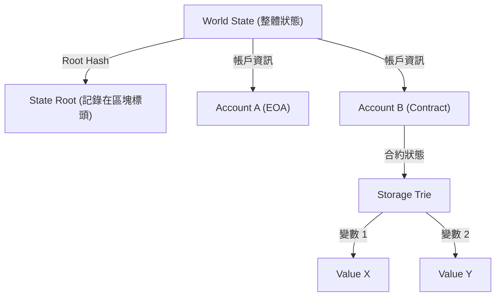

# 智能合約與 EVM (Ethereum Virtual Machine) 的結構：「程式碼即法律」的去中心化電腦運作原理

回顧區塊鏈技術的歷史，比特幣確立了「去中心化數位貨幣」的概念，而以太坊（Ethereum）則開創了作為「去中心化電腦」的道路。這場革命的核心，正是「智能合約（Smart Contract）」以及用來執行它的基礎設施「EVM（Ethereum Virtual Machine：以太坊虛擬機）」。

本文將從技術的角度深入探討智能合約是如何運作的，以及 EVM 具有什麼樣的架構，還有為什麼會這樣設計。

## 1. 為什麼需要以太坊：比特幣腳本的侷限性

智能合約的概念本身是由密碼學家 Nick Szabo 在 1990 年代提出，但將其投入實用的是區塊鏈技術。比特幣也具備用來驗證交易合法性的腳本語言（Bitcoin Script）。然而，比特幣的腳本被刻意設計成「圖靈不完備（Turing Incomplete）」。

簡單來說，圖靈不完備意味著它沒有「迴圈（重複處理）」或「複雜的條件分支」。這樣做有明確的理由。因為區塊鏈上的所有節點都要驗證交易，如果惡意使用者發送會引發「無限迴圈」的腳本，將導致整個網路的節點癱瘓，產生「DoS（Denial of Service）攻擊」的漏洞。

然而，正因為這種圖靈不完備性，要用比特幣的腳本建構複雜的金融合約或去中心化應用程式（DApps）變得非常困難。Vitalik Buterin 深刻體會到，需要一個能打破這個限制、讓任何人都能執行任意邏輯的「圖靈完備（Turing Complete）」區塊鏈平台。這就是以太坊誕生的原動力。

## 2. 什麼是 EVM (Ethereum Virtual Machine)？

EVM 是以太坊網路的心臟，常被形容為「全球去中心化電腦」。散佈在世界各地的數千個節點，共享著完全相同的狀態（State），並執行相同的程式碼。

EVM 是一個不依賴特定硬體或作業系統的「虛擬機」。雖然類似 Java 的 JVM（Java Virtual Machine），但不同之處在於 EVM 是在全世界的節點上同步運作。開發者使用 Solidity 或 Vyper 等高階語言來撰寫智能合約，將其編譯後產生的「位元組碼（Bytecode）」便會在 EVM 上執行。

### 堆疊機 (Stack Machine) 的執行模型

EVM 架構最大的特色，在於它是一個「堆疊機（Stack Machine）」。與暫存器機（如 x86 或 ARM 等一般 CPU 架構）不同，EVM 使用稱為「堆疊」的資料結構（LIFO：後進先出）來進行運算。

例如，當進行「2 + 3」的計算時，EVM 的組合語言（操作碼 / Opcode）會如下所示：

1. `PUSH1 0x02` （將 2 推入堆疊）
2. `PUSH1 0x03` （將 3 推入堆疊）
3. `ADD` （從堆疊中取出兩個值，相加後，將結果 5 推入堆疊）

堆疊機的優點在於操作碼很簡單，這有助於維持虛擬機實作的輕量與安全。由於以太坊節點被要求能在低規格的硬體上運作，這種輕量性非常重要。堆疊的深度限制最大為 1024，處理的資料大小以 256 位元（32 位元組）的字長為基礎。這是為了能有效率地進行密碼學雜湊（Keccak-256）或簽章（secp256k1）計算的設計。

## 3. 解決「無限迴圈問題」的天才設計：Gas (燃料費)

由於以太坊導入了圖靈完備的腳本語言，前面提到的「無限迴圈導致網路停擺」這個致命風險也隨之浮現。優雅地解決這個問題的，就是稱為「Gas（燃料費）」的激勵設計。

Gas 是在 EVM 上執行計算或儲存資料時所消耗的「燃料」。當使用者執行智能合約（發送交易）時，必須支付 ETH（以太幣）作為執行該交易的手續費。

- 所有的操作碼（指令）都設定了對應其計算量的 Gas 成本。例如，簡單的運算（`ADD`）非常便宜（3 Gas），而將資料永久儲存到區塊鏈的操作（`SSTORE`）則設定得非常高（20,000 Gas）。
- 交易發送者會預先設定「Gas Limit（消耗上限）」和「Gas Price（每單位 Gas 的 ETH 價格）」。
- 每當 EVM 執行一行程式碼，就會從設定的 Gas Limit 中扣除 Gas。
- 如果陷入無限迴圈導致 Gas 耗盡（Out of Gas），交易的執行會在那一刻被強制終止（Revert），狀態也會恢復到執行之前。但是，**已經消耗的 Gas（手續費）將支付給礦工（或驗證者），且不予退還**。

透過這種機制，即使攻擊者發送無限迴圈的交易，也只會耗盡自己的資金（ETH），不會對整個網路造成影響。導入「經濟成本」的概念，在現實世界中解決了圖靈完備環境下的停機問題（Halting Problem），這是以太坊最大的成就之一。

## 4. 世界狀態模型：由 Patricia Trie 進行狀態管理

相較於比特幣採用 UTXO（Unspent Transaction Output：未花費交易輸出）模型，以太坊採用了「基於帳戶的狀態模型（Account-based State Model）」。

以太坊的世界中存在兩種帳戶：
1. **EOA (Externally Owned Account)**：由人類透過私鑰管理的一般帳戶。
2. **Contract Account**：儲存智能合約程式碼與資料的帳戶。沒有私鑰，僅由程式碼控制。

整個以太坊網路的狀態（所有帳戶的餘額、智能合約的資料）被當作「世界狀態（World State）」來管理。為了有效率且安全地管理這個巨大的資料結構並防止竄改，以太坊採用了名為「Modified Merkle Patricia Trie（修改版的默克爾帕特里夏樹）」的資料結構。

這種結構的優點是，可以輕易地為特定狀態建立「密碼學證明」。只要狀態有極小的改變（例如某個合約中的一個變數被修改），Root Hash 就會產生連鎖變化，使得整個網路能立刻察覺狀態的不一致或竄改。這讓節點能夠有效率地同步與驗證龐大的資料。

## 5. Solidity 程式碼的生命週期：從部署到執行

最後，我們來看看開發者用 Solidity 撰寫的程式碼，是如何在以太坊上作為「法律」運作的，了解它的生命週期。

### 1. 編譯
開發者撰寫的 Solidity 原始碼會透過編譯器（`solc`），轉換成 EVM 能理解的「位元組碼（Bytecode）」，以及定義合約介面的「ABI（Application Binary Interface）」。

### 2. 部署 (Creation Transaction)
編譯後的位元組碼會作為一個目標地址（`to`）為空（null）的特殊交易發送到網路上。當這個交易被打包進區塊時，EVM 會執行初始化程式碼，並將最終的合約位元組碼儲存到世界狀態上的一個新地址。這一刻起，合約就永久存在於區塊鏈上，處於再也無法刪除或修改（除非呼叫了 `selfdestruct`）的狀態。

### 3. 執行 (Message Call)
使用者（EOA）或其他智能合約發送包含函式呼叫資料（函式選擇器與參數）的交易，來觸發合約的執行。EVM 會從世界狀態讀取合約的位元組碼，將指定的資料作為輸入來驅動堆疊機，並更新狀態。

### 「程式碼即法律 (Code is Law)」的真諦

一旦部署了智能合約，任何人都無法更改，只能完全按照編寫的程式碼來運作。沒有審查、沒有停機時間、也沒有第三方的干預。金融協議（DeFi）或去中心化自治組織（DAO）正是建立在這種「無法阻擋的程式碼」的特性之上。

但同時，這也意味著「Bug 也會成為法律」的嚴酷現實。如果程式碼存在漏洞，資金就會毫不留情地流失（The DAO 事件就是典型的例子）。因此，在智能合約的開發中，需要有與傳統 Web 開發截然不同層級的安全審計，以及失效安全（Fail-safe）的設計。

## 總結

以太坊和 EVM 的出現，為原本只是支付網路的區塊鏈帶來了「可程式化性」，並開創了 Web3 這個全新的典範。
在突破圖靈不完備比特幣腳本限制的同時，透過結合 Gas 的經濟激勵、Patricia Trie 堅固的狀態管理，以及簡單穩健的堆疊機（EVM），實現了去中心化電腦這個宏偉的願景。

深入理解智能合約的架構，將會是認識 Web3 時代去中心化系統潛力與極限，並打造更安全、更具創新性 DApps 的第一步。
